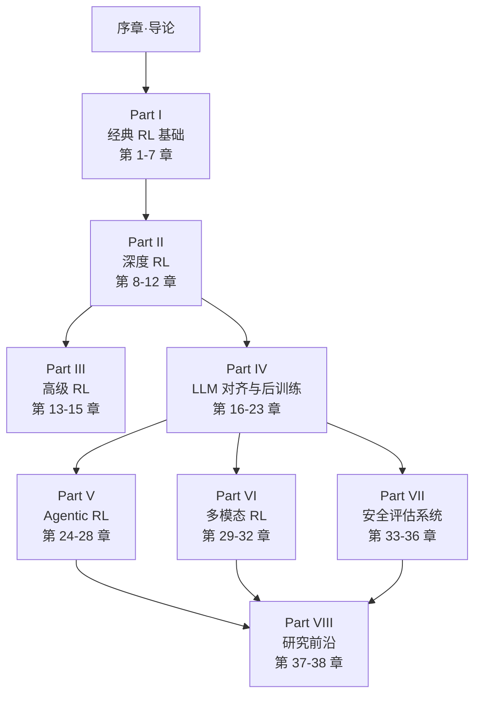

# 第 1 章 · 强化学习概览

> 你已经在[序章 0.1](../preface/intro) 训练过 CartPole，也看过 DPO、R1、SWE-Agent 这四个"未来剧透"。本章把那段直觉变成正式定义——**什么是 RL 问题、它和监督学习的根本差异、它在 2025-2026 的应用版图**——并把本书 8 个 Part 的脉络串起来。

## 1.1 从序章的直觉到形式化定义

序章用"教小孩骑自行车"建立了对 RL 的直觉：智能体在环境中行动、观察后果、调整行为。本章把它变成精确的数学对象。

一个**强化学习问题**由五个要素定义：

| 要素 | 符号 | 含义 | CartPole 例子 |
|------|------|------|--------------|
| 状态空间 | $\mathcal{S}$ | 环境所有可能的状态 | 杆子角度、角速度、小车位置、速度 |
| 动作空间 | $\mathcal{A}$ | 智能体能选的动作 | $\{\text{左}, \text{右}\}$ |
| 转移函数 | $P(s'\mid s,a)$ | 在状态 $s$ 做动作 $a$ 后转到 $s'$ 的概率 | 物理仿真器决定 |
| 奖励函数 | $R(s,a)$ 或 $r_{t+1}$ | 智能体收到的标量反馈 | 杆子还直立：+1；倒了：0（回合结束） |
| 折扣因子 | $\gamma \in [0,1)$ | 未来奖励的衰减系数 | 通常取 0.99 |

把它们组合起来就得到了**马尔可夫决策过程（MDP）**的形式化定义：$\mathcal{M} = (\mathcal{S}, \mathcal{A}, P, R, \gamma)$。第 4 章会专门讨论 MDP，这里只需要建立直觉。

智能体的行为由**策略（Policy）** $\pi$ 决定：$\pi(a\mid s)$ 表示在状态 $s$ 下选动作 $a$ 的概率。RL 的目标就是找到最优策略 $\pi^*$，使得**累积折扣回报**的期望最大：

$$\pi^* = \arg\max_\pi \mathbb{E}_\pi\left[\sum_{t=0}^{\infty} \gamma^t r_{t+1}\right]$$

这个目标看似简单，但它涵盖了从下棋到对话生成的所有决策问题。

## 1.2 智能体-环境-奖励-状态的核心循环

强化学习的交互过程是一个不断重复的循环：

  

1. 智能体观察到当前状态 $s_t$
2. 根据策略 $\pi$ 选择动作 $a_t \sim \pi(\cdot \mid s_t)$
3. 环境执行动作，按 $P(\cdot \mid s_t, a_t)$ 转移到新状态 $s_{t+1}$
4. 环境返回奖励 $r_{t+1} = R(s_t, a_t)$
5. 回到第 1 步

循环产出一条**轨迹**：$\tau = (s_0, a_0, r_1, s_1, a_1, r_2, \ldots)$。整本书的所有算法，本质上都是如何从轨迹中学习一个好的 $\pi$。

### 三个关键区分

**状态 vs 观测。** 状态 $s$ 是对环境的完整描述（如国际象棋棋盘的 64 格布局），观测 $o$ 是部分描述（如超级马里奥角色附近的局部画面）。当智能体能看到完整状态时，称为**完全可观测**（MDP）；只能看到部分状态时，称为**部分可观测 MDP（POMDP）**——这是 LLM 多轮对话和真实机器人任务的实际场景。

**离散 vs 连续动作空间。** 离散动作可数（Atari 的手柄方向、LLM 的 token），适合用 Q-Learning 或策略梯度的 softmax 输出；连续动作不可数（机械臂关节角度、自动驾驶方向盘转角），需要高斯策略或 DDPG/TD3/SAC 等专门算法。第 12 章专门讲连续控制。

**回合制 vs 连续任务。** CartPole、Atari、围棋都是回合制——有明确的"开始"和"结束"；自动驾驶、推荐系统、对话 Agent 则是连续任务——理论上永不结束。两类任务的奖励设计和评估方式不同。

## 1.3 现代应用版图

RL 在 2025-2026 已经从游戏和控制走出，覆盖四大应用方向：

| 方向 | 代表系统 | 本书章节 |
|------|---------|---------|
| **游戏与博弈** | AlphaGo、AlphaZero、MuZero、OpenAI Five | 第 8 章 DQN + 第 12 章 AlphaZero |
| **机器人与具身智能** | RT-2、π0、Gemini Robotics 1.5、OpenVLA | 第 31 章 VLA |
| **LLM 对齐与推理** | InstructGPT、DeepSeek-R1、Claude Opus 4.6、Qwen3 | 第 16-21 章 + 第 33 章 |
| **Agentic 系统** | Claude Computer Use、SWE-Agent、Deep Research、AutoGLM | 第 24-28 章 |

每条线背后都有 RL 算法的演进：

- 游戏：从 Q-Learning 到 DQN（2013）到 AlphaZero（2017）——推动深度 RL 的崛起
- 机器人：从 LQR / MPC 到 RL + Sim-to-Real，再到 VLA + RL
- LLM：从 RLHF（2022）到 DPO（2023）到 GRPO + RLVR（2024-2025），再到 R1-Zero 范式
- Agent：从 ReAct 到 ToolFormer 到 SWE-RL（2025）再到 Self-play SWE-RL

本书的章节安排紧跟这条演进线：Part I-II 经典与深度 RL 是公共基础，Part IV-VI-VII 分别覆盖 LLM、Agent、多模态、安全评估这些现代应用。

## 1.4 RL 与监督学习的根本区别

为什么 LLM 不能直接用监督学习训练成"智能助手"？为什么机器人不能像图像分类那样标注好"正确动作"？答案在 RL 与监督学习的三个根本差异上。

**差异一：反馈是评估性的，不是指导性的。**

监督学习给的是"标准答案"：这张图是猫，那个 token 之后应该接"是"。智能体照着学就行。RL 给的只是"分数"：这一步得了 +1，那一步得了 -10，但**不告诉智能体本来应该怎么做**。智能体必须自己探索：刚才到底是哪里做错了？

这个差异在 LLM 对齐中尤为关键。你无法为"什么是有礼貌的回答"标注标准答案——礼貌是相对的、上下文相关的。但你可以用 RM 给候选回答打分，让模型自己往高分方向优化。

**差异二：决策是序列化的，延迟奖励普遍。**

监督学习的样本是 i.i.d. 的——每张图片独立。RL 的轨迹是序列化的——当前决策影响未来所有状态。更麻烦的是**延迟奖励**：下棋开局走错一步，可能到 200 手后才输；SWE-Agent 改错一个文件，可能到运行测试时才发现。

这就引出了**信用分配（Credit Assignment）**问题：最终输了，到底是哪一步走错了？这是 RL 的核心难题，也是第 6 章 DP/MC/TD、第 10 章 Actor-Critic、第 21 章 PRM 解决的根本问题。

**差异三：数据分布随策略变化。**

监督学习的数据是固定的——MNIST 永远是那 6 万张图。RL 的数据由当前策略 $\pi$ 自己产生——策略变好，看到的状态分布也变了。这导致两个问题：

- **非 i.i.d.**：连续的轨迹高度相关，破坏了梯度下降的独立性假设
- **Covariate Shift**：策略更新后，旧数据失效（off-policy 问题）

第 7 章讲重要性采样、第 8 章讲经验回放、第 11 章讲 PPO 的 clip，本质上都在处理这两个问题。

## 1.5 本书结构与学习路径

本书按 8 个 Part 递进组织，每章相对独立但又有清晰的依赖关系：

### 三种读者的推荐路径

| 读者类型 | 推荐路径 | 时间投入 |
|---------|---------|---------|
| **ML 工程师**（想转 LLM 对齐） | 序章 → Part IV LLM 对齐 → Part V Agentic → Part VII 安全 | 2-3 个月 |
| **RL 背景读者**（想跟上 LLM 时代） | Part II 跳过 → Part IV GRPO/Reasoning → Part V Agentic → Part VIII 前沿 | 1-2 个月 |
| **学生**（从零系统学） | Part I-VIII 全程 + 附录数学基础 + 动手实验 | 6-12 个月 |

### 本书的写作承诺

- **先动手**：每章关键算法都配可运行代码（在 `code/` 目录），先看效果再讲原理
- **真实出处**：每个关键论点都标 arXiv 编号或公司技术报告链接，不编造
- **MIT 级别深度**：公式推导完整，算法对比充分，工业实战具体
- **覆盖中国实验室**：DeepSeek、Qwen、Kimi、智谱、字节、StepFun、MiniMax 的最新工作

---

下一章 [第 2 章 CartPole](../chapter01_cartpole/intro) 我们已经动手玩过——如果你直接跳到那里复现，没问题。但如果你想理解 CartPole 背后的 RL 理论，请继续到 [第 3 章 多臂老虎机](../chapter03_bandits/intro) 开始正式的算法学习。
