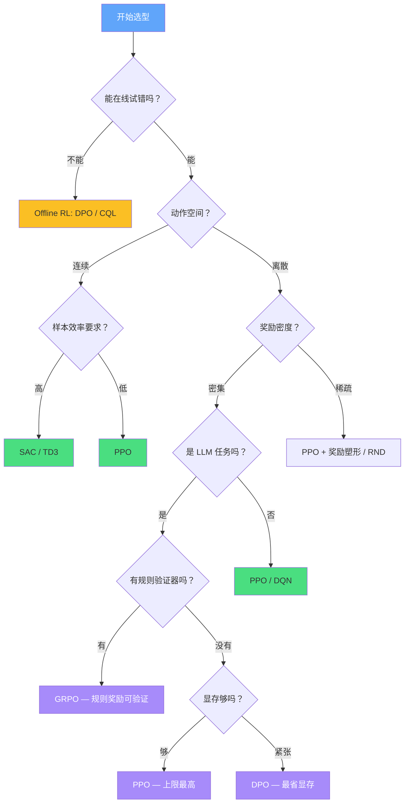

# C.1 算法选型决策

面对一个新项目，你脑海里应该先浮现一组问题：动作空间是离散还是连续？奖励是密集还是稀疏？能在线试错还是只能用历史数据？算力够不够？这些问题的答案直接决定了你应该选哪个算法。这一节我们用一张决策表、一个选型框架、五个常见错误来帮你快速锁定答案。

## 决策速查表

下面这张表覆盖了 12 种常见场景。当你遇到类似情况时，直接对照选型即可。

| #   | 场景                                | 推荐算法              | 核心理由                                      | 反面教材（不要用）           |
| --- | ----------------------------------- | --------------------- | --------------------------------------------- | ---------------------------- |
| 1   | 游戏控制，离散动作（CartPole 等）   | PPO / DQN             | 环境反馈密集，样本充足，两个都能用            | REINFORCE（方差太大）        |
| 2   | 游戏控制，连续动作（机器人仿真）    | PPO / SAC / TD3       | 连续空间需要高斯策略，SAC 样本效率最高        | DQN（无法处理连续动作）      |
| 3   | 小模型（< 3B）快速对齐              | DPO                   | 实现简单，只需偏好数据，显存友好              | PPO（杀鸡用牛刀）            |
| 4   | 大模型（7B+）精细人类偏好对齐       | PPO                   | 奖励模型精细可调，上限最高                    | DPO（受静态数据限制）        |
| 5   | 推理增强（数学/代码，规则可验证）   | GRPO                  | 规则奖励不需要 RM，Critic 可省，组内比较稳定  | DPO（缺乏在线探索）          |
| 6   | 多模态 RL（VLM 对齐）               | GRPO / PPO            | 组内比较天然适合异构输入                      | DPO（标注成本太高）          |
| 7   | 稀疏奖励环境（Montezuma's Revenge） | Go-Explore / RND      | 需要显式的探索机制，内在好奇心驱动            | 裸 PPO（几乎学不到东西）     |
| 8   | 离线 RL（只用历史数据，不在线试错） | DPO / CQL             | DPO 是 LLM 领域的离线算法，CQL 是通用离线算法 | PPO（需要在线交互）          |
| 9   | 多智能体协作/竞争                   | MAPPO / QMIX          | 需要考虑其他智能体的行为                      | 单智能体 PPO（忽略交互）     |
| 10  | 实时推理控制（延迟敏感）            | DQN / 轻量策略        | Q 网络推理只需一次前向，比 PPO 快             | PPO（需要采样多个动作）      |
| 11  | 高维视觉输入（Atari 等）            | Rainbow DQN / PPO+CNN | 需要卷积编码器提取特征                        | 线性 Q-learning              |
| 12  | 安全关键场景（自动驾驶/医疗）       | Conservative RL       | 必须限制策略偏离安全区域                      | 无约束 PPO（可能探索危险区） |

::: tip 没有"最强算法"
每个算法都有它最擅长的问题类型。PPO 通用但不是万能的——在推理增强上 GRPO 更合适，在小模型对齐上 DPO 更简单。选型的核心原则是：**问题特征决定算法，而不是"哪个火用哪个"。**
:::

## 五维度选型框架

速查表覆盖了常见场景，但你的项目可能不在表里。这时候需要一个系统化的思考框架。我们按五个维度逐一分析。

### 维度一：动作空间——离散 vs 连续

这是最基础的分水岭。回顾第 4 章，DQN 的核心假设是：遍历所有可能的动作，给每个动作算一个 Q 值，取最大的。当动作是离散的（左/右、上/下）且数量有限时，这没问题。但当动作是连续的（方向盘转角 0~360 度、油门 0~100%），你不可能穷举所有动作——此时必须用策略梯度方法（PPO/SAC/TD3），直接输出动作的连续值。

```python
# 根据动作空间快速选型
def select_by_action_space(n_actions: int, is_continuous: bool):
    """根据动作空间类型选择算法"""
    if is_continuous:
        # 连续动作 → 必须用策略梯度
        return ["SAC", "TD3", "PPO"]  # SAC 样本效率最高
    elif n_actions <= 10:
        # 少量离散动作 → DQN 和 PPO 都行
        return ["PPO", "DQN"]  # PPO 更稳定，DQN 更简单
    elif n_actions <= 1000:
        # 大量离散动作（如 LLM 词表）→ 策略梯度
        return ["PPO", "GRPO", "DPO"]
    else:
        # 超大动作空间 → 策略梯度，可能需要层次化方法
        return ["PPO", "GRPO"]
```

### 维度二：奖励信号——密集 vs 稀疏

密集奖励（每一步都有反馈，如 CartPole 的 +1/步）让几乎所有算法都能工作。稀疏奖励（只有达成目标才有反馈，如围棋的胜负只在最后才揭晓）是 RL 的真正硬骨头。

回顾第 3 章的老虎机实验——每选择一次就立刻知道结果，这是最密集的奖励。但 Montezuma's Revenge 这种游戏，智能体可能要执行几百个正确的动作才能拿到第一个正反馈。在这种情况下，裸 PPO 几乎学不到任何东西——因为绝大多数轨迹的 Reward 都是 0，策略梯度也是 0，模型不知道该往哪走。

解决方案是**奖励塑形**（设计中间奖励）或**内在动机**（好奇心驱动的探索，如 RND、ICM）。

### 维度三：样本效率——On-policy vs Off-policy

这是第 4 章和第 5 章两条路线的根本分歧点。

| 属性       | On-policy（PPO/GRPO） | Off-policy（DQN/SAC/TD3）      |
| ---------- | --------------------- | ------------------------------ |
| 数据复用   | 只能用一次，采完即丢  | 存入 replay buffer，反复复用   |
| 样本效率   | 低（需要大量采样）    | 高（同样数据量学得更多）       |
| 训练稳定性 | 高（数据分布一致）    | 中（旧数据和新策略分布不一致） |
| 工程复杂度 | 低（实现简单）        | 高（replay buffer + 目标网络） |
| 典型代表   | PPO、GRPO、REINFORCE  | DQN、SAC、TD3                  |

为什么大模型对齐几乎都用 On-policy 的 PPO 或 GRPO？因为 LLM 的"环境"就是模型自身——每次策略更新后，生成分布就变了，旧数据立刻过时。DQN 的 replay buffer 在这里帮不上忙。

### 维度四：在线 vs 离线

你能让智能体在环境中试错吗？如果能（游戏、仿真、LLM 推理），就用 Online RL（PPO/GRPO）。如果不能（医疗、自动驾驶、工业推荐），就只能用 Offline RL（DPO/CQL）。

这个维度在第 8 章的 DPO 讨论中已经涉及：DPO 本质上是一种极其成功的 Offline RL 算法——它完全不需要在线交互，只用固定的偏好数据集就能训练。代价是它无法发现训练数据之外的更好策略。

### 维度五：计算资源

| 显存预算  | 推荐方案                                |
| --------- | --------------------------------------- |
| 单卡 24GB | DPO + LoRA（7B 模型可行）               |
| 单卡 80GB | GRPO + LoRA（7B 模型），DPO（13B 模型） |
| 4×80GB    | PPO + LoRA（7B），DPO（70B）            |
| 8×80GB+   | PPO 全参数（7B），PPO + LoRA（70B）     |

### 选型决策树

把五个维度合并成一张决策树：



## 常见选型错误（Top 5）

学完十几个算法后，最常见的错误不是"不知道选哪个"，而是"什么都用最热门的那个"。以下是五个高频踩坑：

**错误 1：用 DQN 处理连续动作空间。** DQN 只能对有限个离散动作计算 Q 值。如果你的动作是连续的（如方向盘角度），需要离散化——但粗粒度丢失精度，细粒度动作数爆炸。正确做法是直接用 PPO/SAC/TD3。

**错误 2：在数据量不足时用 PPO。** PPO 是 on-policy 算法，采完的数据只能用一次。如果你的环境交互成本高（如真实机器人），PPO 会需要极多的采样。此时 off-policy 的 SAC 或 offline 的 CQL 更合适。

**错误 3：用 DPO 做需要在线探索的任务。** DPO 只能用固定的偏好数据集训练。如果你的任务需要策略在环境中不断试错来发现更好的行为（如数学推理中的多种解法），DPO 无法提供这种探索能力。此时 GRPO 或 PPO 是更好的选择——回顾第 8 章的 RLVR 实验，GRPO 通过组内采样和比较，天然具备探索能力。

**错误 4：忽视环境特性直接选"最强算法"。** 没有万能算法。确定性的环境适合 DQN（不需要估计转移概率），随机性的环境适合 PPO（策略天然处理随机性）。密集奖励用什么都行，稀疏奖励必须加探索机制。

**错误 5：什么都用 PPO，因为"PPO 最稳定"。** PPO 确实是最通用的算法之一，但它不是免费的——PPO 需要四个模型（回顾附录 A 的显存分析），在显存有限的场景下可能根本跑不起来。如果你的场景允许离线训练且数据充足，DPO 的实现复杂度和显存需求都低得多。同样的道理，PPO 也需要更多的超参数调优（clip ε、KL 系数、GAE λ 等），如果工程资源有限，调参本身就是一个巨大的成本。

### 一个真实的选型案例

假设你要做一个"AI 数学辅导助手"——模型需要根据学生的提问，生成有启发性的解题引导。这个项目的选型过程可以是：

```python
# 真实案例：AI 数学辅导助手的选型分析
task_analysis = {
    "action_space": "离散（LLM token 生成）",
    "reward_signal": "可规则化验证（解题步骤是否正确）",
    "sample_efficiency": "on-policy 可接受（推理生成成本低）",
    "online_offline": "可以在线试错（生成回答没有安全风险）",
    "compute": "单台 4×A100 机器",
}

# 推理过程：
# 1. 动作离散且超大（词表）→ 排除 DQN，用策略梯度
# 2. 奖励可规则验证（答案对/错）→ GRPO 适合，不需要 RM
# 3. 可以在线试错 → 排除纯离线方法（CQL）
# 4. 4×A100 → 显存充足，PPO 和 GRPO 都可行
# 5. 结论：首选 GRPO（省掉 Critic，实现更简单）

# 如果奖励不可规则化（如"回答的语气是否友好"），则改用 PPO
```

这个分析过程完全遵循五维度框架，最终锁定 GRPO 作为首选——因为它在这个场景下兼具效率和简洁性。

```python
# 选型自查清单
def algorithm_sanity_check(task_type, algorithm, config):
    """在确定算法前，用这个函数做一次自查"""
    warnings = []

    if "continuous" in task_type and algorithm in ["DQN", "QR-DQN"]:
        warnings.append("错误：DQN 不支持连续动作空间！用 SAC/TD3/PPO")

    if algorithm == "PPO" and config.get("data_mode") == "offline":
        warnings.append("警告：PPO 是 on-policy 算法，不适合纯离线训练！考虑 DPO/CQL")

    if algorithm == "DPO" and config.get("needs_exploration", False):
        warnings.append("警告：DPO 没有在线探索能力！考虑 GRPO/PPO")

    if algorithm == "PPO" and config.get("gpu_memory_gb", 0) < 40:
        warnings.append("警告：PPO 需要 4 个模型，显存可能不够！考虑 DPO/GRPO + LoRA")

    if config.get("sparse_reward") and algorithm in ["PPO", "DQN"]:
        warnings.append("警告：稀疏奖励需要额外的探索机制！考虑 RND/Go-Explore")

    for w in warnings:
        print(f"⚠️  {w}")
    return warnings
```

<details>
<summary>思考题：GRPO 能完全替代 PPO 吗？</summary>

不完全能。GRPO 的核心优势在于"不需要 Critic"——它用组内均值替代价值函数作为基线。这在奖励可以规则化验证的场景（数学、代码）中非常高效。但在人类偏好对齐的场景中，PPO 的 Critic 网络能提供更精细的 token-level 信用分配，这是 GRPO 的组级归一化做不到的。

回顾第 8 章，DeepSeek-R1 使用 GRPO 是因为推理任务的奖励可以精确验证（答案对或不对）。但在 ChatGPT 的对话质量优化中，OpenAI 仍然使用 PPO——因为"好的对话"是一个更复杂、更细微的信号，需要 Critic 的精细估计。所以这两个算法不是替代关系，而是互补关系。

</details>

---

## 小结

选型的核心逻辑是：**让算法去适配问题，而不是让问题去适配算法**。先用五维度框架定位问题特征，再用决策速查表锁定候选算法，最后用自查清单确认没有踩坑。

选对了算法，下一步就是选对工程框架——如何把算法变成可跑的训练系统？请看下一节：[三层架构与 MBRL](./framework-mbrl)。
