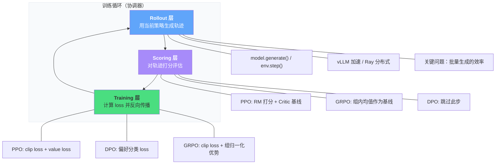

# C.2 三层架构与 RL 训练框架

上一节我们解决了"选哪个算法"的问题。但算法只是一堆数学公式——怎么把它变成一个真正能跑的训练系统？这就需要工程框架。本节先拆解现代 RL 框架的三层架构（Rollout → Scoring → Training），再对比主流框架的选型，最后给出和具身智能章节中 MBRL 子文章的衔接。

## 三层架构：Rollout → Scoring → Training

回顾第 2 章的 DPO 实验，你用 `DPOTrainer` 不到 50 行代码就跑通了对齐。但框架底层做了什么？如果你去看 HuggingFace TRL、OpenRLHF、veRL 等框架的源码，会发现它们都遵循同一个抽象：**三层架构**。



### 第一层：Rollout（生成层）

Rollout 层的任务很直接：用当前的策略模型对一批 prompt 生成回答（或者在传统 RL 中，用策略与环境交互收集轨迹）。对应代码就是 `model.generate()` 或 `env.step()`。

但这一层的工程挑战不小。首先，**批量生成的效率**是瓶颈——LLM 的自回归生成是串行的（一个 token 一个 token 地生成），在 PPO 的每个更新步骤之前都需要重新生成一批完整回答。如果没有优化，Rollout 可能占总训练时间的 70% 以上。

主流的解决方案是 **vLLM 加速**（通过 PagedAttention 和连续批处理提升生成吞吐量）和 **Ray 分布式**（把生成任务分配到多个 GPU 上并行）。在 veRL 框架中，Rollout 和 Training 甚至可以分配到不同的 GPU 组上——用专门的推理卡做生成，训练卡做梯度更新，互不干扰。

### 第二层：Scoring（评估层）

生成完回答后，需要给每个回答打分。不同算法的打分方式截然不同：

**PPO 的 Scoring 最复杂**：先用 Reward Model 对每个回答打分（得到 $r$），再用 Critic 网络估计每个状态的价值（得到 $V(s)$），最后计算优势函数 $\hat{A} = r - V(s)$。回忆第 6 章的 GAE（Generalized Advantage Estimation），它把多步的 TD Error 做指数加权平均来得到更稳定的优势估计。

**GRPO 的 Scoring 更轻量**：不需要 Critic 网络！它对同一个 prompt 生成一组回答（通常 4~16 个），用 Reward Model 打分后，直接用组内均值作为基线：$\hat{A}_i = (r_i - \mu_{group}) / \sigma_{group}$。这就是第 8 章里 GRPO 能省掉 Critic 的秘密。

**DPO 直接跳过 Scoring**：它的损失函数直接在偏好对（chosen vs rejected）上计算，不需要任何在线评分。这也是 DPO 工程上最简单的原因——少了两层（Rollout 和 Scoring），只需要做 Training。

```python
# 三种算法的 Scoring 层对比
def scoring_ppo(responses, prompts, reward_model, critic):
    """PPO: RM 打分 + Critic 基线"""
    rewards = reward_model.score(prompts, responses)      # RM 打分
    values = critic.estimate(prompts, responses)           # V(s) 估计
    advantages = rewards - values                          # A = R - V
    return advantages

def scoring_grpo(responses, prompts, reward_model, group_size=8):
    """GRPO: 组内均值作为基线（不需要 Critic）"""
    # 对每个 prompt 生成 group_size 个回答
    all_rewards = []
    for prompt in prompts:
        group_rewards = []
        for resp in responses[prompt]:  # 该 prompt 的 group_size 个回答
            group_rewards.append(reward_model.score(prompt, resp))
        group_rewards = torch.tensor(group_rewards)
        # 组内归一化
        advantages = (group_rewards - group_rewards.mean()) / (group_rewards.std() + 1e-8)
        all_rewards.append(advantages)
    return all_rewards

def scoring_dpo(chosen, rejected):
    """DPO: 不需要 Scoring 层，直接用偏好对"""
    return chosen, rejected  # 损失函数内部处理
```

### 第三层：Training（梯度更新层）

拿到分数后，就是计算 loss 并反向传播。这一层的核心挑战是**显存管理**——尤其是 PPO 需要同时维护四个模型（Actor、Critic、Reference、Reward Model）。回顾附录 A 的显存分析，7B 模型的 PPO 训练需要约 110GB 显存（bf16），必须用 LoRA + 梯度检查点才能在单卡上跑起来。

三个算法的 loss 对比：

| 算法 | Loss 组成                                              | 关键机制            |
| ---- | ------------------------------------------------------ | ------------------- |
| PPO  | clip loss + value loss + entropy bonus                 | 信任域裁剪 + GAE    |
| DPO  | $\log \sigma(\beta(\log \pi_\theta - \log \pi_{ref}))$ | 隐式奖励，无需 RM   |
| GRPO | clip loss + 组归一化优势                               | 无 Critic，组内比较 |

三层架构的价值在于：不管你用哪个算法，Rollout 和 Scoring 的基础设施可以复用。veRL 框架正是基于这个思路设计的——你只需要替换 Scoring 和 Training 层的实现，就能从 PPO 无缝切换到 GRPO。

---

## 框架选型：四大框架对比

有了三层架构的认知，我们来看看主流 RL 训练框架的差异。

| 框架              | 核心定位              | 支持算法              | 分布式方案     | 适合场景                       |
| ----------------- | --------------------- | --------------------- | -------------- | ------------------------------ |
| **veRL**          | 灵活的 RL 训练框架    | PPO, GRPO, DPO 等     | FSDP + Ray     | 研究实验，需要快速切换算法     |
| **LLaMA-Factory** | 一站式微调平台        | SFT, DPO, PPO, KTO    | DeepSpeed      | 快速上手，不需要深度定制       |
| **DeepSpeed**     | 底层分布式训练引擎    | 通用（需要自己写 RL） | ZeRO + 3D 并行 | 大规模生产训练，极致性能       |
| **Megatron-LM**   | NVIDIA 大模型训练框架 | 通用（需要自己写 RL） | TP + PP + DP   | 超大规模（70B+），GPU 集群训练 |

```python
# 不同框架的使用模式对比

# === LLaMA-Factory：最简单，配置文件驱动 ===
# 只需要一个 yaml 配置文件
"""
### dpo_config.yaml
model_name_or_path: meta-llama/Llama-2-7b-chat-hf
stage: dpo
dataset: dpo_mix7k
lora_rank: 16
bf16: true
"""
# 命令行一行启动：llamafactory-cli train dpo_config.yaml

# === veRL：最灵活，代码级控制 ===
from verl import PPOTrainer, GRPOTrainer

# 自定义 Rollout、Scoring、Training 的每一层
trainer = GRPOTrainer(
    actor_model="Qwen/Qwen2-7B",
    reward_model="path/to/rm",
    group_size=8,           # 每个 prompt 生成 8 个回答
    lora_rank=16,
    # 可以精细控制每一层的超参数
)
trainer.train()

# === DeepSpeed：最底层，需要自己组装 ===
import deepspeed
# 需要自己写训练循环、管理模型分片
# 适合需要极致性能优化的场景
```

**选型建议**：如果你刚起步，用 LLaMA-Factory 快速跑通实验；如果你需要做算法研究（比如对比 PPO 和 GRPO 的效果），用 veRL；如果你在做超大规模生产训练，直接上 DeepSpeed 或 Megatron-LM。

---

## 延伸阅读：基于模型的 RL（MBRL）

基于模型的 RL 已经拆成第 12 章的独立小节：[12.2 Model-Based RL：从 Model-Free 到 Model-Based](../chapter12_future_trends/embodied-intelligence/model-based-rl/)。

这个主题更适合放在具身智能章节中展开：MBRL 的核心动机是减少真实交互、学习世界模型、在模型中做规划或想象训练，这些问题和机器人控制、Sim-to-Real、视频世界模型的关系更紧密。

---

## 小结

三层架构（Rollout → Scoring → Training）是理解所有现代 RL 框架的钥匙。不管你用 PPO、DPO 还是 GRPO，底层都是这三个阶段的循环——区别只在于每个阶段的具体实现。框架选型方面：LLaMA-Factory 适合快速上手，veRL 适合算法研究，DeepSpeed/Megatron-LM 适合大规模生产。

如果你的任务从文本和游戏走向物理世界，再继续阅读第 12 章的 MBRL 子文章。那里会把“世界模型、想象轨迹、规划搜索”这些概念放回具身智能的语境中讨论。

至此，附录 C 的算法选型指南就结束了。当你面对一个新项目时，回到本附录的决策速查表和五维度框架，你就知道该选哪个算法、用哪个框架了。
