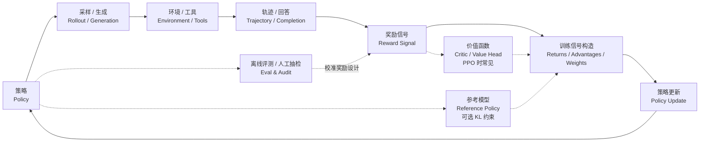

# 强化学习训练调试指南

你已经写过 DQN、Actor-Critic、PPO，也看过 RLHF、GRPO 和 Agentic RL 的训练流程。到这里，一个很自然的问题会出现：

> 为什么同样一段算法，论文里能跑，别人的代码能跑，自己一改环境、一换奖励、一放大模型，就开始不稳定？

这不是你一个人的问题。强化学习的难点从来不只是“公式推不推得出来”，而是训练本身是一个会反过来改变数据分布的闭环：策略在变，采样数据在变，奖励模型可能有偏，价值函数也在追着一个移动目标跑。监督学习里，一个 batch 出错通常只影响一次梯度；RL 里，一个坏策略会采集坏数据，坏数据再训练出更坏的策略。

所以本附录不是“常见报错大全”，也不只讲四个故障。它是一节调试课：我们先建立一个心智模型，再沿着这个模型去看各种训练异常。

学完这一节，你应该能回答三个问题：

1. 训练曲线出问题时，应该先怀疑哪个环节？
2. Reward、Loss、KL、Entropy、Value Loss、显存、评测分数这些指标之间是什么关系？
3. 面对一个不稳定的 RL 实验，怎样小步排查，而不是凭感觉乱调参？

## 从闭环看训练

先画一个抽象闭环。注意，它不是某个具体框架的实现图，也不是说所有现代 LLM RL 都必须长这样；它只是帮你看清楚：一次 RL 训练大体会经历“生成行为 → 打分 → 构造训练信号 → 更新策略”这几个环节。



这个图里任何一环坏掉，最后都可能表现成“reward 不涨”。但修法完全不同。

这里要区分三件事。

**奖励信号**是训练时实际计算出来的分数。它可能来自环境本身、手写奖励函数、reward model、verifier，或者几项规则的加权组合。

**训练信号构造**是把奖励变成“这次更新到底该鼓励什么、压低什么”。在 PPO / Actor-Critic 里，它通常表现为 return、value target 和 advantage；这里的 advantage 可以粗略理解成“这个动作或回答比当前预期好多少”。如果实际回报比 Critic 预估的价值更高，advantage 为正，策略会更倾向于重复这种行为；反之就会被压低。在 GRPO / RLVR 里，常见做法不是训练一个 Critic，而是对同一个 prompt 采样多条回答，用组内 reward 的相对高低构造 advantage-like 的训练权重。TRL 的 GRPO 文档也把流程拆成生成、计算 advantage、估计 KL、计算 loss，但这个 advantage 来自组内 reward 归一化，不是 Critic 预测出来的[^trlgrpo]。

**评测和人工抽检**是旁路监督。它用于挑 checkpoint、发现 reward hacking、决定是否回滚，正常情况下不直接进入梯度更新。评测结果可以反过来提醒你“奖励设计错了”，但它不等于训练时那条 reward signal。

所以，这张图更适合作为“统一调试地图”，不是“现代 Agentic RL 的唯一流程”。PPO-RLHF 会更像图中的 Critic + KL 版本；GRPO/RLVR 会更像“多条生成 + reward/verifier + 组内相对优势”的版本；Agentic RL 则把一次回答扩展成多步工具轨迹，奖励可能来自最终环境状态、规则 verifier 或人工/模型评审。如果环境接线错了，调学习率没有用；如果奖励函数被钻空子，继续训练只会让模型更会作弊；如果 Critic 学不动，PPO 的 advantage 就会像噪声；如果 KL 飙升，说明策略已经离开了可信区域；如果评测协议被污染，所有漂亮曲线都可能只是错觉。

::: tip 先记住一句话
RL 调试的第一原则不是“调参数”，而是“定位闭环里哪一环先坏了”。
:::

## 训练异常的初步诊断

训练异常出现时，最常见的错误处理方式是立即调整超参数。例如降低学习率、增大 batch size、增加 KL 系数，或者继续训练更多步。这样做看似积极，但它会引入新的变量，使原始问题更难定位。

本节介绍一个更适合课程实验和研究复现的初步诊断流程。它的目标不是立刻修复训练，而是先判断异常来自哪个环节：实验配置、评测协议、奖励信号、模型输出，还是优化过程本身。

### 记录实验上下文

首先记录本次实验的基本上下文，包括配置文件、随机种子、代码版本、checkpoint、训练日志和评测命令。强化学习实验对随机种子和实现细节非常敏感，同一个算法设定在不同 seed 下可能表现出明显差异[^drltm]。如果这些信息没有保存，后续分析就很难区分“算法确实不稳定”和“实验条件发生了变化”。

### 区分训练指标与评测指标

训练 reward 只能说明模型正在优化某个奖励信号，不能直接说明任务能力提升。一个更可靠的观察方式，是同时区分三类信息：

- **训练指标**：例如训练 reward、policy loss、KL、entropy 等，用来观察优化过程是否稳定。
- **评测指标**：例如 held-out benchmark、私有测试集、任务成功率，用来判断能力是否提升。
- **行为样本**：模型或 agent 的实际输出，用来判断它是否学到了错误模式。

例如，在 RLHF 训练中，如果 reward 上升而评测分数不变，同时回答长度持续增加，这通常不应解释为“训练还不够久”，而应怀疑奖励信号中存在长度偏好。

### 检查模型输出样本

曲线是对训练过程的压缩表示，样本则能暴露具体行为。诊断时至少应检查三类样本：高 reward 样本、低 reward 样本，以及最新 checkpoint 的随机样本。

在语言模型训练中，reward hacking 往往先表现为文本风格变化：回答更长、格式更复杂、礼貌用语更多，但信息密度下降。在 Agentic RL 中，也可能表现为工具调用次数增加，但最终环境状态没有真正完成任务。

### 构造最小复现实验

在确认日志和样本后，应将实验缩小到一个可快速运行的版本：更小的模型、更小的 batch、更少的 prompt、更短的训练步数。最小复现实验不追求最终分数，而是回答基础问题：

- 实现是否能在简单设定下学习；
- reward 是否具有区分度；
- 评测协议是否稳定；
- 如果使用 PPO/Actor-Critic，价值函数是否能拟合固定 rollout；
- 如果使用 GRPO/RLVR，同一 prompt 下多条回答的 reward 排序是否合理。

许多 RL 错误不会立刻导致程序崩溃。例如 `done` mask 写错、奖励符号反了、padding token 参与了 loss、评测 temperature 改变，都可能让训练正常结束，但最终学到错误行为。因此，在大规模训练前先完成最小复现，是调试流程中非常重要的一步。

## 诊断顺序

后续各节会分别讨论不同类型的训练问题。实际诊断时，建议按照由外到内的顺序排查。

首先检查环境和数据。智能体看到的状态是否正确，动作是否被环境正确执行，终止信号是否处理正确，奖励符号是否符合预期。如果这一层存在错误，后续算法更新只是在错误数据上进行优化。

其次检查评测协议。采样温度、最大输出长度、工具权限、测试集划分等设置如果发生变化，评测结果就不能直接比较。公开测试集如果被反复用于调参，也会逐渐失去评估意义。

再次检查奖励信号。奖励是否过于稀疏，是否存在极端高分样本，是否与人工判断或独立评测一致。如果奖励信号不可信，训练越充分，模型越可能朝错误方向优化。

最后再进入算法内部。PPO 需要检查策略更新是否过大；带 Critic 的方法需要检查价值函数是否有效；GRPO/RLVR 需要检查组内 reward 比较是否合理；Agentic RL 还需要检查工具轨迹与最终环境状态是否一致。

这样的顺序可以避免一次性怀疑所有模块。先判断异常大致属于哪一层，再进入对应章节做更细的排查。

## 环境与数据 与 先确认世界是真的

强化学习最容易被忽略的 bug，往往在算法之前。

比如 CartPole 的 action 是离散的 0/1，但你把连续动作传了进去；比如 MuJoCo 环境里动作范围是 `[-1, 1]`，策略输出没有经过 tanh；比如对话训练里 padding token 没有 mask 掉，模型在“学习”填充位置；比如 agent 任务里工具返回失败，却被当成成功轨迹写进训练集。

这些问题的共同特点是：训练可以跑，曲线也会动，但曲线没有意义。

### 最小单测

在正式训练前，至少做四个检查：

```python
def sanity_check_env(env, policy):
    obs, info = env.reset(seed=0)
    assert obs is not None

    action = policy.sample(obs)
    next_obs, reward, terminated, truncated, info = env.step(action)

    assert next_obs is not None
    assert isinstance(float(reward), float)
    assert isinstance(terminated, bool)
    assert isinstance(truncated, bool)

    return {
        "reward": reward,
        "done": terminated or truncated,
        "info_keys": list(info.keys()),
    }
```

然后做一个更土但很有效的测试：用随机策略跑 100 条轨迹，画 reward 分布。再用一个手写的“弱专家策略”跑 100 条轨迹。如果专家策略和随机策略没有明显差别，先不要训练模型，先查环境和奖励。

::: warning 常见接线错误
很多训练不收敛，其实不是算法问题，而是 reward sign 写反、terminal state 没处理、action scale 不匹配、observation normalization 漏了、或者数据集里的 chosen/rejected 反了。
:::

## 别让测试集变成训练集

RL 项目很容易“评测污染”。你可能没有把测试集放进训练数据，但你反复用测试集调 prompt、调 reward、调 KL 系数、挑 checkpoint，它就已经在参与训练决策了。

这在后训练和 Agentic RL 里尤其严重。模型可能没有真的变强，只是更适应某套公开 benchmark、某个 judge、某种输出格式。

一个讲义式的经验是：

| 集合            | 用途                 | 能不能频繁看   |
| --------------- | -------------------- | -------------- |
| smoke set       | 快速发现实现错误     | 可以           |
| dev set         | 调参数、调 reward    | 可以，但要记录 |
| public test     | 观察趋势             | 少看           |
| private test    | 发布门禁             | 尽量不看       |
| human audit set | 校准 reward 和 judge | 定期抽检       |

评测协议也要固定：temperature、top_p、max_tokens、prompt 模板、工具权限、超时规则、pass@1/pass@k 都要写清楚。ALE 的评测协议研究也提醒过这一点：环境随机性、起始状态和评测方式变化，会显著影响 RL 结论[^ale]。

## 不是有 reward 就能学

这里说的 reward 不是“奖励设计”这个动作，而是训练过程中每条 transition、每段回答或每条轨迹实际拿到的奖励信号。这个信号要同时满足两个条件：方向对，信号够密。

方向对，意思是 reward 真正在鼓励你想要的行为。信号够密，意思是模型在训练早期也能从 reward 里看出一点差别。如果 99.9% 的轨迹 reward 都是 0，策略梯度看到的就是一片沉默。

### 看 reward 分布

训练前先画 reward histogram，而不是直接开训。

| 分布形态         | 可能问题         | 处理                            |
| ---------------- | ---------------- | ------------------------------- |
| 几乎全 0         | 奖励太稀疏       | 加中间奖励、课程学习、增加探索  |
| 几乎全 1         | 奖励太宽松       | 提高任务难度、拆分评分维度      |
| 极端长尾         | 少数样本主导梯度 | reward clipping / normalization |
| 正负号混乱       | 奖励定义不清     | 回到样本逐条检查                |
| 与人工评分低相关 | proxy 不可信     | 重写 reward 或增加人工校准      |

在 PPO 里，reward 还会影响 advantage。reward 尺度过大时，advantage 会变成很尖的梯度信号，策略更新可能直接冲出信任域。许多高质量实现都会做 reward normalization、advantage normalization、gradient clipping，这些实现细节本身就会改变算法表现[^implementation][^whatmatters]。

## 模型学会了考试技巧

奖励黑客不是模型“不听话”，恰恰相反，是模型太会优化你给的指标。AI safety 文献里常把它叫做 specification gaming：系统满足了形式化目标，却违背了设计者的真实意图[^concrete][^weng]。

最经典的语言模型版本是：reward model 偏爱详细回答，于是模型开始写更长、更礼貌、更空洞的回答。Reward 一路上升，人工抽检却变差。Reward model overoptimization 的研究也显示，代理奖励可以继续变好，但真实偏好会在某个点后下降[^overopt]。

### 诊断三联征

奖励黑客通常有三个信号同时出现：

1. **Reward 上升**：训练面板看起来很好。
2. **副指标异常**：长度、重复率、格式模板、拒答率、工具调用次数发生系统性变化。
3. **真实评测下降**：人工抽检、私有集、任务成功率没有同步提升。

```python
def audit_reward_hacking(samples):
    suspicious = []
    for item in samples:
        if item["reward"] > 0.9 and item["human_score"] < 0.4:
            suspicious.append(("reward-human mismatch", item["id"]))
        if item["response_len"] > item["baseline_len"] * 2:
            suspicious.append(("length inflation", item["id"]))
        if item["repeat_ratio"] > 0.2:
            suspicious.append(("repetition", item["id"]))
    return suspicious
```

修复时，不要只加一个惩罚项就结束。更稳的做法是把 reward 拆开记录：准确性、约束满足、安全性、简洁性、格式、工具结果分别打分。RewardBench 这类工作也说明，reward model 本身需要评测，不能默认它永远代表人类偏好[^rewardbench]。

## PPO 的安全带也会失效

PPO 的核心直觉是“小步更新”。TRPO 用 KL 约束显式限制策略变化，PPO 用 clipped surrogate objective 近似这个目标[^trpo][^ppo][^spinningup]。但 clip 不是魔法护盾。

如果学习率太大、PPO epochs 太多、batch 太小、advantage 尺度异常，策略仍然可能一步跨得太远。

### 看三个指标

| 指标          | 怎么看                    | 异常时说明         |
| ------------- | ------------------------- | ------------------ |
| KL divergence | 新策略和旧/参考策略的距离 | 策略漂移过快       |
| clip fraction | 有多少样本被 clip         | PPO 正在频繁踩刹车 |
| entropy       | 策略还有多少随机性        | 过早收敛或退化随机 |

策略崩溃通常不是从 reward 开始的，而是从 KL、clip fraction、entropy 开始的。Reward 是后验症状。

```python
def ppo_guardrail(metrics):
    if metrics["kl"] > metrics["target_kl"] * 2:
        return "stop update: KL too high"
    if metrics["clip_fraction"] > 0.4:
        return "reduce lr or PPO epochs"
    if metrics["entropy"] < metrics["entropy_floor"]:
        return "increase exploration or KL constraint"
    return "continue"
```

在 RLHF 中，还要看相对 reference model 的 KL。InstructGPT 这类流程引入 KL penalty，就是为了让 RL 阶段不要把 SFT 学到的语言能力冲坏[^instructgpt]。

## Critic 与 PPO / Actor-Critic 里的故障源

这一节只针对带 Critic 或 value head 的方法，比如 Actor-Critic、PPO、部分 PPO-RLHF 实现。GRPO/RLVR 这类无 Critic 方法可以跳过这里，转而检查组内 reward、KL 和 loss 构造。

在 Actor-Critic 里，Critic 的工作是估计状态价值。它不直接输出动作，所以很多人调试时只看 policy loss。但 Critic 如果错了，advantage 就会错；advantage 错了，Actor 就会朝错误方向更新。

### Critic 坏掉的信号

| 信号                               | 说明                                |
| ---------------------------------- | ----------------------------------- |
| value loss 长期不降                | Critic 没拟合到回报                 |
| explained variance < 0             | 还不如预测均值                      |
| policy reward 震荡                 | Actor 被噪声 advantage 推来推去     |
| value prediction 尺度远小于 return | reward scale 或 value target 有问题 |

常见修法包括：降低 reward scale、归一化 return、调小/调大 critic learning rate、增大 critic 网络容量、检查 bootstrap target、检查 terminal mask。

一个很实用的检查是：固定一批 rollout，不更新 actor，只训练 critic，看它能不能把这批 return 拟合下来。如果拟合不了，先修 critic。

## 太确定和太随机都不行

探索问题有两种相反表现。

一种是 entropy 很快归零：模型过早相信某个动作或某种回答模板，卡在局部最优。另一种是 entropy 一直很高：策略像随机游走，reward 没有被吸收进参数。

| 表现                 | 可能原因                           | 修法                                 |
| -------------------- | ---------------------------------- | ------------------------------------ |
| entropy 快速归零     | 奖励过强、KL 太弱、温度太低        | 增加 entropy bonus、降低 lr、加强 KL |
| entropy 长期很高     | 奖励太稀疏、学习率太低、优势噪声大 | 奖励塑形、提高采样量、检查 advantage |
| 行为多样但没进步     | 探索没有被评价区分                 | 改 reward 或加 curriculum            |
| 行为单一但 reward 高 | 可能 reward hacking                | 抽样检查高 reward 轨迹               |

在语言模型里，探索不只是“动作随机性”，还包括回答长度、推理路径、工具选择、拒答/不拒答边界。只看 token entropy 不够，还要看行为层面的多样性。

## 数据新鲜度 与 on-policy 不是口号

PPO 是 on-policy 算法：它假设用于更新的数据来自“当前附近”的策略。训练中我们会保存 old logprob，就是为了知道新策略和采样策略差了多少。

如果 rollout worker 和 learner 不同步，或者 buffer 里混入很旧的数据，你会看到一种很奇怪的现象：loss 还能算，梯度还能走，但指标忽上忽下，clip fraction 也很难解释。

排查时问三个问题：

1. 每条 rollout 是否记录了生成它的 policy version？
2. 更新时使用的 old logprob 是否和采样策略一致？
3. rollout 进入训练前，策略已经更新了多少轮？

Agentic RL 更容易踩这个坑，因为一次轨迹可能很长，工具执行慢，采样和训练天然异步。不要只追求吞吐，也要控制数据陈旧程度。

## NaN 之前通常有预兆

NaN 很少是凭空出现的。它前面通常有 grad norm 尖峰、logprob 极端值、reward 离群、value loss 爆炸、混合精度溢出。

| 问题           | 检查                 | 修法                       |
| -------------- | -------------------- | -------------------------- |
| grad norm 尖峰 | p95 / max grad norm  | gradient clipping、降低 lr |
| logprob 极端   | 是否对 0 概率取 log  | clamp、检查 mask           |
| fp16 溢出      | loss scale、NaN step | bf16、动态 loss scaling    |
| reward 离群    | reward max/min       | clipping、normalization    |
| value 爆炸     | value target 分布    | return normalization       |

不要等到 loss 变 NaN 才停止训练。训练脚本应在关键指标越界时保存实验状态，并停止当前更新。

## 显存只是账本的一部分

RLHF/PPO 比普通 SFT 更吃资源，因为它可能同时需要 actor、critic、reference model、reward model，还要保存 rollout、logprob、value、advantage 和长序列激活。

显存主要来自四块：

| 来源       | 为什么占显存              | 常见处理                          |
| ---------- | ------------------------- | --------------------------------- |
| 模型权重   | 多个模型常驻              | 冻结、共享、分离 rollout/training |
| 优化器状态 | Adam 的一阶/二阶矩        | ZeRO、FSDP、8-bit optimizer       |
| 梯度       | 可训练参数越多越贵        | LoRA、冻结主干                    |
| 激活       | batch 和 seq_len 越大越贵 | checkpointing、缩短序列           |

ZeRO 把优化器状态、梯度和参数分片到多张卡上[^zero][^deepspeedzero]；FSDP 通过参数分片和按需 all-gather 降低单卡常驻内存[^fsdp]；LoRA 冻结主模型，只训练低秩适配器[^lora]。这些不是“高级优化”，而是大模型 RL 训练能不能启动的前提。

但资源问题不只有 OOM。吞吐下降、GPU 利用率低、rollout worker 等环境、reward model 打分成为瓶颈，都会让训练变慢、数据变旧，最后反过来影响算法稳定性。

## RLHF 与 Agentic RL 的额外陷阱

语言模型和 agent 的 RL，比经典控制多几类特殊故障。

| 场景       | 额外陷阱       | 例子                           |
| ---------- | -------------- | ------------------------------ |
| RLHF       | 长度偏好       | 回答越来越长，但信息密度下降   |
| RLHF       | 拒答偏移       | 安全 reward 太强，模型过度拒答 |
| RLHF       | judge 偏差     | LLM judge 偏好某种文风         |
| RLVR/GRPO  | 格式黑客       | 模型学会输出符合格式但推理错误 |
| Agentic RL | 工具黑客       | 反复调用工具刷过程分           |
| Agentic RL | 状态伪成功     | 文本说完成了，但环境状态没变   |
| Agentic RL | 长轨迹信用分配 | 最终失败很难归因到哪一步       |

因此，Agentic RL 的评测不能只看最终文本，要看环境状态、工具调用是否合法、步骤数、成本、失败恢复能力。RLHF 的评测不能只看 reward model，要同时看人工抽检、私有集、长度、重复率、安全回归和真实任务成功率。

## 一条完整排障路径

假设你看到：reward 上升，benchmark 不涨，输出越来越长。

不要马上说“训练不收敛”。沿闭环排查：

1. **评测协议**：benchmark 的 temperature、max_tokens 是否和基线一致？
2. **样本抽检**：最高 reward 样本是否更长、更空、更模板化？
3. **奖励分解**：reward 里是否有长度、格式、礼貌语气的隐性偏好？
4. **KL 与 entropy**：策略是否偏离参考模型太远，是否模式坍缩？
5. **修复实验**：加长度惩罚或信息密度指标，只跑短训练对照。
6. **上线判断**：如果 reward 降了但私有集升了，说明之前的 reward 可能就是错的。

再看另一个例子：reward 暴跌，KL 飙升，clip fraction 长期 0.5。

这时优先怀疑策略更新过猛：

1. 回滚到最近健康 checkpoint。
2. 降低 learning rate。
3. 减少 PPO epochs。
4. 打开 target KL early stop。
5. 检查 advantage normalization 和 reward scale。

两个例子对应完全不同的修法。这就是为什么“reward 不涨怎么办”不是一个好问题；更好的问题是“闭环里哪一段证据最先坏了？”

## 训练前、中、后的检查表

### 训练前

| 检查项           | 问题                                  |
| ---------------- | ------------------------------------- |
| 环境单测         | reset/step/done/reward 是否符合预期？ |
| 随机策略基线     | 随机策略 reward 分布是什么？          |
| 弱专家基线       | 一个简单规则能否明显超过随机？        |
| reward histogram | reward 是否全 0、全 1 或极端长尾？    |
| eval config      | 评测协议是否固定并保存？              |
| 显存估算         | 模型份数、batch、seq_len 是否可承受？ |

### 训练中

| 信号                   | 动作                                       |
| ---------------------- | ------------------------------------------ |
| KL 飙升                | 停止更新，降 lr 或加强 KL                  |
| clip fraction 长期过高 | 减少 PPO epochs 或更新步长                 |
| entropy 快速归零       | 检查探索和 reward hacking                  |
| value loss 不降        | 单独训练 Critic 做拟合测试                 |
| reward 涨 eval 跌      | 立刻抽查高 reward 样本                     |
| response length 膨胀   | 检查长度偏好                               |
| OOM 或吞吐骤降         | 先降 micro batch / seq_len，再上 ZeRO/FSDP |

### 训练后

| 交付物               | 为什么                    |
| -------------------- | ------------------------- |
| best eval checkpoint | 最后一步不一定最好        |
| last checkpoint      | 便于复现训练尾部问题      |
| 失败 checkpoint      | 便于分析崩溃前兆          |
| reward audit 样本    | 判断是否被 reward hacking |
| 多 seed 结果         | 避免偶然成功              |
| 私有集报告           | 防止公开集过拟合          |

## 小结

强化学习调试不是背一串“故障名”，而是沿着闭环找证据。

环境和数据决定你学到的是不是真实世界；奖励和评测决定优化方向是不是你真正想要的目标；策略更新和 Critic 决定梯度是不是稳定；探索决定模型能不能发现更好的行为；系统资源决定训练能不能持续产生新鲜数据。

当你遇到异常时，不要先问“应该把学习率调成多少”。先问：

> 哪条曲线最先坏？它属于闭环里的哪一环？有没有一个最小实验能验证这个判断？

这才是 RL 训练从“玄学调参”走向工程化的开始。

## 参考资料

[^ppo]: Schulman et al., [Proximal Policy Optimization Algorithms](https://arxiv.org/abs/1707.06347), 2017.

[^spinningup]: OpenAI Spinning Up, [Proximal Policy Optimization](https://spinningup.openai.com/en/latest/algorithms/ppo.html).

[^trpo]: Schulman et al., [Trust Region Policy Optimization](https://arxiv.org/abs/1502.05477), 2015.

[^instructgpt]: Ouyang et al., [Training language models to follow instructions with human feedback](https://arxiv.org/abs/2203.02155), 2022.

[^trlgrpo]: Hugging Face TRL, [GRPO Trainer](https://huggingface.co/docs/trl/grpo_trainer).

[^drltm]: Henderson et al., [Deep Reinforcement Learning that Matters](https://arxiv.org/abs/1709.06560), 2018.

[^implementation]: Engstrom et al., [Implementation Matters in Deep RL: A Case Study on PPO and TRPO](https://openreview.net/forum?id=r1etN1rtPB), 2020.

[^whatmatters]: Andrychowicz et al., [What Matters In On-Policy Reinforcement Learning? A Large-Scale Empirical Study](https://arxiv.org/abs/2006.05990), 2020.

[^ale]: Machado et al., [Revisiting the Arcade Learning Environment: Evaluation Protocols and Open Problems for General Agents](https://arxiv.org/abs/1709.06009), 2018.

[^concrete]: Amodei et al., [Concrete Problems in AI Safety](https://arxiv.org/abs/1606.06565), 2016.

[^weng]: Lilian Weng, [Reward Hacking in Reinforcement Learning](https://lilianweng.github.io/posts/2024-11-28-reward-hacking/), 2024.

[^overopt]: Gao et al., [Scaling Laws for Reward Model Overoptimization](https://arxiv.org/abs/2210.10760), 2022.

[^rewardbench]: Lambert et al., [RewardBench: Evaluating Reward Models for Language Modeling](https://arxiv.org/abs/2403.13787), 2024.

[^zero]: Rajbhandari et al., [ZeRO: Memory Optimizations Toward Training Trillion Parameter Models](https://arxiv.org/abs/1910.02054), 2019.

[^deepspeedzero]: Microsoft DeepSpeed, [ZeRO Tutorial](https://www.deepspeed.ai/tutorials/zero/).

[^fsdp]: PyTorch Docs, [FullyShardedDataParallel](https://docs.pytorch.org/docs/stable/fsdp.html).

[^lora]: Hu et al., [LoRA: Low-Rank Adaptation of Large Language Models](https://arxiv.org/abs/2106.09685), 2021.
