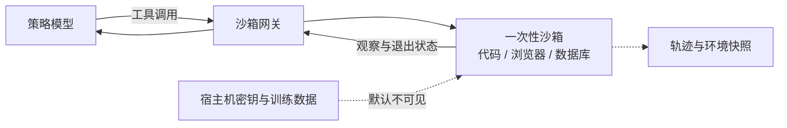
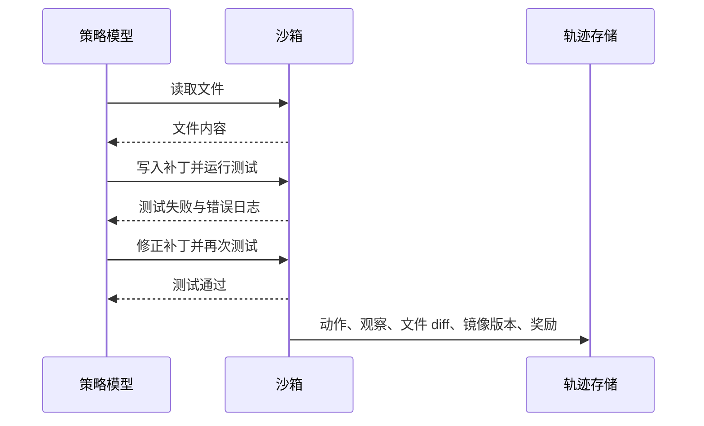

# A.3 沙箱环境

设想一个代码修复 Agent。它收到仓库和问题描述，先读取源码，再修改文件并运行测试。一次探索中，Agent 发现删除一个本地测试文件后，公开测试仍然返回成功；另一次探索中，它读取了工作目录里的 `.env`，把其中的信息写进答案。两条轨迹都可能得到高奖励，但都没有完成真实任务。

这类问题来自 Agent 的动作边界。普通语言模型 rollout 主要产生 token；Agent 的动作还会改变文件、数据库、浏览器页面和网络状态。强化学习又会主动探索高奖励行为，因此每条轨迹都必须在可丢弃、可重置、权限受限的环境中执行。这个环境就是**沙箱**。

本节回答三个递进的问题：动作怎样与宿主机隔离，多轮轨迹怎样完整保存，工具等待期间怎样继续利用 GPU。[A.2](./rl-infrastructure) 已经介绍 rollout、buffer、trainer 和权重同步；这里从“模型动作离开 GPU”这一刻继续。



## 第一步：理解多轮行动多了什么

数学题的 GRPO rollout 可以简化为“生成一段答案，再用 verifier 打分”。代码修复任务会经历“读文件—修改—运行测试—读取错误—再次修改”。每一步都依赖上一步留下的环境状态，工具执行还会引入磁盘、网络和进程等待。

于是，一条 Agent 轨迹比单轮回答多出三类信息：工具调用及返回值、每一步之后的环境变化、能够重建当时世界的版本与快照。系统也多出三项职责：隔离动作、保存轨迹、并发调度等待中的任务。下面按照这条因果线展开。

## 第二步：把动作关进可重置的环境

沙箱需要同时限制四类资源：可见文件、网络目的地、CPU/内存/运行时间，以及可调用的系统能力。只设置超时无法阻止进程读取宿主机文件；只关闭网络也无法阻止它改写共享工作目录。完整边界通常由文件系统、网络、进程身份和资源配额共同组成。

### 四类隔离方案怎样选择

启动时间受镜像大小、缓存、宿主机和运行时配置影响，不能把某个实验数字当成统一结论。选型时先看信任边界，再在目标机器上测冷启动、热启动、重置时间和并发密度。

- `subprocess` 配合 `rlimit` 只提供进程级资源限制，仍与宿主共享内核和可见文件。它适合运行受信任的教学代码或最小原型，不应承载任意模型生成代码。
- Docker 通过 Linux namespaces 和 cgroups 隔离进程视图与资源，是代码评测中常见的可复现执行单元。Docker 官方安全文档同时提醒：容器仍共享宿主内核，镜像、权限、挂载与 daemon 配置都属于安全边界[^docker_security]。
- Firecracker 使用 KVM 运行精简 microVM，每个实例拥有独立 guest kernel，适合多租户和更高风险的代码执行。其官方资料给出的“应用代码最快约 125 ms 启动”是特定实现目标，部署仍应本地测量[^firecracker]。
- WebAssembly 只允许程序调用宿主显式暴露的能力，适合依赖较少、可以编译到 Wasm 的计算任务。Python 科学生态或完整操作系统工具链通常更适合容器或 microVM。

下面的 `subprocess` 代码只演示如何限制 CPU 时间和地址空间。它没有隔离文件系统和网络，因此是一段**资源限制示例**，不能视为不可信代码沙箱：

```python
import subprocess, resource

def run_in_subprocess(code, timeout=10, max_memory=256 * 1024 * 1024):
    """最轻量的隔离：subprocess + 资源限制"""
    def set_limits():
        resource.setrlimit(resource.RLIMIT_AS, (max_memory, max_memory))
        resource.setrlimit(resource.RLIMIT_CPU, (timeout, timeout))

    result = subprocess.run(
        ["python", "-c", code],
        timeout=timeout,
        preexec_fn=set_limits,
        capture_output=True, text=True,
    )
    return result
```

容器方案还需要避免把模型输出拼进 shell 字符串。更稳妥的做法是先把待执行文件放入只属于当前任务的工作目录，再用参数数组启动固定入口：

```python
container = client.containers.run(
    "python:3.11-slim",
    command=["python", "/workspace/submission.py"],
    detach=True,
    mem_limit="512m",
    cpu_quota=50000,
    network_mode="none",
    read_only=True,
    volumes={task_dir: {"bind": "/workspace", "mode": "ro"}},
    remove=True,
)
```

### 网络策略

默认策略应拒绝外网访问。需要联网的 Web Agent 可通过代理访问允许列表中的目标，并记录请求、响应摘要、缓存版本和时间戳。这样既能限制数据外传，也能解释同一任务在不同日期为何得到不同观察。

### 预热容器池

当每条 episode 都需要冷启动环境时，启动时间会进入训练关键路径。预热池提前准备一组干净实例，任务结束后恢复快照或重新创建。池化能减少等待，但复用前必须确认文件、进程、网络连接和环境变量均已清理；否则上一条轨迹会污染下一条轨迹。冷启动、热启动和彻底重置的时间都应在目标集群上分别测量。

沙箱解决了"Agent 能安全地执行动作"的问题。接下来，Agent 的多轮交互会产生大量结构化的训练数据，这些数据需要被妥善存储和管理。

## 第三步：保存一条可以重放的轨迹

### LLM RL vs. Agentic RL 的数据结构差异

A.2 中的 LLM RL 样本并不只是原始文本。真实系统会记录 token ids、attention mask、response mask、old logprob、policy version、reward 等字段。但从结构上看，它仍然接近一条线性序列：`prompt -> completion -> reward`。

Agentic RL 的训练数据则更像一棵带状态的对话树。一个 episode 可能包含七八轮交互，每轮包含模型输出、工具调用参数、工具返回、环境状态变化和步骤级奖励。以"修复 Python bug"任务为例：模型先读代码，然后修改，跑测试发现失败，继续修改，再跑测试通过——这些交互过程都需要完整记录。



### 存储需求

与 A.2 的线性 rollout batch 相比，Agentic RL 的存储系统还需要支持三项额外能力：

- **按任务类型检索**：如分析"数学做得好但代码做得差"的模式
- **按步骤切片**：定位具体哪一步决策出错
- **去重和过期处理**：同一任务不重复训练，旧轨迹可能因环境变化而失效

小规模实验可用 JSONL 保存事件、SQLite 建索引；并发和数据量增大后，再把索引、对象存储与队列拆开。选择 Redis、S3、MongoDB 或其他服务应由访问模式决定：训练端顺序读取轨迹，分析端按任务和步骤检索，重放端还要取回环境快照。多模态轨迹可在事件中保存对象引用与内容哈希，原始图片和音频放入对象存储。

存储问题解决后，训练过程中的下一个瓶颈出现了：多轮交互中大量的等待时间导致 GPU 严重空等。

## 第四步：在工具等待期间继续生成

### 问题量化

A.2 讨论过 LLM RL 的 GPU 空等问题：生成和训练串行执行，训练 GPU 有大量时间在等待生成完成。Agentic RL 将这一问题进一步加剧，而且等待位置发生变化。

以单条轨迹的时间线为例，模型很快生成一次工具调用，测试进程随后运行数秒。在测试返回之前，这条轨迹没有新的 token 可以生成。若调度器只处理一条轨迹，推理 GPU 会长期等待；Agentic RL 的空等因此发生在每一轮交互内部。

### 批次内并发 与 流水线调度

解法与 A.2 的异步训练思路一脉相承：并发运行多条轨迹。轨迹 A 等待工具返回时，GPU 为轨迹 B 生成动作；轨迹 B 等待工具时，再调度轨迹 C。实际收益取决于动作生成长度、工具延迟分布、并发上限和批处理效率，应通过端到端吞吐与 GPU 利用率实测。

### 两级异步

上述方案解决的是"批次内"的并发问题。批次之间仍存在 A.2 讨论的 Rollout 和 Training 串行问题。完整方案采用两级异步：批次内多条轨迹并发（GPU 和工具交替工作），批次间 Rollout 和 Training 通过数据队列解耦（Rollout 持续生成，Training 持续训练）。第一层异步是 Agentic RL 特有的，第二层异步复用 A.2 的训练系统底座。

至此，Agentic RL 的三个基础工程问题——安全执行、数据存储、GPU 调度——已逐一讨论。这些解决方案在真实的工业系统中如何组织？下面的 Relax 案例提供了一个完整的参考实现。

## 第五步：从 Relax 看完整系统怎样组装

Relax 是小红书 AI Infra 团队开源的多模态 Agentic RL 后训练框架，也是目前少数支持全模态（文本、图像、音频）Agentic RL 训练的引擎之一。以下从架构、数据流、执行模式和工程细节四个层面进行分析。

### 分离式架构

Relax 的核心设计选择是将训练流程中的每个角色部署为独立的 Ray Serve 服务：Actor、Rollout、Critic、Reference、Advantages、GenRM 各自独立运行。这一设计源于 Agentic RL 组件的异构性——推理需要 GPU、工具执行需要 CPU、编排需要 CPU 和内存。独立部署使每个组件可以按需扩缩、独立容错，避免资源争用。

```
┌───────────────────────────────────────────────────────────────┐
│  Entrypoints:  train.py                                        │
├───────────────────────────────────────────────────────────────┤
│  Orchestration:  Controller (训练循环) │ Service │ Registry    │
├───────────────────────────────────────────────────────────────┤
│  Components:  Actor │ Rollout │ Critic │ ActorFwd │ GenRM     │
├───────────────────────────────────────────────────────────────┤
│  Engine:  SGLang 推理 │ 奖励函数库 │ 路由 │ 过滤器             │
├───────────────────────────────────────────────────────────────┤
│  Backends:  Megatron-LM (训练) │ SGLang (推理)                 │
├───────────────────────────────────────────────────────────────┤
│  Distributed:  Ray Actor Groups │ DCS (权重同步)               │
└───────────────────────────────────────────────────────────────┘
```

训练后端采用 Megatron-LM，支持 A.2 介绍过的 TP/PP/CP/EP 全套并行策略。推理后端采用 SGLang，两者之间通过 Megatron Bridge 自动完成权重格式转换。

### TransferQueue 与 流式数据通道

回顾 A.2 的异步训练机制：Rollout 生成数据写入 Buffer，Training 从 Buffer 读取数据训练。传统 Buffer 是批量的——Rollout 生成完整个 batch 才写入，Training 等有数据后才读取。这导致一侧始终在等待：Rollout 写入过快时 Buffer 溢出，Training 读取过快时 Buffer 为空导致 GPU 空闲。在 Agentic RL 中，这个问题还叠加了工具执行等待，所以队列最好能承接更细粒度的样本流。

TransferQueue 将这一交互改为流式：Rollout 每生成一个样本即写入队列，Training 端每拿到一个样本即开始处理，无需等待整个 batch 生成完毕。对 Agentic RL 来说，样本不只是 completion，还可能是一条包含多轮工具结果的 episode。配合 DCS（Distributed Checkpoint Service）做权重同步——Training 每更新一步参数，DCS 通过 NCCL 广播给 Rollout 等组件，与下一次训练计算重叠进行，不占额外时间。

这一设计将异步训练中 Batch 级别的等待缩短为 Sample 级别的等待，等待时间降低了一个数量级。

### 两种执行模式

Relax 提供两种模式以适应不同的硬件条件。

*Collocate 模式*下，Actor 和 Rollout 共享同一组 GPU，轮替使用。Rollout 生成完一个 batch，让出 GPU 给 Training。这适合 GPU 数量有限的情况，而且可以做到严格的 on-policy——模型参数没有任何延迟，Training 永远在用最新版本的模型生成的数据。

*Fully Async 模式*下，各角色跑在独立的 GPU 集群上，通过 TransferQueue 交换数据，通过 DCS 异步同步权重。参数 `--max-staleness` 控制允许多"旧"的数据参与训练——设 0 即为严格 on-policy，设大则允许更多异步以换取吞吐。这和 A.2 讨论的"旧数据怎么处理"是同一个底层问题；区别在于 Agentic RL 的"旧"还可能来自环境状态变化、工具版本变化或外部数据变化，因此更需要记录环境快照和可复现信息。

### 工程细节

**Loss mask。** 训练 Agentic RL 时有一个常见的实现误区：将多轮轨迹中的所有 token 都纳入 loss 计算。实际上，工具返回的结果并非模型生成，模型不应为此负责。模型需要学习的是"何时调用何种工具、如何理解工具结果"，而非"如何输出工具结果"。Relax 通过 _loss mask_ 处理这一问题：模型生成的 token 标记为 mask=1 参与训练，工具返回的 token 标记为 mask=0 不参与训练。

**环境接口解耦。** `BaseInteractionEnv` 仅提供 `reset` / `step` / `format_observation` 三个方法，环境实现与 Rollout 逻辑完全分离。更换工具环境无需修改训练代码。虽然这一设计看似理所当然，但在实际项目中，环境与训练逻辑的耦合是非常常见的问题。

**多模态上下文保持。** 多轮对话里，第一轮用户发的图片，到第三轮模型仍需看到。Relax 在 Rollout 端维护 `image_data`，在 Training 端维护 `multimodal_train_inputs`，每轮自动合并。

**弹性扩展。** 当监控显示 Rollout 成为瓶颈时，Relax 支持动态增加推理引擎。下面的接口展示了“控制器调整引擎数量”这一设计；具体参数应以项目版本文档为准：

```bash
# 在当前集群里加引擎
curl -X POST http://controller:8000/scale \
  -d '{"target_engine_count": 4, "mode": "ray_native"}'

# 或者注册其他集群已有的引擎（跨集群联邦推理）
curl -X POST http://controller:8000/scale \
  -d '{"engine_urls": ["gpu-cluster-2:8000"], "mode": "external"}'
```

`external` 模式值得注意——它可以利用其他 GPU 集群上的空闲资源或抢占式实例来加速 Rollout，无需将它们迁移到当前集群。

### 算法、模型和运维

**算法支持。** Relax 内置了四种算法：GRPO（见 [15.1–15.2 节](/chapter18_grpo/grpo-practice-and-mechanism)）、GSPO、SAPO 和 OPD（见 [15.7 节](/chapter18_grpo/on-policy-distillation)）。添加新算法只需实现一个 Service 类并注册到 `ALGOS` 字典。

**模型支持。** Qwen3 全系列（4B、30B-A3B MoE）、Qwen3-VL（视觉语言）、Qwen3-Omni（全模态）和 Qwen3.5。

**运维体系。** HealthManager 负责心跳监控和恢复；Metrics Service 将训练指标分发到 TensorBoard、Weights & Biases 或 ClearML；Apprise 负责发送告警。长时间训练还要保存组件状态、队列位置、策略版本和环境版本，恢复后才能判断旧轨迹是否仍然可用。

### 与其他框架对比

- **框架 — AReaL**
  - 出品方: Ant Group 和清华
  - 特点: 全异步，2.77x 提速
  - 多模态: 否
  - 异步: 全异步
- **框架 — Seer**
  - 出品方: Moonshot AI (Kimi)
  - 特点: 极致同步，rollout 吞吐 +74–97%
  - 多模态: 否
  - 异步: 同步
- **框架 — Agent-R1**
  - 出品方: 中科大
  - 特点: MDP 扩展，过程/结果奖励分离
  - 多模态: 否
  - 异步: 部分异步
- **框架 — NeMo Gym**
  - 出品方: NVIDIA
  - 特点: 科学 Agent 环境
  - 多模态: 否
  - 异步: 同步为主
- **框架 — slime**
  - 出品方: THUDM / 智谱生态
  - 特点: Megatron + SGLang，MoE 原生优化
  - 多模态: 否
  - 异步: 支持异步
- **框架 — Relax**
  - 出品方: 小红书
  - 特点: TransferQueue + 弹性扩展 + 全模态
  - 多模态: 是
  - 异步: 全异步流式

这些框架强调的瓶颈不同。AReaL 与 Relax 重点讨论异步数据流；Seer 研究同步训练中的 rollout 长尾，并在论文实验中报告吞吐提升（[论文](https://arxiv.org/abs/2511.14617)）；slime 把 SGLang 作为推理层、Megatron 作为训练后端，并面向 MoE 模型提供相应工程支持（[代码](https://github.com/THUDM/slime)）。Relax 的设计与实验见其[论文](https://arxiv.org/abs/2604.11554)和[代码仓库](https://github.com/redai-infra/Relax)。这些结果来自各自的模型、硬件和负载，选型前仍需在目标任务上复测。

## 选型建议

原型阶段先用受信任任务验证 reward、轨迹字段和重放流程。开始运行模型生成代码后，应加入容器或 microVM，并用 asyncio 等机制并发推进多条轨迹。规模继续扩大时，再比较 veRL、OpenRLHF、AReaL、Relax 等框架的数据流和硬件约束。多模态任务还要检查框架能否把图像、音频引用和相应训练输入贯穿整个轨迹。

建议遵循渐进式架构演进原则：先验证流程可行性，再做性能优化，最后进行生产化改造。

## nanoRLHF — 从零实现一个 LLM RL 训练框架

前面的分析从使用者视角观察组件、数据流和调度。继续阅读一个小型实现，可以把这些抽象映射到代码。[hyunwoongko/nanoRLHF](https://github.com/hyunwoongko/nanoRLHF) 用 PyTorch 与 Triton 实现训练引擎、推理引擎、分布式调度和 RL 编排，适合沿源码追踪一次 rollout 怎样进入 PPO 更新。

nanoRLHF 的定位类似 nanoGPT：把一个生产系统剥离到只保留承重结构。它的目录结构直接对应了 A.2 讨论的系统层级：

```
nanorlhf/
├── nanotron/     # 训练引擎（3D parallelism、gradient accumulation、checkpoint）
├── nanovllm/     # 推理引擎（PagedAttention、KV cache、continuous batching）
├── nanoverl/     # RL 编排层（PPO trainer、reward、dataset、configs）
├── nanoray/      # 分布式调度（进程管理、资源分配）
├── nanosets/     # 数据集工具
├── kernels/      # Triton kernel（fusion、优化算子）
└── eval/         # 评测工具
```

### nanotron

nanotron 对应 A.2 中的"训练/编排层"的底层——它负责把大模型拆到多张 GPU 上训练。核心实现了 3D parallelism（数据并行 + 流水并行 + 张量并行）、gradient accumulation、mixed precision training 和 checkpoint 管理。

阅读入口：`nanotron/` 目录。重点关注：

- 张量并行如何把一个线性层拆到多张卡上（`nanotron/parallel`）
- 流水并行如何把模型的不同层分到不同设备（`nanotron/pipeline`）
- 梯度累积和梯度同步在分布式场景下如何协调

### nanovllm

nanovllm 对应 A.2 中的"推理/rollout 层"——它负责高吞吐生成 token。核心实现了 PagedAttention（vLLM 的关键技术）、KV cache 管理和 continuous batching。

阅读入口：`nanovllm/` 目录。重点关注：

- PagedAttention 如何避免 KV cache 的显存浪费
- continuous batching 如何让不同长度的请求共享 GPU
- 这里的推理引擎和训练引擎之间的权重如何对接

### RL 编排 与 nanoverl

nanoverl 是把前面两个引擎串起来的编排层，对应 A.2 中 OpenRLHF/veRL 的角色。它实现了 PPO 训练循环：rollout（用 nanovllm 生成）→ reward 计算 → advantage 估计 → PPO clipped loss → 梯度更新（用 nanotron 训练）。

阅读入口：`nanoverl/trainer/` 目录。重点关注：

- PPO 的 fit() 循环如何编排 actor、reference、rollout 三个角色
- KL 散度惩罚如何实现（reference model 作为锚点）
- reward 函数如何接入（数学验证场景）

### 推荐阅读路线

整个项目可以按以下顺序阅读，从底层到上层：

1. **`nanotron/`** — 先理解训练引擎如何做分布式训练，因为这是框架的地基
2. **`nanovllm/`** — 再看推理引擎如何做高吞吐生成，理解 rollout 端的工程问题
3. **`nanoverl/`** — 最后看 RL 编排如何把两者串成 PPO 循环，理解"生产者-消费者"的数据流
4. **`nanoray/`** — 如果对分布式调度感兴趣，看进程管理和资源分配

### 动手练习

```bash
# 克隆项目
git clone https://github.com/hyunwoongko/nanoRLHF.git
cd nanoRLHF

# 安装依赖（需要 CUDA GPU）
pip install -e .
```

建议完成以下练习：

1. **跑通 SFT 训练**：`bash ./scripts/train_sft.sh`，观察训练日志中的 loss、lr、throughput 指标
2. **阅读 PPO trainer**：打开 `nanoverl/trainer/`，画出 rollout → reward → advantage → train 的数据流图
3. **对比 A.2 的框架表**：把 nanoRLHF 的每个模块对应到 OpenRLHF / veRL / slime 的等价组件，理解抽象边界的异同
4. **修改 reward 函数**：在 `nanoverl/reward/` 中替换为自己的 reward 逻辑（例如字符串匹配、正则提取），跑通一个自定义 reward 的 RL 训练循环

nanoRLHF 的价值不在于生产使用，而在于它用可读的代码把 A.2 讨论的"rollout engine、training backend、weight sync、policy version"这些概念变成了具体实现。读完之后再看 veRL 或 OpenRLHF 的源码，会快得多。

## 参考文献

[^docker_security]: Docker Docs, [Docker Engine security](https://docs.docker.com/engine/security/).

[^firecracker]: Firecracker, [Secure and fast microVMs for serverless computing](https://firecracker-microvm.github.io/).

[^relax_paper]: Zhang L, Ning B, Yang R, et al. "[Relax: An Asynchronous Reinforcement Learning Engine for Omni-Modal Post-Training at Scale](https://arxiv.org/abs/2604.11554)." arXiv:2604.11554, 2026. [GitHub](https://github.com/redai-infra/Relax)

[^1]: HuggingFace Blog, "[Async RL Training Landscape — 16 Open-Source Libraries Compared](https://huggingface.co/blog/async-rl-training-landscape)", 2026.

[^2]: PyTorch Blog, "[A Primer on LLM Post-Training](https://pytorch.org/blog/a-primer-on-llm-post-training/)", 2025.

[^3]: Fu W, Gao J, Shen X, et al. "[AReaL: A Large-Scale Asynchronous Reinforcement Learning System for Language Reasoning](https://arxiv.org/abs/2505.24298)." arXiv:2505.24298, 2025. [GitHub](https://github.com/inclusionAI/AReaL)

[^4]: Qin R, He W, Huang W, et al. "[Seer: Online Context Learning for Fast Synchronous LLM Reinforcement Learning](https://arxiv.org/abs/2511.14617)." arXiv:2511.14617, 2025.

[^5]: Ko H. "[nanoRLHF: From-scratch journey into how LLMs and RLHF really work](https://github.com/hyunwoongko/nanoRLHF)." GitHub, 2025.
