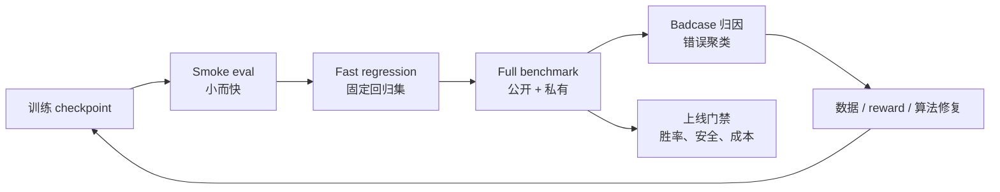

# A.4 RL 后训练与 Agentic RL Benchmark

> 训练曲线告诉你 optimizer 正在移动，benchmark 才告诉你模型能力有没有变好。
>
> 在 RL 后训练里，reward 上升不等于任务成功；在 Agentic RL 里，一次成功也不等于 agent 学会了稳定完成任务。本节只讨论一个工程问题：当你已经搭好 [B.1 RL 训练系统](./rl-infrastructure) 和 [B.2 Agentic RL 基础设施](./agentic-rl-infra) 后，应该怎样设计 benchmark 来判断 checkpoint 能否继续训练、能否上线，以及下一轮数据该补哪里。

## Benchmark 不是榜单

工业里的 benchmark 不是把公开榜单跑一遍，而是一份**评测契约**。它需要说清楚：

1. **任务分布**：模型未来会遇到哪些任务，简单、中等、困难各占多少。比如代码 agent 不能只测单文件 bug 修复，还要覆盖多文件改动、测试定位和环境问题。
2. **执行协议**：温度、采样次数、上下文长度、工具权限、时间预算和重试规则都要固定。否则同一个模型换一套运行条件，分数就不可比。
3. **评分器**：确定答案的任务优先用规则、verifier、单元测试或环境状态检查；开放式对话和写作才用 LLM-as-Judge。评分器越接近真实任务结果，benchmark 越可靠。
4. **对照组**：要说明新 checkpoint 是和 SFT、上一版 RL checkpoint，还是线上模型比较。没有对照组，一个分数本身很难说明模型是否真的进步。
5. **切分方式**：训练集、开发集、公开测试集和私有测试集要隔离。开发集可以反复调试，私有测试集只用于发布门禁，否则很快会被调参过程污染。
6. **失败 taxonomy**：每个 badcase 都要能归因到数据、reward、算法、工具、评测或安全问题。只有能归因，错误才会变成下一轮数据补充、reward 修复或上线门禁。

这也是 HELM 的核心启发：不要只看一个总分，而要把场景、指标和模型行为拆开报告[^helm]。对 RL 来说，这一点更重要，因为模型很容易优化到你给的 reward，而不是你真正想要的能力。



一个实用的节奏是：每个 checkpoint 跑小评测，每天跑完整公开集，每个候选版本跑私有集和人工抽检。私有集不能被训练脚本、prompt 调参和 reward 设计反复看到，否则它会很快退化成训练集。

## 常见 Benchmark 地址速查

下面这张表按“最常用、最容易接入、最适合做工程回归”的顺序整理。地址优先给官方主页、官方仓库或官方 Hugging Face 数据集；如果一个 benchmark 同时有数据集和排行榜，实际项目里建议都记录到评测配置里。

| 类型           | Benchmark              | 地址                                                                                                                                                | 主指标                                    | 适合回答的问题                                            |
| -------------- | ---------------------- | --------------------------------------------------------------------------------------------------------------------------------------------------- | ----------------------------------------- | --------------------------------------------------------- |
| 基础 LLM       | MMLU                   | [HF 数据集](https://huggingface.co/datasets/cais/mmlu)                                                                                              | accuracy                                  | 通用知识与多学科选择题能力[^mmlu]                         |
| 基础 LLM       | MMLU-Pro               | [HF 数据集](https://huggingface.co/datasets/TIGER-Lab/MMLU-Pro), [GitHub](https://github.com/TIGER-AI-Lab/MMLU-Pro)                                 | accuracy                                  | 更难的多学科推理，适合替代逐渐饱和的 MMLU[^mmlupro]       |
| 基础 LLM       | GPQA                   | [HF 数据集](https://huggingface.co/datasets/Idavidrein/gpqa), [GitHub](https://github.com/idavidrein/gpqa)                                          | accuracy                                  | 研究生级科学问答，检查深推理与抗搜索泄露[^gpqa]           |
| 数学 / RLVR    | GSM8K                  | [HF 数据集](https://huggingface.co/datasets/openai/gsm8k)                                                                                           | exact match, pass@k                       | 小学数学多步推理，适合快速 smoke eval[^gsm8k]             |
| 数学 / RLVR    | MATH                   | [GitHub](https://github.com/hendrycks/math)                                                                                                         | exact match, pass@k                       | 竞赛数学与可验证推理[^math]                               |
| 代码           | HumanEval              | [GitHub](https://github.com/openai/human-eval)                                                                                                      | pass@1, pass@k                            | Python 函数生成与单元测试通过率[^humaneval]               |
| 代码           | LiveCodeBench          | [官网](https://livecodebench.github.io/), [GitHub](https://github.com/LiveCodeBench/LiveCodeBench)                                                  | pass@1, pass@k                            | 持续更新的代码能力，降低公开题污染[^livecodebench]        |
| 指令遵循       | IFEval                 | [官方代码](https://github.com/google-research/google-research/tree/master/instruction_following_eval)                                               | prompt-level / instruction-level accuracy | 可自动检查的格式、长度、关键词等约束[^ifeval]             |
| 偏好 / RM      | AlpacaEval             | [官网](https://tatsu-lab.github.io/alpaca_eval/), [GitHub](https://github.com/tatsu-lab/alpaca_eval)                                                | win rate, LC win rate                     | 开放式指令跟随与偏好胜率[^alpacaeval]                     |
| 偏好 / RM      | RewardBench            | [HF 数据集](https://huggingface.co/datasets/allenai/reward-bench), [GitHub](https://github.com/allenai/reward-bench)                                | pairwise accuracy                         | reward model 是否真的偏好好答案[^rewardbench]             |
| VLM            | MMMU                   | [官网](https://mmmu-benchmark.github.io/), [GitHub](https://github.com/MMMU-Benchmark/MMMU), [HF 数据集](https://huggingface.co/datasets/MMMU/MMMU) | accuracy                                  | 多学科、多图表、多模态专家级理解[^mmmu]                   |
| VLM            | MMBench                | [官网](https://opencompass.openxlab.space/omnimmbench), [GitHub](https://github.com/open-compass/MMBench)                                           | accuracy, circular eval accuracy          | 感知、属性、关系、逻辑等细粒度 VLM 能力[^mmbench]         |
| VLM            | MathVista              | [官网](https://mathvista.github.io/)                                                                                                                | accuracy                                  | 图形、表格、几何场景中的数学推理[^mathvista]              |
| VLM            | ChartQA                | [GitHub](https://github.com/vis-nlp/ChartQA)                                                                                                        | relaxed accuracy, exact match             | 图表问答、数值读取、趋势理解[^chartqa]                    |
| VLM            | DocVQA                 | [官网](https://site.docvqa.org/datasets/docvqa)                                                                                                     | ANLS                                      | 文档图片理解、OCR、版面问答[^docvqa]                      |
| 工具调用       | BFCL                   | [排行榜](https://gorilla.cs.berkeley.edu/leaderboard), [项目页](https://sky.cs.berkeley.edu/project/berkeley-function-calling-leaderboard/)         | AST match, executable accuracy            | 函数选择、参数生成、多工具调用[^bfcl]                     |
| 工具调用       | API-Bank               | [GitHub](https://github.com/AlibabaResearch/DAMO-ConvAI/tree/main/api-bank)                                                                         | API call accuracy, response quality       | API 检索、计划、调用的端到端能力[^apibank]                |
| 软件工程 Agent | SWE-bench              | [官网](https://www.swebench.com/), [GitHub](https://github.com/SWE-bench/SWE-bench)                                                                 | resolved rate, pass@1                     | 真实 GitHub issue 修复与仓库级测试[^swebench]             |
| Web Agent      | WebArena               | [官网](https://webarena.dev/), [GitHub](https://github.com/web-arena-x/webarena)                                                                    | task success                              | 浏览器操作、表单、购物、GitLab 等真实网页任务[^webarena]  |
| 通用 Agent     | GAIA                   | [HF 数据集](https://huggingface.co/datasets/gaia-benchmark/GAIA), [排行榜](https://huggingface.co/spaces/gaia-benchmark/leaderboard)                | final answer accuracy                     | 搜索、文件、多模态、推理组合能力[^gaia]                   |
| 工作流 Agent   | Claw-Eval-Live         | [项目页](https://claw-eval-live.github.io/), [论文](https://arxiv.org/abs/2604.28139)                                                               | pass rate, completion score               | 随市场需求季度刷新的企业工作流任务[^clawevallive]         |
| 经济型 Agent   | ClawWork               | [GitHub](https://github.com/HKUDS/ClawWork), [项目页](https://hkuds.github.io/ClawWork/)                                                            | net income, survival, task quality        | 让 agent 在成本约束下完成职业任务并赚取收益[^clawwork]    |
| 桌面 Agent     | OSWorld                | [官网](https://os-world.github.io/)                                                                                                                 | task success                              | 真实桌面应用和操作系统任务[^osworld]                      |
| 用户交互 Agent | tau-bench / tau2-bench | [官网](https://www.taubench.com/), [GitHub](https://github.com/sierra-research/tau2-bench)                                                          | pass^k, database state                    | 客服、订票、零售等多轮工具-用户交互[^taubench]            |
| 多环境 Agent   | AgentBench             | [GitHub](https://github.com/THUDM/AgentBench)                                                                                                       | environment success rate                  | Web、数据库、命令行、游戏等多环境 agent 能力[^agentbench] |

## RL 后训练 Benchmark

这里的“RL 后训练”主要指 RLHF、RLAIF、DPO/IPO/KTO、PPO、GRPO、RLVR 等后训练方法。评测目标不是证明模型“聪明”，而是回答三个问题：

- **能力有没有提升**：数学、代码、指令遵循、事实性、安全性是否比基线更好。
- **偏好有没有对齐**：人类或目标用户是否更喜欢新模型。
- **奖励有没有失真**：reward model / verifier 给高分的样本是否真的高质量。

### 能力矩阵

| 能力线      | 常用 benchmark                 | 主指标                                      | 适合回答的问题                     | 风险点                                                 |
| ----------- | ------------------------------ | ------------------------------------------- | ---------------------------------- | ------------------------------------------------------ |
| 指令遵循    | IFEval, MT-Bench, AlpacaEval   | 规则满足率、pairwise win rate               | 模型是否按约束回答，是否更符合偏好 | LLM judge 可能偏长、偏礼貌、偏自信[^mtbench][^ifeval]  |
| 数学与 RLVR | GSM8K, MATH, AIME 风格私有题   | exact match, pass@k, verifier accuracy      | 可验证推理是否提升                 | 答案泄露、格式奖励被钻空子[^gsm8k][^math]              |
| 代码        | HumanEval, MBPP, LiveCodeBench | pass@1, pass@k, 测试通过率                  | 生成代码是否真的可运行             | 公开题污染、样例测试过拟合[^humaneval][^livecodebench] |
| 通用覆盖    | HELM 风格多场景评测            | accuracy, robustness, calibration, toxicity | 是否只在单一能力上变好             | 指标多，必须明确主指标[^helm]                          |
| 奖励模型    | RewardBench, 内部偏好集        | pairwise accuracy, segment accuracy         | reward 是否和人类偏好一致          | RM 训练集和评测集同源会虚高[^rewardbench]              |

不要把这些 benchmark 简单加权成一个“总分”。更好的做法是设定一个**主指标 + 回归门禁**：

| 目标     | 示例                                                                     |
| -------- | ------------------------------------------------------------------------ |
| 主指标   | 数学 RLVR 项目看 MATH / AIME pass@1；代码 RL 项目看 LiveCodeBench pass@1 |
| 硬门禁   | 安全违规率不能上升，格式失败率不能超过阈值                               |
| 回归门禁 | 通用对话、短指令、已有业务任务不能显著退化                               |
| 诊断指标 | 输出长度、拒答率、重复率、KL、entropy、reward margin                     |

### 评测协议

同一个模型，用不同评测协议会得到完全不同的结论。RL 后训练至少固定下面这些参数：

```yaml
model: qwen-rl-step-1800
baseline: qwen-sft
sampling:
  temperature: 0.6
  top_p: 0.95
  n: 1
  max_tokens: 4096
judge:
  type: rule_then_llm_judge
  order_randomization: true
  tie_policy: count_as_half
split:
  dev: visible_for_iteration
  test_public: reported_every_night
  test_private: release_gate_only
```

如果任务有确定答案，优先用规则、单元测试或 verifier。只有开放式对话、写作、偏好评估这类任务才用 LLM-as-Judge，并且要做顺序随机化、少量人工抽检和 judge 漂移监控。MT-Bench 与 Chatbot Arena 的经验说明，LLM judge 很有用，但它本身也会带来位置偏差、长度偏差和模型偏好[^mtbench]。

### 评分器与工具链

评测协议定下来以后，下一步不是立刻找一个“最强 judge”，而是先判断任务需要哪种证据。规则、测试和环境状态检查能回答“是否完成”；LLM-as-Judge 能回答“质量是否像人类想要的那样好”；轨迹评测工具能回答“agent 是怎样完成，或者在哪里失败的”。这些名字经常出现在论文和工程项目里，可以按下面四类理解。

| 名称       | 类型                      | 解决的问题                                                                                                                             | 在项目里的位置                           |
| ---------- | ------------------------- | -------------------------------------------------------------------------------------------------------------------------------------- | ---------------------------------------- |
| G-Eval     | LLM-as-Judge 方法         | 用强模型按 rubric 和评估步骤给开放式输出打分，比 BLEU/ROUGE 更适合摘要、对话、写作等主观任务[^geval]                                   | 偏好评估、开放式回答质量评分             |
| MAJ-EVAL   | Multi-Agent-as-Judge 方法 | 让多个评审 persona 从不同维度讨论和评分，减少单一 judge 的视角偏差[^majeval]                                                           | 高风险开放式评测、论文/报告/复杂任务评分 |
| DeepEval   | LLM 应用评测框架          | 像写测试一样组织 eval，内置 G-Eval、RAG、agent task completion、tool correctness 等指标[^deepeval]                                     | 本地回归测试、CI 中的轻量评测            |
| agentevals | Agent 轨迹评测工具        | 对工具调用轨迹做 reference matching、LLM judge 或 trace 级评分；LangChain 版偏轨迹匹配，OpenTelemetry 版偏生产 trace 评估[^agentevals] | Agent 回归测试、badcase 定位             |

这里有一个容易混淆的点：**G-Eval 和 MAJ-EVAL 是评分方法，DeepEval 和 agentevals 是工程工具**。前者回答“怎么判断质量”，后者回答“怎么把判断接进项目”。在 RL 后训练里，二者都不能替代 verifier；如果数学、代码、数据库状态能被确定性验证，就应优先用确定性验证。LLM judge 更适合补足语义质量、用户体验、解释完整性这类难以写成规则的维度。

### 采样次数

RL 后训练常见的误判来自 `pass@k`。一个模型 `pass@8` 提升，可能只是更会“多试几次”，并不代表 `pass@1` 变强。报告里至少分开写：

| 指标         | 含义                        | 什么时候看                              |
| ------------ | --------------------------- | --------------------------------------- |
| `pass@1`     | 单次回答成功率              | 产品默认体验、线上质量                  |
| `pass@k`     | 多次采样至少一次成功        | search / rerank / self-consistency 系统 |
| `majority@k` | 多数投票后的成功率          | 数学、可验证推理                        |
| `best-of-n`  | 用 reward / verifier 选最优 | 检查 reward 是否真的会选好答案          |

如果训练目标是提升单次可用性，就不要只汇报 `pass@k`。如果产品本来就会做多候选搜索，则要同时汇报成本：每提升 1 个点需要多花多少 token、多少 verifier 调用、多少延迟。

## Agentic RL Benchmark

Agentic RL 的评测对象不是一段答案，而是一条**轨迹**：

```text
初始状态 → 观察 → 思考/计划 → 工具调用 → 环境变化 → 再观察 → ... → 最终状态
```

因此 agent benchmark 必须额外定义：

- 初始环境怎么还原：浏览器、代码仓库、数据库、API、文件系统是否可复现。
- 工具权限是什么：能否联网、能否写文件、能否执行测试、能否调用付费 API。
- 成功标准是什么：最终答案、环境状态 diff、测试是否通过、用户模拟器是否满意。
- 预算是多少：最大步数、最大时间、最大 token、最大工具调用次数。
- 轨迹怎么审计：每一步 observation、action、tool result、错误恢复都要可回放。

### Benchmark 地图

| 场景              | 代表 benchmark                | 主要测什么                         | 评分方式                                              |
| ----------------- | ----------------------------- | ---------------------------------- | ----------------------------------------------------- |
| API / 函数调用    | API-Bank, BFCL 类评测         | 参数选择、调用顺序、工具返回处理   | JSON / API 调用精确匹配或执行结果[^apibank]           |
| 真实网页任务      | WebArena                      | 多站点浏览、表单、购物、信息查找   | 环境最终状态与任务答案[^webarena]                     |
| 软件工程 agent    | SWE-bench, SWE-bench Verified | 真实 GitHub issue 修复             | 仓库测试通过率[^swebench]                             |
| 通用助手          | GAIA                          | 搜索、推理、多模态、工具组合       | 最终答案准确率[^gaia]                                 |
| 动态工作流        | Claw-Eval-Live                | 企业服务、工作区修复、跨系统流程   | 固定快照任务 + 规则检查 + 结构化 judge[^clawevallive] |
| 经济生存          | ClawWork                      | 任务质量、成本控制、长期收益       | 收入、API 成本、余额、任务质量[^clawwork]             |
| 桌面/操作系统     | OSWorld                       | GUI 操作、文件、应用工作流         | 状态检查与任务完成率[^osworld]                        |
| 用户-工具多轮交互 | tau-bench                     | 对话式业务流程、规则遵循、工具使用 | 用户模拟器 + 数据库状态[^taubench]                    |
| 多环境 agent      | AgentBench                    | Web、数据库、命令行、游戏等多环境  | 各环境成功率[^agentbench]                             |

选择 benchmark 时先问“我训练的 agent 会在哪里失败”。如果你训练的是代码修复 agent，SWE-bench 比 GAIA 更关键；如果你训练的是客服/订票/CRM agent，tau-bench 风格的用户模拟和数据库状态校验更接近真实业务；如果你训练的是浏览器 agent，WebArena 的环境可复现性比普通问答题更重要。

### Agent 指标

Agentic RL 至少需要同时看结果、过程和成本。

| 指标                 | 解释                           | 为什么重要                            |
| -------------------- | ------------------------------ | ------------------------------------- |
| `task_success`       | 任务最终是否完成               | 主指标，直接对应 reward               |
| `state_success`      | 环境状态是否达到目标           | 防止只说对答案但没有真的操作成功      |
| `tool_success`       | 工具调用是否合法、参数是否正确 | 定位工具使用能力                      |
| `recovery_rate`      | 工具失败或观察错误后能否恢复   | 长程任务的核心能力                    |
| `steps_to_success`   | 成功所需步数                   | 衡量效率和规划质量                    |
| `cost_to_success`    | token、时间、API 成本          | 上线门槛                              |
| `safety_violation`   | 越权、泄露、破坏性操作         | agent 比普通 LLM 更容易造成真实副作用 |
| `trajectory_quality` | 计划是否合理、是否反复试错     | 诊断信号，不宜作为唯一 reward         |

过程评分很诱人，但不要让它压过最终结果。一个 agent 每一步解释得很漂亮，却没有完成任务，不能算好 agent。更安全的做法是：最终状态占主权重，过程评分主要用于 badcase 归因和训练数据生成。

### Rollout Cards 与 把分数还原成证据

Agent benchmark 最容易出问题的地方，不是没有分数，而是只有分数。一个表格写着 `task_success = 62%`，却不说明失败 run 有没有被丢弃、超时怎么算、工具错误是否计入成本、同一任务多次采样如何聚合，那么这个分数就很难复现。**Rollout Cards** 提出的方向是：把 rollout 记录本身当成评测的基本单位，而不是只发布最终分数[^rolloutcards]。

一张实用的 rollout card 至少应该保留：

- **原始轨迹**：每一步 observation、action、tool result、错误、重试和最终输出。
- **报告规则**：哪些 run 被计入，哪些被跳过，超时、崩溃、空回答怎样算。
- **成本与时间**：token、工具调用、API 费用、墙钟时间和并发设置。
- **评分视图**：最终答案分、环境状态分、过程分、人工抽检结果分别怎么算。
- **drops manifest**：失败、报错、跳过的样本不能消失，要单独列出来。

这和传统 RL 的直觉是一致的：策略不是在一个孤立答案上学习，而是在一条条 trajectory / rollout 上暴露能力。对 Agentic RL 来说，rollout card 的价值在于让“模型 A 比模型 B 高 3 分”变成可追问的问题：到底是更会完成任务，还是更会规避失败样本？是成功率提高，还是成本翻倍换来的？是过程更稳，还是报告规则变了？

## 三类标准测试怎么跑

如果只是读论文和榜单，很容易觉得 benchmark 离训练系统很远。真正落地时，可以先做三条最小闭环：基础 LLM、VLM、工具调用 / agent。每条闭环都要包含固定协议、机器可读报告、badcase 归因和下一轮改进动作。

### 基础 LLM 与 MMLU + GSM8K + IFEval

这条线用来回答“RL 后训练有没有损伤基础能力和指令稳定性”。一个轻量组合是：MMLU-Pro 或 MMLU 看知识覆盖，GSM8K 看可验证推理，IFEval 看格式与约束。

```yaml
suite: llm_core_regression_v1
model: qwen2.5-7b-grpo-step-1800
baseline: qwen2.5-7b-sft
generation:
  temperature: 0.0
  top_p: 1.0
  max_tokens: 2048
datasets:
  - name: mmlu_pro
    split: test
    metric: accuracy
  - name: gsm8k
    split: test
    metric: exact_match
  - name: ifeval
    split: test
    metric: prompt_level_accuracy
```

假设一次评测输出如下：

```text
checkpoint: qwen2.5-7b-grpo-step-1800
baseline: qwen2.5-7b-sft
mmlu_pro_accuracy: 44.8% -> 44.1% (-0.7)
gsm8k_exact_match: 72.4% -> 77.9% (+5.5)
ifeval_prompt_accuracy: 63.0% -> 57.2% (-5.8)
response_length_mean: 612 -> 941 (+53.8%)
badcase_top:
  - ifeval_keyword_missing: 74 cases
  - ifeval_length_constraint_violation: 61 cases
  - gsm8k_final_answer_format_error: 19 cases
release_decision: block
```

这个结果说明数学 RLVR 有收益，但指令遵循明显退化，而且输出变长。下一轮不要只继续加数学题，而应该：

- 把 IFEval 失败样本拆成“关键词约束、长度约束、格式约束、语言约束”四类，加入回归集。
- 在 reward 里把“答案正确”和“最终格式正确”分开计分，避免模型只学会长推理。
- 加入短回答保留集，设置 `response_length_mean` 上限或长度归一化 judge。
- 对 GSM8K 的格式失败补 verifier：只在最终答案可解析时给满分。

### MMMU + MathVista + ChartQA

VLM 评测不能只看最终文本，因为错误可能来自 OCR、图像定位、视觉关系、数学推理或答案格式。一个常用组合是 MMMU 看多学科图文理解，MathVista 看视觉数学，ChartQA 看图表读取。

```yaml
suite: vlm_reasoning_regression_v1
model: qwen-vl-rl-step-900
baseline: qwen-vl-sft
generation:
  temperature: 0.0
  max_tokens: 1024
input:
  image_resolution: 1344
  preserve_aspect_ratio: true
metrics:
  - accuracy
  - relaxed_numeric_accuracy
  - ocr_error_rate
  - answer_parse_fail_rate
```

假设输出如下：

```text
checkpoint: qwen-vl-rl-step-900
mmmu_val_accuracy: 42.0% -> 44.6% (+2.6)
mathvista_accuracy: 37.5% -> 38.1% (+0.6)
chartqa_relaxed_accuracy: 61.8% -> 54.7% (-7.1)
answer_parse_fail_rate: 3.2% -> 4.9% (+1.7)
badcase_top:
  - chart_axis_value_misread: 88 cases
  - table_header_binding_error: 43 cases
  - geometry_diagram_spatial_relation_error: 31 cases
release_decision: block_for_chart_tasks
```

这个结果不是“VLM 整体变差”，而是图表读数和表头绑定退化。下一轮改进应该对准视觉输入和任务分布：

- 给 ChartQA 类任务增加局部裁剪、坐标轴读取、表格 header 对齐的 SFT / RLVR 数据。
- 把数值答案评分改成 `exact + relaxed numeric` 两层，避免单位、小数位和逗号格式误伤。
- 对图表任务单独记录 OCR / visual grounding 错误，不要混在推理错误里。
- 如果训练时做了图像 resize，检查高宽比和分辨率；图表题通常比自然图像更怕压缩。

### 工具调用与 Agent 与 BFCL + API-Bank + SWE-bench

工具调用先跑 BFCL 或 API-Bank，确认“函数名、参数、调用顺序”可靠；端到端代码 agent 再跑 SWE-bench Verified 或内部仓库任务。不要一开始就只看 SWE-bench resolved rate，因为低分可能只是工具调用 JSON 坏了。

```yaml
suite: agent_tool_regression_v1
model: code-agent-rl-step-2400
baseline: code-agent-sft
tool_protocol:
  parallel_tool_calls: true
  max_tool_calls: 50
  max_wall_time_minutes: 20
datasets:
  - name: bfcl_v3
    metric: executable_accuracy
  - name: api_bank
    metric: api_call_accuracy
  - name: swebench_verified
    metric: resolved_rate
```

假设输出如下：

```text
checkpoint: code-agent-rl-step-2400
bfcl_executable_accuracy: 82.1% -> 85.6% (+3.5)
api_bank_call_accuracy: 68.4% -> 66.9% (-1.5)
swebench_verified_resolved: 28.0% -> 32.4% (+4.4)
avg_tool_calls_successful_tasks: 18.6 -> 27.9 (+50.0%)
tool_error_recovery_rate: 41.2% -> 37.5% (-3.7)
safety_violation_rate: 0.3% -> 0.9% (+0.6)
release_decision: research_only
```

这里 SWE-bench 提升，但成本和安全退化明显。下一轮应该：

- 对成功轨迹做蒸馏时保留更短路径，加入“重复搜索、重复读文件、无效测试重跑”的惩罚。
- 把工具错误恢复单独做 curriculum：超时、权限拒绝、空结果、JSON schema 错误分别采样。
- 对危险动作加规则门禁，例如删除文件、改 CI、跳过测试、扩大权限必须触发拒绝或人工确认。
- 把 `resolved_rate` 和 `cost_to_success` 一起设为上线门禁，避免模型用高成本换小幅成功率。

## 论文式雷达图怎么画

很多论文会用 radar chart 展示“模型能力画像”。它适合讲故事：一眼看出某个 checkpoint 是数学变强、指令变弱，还是 agent 成功率变高但成本变差。但雷达图也很容易误导，所以画之前先做三件事：

1. **统一方向**：所有轴都必须是越大越好。比如 `safety_violation_rate` 要先转成 `safety_score = 100 * (1 - violation_rate / max_bad_rate)`。
2. **统一量纲**：所有轴都归一到 0-100。accuracy 可以直接乘 100；成本、延迟、工具调用次数要做 min-max 或阈值归一化。
3. **保留原始表格**：雷达图只做展示，报告里仍然要放原始指标，避免读者只看形状不看数值。

### 复现哪类论文图

下面两个例子不是“随便挑几个指标画一圈”，而是复现两类常见论文图的结构，并把**参考论文、论文原图、跑完后的新图**放在一起对照：

- **MMBench 风格的 VLM 20 维能力雷达图**：MMBench 在 Figure 1 里把 8 个代表性 VLM 的结果画到 20 个细粒度能力轴上，例如 action recognition、OCR、spatial relationship、physical relation、identity reasoning 等[^mmbench]。这类图适合回答：VLM 后训练到底增强了哪些视觉能力，哪些能力被训练副作用拖下来了？
- **AgentBench 风格的多环境 Agent 雷达图**：AgentBench 把 agent 放到 OS、DB、KG、DCG、LTP、HH、WS、WB 八个交互环境里评估[^agentbench]。这类图适合回答：一个 agent 是只会写 SQL / shell，还是能跨网页、游戏、家居环境保持稳定？

下面的数值是**假想评测结果**，用于演示复现方法；如果你要复现论文原图，就把论文表格里的模型分数手工录成同样的字典，或者从官方 leaderboard / JSON 结果里读入。

### 运行方法

把下面脚本保存为 `scripts/plot_paper_style_radar.py`：

```bash
python -m pip install matplotlib
python scripts/plot_paper_style_radar.py
```

```python
from pathlib import Path
import math
import matplotlib.pyplot as plt

OUT = Path("docs/appendix_industrial_training/images")
OUT.mkdir(parents=True, exist_ok=True)

COLORS = ["#2b6cb0", "#c53030", "#2f855a", "#6b46c1"]


def closed(values):
    return values + values[:1]


def plot_paper_radar(title, metrics, series, output_path, subtitle=None):
    angles = [2 * math.pi * i / len(metrics) for i in range(len(metrics))]
    angles = closed(angles)

    fig, ax = plt.subplots(figsize=(7.6, 6.4), subplot_kw={"polar": True})
    fig.patch.set_facecolor("white")
    ax.set_facecolor("#fbfbfd")
    ax.set_theta_offset(math.pi / 2)
    ax.set_theta_direction(-1)
    ax.set_ylim(0, 100)
    ax.set_xticks(angles[:-1])
    ax.set_xticklabels(metrics, fontsize=9)
    ax.set_yticks([20, 40, 60, 80, 100])
    ax.set_yticklabels(["20", "40", "60", "80", "100"], fontsize=8, color="#64748b")
    ax.grid(color="#cbd5e1", linewidth=0.9)
    ax.spines["polar"].set_color("#94a3b8")

    for idx, (name, values) in enumerate(series.items()):
        color = COLORS[idx % len(COLORS)]
        values = closed(values)
        ax.plot(angles, values, color=color, linewidth=2.4, marker="o", markersize=3.2, label=name)
        ax.fill(angles, values, color=color, alpha=0.08)

    ax.set_title(title, y=1.12, fontsize=13, fontweight="bold")
    if subtitle:
        fig.text(0.5, 0.905, subtitle, ha="center", va="center", fontsize=9, color="#475569")
    ax.legend(loc="upper center", bbox_to_anchor=(0.5, -0.08), ncol=min(3, len(series)), frameon=False)
    fig.tight_layout(pad=2.0)
    fig.savefig(output_path, dpi=180, bbox_inches="tight")
    plt.close(fig)


mmbench_metrics = [
    "Identity\nReasoning",
    "Future\nPrediction",
    "Function\nReasoning",
    "Celebrity\nRecognition",
    "Attribute\nRecognition",
    "Attribute\nComparison",
    "Action\nRecognition",
    "Struct. Img-Text\nUnderstanding",
    "Spatial\nRelationship",
    "Social\nRelation",
    "Physical\nRelation",
    "Physical\nProperty",
    "OCR",
    "Object\nLocalization",
    "Natural\nRelation",
    "Image\nTopic",
    "Image\nStyle",
    "Image\nScene",
    "Image\nQuality",
    "Image\nEmotion",
]
mmbench_series = {
    "VLM-SFT": [68, 48, 61, 55, 66, 50, 74, 31, 38, 44, 55, 37, 62, 49, 60, 78, 64, 69, 35, 54],
    "VLM-RL": [72, 52, 66, 58, 70, 55, 78, 40, 47, 49, 60, 43, 55, 53, 64, 80, 66, 73, 38, 58],
    "VLM-RL + OCR mix": [73, 56, 67, 60, 72, 57, 79, 48, 51, 52, 63, 46, 69, 56, 66, 81, 68, 74, 45, 60],
}
plot_paper_radar(
    "MMBench-style 20-ability VLM radar",
    mmbench_metrics,
    mmbench_series,
    OUT / "radar-llm-core-regression.png",
    "Axes follow MMBench Figure 1; numbers are hypothetical post-training eval results.",
)

agentbench_metrics = ["OS", "DB", "KG", "DCG", "LTP", "HH", "WS", "WB"]
agentbench_series = {
    "Agent-SFT": [28.0, 41.0, 32.0, 45.0, 35.0, 22.0, 31.0, 18.0],
    "Agent-RL": [46.0, 49.0, 38.0, 43.0, 42.0, 20.0, 39.0, 24.0],
    "Agent-RL + guard": [43.0, 52.0, 45.0, 48.0, 51.0, 29.0, 44.0, 33.0],
}
plot_paper_radar(
    "AgentBench-style environment radar",
    agentbench_metrics,
    agentbench_series,
    OUT / "radar-code-agent-tool-bench.png",
    "Relative-to-best scores across AgentBench environments; numbers are hypothetical.",
)
```

### 复现 MMBench 20 维 VLM 雷达图

**参考论文**：Liu et al., _MMBench: Is Your Multi-modal Model an All-around Player?_ 论文 Figure 1 展示了 8 个代表性 VLM 在 MMBench-test 的 20 个能力维度上的雷达图[^mmbench]。


_图 1：MMBench 论文 Figure 1 的原始雷达图截图。它把模型结果拆到 20 个细粒度能力轴上，而不是只报告 overall accuracy。来源：MMBench 论文[^mmbench]。_

**怎么跑出新图**：先按 MMBench 的 L-3 ability 聚合评测结果，例如每个模型得到 20 个能力分数；再把这些分数填入 `mmbench_series`。下面是跑完后的假想结果节选，完整 20 维数值在脚本里。

| 模型             | Action | OCR | Spatial | Physical Relation | Identity | Image Quality |
| ---------------- | ------ | --- | ------- | ----------------- | -------- | ------------- |
| VLM-SFT          | 74     | 62  | 38      | 55                | 68       | 35            |
| VLM-RL           | 78     | 55  | 47      | 60                | 72       | 38            |
| VLM-RL + OCR mix | 79     | 69  | 51      | 63                | 73       | 45            |


_图 2：我们跑完后的 MMBench 风格 20 维雷达图。`VLM-RL` 在 action、spatial、physical relation 上外扩，但 OCR 收缩；加入 OCR / 文档 / 表格保留集后，`VLM-RL + OCR mix` 把 OCR 轴补回来，同时保持大部分推理收益。_

跑完这类图后，报告里的改进动作应该直接对应最短的轴：

- OCR 下降：补 ChartQA、DocVQA、截图 UI、表格 header 对齐数据。
- Spatial / physical relation 上升但 OCR 下降：拆 reward，避免所有视觉题都只奖励最终答案。
- Image quality / image emotion 一直短：说明数据偏向结构化任务，缺少主观视觉质量和情绪理解样本。

### 复现 AgentBench 风格多环境雷达图

**参考论文**：Liu et al., _AgentBench: Evaluating LLMs as Agents_ 论文 Figure 1(a) 把典型 LLM 在 8 个环境上的相对表现画成雷达图，Figure 1(b) 同时给出 overall score 条形图[^agentbench]。


_图 3：AgentBench 论文 Figure 1 的原始图截图。左侧是 8 个环境的雷达图，右侧是 overall score 条形图。来源：AgentBench 论文[^agentbench]。_

**怎么跑出新图**：AgentBench 的不同环境原始指标不完全同量纲，所以可以先做 `relative_score = 100 * model_score / best_score_in_this_environment`，再画雷达图。这里用假想结果演示一个 agent 后训练项目。

| 模型             | OS  | DB  | KG  | DCG | LTP | HH  | WS  | WB  |
| ---------------- | --- | --- | --- | --- | --- | --- | --- | --- |
| Agent-SFT        | 28  | 41  | 32  | 45  | 35  | 22  | 31  | 18  |
| Agent-RL         | 46  | 49  | 38  | 43  | 42  | 20  | 39  | 24  |
| Agent-RL + guard | 43  | 52  | 45  | 48  | 51  | 29  | 44  | 33  |


_图 4：我们跑完后的 AgentBench 风格多环境雷达图。`Agent-RL` 在 OS、DB、WS 上变强，但 HH 和 DCG 没有同步提升；加 guard、错误恢复 curriculum 和跨环境混合轨迹后，能力画像更接近“整体外扩”。_

这个图对应的训练动作也很直接：

- OS / DB 提升明显：说明代码和结构化工具轨迹有效，可以保留这部分数据。
- HH / WB 仍低：说明长程状态追踪、页面观察、错误恢复不足，要补多轮交互轨迹。
- DCG 不升反降：可能是代码型数据过多，让模型偏向局部执行而不是策略规划；下一轮要混入游戏、规划、探索类环境。

## 自建 Benchmark 的五步

公开 benchmark 负责横向比较，内部 benchmark 负责真实业务。自建 benchmark 可以按下面五步走。

### 1. 定义能力矩阵

先写矩阵，再写题目。比如“代码 agent”可以这样拆：

| 任务类型           | Easy | Medium | Hard |
| ------------------ | ---- | ------ | ---- |
| 单文件 bug 修复    | 30   | 40     | 20   |
| 多文件功能添加     | 10   | 30     | 30   |
| 测试失败定位       | 20   | 30     | 20   |
| 依赖 / 环境问题    | 10   | 20     | 20   |
| 代码审查与安全修复 | 10   | 20     | 20   |

矩阵里每个格子都要有足够样本，否则模型可能只是在最密集的题型上变好。

### 2. 写任务卡

每个任务都应该能被机器复现。一个 agent 任务卡可以长这样：

```yaml
id: codeagent-medium-042
split: private_release
domain: software_engineering
difficulty: medium
initial_state:
  repo: internal/payment-service
  commit: 8f31c2a
  setup: npm install
prompt: '修复退款金额四舍五入错误，并补充回归测试。'
allowed_tools:
  - shell
  - file_edit
  - test_runner
budget:
  max_steps: 40
  max_minutes: 20
  max_tokens: 60000
success_verifier:
  type: unit_tests
  command: npm test
process_checks:
  - no_unrelated_file_rewrite
  - no_snapshot_deletion
tags:
  - decimal
  - regression-test
  - money-safety
```

这张卡同时服务训练、评测和 badcase 分析。没有任务卡，后续就很难复现“为什么这个 checkpoint 好像变差了”。

### 3. 设计评分器

评分器优先级通常是：

1. **环境状态检查**：数据库记录、文件 diff、网页状态、测试结果。
2. **规则评分**：格式、字段、数值、关键约束。
3. **参考答案对比**：适合短答案和可枚举任务。
4. **LLM-as-Judge**：适合开放式任务，但必须抽检。
5. **人工评审**：成本高，用于校准 judge 和高风险样本。

Agent benchmark 尤其要避免“只看最终文本”。比如网页 agent 说“我已经下单成功”没有意义，必须检查购物车、订单状态或数据库记录。

### 4. 去污染与版本化

RL 项目很容易把评测集污染掉：开发者用 test set 调 prompt，数据合成脚本从公开 benchmark 改写题目，reward model 见过评测答案，都会造成虚高。

最低限度要做四件事：

- 训练数据与评测题做 n-gram / embedding 相似度检查。
- 公开集只做趋势观察，私有集只做发布门禁。
- 每次 benchmark 更新都打版本号，例如 `math-rlvr-v3.2`。
- 保留固定 anchor set，用来判断新版本 benchmark 是否改变了难度。

LiveCodeBench 把“持续更新”和“降低污染”作为代码评测的核心设计，这个思路同样适合内部 RL benchmark[^livecodebench]。

### 5. 校准难度

一个好 benchmark 不能全是模型会做的题，也不能全是模型做不了的题。试跑时建议至少放三个基线：

| 基线               | 用途                     |
| ------------------ | ------------------------ |
| SFT 模型           | 判断 RL 是否真的带来增益 |
| 上一版线上模型     | 判断能否上线             |
| 强闭源或强开源模型 | 判断天花板和题目区分度   |

如果所有模型都接近 0 分，题目可能太难或评分器有问题；如果所有模型都接近满分，benchmark 已经过时。健康的内部 benchmark 应该让主力模型落在 40%-80% 区间，这样才看得出迭代差异。

## 训练监控与故障排查

Benchmark 回答“模型有没有变好”，训练监控回答“为什么变好或变坏”。RL 训练时建议把下面几类指标和 benchmark 报告放在同一张看板里。

| 指标              | 正常趋势         | 危险信号                          |
| ----------------- | ---------------- | --------------------------------- |
| training reward   | 缓慢上升         | reward 上升但 benchmark 下降      |
| KL divergence     | 可控范围内波动   | 突然飙升，策略偏离参考模型        |
| entropy           | 缓慢下降         | 快速接近 0，输出模式坍塌          |
| response length   | 与任务匹配       | 靠变长骗 judge 或靠变短骗格式奖励 |
| verifier accuracy | 与人工抽检一致   | verifier 高分样本人工看很差       |
| win rate          | 相对基线稳定提升 | 开放题提升，但安全/事实性退化     |
| cost / latency    | 小幅变化         | agent 成功率提升但成本翻倍        |

最典型的坏信号是：**reward 上升，KL 上升，entropy 下降，benchmark 主指标下降**。这通常不是模型“快学会了”，而是模型找到了 reward 漏洞。此时应该暂停训练，抽样看高 reward 低 benchmark 的样本，并检查 reward、verifier 和 judge。

一个实用的自动门禁：

```text
如果主指标连续 2 次低于历史最佳 1% 以上：暂停训练
如果安全指标任一项退化：暂停并人工复核
如果 reward 上升但私有集下降：回滚 checkpoint，进入 badcase 归因
如果 agent 成功率上升但成本超过预算 30%：不允许上线，只允许继续研究
```

## Badcase 如何反哺 RL

Badcase 分析不是把错题截图贴到文档里，而是把失败样本转化为下一轮训练动作。

| 失败类型                   | 可能原因                    | 修复动作                          |
| -------------------------- | --------------------------- | --------------------------------- |
| 可验证题答案错             | 推理能力不足，verifier 太弱 | 补充同类 RLVR 任务，强化 verifier |
| 格式对但内容错             | reward 只看格式             | 拆分格式 reward 和内容 reward     |
| judge 喜欢长废话           | LLM judge 长度偏差          | 加长度归一化和人工校准集          |
| 代码通过样例但隐藏测试失败 | 过拟合公开样例              | 加隐藏测试和变体测试              |
| agent 反复调用同一工具     | 规划/状态记忆差             | 加轨迹级 SFT，惩罚无效重复调用    |
| agent 完成任务但越权       | 工具权限设计不清            | 加权限检查、危险动作拒绝任务      |
| 新能力提升但旧能力退化     | 训练数据分布偏移            | 混入保留集，设置回归门禁          |

每轮训练结束后，至少输出一份这样的报告：

```text
checkpoint: grpo-agent-step-2400
primary_metric: swebench_verified_pass@1 = 34.2% (+3.1)
regressions:
  - bfcl_call_accuracy: -1.8
  - avg_tool_calls_successful_tasks: +22%
badcase_clusters:
  - missing_repo_search_before_edit: 17 cases
  - tests_not_run_after_patch: 11 cases
  - tool_timeout_no_recovery: 8 cases
next_actions:
  - add 200 trajectories with mandatory test execution
  - add timeout recovery reward
  - keep previous checkpoint as release candidate
```

这样 benchmark 就不只是验收工具，而是 RL 数据飞轮的一部分：评测发现系统性失败，badcase 归因生成新数据或新 reward，再进入下一轮训练。

## 小结

RL 后训练 benchmark 的核心是**分清真实能力、偏好胜率和 reward 失真**；Agentic RL benchmark 的核心是**把可复现环境、工具轨迹、最终状态和成本一起评估**。

如果只能记住一条原则：不要让训练 reward 自己证明训练成功。让独立 benchmark、私有回归集和可回放 badcase 一起说话。

## 参考文献

[^helm]: Percy Liang et al. [Holistic Evaluation of Language Models](https://arxiv.org/abs/2211.09110), arXiv 2022.

[^mmlu]: Dan Hendrycks et al. [Measuring Massive Multitask Language Understanding](https://arxiv.org/abs/2009.03300), ICLR 2021.

[^mmlupro]: Yubo Wang et al. [MMLU-Pro: A More Robust and Challenging Multi-Task Language Understanding Benchmark](https://arxiv.org/abs/2406.01574), NeurIPS 2024 Datasets and Benchmarks Track.

[^gpqa]: David Rein et al. [GPQA: A Graduate-Level Google-Proof Q&A Benchmark](https://arxiv.org/abs/2311.12022), arXiv 2023.

[^mtbench]: Lianmin Zheng et al. [Judging LLM-as-a-Judge with MT-Bench and Chatbot Arena](https://arxiv.org/abs/2306.05685), NeurIPS 2023.

[^geval]: Yang Liu et al. [G-EVAL: NLG Evaluation using GPT-4 with Better Human Alignment](https://arxiv.org/abs/2303.16634), EMNLP 2023.

[^majeval]: Weiqi Wang et al. [Multi-Agent-as-Judge: Aligning LLM-Agent-Based Automated Evaluation with Multi-Dimensional Human Evaluation](https://arxiv.org/abs/2507.21028), arXiv 2025.

[^deepeval]: Confident AI. [DeepEval Documentation](https://deepeval.com/docs/introduction), accessed 2026-05-14.

[^agentevals]: LangChain. [agentevals: Readymade evaluators for agent trajectories](https://github.com/langchain-ai/agentevals), accessed 2026-05-14; AgentEvals. [Score Agent Behavior from OpenTelemetry Traces](https://aevals.ai/), accessed 2026-05-14.

[^ifeval]: Jeffrey Zhou et al. [Instruction-Following Evaluation for Large Language Models](https://arxiv.org/abs/2311.07911), arXiv 2023.

[^gsm8k]: Karl Cobbe et al. [Training Verifiers to Solve Math Word Problems](https://arxiv.org/abs/2110.14168), arXiv 2021.

[^math]: Dan Hendrycks et al. [Measuring Mathematical Problem Solving With the MATH Dataset](https://arxiv.org/abs/2103.03874), NeurIPS 2021.

[^humaneval]: Mark Chen et al. [Evaluating Large Language Models Trained on Code](https://arxiv.org/abs/2107.03374), arXiv 2021.

[^livecodebench]: Naman Jain et al. [LiveCodeBench: Holistic and Contamination Free Evaluation of Large Language Models for Code](https://arxiv.org/abs/2403.07974), arXiv 2024.

[^rewardbench]: Nathan Lambert et al. [RewardBench: Evaluating Reward Models for Language Modeling](https://arxiv.org/abs/2403.13787), arXiv 2024.

[^alpacaeval]: Yann Dubois et al. [AlpacaFarm: A Simulation Framework for Methods that Learn from Human Feedback](https://arxiv.org/abs/2305.14387), NeurIPS 2023.

[^mmmu]: Xiang Yue et al. [MMMU: A Massive Multi-discipline Multimodal Understanding and Reasoning Benchmark for Expert AGI](https://arxiv.org/abs/2311.16502), CVPR 2024.

[^mmbench]: Yuan Liu et al. [MMBench: Is Your Multi-modal Large Language Model an All-around Player?](https://arxiv.org/abs/2307.06281), ECCV 2024.

[^mathvista]: Pan Lu et al. [MathVista: Evaluating Mathematical Reasoning of Foundation Models in Visual Contexts](https://arxiv.org/abs/2310.02255), ICLR 2024.

[^chartqa]: Ahmed Masry et al. [ChartQA: A Benchmark for Question Answering about Charts with Visual and Logical Reasoning](https://arxiv.org/abs/2203.10244), ACL Findings 2022.

[^docvqa]: Minesh Mathew et al. [DocVQA: A Dataset for VQA on Document Images](https://arxiv.org/abs/2007.00398), WACV 2021.

[^bfcl]: UC Berkeley Sky Computing Lab. [Berkeley Function Calling Leaderboard](https://gorilla.cs.berkeley.edu/leaderboard), 2024.

[^apibank]: Minghao Li et al. [API-Bank: A Comprehensive Benchmark for Tool-Augmented LLMs](https://arxiv.org/abs/2304.08244), EMNLP 2023.

[^webarena]: Shuyan Zhou et al. [WebArena: A Realistic Web Environment for Building Autonomous Agents](https://arxiv.org/abs/2307.13854), ICLR 2024.

[^swebench]: Carlos E. Jimenez et al. [SWE-bench: Can Language Models Resolve Real-World GitHub Issues?](https://arxiv.org/abs/2310.06770), ICLR 2024.

[^gaia]: Grégoire Mialon et al. [GAIA: a Benchmark for General AI Assistants](https://arxiv.org/abs/2311.12983), ICLR 2024.

[^clawevallive]: Chenxin Li et al. [Claw-Eval-Live: A Live Agent Benchmark for Evolving Real-World Workflows](https://arxiv.org/abs/2604.28139), arXiv 2026.

[^clawwork]: HKUDS. [ClawWork: OpenClaw as Your AI Coworker](https://github.com/HKUDS/ClawWork), accessed 2026-05-14.

[^rolloutcards]: Charlie Masters, Ziyuan Liu, and Stefano V. Albrecht. [Rollout Cards: A Reproducibility Standard for Agent Research](https://arxiv.org/abs/2605.12131), arXiv 2026.

[^osworld]: Tianbao Xie et al. [OSWorld: Benchmarking Multimodal Agents for Open-Ended Tasks in Real Computer Environments](https://arxiv.org/abs/2404.07972), NeurIPS 2024.

[^taubench]: Shunyu Yao et al. [τ-bench: A Benchmark for Tool-Agent-User Interaction in Real-World Domains](https://arxiv.org/abs/2406.12045), arXiv 2024.

[^agentbench]: Xiao Liu et al. [AgentBench: Evaluating LLMs as Agents](https://arxiv.org/abs/2308.03688), ICLR 2024.
