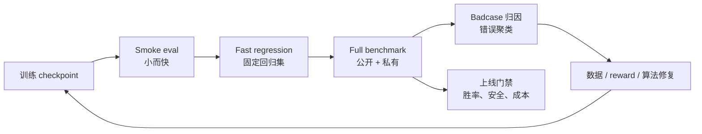

# A.4 评估模型改进

假设同一轮训练产生两个 checkpoint。A 的训练奖励是 0.82，私有任务成功率是 41%；B 的训练奖励只有 0.65，私有任务成功率却是 46%，平均工具调用成本也更低。若只按训练奖励选模型，系统会发布一个真实任务表现更差的版本。

训练奖励回答“模型是否更会优化当前奖励函数”，评测回答“目标能力是否提高”。二者分开记录，才能发现奖励偏差、测试污染、成本换分和偶然成功。对 Agent 来说，还要保留完整轨迹，因为相同的最终分数可能来自一次干净完成，也可能来自大量重试后的侥幸通过。

本节从一个最小评测契约开始，依次解释公开基准、评分器、采样协议、Agent 轨迹评测和 Badcase 回流。学完后，应能为一个 checkpoint 说明三件事：它在哪些任务上进步，代价是否可接受，失败样本应怎样进入下一轮数据或奖励修复。

## 第一步：先固定评测契约

工程评测需要先写清楚一份**评测契约**。它至少包含：

1. **任务分布**：模型未来会遇到哪些任务，简单、中等、困难各占多少。比如代码 agent 不能只测单文件 bug 修复，还要覆盖多文件改动、测试定位和环境问题。
2. **执行协议**：温度、采样次数、上下文长度、工具权限、时间预算和重试规则都要固定。否则同一个模型换一套运行条件，分数就不可比。
3. **评分器**：确定答案的任务优先用规则、verifier、单元测试或环境状态检查；开放式对话和写作才用 LLM-as-Judge。评分器越接近真实任务结果，benchmark 越可靠。
4. **对照组**：要说明新 checkpoint 是和 SFT、上一版 RL checkpoint，还是线上模型比较。没有对照组，一个分数本身很难说明模型是否真的进步。
5. **切分方式**：训练集、开发集、公开测试集和私有测试集要隔离。开发集可以反复调试，私有测试集只用于发布门禁，否则很快会被调参过程污染。
6. **失败 taxonomy**：每个 badcase 都要能归因到数据、reward、算法、工具、评测或安全问题。只有能归因，错误才会变成下一轮数据补充、reward 修复或上线门禁。

HELM 将评测组织为场景与多维指标，提醒研究者同时报告准确性、鲁棒性、校准和风险等不同证据[^helm]。RL 尤其需要这种拆分，因为训练会直接追逐被写进奖励函数的指标。


```mermaid
flowchart LR
    C["训练 checkpoint"] --> S["Smoke eval<br/>小而快"]
    S --> F["Fast regression<br/>固定回归集"]
    F --> B["Full benchmark<br/>公开 + 私有"]
    B --> A["Badcase 归因<br/>错误聚类"]
    A --> D["数据 / reward / 算法修复"]
    D --> C
    B --> G["上线门禁<br/>胜率、安全、成本"]
```

一个实用的节奏是：每个 checkpoint 跑小评测，每天跑完整公开集，每个候选版本跑私有集和人工抽检。私有集不能被训练脚本、prompt 调参和 reward 设计反复看到，否则它会很快退化成训练集。

## 第二步：按能力选择公开基准

公开基准用于补充覆盖面，不能代替贴近真实业务的私有集。下面的索引保留官方主页、仓库或数据集地址，并按任务类型说明每个基准能提供什么证据。选择时只取与目标能力直接相关的一组，避免把所有分数混成一个总分。

- **类型 — 基础 LLM**
  - Benchmark: MMLU
  - 地址: [HF 数据集](https://huggingface.co/datasets/cais/mmlu)
  - 主指标: accuracy
  - 适合回答的问题: 通用知识与多学科选择题能力[^mmlu]
- **类型 — 基础 LLM**
  - Benchmark: MMLU-Pro
  - 地址: [HF 数据集](https://huggingface.co/datasets/TIGER-Lab/MMLU-Pro), [GitHub](https://github.com/TIGER-AI-Lab/MMLU-Pro)
  - 主指标: accuracy
  - 适合回答的问题: 更难的多学科推理，适合替代逐渐饱和的 MMLU[^mmlupro]
- **类型 — 基础 LLM**
  - Benchmark: GPQA
  - 地址: [HF 数据集](https://huggingface.co/datasets/Idavidrein/gpqa), [GitHub](https://github.com/idavidrein/gpqa)
  - 主指标: accuracy
  - 适合回答的问题: 研究生级科学问答，检查深推理与抗搜索泄露[^gpqa]
- **类型 — 数学 / RLVR**
  - Benchmark: GSM8K
  - 地址: [HF 数据集](https://huggingface.co/datasets/openai/gsm8k)
  - 主指标: exact match, pass@k
  - 适合回答的问题: 小学数学多步推理，适合快速 smoke eval[^gsm8k]
- **类型 — 数学 / RLVR**
  - Benchmark: MATH
  - 地址: [GitHub](https://github.com/hendrycks/math)
  - 主指标: exact match, pass@k
  - 适合回答的问题: 竞赛数学与可验证推理[^math]
- **类型 — 代码**
  - Benchmark: HumanEval
  - 地址: [GitHub](https://github.com/openai/human-eval)
  - 主指标: pass@1, pass@k
  - 适合回答的问题: Python 函数生成与单元测试通过率[^humaneval]
- **类型 — 代码**
  - Benchmark: LiveCodeBench
  - 地址: [官网](https://livecodebench.github.io/), [GitHub](https://github.com/LiveCodeBench/LiveCodeBench)
  - 主指标: pass@1, pass@k
  - 适合回答的问题: 持续更新的代码能力，降低公开题污染[^livecodebench]
- **类型 — 指令遵循**
  - Benchmark: IFEval
  - 地址: [官方代码](https://github.com/google-research/google-research/tree/master/instruction_following_eval)
  - 主指标: prompt-level / instruction-level accuracy
  - 适合回答的问题: 可自动检查的格式、长度、关键词等约束[^ifeval]
- **类型 — 偏好 / RM**
  - Benchmark: AlpacaEval
  - 地址: [官网](https://tatsu-lab.github.io/alpaca_eval/), [GitHub](https://github.com/tatsu-lab/alpaca_eval)
  - 主指标: win rate, LC win rate
  - 适合回答的问题: 开放式指令跟随与偏好胜率[^alpacaeval]
- **类型 — 偏好 / RM**
  - Benchmark: RewardBench
  - 地址: [HF 数据集](https://huggingface.co/datasets/allenai/reward-bench), [GitHub](https://github.com/allenai/reward-bench)
  - 主指标: pairwise accuracy
  - 适合回答的问题: reward model 是否真的偏好好答案[^rewardbench]
- **类型 — VLM**
  - Benchmark: MMMU
  - 地址: [官网](https://mmmu-benchmark.github.io/), [GitHub](https://github.com/MMMU-Benchmark/MMMU), [HF 数据集](https://huggingface.co/datasets/MMMU/MMMU)
  - 主指标: accuracy
  - 适合回答的问题: 多学科、多图表、多模态专家级理解[^mmmu]
- **类型 — VLM**
  - Benchmark: MMBench
  - 地址: [官网](https://opencompass.openxlab.space/omnimmbench), [GitHub](https://github.com/open-compass/MMBench)
  - 主指标: accuracy, circular eval accuracy
  - 适合回答的问题: 感知、属性、关系、逻辑等细粒度 VLM 能力[^mmbench]
- **类型 — VLM**
  - Benchmark: MathVista
  - 地址: [官网](https://mathvista.github.io/)
  - 主指标: accuracy
  - 适合回答的问题: 图形、表格、几何场景中的数学推理[^mathvista]
- **类型 — VLM**
  - Benchmark: ChartQA
  - 地址: [GitHub](https://github.com/vis-nlp/ChartQA)
  - 主指标: relaxed accuracy, exact match
  - 适合回答的问题: 图表问答、数值读取、趋势理解[^chartqa]
- **类型 — VLM**
  - Benchmark: DocVQA
  - 地址: [官网](https://site.docvqa.org/datasets/docvqa)
  - 主指标: ANLS
  - 适合回答的问题: 文档图片理解、OCR、版面问答[^docvqa]
- **类型 — 工具调用**
  - Benchmark: BFCL
  - 地址: [排行榜](https://gorilla.cs.berkeley.edu/leaderboard), [项目页](https://sky.cs.berkeley.edu/project/berkeley-function-calling-leaderboard/)
  - 主指标: AST match, executable accuracy
  - 适合回答的问题: 函数选择、参数生成、多工具调用[^bfcl]
- **类型 — 工具调用**
  - Benchmark: API-Bank
  - 地址: [GitHub](https://github.com/AlibabaResearch/DAMO-ConvAI/tree/main/api-bank)
  - 主指标: API call accuracy, response quality
  - 适合回答的问题: API 检索、计划、调用的端到端能力[^apibank]
- **类型 — 软件工程 Agent**
  - Benchmark: SWE-bench
  - 地址: [官网](https://www.swebench.com/), [GitHub](https://github.com/SWE-bench/SWE-bench)
  - 主指标: resolved rate, pass@1
  - 适合回答的问题: 真实 GitHub issue 修复与仓库级测试[^swebench]
- **类型 — Web Agent**
  - Benchmark: WebArena
  - 地址: [官网](https://webarena.dev/), [GitHub](https://github.com/web-arena-x/webarena)
  - 主指标: task success
  - 适合回答的问题: 浏览器操作、表单、购物、GitLab 等真实网页任务[^webarena]
- **类型 — 通用 Agent**
  - Benchmark: GAIA
  - 地址: [HF 数据集](https://huggingface.co/datasets/gaia-benchmark/GAIA), [排行榜](https://huggingface.co/spaces/gaia-benchmark/leaderboard)
  - 主指标: final answer accuracy
  - 适合回答的问题: 搜索、文件、多模态、推理组合能力[^gaia]
- **类型 — 工作流 Agent**
  - Benchmark: Claw-Eval-Live
  - 地址: [项目页](https://claw-eval-live.github.io/), [论文](https://arxiv.org/abs/2604.28139)
  - 主指标: pass rate, completion score
  - 适合回答的问题: 随市场需求季度刷新的企业工作流任务[^clawevallive]
- **类型 — 经济型 Agent**
  - Benchmark: ClawWork
  - 地址: [GitHub](https://github.com/HKUDS/ClawWork), [项目页](https://hkuds.github.io/ClawWork/)
  - 主指标: net income, survival, task quality
  - 适合回答的问题: 让 agent 在成本约束下完成职业任务并赚取收益[^clawwork]
- **类型 — 桌面 Agent**
  - Benchmark: OSWorld
  - 地址: [官网](https://os-world.github.io/)
  - 主指标: task success
  - 适合回答的问题: 真实桌面应用和操作系统任务[^osworld]
- **类型 — 用户交互 Agent**
  - Benchmark: tau-bench / tau2-bench
  - 地址: [官网](https://www.taubench.com/), [GitHub](https://github.com/sierra-research/tau2-bench)
  - 主指标: pass^k, database state
  - 适合回答的问题: 客服、订票、零售等多轮工具-用户交互[^taubench]
- **类型 — 多环境 Agent**
  - Benchmark: AgentBench
  - 地址: [GitHub](https://github.com/THUDM/AgentBench)
  - 主指标: environment success rate
  - 适合回答的问题: Web、数据库、命令行、游戏等多环境 agent 能力[^agentbench]

## 第三步：评测 RL 后训练是否真的增益

这里的“RL 后训练”主要指 RLHF、RLAIF、DPO/IPO/KTO、PPO、GRPO、RLVR 等后训练方法。评测目标不是证明模型“聪明”，而是回答三个问题：

- **能力有没有提升**：数学、代码、指令遵循、事实性、安全性是否比基线更好。
- **偏好有没有对齐**：人类或目标用户是否更喜欢新模型。
- **奖励有没有失真**：reward model / verifier 给高分的样本是否真的高质量。

### 能力矩阵

- **能力线 — 指令遵循**
  - 常用 benchmark: IFEval, MT-Bench, AlpacaEval
  - 主指标: 规则满足率、pairwise win rate
  - 适合回答的问题: 模型是否按约束回答，是否更符合偏好
  - 风险点: LLM judge 可能偏长、偏礼貌、偏自信[^mtbench][^ifeval]
- **能力线 — 数学与 RLVR**
  - 常用 benchmark: GSM8K, MATH, AIME 风格私有题
  - 主指标: exact match, pass@k, verifier accuracy
  - 适合回答的问题: 可验证推理是否提升
  - 风险点: 答案泄露、格式奖励被钻空子[^gsm8k][^math]
- **能力线 — 代码**
  - 常用 benchmark: HumanEval, MBPP, LiveCodeBench
  - 主指标: pass@1, pass@k, 测试通过率
  - 适合回答的问题: 生成代码是否真的可运行
  - 风险点: 公开题污染、样例测试过拟合[^humaneval][^livecodebench]
- **能力线 — 通用覆盖**
  - 常用 benchmark: HELM 风格多场景评测
  - 主指标: accuracy, robustness, calibration, toxicity
  - 适合回答的问题: 是否只在单一能力上变好
  - 风险点: 指标多，必须明确主指标[^helm]
- **能力线 — 奖励模型**
  - 常用 benchmark: RewardBench, 内部偏好集
  - 主指标: pairwise accuracy, segment accuracy
  - 适合回答的问题: reward 是否和人类偏好一致
  - 风险点: RM 训练集和评测集同源会虚高[^rewardbench]

不要把这些 benchmark 简单加权成一个“总分”。更好的做法是设定一个**主指标 + 回归门禁**：

- **目标 — 主指标:** 数学 RLVR 项目看 MATH / AIME pass@1；代码 RL 项目看 LiveCodeBench pass@1
- **目标 — 硬门禁:** 安全违规率不能上升，格式失败率不能超过阈值
- **目标 — 回归门禁:** 通用对话、短指令、已有业务任务不能显著退化
- **目标 — 诊断指标:** 输出长度、拒答率、重复率、KL、entropy、reward margin

### 评测协议

同一个模型，用不同评测协议会得到完全不同的结论。RL 后训练至少固定下面这些参数：

```yaml
model: qwen-rl-step-1800
baseline: qwen-sft
sampling:
  temperature: 0.6
  top_p: 0.95
  n: 1
  max_tokens: 4096
judge:
  type: rule_then_llm_judge
  order_randomization: true
  tie_policy: count_as_half
split:
  dev: visible_for_iteration
  test_public: reported_every_night
  test_private: release_gate_only
```

如果任务有确定答案，优先用规则、单元测试或 verifier。只有开放式对话、写作、偏好评估这类任务才用 LLM-as-Judge，并且要做顺序随机化、少量人工抽检和 judge 漂移监控。MT-Bench 与 Chatbot Arena 的经验说明，LLM judge 很有用，但它本身也会带来位置偏差、长度偏差和模型偏好[^mtbench]。

### 评分器与工具链

评测协议定下来以后，下一步不是立刻找一个“最强 judge”，而是先判断任务需要哪种证据。规则、测试和环境状态检查能回答“是否完成”；LLM-as-Judge 能回答“质量是否像人类想要的那样好”；轨迹评测工具能回答“agent 是怎样完成，或者在哪里失败的”。这些名字经常出现在论文和工程项目里，可以按下面四类理解。

- **名称 — G-Eval**
  - 类型: LLM-as-Judge 方法
  - 解决的问题: 用强模型按 rubric 和评估步骤给开放式输出打分，比 BLEU/ROUGE 更适合摘要、对话、写作等主观任务[^geval]
  - 在项目里的位置: 偏好评估、开放式回答质量评分
- **名称 — MAJ-EVAL**
  - 类型: Multi-Agent-as-Judge 方法
  - 解决的问题: 让多个评审 persona 从不同维度讨论和评分，减少单一 judge 的视角偏差[^majeval]
  - 在项目里的位置: 高风险开放式评测、论文/报告/复杂任务评分
- **名称 — DeepEval**
  - 类型: LLM 应用评测框架
  - 解决的问题: 像写测试一样组织 eval，内置 G-Eval、RAG、agent task completion、tool correctness 等指标[^deepeval]
  - 在项目里的位置: 本地回归测试、CI 中的轻量评测
- **名称 — agentevals**
  - 类型: Agent 轨迹评测工具
  - 解决的问题: 对工具调用轨迹做 reference matching、LLM judge 或 trace 级评分；LangChain 版偏轨迹匹配，OpenTelemetry 版偏生产 trace 评估[^agentevals]
  - 在项目里的位置: Agent 回归测试、badcase 定位

这里有一个容易混淆的点：**G-Eval 和 MAJ-EVAL 是评分方法，DeepEval 和 agentevals 是工程工具**。前者回答“怎么判断质量”，后者回答“怎么把判断接进项目”。在 RL 后训练里，二者都不能替代 verifier；如果数学、代码、数据库状态能被确定性验证，就应优先用确定性验证。LLM judge 更适合补足语义质量、用户体验、解释完整性这类难以写成规则的维度。

### 采样次数

RL 后训练常见的误判来自 `pass@k`。一个模型 `pass@8` 提升，可能只是更会“多试几次”，并不代表 `pass@1` 变强。报告里至少分开写：

- **指标 — `pass@1`**
  - 含义: 单次回答成功率
  - 什么时候看: 产品默认体验、线上质量
- **指标 — `pass@k`**
  - 含义: 多次采样至少一次成功
  - 什么时候看: search / rerank / self-consistency 系统
- **指标 — `majority@k`**
  - 含义: 多数投票后的成功率
  - 什么时候看: 数学、可验证推理
- **指标 — `best-of-n`**
  - 含义: 用 reward / verifier 选最优
  - 什么时候看: 检查 reward 是否真的会选好答案

如果训练目标是提升单次可用性，就不要只汇报 `pass@k`。如果产品本来就会做多候选搜索，则要同时汇报成本：每提升 1 个点需要多花多少 token、多少 verifier 调用、多少延迟。

## 第四步：把 Agent 的整条轨迹纳入评测

Agentic RL 的评测对象不是一段答案，而是一条**轨迹**：

```text
初始状态 → 观察 → 思考/计划 → 工具调用 → 环境变化 → 再观察 → ... → 最终状态
```

因此 agent benchmark 必须额外定义：

- 初始环境怎么还原：浏览器、代码仓库、数据库、API、文件系统是否可复现。
- 工具权限是什么：能否联网、能否写文件、能否执行测试、能否调用付费 API。
- 成功标准是什么：最终答案、环境状态 diff、测试是否通过、用户模拟器是否满意。
- 预算是多少：最大步数、最大时间、最大 token、最大工具调用次数。
- 轨迹怎么审计：每一步 observation、action、tool result、错误恢复都要可回放。

### Benchmark 地图

- **场景 — API / 函数调用**
  - 代表 benchmark: API-Bank, BFCL 类评测
  - 主要测什么: 参数选择、调用顺序、工具返回处理
  - 评分方式: JSON / API 调用精确匹配或执行结果[^apibank]
- **场景 — 真实网页任务**
  - 代表 benchmark: WebArena
  - 主要测什么: 多站点浏览、表单、购物、信息查找
  - 评分方式: 环境最终状态与任务答案[^webarena]
- **场景 — 软件工程 agent**
  - 代表 benchmark: SWE-bench, SWE-bench Verified
  - 主要测什么: 真实 GitHub issue 修复
  - 评分方式: 仓库测试通过率[^swebench]
- **场景 — 通用助手**
  - 代表 benchmark: GAIA
  - 主要测什么: 搜索、推理、多模态、工具组合
  - 评分方式: 最终答案准确率[^gaia]
- **场景 — 动态工作流**
  - 代表 benchmark: Claw-Eval-Live
  - 主要测什么: 企业服务、工作区修复、跨系统流程
  - 评分方式: 固定快照任务 + 规则检查 + 结构化 judge[^clawevallive]
- **场景 — 经济生存**
  - 代表 benchmark: ClawWork
  - 主要测什么: 任务质量、成本控制、长期收益
  - 评分方式: 收入、API 成本、余额、任务质量[^clawwork]
- **场景 — 桌面/操作系统**
  - 代表 benchmark: OSWorld
  - 主要测什么: GUI 操作、文件、应用工作流
  - 评分方式: 状态检查与任务完成率[^osworld]
- **场景 — 用户-工具多轮交互**
  - 代表 benchmark: tau-bench
  - 主要测什么: 对话式业务流程、规则遵循、工具使用
  - 评分方式: 用户模拟器 + 数据库状态[^taubench]
- **场景 — 多环境 agent**
  - 代表 benchmark: AgentBench
  - 主要测什么: Web、数据库、命令行、游戏等多环境
  - 评分方式: 各环境成功率[^agentbench]

选择 benchmark 时先明确 Agent 最可能在哪类任务上失败。代码修复 Agent 更需要 SWE-bench 这类仓库级任务；客服、订票或 CRM Agent 更需要 tau-bench 风格的用户模拟与数据库状态校验；浏览器 Agent 则需要 WebArena 这类可复现环境。

### Agent 指标

Agentic RL 至少需要同时看结果、过程和成本。

- **指标 — `task_success`**
  - 解释: 任务最终是否完成
  - 为什么重要: 主指标，直接对应 reward
- **指标 — `state_success`**
  - 解释: 环境状态是否达到目标
  - 为什么重要: 防止只说对答案但没有真的操作成功
- **指标 — `tool_success`**
  - 解释: 工具调用是否合法、参数是否正确
  - 为什么重要: 定位工具使用能力
- **指标 — `recovery_rate`**
  - 解释: 工具失败或观察错误后能否恢复
  - 为什么重要: 长程任务的核心能力
- **指标 — `steps_to_success`**
  - 解释: 成功所需步数
  - 为什么重要: 衡量效率和规划质量
- **指标 — `cost_to_success`**
  - 解释: token、时间、API 成本
  - 为什么重要: 上线门槛
- **指标 — `safety_violation`**
  - 解释: 越权、泄露、破坏性操作
  - 为什么重要: agent 比普通 LLM 更容易造成真实副作用
- **指标 — `trajectory_quality`**
  - 解释: 计划是否合理、是否反复试错
  - 为什么重要: 诊断信号，不宜作为唯一 reward

过程评分很诱人，但不要让它压过最终结果。一个 agent 每一步解释得很漂亮，却没有完成任务，不能算好 agent。更安全的做法是：最终状态占主权重，过程评分主要用于 badcase 归因和训练数据生成。

### Rollout Cards 与 把分数还原成证据

Agent benchmark 即使给出 `task_success = 62%`，仍需说明失败运行是否被丢弃、超时如何计算、工具错误是否计入成本，以及同一任务的多次采样怎样聚合。**Rollout Cards** 提议把 rollout 记录本身作为评测的基本单位，以便让最终分数回到可审计证据[^rolloutcards]。

一张实用的 rollout card 至少应该保留：

- **原始轨迹**：每一步 observation、action、tool result、错误、重试和最终输出。
- **报告规则**：哪些 run 被计入，哪些被跳过，超时、崩溃、空回答怎样算。
- **成本与时间**：token、工具调用、API 费用、墙钟时间和并发设置。
- **评分视图**：最终答案分、环境状态分、过程分、人工抽检结果分别怎么算。
- **drops manifest**：失败、报错、跳过的样本不能消失，要单独列出来。

这和传统 RL 的直觉是一致的：策略不是在一个孤立答案上学习，而是在一条条 trajectory / rollout 上暴露能力。对 Agentic RL 来说，rollout card 的价值在于让“模型 A 比模型 B 高 3 分”变成可追问的问题：到底是更会完成任务，还是更会规避失败样本？是成功率提高，还是成本翻倍换来的？是过程更稳，还是报告规则变了？

## 第五步：跑通三类最小标准测试

如果只是读论文和榜单，很容易觉得 benchmark 离训练系统很远。真正落地时，可以先做三条最小闭环：基础 LLM、VLM、工具调用 / agent。每条闭环都要包含固定协议、机器可读报告、badcase 归因和下一轮改进动作。

### 基础 LLM 与 MMLU + GSM8K + IFEval

这条线用来回答“RL 后训练有没有损伤基础能力和指令稳定性”。一个轻量组合是：MMLU-Pro 或 MMLU 看知识覆盖，GSM8K 看可验证推理，IFEval 看格式与约束。

```yaml
suite: llm_core_regression_v1
model: qwen2.5-7b-grpo-step-1800
baseline: qwen2.5-7b-sft
generation:
  temperature: 0.0
  top_p: 1.0
  max_tokens: 2048
datasets:
  - name: mmlu_pro
    split: test
    metric: accuracy
  - name: gsm8k
    split: test
    metric: exact_match
  - name: ifeval
    split: test
    metric: prompt_level_accuracy
```

假设一次评测输出如下：

```text
checkpoint: qwen2.5-7b-grpo-step-1800
baseline: qwen2.5-7b-sft
mmlu_pro_accuracy: 44.8% -> 44.1% (-0.7)
gsm8k_exact_match: 72.4% -> 77.9% (+5.5)
ifeval_prompt_accuracy: 63.0% -> 57.2% (-5.8)
response_length_mean: 612 -> 941 (+53.8%)
badcase_top:
  - ifeval_keyword_missing: 74 cases
  - ifeval_length_constraint_violation: 61 cases
  - gsm8k_final_answer_format_error: 19 cases
release_decision: block
```

这个结果说明数学 RLVR 有收益，但指令遵循明显退化，而且输出变长。下一轮不要只继续加数学题，而应该：

- 把 IFEval 失败样本拆成“关键词约束、长度约束、格式约束、语言约束”四类，加入回归集。
- 在 reward 里把“答案正确”和“最终格式正确”分开计分，避免模型只学会长推理。
- 加入短回答保留集，设置 `response_length_mean` 上限或长度归一化 judge。
- 对 GSM8K 的格式失败补 verifier：只在最终答案可解析时给满分。

### MMMU + MathVista + ChartQA

VLM 评测不能只看最终文本，因为错误可能来自 OCR、图像定位、视觉关系、数学推理或答案格式。一个常用组合是 MMMU 看多学科图文理解，MathVista 看视觉数学，ChartQA 看图表读取。

```yaml
suite: vlm_reasoning_regression_v1
model: qwen-vl-rl-step-900
baseline: qwen-vl-sft
generation:
  temperature: 0.0
  max_tokens: 1024
input:
  image_resolution: 1344
  preserve_aspect_ratio: true
metrics:
  - accuracy
  - relaxed_numeric_accuracy
  - ocr_error_rate
  - answer_parse_fail_rate
```

假设输出如下：

```text
checkpoint: qwen-vl-rl-step-900
mmmu_val_accuracy: 42.0% -> 44.6% (+2.6)
mathvista_accuracy: 37.5% -> 38.1% (+0.6)
chartqa_relaxed_accuracy: 61.8% -> 54.7% (-7.1)
answer_parse_fail_rate: 3.2% -> 4.9% (+1.7)
badcase_top:
  - chart_axis_value_misread: 88 cases
  - table_header_binding_error: 43 cases
  - geometry_diagram_spatial_relation_error: 31 cases
release_decision: block_for_chart_tasks
```

这个结果不是“VLM 整体变差”，而是图表读数和表头绑定退化。下一轮改进应该对准视觉输入和任务分布：

- 给 ChartQA 类任务增加局部裁剪、坐标轴读取、表格 header 对齐的 SFT / RLVR 数据。
- 把数值答案评分改成 `exact + relaxed numeric` 两层，避免单位、小数位和逗号格式误伤。
- 对图表任务单独记录 OCR / visual grounding 错误，不要混在推理错误里。
- 如果训练时做了图像 resize，检查高宽比和分辨率；图表题通常比自然图像更怕压缩。

### 工具调用与 Agent 与 BFCL + API-Bank + SWE-bench

工具调用先跑 BFCL 或 API-Bank，确认“函数名、参数、调用顺序”可靠；端到端代码 agent 再跑 SWE-bench Verified 或内部仓库任务。不要一开始就只看 SWE-bench resolved rate，因为低分可能只是工具调用 JSON 坏了。

```yaml
suite: agent_tool_regression_v1
model: code-agent-rl-step-2400
baseline: code-agent-sft
tool_protocol:
  parallel_tool_calls: true
  max_tool_calls: 50
  max_wall_time_minutes: 20
datasets:
  - name: bfcl_v3
    metric: executable_accuracy
  - name: api_bank
    metric: api_call_accuracy
  - name: swebench_verified
    metric: resolved_rate
```

假设输出如下：

```text
checkpoint: code-agent-rl-step-2400
bfcl_executable_accuracy: 82.1% -> 85.6% (+3.5)
api_bank_call_accuracy: 68.4% -> 66.9% (-1.5)
swebench_verified_resolved: 27.0% -> 32.4% (+4.4)
avg_tool_calls_successful_tasks: 18.6 -> 27.9 (+50.0%)
tool_error_recovery_rate: 41.2% -> 37.5% (-3.7)
safety_violation_rate: 0.3% -> 0.9% (+0.6)
release_decision: research_only
```

这里 SWE-bench 提升，但成本和安全退化明显。下一轮应该：

- 对成功轨迹做蒸馏时保留更短路径，加入“重复搜索、重复读文件、无效测试重跑”的惩罚。
- 把工具错误恢复单独做 curriculum：超时、权限拒绝、空结果、JSON schema 错误分别采样。
- 对危险动作加规则门禁，例如删除文件、改 CI、跳过测试、扩大权限必须触发拒绝或人工确认。
- 把 `resolved_rate` 和 `cost_to_success` 一起设为上线门禁，避免模型用高成本换小幅成功率。

## 第六步：用能力画像定位回归

很多论文会用 radar chart 展示“模型能力画像”。它适合讲故事：一眼看出某个 checkpoint 是数学变强、指令变弱，还是 agent 成功率变高但成本变差。但雷达图也很容易误导，所以画之前先做三件事：

1. **统一方向**：所有轴都必须是越大越好。比如 `safety_violation_rate` 要先转成 `safety_score = 100 * (1 - violation_rate / max_bad_rate)`。
2. **统一量纲**：所有轴都归一到 0-100。accuracy 可以直接乘 100；成本、延迟、工具调用次数要做 min-max 或阈值归一化。
3. **保留原始表格**：雷达图只做展示，报告里仍然要放原始指标，避免读者只看形状不看数值。

### 复现哪类论文图

下面两个例子不是“随便挑几个指标画一圈”，而是复现两类常见论文图的结构，并把**参考论文、论文原图、跑完后的新图**放在一起对照：

- **MMBench 风格的 VLM 20 维能力雷达图**：MMBench 在 Figure 1 里把 8 个代表性 VLM 的结果画到 20 个细粒度能力轴上，例如 action recognition、OCR、spatial relationship、physical relation、identity reasoning 等[^mmbench]。这类图适合回答：VLM 后训练到底增强了哪些视觉能力，哪些能力被训练副作用拖下来了？
- **AgentBench 风格的多环境 Agent 雷达图**：AgentBench 把 agent 放到 OS、DB、KG、DCG、LTP、HH、WS、WB 八个交互环境里评估[^agentbench]。这类图适合回答：一个 agent 是只会写 SQL / shell，还是能跨网页、游戏、家居环境保持稳定？

下面的数值是**假想评测结果**，只用于演示复现方法。复现论文原图时，应把论文报告的模型分数录入同样的数据结构，或从官方 leaderboard / JSON 结果中读取。

### 运行方法

把下面脚本保存为 `scripts/plot_paper_style_radar.py`：

```bash
python -m pip install matplotlib
python scripts/plot_paper_style_radar.py
```

```python
from pathlib import Path
import math
import matplotlib.pyplot as plt

OUT = Path("docs/appendix_industrial_training/images")
OUT.mkdir(parents=True, exist_ok=True)

COLORS = ["#2b6cb0", "#c53030", "#2f855a", "#6b46c1"]


def closed(values):
    return values + values[:1]


def plot_paper_radar(title, metrics, series, output_path, subtitle=None):
    angles = [2 * math.pi * i / len(metrics) for i in range(len(metrics))]
    angles = closed(angles)

    fig, ax = plt.subplots(figsize=(7.6, 6.4), subplot_kw={"polar": True})
    fig.patch.set_facecolor("white")
    ax.set_facecolor("#fbfbfd")
    ax.set_theta_offset(math.pi / 2)
    ax.set_theta_direction(-1)
    ax.set_ylim(0, 100)
    ax.set_xticks(angles[:-1])
    ax.set_xticklabels(metrics, fontsize=9)
    ax.set_yticks([20, 40, 60, 80, 100])
    ax.set_yticklabels(["20", "40", "60", "80", "100"], fontsize=8, color="#64748b")
    ax.grid(color="#cbd5e1", linewidth=0.9)
    ax.spines["polar"].set_color("#94a3b8")

    for idx, (name, values) in enumerate(series.items()):
        color = COLORS[idx % len(COLORS)]
        values = closed(values)
        ax.plot(angles, values, color=color, linewidth=2.4, marker="o", markersize=3.2, label=name)
        ax.fill(angles, values, color=color, alpha=0.08)

    ax.set_title(title, y=1.12, fontsize=13, fontweight="bold")
    if subtitle:
        fig.text(0.5, 0.905, subtitle, ha="center", va="center", fontsize=9, color="#475569")
    ax.legend(loc="upper center", bbox_to_anchor=(0.5, -0.08), ncol=min(3, len(series)), frameon=False)
    fig.tight_layout(pad=2.0)
    fig.savefig(output_path, dpi=180, bbox_inches="tight")
    plt.close(fig)


mmbench_metrics = [
    "Identity\nReasoning",
    "Future\nPrediction",
    "Function\nReasoning",
    "Celebrity\nRecognition",
    "Attribute\nRecognition",
    "Attribute\nComparison",
    "Action\nRecognition",
    "Struct. Img-Text\nUnderstanding",
    "Spatial\nRelationship",
    "Social\nRelation",
    "Physical\nRelation",
    "Physical\nProperty",
    "OCR",
    "Object\nLocalization",
    "Natural\nRelation",
    "Image\nTopic",
    "Image\nStyle",
    "Image\nScene",
    "Image\nQuality",
    "Image\nEmotion",
]
mmbench_series = {
    "VLM-SFT": [68, 48, 61, 55, 66, 50, 74, 31, 38, 44, 55, 37, 62, 49, 60, 78, 64, 69, 35, 54],
    "VLM-RL": [72, 52, 66, 58, 70, 55, 78, 40, 47, 49, 60, 43, 55, 53, 64, 80, 66, 73, 38, 58],
    "VLM-RL + OCR mix": [73, 56, 67, 60, 72, 57, 79, 48, 51, 52, 63, 46, 69, 56, 66, 81, 68, 74, 45, 60],
}
plot_paper_radar(
    "MMBench-style 20-ability VLM radar",
    mmbench_metrics,
    mmbench_series,
    OUT / "radar-llm-core-regression.png",
    "Axes follow MMBench Figure 1; numbers are hypothetical post-training eval results.",
)

agentbench_metrics = ["OS", "DB", "KG", "DCG", "LTP", "HH", "WS", "WB"]
agentbench_series = {
    "Agent-SFT": [27.0, 41.0, 32.0, 45.0, 35.0, 21.0, 31.0, 18.0],
    "Agent-RL": [46.0, 49.0, 38.0, 43.0, 42.0, 19.0, 39.0, 23.0],
    "Agent-RL + guard": [43.0, 52.0, 45.0, 48.0, 51.0, 28.0, 44.0, 33.0],
}
plot_paper_radar(
    "AgentBench-style environment radar",
    agentbench_metrics,
    agentbench_series,
    OUT / "radar-code-agent-tool-bench.png",
    "Relative-to-best scores across AgentBench environments; numbers are hypothetical.",
)
```

### 复现 MMBench 20 维 VLM 雷达图

**参考论文**：Liu et al., _MMBench: Is Your Multi-modal Model an All-around Player?_ 论文 Figure 1 展示了 8 个代表性 VLM 在 MMBench-test 的 20 个能力维度上的雷达图[^mmbench]。


_图 1：MMBench 论文 Figure 1 的原始雷达图截图。它把模型结果拆到 20 个细粒度能力轴上，而不是只报告 overall accuracy。来源：MMBench 论文[^mmbench]。_

**怎么跑出新图**：先按 MMBench 的 L-3 ability 聚合评测结果，例如每个模型得到 20 个能力分数；再把这些分数填入 `mmbench_series`。下面是跑完后的假想结果节选，完整 20 维数值在脚本里。

- **模型 — VLM-SFT**
  - Action: 74
  - OCR: 62
  - Spatial: 38
  - Physical Relation: 55
  - Identity: 68
  - Image Quality: 35
- **模型 — VLM-RL**
  - Action: 78
  - OCR: 55
  - Spatial: 47
  - Physical Relation: 60
  - Identity: 72
  - Image Quality: 38
- **模型 — VLM-RL + OCR mix**
  - Action: 79
  - OCR: 69
  - Spatial: 51
  - Physical Relation: 63
  - Identity: 73
  - Image Quality: 45


_图 2：我们跑完后的 MMBench 风格 20 维雷达图。`VLM-RL` 在 action、spatial、physical relation 上外扩，但 OCR 收缩；加入 OCR / 文档 / 表格保留集后，`VLM-RL + OCR mix` 把 OCR 轴补回来，同时保持大部分推理收益。_

跑完这类图后，报告里的改进动作应该直接对应最短的轴：

- OCR 下降：补 ChartQA、DocVQA、截图 UI、表格 header 对齐数据。
- Spatial / physical relation 上升但 OCR 下降：拆 reward，避免所有视觉题都只奖励最终答案。
- Image quality / image emotion 一直短：说明数据偏向结构化任务，缺少主观视觉质量和情绪理解样本。

### 复现 AgentBench 风格多环境雷达图

**参考论文**：Liu et al., _AgentBench: Evaluating LLMs as Agents_ 论文 Figure 1(a) 把典型 LLM 在 8 个环境上的相对表现画成雷达图，Figure 1(b) 同时给出 overall score 条形图[^agentbench]。


_图 3：AgentBench 论文 Figure 1 的原始图截图。左侧是 8 个环境的雷达图，右侧是 overall score 条形图。来源：AgentBench 论文[^agentbench]。_

**怎么跑出新图**：AgentBench 的不同环境原始指标不完全同量纲，所以可以先做 `relative_score = 100 * model_score / best_score_in_this_environment`，再画雷达图。这里用假想结果演示一个 agent 后训练项目。

- **模型 — Agent-SFT**
  - OS: 28
  - DB: 41
  - KG: 32
  - DCG: 45
  - LTP: 35
  - HH: 22
  - WS: 31
  - WB: 18
- **模型 — Agent-RL**
  - OS: 46
  - DB: 49
  - KG: 38
  - DCG: 43
  - LTP: 42
  - HH: 20
  - WS: 39
  - WB: 24
- **模型 — Agent-RL + guard**
  - OS: 43
  - DB: 52
  - KG: 45
  - DCG: 48
  - LTP: 51
  - HH: 29
  - WS: 44
  - WB: 33


_图 4：我们跑完后的 AgentBench 风格多环境雷达图。`Agent-RL` 在 OS、DB、WS 上变强，但 HH 和 DCG 没有同步提升；加 guard、错误恢复 curriculum 和跨环境混合轨迹后，能力画像更接近“整体外扩”。_

这个图对应的训练动作也很直接：

- OS / DB 提升明显：说明代码和结构化工具轨迹有效，可以保留这部分数据。
- HH / WB 仍低：说明长程状态追踪、页面观察、错误恢复不足，要补多轮交互轨迹。
- DCG 不升反降：可能是代码型数据过多，让模型偏向局部执行而不是策略规划；下一轮要混入游戏、规划、探索类环境。

## 第七步：建立贴近真实任务的私有集

公开 benchmark 负责横向比较，内部 benchmark 负责真实业务。自建 benchmark 可以按下面五步走。

### 1. 定义能力矩阵

先写矩阵，再写题目。比如“代码 agent”可以这样拆：

- **任务类型 — 单文件 bug 修复**
  - Easy: 30
  - Medium: 40
  - Hard: 20
- **任务类型 — 多文件功能添加**
  - Easy: 10
  - Medium: 30
  - Hard: 30
- **任务类型 — 测试失败定位**
  - Easy: 20
  - Medium: 30
  - Hard: 20
- **任务类型 — 依赖 / 环境问题**
  - Easy: 10
  - Medium: 20
  - Hard: 20
- **任务类型 — 代码审查与安全修复**
  - Easy: 10
  - Medium: 20
  - Hard: 20

矩阵里每个格子都要有足够样本，否则模型可能只是在最密集的题型上变好。

### 2. 写任务卡

每个任务都应该能被机器复现。一个 agent 任务卡可以长这样：

```yaml
id: codeagent-medium-042
split: private_release
domain: software_engineering
difficulty: medium
initial_state:
  repo: internal/payment-service
  commit: 8f31c2a
  setup: npm install
prompt: '修复退款金额四舍五入错误，并补充回归测试。'
allowed_tools:
  - shell
  - file_edit
  - test_runner
budget:
  max_steps: 40
  max_minutes: 20
  max_tokens: 60000
success_verifier:
  type: unit_tests
  command: npm test
process_checks:
  - no_unrelated_file_rewrite
  - no_snapshot_deletion
tags:
  - decimal
  - regression-test
  - money-safety
```

这张卡同时服务训练、评测和 badcase 分析。没有任务卡，后续就很难复现“为什么这个 checkpoint 好像变差了”。

### 3. 设计评分器

评分器优先级通常是：

1. **环境状态检查**：数据库记录、文件 diff、网页状态、测试结果。
2. **规则评分**：格式、字段、数值、关键约束。
3. **参考答案对比**：适合短答案和可枚举任务。
4. **LLM-as-Judge**：适合开放式任务，但必须抽检。
5. **人工评审**：成本高，用于校准 judge 和高风险样本。

Agent benchmark 尤其要避免“只看最终文本”。比如网页 agent 说“我已经下单成功”没有意义，必须检查购物车、订单状态或数据库记录。

### 4. 去污染与版本化

RL 项目很容易把评测集污染掉：开发者用 test set 调 prompt，数据合成脚本从公开 benchmark 改写题目，reward model 见过评测答案，都会造成虚高。

最低限度要做四件事：

- 训练数据与评测题做 n-gram / embedding 相似度检查。
- 公开集只做趋势观察，私有集只做发布门禁。
- 每次 benchmark 更新都打版本号，例如 `math-rlvr-v3.2`。
- 保留固定 anchor set，用来判断新版本 benchmark 是否改变了难度。

LiveCodeBench 把“持续更新”和“降低污染”作为代码评测的核心设计，这个思路同样适合内部 RL benchmark[^livecodebench]。

### 5. 校准难度

一个好 benchmark 不能全是模型会做的题，也不能全是模型做不了的题。试跑时建议至少放三个基线：

- **基线 — SFT 模型:** 判断 RL 是否真的带来增益
- **基线 — 上一版线上模型:** 判断能否上线
- **基线 — 强闭源或强开源模型:** 判断天花板和题目区分度

如果所有模型都接近 0 分，题目可能太难或评分器有问题；如果所有模型都接近满分，benchmark 已经过时。健康的内部 benchmark 应该让主力模型落在 40%-80% 区间，这样才看得出迭代差异。

## 第八步：把评测接入训练监控

Benchmark 回答“模型有没有变好”，训练监控回答“为什么变好或变坏”。RL 训练时建议把下面几类指标和 benchmark 报告放在同一张看板里。

- **指标 — training reward**
  - 正常趋势: 缓慢上升
  - 危险信号: reward 上升但 benchmark 下降
- **指标 — KL divergence**
  - 正常趋势: 可控范围内波动
  - 危险信号: 突然飙升，策略偏离参考模型
- **指标 — entropy**
  - 正常趋势: 缓慢下降
  - 危险信号: 快速接近 0，输出模式坍塌
- **指标 — response length**
  - 正常趋势: 与任务匹配
  - 危险信号: 靠变长骗 judge 或靠变短骗格式奖励
- **指标 — verifier accuracy**
  - 正常趋势: 与人工抽检一致
  - 危险信号: verifier 高分样本人工看很差
- **指标 — win rate**
  - 正常趋势: 相对基线稳定提升
  - 危险信号: 开放题提升，但安全/事实性退化
- **指标 — cost / latency**
  - 正常趋势: 小幅变化
  - 危险信号: agent 成功率提升但成本翻倍

最典型的坏信号是：**reward 上升，KL 上升，entropy 下降，benchmark 主指标下降**。这通常不是模型“快学会了”，而是模型找到了 reward 漏洞。此时应该暂停训练，抽样看高 reward 低 benchmark 的样本，并检查 reward、verifier 和 judge。

一个实用的自动门禁：

```text
如果主指标连续 2 次低于历史最佳 1% 以上：暂停训练
如果安全指标任一项退化：暂停并人工复核
如果 reward 上升但私有集下降：回滚 checkpoint，进入 badcase 归因
如果 agent 成功率上升但成本超过预算 30%：不允许上线，只允许继续研究
```

## 第九步：让 Badcase 回到下一轮训练

Badcase 分析不是把错题截图贴到文档里，而是把失败样本转化为下一轮训练动作。

- **失败类型 — 可验证题答案错**
  - 可能原因: 推理能力不足，verifier 太弱
  - 修复动作: 补充同类 RLVR 任务，强化 verifier
- **失败类型 — 格式对但内容错**
  - 可能原因: reward 只看格式
  - 修复动作: 拆分格式 reward 和内容 reward
- **失败类型 — judge 喜欢长废话**
  - 可能原因: LLM judge 长度偏差
  - 修复动作: 加长度归一化和人工校准集
- **失败类型 — 代码通过样例但隐藏测试失败**
  - 可能原因: 过拟合公开样例
  - 修复动作: 加隐藏测试和变体测试
- **失败类型 — agent 反复调用同一工具**
  - 可能原因: 规划/状态记忆差
  - 修复动作: 加轨迹级 SFT，惩罚无效重复调用
- **失败类型 — agent 完成任务但越权**
  - 可能原因: 工具权限设计不清
  - 修复动作: 加权限检查、危险动作拒绝任务
- **失败类型 — 新能力提升但旧能力退化**
  - 可能原因: 训练数据分布偏移
  - 修复动作: 混入保留集，设置回归门禁

每轮训练结束后，至少输出一份这样的报告：

```text
checkpoint: grpo-agent-step-2400
primary_metric: swebench_verified_pass@1 = 34.2% (+3.1)
regressions:
  - bfcl_call_accuracy: -1.8
  - avg_tool_calls_successful_tasks: +22%
badcase_clusters:
  - missing_repo_search_before_edit: 17 cases
  - tests_not_run_after_patch: 11 cases
  - tool_timeout_no_recovery: 8 cases
next_actions:
  - add 200 trajectories with mandatory test execution
  - add timeout recovery reward
  - keep previous checkpoint as release candidate
```

这样 benchmark 就不只是验收工具，而是 RL 数据飞轮的一部分：评测发现系统性失败，badcase 归因生成新数据或新 reward，再进入下一轮训练。

## 小结

RL 后训练 benchmark 的核心是**分清真实能力、偏好胜率和 reward 失真**；Agentic RL benchmark 的核心是**把可复现环境、工具轨迹、最终状态和成本一起评估**。

如果只能记住一条原则：不要让训练 reward 自己证明训练成功。让独立 benchmark、私有回归集和可回放 badcase 一起说话。

## 参考文献

[^helm]: Percy Liang et al. [Holistic Evaluation of Language Models](https://arxiv.org/abs/2211.09110), arXiv 2022.

[^mmlu]: Dan Hendrycks et al. [Measuring Massive Multitask Language Understanding](https://arxiv.org/abs/2009.03300), ICLR 2021.

[^mmlupro]: Yubo Wang et al. [MMLU-Pro: A More Robust and Challenging Multi-Task Language Understanding Benchmark](https://arxiv.org/abs/2406.01574), NeurIPS 2024 Datasets and Benchmarks Track.

[^gpqa]: David Rein et al. [GPQA: A Graduate-Level Google-Proof Q&A Benchmark](https://arxiv.org/abs/2311.12022), arXiv 2023.

[^mtbench]: Lianmin Zheng et al. [Judging LLM-as-a-Judge with MT-Bench and Chatbot Arena](https://arxiv.org/abs/2306.05685), NeurIPS 2023.

[^geval]: Yang Liu et al. [G-EVAL: NLG Evaluation using GPT-4 with Better Human Alignment](https://arxiv.org/abs/2303.16634), EMNLP 2023.

[^majeval]: Weiqi Wang et al. [Multi-Agent-as-Judge: Aligning LLM-Agent-Based Automated Evaluation with Multi-Dimensional Human Evaluation](https://arxiv.org/abs/2507.21028), arXiv 2025.

[^deepeval]: Confident AI. [DeepEval Documentation](https://deepeval.com/docs/introduction), accessed 2026-05-14.

[^agentevals]: LangChain. [agentevals: Readymade evaluators for agent trajectories](https://github.com/langchain-ai/agentevals), accessed 2026-05-14; AgentEvals. [Score Agent Behavior from OpenTelemetry Traces](https://aevals.ai/), accessed 2026-05-14.

[^ifeval]: Jeffrey Zhou et al. [Instruction-Following Evaluation for Large Language Models](https://arxiv.org/abs/2311.07911), arXiv 2023.

[^gsm8k]: Karl Cobbe et al. [Training Verifiers to Solve Math Word Problems](https://arxiv.org/abs/2110.14168), arXiv 2021.

[^math]: Dan Hendrycks et al. [Measuring Mathematical Problem Solving With the MATH Dataset](https://arxiv.org/abs/2103.03874), NeurIPS 2021.

[^humaneval]: Mark Chen et al. [Evaluating Large Language Models Trained on Code](https://arxiv.org/abs/2107.03374), arXiv 2021.

[^livecodebench]: Naman Jain et al. [LiveCodeBench: Holistic and Contamination Free Evaluation of Large Language Models for Code](https://arxiv.org/abs/2403.07974), arXiv 2024.

[^rewardbench]: Nathan Lambert et al. [RewardBench: Evaluating Reward Models for Language Modeling](https://arxiv.org/abs/2403.13787), arXiv 2024.

[^alpacaeval]: Yann Dubois et al. [AlpacaFarm: A Simulation Framework for Methods that Learn from Human Feedback](https://arxiv.org/abs/2305.14387), NeurIPS 2023.

[^mmmu]: Xiang Yue et al. [MMMU: A Massive Multi-discipline Multimodal Understanding and Reasoning Benchmark for Expert AGI](https://arxiv.org/abs/2311.16502), CVPR 2024.

[^mmbench]: Yuan Liu et al. [MMBench: Is Your Multi-modal Large Language Model an All-around Player?](https://arxiv.org/abs/2307.06281), ECCV 2024.

[^mathvista]: Pan Lu et al. [MathVista: Evaluating Mathematical Reasoning of Foundation Models in Visual Contexts](https://arxiv.org/abs/2310.02255), ICLR 2024.

[^chartqa]: Ahmed Masry et al. [ChartQA: A Benchmark for Question Answering about Charts with Visual and Logical Reasoning](https://arxiv.org/abs/2203.10244), ACL Findings 2022.

[^docvqa]: Minesh Mathew et al. [DocVQA: A Dataset for VQA on Document Images](https://arxiv.org/abs/2007.00398), WACV 2021.

[^bfcl]: UC Berkeley Sky Computing Lab. [Berkeley Function Calling Leaderboard](https://gorilla.cs.berkeley.edu/leaderboard), 2024.

[^apibank]: Minghao Li et al. [API-Bank: A Comprehensive Benchmark for Tool-Augmented LLMs](https://arxiv.org/abs/2304.08244), EMNLP 2023.

[^webarena]: Shuyan Zhou et al. [WebArena: A Realistic Web Environment for Building Autonomous Agents](https://arxiv.org/abs/2307.13854), ICLR 2024.

[^swebench]: Carlos E. Jimenez et al. [SWE-bench: Can Language Models Resolve Real-World GitHub Issues?](https://arxiv.org/abs/2310.06770), ICLR 2024.

[^gaia]: Grégoire Mialon et al. [GAIA: a Benchmark for General AI Assistants](https://arxiv.org/abs/2311.12983), ICLR 2024.

[^clawevallive]: Chenxin Li et al. [Claw-Eval-Live: A Live Agent Benchmark for Evolving Real-World Workflows](https://arxiv.org/abs/2604.28139), arXiv 2026.

[^clawwork]: HKUDS. [ClawWork: OpenClaw as Your AI Coworker](https://github.com/HKUDS/ClawWork), accessed 2026-05-14.

[^rolloutcards]: Charlie Masters, Ziyuan Liu, and Stefano V. Albrecht. [Rollout Cards: A Reproducibility Standard for Agent Research](https://arxiv.org/abs/2605.12131), arXiv 2026.

[^osworld]: Tianbao Xie et al. [OSWorld: Benchmarking Multimodal Agents for Open-Ended Tasks in Real Computer Environments](https://arxiv.org/abs/2404.07972), NeurIPS 2024.

[^taubench]: Shunyu Yao et al. [τ-bench: A Benchmark for Tool-Agent-User Interaction in Real-World Domains](https://arxiv.org/abs/2406.12045), arXiv 2024.

[^agentbench]: Xiao Liu et al. [AgentBench: Evaluating LLMs as Agents](https://arxiv.org/abs/2308.03688), ICLR 2024.
