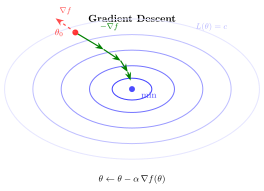

# E.3 微积分与优化

> 相关章节：[第5章 策略梯度](/chapter05_policy_gradient/policy-gradient)、[第6章 PPO 数学推导](/chapter06_ppo/ppo-math)、[第8章 GRPO](/chapter08_grpo_rlvr/grpo-mechanism)

优化是强化学习的核心操作。训练 RL 模型的过程，本质上是对参数 $\theta$ 反复调整，使得某个目标函数（期望回报、偏好损失等）最大化或最小化。微积分提供了"朝哪个方向调整"和"调整多少"的数学工具。本节从单变量导数出发，推广到多变量的梯度与 Hessian 矩阵，最后介绍梯度下降的各类变体。

## 导数

**定义（导数）.** 函数 $f: \mathbb{R} \to \mathbb{R}$ 在点 $x$ 处的导数定义为

$$f'(x) = \lim_{h \to 0} \frac{f(x + h) - f(x)}{h}$$

导数的几何含义是函数图像在该点处切线的斜率。它回答了一个基本问题：若自变量沿正方向移动一个无穷小量，函数值将如何变化？导数为正时函数局部递增，导数为负时函数局部递减，导数为零时函数在该点取极值（或为鞍点）。

这一概念直接导向优化的基本策略：沿导数的反方向移动自变量，函数值将下降。梯度下降即建立在这一观察之上。

## 链式法则

**定理（链式法则）.** 设 $y = f(g(x))$，其中 $g$ 在 $x$ 处可导，$f$ 在 $g(x)$ 处可导，则

$$\frac{dy}{dx} = f'(g(x)) \cdot g'(x)$$

链式法则的直观含义是：变化沿复合结构逐层传递。$x$ 的微小变化引起 $g(x)$ 的变化，$g(x)$ 的变化又引起 $f(g(x))$ 的变化，总变化率等于各层变化率的乘积。

**在强化学习中**，策略梯度 $\nabla_\theta \log \pi_\theta(a \mid s)$ 的计算就是链式法则的应用。$\pi_\theta$ 通常是一个多层神经网络，$\log \pi$ 对 $\theta$ 的梯度通过反向传播（backpropagation）逐层计算，而反向传播本质上就是链式法则的系统化应用。PPO 损失函数中概率比 $r_t(\theta) = \pi_\theta / \pi_{\theta_{old}}$ 对 $\theta$ 的梯度，同样是链式法则的展开。

## 梯度

当函数有多个自变量时，导数的概念推广为**梯度**。

**定义（梯度）.** 设 $f: \mathbb{R}^n \to \mathbb{R}$，则 $f$ 在 $\mathbf{x}$ 处的梯度定义为

$$\nabla f(\mathbf{x}) = \begin{bmatrix} \frac{\partial f}{\partial x_1} \\ \frac{\partial f}{\partial x_2} \\ \vdots \\ \frac{\partial f}{\partial x_n} \end{bmatrix}$$

梯度的核心性质是：**梯度方向是函数局部增长最快的方向**。因此，**负梯度方向是函数局部下降最快的方向**。这一结论可由 Cauchy-Schwarz 不等式严格证明。

由此直接得到梯度下降的基本形式：

$$\theta \leftarrow \theta - \alpha \nabla f(\theta)$$

其中 $\alpha > 0$ 为学习率（步长）。

## 多变量微积分的扩展

### Jacobian 矩阵

当函数的输出也是多维的（$\mathbf{f}: \mathbb{R}^n \to \mathbb{R}^m$），偏导数排列成 Jacobian 矩阵：

$$\mathbf{J} = \begin{bmatrix} \frac{\partial f_1}{\partial x_1} & \cdots & \frac{\partial f_1}{\partial x_n} \\ \vdots & \ddots & \vdots \\ \frac{\partial f_m}{\partial x_1} & \cdots & \frac{\partial f_m}{\partial x_n} \end{bmatrix}$$

Jacobian 描述了多输入多输出函数的局部线性近似。梯度是 Jacobian 在 $m = 1$ 时的特例。

### Hessian 矩阵

二阶偏导数排列成 Hessian 矩阵：

$$\mathbf{H} = \begin{bmatrix} \frac{\partial^2 f}{\partial x_1^2} & \cdots & \frac{\partial^2 f}{\partial x_1 \partial x_n} \\ \vdots & \ddots & \vdots \\ \frac{\partial^2 f}{\partial x_n \partial x_1} & \cdots & \frac{\partial^2 f}{\partial x_n^2} \end{bmatrix}$$

Hessian 描述了函数的**曲率**——梯度的变化率。在优化中它用于判断驻点的性质：

- Hessian 正定（所有特征值 $> 0$）→ 局部极小值
- Hessian 负定（所有特征值 $< 0$）→ 局部极大值
- 特征值既有正又有负 → 鞍点

二阶优化方法（如牛顿法）利用 Hessian 的逆矩阵调整步长。在 RL 中，TRPO 的 KL 约束可以用 Fisher 信息矩阵（Hessian 的期望形式）来近似，从而实现更稳定的策略更新。

## 梯度下降的演化

### 梯度下降

$$\theta \leftarrow \theta - \alpha \nabla_\theta \mathcal{L}(\theta)$$

每步沿负梯度方向移动 $\alpha$ 步。学习率 $\alpha$ 过大则训练发散，过小则收敛极慢。

### 随机梯度下降（SGD）

$$\theta \leftarrow \theta - \alpha \nabla_\theta \mathcal{L}(\theta; \mathbf{x}_i)$$

SGD 用单个样本（或小批量）估计梯度，而非全量数据。代价是梯度估计含有噪声，但优势在于：(1) 每步计算代价低；(2) 噪声具有隐式正则化效果，有助于逃离局部极小值。

强化学习天然就是随机的——每条轨迹仅提供真实梯度的一个有噪估计。REINFORCE 算法即是用单条轨迹的样本来估计策略梯度。

### Adam

$$m_t = \beta_1 m_{t-1} + (1-\beta_1) g_t$$

$$v_t = \beta_2 v_{t-1} + (1-\beta_2) g_t^2$$

$$\theta \leftarrow \theta - \alpha \cdot \frac{\hat{m}_t}{\sqrt{\hat{v}_t} + \epsilon}$$

Adam 同时维护梯度的一阶矩（动量）$m_t$ 和二阶矩 $v_t$，$\hat{m}_t$ 和 $\hat{v}_t$ 为偏差校正后的估计值。

Adam 是 RL 训练中最常用的优化器。原因在于 RL 梯度的两个特点：(1) 梯度噪声极大，源于环境的随机性和策略的探索；(2) 不同参数的梯度尺度差异显著，网络前几层和后几层的梯度量级可能相差数个数量级。Adam 的自适应学习率为每个参数单独调整步长，自动适应这种异质性。

默认超参数 $\beta_1 = 0.9$、$\beta_2 = 0.999$、$\epsilon = 10^{-8}$ 在大多数 RL 任务中无需调整。

## 凸优化基础

**定义（凸函数）.** 函数 $f$ 称为凸函数，当且仅当对任意 $\mathbf{x}, \mathbf{y}$ 和 $\lambda \in [0, 1]$，有

$$f(\lambda \mathbf{x} + (1-\lambda)\mathbf{y}) \le \lambda f(\mathbf{x}) + (1-\lambda) f(\mathbf{y})$$

凸函数的基本性质是：**局部最优即全局最优**。从任何初始点出发，梯度下降都能收敛到全局最优解。

**强化学习中的凸性。** RL 的目标函数几乎都是非凸的——策略参数 $\theta$ 与目标函数 $J(\theta)$ 之间经过多层非线性变换，存在大量局部极小值和鞍点。这是 RL 训练困难的根本原因之一。尽管如此，凸优化的概念在以下场景中仍然有用：

- **正则化项**是凸的。权重衰减 $\lambda \|\theta\|_2^2$ 是凸函数，附加到非凸目标上可以使优化景观更平滑
- **奖励模型训练**中的交叉熵损失对最后一层线性参数是凸的，因此奖励模型的训练通常比策略优化更稳定
- **DPO 损失**虽整体非凸，但其中超参数 $\beta$ 的选择可借鉴凸优化的分析工具

## Taylor 展开与局部近似

Taylor 展开用多项式近似一个函数在给定点的局部行为。一阶 Taylor 展开为

$$f(x + \delta) \approx f(x) + f'(x) \cdot \delta$$

多变量情形下为

$$f(\mathbf{x} + \boldsymbol{\delta}) \approx f(\mathbf{x}) + \nabla f(\mathbf{x})^\top \boldsymbol{\delta}$$

Taylor 展开为梯度下降提供了严格的理论依据：在 $\mathbf{x}$ 的邻域内，函数可被线性近似。使 $f$ 下降最快的 $\boldsymbol{\delta}$ 即为 $\boldsymbol{\delta} = -\alpha \nabla f(\mathbf{x})$。

在 PPO 中，概率比 $r_t(\theta) = \pi_\theta / \pi_{\theta_{old}}$ 在 $\theta = \theta_{old}$ 处的一阶 Taylor 展开为常数（$r_t = 1$），二阶项才反映策略变化。KL 约束的本质就是限制二阶项的大小，从而保证每步更新不会过大。

## 公式速查

| 概念        | 公式                                                                                          | 应用场景                |
| ----------- | --------------------------------------------------------------------------------------------- | ----------------------- |
| 导数        | $f'(x) = \lim_{h \to 0} \frac{f(x+h) - f(x)}{h}$                                              | 优化基础                |
| 链式法则    | $\frac{d}{dx}f(g(x)) = f'(g) \cdot g'(x)$                                                     | 反向传播、策略梯度计算  |
| 梯度        | $\nabla f = [\partial f/\partial x_1, \ldots, \partial f/\partial x_n]^\top$                  | 参数更新方向            |
| 梯度下降    | $\theta \leftarrow \theta - \alpha \nabla \mathcal{L}$                                        | RL 优化的基本形式       |
| Adam        | $\theta \leftarrow \theta - \alpha \hat{m}/(\sqrt{\hat{v}} + \epsilon)$                       | RL 最常用的优化器       |
| 一阶 Taylor | $f(\mathbf{x}+\boldsymbol{\delta}) \approx f(\mathbf{x}) + \nabla f^\top \boldsymbol{\delta}$ | PPO/GRPO 的局部近似分析 |
