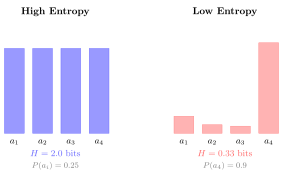

# E.4 信息论

> 相关章节：[第6章 GAE 与奖励模型](/chapter06_ppo/gae-reward-model)、[第7章 DPO](/chapter07_alignment/dpo-math)、[第9章 SAC](/chapter09_continuous_control/sac-comparison)

信息论研究信息的度量、存储与传输。在强化学习中，信息论提供了三个关键工具：熵（度量不确定性）、KL 散度（度量两个分布之间的差异）、交叉熵（分类任务的标准损失）。SAC 利用熵鼓励探索，RLHF 利用 KL 约束防止策略退化，DPO 通过隐式 KL 正则化绕过显式的奖励模型训练。本节从自信息的直觉出发，逐步建立完整的信息论概念体系。

## 自信息

考虑一个简单的概率实验。从一副洗好的 52 张牌中翻牌：

- "我看到了一张牌。"——这件事概率为 1，没有提供任何新信息。
- "这是一张红心。"——四种花色等概率，概率为 $1/4$，提供了一定信息量。
- "这是黑桃 3。"——52 张牌等概率，概率为 $1/52$，提供了更多信息。
- 按顺序读出整副牌的排列。——$52!$ 种排列等概率，提供了极大量信息。

从中可以观察到一个规律：**事件发生的概率越低，得知该事件发生时所获得的信息量越大。** 换言之，信息量与"意外程度"成正比。

**定义（自信息）.** 事件 $X$ 的自信息定义为

$$I(X) = -\log_2 P(X)$$

取负号是为了保证信息量为正值（因为 $P(X) \in (0, 1]$，$\log P(X) \le 0$）。使用以 2 为底的对数时，信息量的单位为**比特**（bit）。

对数的选择保证了信息的可加性：两个独立事件同时发生的信息量等于各自信息量之和，因为 $\log(P(A) \cdot P(B)) = \log P(A) + \log P(B)$。

回到前面的例子："看到一张牌"的信息量为 $-\log_2(1) = 0$ bit；"看到红心"为 $-\log_2(1/4) = 2$ bit；"看到黑桃 3"为 $-\log_2(1/52) \approx 5.7$ bit。这一定量结果与直觉一致。

## 熵

自信息度量的是单个事件的信息量。对于随机变量整体的"平均不确定性"，我们使用熵来度量。

**定义（熵）.** 离散随机变量 $X$ 的（Shannon）熵定义为

$$H(X) = -\sum_x P(x) \log P(x) = \mathbb{E}_{x \sim P}[-\log P(x)]$$

对于连续随机变量，求和替换为积分，得到**微分熵**：

$$H(X) = -\int p(x) \log p(x) \, dx$$

熵是自信息在分布上的期望值。它的含义是：

- 熵高 → 分布接近均匀 → 各结果的出现概率相近 → 不确定性大
- 熵低 → 分布集中 → 大部分概率集中在少数结果上 → 不确定性小

两个极端情形：确定性分布（$P(x_0) = 1$，其余为 0）的熵为 0——没有任何不确定性；均匀分布（所有结果等概率）的熵取最大值——不确定性最大。

### 熵与策略的探索

在强化学习中，策略 $\pi(a \mid s)$ 的熵为

$$H(\pi(\cdot \mid s)) = -\sum_a \pi(a \mid s) \log \pi(a \mid s)$$

熵高时，策略在各动作之间分配的概率较为均匀，探索充分。熵低时，策略几乎确定性地选择某一动作，倾向于利用（exploitation）但可能陷入局部最优。

SAC（Soft Actor-Critic）将熵直接纳入目标函数：

$$J(\pi) = \sum_{t=0}^{T} \mathbb{E}\left[r(s_t, a_t) + \alpha \cdot H(\pi(\cdot \mid s_t))\right]$$

系数 $\alpha$ 控制探索与利用的权衡。$\alpha$ 大则更鼓励探索，$\alpha$ 小则更注重即时回报。SAC 支持对 $\alpha$ 的自动调节，通过维持目标熵水平来动态平衡探索与利用。

在 PPO 和 GRPO 的实现中，也常见熵正则化项 $-\beta H(\pi)$ 被加入损失函数，以防止策略过早退化为确定性策略。

## 交叉熵

**定义（交叉熵）.** 设 $P$ 和 $Q$ 为同一空间上的两个概率分布，$P$ 相对于 $Q$ 的交叉熵定义为

$$H(P, Q) = -\sum_x P(x) \log Q(x)$$

交叉熵的直观含义是：使用分布 $Q$ 来编码来自真实分布 $P$ 的数据时，所需的平均信息量。若 $Q = P$，则 $H(P, Q) = H(P)$。若 $Q$ 偏离 $P$，则 $H(P, Q) > H(P)$——需要额外的信息量来弥补模型的偏差。

在分类任务中，$P$ 为 one-hot 形式的真实标签，$Q$ 为模型输出的概率分布。最小化交叉熵 $H(P, Q)$ 等价于最大化正确类别的对数似然 $\log Q(y_{\text{true}})$。

**在强化学习中**，策略蒸馏（policy distillation）通过最小化 $H(\pi_{\text{teacher}}, \pi_{\text{student}})$ 让 student 策略学习模仿 teacher 策略的输出分布。

## KL 散度

**定义（KL 散度）.** 分布 $P$ 相对于分布 $Q$ 的 KL 散度定义为

$$D_{KL}(P \| Q) = \sum_x P(x) \log \frac{P(x)}{Q(x)}$$

KL 散度具有以下基本性质：

1. **非负性**：$D_{KL}(P \| Q) \ge 0$，当且仅当 $P = Q$ 时取等号
2. **非对称性**：一般而言 $D_{KL}(P \| Q) \ne D_{KL}(Q \| P)$，因此 KL 散度不是一个真正的距离度量
3. **与交叉熵的关系**：$D_{KL}(P \| Q) = H(P, Q) - H(P)$

### 非对称性的含义

$D_{KL}(P \| Q)$ 与 $D_{KL}(Q \| P)$ 的侧重点不同：

- $D_{KL}(P \| Q)$ 要求在 $P$ 概率较大的区域，$Q$ 也必须给出合理的概率。若 $P$ 认为某事件很重要而 $Q$ 认为其几乎不可能，则 $D_{KL}(P \| Q)$ 会很大。这种模式下，$Q$ 必须覆盖 $P$ 的所有"高概率区域"。
- $D_{KL}(Q \| P)$ 要求在 $Q$ 概率较大的区域，$P$ 不能给出零概率。若 $Q$ 在 $P$ 认为不可能的区域分配了概率，则 $D_{KL}(Q \| P)$ 趋向无穷。这种模式下，$Q$ 被零概率约束所限制，不能偏离 $P$ 太远。

### KL 散度在 RLHF 中的核心作用

在 RLHF 训练中，策略可能利用奖励模型的缺陷生成看似高分但实际无意义的回答（reward hacking）。KL 散度约束是主要的防御手段：

$$J(\pi) = \mathbb{E}_{\pi}[r(x, y)] - \beta D_{KL}(\pi_\theta \| \pi_{\text{ref}})$$

$\beta D_{KL}$ 项惩罚策略偏离参考模型 $\pi_{\text{ref}}$（通常是 SFT 后的模型）的程度，确保策略在追求高奖励的同时保持合理的语言生成能力。

### DPO 中的隐式 KL 正则化

DPO 的损失函数中不显式包含 KL 散度项，但通过 Bradley-Terry 模型推导，KL 正则化已隐含其中：

$$\mathcal{L}_{\text{DPO}} = -\mathbb{E}\left[\log \sigma\left(\beta \log \frac{\pi_\theta(y_w \mid x)}{\pi_{\text{ref}}(y_w \mid x)} - \beta \log \frac{\pi_\theta(y_l \mid x)}{\pi_{\text{ref}}(y_l \mid x)}\right)\right]$$

其中 $\beta \log (\pi_\theta / \pi_{\text{ref}})$ 即为隐式奖励，参数 $\beta$ 在效果上等价于 RLHF 中的 KL 惩罚系数。$\beta$ 越大，策略偏离参考模型的代价越高。

## 互信息

**定义（互信息）.** 随机变量 $X$ 与 $Y$ 的互信息定义为

$$I(X; Y) = D_{KL}(P_{XY} \| P_X \otimes P_Y) = H(X) - H(X \mid Y)$$

互信息度量的是：在已知 $Y$ 的条件下，$X$ 的不确定性减少了多少。两个极端情形：若 $X$ 与 $Y$ 独立，则 $I(X; Y) = 0$；若已知 $Y$ 即可完全确定 $X$，则 $I(X; Y) = H(X)$。

**在强化学习中**，互信息用于表征学习（representation learning）。学习到的状态表征 $\phi(s)$ 应与未来回报具有高互信息 $I(\phi(s); G_t)$，同时与任务无关的特征具有低互信息。

## 公式速查

| 概念     | 公式                                                                      | 应用场景               |
| -------- | ------------------------------------------------------------------------- | ---------------------- |
| 自信息   | $I(X) = -\log P(X)$                                                       | 信息量的基本度量       |
| 熵       | $H(X) = -\sum P(x)\log P(x)$                                              | SAC 熵正则化、探索策略 |
| 交叉熵   | $H(P, Q) = -\sum P(x)\log Q(x)$                                           | 分类损失、策略蒸馏     |
| KL 散度  | $D_{KL}(P\|Q) = \sum P(x)\log\frac{P(x)}{Q(x)}$                           | RLHF KL 约束、PPO/GRPO |
| 互信息   | $I(X;Y) = H(X) - H(X\mid Y)$                                              | 表征学习               |
| 隐式奖励 | $r(x,y) = \beta\log\frac{\pi_\theta(y\mid x)}{\pi_{\text{ref}}(y\mid x)}$ | DPO 的隐式正则化       |
