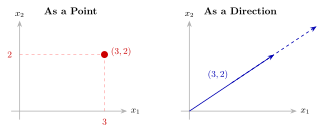
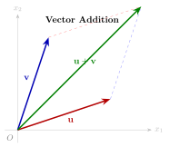
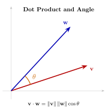

# E.1 线性代数

> 相关章节：[第3章 MDP 形式化](/chapter03_mdp/formalism)、[第4章 DQN](/chapter04_dqn/from-q-to-dqn)、[第9章 连续控制](/chapter09_continuous_control/intro)

线性代数是强化学习的数学语言。RL 中的状态用向量表示，策略参数存储在矩阵中，价值函数的收敛性与特征值有关。本节从向量的几何解释出发，逐步建立矩阵运算、特征分解和范数的概念体系。

## 向量的几何解释

设 $\mathbf{x} = [x_1, x_2, \ldots, x_n]^\top$ 为 $\mathbb{R}^n$ 中的向量。对向量的理解可以有两种等价的几何视角。

**空间中的点。** 在二维情形下，$[3, 2]^\top$ 表示平面上横坐标为 3、纵坐标为 2 的点。在强化学习中，状态向量 $\mathbf{s} = [s_1, s_2, \ldots, s_n]^\top$ 就是状态空间中的一个点，每个分量编码了环境的一个特征（位置、速度、角度等）。将状态视为空间中的点，有助于理解"两个状态之间的距离"等概念。

**空间中的方向。** 同一个 $[3, 2]^\top$ 也可以理解为"向右走 3 步、向上走 2 步"这一方向。这一视角在理解梯度时尤为关键——策略梯度 $\nabla_\theta J$ 本身就是一个方向向量，指示参数应在参数空间中朝哪个方向移动才能提升期望回报。

两种视角可以随时切换。点的视角便于观察任务结构（如两个状态是否接近），方向的视角便于理解优化过程（如梯度下降在做什么）。

## 向量加法与标量乘法

**向量加法** $\mathbf{u} + \mathbf{v}$ 的几何含义遵循平行四边形法则：先沿 $\mathbf{u}$ 的方向移动，再沿 $\mathbf{v}$ 的方向移动，最终到达的位置即为 $\mathbf{u} + \mathbf{v}$。

这一运算在理解残差连接（ResNet 中的 skip connection）时很直观——网络学习的增量 $\Delta \mathbf{y}$ 被叠加到原始输入 $\mathbf{x}$ 上：$\mathbf{y} = \mathbf{x} + \Delta \mathbf{y}$。

**标量乘法** $c \cdot \mathbf{v}$ 的几何含义是：将向量 $\mathbf{v}$ 沿其方向拉伸（$c > 1$）或压缩（$0 < c < 1$），$c < 0$ 时方向反转。在 SAC 算法中，熵系数 $\alpha$ 的作用正是对探索方向的"力度"进行标量缩放。

## 点积与夹角

**定义（点积）.** 给定向量 $\mathbf{u}, \mathbf{v} \in \mathbb{R}^n$，其点积定义为

$$\mathbf{u} \cdot \mathbf{v} = \mathbf{u}^\top \mathbf{v} = \sum_{i=1}^{n} u_i v_i$$

点积与两个向量之间的夹角 $\theta$ 有如下关系：

$$\mathbf{u} \cdot \mathbf{v} = \|\mathbf{u}\| \cdot \|\mathbf{v}\| \cdot \cos \theta$$

其中 $\|\mathbf{u}\| = \sqrt{\sum u_i^2}$ 是向量的 L2 范数（长度）。

由此可得三个重要的特殊情况：

- **方向相同**（$\theta = 0$）：点积取最大值 $\|\mathbf{u}\| \|\mathbf{v}\|$
- **相互正交**（$\theta = 90°$）：点积为零。两个向量在彼此方向上没有分量
- **方向相反**（$\theta = 180°$）：点积取最小值 $-\|\mathbf{u}\| \|\mathbf{v}\|$

**在强化学习中**，点积出现在 Q 值的计算 $Q(s, a) = \mathbf{w}^\top \phi(s, a)$ 中，本质上是特征向量 $\phi$ 与权重 $\mathbf{w}$ 的点积。注意力机制中的 scaled dot-product attention 同样基于点积来度量相似度。

### 余弦相似度

将点积归一化即得到余弦相似度：

$$\cos(\mathbf{u}, \mathbf{v}) = \frac{\mathbf{u} \cdot \mathbf{v}}{\|\mathbf{u}\| \cdot \|\mathbf{v}\|}$$

余弦相似度消除了向量长度的影响，仅度量方向的接近程度，取值范围为 $[-1, 1]$。

## 矩阵乘法与线性变换

矩阵与向量的乘法 $\mathbf{y} = \mathbf{A}\mathbf{x}$ 的几何含义是对向量 $\mathbf{x}$ 施加一次**线性变换**。

一种直观的理解方式是将矩阵的每一列视为基向量变换后的位置。例如对于 $2 \times 2$ 矩阵

$$\mathbf{A} = \begin{bmatrix} a_{11} & a_{12} \\ a_{21} & a_{22} \end{bmatrix}$$

第一列 $[a_{11}, a_{21}]^\top$ 是原 $[1, 0]^\top$ 变换后的位置，第二列 $[a_{12}, a_{22}]^\top$ 是原 $[0, 1]^\top$ 变换后的位置。矩阵乘法将空间进行拉伸、旋转或剪切。

在强化学习中，神经网络的每一层（忽略非线性激活函数）都是一次线性变换。策略网络 $\pi_\theta$ 的参数 $\theta$ 由一组矩阵构成，定义了从状态空间到动作空间的映射。

## 特征值与特征向量

**定义.** 设 $\mathbf{A}$ 为 $n \times n$ 方阵。若存在非零向量 $\mathbf{v}$ 和标量 $\lambda$ 使得

$$\mathbf{A}\mathbf{v} = \lambda \mathbf{v}$$

则称 $\mathbf{v}$ 为 $\mathbf{A}$ 的**特征向量**，$\lambda$ 为对应的**特征值**。

几何上，特征向量是矩阵变换中方向不变的向量——矩阵对它的唯一效应是缩放。若 $\lambda > 1$，该方向被拉伸；若 $|\lambda| < 1$，该方向被压缩。

**在强化学习中的应用.** 特征值在 RL 理论中有若干重要角色：

- **价值迭代的收敛性。** Bellman 算子的谱半径（最大特征值的绝对值）等于折扣因子 $\gamma$。由于 $\gamma < 1$，Bellman 算子是压缩映射，从而保证价值迭代收敛。
- **Fisher 信息矩阵与自然梯度。** TRPO 算法中的 KL 约束本质上是在 Fisher 信息矩阵定义的度量下限制策略更新距离。Fisher 矩阵的特征值反映了参数空间各方向的曲率。
- **经验回放的优先级设计。** TD error 的方差分析可借助特征值分解，解释为何某些样本比其他样本具有更高的信息量。

## 范数

范数用于度量向量或矩阵的"大小"。以下是 RL 中最常用的几种范数。

**向量范数。**

| 范数           | 定义                                     | 性质         |
| -------------- | ---------------------------------------- | ------------ |
| L1 范数        | $\|\mathbf{x}\|_1 = \sum \|x_i\|$        | 促进稀疏性   |
| L2 范数        | $\|\mathbf{x}\|_2 = \sqrt{\sum x_i^2}$   | 对应欧氏距离 |
| L$\infty$ 范数 | $\|\mathbf{x}\|_\infty = \max_i \|x_i\|$ | 度量最大分量 |

**矩阵范数。** Frobenius 范数 $\|\mathbf{A}\|_F = \sqrt{\sum_{i,j} a_{ij}^2}$ 是矩阵范数中与 L2 范数最接近的推广。

**在强化学习中**，梯度裁剪 $\|\nabla_\theta\|_2 \le c$ 使用 L2 范数防止梯度爆炸。权重衰减的惩罚项 $\lambda \|\theta\|_2^2$ 使用 L2 范数约束参数规模。PPO 的裁剪目标隐含着参数更新步长不应过大的假设，这一步长正是用 L2 范数度量的。

## 公式速查

| 概念           | 公式                                                                | 应用场景             |
| -------------- | ------------------------------------------------------------------- | -------------------- |
| 点积           | $\mathbf{u} \cdot \mathbf{v} = \sum u_i v_i$                        | Q 值计算、相似度度量 |
| 余弦相似度     | $\frac{\mathbf{u} \cdot \mathbf{v}}{\|\mathbf{u}\| \|\mathbf{v}\|}$ | embedding 比较       |
| 矩阵-向量乘法  | $\mathbf{y} = \mathbf{A}\mathbf{x}$                                 | 神经网络层变换       |
| 特征值分解     | $\mathbf{A}\mathbf{v} = \lambda \mathbf{v}$                         | 收敛性分析、自然梯度 |
| L2 范数        | $\|\mathbf{x}\|_2 = \sqrt{\sum x_i^2}$                              | 梯度裁剪、权重衰减   |
| Frobenius 范数 | $\|\mathbf{A}\|_F = \sqrt{\sum_{i,j} a_{ij}^2}$                     | 参数正则化           |
