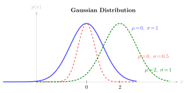

# E.2 概率与统计

> 相关章节：[第3章 MDP 形式化](/chapter03_mdp/formalism)、[第5章 策略梯度](/chapter05_policy_gradient/policy-gradient)、[第6章 GAE](/chapter06_ppo/gae-reward-model)

概率论是强化学习的理论基础。MDP 在形式上是一个概率框架：状态转移由分布 $P(s' \mid s, a)$ 描述，策略输出的是动作的概率分布 $\pi(a \mid s)$，目标函数是回报的期望。本节从条件概率出发，逐步建立期望、方差、常用分布和重要性采样等概念，并说明它们在 RL 算法中的具体角色。

## 条件概率

**定义.** 设 $P(B) > 0$，事件 $A$ 在给定事件 $B$ 下的条件概率定义为

$$P(A \mid B) = \frac{P(A \cap B)}{P(B)}$$

条件概率的直观含义是：在已知 $B$ 已发生的前提下，$A$ 发生的概率。它等价于将样本空间从"所有可能结果"缩小到"使得 $B$ 成立的子集"，再在该子集中计算 $A$ 所占的比例。

在 MDP 中，状态转移概率 $P(s' \mid s, a)$ 表示"在当前状态为 $s$ 且动作为 $a$ 的条件下，下一状态为 $s'$ 的概率"。策略 $\pi(a \mid s)$ 表示"在状态为 $s$ 的条件下选择动作 $a$ 的概率"。整个 MDP 的轨迹可以看作条件概率的链式展开。

## 贝叶斯定理

**定理（贝叶斯）.** 设 $P(B) > 0$，则

$$P(A \mid B) = \frac{P(B \mid A) \cdot P(A)}{P(B)}$$

贝叶斯定理建立了正向概率 $P(B \mid A)$ 与逆向概率 $P(A \mid B)$ 之间的桥梁。各部分的名称如下：

- $P(A)$ 称为**先验**（prior），表示在观测到 $B$ 之前对 $A$ 的信念
- $P(B \mid A)$ 称为**似然**（likelihood），表示若 $A$ 为真时观测到 $B$ 的概率
- $P(A \mid B)$ 称为**后验**（posterior），表示观测到 $B$ 之后对 $A$ 的更新信念

**在强化学习中**，贝叶斯强化学习利用贝叶斯定理维护对环境参数（转移概率、奖励函数）的后验分布，每收集一条新数据便更新后验。偏好学习中的 Bradley-Terry 模型同样基于贝叶斯思想：通过观测到的偏好 $(y_w \succ y_l)$ 推断奖励函数的后验。

## 随机变量与期望

随机变量是一个取值具有不确定性的量，其取值由某个概率分布决定。掷骰子的结果、股票的收盘价、RL 智能体在某状态获得的回报——都是随机变量的实例。

**定义（期望）.** 离散随机变量 $X$ 的期望（均值）定义为

$$\mathbb{E}[X] = \sum_x x \cdot P(x)$$

对于连续随机变量，求和替换为积分：

$$\mathbb{E}[X] = \int x \cdot p(x) \, dx$$

期望具有**线性性**，这是策略梯度推导中反复使用的性质：

$$\mathbb{E}[aX + bY] = a\mathbb{E}[X] + b\mathbb{E}[Y]$$

在强化学习中，价值函数 $V^\pi(s) = \mathbb{E}_\pi[G_t \mid s_0 = s]$ 是回报的期望，策略梯度 $\nabla_\theta J = \mathbb{E}[\nabla_\theta \log \pi(a \mid s) \cdot A_t]$ 是优势函数与对数策略梯度的期望。几乎所有 RL 目标函数都写成期望的形式，原因在于环境的随机性使得我们只能优化策略的"平均表现"。

## 方差与标准差

**定义（方差）.** 随机变量 $X$ 的方差定义为

$$\text{Var}(X) = \mathbb{E}[(X - \mathbb{E}[X])^2] = \mathbb{E}[X^2] - (\mathbb{E}[X])^2$$

标准差是方差的平方根 $\sigma = \sqrt{\text{Var}(X)}$。

方差度量随机变量的"波动程度"。方差大意味着实际值偏离均值的幅度大，结果不稳定；方差小意味着结果相对确定。

**方差与策略梯度。** 策略梯度方法面临的核心困难之一是梯度估计的方差过高。$\nabla_\theta J = \mathbb{E}[\nabla \log \pi(a \mid s) \cdot G_t]$ 中的 $G_t$ 是多步累积回报，其方差通常很大。引入 baseline $b(s)$（通常取 $V(s)$）可以在不改变期望值的前提下降低方差：

$$\nabla_\theta J = \mathbb{E}[\nabla \log \pi(a \mid s) \cdot (G_t - b(s))]$$

这一技巧是从 REINFORCE 到 Actor-Critic 演化的关键动机。

## 常用概率分布

### 伯努利分布

最简单的离散分布，仅有两种可能的取值：

$$P(X = 1) = p, \quad P(X = 0) = 1 - p$$

其期望为 $\mathbb{E}[X] = p$，方差为 $\text{Var}(X) = p(1-p)$。二值奖励（任务成功或失败）服从伯努利分布。

### 分类分布（Categorical Distribution）

伯努利分布的 $K$ 维推广：

$$P(X = k) = p_k, \quad \sum_{k=1}^{K} p_k = 1$$

分类分布是**离散动作空间 RL 中最基本的分布**。策略网络 $\pi_\theta(a \mid s)$ 输出的即为分类分布——每个动作对应一个概率 $p_k$。训练时通过 $\log \pi_\theta(a \mid s)$ 计算策略梯度。

### 高斯分布（正态分布）

$$\mathcal{N}(x \mid \mu, \sigma^2) = \frac{1}{\sqrt{2\pi\sigma^2}} \exp\left(-\frac{(x - \mu)^2}{2\sigma^2}\right)$$

高斯分布由均值 $\mu$ 和方差 $\sigma^2$ 两个参数确定，呈钟形曲线。

高斯分布是**连续动作空间 RL 中最基本的分布**。连续策略通常参数化为 $\pi_\theta(a \mid s) = \mathcal{N}(a \mid \mu_\theta(s), \sigma_\theta(s)^2)$，即网络输出均值和标准差，动作从该高斯分布中采样。SAC、PPO 在连续控制任务中均采用高斯策略。

多元高斯分布的形式为

$$\mathcal{N}(\mathbf{x} \mid \boldsymbol{\mu}, \boldsymbol{\Sigma}) = \frac{1}{(2\pi)^{n/2}|\boldsymbol{\Sigma}|^{1/2}} \exp\left(-\frac{1}{2}(\mathbf{x} - \boldsymbol{\mu})^\top \boldsymbol{\Sigma}^{-1} (\mathbf{x} - \boldsymbol{\mu})\right)$$

其中 $\boldsymbol{\Sigma}$ 为协方差矩阵。实际应用中最常见的简化是取对角协方差矩阵（假设各维度独立）。

## 大数定律与蒙特卡洛估计

**大数定律**表明，当样本量 $N \to \infty$ 时，样本均值收敛于总体期望：

$$\frac{1}{N}\sum_{i=1}^{N} x_i \xrightarrow{N \to \infty} \mathbb{E}[X]$$

大数定律是蒙特卡洛方法的数学基础。

**在强化学习中**，蒙特卡洛回报估计 $G_t = \sum_{k=0}^{T-t} \gamma^k r_{t+k}$ 即是对价值函数的蒙特卡洛估计：跑一条完整轨迹，将沿途奖励累加，作为 $V(s)$ 的近似。轨迹数越多，估计越准确。但单条轨迹的方差往往很高——这正是时序差分学习（TD learning）和 GAE 引入偏差以换取方差降低的动机。

## 重要性采样

重要性采样是一种利用来自分布 $Q$ 的样本来估计分布 $P$ 下期望值的技术。

**定理（重要性采样）.** 设 $P$ 和 $Q$ 为同一空间上的两个概率分布，且当 $P(x) > 0$ 时 $Q(x) > 0$，则

$$\mathbb{E}_{x \sim P}[f(x)] = \mathbb{E}_{x \sim Q}\left[f(x) \cdot \frac{P(x)}{Q(x)}\right]$$

其中 $\frac{P(x)}{Q(x)}$ 称为**重要性权重**（importance weight）。

其含义是：我们希望估计 $P$ 分布下的期望，但手中仅有 $Q$ 分布下收集的样本。对每个样本乘以重要性权重——若 $P$ 比 $Q$ 更倾向选择该样本，权重则大于 1；反之权重小于 1。

**在强化学习中**，PPO 和 GRPO 的概率比 $r_t(\theta) = \frac{\pi_\theta(a_t \mid s_t)}{\pi_{\theta_{old}}(a_t \mid s_t)}$ 即为重要性权重。它使得算法可以用旧策略 $\pi_{\theta_{old}}$ 收集的数据来更新新策略 $\pi_\theta$，而无需每次参数更新后重新采样。

需要注意的是，当 $P$ 和 $Q$ 差异较大时，重要性权重可能出现极端值，导致估计方差急剧增大。PPO 的裁剪机制 $\text{clip}(r_t, 1-\varepsilon, 1+\varepsilon)$ 正是为了缓解这一问题——当新旧策略差异超出阈值时，直接截断权重。

## 协方差与相关系数

协方差度量两个随机变量之间的线性关系：

$$\text{Cov}(X, Y) = \mathbb{E}[(X - \mathbb{E}[X])(Y - \mathbb{E}[Y])]$$

将其标准化后得到相关系数 $\rho \in [-1, 1]$：

$$\rho_{XY} = \frac{\text{Cov}(X, Y)}{\sigma_X \sigma_Y}$$

在分析奖励模型评分与人类偏好之间的一致性时，相关系数是常用的评估指标。

## 公式速查

| 概念       | 公式                                                  | 应用场景                    |
| ---------- | ----------------------------------------------------- | --------------------------- |
| 条件概率   | $P(A \mid B) = P(A \cap B) / P(B)$                    | MDP 状态转移、策略分布      |
| 贝叶斯定理 | $P(A \mid B) = P(B \mid A) P(A) / P(B)$               | 贝叶斯 RL、偏好学习         |
| 期望       | $\mathbb{E}[X] = \sum x \cdot P(x)$                   | 价值函数、策略梯度          |
| 方差       | $\text{Var}(X) = \mathbb{E}[X^2] - (\mathbb{E}[X])^2$ | baseline 的动机、GAE        |
| 分类分布   | $P(X=k) = p_k$                                        | 离散动作策略                |
| 高斯分布   | $\mathcal{N}(\mu, \sigma^2)$                          | 连续动作策略                |
| 重要性采样 | $\mathbb{E}_P[f] = \mathbb{E}_Q[f \cdot P/Q]$         | PPO/GRPO 的 off-policy 修正 |
