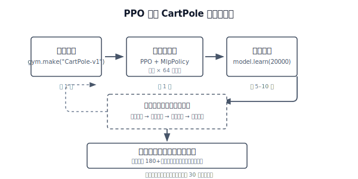

# 第 1 章 · CartPole 倒立摆

> **本章目标**：零基础运行第一个 RL 训练脚本，直观感受智能体如何通过试错自主习得策略。不要求任何理论知识。

> 📁 **本章代码**：[1-ppo_cartpole.py](https://github.com/walkinglabs/hands-on-modern-rl/blob/main/code/chapter01_cartpole/1-ppo_cartpole.py) · [2-pytorch_ppo.py](https://github.com/walkinglabs/hands-on-modern-rl/blob/main/code/chapter01_cartpole/2-pytorch_ppo.py) · [requirements.txt](https://github.com/walkinglabs/hands-on-modern-rl/blob/main/code/chapter01_cartpole/requirements.txt)

## 1.1 运行 CartPole 训练

经过上面的前置阅读，我们已经对强化学习有了一个初步印象。下面先回顾强化学习的核心机制：它由一个智能体（Agent）和一个环境（Environment）组成，智能体通过不断尝试动作并获取奖励信号，逐步学习在特定状态下应采取的最优决策。

那么，什么才是"恰当的决策"？我们从一个经典任务入手——CartPole（倒立摆）。正如 `print("Hello World")` 是编程入门的第一步，用几十行代码让一根杆子在小车上保持平衡，是踏入强化学习领域的标准起点。


<div style="text-align: center; font-size: 0.9em; color: var(--vp-c-text-2); margin-top: -10px; margin-bottom: 20px;">
  <em>图 1-1：CartPole 智能体的三个典型姿态：轻微左倾、接近直立与轻微右倾。图中的虚线给出了竖直参考方向，可以看到高分策略并不是让杆子完全静止，而是在小幅摆动中持续纠偏。</em>
</div>

你可能会问：训练这样一个智能体需要什么硬件条件？

事实上，这个任务的计算需求很低，普通个人电脑（包括 Intel Mac、Apple Silicon、Windows/Linux）均可运行：

- **不需要显卡 (GPU)**：该任务的计算量很小，CPU 即可完成训练。
- **内存占用极小**：运行时的内存占用通常在 100MB~200MB 左右。
- **模型参数量极少**：使用的神经网络策略（`MlpPolicy`）只有两层，每层 64 个神经元，参数量仅数千个。

在这个过程中，我们将使用 Gymnasium（当前 RL 环境的绝对标准）作为训练场，并引入 Stable Baselines3 (SB3) 算法库。如果说 PyTorch 是造汽车的零件，那么 SB3 就是已经组装好的发动机，它把前沿的 PPO 算法封装成了几行极简的代码。

本章不要求读者事先掌握复杂的微积分或高维矩阵运算。接下来直接动手，用代码实现一个 CartPole 智能体。



<div style="text-align: center; font-size: 0.9em; color: var(--vp-c-text-2); margin-top: -10px; margin-bottom: 20px;">
  <em>图 1-2：PPO 训练 CartPole 的完整流程。整个流程在个人电脑上不到 30 秒即可完成。</em>
</div>

### 安装依赖

首先，打开你的终端，安装环境库和算法库：

```bash
pip install "gymnasium[classic-control]" stable-baselines3
```

> **注意**：`stable-baselines3` 依赖于 `PyTorch`。由于 PyTorch 体积较大，这一步可能需要较长的下载时间。这是整个第一章中唯一涉及大体积依赖安装的步骤。

### 运行训练脚本

首先安装完整依赖：

```bash
pip install -r requirements.txt
```

这个仓库给了你两个 CartPole 实现，**任选一种先跑通都可以**：

- [1-ppo_cartpole.py](https://github.com/walkinglabs/hands-on-modern-rl/blob/main/code/chapter01_cartpole/1-ppo_cartpole.py)：基于 SB3 的 PPO 封装版，最适合第一次快速跑通。
- [2-pytorch_ppo.py](https://github.com/walkinglabs/hands-on-modern-rl/blob/main/code/chapter01_cartpole/2-pytorch_ppo.py)：纯 PyTorch 手写 PPO 版，适合想要了解实现细节的读者。

这两个脚本都会把训练指标记录到 SwanLab，并且训练结束后都支持用 `--gui` 弹出小车演示窗口：

```bash
# SB3 封装版（推荐第一次先跑这个）
python 1-ppo_cartpole.py
python 1-ppo_cartpole.py --gui

# 纯 PyTorch 版（希望同时了解实现细节可运行此版本）
python 2-pytorch_ppo.py
python 2-pytorch_ppo.py --gui
```

运行后你会看到控制台快速滚动训练日志，训练完成后模型会自动保存到 `output/` 目录。

关于 `--gui` 参数：训练阶段始终是 headless（无渲染），速度不受影响。`--gui` 只控制训练结束后的演示环节是否弹出 CartPole 动画窗口。开启 GUI 时每帧需要等待屏幕刷新（约 16ms），演示会慢一些；关闭 GUI 时演示环节纯计算，几秒内跑完。

### SwanLab 训练曲线查看方法

本章两个脚本默认都把 SwanLab 配成了 `mode="local"`，所以**最常见的查看方式是本地看板**。训练跑完后，在当前目录执行：

```bash
swanlab watch swanlog
```

然后在浏览器打开下面任意一个地址：

- `http://127.0.0.1:5092`
- `http://localhost:5092`

浏览器打开本地地址后，你通常会先看到这样的 SwanLab 项目页：


<div style="text-align: center; font-size: 0.9em; color: var(--vp-c-text-2); margin-top: -10px; margin-bottom: 20px;">
  <em>浏览器访问 <code>http://127.0.0.1:5092</code> 后，通常会先进入这样的项目页。左侧能看到实验列表；点进某个实验后，再切到 <code>Chart</code> 标签，就能继续看训练曲线。</em>
</div>

点进实验后，你会看到类似下面这样的曲线页：


<div style="text-align: center; font-size: 0.9em; color: var(--vp-c-text-2); margin-top: -10px; margin-bottom: 20px;">
  <em>这是进入某个实验、再点击 <code>Chart</code> 后的页面。这里会按 <code>rollout</code>、<code>time</code>、<code>train</code> 等分组展示指标曲线。</em>
</div>

你最先该看的曲线通常是 `rollout/ep_rew_mean`，也就是”平均每局得分”。它持续上升，即表明智能体的表现正在改善。

如果你后面把 SwanLab 改成云端模式，那么常见入口就是官网工作台：

- `https://swanlab.cn`

登录后进入你的项目页或实验页，也能看到同样的训练曲线。本章先用本地模式，是为了让你不用注册账号也能直接看结果。

如果你想系统读懂这些曲线里的每个指标，下一节可以继续看 [训练与指标](./metrics)。

```python
# 下面先以 SB3 版为例；纯 PyTorch 版记录的指标名保持一致，只是把 PPO 训练循环完整展开了
import gymnasium as gym
from stable_baselines3 import PPO
from swanlab.integration.sb3 import SwanLabCallback

env = gym.make("CartPole-v1")
model = PPO("MlpPolicy", env, verbose=1)

# 训练（SwanLab 自动记录奖励曲线等指标）
model.learn(
    total_timesteps=80000,
    callback=SwanLabCallback(
        project="cartpole-ppo",
        experiment_name="PPO-CartPole-v1",
        mode="local",
    ),
)

# 评估与保存
mean_reward, std_reward = evaluate_policy(model, env, n_eval_episodes=10)
print(f"训练完成！平均奖励: {mean_reward} +/- {std_reward}")
model.save("output/ppo_cartpole")

# 演示（加 --gui 时 render_mode="human" 弹出窗口，否则纯计算）
vis_env = gym.make("CartPole-v1", render_mode="human")  # 或 None
for episode in range(5):
    obs, info = vis_env.reset()
    ...
```

以上短短几十行代码，就实现了一个通过自我试错掌握平衡控制的智能体。那么，这个黑盒内部究竟发生了什么？接下来的「核心原理」和「训练与指标」两节将逐步展开。
