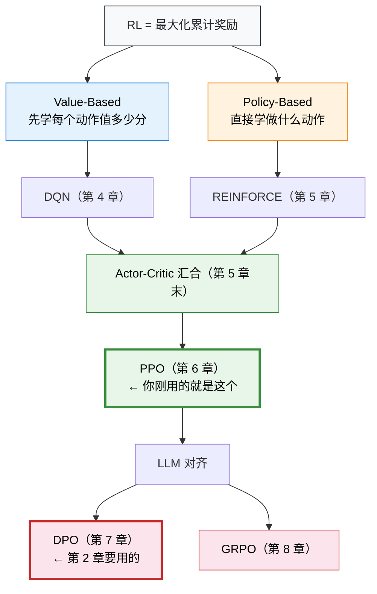

# 1.5 再看指标：读懂 RL 的训练成绩单

> 📁 **本章代码**：[hello_rl.py](https://github.com/walkinglabs/hands-on-modern-rl/blob/main/code/chapter01_cartpole/hello_rl.py) · [hello_rl_tensorboard.py](https://github.com/walkinglabs/hands-on-modern-rl/blob/main/code/chapter01_cartpole/hello_rl_tensorboard.py) · [pytorch_from_scratch.py](https://github.com/walkinglabs/hands-on-modern-rl/blob/main/code/chapter01_cartpole/pytorch_from_scratch.py) · [requirements.txt](https://github.com/walkinglabs/hands-on-modern-rl/blob/main/code/chapter01_cartpole/requirements.txt)

在上一节中，我们理解了 RL 的四个核心要素（状态、动作、奖励、策略），也看到了 SB3 黑盒内部的三步循环。现在，让我们回到 1.2 节看到的那段训练日志，用新学到的概念重新审视每一个数字——这一次，你应该会觉得它们不再是一堆陌生术语，而是一张清晰的学习进度报告。

先回顾一下那段日志：

```
-----------------------------------------
| time/              |                  |
|    fps             | 5342             |
|    iterations      | 1                |
|    time_elapsed    | 3                |
|    total_timesteps | 2048             |
| train/             |                  |
|    entropy_loss    | -0.683           |
|    learning_rate   | 0.0003           |
|    loss            | 0.0124           |
|    policy_gradient_loss | -0.0187     |
|    value_loss      | 8.2741           |
-----------------------------------------
```

这里面有五个关键指标。我们把它们分成两类：**衡量策略表现的指标**（告诉你"学得怎么样"）和**衡量训练过程的指标**（告诉你"训练过程健不健康"）。

### **Episode Reward：策略表现的终极裁判**

**Episode Reward**（回合奖励）是一个回合中所有步骤奖励的总和。在 CartPole 中，因为每步奖励都是 +1，所以 Episode Reward 就等于杆子存活的总步数。

这是衡量 RL 智能体表现的**第一指标**，没有之一。它就像学生的考试总分——不管你中间做了什么操作、用了什么技巧，最终就看这个数字高不高。

在 TensorBoard 中，这个指标显示为 `rollout/ep_rew_mean`（平均回合奖励）。一条健康的 Episode Reward 曲线应该呈现以下特征：

- **整体趋势上升**：说明策略在改进。如果从头到尾都是一条平线，说明训练根本没生效。
- **上升速度先快后慢**：早期从"完全随机"到"基本能平衡"的进步空间很大，曲线陡峭；后期从"基本能平衡"到"完美平衡"越来越难，曲线趋于平缓。这和人类学习任何技能的规律一样——从 0 分到 60 分容易，从 95 分到 100 分很难。
- **最终趋于稳定**：策略收敛到一个不错的水平，曲线在某个值附近小幅波动。
- **稳定后仍有小幅波动**：这是正常的，源于采样的随机性。即使策略不变，每一局的具体表现也会有差异。

如果曲线出现以下异常，就说明训练出了问题（我们会在附录A详细讨论怎么修复）：

| 异常现象                 | 可能原因                   | 严重程度 |
| ------------------------ | -------------------------- | -------- |
| 突然暴跌到 0             | 策略崩溃，学习率太大       | 严重     |
| 始终不动（卡在 20 左右） | 策略没有在学习，超参数不当 | 严重     |
| 剧烈震荡不收敛           | 训练不稳定，奖励信号太稀疏 | 中等     |
| 稳定在 100 左右不上去了  | 探索不够，陷入局部最优     | 中等     |

### **Entropy：策略的"犹豫程度"**

训练日志中的 `entropy_loss` 对应的概念是**策略熵（Entropy）**。这是初学者最容易忽略、但实际上极其重要的指标。

熵是一个来自信息论的概念，它衡量的是"不确定程度"。在 CartPole 中，策略只有两个动作可选，所以熵的含义非常直白（如果你跳过了上一节，这里 π 就是"策略"的意思，π(向左) = 0.5 表示策略选择向左推的概率是 50%）：

- 训练初期：**π(左) ≈ 0.5, π(右) ≈ 0.5** → "两个动作概率差不多，我完全不知道该选哪个" → 熵高
- 训练后期：**π(左) ≈ 0.1, π(右) ≈ 0.9** → "我很确定这时候应该向右推" → 熵低

**熵从高到低的过程，就是智能体从"到处乱试"到"胸有成竹"的过程。**

如果你在 TensorBoard 中同时查看 `rollout/ep_rew_mean` 和 `train/entropy_loss`，你会看到一幅非常经典的画面：Episode Reward 的曲线在上升，Entropy 的曲线在下降——两条曲线形成了一个优雅的**剪刀交叉**。这个剪刀交叉几乎是所有成功 RL 训练的共同特征：策略在变得越来越"有把握"的同时，表现也在越来越好。

但 entropy 并不是越低越好。如果训练初期 entropy 就迅速降到接近 0，说明策略过早地"锁死"在某个可能并不好的动作模式上——这叫做**过早收敛（Premature Convergence）**。就像一个学生只做了 3 道题就觉得自己学会了，后面再也不愿意尝试新方法。RL 算法通常会通过"熵正则化"（鼓励策略保持一定程度的随机性）来防止这种情况，我们在第 6 章讲 PPO 时会详细讨论。

> **动手实验**：运行 [hello_rl_tensorboard.py](https://github.com/walkinglabs/hands-on-modern-rl/blob/main/code/chapter01_cartpole/hello_rl_tensorboard.py)，在 TensorBoard 中同时勾选 `rollout/ep_rew_mean` 和 `train/entropy_loss`，亲眼看看这个"剪刀交叉"。

### **Value Loss：Critic 的"考试分数"**

训练日志中的 `value_loss` 是 Critic 网络的损失值。要理解它，我们需要回到 1.4 节——当时我们说 PPO 内部有一个并行的 Critic 网络，它的工作是预测"当前局面值多少分"。在数学上，Critic 试图学习的是状态价值函数 V(s)，而 value_loss 衡量的是 Critic 的预测和实际结果之间的差距。

你可以把 Critic 想象成一个"打分老师"：

- 训练初期，Critic 也不知道该怎么打分（value_loss 很大）——它可能看到一个明明快要倒的杆子局面，却打出了 90 分
- 随着训练进行，Critic 的打分越来越准（value_loss 逐渐减小）——它能准确判断"这个局面大概还能坚持 50 步"

这里有一个容易混淆的要点：**value_loss 减小不等于策略在变好**。Value_loss 只说明 Critic 打分越来越准了，但策略本身好不好要看 Episode Reward。不过一个健康的训练过程，通常 value_loss 是在逐步减小的。如果 value_loss 长期不降或者反而增大，说明 Critic 学坏了——这通常和奖励信号的设计有关。

### **Policy Gradient Loss：策略更新的"方向盘"**

日志中的 `policy_gradient_loss` 是策略网络的损失值。还记得 1.4 节的核心公式 `loss = -log_prob × total_reward` 吗？这个值就是那个损失。

它的大小本身不太重要（不像 value_loss 那样越小越好），重要的是它的**符号和趋势**：

- 在健康训练中，这个值通常在一个小范围内波动（比如 -0.01 到 -0.05）
- 如果突然变成一个很大的正数或负数，可能意味着策略更新出了问题

在初学阶段，你不需要深究这个指标。等你到了第 6 章学习 PPO 的裁剪机制时，我们会重新回到这里。

### **Learning Rate：学习的"步幅"**

日志中的 `learning_rate = 0.0003` 是 Adam 优化器的学习率。它控制每次参数更新的"步子"有多大。

- 学习率太大（比如 0.01）：每步更新太猛，策略容易崩溃——就像开车的方向盘转得太急，车子失控
- 学习率太小（比如 0.000001）：每步更新太温和，策略学得太慢——训练 10 万步都不见起色
- SB3 的默认值 0.0003 是经过大量实验验证的"甜蜜点"，对 CartPole 这类简单任务非常适用

> **动手实验**：打开 [pytorch_from_scratch.py](https://github.com/walkinglabs/hands-on-modern-rl/blob/main/code/chapter01_cartpole/pytorch_from_scratch.py)，把学习率从 `3e-4` 改成 `3e-2`（增大 100 倍），重新运行。你会看到训练曲线剧烈震荡甚至崩溃——这就是学习率太大的后果。

## 指标速查表

把本节的内容浓缩成一张表，方便你以后训练时快速查阅：

| 指标                     | 含义                | 健康表现            | 异常信号                   |
| ------------------------ | ------------------- | ------------------- | -------------------------- |
| **Episode Reward**       | 策略表现的总分      | 持续上升 → 趋于稳定 | 暴跌到 0 / 始终不动        |
| **Entropy**              | 策略的探索程度      | 从高到低逐步下降    | 过快降到 0 / 长期不降      |
| **Value Loss**           | Critic 打分的准确性 | 逐步减小            | 长期不降 / 反而增大        |
| **Policy Gradient Loss** | 策略更新的损失      | 小范围波动          | 突然出现极端值             |
| **Learning Rate**        | 参数更新步长        | 默认值即可          | 调大 → 崩溃；调小 → 学不动 |

## 本章小结

在第 1 章中，你完成了四件事：

1. **运行了第一个 RL 训练**：几秒钟就让一个小车学会了平衡杆子
2. **学会了观察训练过程**：读懂了 Episode Reward、Entropy、Value Loss 等核心指标，知道什么是健康的训练曲线、什么是异常信号
3. **理解了 RL 的基本框架**：状态、动作、奖励、策略——这四个要素构成了所有 RL 问题的共同骨架
4. **撕开了 SB3 的黑盒**：看到了 `model.learn()` 背后的三步循环——策略网络、采样轨迹、策略更新

你可能已经注意到了一个有趣的现象：我们从头到尾没有告诉智能体"杆子向右倒的时候应该向右推"这样的规则。它完全是通过自己的试错，从"+1"这个简单的反馈信号中，自己摸索出了平衡的诀窍。

这就是强化学习的魔力所在——**没有人教它怎么做，它通过试错和反馈自己学会了**。

## 全景导航：RL 的两条路线

你刚才跑的 CartPole 训练，背后的算法叫 PPO。它很厉害，但现在你不需要理解它的细节——只需要知道它在整个 RL 版图上的位置。

所有 RL 算法都在回答同一个问题："怎么让 Agent 选出累计奖励最大的动作？"但有两条截然不同的思路：



- **Value-Based**（蓝色）：先搞清楚"每个动作值多少分"（Q 值），然后选分数最高的。代表是第 4 章的 DQN。
- **Policy-Based**（橙色）：跳过打分，直接学"什么情况做什么动作"的策略。代表是第 5 章的 REINFORCE。
- 两条路线最终在 **Actor-Critic** 架构中汇合——Actor 学策略，Critic 学价值。这就是 PPO 的骨架。
- 在 LLM 时代，DPO 绕过了 PPO 的奖励模型，GRPO 绕过了 Critic 网络——路线越来越简洁，但底层逻辑不变。

这张图会在后续每章的开头再次出现，高亮"你在这里"。现在你只需要记住一件事：**你刚才用的 PPO，就是两条路线汇合之后的产物。接下来的第 2 章，你会用到 DPO——那是 PPO 在 LLM 时代的简化版。**

在下一章中，我们将打开另一扇门：看看 RL 不只是让小车平衡杆子——它还能让大语言模型学会"说好话"。那将是完全不同的应用场景，但核心循环仍然是这四个要素。

---

## 参考文献

[^1]: Mnih, V., et al. (2013). Playing Atari with Deep Reinforcement Learning. _arXiv preprint_. [arXiv:1312.5602](https://arxiv.org/abs/1312.5602)

[^2]: Raffin, A., et al. (2021). Stable-Baselines3: Reliable Reinforcement Learning Implementations. _Journal of Machine Learning Research_, 22(268), 1-8.

[^3]: Sutton, R. S., et al. (1999). Policy Gradient Methods for Reinforcement Learning with Function Approximation. _Advances in Neural Information Processing Systems_, 12.
