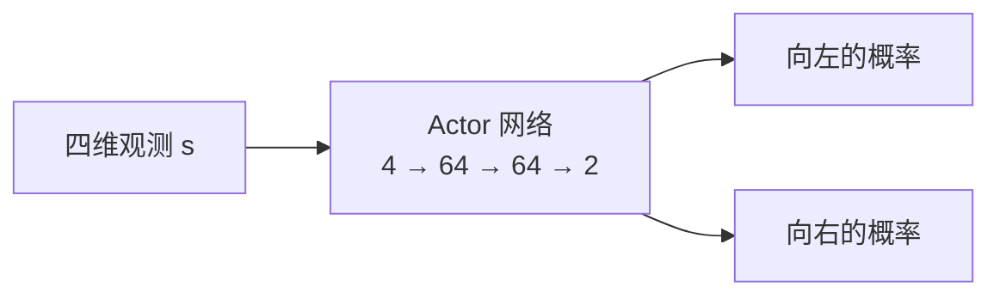
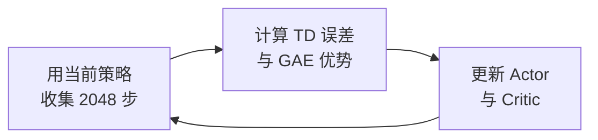
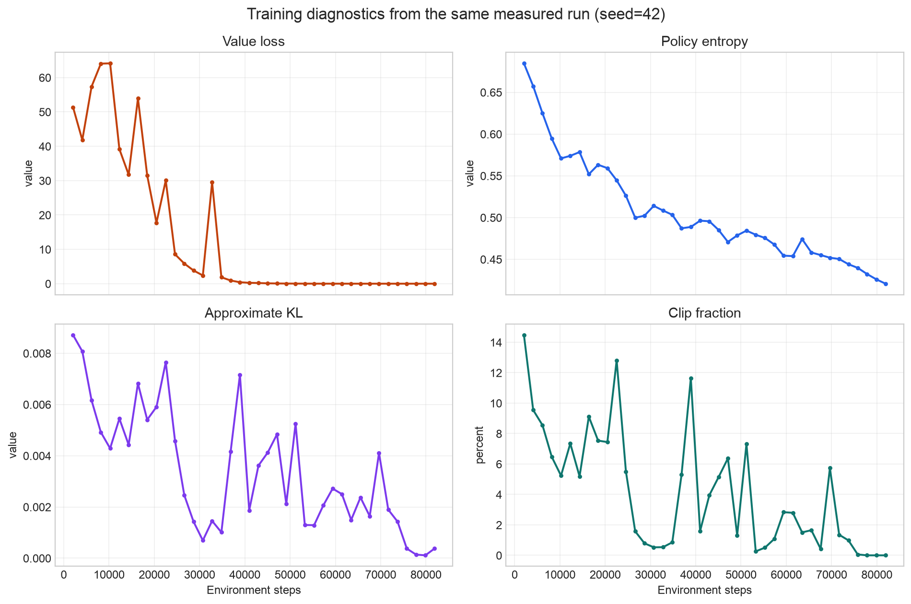

# 1.2 CartPole 原理

> **本节目标**：先讲清 CartPole 与 PPO 的原理，再从一次真实训练的原始记录出发，学会阅读回合奖励和四个 PPO 辅助指标。

> **学习路径**：[1.1 跑通 CartPole](./principles) → **1.2 CartPole 原理** → [1.3 PPO 训练可视化](./training)

> **本节代码与数据**：[纯 PyTorch PPO](https://github.com/walkinglabs/hands-on-modern-rl/blob/main/code/chapter01_cartpole/2-pytorch_ppo.py) · [原始训练指标 CSV](https://github.com/walkinglabs/hands-on-modern-rl/blob/main/code/chapter01_cartpole/output/training_metrics_seed42.csv) · [绘图脚本](https://github.com/walkinglabs/hands-on-modern-rl/blob/main/code/chapter01_cartpole/plot_curves.py)

::: tip 可选阅读
本节属于选读内容。如果你已有一定的 Python、PyTorch 或深度学习基础，可以直接往下读；如果还没有，可以先跳到 [1.3 动手：PPO 训练可视化](./training)，等需要弄清训练背后的机制时，再倒回来看这一节。
:::

上一节我们跑通了第一次 CartPole 训练，看到奖励曲线从 20 分涨到 500 分。这一节先拆解它背后的原理——环境给智能体什么信息、智能体怎么做决策、PPO 怎样用一段交互数据改进策略；然后回到训练记录本身，学会阅读回合奖励和四个 PPO 辅助指标。

## 环境规则：观测、动作与奖励

我们先来看环境本身的规则——上一节的曲线变化，正是发生在每一步的交互里。

CartPole 的画面很简单：一条水平轨道上有一辆小车，车顶通过转轴连着一根杆子。每隔一个很短的时间步，控制器要做一次选择——向左推小车，还是向右推小车。除此之外，它什么也做不了。

杆子受重力影响，一旦开始倾斜就会越倒越快。控制器只有不断调整推的方向，才能让杆子尽量长时间保持直立。

### 观测：环境每步返回四个数

控制器要决定向哪边推，就得先知道当前局面。人看一眼画面就能判断杆子是否倾斜，程序拿不到画面，需要的是数值。CartPole 每一步返回四个数字，作为控制器能看到的状态：

$$
s_t=[x_t,\ \dot{x}_t,\ \theta_t,\ \dot{\theta}_t].
$$

下标 $t$ 表示当前时刻，四个量依次是小车位置、小车速度、杆子角度和杆子角速度。

| 编号 | 观测量       | 含义                   | `observation_space` 中的边界 |
| ---- | ------------ | ---------------------- | ---------------------------- |
| 0    | $x$          | 小车位于轨道上的位置   | $[-4.8,\ 4.8]$               |
| 1    | $\dot{x}$    | 小车移动的方向和快慢   | $(-\infty,\ +\infty)$        |
| 2    | $\theta$     | 杆子偏离竖直方向的角度 | 约 $[-24^\circ,\ 24^\circ]$  |
| 3    | $\dot\theta$ | 杆子转动的方向和快慢   | $(-\infty,\ +\infty)$        |

角度和角速度必须同时出现。只知道杆子向右倾，还无法判断它正在快速倒向右侧，还是正在回到中间——这两种情况需要的动作可能完全相反。

下面的代码可以读取环境声明的观测范围和终止阈值：

```python
import gymnasium as gym
import numpy as np

env = gym.make("CartPole-v1")
print("观测上限:", env.observation_space.high)
print("观测下限:", env.observation_space.low)
print("小车位置阈值:", env.unwrapped.x_threshold)
print(
    "杆子角度阈值:",
    np.degrees(env.unwrapped.theta_threshold_radians),
    "度",
)
```

这里的无穷大表示 Gymnasium 没有给速度声明有限的观测边界，并不表示一次实际运行会产生无穷大的速度。

### 动作：向左或向右

知道了状态，控制器还要从中选择一个动作。CartPole 的动作集合为

$$
\mathcal{A}=\{0,1\}.
$$

| 动作 | 环境中的含义 |
| ---- | ------------ |
| 0    | 向左推小车   |
| 1    | 向右推小车   |

注意，动作集合里没有"不推"，也不能选择推力大小。程序每一步都必须在左和右之间做出选择。

从控制的角度看，动作先改变小车的运动，再通过小车和杆子的连接影响杆子。一次动作通常不能立即消除倾斜，策略需要根据下一步的新观测继续调整。

控制杆子需要连续决策，每一步的选择都会改变下一步的处境。

### 奖励：每存活一步得一分

观测和动作定义了"能看到什么"和"能做什么"，还差一个信号告诉程序哪些行为更好，这个信号就是奖励。环境每运行一步就给出 $+1$ 奖励。一个回合在以下任一情况发生时结束：

- 小车位置超出 $\pm 2.4$；
- 杆子角度超出约 $\pm 12^\circ$；
- 回合达到 500 步时间上限。

因此，CartPole-v1 的回合奖励与存活步数相等。坚持 37 步得到 37 分，撑满上限得到 500 分。

细看这个奖励，会发现它并不直接指明"当前应该向左推"，只记录一次动作之后任务是否还在继续。程序需要比较许多次交互，逐渐找出哪些状态和动作更容易带来较长的回合——这就是后面策略和价值网络要做的事。

## 策略与 Actor 网络

有了观测、动作和奖励，还差一条规则：在某个状态下，应该选哪个动作。这条规则称为**策略**，记作 $\pi$。

对 CartPole 来说，策略接收四维观测，输出两个动作的概率：

$$
\pi(a\mid s)=P(A_t=a\mid S_t=s).
$$

先看一个具体状态。假设杆子正在向右倾，策略可能给出

$$
\pi(0\mid s)=0.3,\qquad \pi(1\mid s)=0.7.
$$

这表示训练时有 30% 的概率向左推，70% 的概率向右推。策略根据完整的四维观测计算概率，不能只用杆子向哪边倾来决定动作——小车速度、杆子角速度等信息同样影响最优选择。

实现上用一个小型神经网络表示策略。输入层接收四个数，输出层产生两个动作的分数，再通过概率分布采样：


```mermaid
flowchart LR
    S["四维观测 s"] --> N["Actor 网络<br/>4 → 64 → 64 → 2"]
    N --> L["向左的概率"]
    N --> R["向右的概率"]
```

Actor 的输出层使用较小的初始权重，因此训练刚开始时，两个动作的概率通常都接近 0.5，策略会尝试左右两种动作。随着训练推进，策略逐渐学会在不同状态下给出不同的概率分布。

## Critic 与状态价值

策略能输出动作概率，但仅凭某一步的 $+1$ 奖励，很难判断这个动作是否改善了长期结果。在 CartPole 里，同一个"向右推"的动作，有时能让杆子多撑几十步，有时只是推迟了倒下的时间。单看一步的奖励区分不出这两种情况。

PPO 为此增加了第二个网络，称为 **Critic**。

Critic 接收状态 $s_t$，输出状态价值 $V(s_t)$。这个数表示：从当前状态继续按照现有策略行动，预计还能获得多少折扣回报。

代码把两个网络放在同一个 `ActorCritic` 类中：

```python
class ActorCritic(nn.Module):
    def __init__(self, obs_dim=4, act_dim=2, hidden=64):
        super().__init__()
        self.actor = nn.Sequential(
            nn.Linear(obs_dim, hidden),
            nn.Tanh(),
            nn.Linear(hidden, hidden),
            nn.Tanh(),
            nn.Linear(hidden, act_dim),
        )
        self.critic = nn.Sequential(
            nn.Linear(obs_dim, hidden),
            nn.Tanh(),
            nn.Linear(hidden, hidden),
            nn.Tanh(),
            nn.Linear(hidden, 1),
        )
```

Actor 决定怎样行动，Critic 估计当前局面的长期价值。训练时，两个网络都根据采集到的轨迹更新。后面的 PPO 训练流程会用到 Critic 的输出来计算优势——也就是判断某一步的动作到底比预期好多少。

## PPO 训练流程

到目前为止，我们分别介绍了 Actor 和 Critic，但还没有说它们怎样配合。现在把两个网络连起来，看一次完整的 PPO 迭代怎样进行。

一次迭代先使用当前策略收集 2048 步。每一步保存状态、动作、奖励、动作的对数概率和 Critic 给出的价值：

```python
for _ in range(num_steps):
    action, log_prob, value = model.get_action(obs_tensor)
    next_obs, reward, terminated, truncated, _ = env.step(action.item())
```

这段数据称为一段 **rollout**。它可以包含多个完整回合，也可能在某个回合中间结束。

收集完之后，程序要做两件事：先判断每一步的动作比预期好多少（优势），再据此更新策略——但更新的幅度要有限制。

### TD 误差与 GAE 优势

采样结束后，程序先计算每一步的 TD 误差：

$$
\delta_t=r_t+\gamma V(s_{t+1})-V(s_t).
$$

$V(s_t)$ 是 Critic 在动作执行前给出的预期，$r_t+\gamma V(s_{t+1})$ 是执行动作后得到的新估计。若 $\delta_t>0$，说明这一步的结果高于 Critic 原来的预期。

只使用一步的误差容易受到 Critic 估计偏差的影响。代码使用 GAE，把当前和后续若干步的 TD 误差合成优势 $A_t$：

$$
A_t=\delta_t+\gamma\lambda\delta_{t+1}
+(\gamma\lambda)^2\delta_{t+2}+\cdots.
$$

优势为正时，PPO 会提高这次动作在相同状态下出现的概率；优势为负时，则会降低这个概率。这正是 Critic 存在的意义：它给每一步的动作提供一个比较基准。

### 概率比与裁剪目标

有了优势，还需要一个更新规则来调整策略。这里有一个问题：同一批 rollout 数据来自更新前的旧策略。如果新策略可以随意偏离旧策略，一次更新就可能把策略推到一个很差的区域。

为了比较新旧策略，PPO 计算已采样动作的概率比：

$$
r_t(\theta)=
\frac{\pi_\theta(a_t\mid s_t)}
{\pi_{\theta_{\mathrm{old}}}(a_t\mid s_t)}.
$$

代码取裁剪范围 $[0.8,1.2]$。当概率比超出这个范围时，裁剪目标会限制这条样本继续推动策略大幅变化：

```python
ratio = torch.exp(new_log_probs - batch_old_log_probs)
surr1 = ratio * batch_advantages
surr2 = torch.clamp(ratio, 0.8, 1.2) * batch_advantages
policy_loss = -torch.min(surr1, surr2).mean()
```

裁剪不保证每次更新都更好，但它限制了同一批数据能带来的策略变化幅度，使新策略不会因为一批样本发生过大的单次偏移。

## 终止、截断与 rollout 边界

前面提到回合会在三种情况下结束。Gymnasium 用两个标记区分它们：`terminated` 和 `truncated`。它们都会让环境执行 `reset`，但在价值计算中含义不同。

`terminated=True` 表示杆子倒下或小车越界——回合已经自然结束，后续不可能再获得奖励，因此后续价值为 0。

`truncated=True` 表示回合达到 500 步时间上限——杆子此时可能仍然保持平衡，因此程序仍使用 $V(s_{t+1})$ 估计截断位置之后的价值。

无论是哪一种结束，GAE 都必须在 `reset` 处切断。新回合的优势不能传回上一个回合，否则相当于让上一局的结果去影响下一局的判断。

rollout 的 2048 步边界也不等于回合结束。如果采样在一个回合中间停止，下一轮应从当前状态继续，并继续累计这一回合的奖励。

## 训练主循环

现在可以把一次完整训练连起来。核心是三步：收集轨迹，计算优势，更新 Actor 和 Critic，然后重复。


```mermaid
flowchart LR
    A["用当前策略<br/>收集 2048 步"] --> B["计算 TD 误差<br/>与 GAE 优势"]
    B --> C["更新 Actor<br/>与 Critic"]
    C --> A
```

脚本重复这个过程 40 次：

```python
for iteration in range(40):
    transitions, obs = collect_rollout(model, env, obs, 2048)
    advantages, returns = compute_gae(transitions)
    metrics = ppo_update(
        model,
        optimizer,
        transitions,
        advantages,
        returns,
    )
```

第 1 轮使用接近随机的策略收集数据。更新后的策略会改变下一轮的数据分布，新的数据又会带来下一次更新。

策略在迭代中逐步修正，奖励曲线也就从 20 分逐步接近 500。

## 本页数据从哪里来

原理讲完之后，训练记录里还有更多值得看的东西——曲线上的每个点、日志里的每个数字都对应着刚才的某个环节。本页分析仓库中保存的一次真实运行，训练曲线、诊断曲线和控制台数字都来自同一份 CSV，没有把不同脚本或不同随机种子的结果拼在一起。

| 项目     | 本次运行设置                                                 |
| -------- | ------------------------------------------------------------ |
| 日期     | 2026-08-13                                                   |
| 环境     | `CartPole-v1`                                                |
| 算法     | 仓库中的纯 PyTorch PPO                                       |
| 随机种子 | `42`                                                         |
| 训练量   | 40 轮 × 2048 步 = 81,920 个环境步                            |
| 评估     | 训练后使用确定性策略独立运行 20 回合                         |
| 软件版本 | Python 3.12.13、PyTorch 2.13.0、Gymnasium 1.3.0、NumPy 2.5.2 |

复现命令如下。`--swanlab-mode disabled` 只关闭看板记录，不改变训练过程。

```bash
cd code/chapter01_cartpole
python 2-pytorch_ppo.py \
  --seed 42 \
  --iterations 40 \
  --steps-per-rollout 2048 \
  --swanlab-mode disabled \
  --log-csv output/training_metrics_seed42.csv

python plot_curves.py \
  --input output/training_metrics_seed42.csv \
  --output-dir output
```

下面摘录六轮训练日志。每个数字都可以在原始 CSV 中找到。

```text
迭代  1/40 | 回合数:  91 | 平均奖励:   21.4 | KL: 0.0087 | clip%: 14.5%
迭代  5/40 | 回合数:  15 | 平均奖励:  133.4 | KL: 0.0043 | clip%:  5.2%
迭代 10/40 | 回合数:   4 | 平均奖励:  500.0 | KL: 0.0059 | clip%:  7.4%
迭代 11/40 | 回合数:   5 | 平均奖励:  460.4 | KL: 0.0077 | clip%: 12.8%
迭代 20/40 | 回合数:   4 | 平均奖励:  500.0 | KL: 0.0019 | clip%:  1.6%
迭代 40/40 | 回合数:   4 | 平均奖励:  500.0 | KL: 0.0004 | clip%:  0.0%
训练完成！20 回合评估: 500.0 +/- 0.0
```

## 先看回合奖励

拿到记录后，我们最先看的是回合奖励。回合奖励等于存活步数，越高表示策略让杆子保持直立的时间越长。

训练脚本每轮收集 2048 步。它只统计在这一轮中结束的完整回合；跨越两轮采样边界的回合会继续累计，直到环境真正结束该回合。


<div class="figure-caption">图 1-3：seed=42 的原始训练奖励。每个点表示该轮结束的完整回合的平均奖励。曲线没有平滑，虚线表示单回合 500 步上限。</div>

第一轮结束了 91 个回合，平均奖励为 21.35。策略接近随机，因此多数回合很快结束。

第 10 轮结束了 4 个回合，平均奖励为 500.0。此时累计采样了 20,480 个环境步。

第 11 轮的平均奖励降到 460.4。PPO 训练使用随机动作采样，每轮包含的完整回合数也很少，因此单个点可以暂时下降。后续大多数轮次重新达到 500 分。

这些数字只描述 seed=42 的一次运行。若要比较两个算法的样本效率，需要运行多个随机种子，并使用相同的训练量和评估方法。

## 训练奖励与独立评估

看懂曲线之后，还有一个问题需要澄清：曲线上的训练奖励，和"模型到底好不好"并不是一回事。训练时，程序按照策略给出的概率抽取动作——即使向右的概率更大，仍可能抽到向左。这样的随机性让策略继续尝试不同动作，也会给训练奖励带来波动。

独立评估使用确定性策略。程序在每一步选择概率最大的动作，并从新的环境初始状态运行 20 个回合。本次结果为：

```text
mean = 500.0
std  = 0.0
```

平均值 500.0 表示 20 个回合都运行到时间上限，标准差 0.0 表示这 20 个得分没有差异。

独立评估检查保存下来的策略在固定规则下能达到什么结果。报告实验时，两者需要分开说明。

## 再看四个辅助指标

回合奖励告诉我们任务完成得怎样，但训练失败时它给不出原因。下面的四个指标正好检查原理部分的三个环节：策略是否过早固定、Critic 是否学会预测、每次 PPO 更新是否过大。

下面四条曲线与奖励曲线来自同一次运行。



<div class="figure-caption">图 1-4：Value Loss、Policy Entropy、Approximate KL 和 Clip Fraction 的原始值。四幅图共用 seed=42 的同一次训练记录。</div>

### 策略熵：动作选择有多确定

先看策略熵。原理部分说过，训练开始时两个动作的概率各接近 0.5。策略熵衡量的就是这种分散程度，此时熵接近

$$
\ln 2\approx 0.693.
$$

本次运行的策略熵从 0.685 降到 0.421。这说明动作概率逐渐拉开，但策略仍会根据不同状态给出不同结果。

熵下降只表示策略变得更确定。若奖励没有同时上升，策略也可能只是更确定地选择了错误动作。

### 价值损失：Critic 的预测误差

接下来看 Critic 学得怎样。Critic 预测从状态 $s_i$ 出发的折扣回报，价值损失比较预测值 $V(s_i)$ 和训练目标 $\hat G_i$：

$$
L_V=\frac{1}{|B|}\sum_{i\in B}
\left(V(s_i)-\hat G_i\right)^2.
$$

$B$ 表示一个训练小批次。预测与目标相差越大，价值损失越大。

本次运行的价值损失前期在 41.8 到 64.1 之间波动，最后降到 0.00014。训练中间的上升表示策略到达了新的状态分布，Critic 需要重新调整预测。

价值损失较小只说明 Critic 更接近当前目标。策略是否完成任务仍要看回合奖励和独立评估。

### 近似 KL：新旧策略相差多大

第三个指标对应裁剪目标之前的概率比。近似 KL 比较更新前后的动作概率，数值越大，表示一次 PPO 更新使策略发生的变化越大。

本次 40 轮中的最大值为 0.00871，最后一轮为 0.00038。仓库代码没有根据 KL 提前停止训练，因此本页只报告实测值，不给出一个适用于所有任务的固定阈值。

### 裁剪比例：多少样本触发限制

最后一个指标直接来自裁剪目标。PPO 使用 $\epsilon=0.2$，把概率比限制在 $[0.8,1.2]$ 附近。裁剪比例统计超出这个范围的样本占比：

$$
\operatorname{clipfrac}=\frac{1}{|B|}\sum_{i\in B}
\mathbf 1\left[|r_i(\theta)-1|>\epsilon\right].
$$

本次运行第一轮为 14.48%，最后三轮为 0%。后期学习率逐渐降到 0，策略变化也随之变小。

裁剪比例需要与近似 KL、学习率和奖励一起阅读。单独一个高值或低值不能说明训练成功或失败。

## 训练异常时的检查顺序

把指标和原理对应起来之后，训练出问题时就有了一条清晰的排查路径。如果奖励曲线没有达到预期，可以沿着数据产生的顺序检查：

1. 检查 `terminated` 与 `truncated`。自然终止后的价值为 0，时间截断仍要使用 $V(s')$。
2. 检查 GAE 是否在每次 `reset` 处切断。优势不能从新回合传回旧回合。
3. 检查日志是否只统计完整回合，并继续累计跨 rollout 边界的回合。
4. 比较训练奖励和独立评估，确认问题发生在训练过程还是最终策略。
5. 再用策略熵、价值损失、近似 KL 和裁剪比例定位具体环节。

这个顺序先检查数据是否正确，再解释优化指标。错误的回合边界会直接改变训练目标，仅调学习率无法修正这类问题。

## 本节小结

- CartPole 用四个观测量、两个动作和每步 $+1$ 的奖励定义了任务；策略输出动作概率，Critic 估计长期价值，GAE 合成优势，裁剪目标限制更新幅度。
- 回合奖励等于存活步数，直接反映任务表现；训练奖励包含随机采样带来的探索，独立评估使用确定性动作。
- 策略熵、价值损失、近似 KL 和裁剪比例分别对应原理中的各个环节，用于解释训练过程，不能代替奖励。
- 本页曲线来自一次可复现的单种子运行；算法比较需要多个随机种子。

下一节 [PPO 训练可视化](./training) 将从同一条复现命令出发，生成原始 CSV、训练曲线和真实环境帧。

## 参考文献

[^1]: Schulman, J., Moritz, P., Levine, S., Jordan, M., & Abbeel, P. (2016). High-Dimensional Continuous Control Using Generalized Advantage Estimation. _ICLR 2016_.

[^2]: Schulman, J., Wolski, F., Dhariwal, P., Radford, A., & Klimov, O. (2017). Proximal Policy Optimization Algorithms. _arXiv preprint_ arXiv:1707.06347. <https://arxiv.org/abs/1707.06347>

[^3]: Sutton, R. S., & Barto, A. G. (2018). _Reinforcement Learning: An Introduction_ (2nd ed.). MIT Press.
