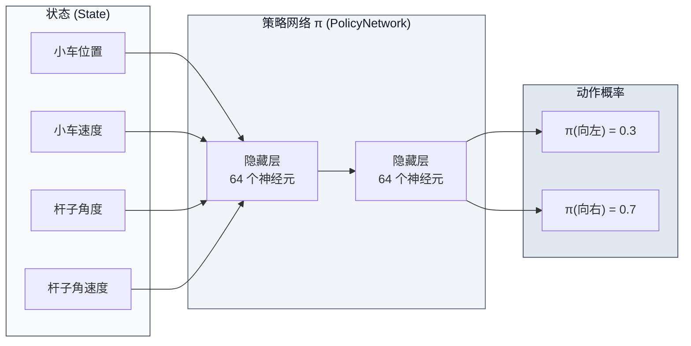
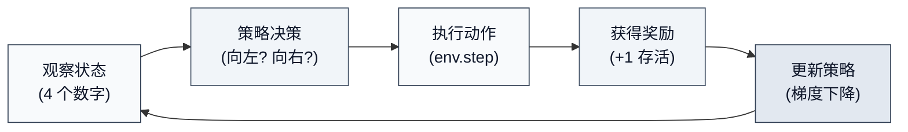
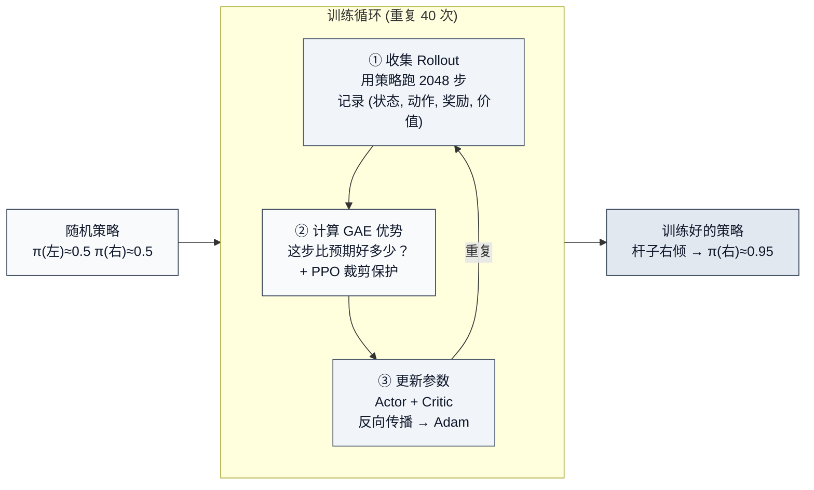

# 1.1 状态、动作、奖励与策略

> 📁 **本章代码**：[1-ppo_cartpole.py](https://github.com/walkinglabs/hands-on-modern-rl/blob/main/code/chapter01_cartpole/1-ppo_cartpole.py) · [2-pytorch_ppo.py](https://github.com/walkinglabs/hands-on-modern-rl/blob/main/code/chapter01_cartpole/2-pytorch_ppo.py) · [requirements.txt](https://github.com/walkinglabs/hands-on-modern-rl/blob/main/code/chapter01_cartpole/requirements.txt)

在上一节中，你已经亲手跑通了一个 CartPole 训练流程，并观察到智能体的表现如何从随机动作逐步收敛到稳定平衡。然而，仅仅跑通代码并不等于理解了强化学习。事实上，强化学习作为一种学习范式，有着与监督学习和无监督学习截然不同的理论基础。在 RL 正式得名之前，它的核心思想可以追溯到心理学中的行为主义——"试错学习"（trial-and-error learning）。早在 20 世纪初，心理学家 Edward Thorndike 就提出了"效果律"（Law of Effect）：带来满意后果的行为会被加强，带来烦恼后果的行为会被削弱。这一洞见在 80 年后被 Andrew Barto 和 Richard Sutton 形式化为现代强化学习的理论框架，他们以马尔可夫决策过程（Markov Decision Process, MDP）作为 RL 的数学基础，提出了状态、动作、奖励、策略这四个核心要素（Sutton & Barto, 1998）。

这一框架具有极强的通用性。它不仅适用于 CartPole 这样的简单环境，也适用于围棋（Silver et al., 2016）、机器人控制（Levine et al., 2016）乃至大语言模型的 RLHF 训练（Ouyang et al., 2022）。不同的任务只是改变了状态、动作、奖励的具体形式，底层结构始终是这四个要素。下面我们回到 CartPole，逐步拆解它的状态表示、动作空间、奖励机制和决策策略。

### 状态空间

每一帧，CartPole 环境都会向智能体发送一个包含 4 个数字的向量。这些数字的取值范围不是我们手动定义的，而是 Gymnasium 环境自带的属性。只需几行代码就能打印出来：

```python
import gymnasium as gym
import numpy as np

env = gym.make("CartPole-v1")
print(f"观测上限: {env.observation_space.high}")
print(f"观测下限: {env.observation_space.low}")
print(f"终止条件: 位置 ±{env.unwrapped.x_threshold}, "
      f"角度 ±{env.unwrapped.theta_threshold_radians:.4f} rad "
      f"(≈ ±{np.degrees(env.unwrapped.theta_threshold_radians):.0f}°)")
```

运行后实际输出如下：

```
观测上限: [4.8         inf 0.41887903  inf]
观测下限: [-4.8         -inf -0.41887903 -inf]
终止条件: 位置 ±2.4, 角度 ±0.2094 rad (≈ ±12°)
```

把这些数值整理成表格，就是智能体每帧收到的 4 维观测向量：

| 编号 | 含义       | 观测空间边界                   | 实际常见范围     |
| ---- | ---------- | ------------------------------ | ---------------- |
| 0    | 小车位置   | -4.8 ~ 4.8                     | -4.8 ~ 4.8       |
| 1    | 小车速度   | 无硬限制（Gymnasium 设为 inf） | 约 -3 ~ +3       |
| 2    | 杆子角度   | -0.4189 ~ 0.4189 rad (≈ ±24°)  | -0.21 ~ 0.21 rad |
| 3    | 杆子角速度 | 无硬限制（Gymnasium 设为 inf） | 约 -3 ~ +3       |

::: warning 为什么速度是 inf？
小车速度和杆子角速度没有硬上限——它们由物理引擎每帧计算，理论上可以取任意值。Gymnasium 因此把这两个维度的观测边界设为 `inf`。但在实际训练中，由于回合很快结束（杆子一倒就 reset），速度通常只落在 **-3 ~ +3** 的范围内，远没有到"无穷"。
:::

这 4 个数字就是对当前局面的完整描述。智能体无法访问环境内部的状态转移规则或物理参数，其决策所依据的全部信息就是这 4 个数值。

在强化学习中，"状态"是对环境当前局面的数值化描述。不同的任务有不同的状态表示——下棋的状态是棋盘上每个格子的棋子分布，自动驾驶的状态是摄像头图像和雷达数据，而 CartPole 的状态就是这 4 个数字。事实上，状态表示的选择对 RL 算法的性能有着深远影响。在早期的研究中，状态通常是经过精心手工设计的特征（如机器人的关节角度和角速度）。然而，随着深度学习的兴起，研究者开始直接使用高维的原始观测（如像素）作为状态，让神经网络自己学习有用的特征表示（Mnih et al., 2013）。这正是我们在本书中反复看到的趋势——从手工特征到学习特征。

### 动作空间

CartPole 的动作空间极其简单：只有两个选择。

| 动作 | 含义       |
| ---- | ---------- |
| 0    | 向左推小车 |
| 1    | 向右推小车 |

没有"不推"，没有"轻推重推"——只有左或右，非此即彼。这种有限的、离散的动作集合是 RL 中最常见的动作空间类型（称为 `Discrete` 动作空间）。然而，并非所有任务的动作空间都如此简单。在第 11 章，我们将遇到连续动作空间——比如控制机器人的关节角度，其处理方式有本质不同。事实上，动作空间的类型（离散 vs 连续）在很大程度上决定了算法的选择。Q-learning 类算法天然适合离散动作空间，而策略梯度方法（如我们使用的 PPO）则对两种空间都能胜任——这也是 PPO 在工业界被广泛采用的原因之一。

### 奖励函数

::: tip 奖励规则

- **每存活一步 → +1 分**（包括终止那一步）
- **回合结束条件**：杆子倾角超过 ±12°，或小车位置超出 ±2.4
- **满分 = 500 分**（CartPole-v1 的最大步数上限）
  :::

上面两个终止阈值（±2.4 和 ±12°）同样来自环境本身，前面的打印已经验证过：`env.unwrapped.x_threshold` 返回 2.4，`env.unwrapped.theta_threshold_radians` 返回约 0.2094 rad（即 12°）。500 步上限则可以通过 `env.spec.max_episode_steps` 确认：

```python
print(f"最大步数: {env.spec.max_episode_steps}")  # 输出: 500
```

这个设计看似简单，却蕴含着一个深意。Richard Sutton 在他的经典著作中提出了著名的"奖励假设"（Reward Hypothesis）：所有目标都可以被描述为"最大化期望累积奖励信号"（Sutton & Barto, 2018）。在 CartPole 中，这个奖励信号就是每步 +1——只要杆子没有倒下，智能体就获得一个正奖励。

然而，这个看似直观的奖励设计实际上隐藏着一个核心难题：**奖励信号是延迟的、稀疏的**。智能体在每一步都得到 +1，但它无法直接判断具体是哪一步的决策导致了回合的提前终止或延续。它只知道"这一局总共坚持了 50 步"，至于第 23 步推左还是推右更优，需要通过多轮交互才能推断出来。

这种"奖励信号只反映整体结果的好坏，不指明具体哪一步决策更优"的特性，是 RL 区别于监督学习的核心特征之一。在监督学习中，每个训练样本都有明确的标签作为正确答案；而在 RL 中，只有最终的总回报，中间过程需要智能体通过反复交互来自行推断。以骑自行车为例，学习者并不是因为有人在每一刻精确指导"左脚施力 30%，右脚 20%"才学会的，而是在反复尝试中逐渐感知到哪些动作有助于保持平衡。

### 策略函数

把以上三个要素串起来，就得到了 RL 的核心概念——**策略（Policy）**。

策略就是"在状态 s 下选择动作 a 的规则"。在 CartPole 中，策略回答的问题就是：**"给定当前的小车位置、速度、杆角度、角速度，应该向左推还是向右推？"**

用数学语言说，策略是一个从状态到动作概率分布的映射：π(a|s)。在离散动作空间中，它输出每个动作被选中的概率。训练开始时，π(左) ≈ 0.5, π(右) ≈ 0.5（随机初始化）；训练结束后，π 会学会在杆子右倾时输出 π(右) ≈ 0.95。



你可能会问一个问题：**策略一定要是神经网络吗？**

答案是**不一定**。策略只是一个从状态到动作的映射规则，它可以是任何形式。事实上，在深度学习兴起之前，RL 的策略有三种经典形态：

- **表格策略（Tabular Policy）**：建一张表，把每个状态对应的最优动作写死。比如国际象棋，理论上可以用一张表记录每个棋局对应的最优走法。然而，当状态空间很大时（比如围棋约有 10^170 种局面），表格的存储需求将远超任何物理设备的容量。
- **线性策略（Linear Policy）**：用一个线性函数 π(a|s) = softmax(W·s + b) 把状态映射到动作概率。计算简单、理论分析方便，但只能学习线性决策边界——对于"杆子角度和角速度的组合决定该推哪边"这种非线性关系，表达能力远远不够。
- **神经网络策略（Neural Network Policy）**：用多层非线性变换来拟合 π(a|s)。这正是我们在 1.1.6 节看到的那个 4→64→64→2 的小网络。它可以用梯度下降端到端地训练，而且有万能近似定理保证——只要网络足够宽，它可以拟合任何连续函数。

在 CartPole 这个简单任务里，三种策略都能工作。但当状态空间从 4 维变成 84×84×4 的像素（Atari 游戏 [^1]），或者变成数万维的文本序列（大语言模型），表格和线性策略就不再适用了——状态空间过大，无法有效存储或学习。

值得注意的是，策略表示方法的演进与计算机视觉中特征提取方法的演进存在显著的相似性。2012 年以前，图像特征主要依靠手工设计（SIFT、SURF、HOG），而 AlexNet 之后逐步转向由神经网络自动学习；RL 中的策略也经历了从手工设计（表格和线性）到端到端学习（神经网络）的类似转变。这一转变的关键推动力同样是数据和算力的增长——当状态空间足够大、训练数据足够多时，神经网络策略的优势就会变得不可忽视。

因此，**神经网络之所以成为现代 RL 的标准选择，不是因为它是唯一选项，而是因为它是唯一能处理高维复杂状态的通用方案。** 本书从 CartPole 到 Atari 到 LLM，策略的实现形式均为神经网络——但它们的核心思想一致：输入状态，输出动作概率，通过梯度下降来优化。

### RL 核心循环

把以上四个要素组合在一起，就得到了强化学习的核心循环：



在 CartPole 中，这个循环的具体含义是：

1. **观察状态**：环境告诉智能体当前的 4 个数字（位置、速度、角度、角速度）
2. **策略决策**：策略网络根据这 4 个数字，计算出"向左推"和"向右推"的概率
3. **执行动作**：按概率随机选择一个动作，交给环境执行
4. **获得奖励**：如果杆子没倒，得到 +1 分，同时收到新的 4 个数字
5. **更新策略**：根据这局的表现（总分高低），调整策略网络的参数

这个循环不仅适用于 CartPole——它适用于所有的 RL 问题。把"小车位置"换成"棋盘布局"，把"左推右推"换成"落子位置"，把"+1 存活"换成"胜负"，这个循环就变成了围棋 AI 的训练过程。把"4 个数字"换成"摄像头的像素"，把"左推右推"换成"方向盘角度"，这个循环就变成了自动驾驶的训练过程。

不同的任务只是改变了状态、动作、奖励的具体定义，底层结构始终是这四个要素。

### SB3 实现解构

到目前为止，我们已经跑通了 CartPole 训练，读懂了训练曲线，也认识了状态、动作、奖励、策略这四个 RL 的核心要素。但在所有这些探索中，有一个环节始终是一个黑盒——那就是 `model.learn(total_timesteps=80000)` 这一行代码。它只有短短几个字，却在几秒钟内完成了从随机初始化到收敛至最优策略的全部学习过程。

SB3 封装了大量的工程细节——这种封装使我们在第一章不必面对复杂的数学和冗长的代码。但如果不理解其内部机制，后续学习策略梯度（第 5 章）和 PPO（第 7 章）时就会感到内容凭空出现。正如你可以开着汽车上路，而不必理解发动机的每个零件——但如果要自己造一辆车，就得打开引擎盖。

因此，在本章结束之前，我们需要了解这个黑盒的内部结构。

`model.learn()` 背后的逻辑可以拆解为三个部分：**一个做决策的 Actor-Critic 网络、一段收集经验数据的 Rollout 循环、一套根据回报信号调整网络参数的 PPO 更新规则**。我们用纯 PyTorch 把它完整实现了一遍，代码在 [2-pytorch_ppo.py](https://github.com/walkinglabs/hands-on-modern-rl/blob/main/code/chapter01_cartpole/2-pytorch_ppo.py)。接下来逐一展开每个部分的核心逻辑。

#### Actor-Critic 网络

我们在 1.1.4 节说过，策略 π 是一个"输入状态、输出动作概率"的函数。长期以来，研究者只使用一个策略网络来做决策——策略梯度方法（Williams, 1992）就是如此。然而，纯策略梯度方法有一个显著的缺陷：方差太大。同一批数据训练出来的梯度可能朝完全不同的方向，导致训练不稳定。为了解决这个问题，研究者引入了一个"评委"来降低方差——这就是 Actor-Critic 架构的由来（Sutton et al., 2000; Mnih et al., 2016）。

Actor-Critic 的核心思想是分工合作：

- **Actor（演员）**：就是策略网络，输入状态，输出每个动作的概率。
- **Critic（评委）**：输入状态，输出一个分数——"从这个状态出发，未来预期能拿多少总奖励"。

```python
class ActorCritic(nn.Module):
    def __init__(self, obs_dim=4, act_dim=2, hidden=64):
        super().__init__()
        self.actor = nn.Sequential(
            nn.Linear(obs_dim, hidden), nn.ReLU(),
            nn.Linear(hidden, hidden), nn.ReLU(),
            nn.Linear(hidden, act_dim),
        )
        self.critic = nn.Sequential(
            nn.Linear(obs_dim, hidden), nn.ReLU(),
            nn.Linear(hidden, hidden), nn.ReLU(),
            nn.Linear(hidden, 1),
        )

    def forward(self, x):
        logits = self.actor(x)       # 动作得分
        value = self.critic(x)       # 状态价值
        return logits, value
```

Actor 和 Critic 使用**各自独立的隐藏层**，避免梯度冲突。Actor 输出 logits（比如 [0.3, 0.7]），经过 softmax 转为概率——"向左推 30%，向右推 70%"。Critic 输出一个标量，表示"当前局面有多好"。

还有一个重要细节：**正交初始化**。Actor 的输出层用很小的 gain（0.01），让初始策略接近均匀分布（50/50），确保训练初期有足够的探索。这和 SB3 的默认行为完全一致。

#### 轨迹收集

有了网络，下一步是让它和环境交互，收集训练数据。这个过程叫做 **Rollout**：

```python
def collect_rollout(model, env, num_steps=2048):
    obs, _ = env.reset()
    transitions = []

    for _ in range(num_steps):
        obs_tensor = torch.FloatTensor(obs)
        with torch.no_grad():
            action, log_prob, value = model.get_action(obs_tensor)

        next_obs, reward, terminated, truncated, _ = env.step(action.item())

        transitions.append({
            "obs": obs, "action": action.item(),
            "log_prob": log_prob.item(), "value": value.item(),
            "reward": float(reward),
            "terminated": terminated,  # 杆子倾倒，回合自然结束
            "truncated": truncated,    # 达到步数上限（杆子未倒）
            "next_obs": next_obs if truncated and not terminated else None,
        })

        obs = next_obs
        if terminated or truncated:
            obs, _ = env.reset()

    return transitions, last_bootstrap
```

这段代码有一个**关键的工程细节**：它区分了 `terminated`（杆子倾倒，回合自然结束）和 `truncated`（达到 500 步上限，但杆子仍保持平衡）。这个区分对训练效果影响显著——如果把 truncated 也当作 `terminated` 来处理，价值函数会在回合被截断处错误地置零，智能体会学到"达到 500 步是坏事"，从而无法收敛到最优策略。这是 RL 工程实践中常见的陷阱之一，配套代码对此做了正确处理。

另一个值得留意的地方：配套代码中的采样方式不是直接选概率最大的动作，而是**按概率随机抽取**：

```python
dist = torch.distributions.Categorical(logits=logits)
action = dist.sample()  # 按概率随机抽取，而非 argmax
```

即使网络输出的向右推概率为 90%，仍有 10% 的概率选择向左。这种随机性保证了持续的探索，对应我们在下一节（1.2 节）讨论过的"策略熵"。

#### GAE 优势估计

收集完数据后，PPO 需要回答一个问题：**每一步动作到底比"平均水平"好了多少？** 这就是"优势（Advantage）"的概念。

事实上，"优势"这个概念可以追溯到时序差分学习（Temporal Difference Learning）中的 TD 误差（Sutton, 1988）。TD 误差衡量的是"实际得到的奖励比预期好多少"。然而，单步 TD 误差更依赖价值函数估计，通常低方差但高偏差；而蒙特卡洛或长多步回报更依赖实际采样回报，通常低偏差但高方差。 Schulman 等人在 2016 年提出了 GAE（Generalized Advantage Estimation），通过一个参数 λ 在偏差和方差之间做平滑的折中：

```python
def compute_gae(model, transitions, last_bootstrap, gamma=0.99, lam=0.95):
    for step in reversed(range(len(transitions))):
        t = transitions[step]
        if t["terminated"]:
            # 真正结束：V(s') = 0
            delta = rewards[step] - values[step]
            gae = delta
        elif t["truncated"]:
            # 时间截断：用 V(next_obs) bootstrap
            delta = rewards[step] + gamma * bootstrap_values[step] - values[step]
            gae = delta
        else:
            # 正常步
            delta = rewards[step] + gamma * next_value - values[step]
            gae = delta + gamma * lam * gae  # 传播

        next_value = values[step]
```

直觉上，`delta` 回答的是"这一步拿到的奖励 + 下一步的预期价值 - 这一步的预期价值"。如果 `delta > 0`，说明这一步比预期做得好；如果 `delta < 0`，说明比预期差。GAE 通过 `gamma * lam * gae` 把多步的 delta 组合起来，形成一个更稳定、方差更小的优势估计。当 λ = 0 时，GAE 退化为单步 TD 误差（低方差但高偏差）；当 λ = 1 时，GAE 退化为蒙特卡洛回报（低偏差但高方差）。实践中通常取 λ = 0.95，在两者之间取得平衡。

#### PPO 裁剪更新

最后一步是用优势来更新网络。在 PPO 出现之前，策略梯度方法面临一个根本性的困境：学习率太小则训练太慢，学习率太大则策略可能在一步之内崩溃。2015 年，Schulman 等人提出了 TRPO（Trust Region Policy Optimization），通过约束新旧策略的 KL 散度来限制每次更新的幅度。TRPO 在理论上具有良好的性质，但实现复杂——需要计算自然梯度和共轭梯度。2017 年，Schulman 等人进一步提出了 PPO（Proximal Policy Optimization），用一个简单的裁剪技巧替代了 KL 约束，在保持训练稳定性的同时大幅简化了实现：

```python
def ppo_update(model, optimizer, transitions, advantages, returns, clip_eps=0.2):
    for epoch in range(10):  # 同一批数据重复训练 10 轮
        for batch in mini_batches:
            logits, values = model(batch_obs)
            new_log_probs = dist.log_prob(batch_actions)

            # 比值：新策略和旧策略的概率之比
            ratio = exp(new_log_probs - old_log_probs)

            # PPO 裁剪目标：限制 ratio 在 [0.8, 1.2] 范围内
            surr1 = ratio * advantages
            surr2 = clamp(ratio, 1-clip_eps, 1+clip_eps) * advantages
            policy_loss = -min(surr1, surr2).mean()

            # Critic 也需要学习
            value_loss = ((values - returns) ** 2).mean()

            # 熵奖励：鼓励探索
            entropy = dist.entropy().mean()

            loss = policy_loss + 0.5 * value_loss - 0.0 * entropy
            loss.backward()
            optimizer.step()
```

裁剪的含义很简单：如果新策略和旧策略的差异已经超过 20%（`clip_eps=0.2`），就不再鼓励它继续往那个方向变化。这就像初学驾驶时，教练不会让学员一次性大幅转向，而是每次只允许小幅调整。

每个 PPO 更新步骤还会记录两个健康指标：**KL 散度**（衡量新旧策略的差异程度）和**裁剪比例**（被裁剪的样本占比）。这两个指标在 SwanLab 看板中可以看到——KL 散度过大说明单次更新幅度过大，裁剪比例过高说明策略变化过快，两者均需关注。

#### 整体流程

现在我们认识了三个组件：Actor-Critic 网络、Rollout 收集、PPO 更新。完整可运行代码见 [2-pytorch_ppo.py](https://github.com/walkinglabs/hands-on-modern-rl/blob/main/code/chapter01_cartpole/2-pytorch_ppo.py)，核心骨架如下：



```python
model = ActorCritic()
optimizer = Adam(model.parameters(), lr=3e-4)
env = gym.make("CartPole-v1")

for iteration in range(40):
    # 第一步：收集经验数据（2048 步）
    transitions, bootstrap = collect_rollout(model, env, 2048)

    # 第二步：计算 GAE 优势
    advantages, returns = compute_gae(model, transitions, bootstrap)

    # 第三步：PPO 更新（同一批数据训练 10 个 epoch）
    metrics = ppo_update(model, optimizer, transitions, advantages, returns)
```

这三步循环，就是 `model.learn(total_timesteps=80000)` 的本质。SB3 将这个循环封装为一行代码，并提供了一整套经过充分验证的默认超参数（学习率、批量大小、裁剪范围、GAE 参数等），使使用者无需关注底层细节即可完成训练。

而我们的 [2-pytorch_ppo.py](https://github.com/walkinglabs/hands-on-modern-rl/blob/main/code/chapter01_cartpole/2-pytorch_ppo.py) 用纯 PyTorch 实现了同样的逻辑——独立 Actor-Critic 网络、正交初始化、正确的 truncated 处理、GAE 优势估计、PPO 裁剪、SwanLab 指标记录——最终效果和 SB3 持平，20 回合评估全部 500 满分。

> **动手实验**：同时运行两个脚本，在 SwanLab 中对比 SB3 和自研 PPO 的训练曲线：
>
> ```bash
> python 1-ppo_cartpole.py      # SB3 版
> python 2-pytorch_ppo.py       # 自研版
> swanlab watch swanlog          # 查看对比曲线
> ```

回顾本节，你在 1.1 节写下的那行 `model.learn()`，背后就是反复执行上述三步循环：收集数据、计算优势、更新参数。策略网络从随机初始化出发，每一轮迭代都在调整自己的决策倾向——那些带来更高回报的动作被逐步强化，那些导致杆子倾倒的动作被逐步抑制。整个过程无需人工指定决策规则，驱动学习的仅仅是奖励信号和梯度下降，这就是强化学习的基本工作原理。

> **关键认知**：从现在起，当你看到任何 RL 库的 `model.learn()` 或 `trainer.train()` 时，不必再感到神秘。它们的核心骨架都和上面这个三步循环一样——区别只在于"怎么算优势"和"怎么限制更新幅度"这两个细节上。后续章节的所有内容，本质上都是在回答这两个问题。

## 参考文献

[^1]: Mnih, V., et al. (2013). Playing Atari with Deep Reinforcement Learning. _arXiv preprint_. [arXiv:1312.5602](https://arxiv.org/abs/1312.5602)

[^2]: Raffin, A., et al. (2021). Stable-Baselines3: Reliable Reinforcement Learning Implementations. _Journal of Machine Learning Research_, 22(268), 1-8.

[^3]: Williams, R. J. (1992). Simple statistical gradient-following algorithms for connectionist reinforcement learning. _Machine Learning_, 8(3-4), 229-256. [DOI](https://doi.org/10.1007/BF00992696)

[^4]: Sutton, R. S., & Barto, A. G. (2018). _Reinforcement Learning: An Introduction_ (2nd ed.). MIT Press.

[^5]: Schulman, J., et al. (2017). Proximal Policy Optimization Algorithms. _arXiv preprint_. [arXiv:1707.06347](https://arxiv.org/abs/1707.06347)

[^6]: Schulman, J., et al. (2016). High-Dimensional Continuous Control Using Generalized Advantage Estimation. _ICLR 2016_.

[^7]: Silver, D., et al. (2016). Mastering the Game of Go with Deep Neural Networks and Tree Search. _Nature_, 529(7587), 484-489.

[^8]: Ouyang, L., et al. (2022). Training language models to follow instructions with human feedback. _NeurIPS 2022_.
