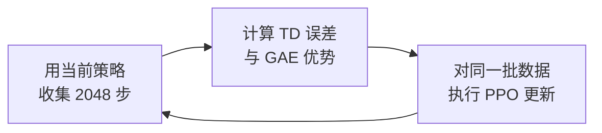
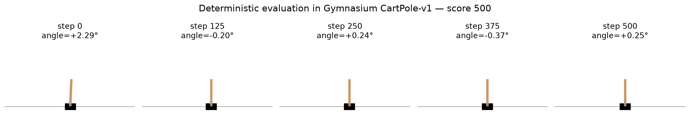

# 1.3 动手：PPO 训练可视化

> **本节目标**：运行纯 PyTorch PPO，保存原始训练指标，从 CSV 生成曲线，并用训练后的模型完成一次可见的 CartPole 评估。

> **学习路径**：[1.1 跑通 CartPole](./principles) → [1.2 CartPole 原理](./metrics) → **1.3 PPO 训练可视化**

> **本节代码与资源**：[训练脚本](https://github.com/walkinglabs/hands-on-modern-rl/blob/main/code/chapter01_cartpole/2-pytorch_ppo.py) · [绘图脚本](https://github.com/walkinglabs/hands-on-modern-rl/blob/main/code/chapter01_cartpole/plot_curves.py) · [环境帧脚本](https://github.com/walkinglabs/hands-on-modern-rl/blob/main/code/chapter01_cartpole/capture_frames.py) · [原始 CSV](https://github.com/walkinglabs/hands-on-modern-rl/blob/main/code/chapter01_cartpole/output/training_metrics_seed42.csv)

::: tip 遇到困难时善用 AI
本节需要在自己的机器上运行脚本，环境问题在所难免。安装报错、版本冲突、运行中断时，把完整的报错信息交给 AI 编码助手，让它帮你分析原因、修改代码或给出可运行的命令，是最有效的解决方式。
:::

1.2 节讲清了原理，也带我们读过仓库中保存好的训练记录。这一节从头操作一遍：自己运行训练脚本，保存原始指标，从 CSV 生成曲线，再用训练好的模型捕获环境画面。

完成后，图上的每一个点都能追溯到 CSV，CSV 能追溯到训练日志，环境帧能追溯到保存的模型——整条证据链自己走通。

## 1.3.1 安装依赖

运行训练之前，先把环境搭好。进入第一章代码目录，安装 `requirements.txt` 中的依赖：

```bash
cd code/chapter01_cartpole
pip install -r requirements.txt
```

CartPole 的网络很小，默认使用 CPU 训练，不要求独立显卡。

## 1.3.2 运行一次固定配置的训练

依赖装好之后，开始训练。为了让运行条件可以核对，我们固定随机种子、训练轮数和每轮采样步数：

```bash
python 2-pytorch_ppo.py \
  --seed 42 \
  --iterations 40 \
  --steps-per-rollout 2048 \
  --swanlab-mode disabled \
  --log-csv output/training_metrics_seed42.csv
```

训练共与环境交互

$$
40\times 2048=81\,920
$$

步。运行结束后，`output/` 目录中包含两个主要文件：

- `pytorch_ppo_cartpole.pth`：训练后的模型参数；
- `training_metrics_seed42.csv`：每一轮未经平滑的训练指标。

控制台最后还会给出 20 个确定性评估回合的平均奖励和标准差。本书保存的这次运行得到 `500.0 ± 0.0`。

若要使用本地 SwanLab 看板，可以把 `--swanlab-mode disabled` 改为 `--swanlab-mode local`。训练结束后运行：

```bash
swanlab watch swanlog
```

浏览器打开 `http://127.0.0.1:5092` 即可查看本地记录。看板用于交互查看，后续绘图仍以导出的 CSV 为数据源。

## 1.3.3 训练循环中的三个步骤

训练跑通之后，我们来对照 1.2 节的原理，看看脚本每轮到底做了什么。



### 收集轨迹

第一个环节是收集轨迹。环境的 `step` 方法返回新观测、奖励和两个结束标记：

```python
next_obs, reward, terminated, truncated, _ = env.step(action.item())

with torch.no_grad():
    if terminated:
        next_value = 0.0
    else:
        _, next_value_tensor = model(torch.FloatTensor(next_obs))
        next_value = next_value_tensor.item()
```

`terminated=True` 表示杆子倒下或小车越界。回合已经自然结束，所以后续价值取 0。

`truncated=True` 表示达到 500 步时间上限。这个状态仍可能保持平衡，所以代码使用 Critic 的 $V(s')$ 作为后续价值估计。

如果 2048 步采样在一个回合中间结束，脚本不会重置环境。下一轮从当前观测继续采样，并继续累计该回合的奖励和长度。

### 计算 GAE

第二个环节是计算优势。每一步先计算 TD 误差：

$$
\delta_t=r_t+\gamma V(s_{t+1})-V(s_t).
$$

程序从 rollout 的末尾向前递推优势：

```python
episode_end = t["terminated"] or t["truncated"]
delta = t["reward"] + gamma * t["next_value"] - t["value"]
gae = delta + gamma * lam * (1.0 - float(episode_end)) * gae
```

乘数 `1 - episode_end` 在每次环境重置处切断递推。时间截断处的当前 TD 误差仍使用 `next_value`，新回合的优势不会传回旧回合。

Critic 的目标由未归一化优势得到：

```python
returns = raw_advantages + values
advantages = (raw_advantages - raw_advantages.mean()) / (
    raw_advantages.std(unbiased=False) + 1e-8
)
```

归一化后的 `advantages` 用于更新 Actor。未归一化的 `returns` 用于训练 Critic，因此两者不能互换。

### 执行 PPO 更新

第三个环节是更新策略。PPO 比较新旧策略对已采样动作给出的概率：

$$
r_t(\theta)=\frac{\pi_\theta(a_t\mid s_t)}
{\pi_{\theta_{\mathrm{old}}}(a_t\mid s_t)}.
$$

配套实现取 `clip_eps=0.2`：

```python
ratio = torch.exp(new_log_probs - batch_old_log_probs)
surr1 = ratio * batch_advantages
surr2 = torch.clamp(ratio, 0.8, 1.2) * batch_advantages
policy_loss = -torch.min(surr1, surr2).mean()
```

优势为正的动作会得到更高概率，优势为负的动作会得到更低概率。裁剪目标限制同一批数据推动概率变化的幅度。

## 1.3.4 从原始 CSV 生成曲线

三个环节跑完，训练脚本已经把每一轮指标写入 CSV。现在我们把这些数字变成曲线。运行绘图脚本：

```bash
python plot_curves.py \
  --input output/training_metrics_seed42.csv \
  --output-dir output
```

脚本读取 CSV 后生成奖励曲线和四指标诊断图，不会重新训练模型，也不会修改原始指标。


<div class="figure-caption">图 1-4：seed=42 的原始训练奖励。曲线由仓库中的绘图脚本直接读取 CSV 生成。</div>

第 1 轮的平均奖励为 21.35，第 10 轮为 500.0，第 11 轮回落到 460.4。最终确定性策略在 20 个评估回合中得到 `500.0 ± 0.0`。

这条单种子曲线可以验证当前代码和配置能够完成任务。它不能表示所有随机种子都会在第 10 轮达到 500 分。

## 1.3.5 从模型捕获环境画面

曲线说明了得分怎样变化，但它终究是抽象的数字。我们还可以加载保存的模型，观察它在环境里的实际动作。运行：

```bash
python capture_frames.py \
  --model output/pytorch_ppo_cartpole.pth \
  --output output/cartpole_frames_seed42.png \
  --seed 10042
```

脚本创建 `render_mode="rgb_array"` 的 CartPole-v1 环境，使用确定性动作运行一个回合，并从 `env.render()` 返回的画面中选取五个时间点。



<div class="figure-caption">图 1-5：同一个确定性评估回合的第 0、125、250、375 和 500 步。该回合得到 500 分，标题中的角度来自对应时刻的环境观测。</div>

一幅静态画面只能展示一个时刻。这里同时保存五个时间点、完整回合得分和 20 回合评估结果，用来检查策略是否持续完成控制任务。

## 1.3.6 改参数后怎样比较

基准跑通之后，自然会想试试改了参数会怎样。可以改变学习率、裁剪范围或 GAE 参数。每次只改变一个设置，其他条件保持一致，结果才容易解释。

例如，可以比较 `lr=1e-4` 和 `lr=3e-4` 达到相同评估分数所需的环境步数。两组实验需要使用相同的环境版本、网络结构、训练量、随机种子集合和评估回合数。

一次运行容易受到随机初始化和动作采样影响。正式比较时，应运行多个随机种子，并报告每个种子的原始曲线、达到目标分数的环境步数以及最终评估结果。

## 本节小结

- 训练脚本保存模型参数和未经平滑的 CSV 指标；绘图脚本只读取 CSV，图上的每个点都能回到原始记录。
- 三个步骤对应 1.2 节的原理：收集轨迹、计算 GAE 优势、执行 PPO 裁剪更新。
- `terminated`、`truncated` 和 rollout 边界在价值计算中具有不同含义，归一化优势用于 Actor、未归一化 returns 用于 Critic，两者不能互换。
- 环境帧由保存的模型在 Gymnasium 中实际运行得到。
- 参数比较需要统一实验条件，并使用多个随机种子。

下一章从多臂老虎机开始，把本章已经运行过的状态、动作、奖励和策略写成更正式的强化学习问题。
