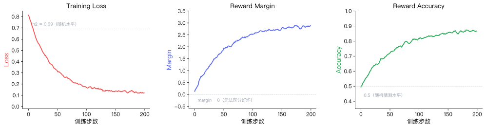

# 2.6 观察与疑问：读懂 DPO 的成绩单

在上一节运行 DPO 训练脚本时，控制台快速闪过了许多训练指标。与第 1 章中 CartPole 仅仅关注 `Episode Reward`（存活步数）不同，偏好对齐任务由于缺乏明确的环境标量奖励，其训练日志的指标也变得更加丰富。

对于文本偏好回归任务，我们可以观察以下几个关键的指标（如果你在训练中接入了 Weights & Biases 或 TensorBoard，你会看到类似下图的曲线）：

下面逐个解读每条曲线的含义。

### **Training Loss（训练损失）**

在 DPO 中，训练 Loss 衡量的是模型预测出的隐式奖励（Implicit Reward）对给定偏好数据 $(y_w, y_l)$ 拟合的程度。训练开始时，模型还没学会区分好坏，Loss 大约在 $\ln 2 \approx 0.69$ 附近（即随机猜测的水平，图中虚线标注处）。

- **整体趋势下降**：Loss 下降意味着模型正在成功拉开”好回答”和”坏回答”的概率差距。
- **并非越低越好**：如果 Loss 降得极低，模型可能陷入了严重的过拟合（Overfitting）。这意味着它不再是“理解了什么是好话”，而仅仅是死记硬背了训练集里的句子。

<strong>问题一：如果偏好数据标注错了（例如把刻薄的回答标记为 chosen），Loss 曲线会发生什么？</strong>

Loss 依然会正常下降！因为模型只是在无脑地拟合数据中给定的偏好关系。这也导致了微调后的模型会迅速“学坏”，变成一个刻薄的助手。

这引出了后训练（Post-Training）时代的一个核心法则：**对齐的效果高度依赖数据质量，garbage in, garbage out。**

### **Reward Margin（奖励边界）**

这是衡量 DPO 训练区分度的最直观指标。它表示模型赋予 `chosen` 文本的隐式奖励与 `rejected` 文本的隐式奖励之差。

- **健康状态**：随着训练进行，Margin 应该逐渐增大并趋于稳定。这说明模型越来越确信“好回答”比“坏回答”要好得多。
- **异常状态**：如果 Margin 变成负数，或者在零附近剧烈震荡，说明模型完全无法区分这两种回答的优劣。通常是因为两者长度差异过大、数据本身有歧义，或是学习率（Learning Rate）设置不当。

<strong>问题二：如果我把 <code>beta</code> 参数从 0.1 改成 1.0，Reward Margin 会怎样变化？</strong>

在 DPO 中，`beta` 参数控制着对参考模型（Reference Model）偏离程度的惩罚。

- 如果 `beta` 很大（如 1.0），惩罚极强，模型几乎不敢改变自己原来的输出分布。此时 Reward Margin 会非常小，甚至几乎不增长。
- 如果 `beta` 很小（如 0.01），模型会为了拉大 Margin 不择手段，甚至输出一些人类看不懂的乱码来迎合公式。

> **动手实验**：试着回到 `2-train_dpo.py` 中，把 `beta` 修改为 0.01 和 0.5，重新运行训练并观察 TensorBoard 中的 Margin 曲线差异。

### **Reward Accuracy（偏好准确率）**

这是模型在训练批次（Batch）中，成功给 `chosen` 文本打出比 `rejected` 文本更高奖励的概率。训练开始时 Accuracy 在 0.5 附近（随机猜测），一个健康的训练过程，Accuracy 应该稳步上升，并最终收敛在 0.8 ~ 0.95 之间。

## 本章小结

在这一章中，你完成了以下任务：

1. **运行了现代 RL 微调**：在 5 分钟内用 DPO 算法让一个 5 亿参数的大模型学会了“礼貌回复”。
2. **理解了数据的作用**：认识到在偏好对齐中，高质量的 `(prompt, chosen, rejected)` 数据对是如何驱动模型演化的。
3. **掌握了评估指标**：读懂了 Training Loss、Reward Margin 和 Accuracy 的含义及异常表现。
4. **梳理了训练全景**：将 DPO 放置在了 Pre-training -> SFT -> RL 的宏观大模型生命周期中。
5. **撕开了 DPO 黑盒**：了解了 DPO 如何通过交叉熵损失巧妙绕过复杂的 PPO 奖励模型训练。

无论是第一章的 CartPole，还是本章的大模型微调，我们都在试图让机器学会做出“更好的决策”。接下来，我们将正式进入理论篇，系统地拆解强化学习底层的数学逻辑。

## 参考文献

[^1]: Schulman, J., et al. (2017). Proximal Policy Optimization Algorithms. _arXiv preprint_. [arXiv:1707.06347](https://arxiv.org/abs/1707.06347)

[^2]: Ouyang, L., et al. (2022). Training language models to follow instructions with human feedback. _arXiv preprint_. [arXiv:2203.02155](https://arxiv.org/abs/2203.02155)

[^3]: Rafailov, R., et al. (2023). Direct Preference Optimization: Your Language Model is Secretly a Reward Model. _arXiv preprint_. [arXiv:2305.18290](https://arxiv.org/abs/2305.18290)

[^4]: Christiano, P. F., et al. (2017). Deep reinforcement learning from human preferences. _Advances in Neural Information Processing Systems_, 30.
