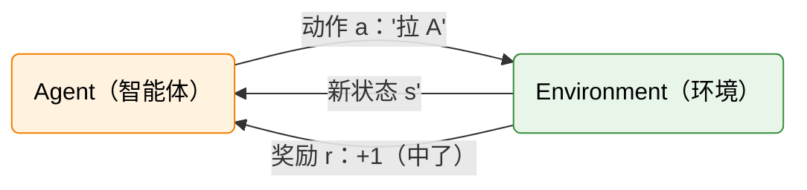

# 动手：两台老虎机——你的第一个 RL 决策

第 1 章，你让木棍学会了直立；第 2 章，你让模型学会了礼貌。两次都成功了——CartPole 拿到了高分，DPO 输出了更友好的回复。但有一个问题一直在绕：**它们到底是怎么"学会"的？**

PPO 为什么能在 20000 步之后突然"开窍"？DPO 的损失函数为什么能把偏好信号注入模型参数？答案藏在同一个地方——一个叫 MDP 的数学框架里。但先别急着看公式。在拆开黑盒之前，让我们先玩一局游戏。

## 先别写代码——用脑子玩一局

想象你走进一家赌场，面前有**两台老虎机**。每台机器投 1 枚硬币，中奖吐出 2 枚（净赚 +1），不中奖吞掉（净亏 -1）。你有 100 次机会。

问题是——你不知道两台机器的出奖概率。

> A 台和 B 台，你先拉哪台？拉了几次之后，你还继续两边试，还是选一台死磕到底？

花 10 秒钟想一下。

如果你想到的是"先两边都试试，搞清楚哪个更赚，然后锁定它"——恭喜，你刚刚发明了 RL 最核心的策略思想：**探索与利用**。"试试"是探索（exploration），"锁定"是利用（exploitation）。整个 RL 的学习过程，说到底就是在这两者之间找平衡。

这个困境其实无处不在。你选餐厅：去吃过的老店（利用），还是试一家新店（探索）？你看电影：看喜欢的导演的新片（利用），还是试试别人推荐的陌生类型（探索）？RL 把这个日常决策变成了数学问题。

## 三个策略，三种结局

为了让讨论更具体，让我们假设一个上帝视角的事实：A 台出奖率 60%，B 台只有 40%。但玩家不知道——它只能通过尝试来发现。

### 策略 1：闭眼随机（50/50）

每次抛个硬币决定拉哪台，A 和 B 各 50%。

跑 100 轮，总回报在 0 附近波动。为什么？因为你一半时间拉了 A（期望每次赚 0.2），一半时间拉了 B（期望每次亏 0.2），一平均就是 0：

$$\mathbb{E}[R] = 0.5 \times 0.2 + 0.5 \times (-0.2) = 0$$

### 策略 2：透视眼（如果你知道 A 更好）

假设你开了天眼，知道 A 台出奖率更高。那当然永远拉 A：

$$\mathbb{E}[R] = 0.6 \times (+1) + 0.4 \times (-1) = 0.2$$

每轮平均赚 0.2，100 轮下来净赚约 20。但问题是——现实中你不知道 A 更好。你需要通过尝试来发现。

### 策略 3：先试后定

一个更聪明的打法：前 20 轮两边交替试（探索），记录各自的胜率；后 80 轮锁定表现更好的那台（利用）。

这个策略的期望回报取决于探索阶段的结果——大多数时候它会正确地发现 A 更好，然后锁定 A，最终拿到接近 0.16 左右的平均回报（不如透视眼的 0.20，因为前 20 轮有探索成本）。但偶尔，如果探索阶段运气差，它可能错误地锁定 B。

## 用 Python 搭建老虎机

规则清楚了，现在用代码把它搭起来。整个环境只需要几行：

```python
import random

class TwoArmedBandit:
    """两台老虎机：最简 RL 环境"""

    def __init__(self, prob_a=0.6, prob_b=0.4):
        self.prob_a = prob_a
        self.prob_b = prob_b

    def pull(self, arm):
        """
        拉某一台机器，返回奖励
        Args:
            arm: "A" 或 "B"
        Returns:
            +1（中奖）或 -1（没中）
        """
        if arm == "A":
            return 1 if random.random() < self.prob_a else -1
        else:
            return 1 if random.random() < self.prob_b else -1
```

这段代码非常短，但它已经是一个完整的 RL 环境。`pull()` 接收一个动作（拉 A 或拉 B），返回一个奖励（+1 或 -1）。它遵循和 Gymnasium 完全一致的接口模式——只不过 CartPole 有 4 维连续状态和左右推两个动作，这里只有一个动作选择。

你可能会注意到一个区别：这个环境没有"状态"——不管你上一步拉了哪台机器，这一步面对的情况一模一样。这就是老虎机的特点：它是一个**单状态 MDP**。后面我们会看到 CartPole 和 LLM 就不是这样了——它们的状态会随着你的动作而改变。

## 跑一把看看

让我们把三个策略都跑一遍，亲眼看到差距：

```python
# ==========================================
# 策略 1：闭眼随机
# ==========================================
env = TwoArmedBandit()
total = sum(env.pull(random.choice(["A", "B"])) for _ in range(100))
print(f"随机策略 100 轮总回报: {total}，平均: {total/100:.2f}")

# ==========================================
# 策略 2：透视眼（永远拉 A）
# ==========================================
total = sum(env.pull("A") for _ in range(100))
print(f"透视眼策略 100 轮总回报: {total}，平均: {total/100:.2f}")

# ==========================================
# 策略 3：先试后定
# ==========================================
rewards_a, rewards_b = [], []
total = 0
for i in range(100):
    if i < 20:
        arm = "A" if i % 2 == 0 else "B"
    else:
        avg_a = sum(rewards_a) / len(rewards_a) if rewards_a else 0
        avg_b = sum(rewards_b) / len(rewards_b) if rewards_b else 0
        arm = "A" if avg_a >= avg_b else "B"

    reward = env.pull(arm)
    total += reward
    (rewards_a if arm == "A" else rewards_b).append(reward)

print(f"先试后定 100 轮总回报: {total}，平均: {total/100:.2f}")
```

你会看到类似这样的输出：

```
随机策略 100 轮总回报: -2，平均: -0.02
透视眼策略 100 轮总回报: 18，平均: 0.18
先试后定 100 轮总回报: 14，平均: 0.14
```

三种策略，同一台机器，结果天差地别。**策略决定了你能从环境中拿走多少价值。**透视眼最好（0.18 ≈ 理论值 0.2），先试后定次之（探索有成本但学会了），随机最差（纯粹在浪费机会）。

## 期望回报：衡量策略的标尺

三种策略的对比引出了一个关键问题：怎么衡量一个策略到底好不好？

答案是我们已经用了好几次的概念——**期望回报**。它就是"如果你玩无数次的平均得分"：

| 策略       | 计算                                 | 期望回报 |
| ---------- | ------------------------------------ | -------- |
| 随机 50/50 | $0.5 \times 0.2 + 0.5 \times (-0.2)$ | 0        |
| 永远拉 A   | $0.6 \times 1 + 0.4 \times (-1)$     | +0.2     |
| 永远拉 B   | $0.4 \times 1 + 0.6 \times (-1)$     | -0.2     |

期望回报越高，策略越好。这个数字不是某一次的运气，而是大量实验的平均趋势——就像掷骰子的期望值是 3.5，你永远掷不出 3.5，但大量实验的平均会趋近它。

这里还藏着一个重要洞察：同样是"永远拉 A"，如果两台机器出奖率都是 50%，期望回报就变成 0——和随机拉没区别。**策略的好坏取决于环境有没有可以被利用的结构。**如果环境是公平的，再聪明的策略也没用；如果环境有偏（A 比 B 好），好策略才能体现优势。RL 的本质，就是发现并利用环境的结构。

## Agent-Environment 交互循环

退后一步，看看刚才发生了什么。不管你是拉老虎机、控制 CartPole、还是训练大模型，RL 的交互模式都长一个样子：



智能体选择动作，环境给出奖励，循环往复。智能体的目标就是让累积奖励尽可能大。

在老虎机中，动作是"拉 A 或拉 B"，奖励是 ±1。在 CartPole 中，动作是"左推或右推"，状态是 4 个物理量，奖励是每步 +1。在 DPO 对齐大模型时，动作是"下一个 token"，奖励是"人类偏好打分"。表面上千差万别，底层是同一个循环。

而且你已经不陌生了——第 2 章做 DPO 时，模型就是那个智能体。它选 token（动作），被偏好信号（奖励）引导，最终学会了"说什么更受欢迎"。**你其实已经做过 RL 了**，只不过当时被封装在 TRL 库的黑盒里。

## 从直觉到数学

这个简单的老虎机游戏，已经暴露了 RL 的两个核心问题：

**策略的好坏取决于环境。** 同一个策略，换一个环境可能就从最优变成最差。好的策略需要"看懂"环境结构，然后选择能最大化收益的行动。

**期望回报可以量化策略好坏。** $\mathbb{E}[R]$ 把"策略好不好"从一个模糊的感觉变成了一个精确的数字。这是后续所有 RL 理论的基石。

但现在的期望回报只考虑了单步——拉一次，得一个奖励。真实的 RL 问题往往涉及多步决策：CartPole 要活 200 步，大模型要生成 500 个 token。多步的情况下，"长期的总收益"怎么定义？眼前的 1 分和 10 步后的 1 分一样值钱吗？

要回答这些问题，我们需要一套更完整的数学语言。下一节，让我们把"状态、动作、奖励"这些直观概念提炼成精确的数学框架——[MDP 形式化与价值函数](./formalism)。
