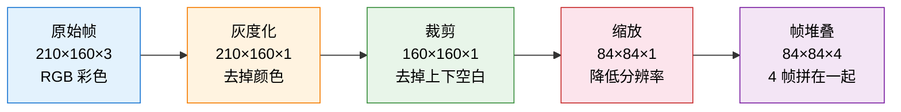

# 4.6 动手：从像素学玩 Atari

2015 年 2 月，Nature 杂志的封面上印着一张 Atari 游戏的截图。那篇论文的标题叫"Human-level control through deep reinforcement learning"——通过深度强化学习实现人类水平的控制。DeepMind 展示了一个程序：它只看屏幕上的像素和游戏得分，就从头学会了玩 29 种 Atari 游戏，其中近一半达到了人类专业玩家的水平。没有任何人工特征工程，没有任何游戏规则输入——纯粹的"从像素到决策"。

上一节我们在 CartPole 上用 MLP 跑通了 DQN。CartPole 的输入是 4 个数字，一个简单网络就能搞定。但真正让 DQN 名声大噪的，是它处理像素级输入的能力。这一节，我们跨越从 4 维向量到 28,000 维像素帧的鸿沟，用 CNN-DQN 学玩 Atari Pong。

## 从 CartPole 到 Atari：什么变了？

|            | CartPole          | Atari Pong                         |
| ---------- | ----------------- | ---------------------------------- |
| 输入       | 4 维连续向量      | 84×84×4 像素帧（28,224 维）        |
| 网络结构   | MLP（全连接）     | CNN（卷积 + 全连接）               |
| 动作空间   | 2 个（左推/右推） | 6 个（实际上只有上、下、不动有效） |
| 回放池大小 | 10,000            | 通常 100,000                       |
| 训练时间   | 几分钟（CPU）     | 数小时（需要 GPU）                 |
| 预处理     | 无                | 灰度化 + 裁剪 + 缩放 + 帧堆叠      |

最显著的变化是输入维度——从 4 个数字变成超过 28,000 个数字。全连接网络处理不了这么高维的输入，我们需要卷积神经网络（CNN）来从像素中提取有用的特征。

## 图像预处理：从 210×160 到 84×84×4

原始的 Atari 画面是 210×160 的 RGB 彩色图，每帧有 $210 \times 160 \times 3 = 100{,}800$ 个数值。直接喂给网络太大了，而且包含大量无用信息。DeepMind 设计了一套预处理流水线：



**灰度化**：颜色对大多数 Atari 游戏的策略没有影响——不管球是白色的还是蓝色的，你都得接住它。去掉颜色，数据量直接减少到三分之一。

**裁剪**：Atari 画面的上下方有固定的 UI 元素（分数显示、游戏边框），对决策没有帮助。裁掉这些区域，只保留游戏区域。

**缩放**：缩放到 84×84 大大减少了计算量，同时保留了足够的空间信息。

**帧堆叠**：这是最关键的一步。单帧画面无法传达运动信息——你只看一张静态图片，无法判断球是往左飞还是往右飞。把连续 4 帧堆叠在一起（84×84×4），网络就能从帧间的位置变化推断出运动方向和速度。这等价于给智能体加了一个"短期记忆"。

```
帧堆叠示意（以 Pong 为例）：

帧 t-3        帧 t-2        帧 t-1        帧 t
  ●            ●             ●             ●
  ┃             ┃             ┃             ┃     ← 球的位置逐帧变化
 ▮             ▮             ▮             ▮        让网络推断球的方向

→ 拼在一起变成 84×84×4 的张量，作为 CNN 的输入
```

Gymnasium 提供了现成的预处理包装器：

```python
import gymnasium as gym

def make_atari_env(game_id="ALE/Pong-v5"):
    """创建预处理的 Atari 环境"""
    env = gym.make(game_id)
    env = gym.wrappers.AtariPreprocessing(
        env, grayscale_new=True, scale_obs=True, frame_skip=4
    )
    env = gym.wrappers.FrameStack(env, num_stack=4)
    return env

env = make_atari_env()
state, _ = env.reset()
print(f"状态空间: {state.shape}")  # (4, 84, 84)
print(f"动作空间: {env.action_space.n}")  # 6
```

安装 Atari 环境：`pip install "gymnasium[atari,accept-rom-license]"`

## CNN Q-Network：用卷积层"看懂"画面

为什么用 CNN 而不是 MLP？MLP 把输入展平成一维向量，丢失了图像的空间结构——它不知道相邻的像素在画面上是挨在一起的。CNN 通过卷积核在图像上滑动，自动学习局部特征（边缘、形状、物体），然后逐层组合成更高级的语义。这正是计算机视觉中 CNN 擅长的事情。

DeepMind 原始论文中的 CNN 架构：

```python
import torch
import torch.nn as nn

class CNNQNetwork(nn.Module):
    """DeepMind 原始 DQN 的 CNN 架构"""

    def __init__(self, input_channels=4, num_actions=6):
        super().__init__()
        self.conv = nn.Sequential(
            nn.Conv2d(input_channels, 32, kernel_size=8, stride=4),  # → 20×20×32
            nn.ReLU(),
            nn.Conv2d(32, 64, kernel_size=4, stride=2),              # → 9×9×64
            nn.ReLU(),
            nn.Conv2d(64, 64, kernel_size=3, stride=1),              # → 7×7×64
            nn.ReLU(),
        )
        self.fc = nn.Sequential(
            nn.Linear(64 * 7 * 7, 512),
            nn.ReLU(),
            nn.Linear(512, num_actions)
        )

    def forward(self, x):
        x = x / 255.0  # 归一化
        conv_out = self.conv(x)
        conv_out = conv_out.view(conv_out.size(0), -1)
        return self.fc(conv_out)
```

逐层拆解这个网络在做什么：

| 层    | 输入尺寸 | 操作                     | 输出尺寸 | 它在学什么                                 |
| ----- | -------- | ------------------------ | -------- | ------------------------------------------ |
| Conv1 | 84×84×4  | 32 个 8×8 卷积核，步幅 4 | 20×20×32 | 大尺度边缘和明暗变化（球拍轮廓、球的形状） |
| Conv2 | 20×20×32 | 64 个 4×4 卷积核，步幅 2 | 9×9×64   | 中尺度特征（球拍+球的组合、球的方向）      |
| Conv3 | 9×9×64   | 64 个 3×3 卷积核，步幅 1 | 7×7×64   | 精细特征（球和球拍的精确位置关系）         |
| FC1   | 3136     | 全连接 512               | 512      | 组合所有特征做出全局判断                   |
| FC2   | 512      | 全连接 6                 | 6        | 输出 6 个动作的 Q 值                       |

前三层卷积做的事情就像人类的视觉皮层：第一层识别边缘和明暗，第二层组合边缘成形状，第三层识别出物体。后面的全连接层则像一个决策大脑："球往右上方飞，我的球拍在下面，所以我应该向上移动。"


## 完整训练代码

上一节的 `ReplayBuffer` 大部分可以复用，主要变化是网络结构、环境预处理和几个超参数：

```python
import random
from collections import deque
import numpy as np
import torch.optim as optim

class ReplayBuffer:
    def __init__(self, capacity=100000):
        self.buffer = deque(maxlen=capacity)

    def push(self, state, action, reward, next_state, done):
        self.buffer.append((state, action, reward, next_state, done))

    def sample(self, batch_size):
        batch = random.sample(self.buffer, batch_size)
        states, actions, rewards, next_states, dones = zip(*batch)
        return (torch.FloatTensor(np.array(states)),
                torch.LongTensor(actions),
                torch.FloatTensor(rewards),
                torch.FloatTensor(np.array(next_states)),
                torch.FloatTensor(dones))

    def __len__(self):
        return len(self.buffer)

device = torch.device("cuda" if torch.cuda.is_available() else "cpu")
q_net = CNNQNetwork(input_channels=4, num_actions=6).to(device)
target_net = CNNQNetwork(input_channels=4, num_actions=6).to(device)
target_net.load_state_dict(q_net.state_dict())

optimizer = optim.Adam(q_net.parameters(), lr=1e-4)
buffer = ReplayBuffer(capacity=100000)

gamma = 0.99
batch_size = 32
epsilon_start, epsilon_end, epsilon_decay = 1.0, 0.02, 1000000
target_update = 10000
total_steps = 0
reward_history = []

for episode in range(500):
    state, _ = env.reset()
    total_reward = 0

    while True:
        epsilon = max(epsilon_end, epsilon_start - total_steps / epsilon_decay)
        if random.random() < epsilon:
            action = env.action_space.sample()
        else:
            with torch.no_grad():
                action = q_net(torch.FloatTensor(state).unsqueeze(0).to(device)).argmax().item()

        next_state, reward, terminated, truncated, _ = env.step(action)
        done = terminated or truncated
        total_reward += reward
        reward = np.clip(reward, -1, 1)  # 奖励裁剪

        buffer.push(state, action, reward, next_state, float(done))
        state = next_state
        total_steps += 1

        if len(buffer) >= batch_size:
            s, a, r, ns, d = buffer.sample(batch_size)
            s, ns = s.to(device), ns.to(device)
            q_values = q_net(s).gather(1, a.unsqueeze(1).to(device)).squeeze(1)
            with torch.no_grad():
                td_target = r.to(device) + gamma * target_net(ns).max(dim=1)[0] * (1 - d.to(device))
            loss = nn.MSELoss()(q_values, td_target)
            optimizer.zero_grad()
            loss.backward()
            torch.nn.utils.clip_grad_norm_(q_net.parameters(), 10)  # 梯度裁剪
            optimizer.step()

        if total_steps % target_update == 0:
            target_net.load_state_dict(q_net.state_dict())

        if done:
            break

    reward_history.append(total_reward)
    if (episode + 1) % 50 == 0:
        avg = np.mean(reward_history[-50:])
        print(f"Episode {episode+1} | Avg Reward: {avg:.1f} | ε: {epsilon:.3f} | Steps: {total_steps}")

env.close()
```

和 CartPole 的 DQN 相比，关键差异在于：网络从 MLP 换成 CNN；回放池从 10,000 扩大到 100,000；新增了奖励裁剪（统一不同游戏的奖励尺度）和梯度裁剪（防止 CNN 梯度爆炸）；训练最好用 GPU，CPU 上会很慢。

## 预期训练过程

Pong 的奖励范围是 [-21, +21]（每局最多 21 分）。训练通常需要 100 万到 200 万步才能收敛：

```
Episode 50  | Avg Reward: -20.3 | ε: 0.980 | Steps: 12450
Episode 200 | Avg Reward: -17.5 | ε: 0.920 | Steps: 52800
Episode 400 | Avg Reward: -10.2 | ε: 0.780 | Steps: 112000
Episode 600 | Avg Reward:   3.5 | ε: 0.540 | Steps: 185000
Episode 800 | Avg Reward:  14.2 | ε: 0.220 | Steps: 310000
Episode 1000| Avg Reward:  18.8 | ε: 0.050 | Steps: 445000
```

训练初期平均 -20 分——几乎每球必输。然后它学会了"球来了就挥拍"，得分开始上升。最终它学会了精确控制球拍，经常以 21:0 的比分完胜内置 AI。

```
CNN-DQN 训练 Pong 的曲线

 21 ┤ ····满分线····
    │                              ╱━━━━━━━━
 10 ┤                         ╱━━━
    │                    ╱━━━━
  0 ┤··零分线··────────╱·············
    │            ╱·····
-10 ┤       ╱·····
    │  ·····
-20 ┤╱···（前期每局都输）
    └──────────────────────────────────────
     Episode
```

## 可视化：CNN 到底学到了什么？

CNN 的第一层卷积有 32 个滤波器。训练前它们是随机噪声，训练后自动分化成了不同的特征检测器：

```python
import matplotlib.pyplot as plt

filters = q_net.conv[0].weight.data.cpu().clone()
fig, axes = plt.subplots(4, 8, figsize=(16, 8))
for i, ax in enumerate(axes.flat):
    if i < filters.shape[0]:
        ax.imshow(filters[i, 0], cmap='gray')
        ax.set_title(f'Filter {i}', fontsize=8)
    ax.axis('off')
plt.suptitle('第一层卷积的 32 个滤波器', fontsize=14)
plt.tight_layout()
plt.savefig('cnn_filters.png', dpi=150)
plt.show()
```

```
第一层卷积滤波器可视化（示意）

┌────┬────┬────┬────┬────┬────┬────┬────┐
│ ○  │ ╱  │ ━  │ ●  │ ▏  │ ╲  │ ┃  │ ░  │
│ 球 │ 斜 │ 横 │ 圆 │ 竖 │ 反 │ 竖 │ 渐 │   ← 有的检测圆形（球）
│ 检 │ 线 │ 线 │ 点 │ 线 │ 斜 │ 线 │ 变 │     有的检测边缘（球拍）
│ 测 │ 检 │ 检 │ 检 │ 检 │ 线 │ 检 │ 背 │     有的检测明暗变化
├────┼────┼────┼────┼────┼────┼────┼────┤
│ ━  │ ╱  │ ░  │ ●  │ ┃  │ ╲  │ ○  │ ▏  │
│ 横 │ 正 │ 模 │ 球 │ 中 │ 反 │ 球 │ 侧 │   ← 类似 Gabor 滤波器
│ 向 │ 斜 │ 糊 │ 检 │ 间 │ 对 │ 的 │ 边 │     （经典的边缘检测器）
│ 边 │ 检 │ 检 │ 测 │ 线 │ 角 │ 位 │ 缘 │
└────┴────┴────┴────┴────┴────┴────┴────┘
```

有些专门检测水平边缘（球拍的形状），有些检测圆形（球的形状），有些检测运动方向。这些特征不是人类设计的——CNN 通过训练自动发现了它们。

### Saliency Map：网络在看哪里？

对于某一帧画面，哪些像素对网络选择动作的影响最大？

```python
def compute_saliency(model, state, action):
    state_t = torch.FloatTensor(state).unsqueeze(0).requires_grad_(True)
    output = model(state_t)
    output[0, action].backward()
    return state_t.grad.abs().squeeze().max(dim=0)[0].detach().numpy()

saliency = compute_saliency(q_net, state, action=2)

fig, axes = plt.subplots(1, 2, figsize=(12, 5))
axes[0].imshow(state[-1], cmap='gray')
axes[0].set_title('游戏画面')
axes[1].imshow(saliency, cmap='hot')
axes[1].set_title('显著性热力图（网络在看哪里）')
plt.tight_layout()
plt.savefig('saliency_map.png', dpi=150)
plt.show()
```

```
游戏画面              显著性热力图
┌──────────────┐     ┌──────────────┐
│              │     │     ░░       │ ← 对手球拍：不太关注
│   ■ ■ ■ ■ ■ │     │    ░░░░░    │
│              │     │              │
│     ●        │     │   ▓▓▓▓▓▓   │ ← 球：高度关注！
│              │     │   ████████  │   （球的精确位置最关键）
│     ▮        │     │   ▓▓▓▓▓    │ ← 自己的球拍：也关注
└──────────────┘     └──────────────┘
```

网络最关注的是球的位置和自己的球拍位置——和人类打 Pong 时的关注点完全一致。背景的黑色区域几乎被完全忽略。网络通过训练自动学会了"看哪里"。

## 换个游戏试试

DQN 的一个优雅之处在于：算法和游戏完全解耦。同一个算法、同一套代码，换个游戏名就能玩：

```python
# 只需要换一行！
env = make_atari_env("ALE/Breakout-v5")
# 其他代码完全不变
```

Breakout 需要更精确的位置控制和更长的策略规划——打碎砖块有时需要先开一个洞，再让球从洞里穿过去反弹。不同游戏的训练难度差异很大：

| 游戏                | 难度 | DQN 表现  | 为什么难？                       |
| ------------------- | ---- | --------- | -------------------------------- |
| Pong                | 简单 | 超越人类  | 画面简单，策略短视，2 个有效动作 |
| Breakout            | 中等 | 超越人类  | 需要精确瞄准，策略更长           |
| Space Invaders      | 中等 | 接近人类  | 多个目标，需要选择攻击优先级     |
| Seaquest            | 难   | 低于人类  | 复杂的多目标管理                 |
| Montezuma's Revenge | 极难 | 接近 0 分 | 需要长序列规划，奖励极其稀疏     |

Montezuma's Revenge 是 DQN 的噩梦——玩家需要在一个迷宫里找到钥匙、开门、避开陷阱，但只有在完成一系列复杂动作后才能得分。DQN 的经验回放和 $\varepsilon$-贪婪探索在这种需要长期规划的任务中几乎完全失效——随机探索几乎不可能偶然发现"拿到钥匙 → 走到门前 → 开门"这样的长序列。这个问题直到后来出现了更高级的探索策略才有所突破。

## 训练技巧总结

Atari DQN 比 CartPole DQN 多了几个工程技巧，每一个都解决了一个具体问题：

**帧跳过（Frame Skip）**：Atari 游戏运行在 60fps，每帧都做决策太频繁。Frame Skip=4 让每 4 帧才做一次决策，既加快了训练速度，又让每一步更有意义。

**奖励裁剪（Reward Clipping）**：不同游戏的原始奖励范围差异很大。裁剪到 [-1, 1] 统一了奖励尺度，让同一套超参数适用于不同游戏。

**更大的回放池**：Atari 的状态空间远大于 CartPole，需要更多样化的经验。通常使用 10 万到 100 万条经验。

**梯度裁剪**：CNN 的高维参数空间容易出现梯度爆炸。`clip_grad_norm_` 把梯度 L2 范数限制在 10 以内，防止一步更新毁掉一切。

**目标网络更新频率**：Atari 通常每 10,000 步更新一次（CartPole 只需 10 步），因为状态空间更大，目标网络需要更长时间保持稳定。

<details>
<summary>思考题：为什么帧堆叠选 4 帧而不是 2 帧或 8 帧？</summary>

4 帧是一个经验性的平衡点。2 帧太少——只能看到一个时间步的位移，方向判断不够准确。8 帧太多——覆盖的时间窗口太长，早期的帧对当前决策没什么帮助，反而增加了输入维度和计算量。4 帧在 Pong 中大约覆盖 0.5 秒的游戏时间，足以推断球的运动方向和速度。

不过，不同游戏可能需要不同的帧堆叠数量。快节奏的游戏可能需要更多帧来捕捉快速变化，慢节奏的游戏可能更少就够。DeepMind 在所有游戏中统一使用了 4 帧——这是通用性和最优性之间的取舍。

</details>

接下来，让我们回到 DQN 理论的演进路线——[DQN 家族与视角迁移](./dqn-family)。
