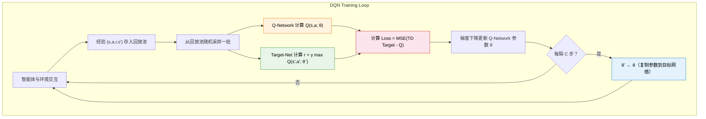

# 4.2 DQN 三大组件

上一节我们看到了 Q-Learning 的表格在高维状态空间中装不下，而直接用神经网络替代表格又会导致训练崩溃。崩溃的原因有两个：样本相关性和目标不稳定。DQN 用三个组件来解决这些问题：Q-Network 负责用神经网络近似 Q 函数，经验回放打破样本相关性，目标网络稳定训练目标。让我们逐一拆解。

## 组件一：Q-Network——用神经网络近似 Q 函数

Q-Network 是 DQN 的核心。它做的事情很简单：接收一个状态 $s$，输出每个动作的 Q 值。在 CartPole 中，输入是 4 维向量 $[x, \dot{x}, \theta, \dot{\theta}]$，输出是 2 个 Q 值（左推和右推）。

```python
import torch
import torch.nn as nn

class QNetwork(nn.Module):
    """Q-Network：输入状态，输出每个动作的 Q 值"""

    def __init__(self, state_dim, action_dim, hidden_dim=128):
        super().__init__()
        self.net = nn.Sequential(
            nn.Linear(state_dim, hidden_dim),
            nn.ReLU(),
            nn.Linear(hidden_dim, hidden_dim),
            nn.ReLU(),
            nn.Linear(hidden_dim, action_dim)
        )

    def forward(self, x):
        return self.net(x)  # 输出形状: (batch_size, action_dim)
```

这段代码非常简洁：三层全连接网络，两个隐藏层各有 128 个神经元，用 ReLU 做激活函数。输入是状态向量，输出是每个动作的 Q 值。对于 CartPole（state_dim=4, action_dim=2），这个网络的参数量只有几万个——极其轻量。

为什么输出的是所有动作的 Q 值而不是单个？因为一次前向传播就能得到所有动作的评分，不需要为每个动作单独跑一遍网络。选择动作时只需要对输出取 `argmax`——哪个动作的 Q 值最大就选哪个。

对于 Atari 游戏，输入是 84×84×4 的像素帧，全连接网络就不够用了——参数太多，且无法捕捉图像的空间结构。DeepMind 在原始论文中使用了卷积神经网络（CNN）：先用几层卷积提取图像特征，再用全连接层输出 Q 值。不过对于 CartPole 这样的低维输入，简单的 MLP 就足够了。我们在本章的动手环节中先用 MLP 在 CartPole 上跑通 DQN，Atari 的 CNN 架构留作拓展练习。

Q-Network 的训练目标是让网络输出的 Q 值尽可能接近"真实的" Q 值。但我们不知道真实的 Q 值是多少——如果能查表知道，就不需要神经网络了。所以我们用和 Q-Learning 一样的方式构造训练目标：

$$\text{TD Target} = r + \gamma \max_{a'} Q(s', a')$$

然后最小化网络输出和 TD Target 之间的均方误差：

$$\mathcal{L}(\theta) = \mathbb{E}\left[\left( r + \gamma \max_{a'} Q(s', a'; \theta^-) - Q(s, a; \theta) \right)^2\right]$$

这个公式看起来很复杂，让我们先理清里面每个符号的"角色"：

| 符号                                       | 含义（大白话）                                   | 角色                         |
| ------------------------------------------ | ------------------------------------------------ | ---------------------------- |
| $\theta$                                   | Q-Network 的参数（正在被训练的那个网络）         | 学生——正在考试的人           |
| $\theta^-$                                 | 目标网络的参数（一个慢更新的副本，稍后会解释）   | 标准答案——阅卷老师手里的参考 |
| $Q(s, a; \theta)$                          | 学生当前的回答："我觉得这步值 $X$ 分"            | 网络的预测                   |
| $r$                                        | 这一步实际拿到的即时奖励                         | 眼前落袋为安的分数           |
| $\gamma \max_{a'} Q(s', a'; \theta^-)$     | 从新局面出发，目标网络给出的最高未来分，再打个折 | "未来最多还能拿多少"         |
| $r + \gamma \max_{a'} Q(s', a'; \theta^-)$ | TD Target——"这件事应该值多少分"                  | 标准答案                     |

现在让我们一步步拼出这个损失函数：

**第一块积木：TD Target——标准答案**

$$y = r + \gamma \max_{a'} Q(s', a'; \theta^-)$$

TD Target 就是"即时奖励 + 打了折的未来最高分"。注意这里的 $Q$ 使用的是目标网络的参数 $\theta^-$，而不是正在被训练的 $\theta$。为什么要这样？因为标准答案不能跟着学生一起改——如果目标也在动，学生永远追不上。这个思想在下一节"目标网络"中会详细展开。

**第二块积木：TD Error——预测和标准答案差了多少**

$$\delta = y - Q(s, a; \theta) = r + \gamma \max_{a'} Q(s', a'; \theta^-) - Q(s, a; \theta)$$

TD Error 就是"标准答案减去学生的回答"。在表格方法中，我们直接把 Q 值往 TD Target 的方向挪 $\alpha \cdot \delta$。但在神经网络中，我们不能直接改某个 Q 值——只能通过修改参数 $\theta$ 间接影响所有 Q 值。

**第三块积木：平方——惩罚大错，容忍小错**

$$\mathcal{L}(\theta) = \mathbb{E}\left[\delta^2\right] = \mathbb{E}\left[\left(y - Q(s, a; \theta)\right)^2\right]$$

为什么不直接用 $\delta$ 而要平方？两个原因。第一，$\delta$ 可能是正的也可能是负的，正负会互相抵消，平均下来接近 0，看起来好像没误差——但实际上可能错得离谱。平方之后永远是正数，不会被正负抵消。第二，平方对小误差宽容（差 0.1 就罚 0.01），对大误差严厉（差 1.0 就罚 1.0，差 3.0 就罚 9.0）——这迫使网络优先修正最离谱的预测。

**第四块积木：取期望——在所有样本上平均**

$$\mathcal{L}(\theta) = \mathbb{E}\left[\left(y - Q(s, a; \theta)\right)^2\right]$$

外面的 $\mathbb{E}$ 表示"对所有可能的转移 $(s, a, r, s')$ 取平均"。在实践中，我们不可能穷举所有转移，所以从经验回放池里随机采样一批来近似这个期望——这就是 SGD（随机梯度下降）的"随机"的含义。

把四块积木合在一起：DQN 的训练过程就是不断从经验回放池采样，计算 TD Target（标准答案），和网络输出（学生的回答）对比，用均方误差算出损失，然后通过反向传播更新参数 $\theta$。本质和 Q-Learning 表格方法完全一样——只不过现在是通过梯度下降来更新参数，而不是直接修改表格里的数值。

## 组件二：经验回放——打破样本相关性

在 Atari 游戏中，智能体每走一步就产生一条经验 $(s, a, r, s')$。如果直接用这条经验来训练网络，问题就来了：相邻帧几乎一模一样，连续几条经验描述的是同一个场景的不同侧面。用这样高度相关的数据训练，梯度方向会被最近的经历主导，网络会"遗忘"之前学过的东西。

经验回放（Experience Replay）的解决方案极其朴素但有效：把所有经历过的经验 $(s, a, r, s')$ 存进一个大池子，每次训练时从池子里随机采样一小批。这就像准备考试时，不是只复习昨天的错题，而是把过去所有的错题打乱顺序随机练习。

```python
import random
from collections import deque

class ReplayBuffer:
    """经验回放池：存储和采样 (s, a, r, s', done) 转移"""

    def __init__(self, capacity=10000):
        self.buffer = deque(maxlen=capacity)  # 超出容量自动淘汰旧数据

    def push(self, state, action, reward, next_state, done):
        """存入一条经验"""
        self.buffer.append((state, action, reward, next_state, done))

    def sample(self, batch_size):
        """随机采样一批经验"""
        batch = random.sample(self.buffer, batch_size)
        states, actions, rewards, next_states, dones = zip(*batch)
        return (torch.FloatTensor(states),
                torch.LongTensor(actions),
                torch.FloatTensor(rewards),
                torch.FloatTensor(next_states),
                torch.FloatTensor(dones))

    def __len__(self):
        return len(self.buffer)
```

经验回放有三个好处。第一，打破了样本的时间相关性——随机采样保证了每批训练数据来自不同的时间段，梯度方向更加多样。第二，提高了数据利用效率——每条经验可以被多次采样用于训练，而不是用一次就扔掉。在表格方法中，这一点不太重要，因为每个状态的更新是独立的。但在神经网络中，一条经验可以影响所有状态的 Q 值估计，重复利用就很有价值了。第三，提供了一种自然的课程学习——旧经验和新经验混合在一起，网络不会过度拟合最近的经验。

经验回放池的大小是一个需要调整的超参数。太小的话，池子里经验不够多样，训练效果差。太大的话，很早之前的过时经验（基于当时还不准确的 Q 网络产生的）仍然会被采样，可能拖慢收敛。实践中常用的容量是 $10^4$ 到 $10^6$。

## 组件三：目标网络——固定训练靶子

Q-Learning 的更新目标是 $r + \gamma \max_{a'} Q(s', a')$。在表格方法中，这个目标是稳定的——因为 $Q(s', a')$ 存在独立的表格单元里，更新 $Q(s, a)$ 不会改变 $Q(s', a')$。但在神经网络中，参数是共享的——更新 $Q(s, a)$ 的同时也会改变 $Q(s', a')$ 的值，因为它们共享同一组参数 $\theta$。这就像一只狗追自己的尾巴：目标永远在动，永远追不上。

目标网络（Target Network）的解决方案也很朴素：维护两个网络，一个 Q-Network $\theta$ 用于选择动作和日常更新，另一个目标网络 $\theta^-$ 专门用来计算 TD Target。目标网络的参数不参与梯度下降，而是每隔固定的步数从 Q-Network 复制过来：

```python
# 每隔 target_update 步，把 Q 网络的参数复制到目标网络
if step % target_update == 0:
    target_net.load_state_dict(q_net.state_dict())
```

计算 TD Target 时使用目标网络：

```python
# 用目标网络计算 TD Target（稳定的靶子）
with torch.no_grad():
    td_target = reward + gamma * target_net(next_state).max()
```

这样一来，在两次参数复制之间，TD Target 是固定的——靶子不会乱动了。Q-Network 可以安心地向一个稳定的目标学习，而不是追一个不断移动的靶子。每隔固定步数更新一次目标网络，相当于让靶子每隔一段时间挪到一个新的位置，给 Q-Network 一个更准确的追逐目标。

目标网络的更新频率是另一个超参数。更新太频繁（比如每步都更新），目标网络和 Q-Network 几乎一样，起不到稳定作用。更新太稀疏（比如每 10000 步才更新），目标网络给出的 TD Target 太过时，Q-Network 学到的可能是过时的信息。实践中常用的更新频率是每 100 到 1000 步。



## DQN 算法完整流程

把三个组件拼在一起，DQN 的完整训练流程如下：

1. 初始化 Q-Network $\theta$ 和目标网络 $\theta^-$（参数相同）
2. 初始化经验回放池
3. 对于每个 episode：
   - 观察初始状态 $s$
   - 对于每一步：
     - 用 $\varepsilon$-贪婪策略选择动作 $a$（$\varepsilon$ 概率随机探索，$1-\varepsilon$ 概率选 Q 值最大的动作）
     - 执行动作 $a$，观察奖励 $r$ 和下一状态 $s'$
     - 将 $(s, a, r, s', \text{done})$ 存入经验回放池
     - 从回放池随机采样一批经验
     - 计算 TD Target：$y = r + \gamma \max_{a'} Q(s', a'; \theta^-)$
     - 计算 Loss：$\mathcal{L} = (y - Q(s, a; \theta))^2$
     - 梯度下降更新 $\theta$
     - 每隔 $C$ 步：$\theta^- \leftarrow \theta$
     - $s \leftarrow s'$

对比第 3 章的 Q-Learning 表格方法，DQN 只做了三处改变：用神经网络代替表格（泛化能力）、加经验回放（打破相关性）、加目标网络（稳定目标）。核心的 TD Error 逻辑——"预测与现实的落差"——完全没变。

<details>
<summary>思考题：经验回放池满了之后，旧经验被淘汰。如果一条"关键经验"（比如第一次到达终点）被淘汰了怎么办？</summary>

在标准的经验回放中，旧经验按照先进先出（FIFO）的方式被淘汰。确实有可能一条关键经验被淘汰，但由于训练初期回放池还没满，关键经验通常会被多次采样到。另外，DQN 的一个改进版本——Prioritized Experience Replay（优先经验回放）——会给 TD Error 大的经验更高的采样概率，这样"令人惊讶"的经验不容易被忽略。我们将在本章最后一节讨论这个改进。

</details>

现在我们已经拆解了 DQN 的三个组件，接下来让我们亲手实现它——[用 DQN 玩 CartPole](./cartpole-dqn)。
