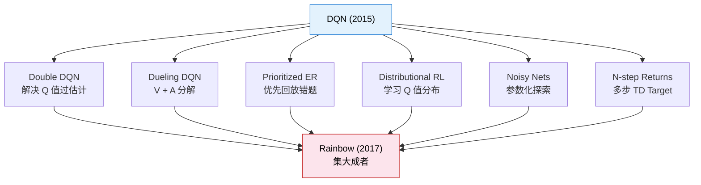

# 4.5 DQN 家族演进与视角迁移

DQN 在 2015 年登上 Nature 封面之后，引发了深度强化学习的研究热潮。在接下来的两三年里，研究者们提出了大量的改进方案，每一个都在解决原始 DQN 的一个具体缺陷。这些改进最终在 2017 年被集成到了一个叫做 Rainbow 的统一框架中。让我们沿着这条演进路线走一遍，看看每一步解决了什么问题。

## Double DQN：解决 Q 值过估计

上一节我们提到过，DQN 的 $\max$ 操作会导致 Q 值系统性偏高。想象一个类比：你问 10 个人明天会不会下雨，每个人给出一个概率估计。然后你取最高的那个估计作为最终答案——这个答案几乎肯定会偏高，因为你选的恰好是那个最乐观的人。

原始 DQN 的 TD Target 计算方式是：

$$\text{TD Target} = r + \gamma \max_{a'} Q(s', a'; \theta^-)$$

让我们把这个公式拆开看，理解它为什么会过估计：

| 符号                  | 含义（大白话）                                           | 角色           |
| --------------------- | -------------------------------------------------------- | -------------- |
| $\max_{a'}$           | 在所有可选动作中，选 Q 值最大的那个                      | "取最好的那个" |
| $Q(s', a'; \theta^-)$ | 目标网络对"在新局面 $s'$ 下做动作 $a'$ 能拿多少分"的估计 | 打分员         |

$\max$ 操作同时做了两件事：**选动作**（哪个动作的 Q 值最高？）和**评估动作**（这个动作值多少分？）。问题就出在这里——选和评用的是同一组 Q 值。假设目标网络对 4 个动作的 Q 值估计分别是 $[10.1, 9.8, 10.3, 9.5]$，每个估计都有 $\pm 0.5$ 的随机噪声。$\max$ 操作选了 10.3——但 10.3 恰好是被噪声推高的那个。如果你再估测一次，可能就变成了 9.9。$\max$ 天然倾向于选中"被高估得最厉害"的那个值，就像你问 10 个人明天会不会下雨，取最乐观的那个答案——它几乎肯定会偏高。

Double DQN [^2] 的思路极其简洁：把"选动作"和"评估动作"交给不同的网络。用 Q-Network $\theta$ 来选动作（它更了解当前策略，选得更准），用目标网络 $\theta^-$ 来评估（它更稳定，评得更稳）：

$$\text{TD Target} = r + \gamma Q\left(s', \underbrace{\arg\max_{a'} Q(s', a'; \theta)}_{\text{Q-Network 选动作}}; \underbrace{\theta^-}_{\text{目标网络打分}}\right)$$

让我们像拆手表一样，把这个公式从内到外剥开三层：

**第一层：Q-Network 选动作**。$\arg\max_{a'} Q(s', a'; \theta)$ 的意思是：用 Q-Network $\theta$ 看一遍所有动作的 Q 值，选出 Q 值最大的那个动作编号。注意这里只返回"选了哪个动作"，不返回 Q 值本身——就像投票，只看谁得票最高，不看具体票数。

**第二层：目标网络打分**。$Q(s', \text{选中的动作}; \theta^-)$ 的意思是：把第一步选出的动作交给目标网络 $\theta^-$ 来评分。目标网络的参数是延迟更新的，不会因为 Q-Network 的波动而波动——打分更冷静、更客观。

**第三层：拼成 TD Target**。$r + \gamma \times \text{目标网络的评分}$，和原始 DQN 一样——即时奖励加上打折后的未来价值。唯一的变化是"选动作"和"打分"分家了。

用人话说：让 Q-Network 投票决定选哪个动作，但让目标网络来打分。Q-Network 可能高估某个动作，但目标网络不一定会高估同一个动作——两个网络的偏差互相抵消，过估计问题大大减轻。

```python
# Double DQN 的 TD Target 计算
with torch.no_grad():
    # Q-Network 选动作
    best_actions = agent.q_net(next_states).argmax(dim=1)
    # 目标网络评估该动作的 Q 值
    next_q_values = agent.target_net(next_states)
    next_q_max = next_q_values.gather(1, best_actions.unsqueeze(1)).squeeze(1)
    td_target = rewards + agent.gamma * next_q_max * (1 - dones)
```

就多了一行代码，效果却显著提升。Double DQN 是 DQN 改进中性价比最高的一个——几乎所有后续工作都默认使用它。

## Dueling DQN：把 Q 分解为 V + A

还记得第 3 章学的 $V(s)$ 和 $Q(s, a)$ 吗？它们之间有一个关系：$Q(s, a) = V(s) + A(s, a)$，其中 $A(s, a)$ 叫做优势函数（Advantage），表示"在状态 $s$ 下选动作 $a$ 比平均水平好多少"。

Dueling DQN [^3] 把这个关系直接嵌入了网络结构。它不再让网络直接输出 $Q(s, a)$，而是分别输出 $V(s)$ 和 $A(s, a)$，然后相加：

$$Q(s, a) = V(s) + A(s, a) - \frac{1}{|A|}\sum_{a'} A(s, a')$$

先看看每个符号在说什么：

| 符号                                        | 含义（大白话）                              | 角色           |
| ------------------------------------------- | ------------------------------------------- | -------------- |
| $V(s)$                                      | "这个局面本身值多少分"——不管你做什么动作    | 状态价值——地段 |
| $A(s, a)$                                   | "在这个局面下，选动作 $a$ 比平均水平好多少" | 优势——装修     |
| $\frac{1}{\vert A \vert}\sum_{a'} A(s, a')$ | 所有动作优势的平均值（通常接近 0）          | 校准项         |
| $Q(s, a)$                                   | 最终的动作价值——地段 + 装修 - 校准          | 总评分         |

用买房来类比：$V(s)$ 是"这套房子在这个地段的底价"——不管你怎么装修，地段决定的基本价值就在那里。$A(s, a)$ 是"这次装修比平均装修好多少"——精装修比毛坯房值钱，但不会改变地段。$Q(s, a)$ 就是最终成交价 = 地段底价 + 装修溢价。

最后一项 $\frac{1}{|A|}\sum_{a'} A(s, a')$ 是减去优势的平均值。为什么要减？因为如果 $V$ 加 10、所有 $A$ 减 10，Q 值完全不变——这意味着分解不唯一，网络不知道该把"分数"分配给 $V$ 还是 $A$。减去平均值后，优势的和强制为零（有正有负，互相抵消），$V$ 就必须承担"整体分值"的角色，$A$ 只负责"动作之间的差异"。

为什么这个分解有用？因为有些状态本身就很好或很差——和选什么动作没关系。比如在赛车游戏中，如果你的车正对一面墙，不管往左打方向盘还是往右打，结果都很糟糕——这个状态本身就很差。Dueling 结构让网络可以单独学习"状态本身值多少分"（$V$），而不需要为每个动作分别学一遍。当动作空间的很多动作在某个状态下效果差不多时，Dueling DQN 比 vanilla DQN 学得更快。

## Prioritized Experience Replay：优先回放重要的经验

标准的经验回放是随机采样的——每条经验被采到的概率相同。但有些经验比其他经验"更重要"——具体来说，TD Error 大的经验更重要。TD Error 大意味着"模型对这个经验感到惊讶"——它的预测和实际结果差距很大。这些经验显然更值得多复习几遍。

Prioritized Experience Replay（PER）[^4] 给每条经验分配一个采样优先级，优先级正比于 TD Error 的大小：

$$P(i) = \frac{p_i^\alpha}{\sum_k p_k^\alpha}$$

让我们逐项拆解这个公式：

| 符号                 | 含义（大白话）                                                  | 角色                                 |
| -------------------- | --------------------------------------------------------------- | ------------------------------------ |
| $i$                  | 经验回放池中第 $i$ 条经验的编号                                 | 题号                                 |
| $p_i$                | 第 $i$ 条经验的优先级——$p_i = \vert\delta_i\vert + \epsilon$    | 这道题"有多值得复习"                 |
| $\vert\delta_i\vert$ | 第 $i$ 条经验的 TD Error 绝对值                                 | "模型对这道题有多惊讶"               |
| $\epsilon$           | 一个小常数（比如 $10^{-5}$），防止 TD Error 为 0 时完全不被采样 | 兜底——确保每道题至少有一点概率被抽到 |
| $\alpha$             | 优先级的强度，$0 \leq \alpha \leq 1$                            | "到底要多偏心"的旋钮                 |
| $\sum_k p_k^\alpha$  | 所有经验优先级的总和                                            | 归一化因子——确保概率之和为 1         |

**$p_i$ 为什么用 TD Error？** TD Error 大意味着"模型对这条经验感到惊讶"——它的预测和实际结果差距很大。这恰恰说明模型在这条经验上学得不好，应该多复习。就像错题本：做错的题（TD Error 大）应该多练，做对的题（TD Error 小）偶尔看看就行。

**$\alpha$ 的作用是什么？** 它控制"偏心"的程度。$\alpha = 0$ 时，$p_i^0 = 1$ 对所有经验都一样，退化为均匀采样——每道题被抽到的概率相同，不偏心。$\alpha = 1$ 时，完全按 TD Error 大小采样——TD Error 大的经验被抽到的概率远远高于 TD Error 小的，非常偏心。实践中通常取 $\alpha = 0.6$ 左右——适度偏心，但不完全忽略简单题。

用一句话概括：让模型多复习它做错的题。这和人类学习的直觉完全一致——考前复习时，你不是把所有题从头做一遍，而是重点看错题。

## Rainbow：集大成者

2017 年，DeepMind 的研究者把以上所有改进——Double DQN、Dueling DQN、PER——加上另外三种技术（Distributional RL、Noisy Nets、N-step returns）——整合到了一个统一的框架中，命名为 Rainbow [^5]。Rainbow 在 Atari 上的表现远超任何单一改进，证明了"积少成多"的力量。



Rainbow 的故事告诉我们一个重要的道理：深度强化学习的进步往往不是来自一个天才般的想法，而是来自大量看似平凡的工程改进的积累。每一个改进单独看都很小（Double DQN 只多了一行代码），但叠在一起效果惊人。

## 视角迁移：从 Atari 到 LLM

DQN 的故事发生在 2013-2017 年，当时的焦点是让 AI 玩游戏。但你可能会惊讶地发现，DQN 的核心思想在今天的大模型对齐中仍然随处可见。让我们做一个跨时代的对照。

**从像素到 Token**。DQN 用 CNN 编码 Atari 的像素帧，从中提取有用的特征表示。LLM 的 RLHF 用 Transformer 编码文本序列，同样是"从高维输入中提取有用表示"。一个是图像，一个是文本，但"用神经网络把原始输入变成有用的表示"这个思想完全一致。

**从经验回放到偏好数据集**。DQN 的经验回放池存储了智能体与 Atari 环境交互的历史数据 $(s, a, r, s')$。RLHF 中的偏好数据集存储了人类对模型回答的偏好 $(x, y_w, y_l)$。两者都是"利用历史数据提高训练效率"的机制。DPO 更进一步——它连在线生成都不需要，直接用固定的离线偏好数据集训练。

**从目标网络到参考模型**。DQN 的目标网络提供了一个稳定的锚点，防止 Q 值估计跑偏。DPO 中的参考模型（Reference Model）扮演了类似的角色——它是一个冻结的预训练模型，用来约束微调后的模型不要偏离原始模型太远。两者都是在说"别跑太远了，定期回头看一眼"。

**共同的挑战**。无论是 DQN 玩 Atari 还是 RLHF 训练大模型，都面临类似的挑战：高维状态空间（像素 vs token 序列）、稀疏奖励（游戏结束才有总分 vs 回答完成才有偏好评分）、训练不稳定性（Q 值震荡 vs 策略坍塌）。DQN 用经验回放和目标网络来稳定训练，RLHF 用 KL 散度惩罚和参考模型来稳定训练——思路一脉相承。

这就是学习 RL 基础的价值：底层的问题和解决思路在不同时代、不同应用中是相通的。理解了 DQN，你就拥有了理解 RLHF、DPO、GRPO 等大模型对齐方法的认知基础。

## 本章小结

恭喜你完成了从 Q-Learning 表格到 DQN 神经网络的跨越。让我们回顾这段旅程中的关键收获：

我们从第 3 章的 Q-Learning 表格出发，看到了表格方法在高维状态空间中的致命局限——维度灾难。DQN 的核心思想是用神经网络替代表格，但直接套用会导致训练崩溃。DeepMind 的突破在于提出了经验回放（打破样本相关性）和目标网络（稳定训练目标）两个工程技巧。我们亲手实现了完整的 DQN，在 CartPole 上跑通了它。通过消融实验，我们看到了去掉经验回放或目标网络后训练如何变得不稳定。最后，我们追踪了 DQN 的演进路线——Double DQN、Dueling DQN、PER、Rainbow——并将 DQN 的思想与大模型对齐做了对照。

这些概念将在后续章节继续发挥作用。第 5 章转向另一条路线——策略梯度方法，直接学习策略而不经过 Q 值。第 6 章的 PPO 是策略梯度方法中最成功的算法。第 7 章的 DPO 则完全绕过了在线 RL，用离线偏好数据直接优化策略。

## 练习

1. **修改网络结构**：把 Q-Network 的隐藏层从 128 改为 64 或 256，观察训练速度和最终性能如何变化。更大或更小的网络一定更好吗？

2. **调整经验回放池**：把回放池容量分别设为 1000、10000 和 100000，对比训练曲线。容量太小或太大各有什么问题？

3. **实现 Double DQN**：在现有代码基础上，只修改 TD Target 的计算方式（一行代码），看看 CartPole 上的效果有什么不同。

4. **迁移到 LunarLander**：把环境从 CartPole 换成 `LunarLander-v3`（月球着陆器），状态维度从 4 变成 8，动作维度从 2 变成 4。观察 DQN 在更复杂环境中的表现。

---

## 参考文献

[^1]: Mnih, V., et al. (2015). Human-level control through deep reinforcement learning. _Nature_, 518(7540), 529-533.

[^2]: van Hasselt, H., Guez, A., & Silver, D. (2016). Deep Reinforcement Learning with Double Q-learning. _AAAI_.

[^3]: Wang, Z., et al. (2016). Dueling Network Architectures for Deep Reinforcement Learning. _ICML_.

[^4]: Schaul, T., et al. (2016). Prioritized Experience Replay. _ICLR_.

[^5]: Hessel, M., et al. (2018). Rainbow: Combining Improvements in Deep Reinforcement Learning. _AAAI_.
