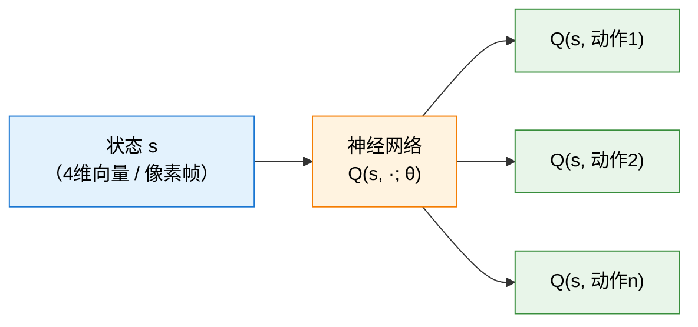

# 4.1 为什么需要深度 Q 网络：Q 表格的局限与神经网络的替代

## 本节导读

**核心内容**

- 回顾 Q-Learning 的更新机制：TD Target、TD Error 和学习率如何协同完成"走一步、改一步"。
- 理解维度灾难为什么让表格方法在高维状态空间中彻底失效。
- 掌握深度 Q 网络用神经网络替代表格的核心动机，以及直接套用会遇到的两大陷阱。

**核心公式**

$$
Q(s, a) \leftarrow Q(s, a) + \alpha \left[ r + \gamma \max_{a'} Q(s', a') - Q(s, a) \right] \quad \text{（Q-Learning 更新规则：用一步经验修正 Q 值）}
$$

> **Q-Learning 更新规则 (Q-Learning Update Rule)：**
>
> - $Q(s, a)$：旧预测——当前表格中状态 $s$ 下动作 $a$ 的分值。
> - $r + \gamma \max_{a'} Q(s', a')$：TD Target，由"已经落袋的即时奖励"和"新局面的最大 Q 值打完折"组成。
> - $\alpha$：学习率，控制每次修正的步长——$\alpha = 1$ 一步到位（容易震荡），$\alpha = 0.1$ 稳扎稳打（收敛慢）。

$$
\text{TD Target} = r + \gamma \max_{a'} Q(s', a') \quad \text{（TD 目标：根据实际奖励与未来估计给出的"应得分"）}
$$

> **TD Target (时序差分目标)：**
>
> - $r$：这一步实际拿到的即时奖励，已经落袋为安的分数。
> - $\gamma \max_{a'} Q(s', a')$：从新状态 $s'$ 出发，选最好的动作能拿多少分，再打一个时间折扣。
> - 两部分相加，回答的问题是："刚走了这步，根据现实和对未来的判断，这个局面应该值多少分？"

$$
\delta = \text{TD Target} - Q(s, a) \quad \text{（TD Error：预测和目标之间的差距，学习的核心信号）}
$$

> **TD Error (时序差分误差)：**
>
> - $\delta > 0$：之前低估了这个局面——实际上比想象的好，应该上调。
> - $\delta < 0$：之前高估了——实际上没那么好，应该下调。
> - $\delta = 0$：预测完全准确，不需要修正。

在 GridWorld 里，Q-Learning 看起来很自然。16 个格子，每个格子 4 个动作，一共只有 64 个 $Q$ 值；智能体走一步，就用”实际奖励 + 下一状态的最优价值估计”修正一次当前动作的分数。

注意整个更新流程里每一步都要做同一件事——**从表格里查 $Q(s, a)$ 或 $Q(s', a')$。** 在 GridWorld 里，64 行的表格查起来几乎不花时间，这完全不是问题。但一旦换了任务，问题就来了。

**但问题也恰恰出在这里。** 这张 Q 表既是 Q-Learning 的**记忆**，也是它的**边界**。只要所有状态-动作对都能枚举出来，查表、更新、取最大值都很直接；一旦枚举不了，**”逐格存数”这条路线就走到头了。**

**CartPole 是第一个分水岭。** 它的状态不再是 16 个格子编号，而是由小车位置、速度、杆角和角速度组成的 4 维连续向量——每个维度都是实数，理论上有无限多个不同状态。即便把每个维度离散化成 100 个格子，状态总数也有 $100^4 = 10^8$ 个，乘 2 个动作就是 **2 亿行 Q 表**。这还只是一个**入门级的玩具问题**。换成 Atari 游戏，预处理后的输入是 4 帧 $84 \times 84$ 灰度图，共 28224 个像素值——可能的状态数已经大到没有物理意义，建 Q 表就像用一把尺子量整个银河系，**不是精度不够，而是方法本身就错了。**

$r + \gamma \max_{a'} Q(s', a')$ 这个更新规则面对连续状态**仍然是对的**，没有任何修改的必要。真正卡住的是**实现层面**：只要状态多到无法枚举，”每个状态-动作对单独存一个数”就从理所当然变成了**根本做不到**。

出路是**函数逼近**（function approximation）。核心思想很简单：既然不能为每个状态单独存一个数，那就学一个带参数的函数 $f(s; \theta)$，输入状态 $s$，输出价值估计。参数 $\theta$ 的数量是固定的——几百、几千或几百万——与状态空间多大无关。更重要的是，这个函数有**泛化能力**：训练时没见过的状态，只要和见过的状态相似，也能得到合理的估计值。

用函数逼近来做强化学习并不是新想法。Sutton 在 1988 年的 TD($\lambda$) 论文中已经讨论了用神经网络作为函数逼近器 [^sutton1988]。1990 年代，Lin [^lin1993] 和 Rummery & Niranjan [^rummery1994] 先后尝试把神经网络和 Q-Learning 结合，但受限于当时的计算能力和训练稳定性，这些早期尝试只能在极小的问题上工作，始终未能扩展到 Atari 这类高维输入任务。真正的突破要等到 2013 年——DeepMind 的 Mnih 等人提出了**深度 Q 网络**（Deep Q-Network, DQN），用两个关键技巧让神经网络 Q-Learning 在 Atari 上第一次跑通了 [^mnih2013]。2015 年，这篇论文正式发表在 Nature 上，标志着深度强化学习时代的开端 [^mnih2015]。

把函数逼近的思想搬到 Q-Learning 上，就是用神经网络近似整张 Q 表，写成 $Q(s, a; \theta) \approx Q^*(s, a)$。这件事的实质是：**保留 Q-Learning 的更新思想，但把”64 行的表格”换成”几万个参数的神经网络”。**

## Q-Learning 的回顾

让我们先把 Q-Learning 的核心公式再拿出来看看。在 GridWorld 中，更新规则是：

$$Q(s, a) \leftarrow Q(s, a) + \alpha \left[ r + \gamma \max_{a'} Q(s', a') - Q(s, a) \right]$$

别被这些符号吓到，让我们先列一张"角色设定表"：

| 符号                  | 含义（直观理解）                          | 角色                       |
| --------------------- | ----------------------------------------- | -------------------------- |
| $Q(s, a)$             | "在状态 $s$ 下做动作 $a$，未来能拿多少分" | 旧预测——表格里已经存的分数 |
| $r$                   | 这一步实际拿到的即时奖励                  | 现实——刚刚发生的事         |
| $s'$                  | 做完动作 $a$ 后到达的新状态               | 下一个局面                 |
| $\gamma$              | 折扣因子，"未来的 1 分只值 $\gamma$ 分"   | 时间贬值器                 |
| $\max_{a'} Q(s', a')$ | 在新状态 $s'$ 下，所有动作中最大的 Q 值   | "新局面能带来的最高分"     |
| $\alpha$              | 学习率，控制每次修正的幅度                | 修正步长                   |

现在让我们像拆手表一样，把这个公式一层一层剥开：

**第一层：TD Target——"这件事应该值多少分？"**

$$\text{TD Target} = r + \gamma \max_{a'} Q(s', a')$$

TD Target 由两部分相加：眼下的奖励 $r$（已经落袋为安的分数）加上未来的期望 $\gamma \max_{a'} Q(s', a')$（从新局面出发，最多还能拿多少分，再打一个时间折扣）。它回答的问题是："如果我刚走了这步，根据实际拿到的分数和对未来的判断，这个局面应该值多少分？"

**第二层：TD Error——"我猜错了多少？"**

$$\delta = \text{TD Target} - Q(s, a) = r + \gamma \max_{a'} Q(s', a') - Q(s, a)$$

TD Error 就是"应该值多少分"减去"我之前猜的分数"。如果 $\delta > 0$，说明之前低估了这个局面——实际上比想象的好，应该上调。如果 $\delta < 0$，说明之前高估了——实际上没那么好，应该下调。

**第三层：更新——"按比例修正"**

$$Q(s, a) \leftarrow Q(s, a) + \alpha \cdot \delta$$

把旧 Q 值往 TD Target 的方向挪一点，挪多少由学习率 $\alpha$ 控制。$\alpha = 1$ 意味着直接跳到 TD Target（一步到位，但容易震荡），$\alpha = 0.1$ 意味着每次只修正 10%（稳扎稳打，但收敛慢）。

整个过程用一句话概括：**走一步，看看实际拿了多少分，和之前的预测比较，猜高了就往下调，猜低了就往上调。** 跑得够多，预测越来越准，TD Error 趋近于零，学习完成。

这个算法之所以在 GridWorld 上工作得完美无缺，有一个隐藏的前提条件：表格能装得下所有的状态-动作对。GridWorld 只有 16 个状态和 4 个动作，64 行的表格轻轻松松。但一旦状态空间变大，这个前提就崩塌了。

## 维度灾难：表格装不下的世界

让我们算一算几个经典任务的状态空间规模。

猜硬币只有 2 个状态，Q 表格只有 4 行。井字棋有 $3^9 \approx 20{,}000$ 个局面，勉强还能建表格。国际象棋大约有 $10^{47}$ 种合法局面——这个数字已经超过了地球上所有计算机的存储总和。围棋更夸张，$3^{361} \approx 10^{170}$ 种局面，而可观测宇宙中的原子总数也不过 $\sim 10^{80}$ 个。

但上面这些都还是离散状态，至少在理论上你还能穷举。真正的麻烦来自连续状态空间。

CartPole 的状态是一个 4 维连续向量 $[x, \dot{x}, \theta, \dot{\theta}]$，每个维度都是实数。理论上存在无限多个不同的状态——你不可能建一张无限长的表格。如果我们把每个维度离散化为 100 个格子，那状态总数就是 $100^4 = 10^8$，4 个动作就是 $4 \times 10^8$ 行的表格。这还只是 CartPole，一个入门级的玩具问题。

Atari 游戏就更不用提了。标准预处理后的输入是 4 帧堆叠的 84×84 灰度图，也就是 $84 \times 84 \times 4 = 28{,}224$ 个像素值，每个像素有 256 种取值。可能的状态数量是 $256^{28224}$——这个数字写出来会填满好几页纸，而且完全没有意义，因为它远远超出了任何物理系统所能表示的范围。在这种情况下建 Q 表格，就像试图用一把尺子量整个银河系——不是精度不够的问题，而是方法本身就错了。

这就是强化学习中著名的**维度灾难**（Curse of Dimensionality）。Q-Learning 在理论上没有任何问题——它最终会收敛到最优 Q 值。但在高维状态空间中，"最终"可能是宇宙热寂之后。我们需要一种不依赖穷举的方法。

## 深度 Q 网络的解决方案：用神经网络代替表格

第 3 章我们已经学过函数逼近的思想：既然不可能为每个状态单独存一个值，那就学习一个函数 $f(s; \theta)$，输入状态 $s$，输出 V 值的近似值。把这个思想搬到 Q-Learning 上，就是用神经网络来近似 $Q^*(s, a)$：

$$Q(s, a; \theta) \approx Q^*(s, a)$$

这就是深度 Q 网络（Deep Q-Network, DQN）。名字里的 "Deep" 指的是深度神经网络。

具体来说，深度 Q 网络接收一个状态 $s$ 作为输入，同时输出所有可能动作的 Q 值。比如在 CartPole 中，网络接收 4 维状态向量，输出 2 个 Q 值（对应"左推"和"右推"）。在 Atari 中，网络接收 84×84×4 的像素帧，输出 4 到 18 个 Q 值（取决于游戏有多少个可用动作）。

神经网络替代表格的好处是显而易见的：不需要为每个状态单独存一个 Q 值，只需要存一组参数 $\theta$。参数的数量是固定的——比如几万到几百万——不管状态空间有多大。更重要的是，神经网络有泛化能力：训练时见过的状态和没见过但相似的状态会得到相近的 Q 值。这正是我们在第 3 章"从表格到神经网络"那一节讨论过的思想。

## 直接套用会怎样？——训练崩溃

听起来很简单，对吧？把表格换成神经网络，其他照旧。但 DeepMind 的研究者在最初的尝试中发现了一个严重的问题：直接这样做，训练会崩溃。

原因有两个。

第一个问题是**样本相关性**。在 Atari 游戏中，相邻的帧几乎一模一样——画面上可能只有几个像素的变化。如果逐帧训练，一批训练数据里的样本几乎都是同一个场景的微小变体。这违反了随机梯度下降（SGD）的独立同分布假设——就像一个学生只做同一道题的微小变体，看起来做了很多题，实际上只学到了一种解法。梯度会被"当前帧"绑架，网络参数会在局部打转，无法学到通用的策略。

第二个问题是**目标不稳定**。Q-Learning 的更新目标是 $r + \gamma \max_{a'} Q(s', a')$，注意这个目标本身也依赖于 $Q$ 函数——而 $Q$ 函数正在被更新。换句话说，网络在学习的同时，它追赶的目标也在移动。这就像一只狗追自己的尾巴：每次往前扑一步，尾巴也跟着动一步，永远追不上。在表格方法中这不是问题，因为每个状态的更新是独立的。但在神经网络中，更新一个状态的 Q 值会影响所有状态的 Q 值（因为参数是共享的），目标的不稳定会被放大。

这两个问题让"直接把神经网络套在 Q-Learning 上"这个看似简单的方法在实践中完全无法工作。DeepMind 的贡献不在于"用神经网络代替表格"这个想法本身——这个想法早在 1990 年代就有人提过了。他们的贡献在于提出了两个精巧的工程技巧来解决上述两个问题：**经验回放**（Experience Replay）打破样本相关性，**目标网络**（Target Network）稳定训练目标。这两个技巧让深度 Q 网络真正跑了起来，也让 DeepMind 的论文在 2015 年登上了 Nature 的封面 [^1]。

思考题：为什么 1990 年代就有人想到用神经网络近似 Q 函数，但直到 2013 年才成功？

早期尝试失败的主要原因有三个。第一，计算能力不足——1990 年代的 GPU 还没有普及，训练一个能处理像素输入的神经网络太慢了。第二，缺少经验回放和目标网络这两个稳定训练的技巧——没有它们，神经网络参数会发散。第三，数据不够——Atari 模拟器（Arcade Learning Environment）直到 2013 年才被开发出来，在此之前没有一个统一的、可以大量快速交互的游戏环境。

DeepMind 的深度 Q 网络在 2013 年首次公布（arXiv 论文），2015 年正式发表在 Nature 上。这两篇论文标志着深度强化学习时代的开端。

接下来，让我们深入拆解深度 Q 网络的三个核心组件——[Q 网络、经验回放和目标网络](./dqn-components)。

## 参考文献

[^sutton1988]: Sutton, R. S. (1988). Learning to predict by the methods of temporal differences. _Machine Learning_, 3(1), 9-44.

[^lin1993]: Lin, L.-J. (1993). _Reinforcement learning for robots using neural networks_. PhD thesis, Carnegie Mellon University.

[^rummery1994]: Rummery, G. A., & Niranjan, M. (1994). _On-line Q-learning using connectionist systems_. Technical Report CUED/F-INFENG/TR 166, Cambridge University.

[^mnih2013]: Mnih, V., et al. (2013). Playing Atari with deep reinforcement learning. _arXiv preprint_, arXiv:1312.5602.

[^mnih2015]: Mnih, V., et al. (2015). Human-level control through deep reinforcement learning. _Nature_, 518(7540), 529-533.
