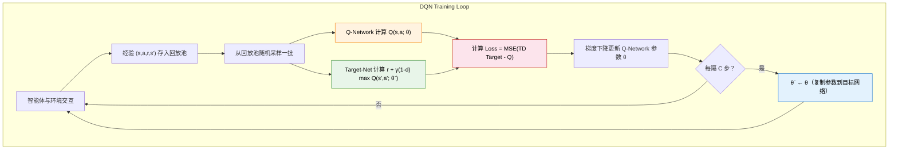

# 5.3 Distributional RL

## 本节导读

**核心内容**

- 掌握 Q 网络的架构与损失函数：用神经网络近似 $Q(s,a)$，通过均方 TD Error 训练。
- 理解经验回放（Experience Replay）如何打破样本相关性、提高数据利用效率。
- 理解目标网络（Target Network）如何通过延迟参数更新稳定训练目标。

**核心公式**

$$
\mathcal{L}(\theta) = \mathbb{E}\left[\left( r + \gamma (1 - d) \max_{a'} Q(s', a'; \theta^-) - Q(s, a; \theta) \right)^2\right]
$$

> **深度 Q 网络损失函数（MSE TD Error）：**
>
> - $\theta$：Q 网络的参数——正在被训练的"学生"。
> - $\theta^-$：目标网络的参数——一个慢更新的副本，专门用来生成"标准答案"。
> - $Q(s, a; \theta)$：Q 网络对当前状态-动作对的打分，即"学生的回答"。
> - $d$：终止标记。若 episode 真正终止，$d=1$，没有下一状态价值；否则 $d=0$。
> - $r + \gamma (1-d) \max_{a'} Q(s', a'; \theta^-)$：TD Target，即时奖励加上目标网络给出的打折未来最高分，即"标准答案"。
> - 外层 $\mathbb{E}$：对所有可能的转移 $(s, a, r, s')$ 取期望，实践中从经验回放池随机采样来近似。

上一节解决的是”为什么需要 DQN”：Q 表在连续状态和像素输入中装不下，而直接把神经网络接到 Q-Learning 上又会遇到样本相关和目标移动。现在我们进入第二个问题：**DQN 到底怎样把这个想法组织成一个能训练的算法？**

如果只用一个网络——既用它选动作、算 Q 值，又用它生成 TD Target——会怎样？用一个具体例子说明。

**第一步：计算 TD Target。** 假设某个状态下网络预测 $Q(s, a) = 5.0$，下一步状态的网络输出 $\max Q(s', a') = 8.0$。那么：

$$\text{TD Target} = r + \gamma \times 8.0 = 1.0 + 0.99 \times 8.0 = 8.92$$

$$\text{TD Error} = 8.92 - 5.0 = 3.92$$

**第二步：梯度下降更新参数。** 网络根据 TD Error 调整参数，把 $Q(s, a)$ 往 8.92 的方向拉。到目前为止一切正常。

**第三步：问题暴露。** 关键在于——$s'$ 的 Q 值也是用同一组参数算的。参数更新后，$\max Q(s', a')$ 也跟着变了，可能从 8.0 变成了 4.0。下次再算同一个 TD Target 时：

$$\text{TD Target}' = 1.0 + 0.99 \times 4.0 = 4.96$$

“标准答案”从 8.92 跳到了 4.96，差了将近一倍。网络刚追上 8.92，目标又跑到了 4.96；追到 4.96，目标又跑到别的地方。Q 值剧烈震荡甚至发散。

这就是 Sutton & Barto 所说的”致命三要素”（deadly triad）：函数逼近 + 自举 + 离线策略学习，三者同时出现会让训练极不稳定。

DQN 的答案是三个组件。Q 网络负责替代表格，给每个动作输出价值估计；经验回放负责把连续交互得到的样本打散，让训练 batch 不再只反映最近几步；目标网络是 Q 网络的冻结副本，专门用来计算 TD Target，参数每隔 C 步才从 Q 网络硬拷贝一次，在两次拷贝之间靶子不动。把这三件事合在一起，才得到通常意义上的深度 Q 网络。

提醒一下：第 3 章我们学过 **TD 方法**的核心思想——走一步就能更新价值估计，不需要等一整局结束。TD Target = $r + \gamma V(s')$，即"已经落袋的奖励 + 下一状态的估计价值"。深度 Q 网络里的 TD Target 结构完全一样，只不过把 $V(s')$ 换成了 $\max_{a'} Q(s', a')$——因为 Q-Learning 评估的是动作价值，不是状态价值。

让我们逐一拆解这三个组件。

## Q 网络与损失函数

上面说到，只用一个网络会让 TD Target 跟着参数一起动。DQN 的解决方案是维护**两个结构相同但更新节奏不同的网络**：

- **Q 网络**（参数 $\theta$）：负责选择动作和日常训练，每步被梯度下降更新。这是”学生”。
- **目标网络**（参数 $\theta^-$）：Q 网络的冻结副本，专门用来计算 TD Target。参数每隔 C 步从 Q 网络硬拷贝一次，在两次拷贝之间完全不动。这是”阅卷老师”。

两个网络结构完全相同，区别只在于参数更新的节奏。这种设计把”预测”和”生成标准答案”解耦，让 Q 网络在一段时间内面对一个稳定的优化目标。

### Q 网络的架构

Q 网络做的事情很简单：接收一个状态 $s$，输出每个动作的 Q 值。在 LunarLander 中，输入是 8 维向量，描述飞船的位置、速度、姿态和支架接触状态；输出是 4 个 Q 值，对应”不喷””左侧喷口””主发动机””右侧喷口”四个离散动作。

```python
import torch
import torch.nn as nn

class QNetwork(nn.Module):
    """Q-Network：输入状态，输出每个动作的 Q 值"""

    def __init__(self, state_dim, action_dim, hidden_dim=128):
        super().__init__()
        self.net = nn.Sequential(
            nn.Linear(state_dim, hidden_dim),
            nn.ReLU(),
            nn.Linear(hidden_dim, hidden_dim),
            nn.ReLU(),
            nn.Linear(hidden_dim, action_dim)
        )

    def forward(self, x):
        return self.net(x)  # 输出形状: (batch_size, action_dim)
```

这段代码非常简洁：三层全连接网络，两个隐藏层各有 128 个神经元，用 ReLU 做激活函数。输入是状态向量，输出是每个动作的 Q 值。对于 LunarLander（`state_dim=8, action_dim=4`），这个网络的参数量仍然只有几万个——足够轻量，也足以表达低维控制任务中的非线性关系。

为什么输出的是所有动作的 Q 值而不是单个？因为一次前向传播就能得到所有动作的评分，不需要为每个动作单独跑一遍网络。选择动作时只需要对输出取 `argmax`——哪个动作的 Q 值最大就选哪个。

对于 Atari 游戏，输入是 84×84×4 的像素帧，全连接网络就不够用了——参数太多，且无法捕捉图像的空间结构。DeepMind 在原始论文中使用了卷积神经网络（CNN）：先用几层卷积提取图像特征，再用全连接层输出 Q 值。不过对于 LunarLander 这样的低维向量输入，简单的 MLP 就足够了。我们在本章的动手环节中先用 MLP 在 LunarLander 上观察 DQN，再把 CNN 架构留给视觉游戏项目。

Q 网络的训练目标是让网络输出的 Q 值尽可能接近"真实的" Q 值。但我们不知道真实的 Q 值是多少——如果能查表知道，就不需要神经网络了。所以我们用和 Q-Learning 一样的方式构造训练目标：

$$\text{TD Target} = r + \gamma (1-d) \max_{a'} Q(s', a')$$

然后最小化网络输出和 TD Target 之间的均方误差：

$$\mathcal{L}(\theta) = \mathbb{E}\left[\left( r + \gamma (1-d) \max_{a'} Q(s', a'; \theta^-) - Q(s, a; \theta) \right)^2\right]$$

这个公式看起来很复杂，让我们先理清里面每个符号的"角色"：

| 符号                                             | 含义（直观理解）                                 | 角色                         |
| ------------------------------------------------ | ------------------------------------------------ | ---------------------------- |
| $\theta$                                         | Q-Network 的参数（正在被训练的那个网络）         | 学生——正在考试的人           |
| $\theta^-$                                       | 目标网络的参数（Q 网络的冻结副本）               | 标准答案——阅卷老师手里的参考 |
| $Q(s, a; \theta)$                                | 学生当前的回答："我觉得这步值 $X$ 分"            | 网络的预测                   |
| $r$                                              | 这一步实际拿到的即时奖励                         | 眼前落袋为安的分数           |
| $d$                                              | 是否真正终止                                     | 终止时切断未来价值           |
| $\gamma (1-d) \max_{a'} Q(s', a'; \theta^-)$     | 从新局面出发，目标网络给出的最高未来分，再打个折 | "未来最多还能拿多少"         |
| $r + \gamma (1-d) \max_{a'} Q(s', a'; \theta^-)$ | TD Target——"这件事应该值多少分"                  | 标准答案                     |

现在让我们一步步拼出这个损失函数：

**第一块积木：TD Target——标准答案**

$$y = r + \gamma (1-d) \max_{a'} Q(s', a'; \theta^-)$$

TD Target 就是"即时奖励 + 打了折的未来最高分"。如果这一步已经到达真正的终止状态，$d=1$，未来项被清零，目标就只剩即时奖励 $r$。注意这里的 $Q$ 使用的是目标网络的参数 $\theta^-$，而不是正在被训练的 $\theta$——标准答案不能跟着学生一起改。

**第二块积木：TD Error——预测和标准答案差了多少**

$$\delta = y - Q(s, a; \theta) = r + \gamma (1-d) \max_{a'} Q(s', a'; \theta^-) - Q(s, a; \theta)$$

TD Error 就是"标准答案减去学生的回答"。在表格方法中，我们直接把 Q 值往 TD Target 的方向挪 $\alpha \cdot \delta$。但在神经网络中，我们不能直接改某个 Q 值——只能通过修改参数 $\theta$ 间接影响所有 Q 值。

**第三块积木：平方——惩罚大错，容忍小错**

$$\mathcal{L}(\theta) = \mathbb{E}\left[\delta^2\right] = \mathbb{E}\left[\left(y - Q(s, a; \theta)\right)^2\right]$$

为什么不直接用 $\delta$ 而要平方？两个原因。第一，$\delta$ 可能是正的也可能是负的，正负会互相抵消，平均下来接近 0，看起来好像没误差——但实际上可能错得离谱。平方之后永远是正数，不会被正负抵消。第二，平方对小误差宽容（差 0.1 就罚 0.01），对大误差严厉（差 1.0 就罚 1.0，差 3.0 就罚 9.0）——这迫使网络优先修正最离谱的预测。

**第四块积木：取期望——在所有样本上平均**

$$\mathcal{L}(\theta) = \mathbb{E}\left[\left(y - Q(s, a; \theta)\right)^2\right]$$

外面的 $\mathbb{E}$ 表示"对所有可能的转移 $(s, a, r, s')$ 取平均"。在实践中，我们不可能穷举所有转移，所以从经验回放池里随机采样一批来近似这个期望——这就是 SGD（随机梯度下降）的"随机"的含义。

把四块积木合在一起：深度 Q 网络的训练过程就是不断从经验回放池采样，计算 TD Target（标准答案），和网络输出（学生的回答）对比，用均方误差算出损失，然后通过反向传播更新参数 $\theta$。本质和 Q-Learning 表格方法完全一样——只不过现在是通过梯度下降来更新参数，而不是直接修改表格里的数值。

但这里有一个我们反复提到却还没解释的关键细节：上面的"取期望"和"随机采样"到底是怎样操作的？为什么不能直接拿智能体刚经历的那一条数据来训练？这就引出了第二个组件。

## 经验回放

损失函数的外层 $\mathbb{E}$ 要求我们对所有转移取平均——但"所有转移"是什么意思？在监督学习中，训练数据是预先收集好的、打乱顺序的，每个 mini-batch 里的样本近似独立。强化学习完全不是这样：智能体每走一步产生一条经验 $(s, a, r, s', d)$，连续几步的经验描述的是同一个场景的微小变化。

这意味着如果直接拿刚经历的数据训练网络，相邻样本几乎一模一样——CartPole 里连续两帧的观测向量可能只差小数点后几位。深度学习要求数据近似独立同分布（i.i.d.），用这样高度相关的数据训练，梯度方向会被最近几步的经历主导，网络会"遗忘"之前学过的东西。

这绝不是抽象的理论担忧。DeepMind 在 2015 年的 DQN 论文中做过对比实验：不用经验回放时，Atari Breakout（打砖块）上的智能体会反复学习"把球弹到左侧"的策略，因为连续几百帧球都在左侧弹跳；等球回到右侧时，网络已经忘了右侧该怎么打，又要从头学起。加上经验回放后，一个 batch 里可能同时包含"球在左上角""球在右侧边缘""球即将落地"等截然不同的场景，网络才能同时学会应对各种局面。在自动驾驶中也有类似的现象：如果只用最近 10 秒的连续数据训练，模型可能只会处理"晴天直路"，完全不知道雨天弯道该怎么应对。

经验回放（Experience Replay）的解决方案朴素但有效：把所有经历过的转移 $(s, a, r, s', d)$ 存进一个缓冲区，每次训练时随机采样一小批。随机采样打破了时间相关性——一个 batch 里可能同时包含训练初期的失败经验和后期的成功经验，梯度方向更加多样。

具体存的是什么？每一步交互产生一条五元组：

| 分量 | 含义       | CartPole 例子                                            |
| ---- | ---------- | -------------------------------------------------------- |
| $s$  | 当前状态   | `[0.03, 0.12, -0.05, -0.32]`（位置、速度、角度、角速度） |
| $a$  | 执行的动作 | `0`（左推）                                              |
| $r$  | 获得的奖励 | `1.0`（杆子没倒，每步 +1）                               |
| $s'$ | 下一状态   | `[0.03, -0.05, -0.06, 0.18]`（动作后的新观测）           |
| $d$  | 是否终止   | `False`（杆子还在立着）                                  |

回放池就是这样的五元组的集合。随着智能体不断交互，池子逐渐填满。下面是一个 CartPole 训练中回放池可能存储的实际内容：

| #   | $s$（状态）                  | $a$（动作） | $r$（奖励） | $s'$（下一状态）             | $d$（终止） | 来源               |
| --- | ---------------------------- | ----------- | ----------- | ---------------------------- | ----------- | ------------------ |
| 1   | `[0.01, 0.12, 0.05, -0.32]`  | `1`（右推） | `1.0`       | `[0.01, 0.15, 0.04, -0.28]`  | `False`     | 第 2 局，开局      |
| 2   | `[0.02, 0.31, -0.12, 0.89]`  | `0`（左推） | `1.0`       | `[0.01, 0.28, -0.10, 0.85]`  | `False`     | 第 8 局，中期      |
| 3   | `[0.05, 0.44, 0.21, 1.02]`   | `1`（右推） | `1.0`       | `[0.06, 0.48, 0.24, 1.10]`   | `True`      | 第 8 局，杆子倒了  |
| 4   | `[0.00, 0.02, 0.01, -0.05]`  | `0`（左推） | `1.0`       | `[0.00, -0.01, 0.01, -0.03]` | `False`     | 第 45 局，杆子很稳 |
| 5   | `[-0.03, -0.18, 0.08, 0.55]` | `1`（右推） | `1.0`       | `[-0.03, -0.14, 0.09, 0.50]` | `False`     | 第 102 局，中期    |

注意几件事：

- 第 3 条的 $d=\text{True}$：杆子倒了，这局结束。TD Target 中 $(1-d)=0$，未来价值被清零，只有即时奖励 $r=1.0$。这种经验教会网络"在这个状态下右推会导致杆子倒下"。
- 第 4 条来自第 45 局：杆子几乎不动，状态向量接近零。这种经验教会网络"杆子接近竖直时保持不动也很好"。
- 不同条目来自不同时间、不同局数。训练时随机抽出一批，网络同时看到开局、中期、失败和成功，不会被单一阶段主导。

训练时随机抽出 64 条这样的经验，每条告诉网络："在这个状态下做了这个动作，结果是这么多分，环境变成了这样。"网络据此调整 Q 值预测，使得下次遇到类似状态时能做出更好的判断。


```python
import random
from collections import deque

class ReplayBuffer:
    """经验回放池：存储和采样 (s, a, r, s', done) 转移"""

    def __init__(self, capacity=10000):
        self.buffer = deque(maxlen=capacity)  # 超出容量自动淘汰旧数据

    def push(self, state, action, reward, next_state, done):
        """存入一条经验"""
        self.buffer.append((state, action, reward, next_state, done))

    def sample(self, batch_size):
        """随机采样一批经验"""
        batch = random.sample(self.buffer, batch_size)
        states, actions, rewards, next_states, dones = zip(*batch)
        return (torch.FloatTensor(states),
                torch.LongTensor(actions),
                torch.FloatTensor(rewards),
                torch.FloatTensor(next_states),
                torch.FloatTensor(dones))

    def __len__(self):
        return len(self.buffer)
```

经验回放有三个好处：

1. **打破时间相关性**：随机采样保证每批训练数据来自不同时间段，梯度方向多样，不会被困在最近的经验里。
2. **提高数据利用效率**：每条经验可以被多次采样用于训练，而不是用一次就扔掉。在神经网络中，一条经验可以影响所有状态的 Q 值估计，重复利用很有价值。
3. **平滑训练过程**：旧经验和新经验混合在一起，网络不会过度拟合最近的经验。

经验回放池的大小是一个需要调整的超参数。太小的话，池子里经验不够多样，训练效果差。太大的话，很早之前的过时经验（基于当时还不准确的 Q 网络产生的）仍然会被采样，可能拖慢收敛。实践中常用的容量是 $10^4$ 到 $10^6$。

经验回放解决了"数据从哪来"和"样本相关性"的问题。但还有一个问题没有解决：损失函数里的 TD Target $r + \gamma \max_{a'} Q(s', a'; \theta^-)$ 本身也可能不稳定。如果 TD Target 跟着网络参数同步变化，网络每次更新后都会面对一个新目标，优化过程就会变得很难收敛。这就引出了第三个、也是最后一个组件。

## 目标网络

Q-Learning 的更新目标是 $r + \gamma \max_{a'} Q(s', a')$。在表格方法中，这个目标相对稳定——因为 $Q(s', a')$ 存在独立的表格单元里，更新 $Q(s, a)$ 不会改变 $Q(s', a')$。但在神经网络中，参数是共享的：更新 $Q(s, a)$ 的同时，也可能改变 $Q(s', a')$ 的值。也就是说，网络一边修改自己的预测，一边又改变下一步要逼近的目标。

目标网络（Target Network）的解决方案也很朴素：维护两个网络，一个 Q-Network $\theta$ 用于选择动作和日常更新，另一个目标网络 $\theta^-$ 专门用来计算 TD Target。目标网络的参数不参与梯度下降，而是每隔固定的步数从 Q-Network 复制过来：

```python
# 每隔 target_update 步，把 Q 网络的参数复制到目标网络
if step % target_update == 0:
    target_net.load_state_dict(q_net.state_dict())
```

计算 TD Target 时使用目标网络：

```python
# 用目标网络计算 TD Target（稳定的靶子）
with torch.no_grad():
    td_target = reward + gamma * target_net(next_state).max() * (1 - done)
```

这样一来，在两次参数复制之间，TD Target 是固定的——靶子不会乱动了。Q-Network 可以安心地向一个稳定的目标学习，而不是追一个不断移动的靶子。每隔固定步数更新一次目标网络，相当于让靶子每隔一段时间挪到一个新的位置，给 Q-Network 一个更准确的追逐目标。

目标网络的更新频率是另一个超参数。更新太频繁（比如每步都更新），目标网络和 Q-Network 几乎一样，起不到稳定作用。更新太稀疏（比如每 10000 步才更新），目标网络给出的 TD Target 太过时，Q-Network 学到的可能是过时的信息。实践中常用的更新频率是每 100 到 1000 步。

## 从零实现 DQN

前面从概念和公式角度拆解了 Q 网络、经验回放和目标网络。现在换一个视角：假设你要从零写一个 DQN，思路是什么？

思路并不复杂——先搭网络，再准备数据，然后定义更新逻辑，最后组装成训练循环。以 CartPole 为例（`state_dim=4, action_dim=2`），我们一步步搭建。每一步都会讲清楚参数为什么这么设、换成别的值会怎样。

### 定义 Q 网络

第一件事：写一个网络，输入状态，输出每个动作的 Q 值。CartPole 的观测是 4 维向量（小车位置、速度、杆子角度、角速度），动作是 2 个离散选择（左推、右推）。所以网络需要把 4 维输入映射成 2 维输出。

```python
import torch
import torch.nn as nn

class QNetwork(nn.Module):
    def __init__(self, state_dim, action_dim, hidden_dim=128):
        super().__init__()
        self.net = nn.Sequential(
            nn.Linear(state_dim, hidden_dim),   # 输入层 → 隐藏层
            nn.ReLU(),                          # 激活函数
            nn.Linear(hidden_dim, hidden_dim),  # 隐藏层 → 隐藏层
            nn.ReLU(),
            nn.Linear(hidden_dim, action_dim),  # 隐藏层 → 输出层
        )

    def forward(self, x):
        return self.net(x)  # 输出形状: (batch_size, action_dim)
```

逐个解释实现选择：

- **两层隐藏层**：一层表达能力有限，三层以上对 4 维输入容易过拟合。两层是低维任务的常用起点。
- **`hidden_dim=128`**：总参数约 $4 \times 128 + 128 \times 128 + 128 \times 2 \approx 17000$ 个。64 偏小、256 偏大，128 在精度和效率间取得平衡，迁移到 LunarLander 也够用。Atari 像素输入则需要 CNN 替代 MLP。
- **ReLU 激活**：计算快（只判断正负）、正区间梯度恒为 1 不消失、输出无上界不限制 Q 值范围。Sigmoid/Tanh 有梯度消失和输出范围受限的问题。
- **输出层不加激活**：Q 值可以是任意实数。ReLU 会截断负值，Sigmoid/Tanh 会限制输出范围。
- **一次输出所有动作的 Q 值**：选动作只需一次前向传播加 `argmax`，不用为每个动作各跑一遍。局限是只能处理离散动作，连续动作需要 Actor-Critic（第 6 章）。

::: details 为什么是这些选择？
**为什么是两层隐藏层？** 一层隐藏层的网络理论上也能工作，但表达能力有限——它只能学习输入的线性组合再做一个非线性变换。两层隐藏层让网络可以学习更复杂的状态-动作映射，比如"杆子往右倾且速度在增大时，右推的价值急剧上升"这种非线性关系。三层或更多层当然也行，但 CartPole 状态只有 4 维，网络太深反而容易过拟合、训练变慢。

**为什么 `hidden_dim=128`？** 64 也能跑，但容量偏小，Q 值近似可能不够精确；256 甚至 512 对 CartPole 来说参数太多（超过 10 万个），训练更慢且容易过拟合。128 是一个经验性的平衡点——网络总参数约 17000 个，对 CPU 训练来说很轻量。迁移到 LunarLander（`state_dim=8, action_dim=4`）时同样够用。如果换成 Atari 像素输入，就需要用 CNN 替代 MLP。

**为什么用 ReLU 而不是 Sigmoid 或 Tanh？** 三个原因。第一，ReLU 计算快——只需要判断是否大于 0，Sigmoid 和 Tanh 要算指数。第二，ReLU 在正区间梯度恒为 1，缓解了多层网络中的梯度消失问题——Sigmoid 的梯度最大也只有 0.25，堆叠两层后信号就衰减到 0.0625。第三，Q 值可能很大（CartPole 的累计回报可以超过 200），Sigmoid 把输出压到 $(0, 1)$、Tanh 压到 $(-1, 1)$，会严重限制 Q 值的表达范围。

**为什么输出层不加激活函数？** Q 值是动作的期望累计回报，理论上可以是任意实数。如果加 ReLU，负 Q 值（"这个动作很烂"）会被截断为 0，网络无法表达"某动作应该主动回避"。如果加 Sigmoid 或 Tanh，Q 值范围被限制在 $(0,1)$ 或 $(-1,1)$，而 CartPole 的实际回报远超这个范围。

**为什么一次输出所有动作的 Q 值？** 这比"输入状态和动作，输出单个 Q 值"高效得多——选择动作时只需要一次前向传播再取 `argmax`，而不是为每个动作各跑一遍网络。缺点是只能处理离散动作，不能直接迁移到连续动作空间（那需要 Actor-Critic 方法，我们在第 6 章会讲到）。
:::

### 定义经验回放

第二件事：准备一个容器存历史经验，训练时随机采样打破相关性。智能体每走一步就产生一条转移 $(s, a, r, s', d)$，回放池就是把这些转移攒起来。

```python
import random
from collections import deque

class ReplayBuffer:
    def __init__(self, capacity=10000):
        self.buffer = deque(maxlen=capacity)

    def push(self, state, action, reward, next_state, done):
        self.buffer.append((state, action, reward, next_state, done))

    def sample(self, batch_size):
        batch = random.sample(self.buffer, batch_size)
        states, actions, rewards, next_states, dones = zip(*batch)
        return (
            torch.FloatTensor(states),      # (B, state_dim)
            torch.LongTensor(actions),       # (B,)
            torch.FloatTensor(rewards),      # (B,)
            torch.FloatTensor(next_states),  # (B, state_dim)
            torch.FloatTensor(dones),        # (B,)
        )

    def __len__(self):
        return len(self.buffer)
```

逐个解释实现选择：

- **`capacity=10000`**：CartPole 500 局训练产生数千到数万条转移，10000 条大约保留最近几十到一百局。太小经验不够多样，太大保留过时经验拖慢收敛。LunarLander 常用 $10^4$ 到 $10^5$，Atari 用 $10^5$ 到 $10^6$。
- **`deque(maxlen=capacity)`**：满了自动淘汰最旧元素，比 `list` 头部删除 $O(1)$，比 numpy 数组更灵活。
- **`FloatTensor` 和 `LongTensor`**：状态、奖励等用 `FloatTensor` 参与数学运算；动作用 `LongTensor` 因为 `gather` 要求整数索引。`dones` 用 `FloatTensor` 是因为后面要做 `(1 - dones)` 乘法。

::: details 为什么 capacity 是 10000？
CartPole 每局通常 10\~200 步，500 局训练下来会产生数千到数万条转移。10000 条大约能保留最近几十到一百局的经验，足够提供多样化的训练样本。太小（比如 1000）池子里经验不够多样，训练容易被最近几局主导；太大（比如 $10^6$）会保留很早期的经验，那时 Q 网络还很差，产生的"标准答案"质量低，采到这些旧经验反而拖慢收敛。
:::

### 定义损失函数与参数更新

第三件事：核心更新逻辑。这是整个 DQN 最关键的部分——把 Q 网络、目标网络和经验回放组合在一起，完成一次完整的梯度更新。我们先定义 `DQNAgent` 类的初始化，再写 `update` 方法。

为什么需要两个网络？Q 网络负责输出 Q 值和选择动作，同时不断被梯度下降更新。目标网络是 Q 网络的冻结副本，专门用来计算 TD Target。如果只用一个网络，网络一边改预测、一边又用刚改过的自己制造"标准答案"，就像学生一边考试一边改标准答案——永远追不上。两个网络分工明确：Q 网络是"学生"，目标网络是"阅卷老师"。老师每隔一段时间才更新一次答案（通过硬拷贝），在两次更新之间，学生有一个稳定的靶子可以追赶。

```python
import torch.optim as optim
from torch.nn.utils import clip_grad_norm_

class DQNAgent:
    def __init__(self, state_dim, action_dim, lr=1e-3, gamma=0.99):
        self.action_dim = action_dim
        self.gamma = gamma

        # Q 网络（学生）和目标网络（阅卷老师）
        self.q_net = QNetwork(state_dim, action_dim)
        self.target_net = QNetwork(state_dim, action_dim)
        self.target_net.load_state_dict(self.q_net.state_dict())
        self.target_net.eval()

        self.optimizer = optim.Adam(self.q_net.parameters(), lr=lr)
        self.buffer = ReplayBuffer(capacity=10000)
```

逐个解释初始化参数：

- **`lr=1e-3`**：Adam 的默认学习率，也是 DQN 常用起点。太大 Q 值震荡不收敛，太小 500 局看不到改善。不稳定时先降到 $5 \times 10^{-4}$。
- **`gamma=0.99`**：折扣因子。0.99 让 100 步后的奖励衰减到 $0.99^{100} \approx 0.366$，兼顾眼前和未来。0.9 太短视，0.999 方差太大。
- **`target_net` 同步初始化**：两个网络参数相同，保证早期 TD Target 和 Q 值在同一量级。
- **`target_net.eval()`**：评估模式关闭 Dropout 和 BatchNorm 的随机行为。当前 MLP 没有这些层，但这是好习惯。
- **优化器只含 `q_net` 参数**：目标网络不参与梯度更新，只通过 `update_target()` 硬拷贝。

::: details 为什么需要两个网络？
Q 网络的参数 $\theta$ 每步都在被梯度下降更新。TD Target 的计算公式是 $y = r + \gamma \max_{a'} Q(s', a'; \theta)$——如果这里也用 Q 网络的参数，那每次 $\theta$ 更新后，TD Target 也跟着变了。网络在追逐一个不断移动的靶子：这一步认为 TD Target 应该是 5.0，参数更新后"标准答案"变成了 3.0，下一步又得重新追。

目标网络的解决方案：维护两个独立的网络。Q 网络 $\theta$ 负责选动作和日常更新；目标网络 $\theta^-$ 只用来计算 TD Target，参数每隔 C 步从 Q 网络硬拷贝一次。在两次拷贝之间，TD Target 是固定的——靶子不动了，Q 网络可以安心学习。

在表格 Q-Learning 中不存在这个问题，因为 $Q(s, a)$ 和 $Q(s', a')$ 是表格里不同的格子，更新一个不影响另一个。神经网络共享参数，改一个输出会影响所有输出，所以需要额外的机制来解耦。
:::

::: details 为什么 target_net 要同步初始化？
如果目标网络用随机初始化的参数，而 Q 网络用另一组随机参数，两个网络的 Q 值输出可能在完全不同的量级——比如 Q 网络输出 -5.0，目标网络输出 200.0。这会导致 TD Target 极大或极小，MSE loss 爆炸，梯度把参数推到很远的地方。`load_state_dict(q_net.state_dict())` 保证两个网络从同一个起点出发，至少训练早期的 TD Target 和 Q 值在同一个量级。
:::

::: details 为什么 lr 是 1e-3 而不是别的值？
学习率控制每次参数更新的步长。$10^{-3}$ 是 Adam 在大多数深度学习任务中的默认值。太大会让 Q 值剧烈震荡——这一步预测 5.0，下一步跳到 -3.0，TD Target 也会跟着乱跳，训练无法收敛。太小收敛极慢，500 局可能完全看不到改善。如果训练不稳定，通常先尝试降到 $5 \times 10^{-4}$ 或 $1 \times 10^{-4}$，而不是立刻改网络结构。
:::

::: details 为什么 gamma 是 0.99？
折扣因子控制智能体有多重视未来奖励。0.99 意味着 100 步后的奖励衰减到 $0.99^{100} \approx 0.366$。0.9 则衰减更快，$0.9^{100} \approx 2.7 \times 10^{-5}$，智能体几乎只看眼前几步。0.999 衰减极慢，Q 值估计的方差会变大——因为要估计很远未来的累计回报，不确定性指数级增长。0.99 是多数 RL 任务的经验起点。
:::

现在写核心的 `update` 方法：

```python
    def update(self, batch_size):
        """核心更新：一个 batch 的前向传播 + 反向传播"""
        if len(self.buffer) < batch_size:
            return 0.0

        # 从回放池采样一个 batch
        states, actions, rewards, next_states, dones = self.buffer.sample(batch_size)

        # Q 网络前向传播
        q_values = self.q_net(states).gather(1, actions.unsqueeze(1)).squeeze(1)

        # 目标网络前向传播
        with torch.no_grad():
            next_q_max = self.target_net(next_states).max(dim=1)[0]
            targets = rewards + self.gamma * next_q_max * (1 - dones)

        # 计算 MSE Loss
        loss = nn.MSELoss()(q_values, targets)

        # 反向传播与参数更新
        self.optimizer.zero_grad()
        loss.backward()
        clip_grad_norm_(self.q_net.parameters(), max_norm=10)
        self.optimizer.step()

        return loss.item()
```

`update()` 是整个 DQN 的计算核心。逐步拆解：

- **缓冲区检查**：`len(self.buffer) < batch_size` 时直接跳过。训练初期池子不够 64 条，`random.sample` 会报错。
- **`gather`**：从 `(B, action_dim)` 的输出中，按实际动作编号挑出对应的 Q 值。
- **`torch.no_grad()`**：目标网络冻结，不建计算图。梯度只经过 `q_values`，`targets` 是常数。
- **`.max(dim=1)[0]`**：取每行最大值，即 $\max_{a'} Q(s', a'; \theta^-)$。`[0]` 取值，`[1]` 取下标。
- **TD Target**：`rewards + gamma * next_q_max * (1 - dones)`。终止时 `dones=1`，未来价值清零。
- **MSE Loss**：$\frac{1}{B}\sum (y_i - Q_i)^2$。对大误差惩罚比 L1 更强（误差 2 时 MSE 罚 4 而 L1 罚 2）。
- **`zero_grad` → `backward` → `clip` → `step`**：PyTorch 固定的四步更新模式。

::: details gather 操作的直觉
`self.q_net(states)` 输出形状 `(B, 2)`，每行是两个动作的 Q 值。但损失函数只需要实际执行的那个动作的 Q 值。`gather(1, actions.unsqueeze(1))` 按 `actions` 指定的列号，从每行挑一个数出来：

```
q_net 输出：                 actions:    gather 结果：
[[ 0.3,  0.8],              [1,          [0.8,    ← 第 0 行取第 1 列
 [ 1.2, -0.5],               0,           1.2,    ← 第 1 行取第 0 列
 [-0.1,  0.6],               1,           0.6,    ← 第 2 行取第 1 列
 ...]                         ...]         ...]
```

`actions.unsqueeze(1)` 把形状从 `(B,)` 变成 `(B, 1)`——`gather` 需要索引和输入张量的维度匹配。`.squeeze(1)` 把结果从 `(B, 1)` 压回 `(B,)`。
:::

::: details 为什么梯度裁剪 max_norm=10？
强化学习的 loss 曲面比监督学习更崎岖——同一个 batch 里可能有 TD Error 为 0.1 的样本和 TD Error 为 50 的样本混在一起，后者产生的梯度可能把参数推到很远的地方。`max_norm=10` 是一个经验值，OpenAI 的很多实验也用 10 或 0.5。太大（100）等于没裁剪，太小（1）会限制学习速度。如果训练时 loss 突然暴涨然后不下降，可以尝试缩小这个值。
:::

::: details 为什么用 Adam 而不是 SGD？
Adam 不仅用当前梯度，还维护一阶动量（梯度的指数移动平均）和二阶动量（梯度平方的指数移动平均），自动为每个参数调整有效学习率。DQN 的梯度方差很大——同一个 batch 里可能有大有小，Adam 的自适应性有助于稳定训练。原始 SGD 对学习率更敏感，需要更仔细的调参。
:::

### 动作选择与目标网络同步

第四件事：补上动作选择和目标网络更新。

```python
    def select_action(self, state, epsilon):
        """ε-greedy 动作选择"""
        if random.random() < epsilon:
            return random.randint(0, self.action_dim - 1)
        with torch.no_grad():
            q_values = self.q_net(torch.FloatTensor(state).unsqueeze(0))
        return q_values.argmax(dim=1).item()

    def update_target(self):
        """硬更新：将 Q 网络参数复制到目标网络"""
        self.target_net.load_state_dict(self.q_net.state_dict())
```

逐个解释实现选择：

- **ε-greedy**：训练早期 Q 网络预测几乎随机，只选 `argmax` 会永远重复偶然高分的动作。ε-greedy 以概率 $\varepsilon$ 强制探索，后期衰减到很小时转为利用。
- **`unsqueeze(0)`**：`state` 形状 `(4,)`，网络期望 `(B, 4)`。`unsqueeze(0)` 插入 batch 维度变成 `(1, 4)`。
- **`argmax(dim=1).item()`**：`(1, 2)` → `argmax` → `(1,)` → `.item()` → Python int。`env.step()` 需要普通整数，不能传张量。
- **硬更新**：直接 $\theta^- \leftarrow \theta$，是 DQN 原始论文做法。软更新 $\theta^- \leftarrow \tau \theta + (1-\tau) \theta^-$ 更平滑，是 DDPG 等后续算法的改进。

::: details 为什么用 ε-greedy 而不是其他探索策略？
训练早期 Q 网络的预测几乎随机，如果只选 `argmax`，智能体会一直重复最初偶然高分的那一两个动作，永远发现不了更好的策略。ε-greedy 以概率 $\varepsilon$ 强制随机探索，保证智能体有机会访问所有状态-动作对。训练后期 $\varepsilon$ 衰减到很小，智能体主要利用已学到的知识。更高级的探索策略（如 Noisy Networks、内在好奇心）会在后续章节讨论。
:::

### 训练循环

最后一件事：把所有部件组装进训练循环。

```python
import gymnasium as gym

num_episodes = 500
batch_size = 64
epsilon_start, epsilon_end, epsilon_decay = 1.0, 0.01, 0.995
target_update_freq = 10

env = gym.make("CartPole-v1")
agent = DQNAgent(state_dim=4, action_dim=2)
epsilon = epsilon_start

for episode in range(num_episodes):
    state, _ = env.reset()
    while True:
        action = agent.select_action(state, epsilon)
        next_state, reward, done, truncated, _ = env.step(action)
        agent.buffer.push(state, action, reward, next_state, float(done))
        agent.update(batch_size)
        state = next_state
        if done or truncated:
            break

    epsilon = max(epsilon_end, epsilon * epsilon_decay)
    if (episode + 1) % target_update_freq == 0:
        agent.update_target()
```

逐个解释超参数选择：

- **`num_episodes=500`**：CartPole-v1 "解决"标准是连续 100 局平均 $\geq 475$，DQN 通常 200\~400 局达标。500 局足够。还没收敛通常不是轮数问题，而是其他超参数有误。
- **`batch_size=64`**：32 梯度方差大不稳定，256 被普通经验淹没关键样本。64 或 128 是 DQN 原始论文的常用范围。
- **`epsilon_start=1.0`**：初始完全随机，Q 网络刚初始化输出没意义，100% 探索确保均匀覆盖状态空间。
- **`epsilon_end=0.01`**：保留 1% 随机性作为安全网。完全消除探索后，Q 网络判断错误时永远无法纠正。
- **`epsilon_decay=0.995`**：100 局后 $\approx 0.61$，200 局后 $\approx 0.37$，400 局后 $\approx 0.14$。前半段充分探索，后半段逐步转向利用。0.95 太快，0.999 太慢。
- **`target_update_freq=10`**：每 10 局同步目标网络。太频繁等于没有目标网络，太稀疏目标过旧。LunarLander 通常按步数算，每 1000 步更新。
- **`float(done)`**：Gymnasium 返回布尔值，转浮点数后才能参与 `(1 - dones)` 乘法运算。
- **每步都 `update`**：边收集边训练，最大化数据利用。池子不够 batch 时 `update` 内部跳过。

::: details epsilon 衰减速度对比
每局结束后 $\varepsilon \leftarrow \varepsilon \times \text{epsilon\_decay}$。不同衰减系数的效果：

| 衰减系数  | 100 局后  | 200 局后  | 400 局后  | 效果                           |
| --------- | --------- | --------- | --------- | ------------------------------ |
| 0.95      | 0.006     | —         | —         | 太快，还没探索就固化策略       |
| 0.99      | 0.366     | 0.134     | 0.018     | 稍快，某些任务可用             |
| **0.995** | **0.606** | **0.368** | **0.135** | **平衡，前半段探索后半段利用** |
| 0.999     | 0.905     | 0.819     | 0.670     | 太慢，500 局后还很随机         |

:::

::: details 为什么每步都调用 update？
这个训练循环里，每执行一步动作就立即从回放池采样训练一次。这是 DQN 原始论文的做法——边收集数据边训练，最大化数据利用效率。有些实现会改成每局结束后才训练，但那样数据利用效率更低，收敛也慢。回放池不够一个 batch 时，`update` 内部会直接跳过，所以不用担心训练初期数据不够的问题。
:::

到这里，一个完整的 DQN 就从零搭好了。整个实现的核心就是 `update()` 方法——前向传播算 Q 值和 TD Target，MSE 算 loss，反向传播更新参数。其余的代码（网络定义、回放池、动作选择、训练循环）都是为这段逻辑服务的。

## 学习与推理 与 同一个网络的两种用法

训练阶段和推理阶段用的是同一个 Q 网络，但运行方式完全不同：

|          | 训练（学习）                            | 推理（使用）                                 |
| -------- | --------------------------------------- | -------------------------------------------- |
| 动作选择 | ε-greedy：以 $\varepsilon$ 概率随机探索 | 纯贪心：$a = \arg\max_{a'} Q(s, a'; \theta)$ |
| 经验收集 | 每步存入回放池                          | 不需要                                       |
| 参数更新 | 从回放池采样，计算 loss，反向传播       | 不更新参数                                   |
| 目标网络 | 参与计算 TD Target，定期复制            | 不使用                                       |
| 网络模式 | `q_net.train()`                         | `q_net.eval()`                               |

训练时需要探索是因为智能体要发现更好的策略——如果一开始就只选当前认为最好的动作，可能永远走不到更有价值的区域。推理时关闭探索是因为我们要评估网络**真正学到了什么**，而不是看它随机乱走的运气。

代码上的区别就一行：

```python
# 可能随机探索
action = agent.select_action(state, epsilon=0.1)

# 完全贪心
action = agent.select_action(state, epsilon=0.0)
```

`epsilon=0.0` 时，`random.random() < 0.0` 永远为假，始终走 `argmax` 分支。这就是为什么评估时要关闭探索——否则评估结果里混入了随机动作，无法判断网络本身学得好不好。

## 深度 Q 网络完整算法

三个组件在训练循环中的协作关系如下：



把三个组件拼在一起，深度 Q 网络的完整训练流程如下：

$$
\begin{aligned}
& \textbf{Algorithm: Deep Q-Network (DQN)} \\[6pt]
& \textbf{1:}\ \text{初始化 Q 网络参数 } \theta\text{，目标网络 } \theta^- \leftarrow \theta\text{，回放池 } \mathcal{D} \\
& \textbf{2:}\ \textbf{for}\ \mathrm{episode} = 1, 2, \ldots\ \textbf{do} \\
& \textbf{3:}\ \quad \text{获取初始状态 } s \\
& \textbf{4:}\ \quad \textbf{for}\ t = 1, 2, \ldots\ \textbf{do} \\
& \textbf{5:}\ \qquad a \leftarrow \varepsilon\text{-greedy}(Q(s, \cdot\,; \theta)) \\
& \textbf{6:}\ \qquad \text{执行 } a\text{，观察 } r, s', d \\
& \textbf{7:}\ \qquad \mathcal{D}.\mathrm{push}(s, a, r, s', d) \\
& \textbf{8:}\ \qquad \text{从 } \mathcal{D}\text{ 采样 batch } \{(s_i, a_i, r_i, s'_i, d_i)\}_{i=1}^{B} \\
& \textbf{9:}\ \qquad y_i \leftarrow r_i + \gamma (1 - d_i) \max_{a'} Q(s'_i, a'; \theta^-) \\
& \textbf{10:}\ \qquad \mathcal{L}(\theta) \leftarrow \frac{1}{B} \sum_{i=1}^{B} \bigl(y_i - Q(s_i, a_i; \theta)\bigr)^2 \\
& \textbf{11:}\ \qquad \theta \leftarrow \theta - \alpha \nabla_\theta \mathcal{L} \\
& \textbf{12:}\ \qquad \text{每隔 } C\text{ 步：} \theta^- \leftarrow \theta \\
& \textbf{13:}\ \qquad s \leftarrow s' \\
& \textbf{14:}\ \quad \textbf{end for} \\
& \textbf{15:}\ \textbf{end for}
\end{aligned}
$$

其中 $\varepsilon\text{-greedy}$ 表示以 $\varepsilon$ 概率随机探索，$1-\varepsilon$ 概率选 $a = \arg\max_{a'} Q(s, a'; \theta)$。

对比第 3 章的 Q-Learning 表格方法，深度 Q 网络只做了三处改变：用神经网络代替表格（泛化能力）、加经验回放（打破相关性）、加目标网络（稳定目标）。核心的 TD Error 逻辑——"预测与现实的落差"——完全没变。

<details>
<summary>思考题：经验回放池满了之后，旧经验被淘汰。如果一条"关键经验"（比如第一次到达终点）被淘汰了怎么办？</summary>

在标准的经验回放中，旧经验按照先进先出（FIFO）的方式被淘汰。确实有可能一条关键经验被淘汰，但由于训练初期回放池还没满，关键经验通常会被多次采样到。另外，DQN 的一个改进版本——Prioritized Experience Replay（优先经验回放）——会给 TD Error 大的经验更高的采样概率，这样"令人惊讶"的经验不容易被忽略。我们将在本章最后一节讨论这个改进。

</details>

现在我们已经拆解了深度 Q 网络的三个组件，接下来让我们在 LunarLander 上把它们放进一次完整训练中观察——[动手：LunarLander 实战](./lunar-lander)。

## 小结

- **Q 网络**用神经网络近似 $Q(s,a)$，一次前向传播输出所有动作的 Q 值，用 `gather` 选出实际执行动作的评分。
- **损失函数**由四块积木拼成：TD Target（标准答案）、TD Error（预测差距）、平方（惩罚大错）、取期望（batch 平均）。
- **经验回放**把连续交互得到的转移存入缓冲区，随机采样打破时间相关性，提高数据利用效率。
- **目标网络**通过延迟参数复制和 `torch.no_grad()` 提供稳定的 TD Target，避免"自己追自己"。
- **训练与推理**使用同一个 Q 网络：训练时 ε-greedy 探索 + 参数更新，推理时纯贪心 + 冻结参数。
- 一次参数更新的数据流：采样 batch → Q 网络前向 → 目标网络前向 → TD Target → MSE Loss → 反向传播 → 参数更新。
