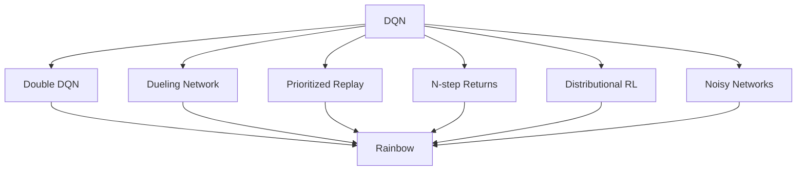

# 4.4 DQN 改进家族

在上一节中，我们用 `LunarLander-v3` 观察了一个完整的 DQN 训练过程。
这个实验说明了两件事：第一，经验回放和目标网络确实可以让神经网络版的 Q-Learning 学起来；
第二，即使在低维控制任务中，评估曲线仍然会波动，某些 episode 仍然会失败。

这并不是偶然现象。原始 DQN 把 Q-Learning、神经网络、经验回放和目标网络组合在一起，
但它仍然保留了若干结构性问题。
例如，TD 目标中的最大值运算会倾向于选择被高估的动作；
直接输出每个动作的 Q 值会让网络难以单独利用“状态本身好坏”的信息；
均匀采样经验会把同样的更新预算分给重要样本和普通样本。

本节介绍 DQN 之后最常见的几类改进。
这些方法并不改变“学习动作价值函数”这一基本目标，
而是在 TD 目标、网络结构、回放采样和探索方式上分别修改原始 DQN。
理解这些改进有助于我们判断：
当一个 DQN 实验表现不稳定时，问题究竟来自价值估计、函数结构、数据利用，还是探索不足。

## Double DQN

回忆原始 DQN 的 TD 目标。给定一条经验
$(s,a,r,s',d)$，其中 $d$ 表示下一状态是否终止，
DQN 使用目标网络 $Q(\cdot,\cdot;\theta^-)$ 计算

$$
y = r + \gamma (1-d)\max_{a'} Q(s',a';\theta^-).
$$

这里的最大值运算同时承担了两个角色：
它既选择下一状态中看起来最好的动作，
又使用同一组估计值给这个动作打分。
如果所有动作的估计都带有噪声，
那么最大值更容易选中被噪声推高的动作。
因此，即使每个单独的 Q 值估计在平均意义下没有偏差，
$\max$ 之后的估计也可能偏高。
形式上，由于最大值是凸函数，通常有

$$
\mathbb{E}\left[\max_a \hat{Q}(s,a)\right]
\geq
\max_a \mathbb{E}\left[\hat{Q}(s,a)\right].
$$

Double DQN 的做法是把“选择动作”和“评估动作”分开。
它先用当前网络选择动作

$$
a^\ast = \arg\max_{a'} Q(s',a';\theta),
$$

再用目标网络评价这个动作：

$$
y_{\text{Double}}
=
r + \gamma(1-d) Q(s',a^\ast;\theta^-).
$$

与原始 DQN 相比，变化只发生在 TD 目标中。
当前网络 $\theta$ 决定哪个动作最好，
目标网络 $\theta^-$ 只负责给这个动作赋值。
两个网络的误差不再通过同一个最大值运算直接叠加，
Q 值过估计因此得到缓解。

在代码中，这个变化通常只需要几行：

```python
with torch.no_grad():
    best_actions = q_net(next_states).argmax(dim=1)
    next_q = target_net(next_states)
    next_q_selected = next_q.gather(1, best_actions[:, None]).squeeze(1)
    target = rewards + gamma * (1 - dones) * next_q_selected
```

Double DQN 的重要性在于它没有引入新的网络结构，
也没有改变回放池的组织方式，
却直接修正了原始 DQN 中最常见的估计偏差之一。
因此，许多后续实现会默认把 Double DQN 作为 DQN 的基本版本。

## Dueling DQN

原始 DQN 直接让网络输出每个动作的动作价值 $Q(s,a)$。
这种做法在动作数量不大时很自然，
但它没有显式区分两个问题：
一个状态本身是否有利，
以及在这个状态下不同动作之间相差多少。

在第 3 章中，我们已经区分过状态价值 $V(s)$ 和动作价值 $Q(s,a)$。
如果用优势函数 $A(s,a)$ 表示动作 $a$ 相对于该状态平均水平的额外价值，
可以写成

$$
Q(s,a)=V(s)+A(s,a).
$$

然而这个分解本身并不唯一。
如果给 $V(s)$ 加上一个常数，同时给所有 $A(s,a)$ 减去同一个常数，
相加得到的 $Q(s,a)$ 不会变化。
因此，Dueling DQN 在合成 Q 值时减去优势函数的平均值：

$$
Q(s,a)
=
V(s)
+
A(s,a)
-
\frac{1}{|\mathcal{A}|}\sum_{a'\in\mathcal{A}} A(s,a').
$$

这里，$\mathcal{A}$ 是动作集合。
减去平均优势之后，所有动作优势的均值被固定为 0，
于是 $V(s)$ 主要表示状态本身的价值，
$A(s,a)$ 主要表示动作之间的相对差异。

在网络结构上，Dueling DQN 先共享一段特征提取网络，
然后分成两个分支：
一个分支输出标量 $V(s)$，
另一个分支输出每个动作的 $A(s,a)$。
最后再根据上式合成所有动作的 Q 值。

```python
features = backbone(states)

values = value_head(features)          # shape: [batch_size, 1]
advantages = advantage_head(features)  # shape: [batch_size, num_actions]
q_values = values + advantages - advantages.mean(dim=1, keepdim=True)
```

这种结构在很多动作差异不明显的状态中尤其有用。
例如在 LunarLander 中，
飞船离地面还很远时，
多个动作在短期内可能都不会立刻改变成败；
但状态本身的高度、速度和姿态已经决定了它大致处在有利还是危险的位置。
Dueling 结构让网络可以较早学习这类状态价值，
而不必完全依赖每个动作 Q 值的独立估计。

## 优先经验回放

标准经验回放从回放池中均匀采样。
设回放池中有 $N$ 条经验，
则每条经验被采到的概率都是 $1/N$。
这种做法简单且能打破时间相关性，
但它没有考虑不同样本对学习的贡献可能不同。

一种自然的衡量方式是 TD 误差。
对第 $i$ 条经验，记

$$
\delta_i = y_i - Q(s_i,a_i;\theta).
$$

如果 $|\delta_i|$ 很大，
说明当前网络对这条经验的预测和 TD 目标相差较远。
Prioritized Experience Replay（PER）据此给每条经验设置优先级

$$
p_i = |\delta_i| + \epsilon,
$$

其中 $\epsilon>0$ 防止优先级为 0。
采样概率定义为

$$
P(i)=\frac{p_i^\alpha}{\sum_k p_k^\alpha}.
$$

参数 $\alpha$ 控制优先采样的强度。
当 $\alpha=0$ 时，$P(i)$ 退化为均匀采样；
当 $\alpha=1$ 时，采样概率与优先级成正比。
实践中通常取介于二者之间的值，
使模型更常看到高 TD 误差样本，
同时仍然保留一定覆盖面。

不过，非均匀采样会改变训练数据的分布。
为了减小由此引入的偏差，
PER 使用重要性采样权重

$$
w_i = \left(\frac{1}{N P(i)}\right)^\beta,
$$

并常常将 $w_i$ 除以当前 batch 中的最大权重，使其数值稳定。
参数 $\beta$ 控制修正强度。
训练时，损失可以写成

$$
L(\theta)=\mathbb{E}_{i\sim P}\left[w_i\delta_i^2\right].
$$

因此，PER 同时包含两个步骤：
用 TD 误差决定哪些样本更常被采到，
再用重要性权重修正非均匀采样带来的偏差。
它改善的不是 Bellman 目标本身，
而是有限更新次数下经验的利用效率。

## 多步回报、分布式价值与参数噪声

Rainbow 之前还有几类常与 DQN 结合的改进。
它们分别从回报传播、价值表示和探索机制三个方向修改原始算法。

首先是 _n-step returns_。
原始 DQN 使用一步 TD 目标：

$$
y_t = r_t + \gamma \max_a Q(s_{t+1},a;\theta^-).
$$

一步目标方差较小，但奖励传播较慢。
如果使用 $n$ 步回报，则目标变为

$$
y_t^{(n)}
=
\sum_{k=0}^{n-1}\gamma^k r_{t+k}
+
\gamma^n \max_a Q(s_{t+n},a;\theta^-).
$$

这会把之后若干步的真实奖励直接纳入目标。
在奖励稀疏或延迟较长的任务中，
多步回报能让有用信号更快传播；
代价是目标的方差通常会增大。

其次是 _distributional RL_。
普通 DQN 学习的是动作价值的期望 $Q(s,a)$。
但同一个动作可能有多种结果：
有时收益很高，有时收益很低。
分布式价值方法不只估计期望，
而是估计回报随机变量 $Z(s,a)$ 的分布，
并满足分布形式的 Bellman 关系

$$
Z(s,a) \overset{D}{=} R + \gamma Z(S',A').
$$

这里的 $\overset{D}{=}$ 表示两个随机变量同分布。
在 C51 等实现中，回报分布被离散到若干固定支撑点上，
网络输出这些支撑点上的概率。
这样做能够保留更多关于风险和不确定性的结构信息。

第三类是 _Noisy Networks_。
epsilon-greedy 通过随机动作探索，
但这种随机性与状态和参数无关。
NoisyNet 把噪声加入网络参数，例如在线性层中使用

$$
W = \mu_W + \sigma_W \odot \epsilon_W.
$$

其中 $\mu_W$ 和 $\sigma_W$ 是可学习参数，
$\epsilon_W$ 是随机噪声，
$\odot$ 表示逐元素乘法。
由于噪声直接作用在参数上，
同一个噪声样本会在多个状态上形成一致的行为偏好，
因此比每一步独立随机动作更有结构。

这些方法解决的问题不同：
多步回报加快奖励传播，
分布式价值改变价值函数的表示对象，
参数噪声改进探索方式。
它们并不是互相替代的，
而是可以与 Double DQN、Dueling DQN 和 PER 一起组合。

## Rainbow

Rainbow 将多种 DQN 改进组合到一个统一算法中。
它通常包括以下六个组成部分：
Double DQN、Dueling 网络、优先经验回放、多步回报、分布式价值学习和 Noisy Networks。



这类组合方法的意义不在于某一个组件单独解决了所有问题，
而在于不同组件的误差来源不同。
Double DQN 主要缓解最大值带来的过估计；
Dueling 网络改进函数结构；
PER 提高样本利用效率；
多步回报改变奖励传播速度；
分布式价值保留回报分布信息；
Noisy Networks 改进探索。

在 Atari 这类视觉游戏任务中，
这些问题往往同时存在：
状态是高维像素，奖励可能延迟，
动作价值估计有噪声，
随机探索又很难覆盖关键状态。
因此，把多个改进组合起来通常比只使用其中一个更有效。
不过，组合也意味着更多超参数和更复杂的实现。
在教学和调试中，仍然应该先理解每个组件解决的问题，
再决定是否需要引入完整 Rainbow。

## 探索与内在奖励

前面的改进主要关注如何更好地学习价值函数。
但是，如果智能体从未访问过关键状态，
再准确的价值估计也无法从缺失的数据中学习。
这就是探索问题。

epsilon-greedy 是最简单的探索方式：
以概率 $\epsilon$ 随机选择动作，
以概率 $1-\epsilon$ 选择当前 Q 值最大的动作。
它的优点是简单，
缺点是随机动作并不知道哪些状态新、哪些状态重要。

一种改进思路是给智能体添加*内在奖励*（intrinsic reward）。
外在奖励来自环境，
内在奖励来自智能体自身对新状态或不可预测状态的判断。
总奖励常写成

$$
r_t^{\text{total}}
=
r_t^{\text{extrinsic}}
+
\beta r_t^{\text{intrinsic}},
$$

其中 $\beta$ 控制内在奖励的权重。

ICM 使用预测误差构造内在奖励。
设 $\phi(s)$ 是状态的特征表示，
正向模型根据 $\phi(s_t)$ 和动作 $a_t$
预测下一状态特征 $\hat{\phi}(s_{t+1})$。
内在奖励可以定义为

$$
r_t^{\text{intrinsic}}
=
\left\|
\phi(s_{t+1})-\hat{\phi}(s_{t+1})
\right\|^2.
$$

如果某个状态转移难以预测，
预测误差就大，
智能体会更倾向于探索这类区域。
ICM 同时使用逆向模型从 $\phi(s_t)$ 和 $\phi(s_{t+1})$
预测动作 $a_t$，
以鼓励特征表示关注与动作有关的变化。

RND 使用更简单的构造。
它固定一个随机初始化的目标网络 $f^\ast$，
并训练预测网络 $f_\theta$ 去拟合它。
对状态 $s_t$，内在奖励为

$$
r_t^{\text{intrinsic}}
=
\left\|f_\theta(s_t)-f^\ast(s_t)\right\|^2.
$$

已经频繁访问的状态会被预测网络逐渐拟合，
预测误差下降；
新状态的误差较大，
因而得到更高内在奖励。
这类方法在稀疏奖励任务中尤其有用，
但也可能被不可控噪声吸引。
因此，内在奖励通常需要归一化、衰减，或与外在奖励配合使用。

## 本节小结

- 原始 DQN 的 TD 目标使用最大值运算，容易产生 Q 值过估计。
- Double DQN 将动作选择和动作评估分开，从而缓解最大值带来的偏差。
- Dueling DQN 将 $Q(s,a)$ 分解为状态价值 $V(s)$ 和优势函数 $A(s,a)$，使网络能够单独学习状态本身的价值。
- 优先经验回放使用 TD 误差决定采样概率，并用重要性采样权重修正非均匀采样偏差。
- 多步回报、分布式价值学习和参数噪声分别改善奖励传播、价值表示和探索方式。
- Rainbow 将多种 DQN 改进组合起来，但组合算法更复杂，调试时仍应理解每个组件的作用。
- 内在奖励方法把探索目标显式写进奖励中，适合奖励稀疏、随机探索难以发现关键状态的任务。

下一节将把 DQN 从低维向量状态推进到像素输入。
在 Atari 中，算法的基本目标仍然是学习动作价值函数，
但状态表示、环境 wrapper、帧堆叠和卷积网络会成为新的关键问题。
[动手：视觉游戏项目](./visual-game-projects)

## 练习

1. 在一个有 4 个动作的状态中，假设真实 Q 值都等于 0，但估计误差分别为 $0.1,-0.2,0.4,-0.1$。原始 DQN 的最大值目标会选择哪个动作？为什么这会产生过估计？
2. 将 Double DQN 的 TD 目标写成两步：先定义 $a^\ast$，再定义 $y_{\text{Double}}$。这两步分别由哪个网络完成？
3. 在 Dueling DQN 中，为什么不能直接使用 $Q(s,a)=V(s)+A(s,a)$？减去优势均值解决了什么问题？
4. 如果 PER 中 $\alpha=0$，采样会退化为什么情况？如果 $\beta=0$，重要性采样修正又会发生什么变化？
5. 多步回报和一步回报相比，分别可能增加什么优点和风险？
6. 在 LunarLander 中，哪些失败更可能通过 Double DQN 改善，哪些失败更可能需要更好的探索或更长训练？

## 参考文献

[^1]: Mnih, V., et al. (2015). Human-level control through deep reinforcement learning. _Nature_, 518(7540), 529-533.

[^2]: van Hasselt, H., Guez, A., & Silver, D. (2016). Deep Reinforcement Learning with Double Q-learning. _AAAI_.

[^3]: Wang, Z., et al. (2016). Dueling Network Architectures for Deep Reinforcement Learning. _ICML_.

[^4]: Schaul, T., et al. (2016). Prioritized Experience Replay. _ICLR_.

[^5]: Hessel, M., et al. (2018). Rainbow: Combining Improvements in Deep Reinforcement Learning. _AAAI_.

[^6]: Pathak, D. et al. (2017). Curiosity-driven Exploration by Self-supervised Prediction. _ICML_.

[^7]: Burda, Y. et al. (2019). Exploration by Random Network Distillation. _ICLR_.
