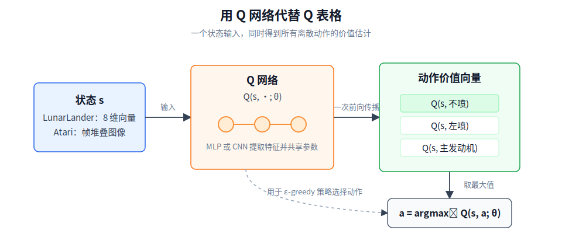
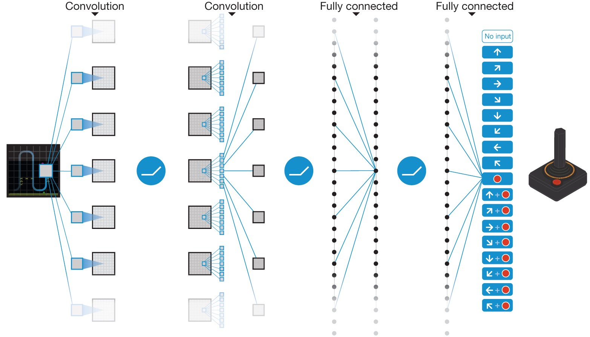
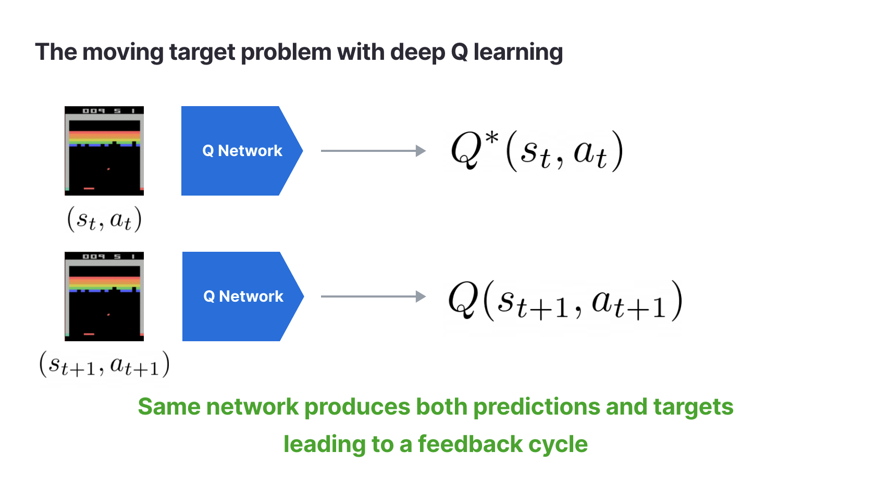

# 4.1 DQN 的必要性 与 Q 表格的局限与神经网络的替代

## 本节导读

**核心内容**

- 回顾 Q-Learning 如何用 TD 目标修正一张动作价值表。
- 理解 Q 表为什么依赖“状态可以枚举”这个前提。
- 说明 DQN 为什么要用神经网络表示 $Q(s,a)$，以及直接替换表格后会遇到哪些稳定性问题。

**核心公式**

$$
Q(s, a) \leftarrow Q(s, a) + \alpha \left[ r + \gamma \max_{a'} Q(s', a') - Q(s, a) \right] \quad \text{（Q-Learning 更新规则：用一步经验修正 Q 值）}
$$

> **Q-Learning 更新规则 (Q-Learning Update Rule)：**
>
> - $Q(s,a)$：表中当前状态-动作对的旧估计。
> - $r+\gamma\max_{a'}Q(s',a')$：这次经验构造出的 TD 目标，由即时奖励和下一状态的最优动作价值组成。
> - $\alpha$：学习率，决定旧估计向 TD 目标移动多少。

$$
\text{TD Target} = r + \gamma \max_{a'} Q(s', a') \quad \text{（TD 目标：根据实际奖励与未来估计给出的"应得分"）}
$$

> **TD Target (时序差分目标)：**
>
> - $r$：这一步真实观察到的即时奖励。
> - $\gamma\max_{a'}Q(s',a')$：从下一状态 $s'$ 出发，按当前表格估计的最优未来价值。
> - 两部分相加，给出这次更新中 $Q(s,a)$ 应该靠近的目标值。

$$
\delta = \text{TD Target} - Q(s, a) \quad \text{（TD Error：预测和目标之间的差距，学习的核心信号）}
$$

> **TD Error (时序差分误差)：**
>
> - $\delta>0$：旧估计低于目标，需要上调。
> - $\delta<0$：旧估计高于目标，需要下调。
> - $\delta=0$：旧估计已经与这次目标一致。

## Q-Learning 回顾

第 3 章已经介绍过动作价值函数 $Q(s,a)$ 和 Q-Learning。现在我们把注意力放回它的实现形式：在表格版本中，算法为每个状态-动作对保存一个当前估计，并用每一步经验逐步修正这张表。

把第 3.5 节的更新规则重新写出来：

$$Q(s, a) \leftarrow Q(s, a) + \alpha \left[ r + \gamma \max_{a'} Q(s', a') - Q(s, a) \right]$$

这行公式可以读成“用一次新经验修正表中一个旧数字”。先构造这次更新的目标：

$$
\text{TD Target}=r+\gamma\max_{a'}Q(s',a').
$$

它由两部分组成：这一步真实拿到的奖励 $r$，以及下一状态 $s'$ 中当前看起来最好的未来价值。再用这个目标减去表格里的旧估计：

$$
\delta=\text{TD Target}-Q(s,a).
$$

这个差值就是 TD Error。最后，算法不是直接覆盖旧值，而是让 $Q(s,a)$ 按学习率 $\alpha$ 向目标移动一小步。这样写的好处是，更新既能利用最新经验，又不会被某一次随机结果完全带走。

初始时整张表可以全是 0。智能体每走一步，只更新表中的一个状态-动作格子。随着交互次数增加，靠近终点的动作先得到更准确的估计；这些估计又通过 TD 目标中的 $\max_{a'}Q(s',a')$ 向前传播。最后，策略并不是被手工写出来的，而是从这张表中逐渐显现出来的：在每个状态选择 Q 值最大的动作。

这个过程之所以可行，依赖一个前提：**表格必须装得下所有状态-动作对。** 每一步更新都要读 $Q(s,a)$，还要在下一状态中比较所有 $Q(s',a')$。在这种小型 GridWorld 中，这只是几十个数字；但如果状态不再能枚举，问题就变了。

## 表格的边界

Q 表既是 Q-Learning 的记忆，也是它的限制。只要所有状态-动作对都能列出来，查表、更新、取最大值都很直接。一旦状态无法列成有限行，“为每一格单独存一个数”的实现方式就不再成立。

我们先看离散状态的情况。猜硬币只有 2 个状态，Q 表 4 行。井字棋约 $3^9 \approx 20{,}000$ 个局面，勉强还能建表。国际象棋约有 $10^{47}$ 种合法局面——已经超过了地球上所有计算机的存储总和。围棋约 $3^{361} \approx 10^{170}$ 种局面，而可观测宇宙中的原子总数也不过 $\sim 10^{80}$ 个。

这些例子虽然巨大，但至少仍然是离散状态：理论上每个局面都可以命名。真正的分水岭出现在连续状态。

LunarLander 的状态是 8 维向量，包括位置、速度、角度、角速度和两条支架是否接触地面。其中前 6 个维度是连续实数。只要其中一个维度可以在某个区间内取任意实数，例如 $x\in[-1,1]$，那么这个维度本身就已经包含无穷多个可能取值；6 个连续维度组合在一起，状态集合当然也是无穷的。

实际实现中，我们也可以强行离散化。比如把这 6 个连续维度各切成 50 个格子，状态总数就是 $50^6 \approx 1.56 \times 10^{10}$；再乘上 4 个动作，就是数百亿个状态-动作格子。这还只是一个低维控制任务。

Atari 游戏更明显。标准预处理后的输入是 4 帧堆叠的 $84 \times 84$ 灰度图，共 28224 个像素值，每个像素 256 种取值。可能的状态数为 $256^{28224}$。这个数字的意义不在于精确计数，而在于说明：像素输入已经不可能被当成一张可枚举的状态表来处理。

这就是强化学习中的**维度灾难**（curse of dimensionality）。需要特别区分的是：Q-Learning 的 TD 思想没有因此失效，失效的是“用表格逐格存储 $Q(s,a)$”这个表示方式。状态空间越大，表格方法越难利用相似状态之间的关系；连续状态和像素状态则直接让建表这件事失去意义。

接下来要做的，不是放弃 Q-Learning，而是换一种表示 $Q(s,a)$ 的方法。

## 函数逼近

上一节我们已经看到，表格方法卡住的地方不在 TD 更新本身，而在“Q 值必须按状态逐行存储”这个实现前提。现在要解决的问题可以说得更具体一些：**如果状态无法枚举，算法还怎样保存和更新动作价值？**

这正是**函数逼近**（function approximation）要处理的事情。它不是改变 Q-Learning 的目标，而是改变动作价值的表示方式：不再为每个状态-动作对单独存一个数字，而是用一个带参数的函数，在给定状态和动作时输出对应的价值估计。

先把第 3.4 节的“价值表”思想推广一步。状态价值表给每个状态存一个 $V(s)$；Q 表则给每个状态下的每个动作都存一个 $Q(s,a)$。因此，在一个离散、可枚举的小环境中，Q-Learning 维护的是一张“状态 × 动作”的表：

| 状态  | 不喷  | 左喷  | 主发动机 | 右喷 |
| ----- | ----- | ----- | -------- | ---- |
| $s_1$ | 0.10  | 0.05  | 0.40     | 0.00 |
| $s_2$ | -0.20 | 0.15  | 0.30     | 0.10 |
| $s_3$ | 0.00  | -0.10 | 0.20     | 0.05 |

这张表的读法与前面几节完全一致。状态 $s_2$ 对应第二行，这一行就是当前状态下所有动作的价值估计：

$$
Q(s_2,\cdot)=[-0.20,\ 0.15,\ 0.30,\ 0.10].
$$

如果用贪心策略选动作，就比较这一行里的四个数，选择最大值对应的动作。之后，智能体执行动作并得到一条转移 $(s,a,r,s')$，Q-Learning 根据 TD 误差更新表中对应的格子 $Q(s,a)$。在表格表示中，每个状态-动作对都有独立位置，所以这一步更新不会直接改动其他格子。

真正的问题在于，这种表示依赖一个强前提：状态必须能被写成表中的某一行。LunarLander 的状态是 8 个连续数，Atari 的状态是像素帧，它们都不是可以提前列完的行号。此时，问题不再是“这一行里的数怎么更新”，而是“这一行本身从哪里来”。

函数逼近给出的回答是：不要显式保存所有行，而是学习一个函数来生成这些行。写成符号，就是用参数 $\theta$ 表示一个近似的动作价值函数：

$$
Q(s,\cdot;\theta)
=[Q(s,a_1;\theta),Q(s,a_2;\theta),\ldots,Q(s,a_m;\theta)].
$$

这行公式可以按下面的方式读：

| 符号                | 含义                                                       |
| ------------------- | ---------------------------------------------------------- |
| $s$                 | 当前状态，例如 LunarLander 的 8 维状态向量。               |
| $a_i$               | 第 $i$ 个可选动作。                                        |
| $\theta$            | 函数的参数，在 DQN 中就是神经网络参数。                    |
| $Q(s,a_i;\theta)$   | 在参数 $\theta$ 下，对状态 $s$ 执行动作 $a_i$ 的价值估计。 |
| $Q(s,\cdot;\theta)$ | 一次输入状态 $s$ 后，得到所有动作的 Q 值向量。             |

这一步的含义是：原来 Q 表中需要查出的“一行”，现在由函数即时计算出来。对于 LunarLander，输入可以是

$$
s=[x,y,\dot{x},\dot{y},\theta,\dot{\theta},c_L,c_R]
$$

塞进网络，得到 4 个动作的价值估计：

$$
Q(s,\cdot;\theta)
=[Q(s,\text{不喷}),Q(s,\text{左喷}),Q(s,\text{主发动机}),Q(s,\text{右喷})].
$$

因此，函数逼近替换的不是 Q-Learning 的贝尔曼目标，而是 Q 值的存储方式。表格方法存的是 $|S|\times|A|$ 个独立数字；函数逼近存的是一组共享参数 $\theta$。参数共享带来一个重要效果：在某个状态附近学到的价值结构，会影响到相似状态的预测。这就是函数逼近的泛化能力，也是 DQN 能从连续状态和像素输入中学习的基础。

用函数逼近来做强化学习并不是新想法。Sutton 在 1988 年的 TD($\lambda$) 论文中已经讨论了用神经网络作为函数逼近器 [^sutton1988]。1990 年代，Lin [^lin1993] 和 Rummery & Niranjan [^rummery1994] 先后尝试把神经网络和 Q-Learning 结合。但这些早期尝试只能在极小的问题上工作——受限于当时的计算能力、训练稳定性，以及缺乏像 Atari 这样统一且可以大量快速交互的基准环境，它们始终未能证明自己。

真正的突破要等到 2013 年。DeepMind 的 Mnih 等人将函数逼近的思想直接搬到 Q-Learning 上，用神经网络近似 $Q^*(s, a)$：

$$Q(s, a; \theta) \approx Q^*(s, a)$$

这就是**深度 Q 网络**（Deep Q-Network, DQN），名字里的 “Deep” 指的是深度神经网络 [^mnih2013]。

DQN 的架构因此也很直接：网络接收状态 $s$ 作为输入，同时输出所有可能动作的 Q 值——一个输入，多个输出。在 LunarLander 中，输入是 8 维向量，输出是 4 个 Q 值；在 Atari 中，输入是 $84 \times 84 \times 4$ 的像素帧，输出维度等于游戏的动作数。

归结起来，DQN 的第一步是：**保留 Q-Learning 的更新思想，但把“按状态逐行存储的 Q 表”换成“共享参数的函数 $Q(s,\cdot;\theta)$”。** 2015 年，这篇论文正式发表在 Nature 上，标志着深度强化学习时代的开端 [^mnih2015]。

## 直接替换为什么仍然会崩溃

到这里，我们只解决了“表格装不下”的问题。下一步很自然：既然神经网络可以输出 $Q(s,\cdot;\theta)$，那能不能把 Q-Learning 公式里的表格值全部换成网络输出，然后直接训练？

这个想法是 DQN 的起点，但还不是完整答案。直接替换会暴露两个训练问题：样本高度相关，目标也会跟着网络一起移动。

先看**样本相关**。在 Atari 游戏中，相邻帧通常非常相似。以 Pong 为例，标准预处理后的画面是 $84 \times 84$ 个像素，相邻两帧可能只差球或球拍移动的一小块区域。如果按时间顺序把最近几十帧直接组成一个 batch，模型看到的并不是几十个独立场景，而是同一个场景的连续微小变化。

这会削弱随机梯度下降的效果。一个 batch 名义上有很多样本，但如果它们来自同一段连续轨迹，梯度方向就会被最近经历主导。于是网络很容易围着当前局面调整参数，而不是学习对更广泛状态都有效的价值估计。这个问题指向 DQN 的第一个稳定化组件：训练数据不能只来自最近几步，而要从更大的经验集合中随机取样。

再看**目标移动**。Q-Learning 的 TD 目标是

$$
r+\gamma\max_{a'}Q(s',a').
$$

在表格方法中，更新 $Q(s,a)$ 通常只改一个格子。但在神经网络中，所有 Q 值都由同一组参数 $\theta$ 计算。一次梯度更新不只会改变 $Q(s,a;\theta)$，也可能改变 $Q(s',a';\theta)$。也就是说，网络一边学习当前预测，一边改变下一次要追的目标。

看一个极简例子。假设只有 2 个状态和 2 个动作，$\gamma=0.99$。当前网络输出为：

$$Q_\theta: \quad Q(s_1, a_1)=2.0,\; Q(s_1, a_2)=5.0,\; Q(s_2, a_1)=3.0,\; Q(s_2, a_2)=8.0$$

现在来了一条经验 $(s_1,a_2,r=+1,s_2)$，TD 目标为：

$$\text{TD Target} = r + \gamma \max_{a'} Q_\theta(s_2, a') = 1 + 0.99 \times 8.0 = 8.92$$

这次更新会把 $Q_\theta(s_1,a_2)$ 往 8.92 的方向推。问题在于，参数更新后，其他输出也可能一起变化。假设更新后网络变成：

$$Q_{\theta'}: \quad Q(s_1, a_1)=2.3,\; Q(s_1, a_2)=6.5,\; Q(s_2, a_1)=2.7,\; Q(s_2, a_2)={\color{red}6.3}$$

注意 $Q(s_2,a_2)$：它原本是 8.0，现在变成 6.3。下一次再用 $s_2$ 计算 TD 目标时，目标中的未来价值就已经变了。表格方法里，改 $Q(s_1,a_2)$ 不会直接改 $Q(s_2,a_2)$；神经网络中，参数共享使这种连带变化成为常态。

因此，直接把神经网络套到 Q-Learning 上，至少会遇到两个不稳定来源：训练样本来自连续轨迹，容易相关；TD 目标又依赖正在变化的网络，容易移动。DQN 真正要解决的，不只是“用网络代替表格”，还包括让这个替代后的训练过程稳定下来。

这也是 DeepMind DQN 的关键贡献。他们并不是第一次想到用神经网络近似 Q 函数；关键在于把问题拆成三个组件：用 **Q 网络**替代表格，用**经验回放**打散样本相关性，用**目标网络**减缓 TD 目标移动。换句话说，本节解释了“为什么需要 DQN”，下一节要拆开看“DQN 怎样组织这些组件”。

思考题：1990 年代就有人尝试神经网络 Q-Learning，为什么直到 2013 年才成功？

至少有三个原因。第一，算力条件不同：1990 年代很难在像素级输入上训练深度网络。第二，训练稳定化技术还不成熟：没有经验回放和目标网络，神经网络版 Q-Learning 很容易发散。第三，基准环境不同：Atari 模拟器（Arcade Learning Environment）提供了统一、可重复、可大量交互的评测任务，使这类方法终于能被系统检验。

接下来，我们逐项拆解 DQN 的三个核心组件：[Q 网络、经验回放和目标网络](./dqn-components)。

## 参考文献

[^sutton1988]: Sutton, R. S. (1988). Learning to predict by the methods of temporal differences. _Machine Learning_, 3(1), 9-44.

[^lin1993]: Lin, L.-J. (1993). _Reinforcement learning for robots using neural networks_. PhD thesis, Carnegie Mellon University.

[^rummery1994]: Rummery, G. A., & Niranjan, M. (1994). _On-line Q-learning using connectionist systems_. Technical Report CUED/F-INFENG/TR 166, Cambridge University.

[^mnih2013]: Mnih, V., et al. (2013). Playing Atari with deep reinforcement learning. _arXiv preprint_, arXiv:1312.5602.

[^mnih2015]: Mnih, V., et al. (2015). Human-level control through deep reinforcement learning. _Nature_, 518(7540), 529-533.
