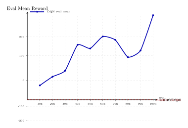
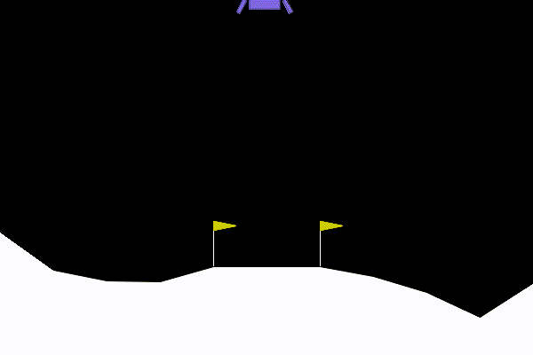

# 4.3 动手 与 LunarLander 实战

> **本节目标**：从一个可复现实验开始，训练 DQN 控制 `LunarLander-v3`，并用评估曲线、回放 GIF 和失败诊断判断策略到底学到了什么。

> **本节代码**：[dqn_gym_sb3.py](https://github.com/walkinglabs/hands-on-modern-rl/blob/main/code/chapter07_dqn/dqn_gym_sb3.py) · [export_dqn_curves.py](https://github.com/walkinglabs/hands-on-modern-rl/blob/main/code/chapter07_dqn/export_dqn_curves.py) · [render_lunarlander_split.py](https://github.com/walkinglabs/hands-on-modern-rl/blob/main/code/chapter07_dqn/render_lunarlander_split.py) · [requirements.txt](https://github.com/walkinglabs/hands-on-modern-rl/blob/main/code/chapter07_dqn/requirements.txt)

## 4.3.1 运行 LunarLander 训练

前面几节已经解释了 DQN 的三个关键部件：用神经网络表示 Q 函数，用经验回放打散样本相关性，用目标网络稳定更新目标。现在先不继续增加概念，而是把这些部件放进一个完整任务里跑一遍。

LunarLander 的任务很直观：飞船从空中下降，智能体要通过主发动机和左右姿态喷口，让它尽量平稳地落在两个旗帜之间。它比 CartPole 更接近真实控制问题，因为智能体不仅要“活得久”，还要同时控制位置、速度、角度、燃料消耗和落地方式。


<div style="text-align: center; font-size: 0.9em; color: var(--vp-c-text-2); margin-top: -10px; margin-bottom: 20px;">
  <em>图 4.3-1：LunarLander 的目标不是让飞船随便落到地面，而是控制它在落地区域内平稳接触地面。</em>
</div>

这个实验在普通 CPU 上即可运行。它比 CartPole 慢一些，因为 Box2D 物理环境和 DQN 回放池都会带来额外开销；但 100k 环境步通常仍然属于课堂练习可以接受的规模。若只是检查脚本是否能跑通，可以把 `--total-timesteps` 临时改小；若要观察较稳定的学习趋势，应以 100k 甚至更长训练为准。

首先安装本章依赖：

```bash
pip install -r code/chapter07_dqn/requirements.txt
```

然后运行 LunarLander 训练：

```bash
python code/chapter07_dqn/dqn_gym_sb3.py \
  --env-id LunarLander-v3 \
  --total-timesteps 100000 \
  --learning-rate 0.0005 \
  --buffer-size 100000 \
  --learning-starts 1000 \
  --batch-size 64 \
  --target-update-interval 1000 \
  --exploration-fraction 0.4 \
  --exploration-final-eps 0.05 \
  --eval-freq 10000 \
  --eval-episodes 5 \
  --checkpoint-freq 25000 \
  --log-dir output/dqn_gym_runs \
  --no-swanlab
```

这里的训练目标不是让 loss 变小，而是让确定性评估回报逐步脱离随机策略基线。训练过程中，脚本会每隔 `10000` 个环境步评估一次策略，每次评估 `5` 局，并把模型、评估 CSV 和曲线图写入 `output/dqn_gym_runs/LunarLander-v3/`。

运行结束后，最重要的产物有三个：

| 文件或目录              | 含义                      | 主要用途                   |
| ----------------------- | ------------------------- | -------------------------- |
| `final_model.zip`       | 训练结束时保存的 DQN 模型 | 后续渲染回放或继续评估     |
| `eval/eval_metrics.csv` | 周期性评估结果            | 判断回报是否持续改善       |
| `eval/eval_curve.png`   | 脚本自动生成的评估曲线    | 快速查看训练趋势           |
| `checkpoints/`          | 中间模型                  | 比较不同训练阶段的策略变化 |

如果希望在 TensorBoard 中查看训练指标，可以运行：

```bash
tensorboard --logdir output/dqn_gym_runs/LunarLander-v3/tb
```

如果希望把本地评估 CSV 重新导出为讲义里的图片，可以运行：

```bash
python code/chapter07_dqn/export_dqn_curves.py --run lunarlander
```

这一步对应的是“看训练结果”的代码；后面渲染 GIF 用的是另一个脚本。

## 4.3.2 查看评估曲线与回放

训练完成后，先看曲线，再看回放。这个顺序很重要：曲线回答“平均上有没有变好”，回放回答“策略具体做了什么”。如果只看单个 GIF，很容易把某一局偶然成功或偶然失败误读成算法整体能力。

本节使用的 100k 步实验记录如下：

```text
timesteps  mean_reward  std_reward
10000       -225.79        23.73
20000       -124.22        11.11
30000        -82.83        31.28
40000         50.68       101.36
50000         25.80        79.58
60000        109.07       130.97
70000         85.07        41.98
80000        -45.77        12.47
90000         -6.32        12.60
100000       253.12        15.37
```



<div style="text-align: center; font-size: 0.9em; color: var(--vp-c-text-2); margin-top: -10px; margin-bottom: 20px;">
  <em>图 4.3-2：LunarLander-v3 DQN 评估曲线。曲线不单调，但整体已经明显脱离随机策略水平。</em>
</div>

曲线中的最后一次评估达到 `253.12`，说明这次训练确实学到了有效控制策略。训练结束后的独立评估为 `175.30 ± 64.79`，也说明策略还没有达到“每局都稳定高分”的程度。读这类曲线时，不应只看最后一点，而要同时看均值、波动和回放。

重新渲染回放可以使用：

```bash
python code/chapter07_dqn/render_lunarlander_split.py \
  --model output/dqn_gym_runs/LunarLander-v3/final_model.zip \
  --output-dir output/lunarlander_episodes \
  --episodes 3 \
  --seeds 9 10019 171 \
  --max-steps 1000 \
  --max-frames 150 \
  --fps 30
```

这个脚本会加载训练好的 `final_model.zip`，在指定 seed 下用确定性策略运行环境，并把每局保存成独立 GIF。`--max-steps 1000` 限制环境最多运行 1000 步，`--max-frames 150` 只限制保存到 GIF 的帧数。也就是说，讲义中的动图会被压到 150 帧以内，但括号中的步数仍然记录原始 episode 的真实环境步数。

## 4.3.3 成功降落的判定标准

在解释回放之前，必须先说清楚成功标准。LunarLander 的目标不是“飞船最后碰到地面”这么简单，而是在两个旗帜之间平稳着陆。一个高质量降落通常同时满足几件事：

- 飞船接近落地区域中心，而不是飘到边缘或飞出画面。
- 水平速度和垂直速度足够小，接触地面时不是硬砸下去。
- 机身角度接近竖直，角速度不会继续放大。
- 两条支架正常接触地面，而不是机身或单侧支架先撞上。
- 回合正常终止为着陆，而不是坠毁、飞出区域或超时截断。

单局回报超过 `200` 通常可以看作一次高质量成功降落；`100` 到 `200` 表示策略大体有效，但动作效率、燃料消耗或稳定性还有问题；明显低于 `100` 往往意味着落点、速度、姿态或终止方式出了问题。环境层面的“解决”不能靠单局判断，通常要看多局平均回报是否稳定超过 `200`。

奖励不是只看最后一帧。Gymnasium 的 LunarLander 会综合位置、速度、角度、支架接触、燃料消耗和终止方式。姿态当然重要，机身倾斜会受到惩罚；但最终总回报是整局轨迹的累计结果。如果飞船在大部分时间里逐步接近目标、降低速度，并最终没有坠毁，即使中间有几次不漂亮的修正，也可能得到中等正回报。反过来，如果姿态失控导致飘离落地区域或硬着陆，低分就不是来自某一个扣分项，而是多个因素共同作用的结果。

先用随机策略建立参照。下面这段代码不训练模型，只让智能体随机选择动作：

```python
import gymnasium as gym
import numpy as np

env = gym.make("LunarLander-v3")
rng = np.random.default_rng(0)

returns = []
for ep in range(50):
    obs, _ = env.reset(seed=ep)
    total_reward = 0.0
    for step in range(1000):
        action = int(rng.integers(env.action_space.n))
        obs, reward, terminated, truncated, _ = env.step(action)
        total_reward += reward
        if terminated or truncated:
            break
    returns.append(total_reward)

print(f"随机策略平均回报: {np.mean(returns):.1f}")
print(f"最好一轮: {np.max(returns):.1f}")
print(f"最差一轮: {np.min(returns):.1f}")
```

一次运行的结果为：

```text
随机策略平均回报: -210.2
最好一轮: 8.3
最差一轮: -460.8
```

这个基线告诉我们：如果 DQN 的评估回报仍然长期停在 `-200` 附近，就不能说它学会了降落。只有当评估均值稳定离开随机水平，并在回放中表现出减速、修正姿态和接近落地区域的行为时，才说明策略正在形成。

## 4.3.4 典型回放 与 高分、中等与失败

现在回到三段回放。测试时应关闭探索，只按 Q 值最大的动作行动；否则评估结果会混入随机动作，无法判断网络本身学得如何。下面三段 GIF 来自同一个训练后的模型，但使用了不同的 reset seed，因此展示的是同一策略在不同初始扰动下的表现。

**Episode 1（回报 313.7，263 步）** 是高分成功降落。飞船较快进入可控下降状态，接近地面前把速度压住，最后在落地区域内接触地面。它的分数最高，主要来自落点、速度、姿态和终止方式都比较好。


**Episode 2（回报 173.2，676 步）** 是中等成功。飞船最终能够落下来，但过程更长，中间需要反复修正姿态和位置。它明显好于失败局，因为最后没有坠毁；但只有 100 多分，说明动作效率、燃料消耗和稳定性都不如高分样例。



**Episode 3（回报 5.9，104 步）** 是明显失败。飞船偏离稳定下降路径后没有恢复姿态，落地时两条支架没有形成正常接触，更接近“飘出去后坠毁/硬着陆”的失败，而不是悬停到最大步数超时。


这三段回放正好说明为什么不能只看一局。Episode 1 证明策略已经能完成高质量降落；Episode 2 说明同一策略仍可能用较长路径和较多修正完成中等质量降落；Episode 3 则提醒我们，训练到 100k 步并不代表策略对所有初始状态都稳定。把曲线和回放放在一起读，结论应当是：这次 DQN 已经明显学到 LunarLander 的控制规律，但还不是一个完全稳健的降落控制器。

## 4.3.5 状态、动作与训练波动

LunarLander 的状态是 8 维连续向量，动作是 4 个离散选择。8 个状态分量可以理解为：

| 分量        | 含义                   | 智能体需要判断的问题         |
| ----------- | ---------------------- | ---------------------------- |
| `x, y`      | 飞船相对落地区域的位置 | 离中心远不远，高度还有多少？ |
| `vx, vy`    | 水平和垂直速度         | 是否下降太快，是否横向飘移？ |
| `angle`     | 机身倾斜角             | 姿态是否偏离竖直方向？       |
| `angular`   | 角速度                 | 机身是否正在越转越快？       |
| `left_leg`  | 左支架是否接触地面     | 是否已经部分落地？           |
| `right_leg` | 右支架是否接触地面     | 是否两条支架都接触？         |

4 个动作分别是：不喷火、开左侧姿态喷口、开主发动机、开右侧姿态喷口。主发动机可以减小下降速度，但会消耗燃料，也可能把飞船重新推高；侧喷口可以修正角度，但方向和时机不对时会越调越偏。

因此，DQN 在这个任务中学到的不是一个单一规则，而是一组随状态变化的动作偏好。刚开始训练时，网络对 4 个动作的 Q 值几乎没有可靠含义，epsilon-greedy 会让智能体大量试错。越过 `learning_starts=1000` 后，回放池开始提供训练样本，网络逐渐学到一些粗糙规律：下降过快时主发动机更有价值，机身倾斜时侧喷口更有价值，接近地面时乱喷火可能反而降低回报。

曲线不单调，原因也在这里。DQN 的 Q 值估计会影响动作选择，动作选择又决定后续收集到的数据。某个阶段策略刚学会减速，可能下一阶段又因为过度使用主发动机而悬停或飘离；某个 checkpoint 在 5 局评估中表现很好，也不代表它对所有初始状态都稳定。强化学习里的“变好”往往不是平滑直线，而是在探索、回放和函数逼近之间来回震荡后逐步形成的趋势。

这也是经验回放和目标网络真正发挥作用的地方。经验回放让一次更新不只依赖最近几步轨迹，而是从不同降落阶段采样；目标网络让下一状态价值在一段时间内保持相对稳定，避免网络一边改预测、一边又用刚改过的自己制造目标。没有这两个机制，LunarLander 这种带有物理连续性的任务很容易被最近一段失败轨迹牵着走。

## 4.3.6 常见失败与调参顺序

如果训练结果不好，不要先怀疑 DQN “不能解决 LunarLander”。DQN 可以作为这个离散动作任务的有效基线，但它对实验设置很敏感。诊断时应按顺序检查。

第一，确认评估是否关闭探索。训练阶段需要 epsilon-greedy 试错，评估阶段则应使用确定性动作。如果评估还在随机探索，回报会被随机动作拉低，回放也会显得不稳定。

第二，确认训练是否已经越过 `learning_starts`。如果 `learning_starts=1000`，那么前 1000 步主要是在收集回放样本；如果设置成更大的数，早期模型可能几乎没有真正更新。短实验只能检查管线是否跑通，不能证明策略已经学会降落。

第三，确认评估局数是否足够。LunarLander 的初始状态有随机扰动，单局回报方差很大。评估 1 局只能看个例，评估 5 到 10 局才适合判断趋势；若要报告最终性能，应使用更多局数。

第四，再调整超参数。常见起点如下：

| 参数                     | 本节设置 | 如果不合适会怎样                                         |
| ------------------------ | -------- | -------------------------------------------------------- |
| `learning_rate`          | `0.0005` | 太大会让 Q 值震荡，太小会学得很慢                        |
| `buffer_size`            | `100000` | 太小容易被最近轨迹主导，太大则旧经验保留过久             |
| `learning_starts`        | `1000`   | 太早开始会从很少的失败样本中学习，太晚则短实验看不到更新 |
| `target_update_interval` | `1000`   | 太频繁会接近没有目标网络，太稀疏会让目标过旧             |
| `exploration_fraction`   | `0.4`    | 衰减太快会过早固化次优动作，太慢会长期随机乱喷           |
| `eval_episodes`          | `5`      | 太少会把偶然好坏误认为趋势                               |

还要注意最大步数。Gymnasium 的 LunarLander 一局通常最多运行到 `1000` 步；如果飞船一直没有正常终止，就会被截断。超时不是成功，最多只能说明策略没有及时完成任务。本节的失败样例不是这种情况：Episode 3 在 104 步结束，问题是偏离稳定下降路径后坠毁或硬着陆，而不是悬停到最大时长。

## 4.3.7 为什么选择 LunarLander

现在可以解释为什么本章把 LunarLander 放在 DQN 的第一个完整实战里。CartPole 太快满分，容易让人误以为 DQN 只要套上神经网络就稳定；MountainCar 奖励过于稀疏，最小 DQN 又容易长时间卡在失败区间；LunarLander 正好处在中间：状态仍然是低维向量，动作仍然离散，但奖励已经包含位置、速度、姿态、接触和终止方式等多种信号。

换句话说，LunarLander 不只是一个好看的游戏环境，而是一个合适的教学桥梁。它让我们看见 DQN 的组件不再是抽象名词：经验回放对应不同阶段的降落经验，目标网络对应相对稳定的学习目标，epsilon-greedy 对应早期对发动机和喷口动作的试错。

下一节会沿着这个问题继续往前走：既然普通 DQN 能学起来，但曲线仍然波动、Q 值仍可能过估计，研究者如何改进它？这就引出了 Double DQN、Dueling DQN、PER 和 Rainbow。[深度 Q 网络家族](./dqn-family)

## 本节小结

- `LunarLander-v3` 适合承接本章 DQN 实战：低维连续状态、离散动作、奖励结构比 CartPole 更丰富。
- 本节训练入口是 `code/chapter07_dqn/dqn_gym_sb3.py`，曲线导出用 `export_dqn_curves.py`，回放 GIF 用 `render_lunarlander_split.py`。
- 评估时要先看多局平均回报是否脱离随机基线，再用回放检查策略是否真的完成减速、修姿态和落地区域控制。
- 单局超过 `200` 通常代表高质量成功降落，`100` 到 `200` 多半是中等成功，明显低于 `100` 需要结合回放判断失败原因。
- LunarLander 的曲线波动是正常现象；判断训练是否有效，要同时看均值、方差、checkpoint 和不同 seed 下的回放。

## 参考文献

[^1]: Mnih, V., et al. (2015). Human-level control through deep reinforcement learning. _Nature_, 518(7540), 529-533.

[^2]: Raffin, A., et al. (2021). Stable-Baselines3: Reliable reinforcement learning implementations. _Journal of Machine Learning Research_, 22(268), 1-8.
