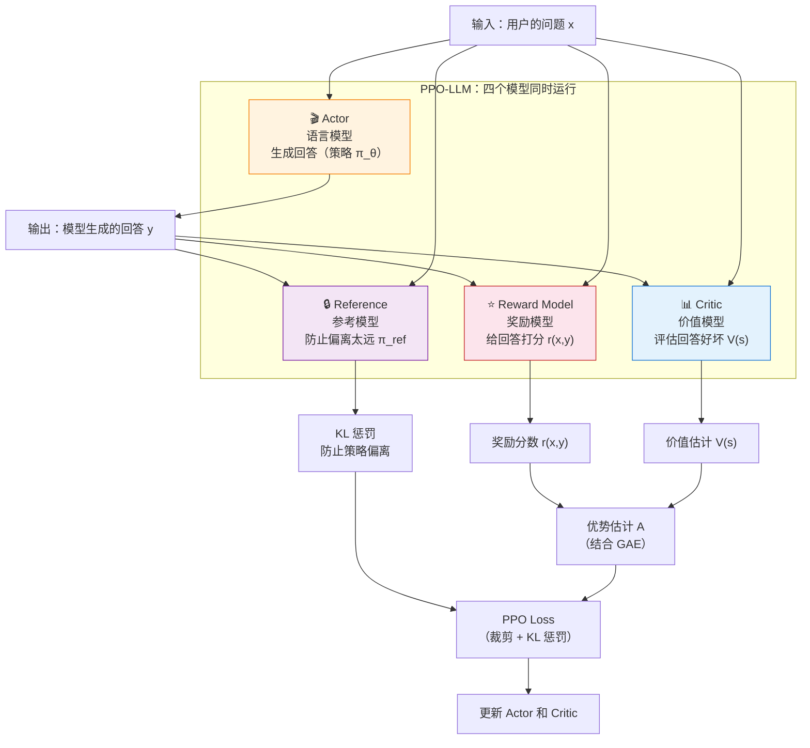

# 7.4 GAE、奖励模型与 LLM 对齐

上一节我们拆解了 PPO 的裁剪机制——一条用"裁剪"代替"KL 散度"的工程智慧。但 PPO 的目标函数里还有一个关键输入我们没展开：**优势函数 $A_t$**。怎么准确估计"这个动作比平均好了多少"？这就是 GAE（Generalized Advantage Estimation）要解决的问题。而在 LLM 场景下，PPO 还需要另一个更沉重的东西——**奖励模型（Reward Model）**。这一节我们把它们一起讲清楚。

## 优势估计的困境：TD vs MC

优势函数的定义是：

$$A(s_t, a_t) = Q(s_t, a_t) - V(s_t)$$

意思是"在这个状态下选择这个动作，比按策略的平均水平好了多少"。问题在于，$Q(s_t, a_t)$ 是未知的——我们没法精确知道"做了这个动作之后，未来到底能拿多少分"。我们只能估计。

有两种经典的估计方法，各有各的问题：

**时序差分（TD）估计**：只用一步的奖励来估计

$$A_t^{\text{TD}} = r_t + \gamma V(s_{t+1}) - V(s_t) = \delta_t$$

TD 只看一步——"刚才那一步比预期好了多少"。它的优点是方差低（只涉及一步的随机性），但偏差高——如果 Critic 的 $V(s_{t+1})$ 估计不准，误差会传播回来。这就像你用一把不准的尺子去量东西，虽然每次量的结果很稳定，但可能有系统偏差。

**蒙特卡洛（MC）估计**：跑完整个 episode 再回头看

$$A_t^{\text{MC}} = G_t - V(s_t) = \sum_{k=0}^{\infty} \gamma^k r_{t+k} - V(s_t)$$

MC 用了从时刻 $t$ 到结束的所有奖励，不依赖 Critic 的估计。它的优点是无偏（不依赖任何估计值），但方差极高——后续所有步骤的随机性都会影响 $G_t$。这就像你要评价一道菜好不好吃，但你的判断被之后所有的事情（服务好不好、结不结账、堵不堵车）干扰了。

## GAE：在偏差和方差之间平滑插值

2016 年，还是 Schulman，提出了 GAE——用一个参数 $\lambda$ 在 TD 和 MC 之间平滑插值：

$$\hat{A}_t^{\text{GAE}(\gamma, \lambda)} = \sum_{k=0}^{\infty} (\gamma \lambda)^k \delta_{t+k}$$

其中 $\delta_t = r_t + \gamma V(s_{t+1}) - V(s_t)$ 是 TD Error。让我们理解一下这个公式的含义：

- 当 $\lambda = 0$ 时：$\hat{A}_t = \delta_t$，退化为单步 TD（高偏差、低方差）
- 当 $\lambda = 1$ 时：$\hat{A}_t = \sum_{k=0}^{\infty} \gamma^k \delta_{t+k} = G_t - V(s_t)$，退化为 MC（无偏、高方差）
- 当 $0 < \lambda < 1$ 时：指数衰减的权重 $(\gamma \lambda)^k$ 让远处的 TD Error 贡献逐渐减小

展开来看，$\lambda = 0.95$ 时的优势估计长这样：

$$\hat{A}_t = \delta_t + 0.95\gamma \cdot \delta_{t+1} + (0.95\gamma)^2 \cdot \delta_{t+2} + (0.95\gamma)^3 \cdot \delta_{t+3} + \cdots$$

越远的步骤，权重衰减得越多。这就像你在写年终总结——最近的事情记得最清楚（权重最高），越久远的事情越模糊（权重越低），但它们都对最终评价有贡献。

| $\lambda$ 值 | 等价于 | 偏差 | 方差     | 适用场景                  |
| ------------ | ------ | ---- | -------- | ------------------------- |
| 0.0          | 纯 TD  | 高   | 低       | 数据稀疏、Critic 不准     |
| 0.9          | 偏 TD  | 中等 | 中等偏低 | 通用场景                  |
| 0.95         | 均衡   | 较低 | 中等     | **PPO 默认值**            |
| 0.99         | 偏 MC  | 低   | 较高     | Critic 准确、需要精细评估 |
| 1.0          | 纯 MC  | 无   | 高       | 短 episode、数据充足      |

实践中的默认值是 $\lambda = 0.95$ 或 $0.98$——偏向 MC 一侧，但用一点偏差来换取显著降低的方差。

```python
# ==========================================
# 手动实现 GAE 计算
# ==========================================
import numpy as np

def compute_gae(rewards, values, dones, gamma=0.99, lam=0.95):
    """
    计算 GAE（广义优势估计）

    参数:
        rewards: 每一步的即时奖励列表
        values: Critic 对每个状态的估计值 V(s)
        dones: 每一步是否结束
        gamma: 折扣因子
        lam: GAE 的 λ 参数

    返回:
        advantages: 每一步的优势估计
        returns: 每一步的目标回报（用于训练 Critic）
    """
    advantages = []
    gae = 0  # 累积的 GAE 值

    # 从后往前计算（因为 Â_t 依赖后续的 δ）
    for t in reversed(range(len(rewards))):
        if t == len(rewards) - 1:
            next_value = 0  # 最后一步的下一个状态价值为 0
        else:
            next_value = values[t + 1]

        # TD Error: δ_t = r_t + γ * V(s_{t+1}) - V(s_t)
        delta = rewards[t] + gamma * next_value * (1 - dones[t]) - values[t]

        # GAE 累积：Â_t = δ_t + γλ * δ_{t+1} + (γλ)² * δ_{t+2} + ...
        gae = delta + gamma * lam * (1 - dones[t]) * gae
        advantages.insert(0, gae)

    # 目标回报 = 优势 + 价值估计
    advantages = np.array(advantages)
    returns = advantages + np.array(values[:len(rewards)])

    return advantages, returns

# 示例：一个 5 步的 episode
rewards = [0.0, 0.0, 0.0, 0.0, 1.0]  # 只有最后一步有奖励
values  = [0.1, 0.2, 0.3, 0.5, 0.8]  # Critic 的估计值
dones   = [0,   0,   0,   0,   1  ]  # 只有最后一步结束

advantages, returns = compute_gae(rewards, values, dones)
print("优势估计:", advantages)
print("目标回报:", returns)
```

## 奖励模型：RLHF 的"人工裁判"

在游戏环境（CartPole、LunarLander）中，环境自动给出奖励——着陆得正分，坠毁得负分，天经地义。但在 LLM 对齐场景中，**谁来判断"这个回答好不好"？**

大语言模型生成的回答没有自动评分器。"请帮我写一首诗"这个请求的答案值多少分？这没有标准答案，需要人类来判断。这就是 **Reward Model（RM）** 的用武之地。

### 为什么需要 Reward Model？

LLM 对齐存在两条截然不同的强化路径：

- **主观对齐**（如礼貌、安全、无害）：没有客观对错标准，必须通过人类偏好训练 RM
- **客观推理**（如数学、代码）：有明确规则校验，可以直接用规则奖励（后面第 8 章会详细讲）

本章聚焦主观对齐场景——这也是 PPO 在 LLM 对齐中最经典的应用。

### Bradley-Terry 模型：把"比较"变成"打分"

人类很难给一个回答打绝对分数（"这个回答我给 87 分"），但很容易做比较（"回答 A 比回答 B 好"）。**Bradley-Terry 模型**把这种成对比较转化为绝对分数：

$$P(y_w > y_l | x) = \sigma(r(x, y_w) - r(x, y_l))$$

其中 $r(x, y)$ 是 RM 给"问题 $x$ 的回答 $y$"打的分数，$\sigma$ 是 Sigmoid 函数。直觉上：两个回答的分数差越大，高分者被选中的概率就越接近 1。

### 训练 RM 的流程

```python
# ==========================================
# RM 训练示意（简化版）
# ==========================================
# 数据格式：每个样本包含 prompt + 好回答 + 坏回答
# training_data = [
#     {"prompt": "xxx", "chosen": "好回答", "rejected": "坏回答"},
#     ...
# ]

# RM 的损失函数（Bradley-Terry 偏好损失）
def reward_model_loss(rm, prompt, chosen, rejected):
    """
    rm: 奖励模型，输入 (prompt, response)，输出一个标量分数
    """
    r_chosen = rm(prompt, chosen)     # 好回答的分数
    r_rejected = rm(prompt, rejected) # 坏回答的分数

    # 我们希望 r_chosen > r_rejected
    # 用 Bradley-Terry 模型：最大化 P(chosen > rejected)
    loss = -torch.log(torch.sigmoid(r_chosen - r_rejected))
    return loss.mean()
```

### RM 的三大痛点

训练一个好的 RM 是整个 RLHF 流程中最沉重的负担：

1. **标注成本极高**：需要成千上万的偏好对，每对都需要人工比较两个回答的质量。OpenAI 在训练 InstructGPT 时雇佣了约 40 名标注员，标注了数万条偏好数据。

2. **容易被 hack（奖励作弊）**：RM 学到的不一定是"什么是好的回答"，而可能是"什么是看起来好的回答"。模型可能学会说更长的话（RM 偏爱长回答）、使用更多专业术语（看起来更有道理）、或者用华丽的格式掩盖内容的空洞。这就像学生学会了"应试技巧"而非"真正的知识"。

3. **分布漂移**：RM 是在旧策略生成的数据上训练的。当策略经过 RL 训练后，它生成的回答分布已经变了——RM 对这些"新回答"的评分可能不再可靠。这就像一个裁判只看过 2020 年的比赛录像，让他来判 2024 年的比赛，可能判不准了。

## 稀疏奖励与信用分配

LLM 生成一个回答可能需要输出 500 个 token——在 RL 的视角下，这相当于一个 500 步的连续决策序列。但 RM 只在**最后一个 token** 处给出一个评分。这就是最极端的稀疏奖励问题：500 步连续决策，1 个奖励信号。

"我这 500 个词里，到底是哪几个词写得好，才让我拿到了高分？"这就是**信用分配（Credit Assignment）** 问题。

PPO 的解决方案是 token 级别的策略梯度：

$$\nabla_\theta L \propto A_t \cdot \nabla_\theta \log \pi_\theta(a_t | s_t)$$

每个 token 的 log 概率乘以它的优势值——只有那些"真正对最终得分有帮助"的 token 会被强化。再叠加 KL 散度惩罚（防止策略偏离太远），PPO 实现了一种相对稳定的 token 级信用分配。

## PPO 在 LLM 对齐中的完整图景

当 PPO 用于 LLM 对齐时，需要**四个模型同时运行**——这在工程上极其壮观，也极其吃资源：



每个模型的角色：

| 模型         | 角色                             | 大小            | 显存占用 |
| ------------ | -------------------------------- | --------------- | -------- |
| Actor        | 正在训练的语言模型，生成回答     | 7B-70B          | 最大     |
| Critic       | 价值网络，评估回答好坏           | 与 Actor 同等   | 大       |
| Reference    | 冻结的原始模型，提供 KL 惩罚基线 | 与 Actor 同等   | 大       |
| Reward Model | 给回答打分的裁判模型             | 通常比 Actor 小 | 中等     |

四个模型同时塞进显存，这就是 RLHF 的工程难度。对于 7B 模型，至少需要 4 张 A100（80GB）；对于 70B 模型，可能需要 16-32 张 A100。而且这还没算上前面的 SFT 和 RM 训练阶段。

PPO 在游戏环境和 LLM 对齐中的核心机制完全一致——裁剪、GAE、重要性采样。但 LLM 场景引入了三个额外的挑战：

1. **需要训练一个 RM**——游戏环境自带奖励函数，LLM 没有
2. **稀疏奖励**——500 步生成只有 1 个奖励信号
3. **资源消耗巨大**——四个大模型同时运行

其中，RM 是最大的工程瓶颈。它需要大量人工标注，容易被 hack，而且会随着策略更新而过时。一个自然的疑问是：**能不能不用 RM？**

<details>
<summary>思考题：如果 RM 被训练得"太好"（在训练集上完美区分好回答和坏回答），反而可能导致什么问题？</summary>

RM 在训练集上表现完美可能意味着**过拟合**。过拟合的 RM 会记住训练集中每条数据的特征（比如"回答里包含'很高兴为您服务'就是好的"），而不是学到真正的偏好模式。

这会导致两个问题：

1. **奖励作弊（Reward Hacking）**：模型很快就会发现 RM 的"偏好模式"（比如"说长话就能得高分"），然后专门迎合这些模式，而不是真正提升回答质量。你会看到 Reward 分数一路上升，但人类评估员觉得回答质量在下降。

2. **泛化能力差**：当策略更新后生成的新回答不在训练分布内，过拟合的 RM 可能给出完全错误的评分——对从未见过的回答类型，它的判断可能和随机猜差不多。

这就是为什么 RM 的训练需要非常小心地控制容量和正则化——宁可 RM 稍微"钝"一点，也不要让它"太聪明"。

</details>

**RM 是 PPO 在 LLM 对齐中最沉重的负担——训练它需要大量标注，维护它需要大量显存，信任它需要冒 reward hacking 的风险。能不能跳过这一步？** 下一章我们就会看到，DPO 给出了一个漂亮的答案——[第 8 章：DPO——绕过奖励模型的魔法](../chapter09_alignment/intro)。
