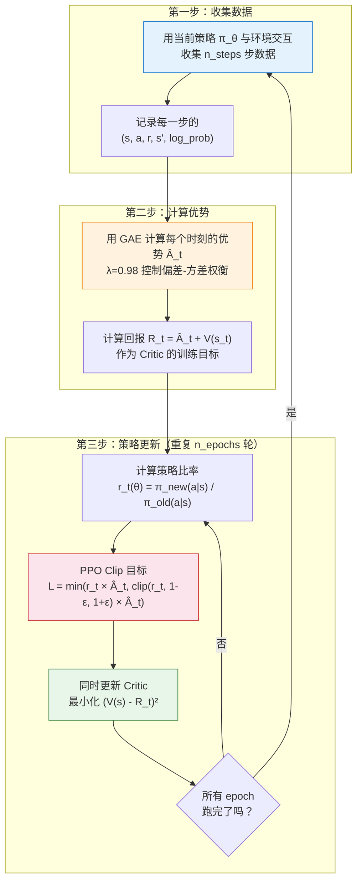

# 7.1 动手：用 PPO 训练 LunarLander

上一章的 Actor-Critic 让 CartPole 学会了平衡，但 CartPole 只有两个动作、四个状态维度，实在太简单了。这一节我们把难度拉高——让 AI 学会在月球上着陆飞船。LunarLander-v2 有四个引擎喷口、八维连续状态（位置、速度、角度、角速度），需要精准控制推力和方向才能平稳着陆。我们将用 PPO 来完成这个任务，亲眼观察训练过程中那些关键指标的起伏变化。

## 运行 PPO 训练

我们使用 Stable-Baselines3（SB3）提供的 PPO 实现。SB3 是目前最流行的 RL 工具库之一，它的 PPO 实现经过了大量工程优化，开箱即用。

```python
import gymnasium as gym
from stable_baselines3 import PPO
from stable_baselines3.common.callbacks import BaseCallback
import numpy as np

# ==========================================
# 1. 创建环境和 PPO 模型
# ==========================================
env = gym.make("LunarLander-v2")

# PPO 的关键超参数
model = PPO(
    policy="MlpPolicy",       # 多层感知机策略网络
    env=env,
    learning_rate=3e-4,       # 学习率
    n_steps=2048,             # 每次更新前收集的步数
    batch_size=64,            # 小批量大小
    n_epochs=10,              # 每次更新的训练轮数
    gamma=0.99,               # 折扣因子
    gae_lambda=0.98,          # GAE 的 λ 参数
    clip_range=0.2,           # PPO 裁剪范围 ε
    ent_coef=0.01,            # 熵正则化系数（鼓励探索）
    vf_coef=0.5,              # 价值函数损失权重
    verbose=1,
)

# ==========================================
# 2. 自定义回调：记录训练指标
# ==========================================
class MetricsCallback(BaseCallback):
    """记录 PPO 训练过程中的关键指标"""
    def __init__(self, check_freq=2048):
        super().__init__()
        self.check_freq = check_freq
        self.rewards = []
        self.entropies = []
        self.clip_fractions = []
        self.value_losses = []

    def _on_step(self):
        # 记录每个 episode 的总 reward
        for info in self.locals.get("infos", []):
            if "episode" in info:
                self.rewards.append(info["episode"]["r"])

        # 每次策略更新时记录内部指标
        if self.num_timesteps % self.check_freq == 0:
            # 策略熵：衡量探索程度
            entropy = self.model.logger.name_to_value.get("train/entropy_loss", 0)
            self.entropies.append(entropy)

            # Clip fraction：被裁剪的比例
            clip_frac = self.model.logger.name_to_value.get("train/clip_fraction", 0)
            self.clip_fractions.append(clip_frac)

            # 价值函数损失
            vf_loss = self.model.logger.name_to_value.get("train/value_loss", 0)
            self.value_losses.append(vf_loss)

        return True

callback = MetricsCallback()

# ==========================================
# 3. 开始训练！
# ==========================================
print("开始训练 LunarLander，目标：平均 Reward > 200")
model.learn(total_timesteps=500_000, callback=callback)
model.save("ppo_lunarlander")

print(f"最终平均 Reward: {np.mean(callback.rewards[-50:]):.1f}")
```

运行这段代码，你会看到训练日志像流水一样涌出来。别急着看最终结果——先观察训练过程本身，这才是这节课的重点。

## PPO 训练循环的全貌

在分析训练指标之前，让我们先看看 PPO 的训练循环到底在做什么。理解了这个流程图，后面的指标分析就会水到渠成。



PPO 的训练循环分三步：收集数据 → 计算优势 → 多轮更新策略。其中第三步的"多轮更新"是 PPO 的关键创新——它允许我们用同一批数据更新策略多次（通常是 10 轮），但通过裁剪机制防止更新过大。这就是 PPO 名字中"Proximal"（近端）的含义——每次更新后，新策略必须保持在旧策略的"附近"。

## 训练指标一览

训练完成后，我们来整理一下关键指标的变化趋势。下面是一个典型的 PPO 在 LunarLander 上的训练过程记录：

| 训练阶段             | 平均 Reward | 策略熵    | Clip Fraction | 价值损失 |
| -------------------- | ----------- | --------- | ------------- | -------- |
| 初期（0-50k 步）     | -200 ~ -100 | 1.4 ~ 1.2 | 0.15 ~ 0.20   | 50 ~ 30  |
| 中期（50k-200k 步）  | -50 ~ 100   | 1.0 ~ 0.6 | 0.10 ~ 0.05   | 20 ~ 10  |
| 后期（200k-500k 步） | 150 ~ 250   | 0.3 ~ 0.1 | 0.02 ~ 0.05   | 5 ~ 2    |

每一个指标都在讲述训练过程的一个侧面：

- **平均 Reward** 是最直观的指标——从初期的"飞船疯狂爆炸"到后期的"平稳着陆"，数值从 -200 一路爬升到 +200 以上。
- **策略熵（Entropy）** 衡量策略的"随机程度"。熵越高说明模型还在到处探索，熵越低说明模型已经形成了比较确定的策略。正常的训练过程是熵从高到低逐渐收敛。
- **Clip Fraction** 是被裁剪的比例——策略更新中有多少比例触发了 PPO 的裁剪机制。这个指标直接反映了"策略更新有多激进"。
- **价值损失** 是 Critic 网络的预测误差，它应该随着训练稳步下降。

## 观察异常：为什么 Reward 会跳水？

仔细观察训练曲线，你大概率会发现一个现象：Reward 曲线并不是平滑上升的，而是在某些时刻突然跳水，然后慢慢恢复。比如在 150k 步时 Reward 刚到 150，突然掉到 50，过了 20k 步才恢复。

这种跳水不是代码 bug，而是 RL 训练的常态。背后的原因通常是这样的：

1. 模型在某个阶段学到了一个"局部最优"策略（比如"一直开侧推力来稳住"）
2. 随着训练继续，策略对这个局部最优的依赖越来越深
3. 某次更新幅度较大（clip fraction 飙升），策略突然偏离了之前的策略
4. 之前的"捷径"不管用了，Reward 急剧下降
5. 模型被迫重新探索，慢慢找到更好的策略

关键洞察是：**clip fraction 飙升和 reward 跳水几乎同时发生**。这恰好印证了 PPO 设计裁剪机制的初衷——限制每次更新幅度，避免策略剧烈摇摆。当裁剪比例过高时，说明策略更新过于激进，模型正在"走钢丝"。

```python
# ==========================================
# 分析 clip fraction 和 reward 的关系
# ==========================================
import matplotlib.pyplot as plt

fig, (ax1, ax2) = plt.subplots(2, 1, figsize=(10, 6), sharex=True)

# 上图：Reward 曲线
ax1.plot(callback.rewards, alpha=0.3, color='blue', label='原始 Reward')
window = 50
if len(callback.rewards) > window:
    smoothed = np.convolve(callback.rewards, np.ones(window)/window, mode='valid')
    ax1.plot(range(window-1, len(callback.rewards)), smoothed,
             color='blue', linewidth=2, label=f'{window}集滑动平均')
ax1.set_ylabel('Episode Reward')
ax1.legend()
ax1.set_title('PPO 训练 LunarLander：Reward 与 Clip Fraction')

# 下图：Clip Fraction 曲线
ax2.plot(callback.clip_fractions, color='red', alpha=0.7, label='Clip Fraction')
ax2.axhline(y=0.2, color='gray', linestyle='--', alpha=0.5, label='警戒线 (0.2)')
ax2.set_ylabel('Clip Fraction')
ax2.set_xlabel('更新次数')
ax2.legend()

plt.tight_layout()
plt.savefig("ppo_training_metrics.png", dpi=150)
print("训练指标图已保存")
```

熵（Entropy）的变化也值得关注。训练初期熵很高（接近 1.4），说明模型对所有动作"一视同仁"，还没有形成偏好。随着训练推进，熵逐渐下降，说明模型开始"专注"某些动作。但如果熵下降太快，意味着模型过早地放弃了探索——可能陷入局部最优。这就是为什么 PPO 设置了 `ent_coef=0.01`（熵正则化系数），人为地给策略加一点"探索动力"，防止它过早收敛。

## 回看训练日志：超参数的微妙影响

让我们用更挑剔的眼光审视两个关键超参数：

**ε（clip_range）的影响**：默认值 0.2 意味着策略比率被限制在 [0.8, 1.2] 之间。如果你把 ε 调大到 0.3，允许更大的更新幅度，训练可能更快但也更不稳定——clip fraction 会更高，reward 跳水更频繁。如果调小到 0.1，训练更平稳但可能更慢，因为模型被"绑手绑脚"了。

**λ（gae_lambda）的影响**：默认值 0.98 偏向蒙特卡洛估计（低偏差、高方差）。如果你把它降到 0.9，会更偏向 TD 估计（高偏差、低方差），训练曲线会更平滑但可能收敛到稍差的结果。这个参数在第 6.3 节的 GAE 部分会详细解释。

<details>
<summary>思考题：如果 clip fraction 一直为 0，说明什么？这是好事还是坏事？</summary>

如果 clip fraction 一直为 0，意味着策略比率 $r_t(\theta)$ 从来没有超出 $[1-\varepsilon, 1+\varepsilon]$ 的范围。这有两种可能：

1. **策略更新太保守**：学习率可能太小，或者 $\varepsilon$ 设得太大，导致策略几乎没有变化。这时候训练会非常慢。
2. **策略已经收敛**：到了训练后期，策略已经非常稳定，每次更新只是微调，不触发裁剪是正常的。

区分这两种情况的方法是看 Reward 是否还在增长。如果 Reward 还很低但 clip fraction 已经是 0，说明策略更新太保守了，应该增大学习率或减小 $\varepsilon$。

</details>

现在你已经看到了 PPO 训练的全过程，也观察到了"Reward 跳水""Clip Fraction 飙升"这些现象。接下来我们要问一个更深层的问题：PPO 的裁剪机制到底是怎么防止策略崩溃的？这需要从"信任域"的概念说起——[信任域与裁剪](./trust-region-clipping)。
