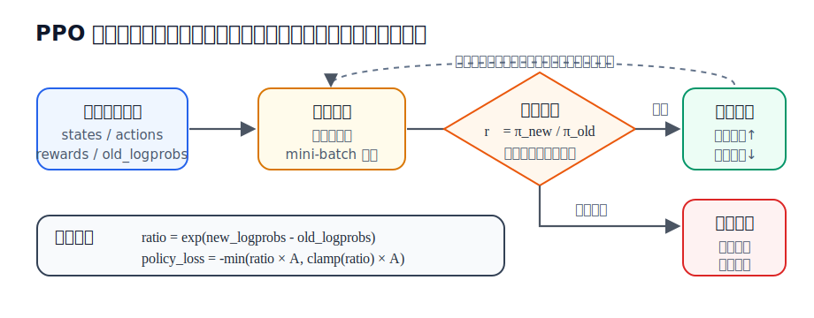
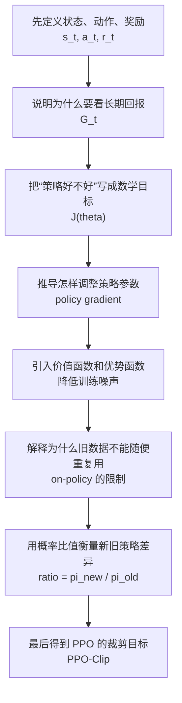
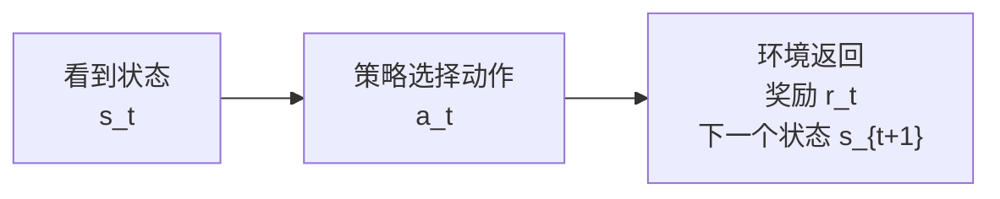
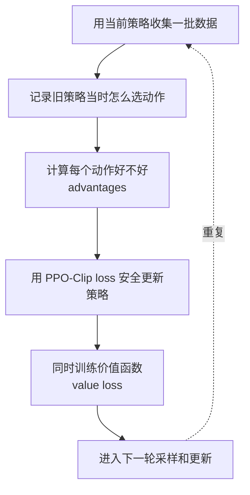
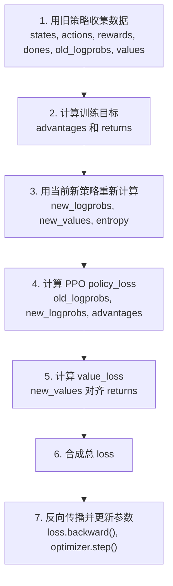
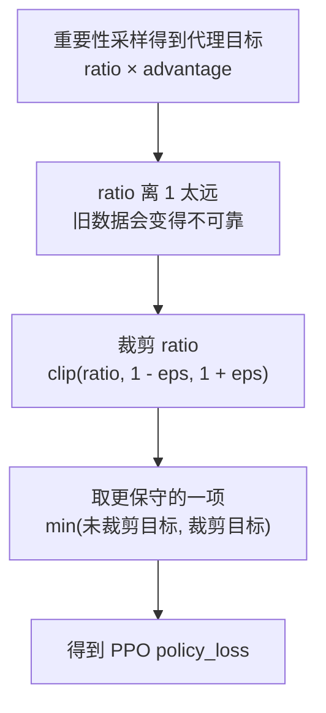
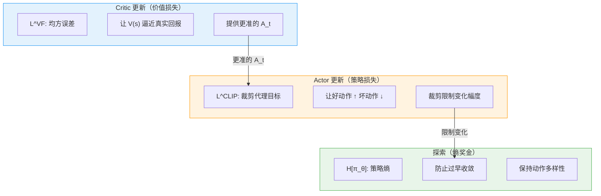
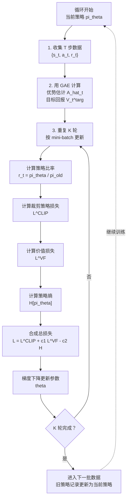

# 7.2 PPO 数学推导：从 RL 目标到裁剪代理目标

上一节我们用 SB3 的 PPO 训练了月球着陆器，看到了 reward、entropy、clip fraction 这些曲线。接下来要回答一个更基础的问题：**PPO 到底是什么？为什么它最后会写成一个 loss？**

PPO 的全称是 **Proximal Policy Optimization**，通常翻译成**近端策略优化**。这个名字可以拆开理解：

- **Policy**：策略，也就是负责选动作的模型。
- **Optimization**：优化，也就是训练、改进这个策略。
- **Proximal**：近端，也就是新策略不要离旧策略太远。

所以先给结论：**PPO 不是策略本身，也不只是一个 loss。PPO 是一种训练策略网络的方法。**

在强化学习里，**策略**是我们真正要训练的对象。它通常写成：

$$
\pi_\theta(a \mid s)
$$

这表示“参数为 $\theta$ 的策略网络，在状态 $s$ 下选择动作 $a$ 的概率”。在代码里，这个策略通常就是 **Actor 网络**。比如输入一个游戏画面或机器人状态，Actor 输出每个动作的概率。

**PPO 做的事情，是告诉我们怎样训练这个 Actor。** 它不是把动作直接写死，也不是替代策略网络，而是一套更新规则：先用当前 Actor 收集一批经验，再根据这批经验调整 Actor 的参数，同时限制每次调整不要太猛。

可以先把三个概念分清楚：

| 名字               | 它是什么                                                   | 代码里大概对应什么                         |
| ------------------ | ---------------------------------------------------------- | ------------------------------------------ |
| **策略（policy）** | 被训练的对象，负责根据状态选择动作                         | `actor` / `model` 输出的 `action_probs`    |
| **PPO**            | 训练策略的方法，规定如何采样、计算优势、限制更新、反向传播 | 整个训练循环                               |
| **PPO loss**       | PPO 方法中用于更新神经网络参数的可求导目标                 | `policy_loss + value_loss - entropy_bonus` |

为什么后面会频繁讲 **loss**？因为神经网络不能直接听懂“让策略稳一点、别变太快”这句话。优化器能做的事情很具体：给它一个标量 loss，它通过 `loss.backward()` 算梯度，再用 `optimizer.step()` 改参数。所以，**PPO 的思想必须最后落成一个 loss，才能真正更新 Actor 和 Critic。**

换句话说，**PPO 是方法，策略是被训练的模型，loss 是这个方法落到代码里的训练信号。** 后面推导 PPO loss，不是因为 PPO 只有 loss，而是因为 loss 是 PPO 真正作用到神经网络参数上的地方。

## 先看一份完整的手写 PPO 代码

为了让后面的公式不悬空，我们先把 **PPO 在代码里大概长什么样**放在这里。下面这份代码不是工程性能版，而是一份适合学习的 **最小 PyTorch PPO 骨架**：它包含策略网络、采样、优势估计、PPO-Clip 损失、价值函数损失、熵奖金和多轮更新。

后文每推到一个公式，都会回到这份代码里的某一段。代码块中带底色的部分，就是后面会反复拆开的核心行。可以先不用完全读懂每一行，只要先记住：**PPO 最终就是把“收集经验、计算优势、限制策略变化、反向传播更新参数”连成一个训练循环。**

<PpoCodeFocus focus="overview" />

这份代码可以分成六块：

| 标记    | 代码部分           | 后文会解释什么                                             |
| ------- | ------------------ | ---------------------------------------------------------- |
| **[A]** | `forward`          | 策略 $\pi_\theta(a\mid s)$ 和价值函数 $V_\theta(s)$ 是什么 |
| **[B]** | `act` / `evaluate` | 为什么要构造 `dist`，以及为什么要保存 `log_prob`           |
| **[C]** | `collect_rollout`  | 什么叫 on-policy 数据，为什么要记录旧策略概率              |
| **[D]** | `compute_gae`      | 回报、价值函数、优势函数之间是什么关系                     |
| **[E]** | `ppo_update`       | PPO-Clip 的 `ratio`、`clamp`、`min` 和总损失               |
| **[F]** | 训练循环           | 为什么同一批数据会更新多轮                                 |

后文遇到关键变量时，会反复出现这个 **代码透镜**。它默认只显示当前段落关心的代码，并把关键行加粗加深；鼠标移上去或点击按钮后，会展开同一份完整代码。这样读者既能专心看局部，又不会忘记这几行在整个 PPO 程序里的位置。

如果你曾经练习过一个需要不断试错的技能，比如投篮、骑车或打游戏，那么已经熟悉了**强化学习的基本味道**。你先按照当前的做法尝试一次，观察结果；如果结果不错，就更倾向于**保留这类动作**；如果结果很差，就**减少下次再这么做的概率**。强化学习中的策略网络也是这样学习的。

在 PPO 中，模型会先用**当前策略**和环境互动一段时间。互动时，它会存下每一步看到的**状态**、采取的**动作**、得到的**奖励**，以及当时选择这个动作的**概率**。随后训练程序会回看这批记录：哪些动作之后带来了更好的结果，就让这些动作以后更容易被选到；哪些动作之后结果不好，就降低它们的概率。

这里有一个容易被忽略的问题。**模型一更新，策略就变了。** 刚刚那批数据来自更新之前的**旧策略**，而不是更新之后的**新策略**。如果只更新一次就丢掉这批数据，训练会很浪费；但如果反复使用这批数据，又可能出现另一个问题：**新策略已经和旧策略差得太远，旧数据开始不能准确代表新策略的表现。**

PPO 的核心想法可以用一句更朴素的话概括：

> 同一批经验不要只用一次，可以多学几轮；但是每学一轮都要检查新策略相对旧策略变了多少。如果变化还小，就继续学习；如果某些动作的概率被推得太高或压得太低，就把这部分更新截住。



这张图里最重要的是中间的检查点：每一轮更新都会重新计算新旧策略的概率比值 $r_t$。如果 $r_t$ 还在安全区间内，PPO 就继续利用这批经验学习；如果 $r_t$ 已经离 1 太远，说明新策略相对旧策略变得太多，PPO 就用裁剪把这部分更新截住。

到这里可以看到，PPO 的“方法感”主要来自两件事：**一批经验会被重复学习多轮**，并且**每一轮都会用概率比值检查新旧策略差异**。后文的 PPO loss，就是把这两件事写成一个可计算、可反向传播的目标。

这就是 PPO 中 **“Proximal”（近端、不要离太远）** 这个词的含义。PPO 并不要求策略完全不变，而是要求**每次改变都不要太猛**。它希望模型像稳定练习一样逐步变好，而不是一次更新就把原来还不错的行为方式推翻。

本节会从最基本的强化学习记号讲起，然后一步步走到 PPO 的最终公式。顺序如下：



等这些概念都铺好之后，再看 PPO 的公式就不会像突然从天上掉下来：

$$
L^{\text{CLIP}}(\theta)
= \mathbb{E}_t\left[
\min\left(
r_t(\theta)\hat{A}_t,\;
\text{clip}(r_t(\theta),1-\varepsilon,1+\varepsilon)\hat{A}_t
\right)
\right]
$$

现在先把**主要符号**放在一张表里。后文每个公式都会再次解释这些字母，这张表可以当作索引。

| 符号                         | 含义                                                   | 代码里的对应物                           |
| ---------------------------- | ------------------------------------------------------ | ---------------------------------------- |
| $s_t$                        | 第 $t$ 步的状态，例如 CartPole 的位置、速度等观测      | `state` / `obs`                          |
| $a_t$                        | 第 $t$ 步采取的动作                                    | `action`                                 |
| $r_t$                        | 执行动作后环境返回的即时奖励                           | `reward`                                 |
| $\gamma$                     | 折扣因子，控制未来奖励的重要程度                       | `gamma`，常用 `0.99`                     |
| $G_t$                        | 从第 $t$ 步开始的折扣累计回报                          | `returns`                                |
| $\tau$                       | 一整条轨迹：状态、动作、奖励组成的序列                 | rollout / trajectory                     |
| $\pi_\theta(a \mid s)$       | 参数为 $\theta$ 的策略，在状态 $s$ 选择动作 $a$ 的概率 | `action_probs`                           |
| $\log \pi_\theta(a \mid s)$  | 动作概率的对数，用来稳定计算策略梯度                   | `log_prob` / `new_logprobs`              |
| $J(\theta)$                  | 策略的总体目标：期望折扣累计回报                       | 训练时希望最大化的目标                   |
| $V_\theta(s)$                | Critic 对状态 $s$ 未来回报的估计                       | `value` / `new_values`                   |
| $A_t$ 或 $\hat{A}_t$         | 优势估计：这个动作比当前状态的平均水平好多少           | `advantages`                             |
| $\pi_{\text{old}}(a \mid s)$ | 收集这批数据时的旧策略                                 | 存下来的 `old_logprobs`                  |
| $r_t(\theta)$                | 新旧策略概率比值 $\pi_\theta / \pi_{\text{old}}$       | `ratio = exp(new_logprobs-old_logprobs)` |
| $\varepsilon$                | PPO 裁剪范围，通常取 `0.1` 或 `0.2`                    | `clip_eps` / `clip_range`                |
| $H[\pi_\theta]$              | 策略熵，衡量动作分布有多随机                           | `entropy`                                |

## 第一步：把强化学习写成一个概率问题

强化学习最基本的循环是：



这里的 $t$ 表示时间步。$s_t$ 是 agent 在第 $t$ 步看到的状态，$a_t$ 是它采取的动作，$r_t$ 是环境对这个动作的即时反馈。**强化学习不是只看某一步奖励，而是关心一串决策共同造成的长期结果。**

通常我们把环境写成一个马尔可夫决策过程：

$$
\mathcal{M} = (\mathcal{S}, \mathcal{A}, P, R, \gamma)
$$

每个字母的意思是：

- $\mathcal{S}$：状态空间，所有可能状态的集合。
- $\mathcal{A}$：动作空间，所有可能动作的集合。
- $P(s_{t+1}\mid s_t,a_t)$：状态转移概率。它表示在状态 $s_t$ 执行动作 $a_t$ 后，环境转移到 $s_{t+1}$ 的概率。
- $R(s_t,a_t)$：奖励函数。它告诉我们这一步动作带来的即时收益。
- $\gamma$：折扣因子。它决定未来奖励在今天看来有多重要。

**策略是我们要训练的对象。** 写成公式就是：

$$
\pi_\theta(a_t \mid s_t)
$$

这表示“参数为 $\theta$ 的策略网络，在状态 $s_t$ 下选择动作 $a_t$ 的概率”。在代码中，Actor 网络会先输出动作概率，再把它包装成动作分布 `dist`：

<PpoCodeFocus focus="dist" />

这段默认显示 **[A] 策略输出** 和 **[B] 动作采样**。如果展开完整代码，可以看到它前面接着网络定义，后面接着 rollout 采样。

`action_probs` 就是 $\pi_\theta(\cdot \mid s_t)$，它是所有动作的概率分布。比如在一个有 3 个离散动作的环境中，`action_probs = [0.1, 0.7, 0.2]` 表示：动作 0 的概率是 10%，动作 1 的概率是 70%，动作 2 的概率是 20%。

`dist` 是 distribution 的缩写，意思是**“概率分布对象”**。`Categorical(action_probs)` 会把这组动作概率包装成一个离散分布。它本身不是动作，也不是网络参数；它更像一个带工具的抽奖盒：盒子里每个动作都有自己的中奖概率。

这个对象提供了几个强化学习里非常常用的方法：

| 代码                    | 含义                                                     | 数学对应                              |
| ----------------------- | -------------------------------------------------------- | ------------------------------------- |
| `dist.sample()`         | 按照 `action_probs` 抽一个动作，而不是永远选最大概率动作 | $a_t \sim \pi_\theta(\cdot \mid s_t)$ |
| `dist.log_prob(action)` | 查询刚才这个动作的对数概率                               | $\log \pi_\theta(a_t \mid s_t)$       |
| `dist.entropy()`        | 计算这个动作分布有多随机，后面用来鼓励探索               | $H[\pi_\theta]$                       |

所以，`action` 是从 `dist` 里采样出来的动作；`log_prob` 是这个动作在当前策略下的对数概率，后面算策略梯度和 PPO 比率都会用到它。这里使用 `Categorical` 是因为 CartPole、LunarLander 这类例子的动作是离散的；如果动作是连续的，通常会用 `Normal` 之类的连续分布，但**“先构造分布，再采样动作，再记录 log_prob”**的思路是一样的。

如果从初始状态一路跑到结束，我们得到一条轨迹：

$$
\tau = (s_0,a_0,r_0,s_1,a_1,r_1,\ldots,s_T)
$$

$\tau$ 读作 trajectory。它不是一个单点样本，而是一整段交互历史。给定策略 $\pi_\theta$ 后，这条轨迹出现的概率可以写成：

$$
p_\theta(\tau)
= \rho_0(s_0)
\prod_{t=0}^{T-1}
\pi_\theta(a_t\mid s_t)
P(s_{t+1}\mid s_t,a_t)
$$

这个公式看起来长，其实只是在说三件事：

- $\rho_0(s_0)$：初始状态从哪里来。
- $\pi_\theta(a_t\mid s_t)$：agent 在每个状态下怎么选动作。
- $P(s_{t+1}\mid s_t,a_t)$：环境在动作之后怎么变化。

非常关键的一点是：**在这个乘积里，只有 $\pi_\theta(a_t\mid s_t)$ 含有我们能训练的参数 $\theta$。** 环境转移 $P$ 通常不知道、不可导、也不能被我们直接修改。策略梯度方法之所以只需要动作的 `log_prob`，根源就在这里。

## 第二步：为什么目标是折扣累计回报

如果只最大化即时奖励 $r_t$，agent 会变得短视。例如月球着陆器当前猛喷一下燃料也许能立刻改变姿态，但可能导致后面坠毁。强化学习真正要最大化的是**从现在开始的一串未来奖励**：

$$
G_t = r_t + \gamma r_{t+1} + \gamma^2 r_{t+2} + \cdots
$$

更紧凑地写：

$$
G_t = \sum_{k=0}^{T-t-1}\gamma^k r_{t+k}
$$

这里每个符号的意思是：

- $G_t$：return，从第 $t$ 步开始往后看的累计回报。
- $k$：从当前时刻往后的偏移量。$k=0$ 表示当前奖励 $r_t$，$k=1$ 表示下一步奖励 $r_{t+1}$。
- $\gamma^k$：未来奖励的折扣权重。越远的奖励，乘的折扣次数越多。
- $T$：轨迹长度。如果任务没有固定终点，也常写成无穷和 $\sum_{k=0}^{\infty}\gamma^k r_{t+k}$。

为什么要有 $\gamma$？主要有三个原因。

第一，$\gamma$ 表达“未来很重要，但通常没有当下确定”。$\gamma=0$ 时，agent 只看当前奖励；$\gamma$ 越接近 $1$，agent 越重视长期结果。CartPole、LunarLander 这类任务常用 $\gamma=0.99$。

第二，在无限时间任务里，如果每一步都有正奖励，直接求和可能发散。只要 $0\leq\gamma<1$，折扣和就更容易保持有限。

第三，折扣回报有一个**非常适合实现的递推形式**：

$$
G_t = r_t + \gamma G_{t+1}
$$

这句话的意思是：从现在开始的总回报，等于“现在的奖励”加上“下一步总回报打一个折扣”。代码里通常从后往前算：

```python {4}
G = 0
returns = []
for reward in reversed(rewards):
    G = reward + gamma * G
    returns.insert(0, G)
```

这段代码里的 `G` 就是公式里的 $G_t$，`reward` 是 $r_t$，`gamma` 是 $\gamma$，`returns` 存下每一个时间步的折扣累计回报。

于是，一个策略的目标函数可以写成：

$$
J(\theta)
= \mathbb{E}_{\tau \sim p_\theta(\tau)}[G_0]
= \mathbb{E}_{\tau \sim \pi_\theta}
\left[
\sum_{t=0}^{T-1}\gamma^t r_t
\right]
$$

$J(\theta)$ 读作“参数 $\theta$ 的策略好不好”。$\mathbb{E}$ 表示**期望**，因为同一个策略跑很多次也可能得到不同轨迹。环境有随机性，策略采样动作也有随机性，所以我们最大化的不是某一次运行的奖励，而是**平均意义上的长期回报**。

## 第三步：从目标函数到策略梯度

现在问题变成：怎样调整 $\theta$，让 $J(\theta)$ 变大？

先把目标写成对所有可能轨迹的求和：

$$
J(\theta)
= \sum_{\tau} p_\theta(\tau)R(\tau)
$$

这里 $R(\tau)$ 表示整条轨迹的折扣累计回报。对 $\theta$ 求梯度：

$$
\nabla_\theta J(\theta)
= \sum_{\tau} \nabla_\theta p_\theta(\tau)R(\tau)
$$

直接对轨迹概率 $p_\theta(\tau)$ 求导很难。**策略梯度的关键技巧**是这个恒等式：

$$
\nabla_\theta p_\theta(\tau)
= p_\theta(\tau)\nabla_\theta \log p_\theta(\tau)
$$

它来自 $\nabla \log x = \frac{1}{x}\nabla x$。把它代回去：

$$
\nabla_\theta J(\theta)
= \sum_{\tau} p_\theta(\tau)
\nabla_\theta \log p_\theta(\tau)
R(\tau)
= \mathbb{E}_{\tau\sim p_\theta}
\left[
\nabla_\theta \log p_\theta(\tau)R(\tau)
\right]
$$

再展开 $\log p_\theta(\tau)$：

$$
\log p_\theta(\tau)
= \log \rho_0(s_0)
+ \sum_{t=0}^{T-1}\log \pi_\theta(a_t\mid s_t)
+ \sum_{t=0}^{T-1}\log P(s_{t+1}\mid s_t,a_t)
$$

对 $\theta$ 求导后，初始状态分布 $\rho_0$ 和环境转移 $P$ 都消失，因为它们不含 $\theta$：

$$
\nabla_\theta \log p_\theta(\tau)
= \sum_{t=0}^{T-1}
\nabla_\theta \log \pi_\theta(a_t\mid s_t)
$$

得到最经典的 REINFORCE 梯度：

$$
\nabla_\theta J(\theta)
=
\mathbb{E}_{\tau\sim\pi_\theta}
\left[
\sum_{t=0}^{T-1}
\nabla_\theta \log \pi_\theta(a_t\mid s_t)G_t
\right]
$$

为什么这里用 $G_t$ 而不是整条轨迹的 $G_0$？因为第 $t$ 步的动作不可能影响第 $t$ 步之前已经发生的奖励。用从当前时刻开始的回报 $G_t$，既符合因果关系，也能降低噪声。

实现时，我们通常不手写这个梯度，而是写一个等价的 loss，让自动微分去算：

```python {1-2}
policy_loss = -(log_probs * returns).mean()
policy_loss.backward()
optimizer.step()
```

为什么有负号？数学上我们想最大化 $\log \pi_\theta(a_t\mid s_t)G_t$；但 PyTorch 优化器默认最小化 loss，所以写成负号。**如果 $G_t$ 很大，梯度下降会提高对应动作的 log probability；如果 $G_t$ 很小甚至为负，它会降低对应动作的概率。**

## 第四步：价值函数、基线与优势

朴素 REINFORCE 能工作，但**方差很大**。原因是 $G_t$ 只是告诉我们“这次后面总共拿了多少奖励”，却没有告诉我们“这在当前状态下算不算好”。

例如 LunarLander 某一步之后拿到 $G_t=80$。这听起来不错，但如果同一个状态下正常策略平均能拿 $120$，那这个动作其实低于平均水平。我们需要一个参照物，这个参照物就是状态价值函数：

$$
V^\pi(s_t)
= \mathbb{E}_{\pi}[G_t \mid s_t]
$$

$V^\pi(s_t)$ 表示：如果现在处在状态 $s_t$，之后继续按照策略 $\pi$ 行动，平均能拿到多少回报。

动作价值函数则多固定了一个动作：

$$
Q^\pi(s_t,a_t)
= \mathbb{E}_{\pi}[G_t \mid s_t,a_t]
$$

$Q^\pi(s_t,a_t)$ 表示：在状态 $s_t$ 先执行动作 $a_t$，后面再按策略 $\pi$ 行动，平均能拿到多少回报。

两者相减得到优势函数：

$$
A^\pi(s_t,a_t)
= Q^\pi(s_t,a_t) - V^\pi(s_t)
$$

优势的意思非常朴素：**这个动作比当前状态下的平均动作好多少。** $A_t>0$，说明这个动作比平均好，应该提高概率；$A_t<0$，说明这个动作比平均差，应该降低概率；$A_t=0$，说明它差不多就是平均水平。

实际代码里，我们不知道真实的 $V^\pi$ 和 $Q^\pi$，所以用 Critic 网络估计 $V_\theta(s_t)$，再用回报或 GAE 近似优势：

$$
\hat{A}_t \approx G_t - V_\theta(s_t)
$$

对应到代码就是：

<PpoCodeFocus focus="advantages" />

这段默认把 **[D] 优势估计** 和 **[E] 价值函数训练** 放在一起看：`advantages` 告诉 Actor 怎么改，`returns` 则给 Critic 的 `value_loss` 提供监督目标。

如果不用 GAE，最朴素的近似就是 `advantages = returns - values`。本章代码使用 GAE 来算 `advantages`，下一节会专门推导 GAE。这里先把它理解成“比 Critic 预期更好或更差的那部分”。

为什么可以把 $G_t$ 换成 $A_t$？因为从策略梯度里减去一个只依赖状态的基线 $b(s_t)$，不会改变期望梯度：

$$
\mathbb{E}_{a_t\sim\pi_\theta}
\left[
\nabla_\theta\log\pi_\theta(a_t\mid s_t)b(s_t)
\right]
= b(s_t)\nabla_\theta
\sum_{a_t}\pi_\theta(a_t\mid s_t)
= b(s_t)\nabla_\theta 1
= 0
$$

这段推导说明：**减去基线不改变梯度方向的期望，只会降低方差。** 于是策略梯度可以写成更常用的 Actor-Critic 形式：

$$
\nabla_\theta J(\theta)
= \mathbb{E}_t
\left[
\nabla_\theta \log \pi_\theta(a_t\mid s_t)\hat{A}_t
\right]
$$

这就是 **Actor 和 Critic 的分工**：Critic 估计 $V_\theta(s_t)$，把“当前状态的平均水平”告诉 Actor；Actor 只根据优势 $\hat{A}_t$ 调整动作概率。

## 第五步：朴素策略梯度为什么还不够

到这里，我们已经有了一个看起来完整的算法：


问题在于，朴素策略梯度有一个要求：**用来更新策略的数据，最好就是这个策略自己刚刚采样出来的数据。** 这个性质通常叫做 **on-policy**。公式里的期望是：

$$
\mathbb{E}_{\tau\sim\pi_\theta}[\cdots]
$$

这意味着数据应该来自**当前策略** $\pi_\theta$。可是一次梯度更新之后，参数从 $\theta_{\text{old}}$ 变成 $\theta$，刚刚收集的轨迹就不再来自新策略了，而是来自**旧策略** $\pi_{\text{old}}$。

如果每批数据只用一次，训练会非常浪费。跑环境收集 2048 步数据很贵，尤其是在机器人、游戏模拟、LLM 生成回答这类场景里。我们自然想问：

> 能不能用旧策略收集的数据，对新策略更新多轮？

PPO 的核心矛盾就在这里：**我们想复用旧数据提高样本效率，但又不能让新策略离旧策略太远，否则旧数据会误导更新。**

在学习版 PPO 骨架的 `collect_rollout` 函数中，代码特意把采样当时的 log 概率存下来：

<PpoCodeFocus focus="oldLogprobs" />

这个 `old_logprobs` 就是 $\log \pi_{\text{old}}(a_t\mid s_t)$。后面更新时，模型会重新计算同一批状态动作对在新策略下的 `new_logprobs`。新旧 log 概率一比较，就能知道策略偏离了多少。下一步的重要性采样正是为了解开“旧数据能不能继续用”这个结。

## 第六步：重要性采样——让旧数据重新可用

上一节的问题是：朴素策略梯度必须用当前策略 $\pi_\theta$ 收集数据。能不能用旧策略 $\pi_{\text{old}}$ 收集的数据来评估新策略？可以，靠**重要性采样**。

### 6.1 重要性采样的恒等式

核心恒等式：对于任意函数 $f$，

$$\mathbb{E}_{a \sim \pi_\theta} [f(a)] = \mathbb{E}_{a \sim \pi_{\text{old}}} \left[ \frac{\pi_\theta(a|s)}{\pi_{\text{old}}(a|s)} \cdot f(a) \right]$$

这个等式为什么成立？展开左边：

$$\mathbb{E}_{a \sim \pi_\theta} [f(a)] = \sum_a \pi_\theta(a|s) \cdot f(a)$$

把 $\pi_\theta(a|s)$ 改写成 $\pi_{\text{old}}(a|s) \cdot \frac{\pi_\theta(a|s)}{\pi_{\text{old}}(a|s)}$：

$$= \sum_a \pi_{\text{old}}(a|s) \cdot \frac{\pi_\theta(a|s)}{\pi_{\text{old}}(a|s)} \cdot f(a) = \mathbb{E}_{a \sim \pi_{\text{old}}} \left[ \frac{\pi_\theta(a|s)}{\pi_{\text{old}}(a|s)} \cdot f(a) \right]$$

等式成立。**直觉**：我们想知道在"新世界" $\pi_\theta$ 下 $f$ 的期望值，但我们手里只有"旧世界" $\pi_{\text{old}}$ 的样本。解决方法是**给每个样本加一个权重**——新世界比旧世界更可能产生这个样本，权重就大于 1；反之小于 1。这个权重就是 $\frac{\pi_\theta}{\pi_{\text{old}}}$。

### 6.2 策略比率

定义**策略比率**（Policy Ratio）：

$$r_t(\theta) = \frac{\pi_\theta(a_t | s_t)}{\pi_{\text{old}}(a_t | s_t)}$$

在代码中，策略比率通过 log 概率之差的指数来计算，这是为了避免直接做除法导致数值下溢：

<PpoCodeFocus focus="ratio" />

**$r_t = 1$ 表示新策略和旧策略在这个动作上概率相同**；$r_t > 1$ 表示新策略更倾向于选这个动作；$r_t < 1$ 则相反。

### 6.3 代理目标

把重要性采样应用到策略梯度目标上，得到**代理目标**（Surrogate Objective）：

$$L^{\text{IS}}(\theta) = \mathbb{E}_t \left[ r_t(\theta) \cdot A_t \right]$$

展开写就是：

$$L^{\text{IS}}(\theta) = \mathbb{E}_t \left[ \frac{\pi_\theta(a_t | s_t)}{\pi_{\text{old}}(a_t | s_t)} \cdot A_t \right]$$

代码中对应的是 `surr1 = ratio * advantages`，它在 PPO 更新函数里紧跟着 `ratio`：

<PpoCodeFocus focus="surr1" />

这个目标有一个重要性质——**在 $\theta = \theta_{\text{old}}$ 处，它的一阶梯度等于朴素策略梯度**：

$$\nabla_\theta L^{\text{IS}}(\theta) \bigg|_{\theta = \theta_{\text{old}}} = \nabla_\theta J(\theta)$$

验证这一点很简单：当 $\theta = \theta_{\text{old}}$ 时，$r_t = 1$，$\nabla_\theta r_t = \nabla_\theta \frac{\pi_\theta}{\pi_{\text{old}}} = \frac{\nabla_\theta \pi_\theta}{\pi_{\text{old}}}$，代入即可还原出策略梯度公式。

但**只要 $\theta$ 偏离 $\theta_{\text{old}}$，两者就会分叉**。偏离越远，代理目标就越不可靠——这就是下一步要解决的问题。

## 第七步：从代理目标直接得到 PPO-Clip

现在我们已经推到了一个很关键的式子：

$$
L^{\text{IS}}(\theta)
= \mathbb{E}_t[r_t(\theta)A_t]
$$

先不要急着引入 TRPO。只看这个式子本身，它已经给出了 **PPO 的两个核心输入**：

| 名称     | 数学符号             | 代码变量     | 它回答的问题                     |
| -------- | -------------------- | ------------ | -------------------------------- |
| 策略比率 | $r_t(\theta)$        | `ratio`      | 新策略比旧策略更想选这个动作吗？ |
| 优势     | $A_t$ 或 $\hat{A}_t$ | `advantages` | 这个动作比平均水平好吗？         |

如果没有任何限制，我们会直接最大化：

$$
r_t(\theta)A_t
$$

代码里就是 `surr1 = ratio * advantages`：

<PpoCodeFocus focus="surr1" />

这里的 `surr1` 可以理解为**“原始策略改进目标”**。它的规则很简单：

- 如果 $A_t>0$，说明这是好动作，希望提高它的概率，也就是让 $r_t$ 变大。
- 如果 $A_t<0$，说明这是坏动作，希望降低它的概率，也就是让 $r_t$ 变小。

但这个目标本身**太贪心**。假设某个动作的优势 $A_t=+2$，当前策略比率 $r_t=5$，那么 $r_tA_t=10$。如果继续把这个动作概率推高，让 $r_t$ 变成 10、50、100，目标值会继续变大。优化器会觉得“越大越好”，但这时**新策略已经离旧策略很远了，旧数据不再可靠**。

**PPO 的做法不是重新设计一个复杂算法，而是在这个目标上加一个很直接的规则：**

> 可以提高好动作的概率，也可以降低坏动作的概率；但不要让新策略相对旧策略变化太多。

于是我们把**策略比率限制在一个小区间里**：

$$
\overline{r}_t(\theta)
= \text{clip}(r_t(\theta), 1-\varepsilon, 1+\varepsilon)
$$

如果 $\varepsilon=0.2$，那么区间就是 $[0.8, 1.2]$。这表示：对这批旧数据里的某个动作，新策略给它的概率最好不要低于旧策略的 0.8 倍，也不要高于旧策略的 1.2 倍。

代码里会把未裁剪目标 `surr1`、裁剪后的 `surr2` 和最终 `policy_loss` 放在一起：

<PpoCodeFocus focus="clip" title="裁剪代理目标 surr2 和 PPO-Clip" />

现在我们有两个目标：

| 代码    | 数学                                                      | 含义                                 |
| ------- | --------------------------------------------------------- | ------------------------------------ |
| `surr1` | $r_t(\theta)A_t$                                          | 不加限制时，策略想怎么改             |
| `surr2` | $\text{clip}(r_t(\theta),1-\varepsilon,1+\varepsilon)A_t$ | 加上更新幅度限制后，最多允许改到哪里 |

**PPO 最后取二者较小值：**

$$
J^{\text{CLIP}}(\theta)
= \mathbb{E}_t
\left[
\min \left(
r_t(\theta)A_t,\;
\text{clip}(r_t(\theta),1-\varepsilon,1+\varepsilon)A_t
\right)
\right]
$$

**这就是 PPO-Clip。** 它不是从 TRPO 公式一步一步代数变形出来的，而是从“重要性采样代理目标”出发，加上“不要让策略比率跑太远”的保守规则得到的。TRPO 是这个保守思想的历史来源之一，但不是理解 PPO 代码的必经步骤。

也就是代码里的 `torch.min(surr1, surr2).mean()`。为什么加负号？因为数学上我们要最大化 `policy_objective`，但 **PyTorch 里的优化器默认最小化 loss**，所以代码写成 `policy_loss = -policy_objective`。

### 7.1 分情况理解裁剪效果

**情况一：$A_t > 0$（好动作，应该增加概率）**

当 $A_t > 0$ 时，我们希望 $r_t$ 变大（即 $\pi_\theta$ 增加该动作的概率）。未裁剪项 $r_t \cdot A_t$ 会随 $r_t$ 线性增长，没有上限。裁剪项 $\overline{r}_t \cdot A_t$ 在 $r_t > 1+\varepsilon$ 后被截断为常数 $(1+\varepsilon) \cdot A_t$。

| $r_t$ 的范围               | 未裁剪项 $r_t \cdot A_t$ | 裁剪项 $\overline{r}_t \cdot A_t$   | $\min$ 取哪个    |
| -------------------------- | ------------------------ | ----------------------------------- | ---------------- |
| $r_t \leq 1 + \varepsilon$ | $r_t \cdot A_t$          | $r_t \cdot A_t$                     | 相等，正常优化   |
| $r_t > 1 + \varepsilon$    | $r_t \cdot A_t$（更大）  | $(1+\varepsilon) \cdot A_t$（常数） | 裁剪项，梯度为零 |

好动作的概率可以增加，但**最多增到 $1 + \varepsilon$ 倍**。超过之后目标函数"变平"——不再提供继续增大的动力，梯度为零，参数不会被进一步推动。

**情况二：$A_t < 0$（坏动作，应该降低概率）**

当 $A_t < 0$ 时，我们希望 $r_t$ 变小（即 $\pi_\theta$ 降低该动作的概率）。但是如果 $r_t$ 已经小于 $1-\varepsilon$，说明新策略已经把这个坏动作的概率压得太低了，PPO 不再奖励继续压低。

注意这里最容易看错，因为 $A_t$ 是负数。举个数值例子：令 $A_t=-2$，$\varepsilon=0.2$。如果 $r_t=0.7$，未裁剪项是 $0.7\times(-2)=-1.4$；裁剪项是 $0.8\times(-2)=-1.6$。$\min$ 会选择更小的 $-1.6$，也就是裁剪项。裁剪项已经是常数，所以梯度为零。

| $r_t$ 的范围               | 未裁剪项 $r_t \cdot A_t$  | 裁剪项 $\overline{r}_t \cdot A_t$   | $\min$ 取哪个          |
| -------------------------- | ------------------------- | ----------------------------------- | ---------------------- |
| $r_t < 1 - \varepsilon$    | 比裁剪项更大，例如 $-1.4$ | $(1-\varepsilon) \cdot A_t$（常数） | 裁剪项，梯度为零       |
| $r_t \geq 1 - \varepsilon$ | 未裁剪项                  | 区间内相等，过高时裁剪项反而更大    | 未裁剪项，继续正常优化 |

坏动作的概率可以降低，但**最多降到旧策略的 $1-\varepsilon$ 倍附近**。超过之后目标函数变平，不再提供继续压低概率的动力。如果坏动作概率反而升高，未裁剪项会让目标变差，梯度会把它往回拉。

**情况三：$A_t = 0$（中性动作）**。此时 $r_t \cdot A_t = 0$，无论 $r_t$ 如何变化，目标值始终为 0。PPO 对中性动作不做任何调整。

把这三种情况合起来看，PPO-Clip 的意义就很清楚：**它不是不让策略学习，而是不再奖励“已经走太远”的那部分变化。**

```python
import numpy as np
import matplotlib.pyplot as plt

# ==========================================
# PPO-Clip 目标函数的几何直觉
# ==========================================
epsilon = 0.2
r = np.linspace(0.0, 2.0, 500)

def clip_objective(r, A, eps=0.2):
    r_clipped = np.clip(r, 1 - eps, 1 + eps)
    return np.minimum(r * A, r_clipped * A)

fig, axes = plt.subplots(1, 3, figsize=(15, 4))

for ax, (A_val, title) in zip(axes, [
    (1.0, "A > 0 (好动作)"),
    (-1.0, "A < 0 (坏动作)"),
    (0.0, "A = 0 (中性动作)")
]):
    obj = clip_objective(r, A_val)
    ax.plot(r, r * A_val, 'b--', alpha=0.4, label='未裁剪 r·A')
    ax.plot(r, obj, 'r-', linewidth=2, label='PPO-Clip min(...)')
    ax.axvspan(1 - epsilon, 1 + epsilon, alpha=0.1, color='green', label='安全区间')
    ax.set_title(title)
    ax.set_xlabel('策略比率 r_t(θ)')
    ax.set_ylabel('目标值')
    ax.legend(fontsize=8)

plt.suptitle('PPO-Clip 目标函数的三种情况 (ε=0.2)', fontsize=13)
plt.tight_layout()
plt.savefig("ppo_clip_three_cases.png", dpi=150)
print("可视化已保存")
```

### 7.2 裁剪的直觉：安全护栏

把三种情况放在一起看，PPO-Clip 的设计意图就很清晰了：


**$\varepsilon = 0.2$ 意味着每次更新后，策略选择某个动作的概率变化幅度被限制在旧策略附近。** 这个"安全护栏"确保了即使梯度估计有噪声，策略也不会一步走太远。

## 第八步：PPO 到底是什么，不只是一个 loss

学到这里，很容易产生一个误解：是不是理解 PPO 就等于理解 PPO loss？答案是：**不是。**

**PPO 是一种策略优化算法**。更具体地说，它是一套训练流程，用来回答这个问题：

> 我已经有一个会行动的策略网络了，怎样用新采样到的经验，让它稳定地变好？

所以 PPO 不是单独的一个公式，也不是单独的一行 `loss.backward()`。一个完整的 PPO 方法至少包含这些部分：

| PPO 里的部分   | 它做什么                                       | 代码里的体现                      |
| -------------- | ---------------------------------------------- | --------------------------------- |
| 当前策略采样   | 先让当前策略和环境互动，收集一批新经验         | `collect_trajectories(...)`       |
| 旧策略记录     | 保存采样时每个动作的概率，后面用来比较新旧策略 | `old_logprobs`                    |
| 优势估计       | 判断每个动作比平均水平好还是差                 | `advantages` / `compute_gae(...)` |
| 裁剪策略更新   | 更新 Actor，但限制新策略不要离旧策略太远       | `ppo_clip_loss(...)`              |
| 价值函数训练   | 训练 Critic，让它更会估计状态价值              | `value_loss`                      |
| 熵奖励         | 保持一定探索，不要过早变得太确定               | `entropy_bonus`                   |
| 多轮小批量更新 | 同一批数据更新多轮，提高样本利用率             | `n_epochs` / mini-batch           |

因此，**PPO loss 不是 PPO 的全部，而是 PPO 这套方法里最关键的“策略更新规则”**。它负责告诉 Actor：哪些动作概率该提高，哪些该降低，以及变化幅度最多到哪里。

可以把 PPO 理解成一个训练协议：



这里的 “loss” 之所以重要，是因为神经网络最终必须通过反向传播更新参数。**PPO 的思想要真正作用到参数上，必须落成一个可以求梯度的目标函数。** 所以我们会特别重视 PPO loss，但不要把 PPO 缩小成 loss 本身。

## 第九步：PPO 在代码里到底体现在哪里

如果只保留 PPO **最核心的策略更新**，落点就是下面这几行：

<PpoCodeFocus focus="clip" title="PPO 在代码里的核心落点" />

这段代码需要三个主要输入：

| 输入           | 从哪里来                   | 作用                               |
| -------------- | -------------------------- | ---------------------------------- |
| `old_logprobs` | 收集轨迹时保存             | 记录旧策略当时给动作的概率         |
| `new_logprobs` | 更新时重新用模型计算       | 表示当前新策略给同一动作的概率     |
| `advantages`   | 由回报、Critic 或 GAE 得到 | 告诉策略这个动作应该被鼓励还是抑制 |

它输出一个标量 `policy_loss`。**这个标量就是可以拿去做反向传播的东西**：

<PpoCodeFocus focus="loss" />

当然，真实 PPO 不只训练 Actor，还要训练 Critic，并且通常会加一个熵奖金鼓励探索。因此实际训练时会把 `policy_loss` 放进完整损失函数：`loss = policy_loss + vf_coef * value_loss - ent_coef * entropy_bonus`。

所以，如果你已经自己推导出了 PPO，要开始写代码，**只需要按这个顺序把数据接起来**：



**这就是 PPO 从公式变成训练程序的最小闭环。**

<details>
<summary>补充：TRPO 是历史背景，不是必经推导</summary>

TRPO（Trust Region Policy Optimization）和 PPO 解决的是同一个问题：策略更新不能太大。TRPO 的写法是：

$$
\max_\theta L^{\text{IS}}(\theta)
\quad \text{s.t.} \quad
\bar{D}_{\text{KL}}(\theta_{\text{old}}, \theta) \leq \delta
$$

这句话的意思是：可以优化代理目标，但新旧策略之间的平均 KL 散度不能超过一个小阈值 $\delta$。

这条路在理论上很漂亮，但实现起来需要约束优化、共轭梯度、近似二阶信息等步骤。对于一篇想让读者“从公式写出 PPO loss”的文章来说，**TRPO 不是必要前提**。你可以把它当作一句历史说明：

> TRPO 用 KL 约束来限制策略变化；PPO 用裁剪策略比率来近似达到类似效果。

也就是说，主线应该是：



TRPO 只是在旁边提醒我们：PPO 的 “Proximal” 来自信任域思想，但写代码时你真正需要落地的是 **`ratio`、`clamp`、`min` 和总损失**。

</details>

## 第十步：PPO 的完整损失函数

实际训练中，PPO 不只优化裁剪代理目标，还要同时训练 Critic，并保留一定探索。为了避免符号混乱，先**区分两个东西**：

- $J^{\text{PPO}}(\theta)$：数学上要最大化的目标。
- `loss`：代码里要最小化的训练损失。

最大化目标可以写成：

$$
J^{\text{PPO}}(\theta)
= J^{\text{CLIP}}(\theta)
- c_1 L^{\text{VF}}(\theta)
+ c_2 H[\pi_\theta]
$$

其中 $J^{\text{CLIP}}$ 是**策略改进目标**，$L^{\text{VF}}$ 是 **Critic 的价值误差**，$H[\pi_\theta]$ 是**策略熵**。代码要最小化，所以会把策略目标和熵项取负：

对应代码中的总损失计算：

<PpoCodeFocus focus="loss" title="价值损失、熵奖金和总 loss" />

### 10.1 策略损失（Policy Loss）

策略最大化目标是上面推导的裁剪代理目标：

$$
J^{\text{CLIP}}(\theta)
= \mathbb{E}_t
\left[
\min \left(
r_t(\theta) \cdot A_t,\;
\overline{r}_t(\theta) \cdot A_t
\right)
\right]
$$

代码中的 `policy_loss` 是它的相反数：

$$
L^{\text{policy}}(\theta)
= -J^{\text{CLIP}}(\theta)
$$

这一项负责调整 Actor 的参数——**让好动作的概率上升、坏动作的概率下降**，但变化幅度被裁剪机制限制在安全范围内。

### 10.2 价值函数损失（Value Function Loss）$L^{\text{VF}}$

Critic 需要准确估计状态价值。价值损失是 Critic 的预测值 $V_\theta(s_t)$ 与目标回报 $V_t^{\text{targ}}$ 之间的均方误差：

$$L^{\text{VF}}(\theta) = \mathbb{E}_t \left[ \left( V_\theta(s_t) - V_t^{\text{targ}} \right)^2 \right]$$

其中 $V_t^{\text{targ}}$ 由 GAE 计算得到（下一节详细推导 GAE）。

为什么需要单独的价值损失？**Critic 的准确性直接影响优势估计 $A_t$ 的质量。** 如果 Critic 预测不准，$A_t$ 就会包含很大的偏差，进而误导 Actor 的更新方向。均方误差损失让 Critic 不断修正自己的预测，使其更接近真实的回报。

代码中就是 `value_loss = F.mse_loss(new_values, returns[mb])`。它和 `policy_loss` 在同一个更新函数里一起反向传播。

### 10.3 熵奖金（Entropy Bonus）$H[\pi_\theta]$

策略熵鼓励探索，防止策略过早收敛到确定性策略：

$$H[\pi_\theta] = -\mathbb{E}_t \left[ \sum_a \pi_\theta(a|s_t) \log \pi_\theta(a|s_t) \right]$$

**熵越高，策略越"犹豫"（动作分布越均匀），探索越充分；熵越低，策略越"确定"（总是选同一个动作），探索越少。** 系数 $c_2$ 通常取 0.01。

为什么需要熵奖金？PPO 的裁剪机制会限制策略的变化幅度，这在稳定训练的同时也有一个副作用——策略可能过早地"锁定"在某个次优动作上。熵奖金通过在损失函数中奖励不确定性，确保策略始终保留一定的探索动力。这就像在学习过程中始终保持好奇心——即使你已经找到了一个还不错的方法，也要偶尔尝试其他可能性。

代码中是 `entropy_bonus = entropy.mean()`。注意总损失里是减号：`- ent_coef * entropy_bonus`，因为我们要**最大化熵**，等价于在最小化 loss 时减去这一项。

### 10.4 三项损失的协作关系



三项损失各司其职：**策略损失驱动 Actor 改进，价值损失确保 Critic 提供准确的优势信号，熵奖金保持探索活力。** 它们通过共享参数的 Actor-Critic 网络协同工作——在 [ppo_from_scratch.py](../../code/chapter07_ppo/ppo_from_scratch.py) 中，Actor 和 Critic 共享同一个主干网络（`shared_net`），所以一次反向传播同时更新两者的参数。

### 10.5 超参数总结

| 符号          | 名称         | 典型值  | 作用                       | 代码参数     |
| ------------- | ------------ | ------- | -------------------------- | ------------ |
| $\varepsilon$ | 裁剪范围     | 0.1–0.2 | 限制策略比率的变化范围     | `clip_range` |
| $c_1$         | 价值损失系数 | 0.5     | 平衡策略更新和价值函数拟合 | `vf_coef`    |
| $c_2$         | 熵奖金系数   | 0.01    | 鼓励探索                   | `ent_coef`   |
| $\gamma$      | 折扣因子     | 0.99    | 未来奖励的衰减速度         | `gamma`      |
| $\lambda$     | GAE 参数     | 0.95    | 优势估计中偏差-方差的权衡  | `gae_lambda` |
| $T$           | rollout 长度 | 2048    | 每次收集多少步数据         | `n_steps`    |
| $K$           | epoch 数     | 10      | 同一批数据更新几轮         | `n_epochs`   |

## 第十一步：PPO 完整算法

把所有组件组装起来，**PPO 的训练循环**如下：



对照代码中的实现，每一步都可以找到对应的代码行：

<PpoCodeFocus focus="overview" title="完整 PPO 训练程序回看" />

几个**关键设计决策**的直觉：

- **重复利用数据 K 轮**：收集一次数据很贵（需要跑环境），所以用同一批数据更新多次。裁剪机制保证多轮更新不会让策略跑偏。
- **Mini-batch 更新**：把 $T$ 步数据分成若干 mini-batch，每个 mini-batch 独立计算梯度，提高训练效率。
- **每轮重新计算 r_t**：虽然用的是同一批数据，但每轮更新后 $\theta$ 变了，$r_t$ 也变了，裁剪会动态生效。

<details>
<summary>推导补充：PPO-Penalty 变体</summary>

PPO 论文中实际上提出了两种变体。除了 PPO-Clip，还有一种 **PPO-Penalty**（也叫 PPO-KL），它把 KL 约束直接加入目标函数作为惩罚项：

$$L^{\text{KL}}(\theta) = \mathbb{E}_t \left[ r_t(\theta) \cdot A_t - \beta \cdot D_{\text{KL}}(\pi_{\text{old}}, \pi_\theta) \right]$$

$\beta$ 是自适应系数：如果当前 KL 太大，就增大 $\beta$ 加强惩罚；如果 KL 太小，就减小 $\beta$ 放松约束。

PPO-Penalty 在某些场景下效果更好（特别是需要精确控制策略变化的场景），但实现比 PPO-Clip 复杂，且多了一个需要调节的自适应机制。实践中 PPO-Clip 更常用。

</details>

<details>
<summary><strong>思考题一：如果将 ε 设为 0，PPO-Clip 会退化成什么？</strong></summary>

当 $\varepsilon = 0$ 时，裁剪区间退化为 $[1, 1]$，即 $\overline{r}_t(\theta) = 1$。PPO-Clip 目标变为：

$$L^{\text{CLIP}}(\theta) = \mathbb{E}_t \left[ \min \left( r_t(\theta) \cdot A_t, \; 1 \cdot A_t \right) \right]$$

对于 $A_t > 0$，$\min(r_t \cdot A_t, A_t)$：当 $r_t > 1$ 时取常数 $A_t$，继续提高好动作概率不会再增加目标；当 $r_t < 1$ 时取 $r_t \cdot A_t$，梯度只会把它推回 $1$ 附近。这意味着好动作不能被真正提高到旧策略之上。

对于 $A_t < 0$，$\min(r_t \cdot A_t, A_t)$：当 $r_t < 1$ 时取常数 $A_t$，继续降低坏动作概率不会再增加目标；当 $r_t > 1$ 时取 $r_t \cdot A_t$，梯度只会把它推回 $1$ 附近。这意味着坏动作也不能被真正压到旧策略之下。

总之，$\varepsilon = 0$ 几乎把策略冻结在旧策略附近：无论优势是正还是负，策略都不能做有意义的改进。这说明 $\varepsilon$ 同时控制了"允许的变化幅度"和"学习能力"。

</details>

<details>
<summary><strong>思考题二：PPO 的裁剪机制能否完全替代 KL 约束？是否存在裁剪失效的情况？</strong></summary>

裁剪机制在大多数情况下能有效限制策略变化，但它有一个理论上的弱点：裁剪只约束了每个**单个**动作的策略比率 $r_t$，而没有直接约束两个策略分布之间的整体差异（KL 散度）。

考虑一个极端情况：策略有 100 个动作，裁剪允许每个动作的概率变化 $\pm 20\%$。如果所有动作都同时被推到边界，整体分布的变化可能远超 $\delta = 0.01$ 的 KL 约束。在实践中，这种情况很少发生，因为优势估计的噪声通常不会让所有动作同时被极端推动。但对于需要严格控制策略变化的场景（如 LLM 对齐），通常会同时监控 KL 散度作为额外的安全指标——这就是为什么在第八章的 RLHF 训练中，你会看到代码里同时记录了 `clip_fraction` 和 `approx_kl` 两个指标。

</details>

<details>
<summary><strong>思考题三：为什么 PPO 要用同一批数据更新 K 轮，而不是收集 K 次数据各更新一轮？</strong></summary>

两种策略的样本量相同（都是 $K \times T$ 步），但数据质量不同。

"收集 K 次、各更新一轮"每轮都用当前策略收集新数据，梯度估计无偏。但每次收集数据需要跑环境模拟，计算开销远大于参数更新——在 LLM 场景中，生成一批回答可能需要几分钟，而一次梯度更新只需几秒。

"收集一次、更新 K 轮"用旧数据做多轮更新，从重要性采样的角度看，只有第一轮是无偏的，后续轮次随着 $\theta$ 偏离 $\theta_{\text{old}}$，估计偏差逐渐增大。但裁剪机制正是为了应对这个问题：当偏差过大时，裁剪自动让梯度归零，停止更新。这是一种用"轻微偏差"换"巨大计算节省"的工程权衡。

在实践中，$K$ 通常取 3-10，此时裁剪机制能有效控制偏差在可接受范围内。

</details>

---

到这一步，你已经看到了 **PPO 的完整数学图景**：从策略梯度到重要性采样代理目标，再到 **`ratio`、`clamp`、`min` 组成的 PPO-Clip 策略损失**，最后合成**可以直接反向传播的总损失**。接下来的两节会分别深入两个关键细节：

- **裁剪机制的直觉和实验**：[信任域与裁剪](./trust-region-clipping)
- **GAE 的推导和 LLM 对齐中的应用**：[GAE、奖励模型与 LLM 对齐](./gae-reward-model)
