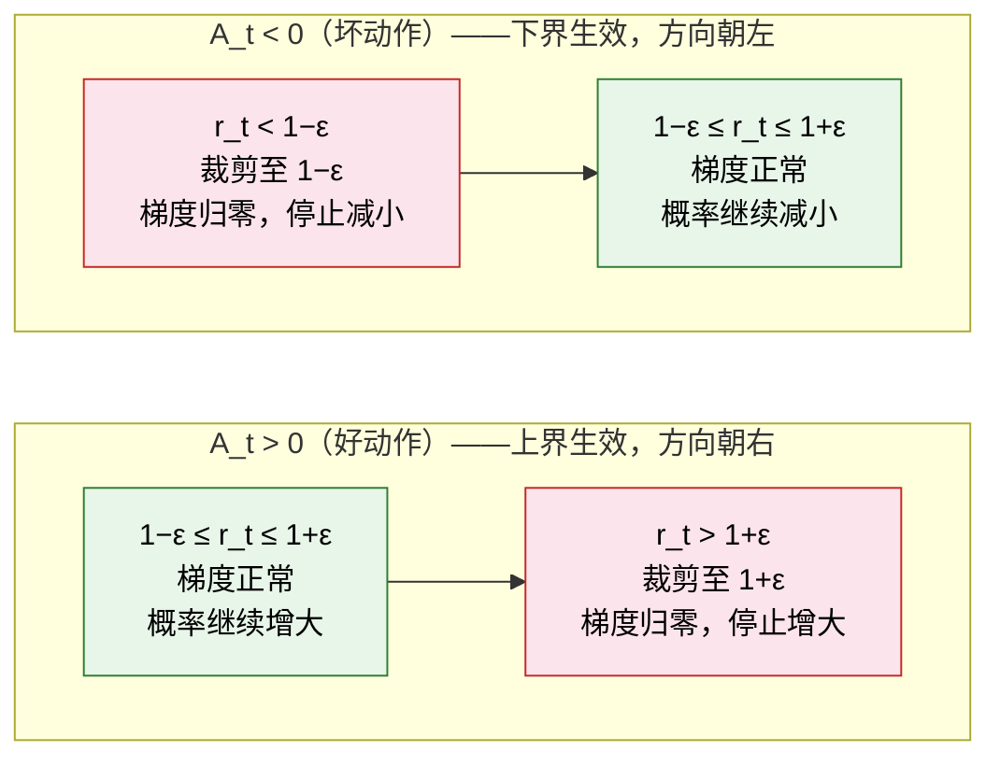

# 7.3 策略更新的约束机制

## 本节导读

第 7.2 节推导出 PPO 的裁剪代理目标：

$$L^{\text{CLIP}}(\theta) = \mathbb{E}_t \left[ \min \left( r_t(\theta) \cdot A_t, \; \text{clip}(r_t(\theta), 1-\varepsilon, 1+\varepsilon) \cdot A_t \right) \right]$$

该目标包含策略比率 $r_t$、裁剪操作 clip 以及外层的 min。本节回答两个问题：**这一公式保护的对象是什么？为何不能直接采用原始策略梯度？**

推导线索为：原始策略梯度的更新风险 → 重要性采样实现数据复用 → TRPO 的 KL 散度约束 → PPO 的裁剪近似。整组公式的核心动机只有一个：**约束单次更新的幅度，防止策略被一次更新破坏**。

为便于推导，本节贯穿使用同一个微型示例：状态 $s$ 下有两个动作 $a_1, a_2$，策略初始概率为 $\pi(a_1\mid s) = 0.6$、$\pi(a_2\mid s) = 0.4$。核心问题是：若一次更新将 $\pi(a_1\mid s)$ 推至 $0.99$，会产生什么后果？

::: tip 本节前置知识

- [策略梯度更新公式](../chapter05_policy_gradient/reinforce)——裁剪要保护的正是这个更新
- [优势函数 $A(s,a)$](../chapter06_actor_critic/advantage-function)——策略更新的方向信号
  :::

## 原始策略梯度的更新风险

回顾第 5 章的策略梯度更新（[REINFORCE](../chapter05_policy_gradient/reinforce)）：

$$\theta \leftarrow \theta + \alpha \cdot \nabla_\theta \log \pi_\theta(a\mid s) \cdot A(s,a)$$

当动作 $a$ 的优势 $A(s,a) > 0$（优于平均）时，参数沿增大 $\pi(a\mid s)$ 的方向更新。**问题在于：该更新的幅度没有上界约束**。

代入微型示例。设采样到 $(s, a_1)$，其优势 $A(s, a_1) = 2$，学习率 $\alpha = 0.5$。单次更新的结果为：

|                  | 更新前 | 更新后 |
| ---------------- | ------ | ------ |
| $\pi(a_1\mid s)$ | 0.6    | 0.99   |
| $\pi(a_2\mid s)$ | 0.4    | 0.01   |

仅一次更新，$a_1$ 的概率从 0.6 升至 0.99。然而这只是**单次采样**的结果——若高优势源于采样偶然性，策略已将另一动作的概率压缩至 0.01。**策略更新不可逆，没有撤销机制**。

下一轮更新更为严重。训练数据在更新前的旧策略 $\pi_{\text{old}}$ 下采集，当尝试复用同一批数据时，$a_1$ 在新策略下的概率已为 0.99，与采样时的 0.6 严重偏离。**旧数据失效**。

原始策略梯度的核心困境在于：**单步更新的方差较大，而策略更新不可逆**。一次失当的更新将导致整批数据作废。

> 既然单次更新即可破坏策略，那么在考虑"更新多少"之前，是否应先确保"用旧数据训练新策略"这一操作本身是安全的？

## 重要性采样与数据复用

第一个问题是数据复用。$(s, a_1)$ 样本在 $\pi_{\text{old}}(a_1\mid s) = 0.6$ 下采集，能否用它更新已变为 $\pi_\theta(a_1\mid s) = 0.99$ 的新策略？

数学上可行，其工具是**重要性采样**（Importance Sampling）。同一事件在不同分布下的期望可通过一个概率比值进行转换：

$$\mathbb{E}_{a \sim \pi_{\text{old}}} \left[ \frac{\pi_\theta(a\mid s)}{\pi_{\text{old}}(a\mid s)} \cdot f(a) \right] = \mathbb{E}_{a \sim \pi_\theta} [f(a)]$$

该比值 $r_t(\theta) = \frac{\pi_\theta(a_t\mid s_t)}{\pi_{\text{old}}(a_t\mid s_t)}$ 称为**策略比率**（Policy Ratio），衡量新策略相对于旧策略在同一 $(s,a)$ 上的概率变化。

代入示例：

| 策略                       | $\pi(a_1\mid s)$ |
| -------------------------- | ---------------- |
| 旧策略 $\pi_{\text{old}}$  | 0.6              |
| 新策略 $\pi_\theta$        | 0.99             |
| $r_t(\theta) = 0.99 / 0.6$ | **1.65**         |

新策略将 $a_1$ 的概率放大至 1.65 倍。将该比值引入策略梯度，得到含重要性采样的目标：

$$L^{\text{IS}}(\theta) = \mathbb{E}_t \left[ r_t(\theta) \cdot A_t \right]$$

形式上，旧数据可用于评估新策略。但 1.65 这一数值也暴露了问题：**梯度被放大 1.65 倍**。若策略更激进地将 $\pi(a_1\mid s)$ 推至 0.999，则 $r_t = 1.665$；推至 0.9999，则 $r_t = 1.6665$。$r_t$ 越大，下一次更新的幅度越大，进而使 $r_t$ 进一步增大——形成**正反馈循环**。

重要性采样解决了数据复用问题，但未提供安全利用的保障。

> 原始策略梯度单步即出现风险，重要性采样又允许 $r_t$ 无限增大。能否将"单次更新幅度受限"这一要求以数学形式严格表述？

## TRPO 与 KL 散度约束

2015 年，Schulman 等人给出的方案是：**直接约束新旧策略之间的距离**。衡量两个概率分布差异的标准工具为 KL 散度（Kullback-Leibler divergence），将其表述为硬约束：

$$\max_\theta \; \mathbb{E}_t \left[ r_t(\theta) \cdot A_t \right] \quad \text{s.t.} \quad \mathbb{E}_t \left[ D_{\text{KL}}(\pi_{\text{old}} \| \pi_\theta) \right] \leq \delta$$

该优化问题包含两部分：左侧 $\max_\theta \; \mathbb{E}_t[r_t(\theta) \cdot A_t]$ 是待最大化的目标——即重要性采样目标，追求更高的累积优势；右侧 $\mathbb{E}_t[D_{\text{KL}}(\pi_{\text{old}} \| \pi_\theta)] \leq \delta$ 是必须满足的约束条件。其中 "s.t." 读作 "subject to"（受约束于）。

KL 散度衡量两个概率分布的差异程度，其定义为：

$$D_{\text{KL}}(P \| Q) = \sum_i P(i) \log \frac{P(i)}{Q(i)}$$

当两个分布完全相同时，$D_{\text{KL}} = 0$；差异越大，$D_{\text{KL}}$ 越大（始终非负）。式中 $\pi_{\text{old}}$ 为更新前的旧策略，$\pi_\theta$ 为更新后的新策略，因此 $D_{\text{KL}}(\pi_{\text{old}} \| \pi_\theta)$ 衡量一次更新使策略分布改变的程度。约束条件要求这一改变量不超过 $\delta$。

代入微型示例。$\pi_{\text{old}}(a_1) = 0.6$，$\pi_\theta(a_1) = 0.99$，则：

$$D_{\text{KL}}(\pi_{\text{old}} \| \pi_\theta) = 0.6 \ln\frac{0.6}{0.99} + 0.4 \ln\frac{0.4}{0.01} \approx 0.6 \times (-0.50) + 0.4 \times 3.69 \approx 1.18$$

结果约为 1.18，远超 $\delta = 0.01$。TRPO 在此情形下将直接拒绝该更新，并将策略拉回信任域内。

$\delta$ 通常取 0.01，即每次更新后策略的行为分布最多改变 1%。这定义了一个**信任域**（trust region）：策略可在域内自由变动，一旦越界则更新被拒绝。

理论上严谨，工程上却存在困难。求解该约束优化问题需要 Hessian 矩阵（参数的二阶导数）。对于百万参数规模的网络，Hessian 的维度为参数数量的平方，无法存入显存。在 LLM 场景中，策略本身是 70B 参数的语言模型，计算其 Hessian 完全不可行。TRPO 采用共轭梯度法进行近似，但仍然速度慢且实现复杂。**严格约束的代价是计算成本**。

> TRPO 的约束过于精确，导致计算成本难以承受。是否存在一种方法，约束力度不如 TRPO 严格，但仍能有效限制单次更新幅度？

## PPO 裁剪机制

2017 年，Schulman 提出 PPO（Proximal Policy Optimization），给出 TRPO 的工程近似方案：**不再精确测量策略距离，而是直接对 $r_t$ 进行截断**——将 $r_t$ 约束在 $[1-\varepsilon, 1+\varepsilon]$ 内，超出部分被截断至边界。

PPO 的目标函数：

$$L^{\text{CLIP}}(\theta) = \mathbb{E}_t \left[ \min \left( r_t(\theta) \cdot A_t, \; \text{clip}(r_t(\theta), 1-\varepsilon, 1+\varepsilon) \cdot A_t \right) \right]$$

将前文的 1.65 例子代入（取 $\varepsilon = 0.2$、$A_t = 2$）：

| 项        | 计算                                                 | 值         |
| --------- | ---------------------------------------------------- | ---------- |
| 未裁剪    | $r_t \cdot A_t = 1.65 \times 2$                      | $3.30$     |
| 裁剪值    | $\text{clip}(1.65, 0.8, 1.2) \cdot 2 = 1.2 \times 2$ | $2.40$     |
| $\min$ 取 | —                                                    | **$2.40$** |

裁剪将较大的目标值（3.30）压缩至 2.40。此时目标函数在该区间内变为常数，**梯度对 $\theta$ 的依赖消失，不再鼓励继续增大 $\pi(a_1\mid s)$**。

该公式由三项构成，各司其职：

- **未裁剪项** $r_t(\theta) \cdot A_t$：重要性采样后的标准策略梯度目标，即策略比率与优势的乘积。
- **裁剪项** $\text{clip}(r_t(\theta), 1-\varepsilon, 1+\varepsilon) \cdot A_t$：将 $r_t$ 约束在 $[1-\varepsilon, 1+\varepsilon]$ 内。$\varepsilon$ 通常取 0.1 或 0.2，对应策略概率的最大变化幅度为 10% 或 20%。
- **取最小值** $\min(\cdot, \cdot)$：在两者中选取更保守的一项。

### 裁剪机制的方向性

裁剪的效果取决于优势 $A_t$ 的正负，上下界分别在不同情形下生效：

**当 $A_t > 0$（好动作）时**：更新方向应增大 $r_t(\theta)$。裁剪将 $r_t$ 的上界限制为 $1+\varepsilon$，超过该值即被截断。即使某个好动作具有很高的优势，策略概率也不会无限制地朝该方向增长。

**当 $A_t < 0$（坏动作）时**：更新方向应减小 $r_t(\theta)$。裁剪将 $r_t$ 的下界限制为 $1-\varepsilon$，防止策略概率过度降低。



如图所示，$r_t$ 仅在偏离 1 的"顺优势方向"上受裁剪约束：$A_t > 0$ 时上界 $1+\varepsilon$ 生效，$A_t < 0$ 时下界 $1-\varepsilon$ 生效。一旦 $r_t$ 越出对应边界，梯度归零，更新停止。

然而此处隐含一个问题：若 $r_t$ 越出的是**反方向**边界——例如 $A_t > 0$ 应增大 $r_t$，但 $r_t$ 反而跌破 $1-\varepsilon$——裁剪项本身能否处理？这正是外层 $\min$ 存在的理由。

### min 操作的作用

裁剪项已将 $r_t$ 约束在 $[1-\varepsilon, 1+\varepsilon]$ 内，为何还需要外层的 $\min$？原因在于反方向越界的情形。

设 $\varepsilon = 0.2$（裁剪区间为 $[0.8, 1.2]$），$A_t = 2$（好动作，应增大 $r_t$）。若某次更新方向有误，$r_t$ 不增反降至 $0.5$，低于下界 $0.8$。此时两种处理方式给出不同结果：

| 做法                                 | 目标值               | 梯度                     | 更新结果           |
| ------------------------------------ | -------------------- | ------------------------ | ------------------ |
| 纯裁剪 $\text{clip}(r_t,0.8,1.2)A_t$ | $0.8 \times 2 = 1.6$ | 零（该区间内目标为常数） | 策略停滞，无法回退 |
| $\min$ 选取未裁剪值 $r_t A_t$        | $0.5 \times 2 = 1.0$ | 非零，方向为增大 $r_t$   | 策略被拉回安全区间 |

$\min$ 比较 $1.6$ 与 $1.0$，选取较小的 $1.0$，即未裁剪值。该项的梯度方向为增大 $r_t$，将策略推回裁剪区间内。纯裁剪在该区间内目标函数为常数，梯度为零，策略无法自行返回。

四种情形汇总如下：

| $A_t$ | $r_t$ 的位置         | 更新方向            | $\min$ 选取 | 结果             |
| ----- | -------------------- | ------------------- | ----------- | ---------------- |
| $> 0$ | 超过 $1+\varepsilon$ | 与 $A_t$ 一致，越界 | 裁剪值      | 停止更新         |
| $< 0$ | 低于 $1-\varepsilon$ | 与 $A_t$ 一致，越界 | 裁剪值      | 停止更新         |
| $> 0$ | 低于 $1-\varepsilon$ | **与 $A_t$ 相反**   | 未裁剪值    | **拉回安全区间** |
| $< 0$ | 超过 $1+\varepsilon$ | **与 $A_t$ 相反**   | 未裁剪值    | **拉回安全区间** |

**前两行**：更新方向与 $A_t$ 一致，仅幅度过大而越界。$\min$ 选取裁剪值，梯度归零，更新停止——与纯裁剪的效果相同。

**后两行**：更新方向与 $A_t$ 相反。例如 $A_t > 0$ 应增大 $r_t$，但 $r_t$ 反而跌破下界 $1-\varepsilon$。纯裁剪在该区间梯度为零，策略无法纠正；$\min$ 在这两行选取未裁剪值，保留了将 $r_t$ 推回安全区间的梯度。

**$\min$ 的作用，是为"更新方向错误"的情形保留纠偏梯度，使策略能够返回裁剪区间。**

> 若将 $\min$ 替换为 $\max$，前两行将变为"鼓励继续越界"，裁剪机制完全失效。因此必须使用 $\min$。

## 裁剪机制的可视化

以下代码用于直观展示裁剪目标函数的行为：

```python
import numpy as np
import matplotlib.pyplot as plt

# ==========================================
# 可视化 PPO Clip 目标函数
# ==========================================
epsilon = 0.2
r = np.linspace(0.0, 2.0, 500)  # 策略比率 r_t(θ)

def ppo_clip_objective(r, A, eps=0.2):
    """PPO 裁剪目标：L = min(r * A, clip(r, 1-eps, 1+eps) * A)"""
    r_clipped = np.clip(r, 1 - eps, 1 + eps)
    return np.minimum(r * A, r_clipped * A)

fig, (ax1, ax2) = plt.subplots(1, 2, figsize=(12, 5))

# A > 0 的情况
A_pos = 1.0
obj_pos = ppo_clip_objective(r, A_pos)
ax1.plot(r, r * A_pos, 'b--', alpha=0.5, label='未裁剪: r × A')
ax1.plot(r, obj_pos, 'r-', linewidth=2, label='PPO: min(r×A, clip(r)×A)')
ax1.axvline(x=1+epsilon, color='gray', linestyle=':', label=f'1+ε={1+epsilon}')
ax1.axvline(x=1-epsilon, color='gray', linestyle=':', label=f'1-ε={1-epsilon}')
ax1.set_title('A > 0（好动作）')
ax1.set_xlabel('策略比率 r_t(θ)')
ax1.set_ylabel('目标值')
ax1.legend()

# A < 0 的情况
A_neg = -1.0
obj_neg = ppo_clip_objective(r, A_neg)
ax2.plot(r, r * A_neg, 'b--', alpha=0.5, label='未裁剪: r × A')
ax2.plot(r, obj_neg, 'r-', linewidth=2, label='PPO: min(r×A, clip(r)×A)')
ax2.axvline(x=1+epsilon, color='gray', linestyle=':', label=f'1+ε={1+epsilon}')
ax2.axvline(x=1-epsilon, color='gray', linestyle=':', label=f'1-ε={1-epsilon}')
ax2.set_title('A < 0（坏动作）')
ax2.set_xlabel('策略比率 r_t(θ)')
ax2.legend()

plt.suptitle('PPO Clip 目标函数行为（ε=0.2）', fontsize=14)
plt.tight_layout()
plt.savefig("ppo_clip_visualization.png", dpi=150)
print("裁剪函数可视化已保存")
```

运行结果如下：当 $A > 0$ 时，目标函数在 $r_t > 1.2$ 后趋于平坦（梯度为零，更新停止）；当 $A < 0$ 时，目标函数在 $r_t < 0.8$ 后趋于平坦。这正是 PPO 裁剪的核心效果——策略比率超出安全区间后，梯度自动消失。

## ε 的敏感性

$\varepsilon$ 的选择直接影响训练效果，以下为经验性总结：

| ε 值 | 更新幅度 | 训练速度   | 稳定性   | 适用场景                   |
| ---- | -------- | ---------- | -------- | -------------------------- |
| 0.05 | 很小     | 很慢       | 极其稳定 | 精调已训练好的策略         |
| 0.1  | 较小     | 较慢       | 稳定     | LLM 对齐（参数多，更脆弱） |
| 0.2  | 中等     | 适中       | 适中     | 游戏/控制任务（默认值）    |
| 0.3  | 较大     | 较快       | 不稳定   | 快速实验/简单任务          |
| 0.5  | 很大     | 快但容易崩 | 很不稳定 | 不推荐                     |

在 LLM 对齐场景中，通常使用更小的 $\varepsilon$（0.1 甚至更小），因为语言模型的策略空间更大、更脆弱，一次不恰当的更新可能导致语言能力退化（例如丧失已习得的语种能力）。

<details>
<summary>思考题：如果 PPO 的裁剪让训练"太保守"，有没有办法在不牺牲稳定性的前提下加快训练？</summary>

有几个常见的策略：

1. **自适应 ε**：PPO-PPG（Phasic Policy Gradient）建议在训练早期用较大的 ε，后期逐渐缩小。类似"先大步探索，再小步精调"。
2. **增加更新轮数**：PPO 默认用同一批数据更新 10 个 epoch。如果裁剪让每步更新很小，可以通过增加 epoch 数来累积更新量。
3. **KL 散度早停**：同时监控 KL 散度，如果在某个 epoch 内 KL 超过阈值就停止更新——这相当于把 TRPO 的思想和 PPO 的裁剪结合了起来。

在实践中，第 2 种方法最常用——PPO 默认的 `n_epochs=10` 本身就是为了在裁剪限制下通过多轮累积来实现足够的更新量。

</details>

<details>
<summary>思考题：TRPO 理论上更严谨，为什么工业界几乎都选 PPO？</summary>

因为在工程实践中，"简单可靠"几乎总是打败"理论完美"。TRPO 需要计算二阶导数（Hessian 向量积），这在大规模模型上非常慢，而且实现复杂，容易出 bug。PPO 只需要一个简单的 `torch.clamp` 操作，实现不到 10 行代码。

OpenAI 在 2017 年的论文中用大量实验证明：PPO 在大多数任务上的表现与 TRPO 相当甚至更好。原因是 TRPO 的二阶近似本身也有误差，精确求解并不一定比 PPO 的启发式裁剪更好。

这个选择在 LLM 时代更加正确——70B 参数的语言模型，二阶优化根本不可行。OpenAI 自己在 InstructGPT 和 GPT-4 的对齐训练中也使用的是 PPO，而不是 TRPO。

</details>

至此，PPO 裁剪机制的完整推导已展开：从原始策略梯度的更新风险，到重要性采样的数据复用，再到 TRPO 的 KL 约束与 PPO 的裁剪近似。但 PPO 尚有另一个关键组件未涉及：GAE（广义优势估计），以及它在 LLM 对齐中引出的主要负担——奖励模型。详见 [优势估计与奖励建模](./gae-reward-model)。
