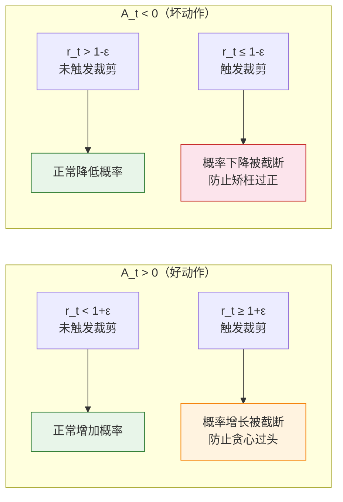

# 7.3 信任域与裁剪——策略更新的安全带

前面我们跑通了 PPO 的 LunarLander 实验，也推导了裁剪代理目标的数学形式。但一个核心问题还没回答：裁剪机制到底在保护什么？为什么简单的策略梯度会崩溃？这一切要从"策略更新的危险性"说起。

## 朴素策略梯度的问题：一步错，满盘皆输

回顾第 5 章的策略梯度更新公式：

$$\theta \leftarrow \theta + \alpha \cdot \nabla_\theta \log \pi_\theta(a|s) \cdot A(s,a)$$

这个公式的意思是：如果动作 $a$ 的优势 $A(s,a) > 0$（比平均好），就沿着让 $\pi(a|s)$ 增大的方向更新参数。看起来很合理，但问题是——**更新幅度没有限制**。

想象一个场景：某个状态下，策略给动作 $a_1$ 的概率是 0.6，给 $a_2$ 的概率是 0.4。如果一次更新把 $a_1$ 的概率直接推到 0.99，$a_2$ 就只剩 0.01。但这仅仅基于这一次的样本——万一这个样本恰好是运气好呢？策略就把一条可能很不错的路给堵死了。更糟糕的是，策略一旦大幅改变，之前收集的数据就不再适用了——因为这些数据是在"旧策略"下收集的。

这就是朴素策略梯度的核心困境：**单步更新的方差很大，但策略更新是不可逆的**。一旦更新过头，没有"撤销"按钮。

## 重要性采样：让旧数据不被浪费

要限制更新幅度，首先需要解决一个数学问题：训练数据是用旧策略 $\pi_{\text{old}}$ 收集的，但我们想更新新策略 $\pi_\theta$。能不能用旧数据来评估新策略的表现？

答案是可以的，靠的是**重要性采样**（Importance Sampling）。核心思想是：同一个事件在不同分布下的期望可以通过一个"比值"来转换：

$$\mathbb{E}_{a \sim \pi_{\text{old}}} \left[ \frac{\pi_\theta(a|s)}{\pi_{\text{old}}(a|s)} \cdot f(a) \right] = \mathbb{E}_{a \sim \pi_\theta} [f(a)]$$

这个比值 $r_t(\theta) = \frac{\pi_\theta(a_t|s_t)}{\pi_{\text{old}}(a_t|s_t)}$ 叫做**策略比率**（Policy Ratio），它衡量的是新旧策略在同一状态-动作对上的概率比：

- $r_t(\theta) = 1$：新旧策略一样，没变化
- $r_t(\theta) > 1$：新策略更倾向于选这个动作
- $r_t(\theta) < 1$：新策略更不倾向于选这个动作

有了重要性采样，我们可以把策略梯度目标改写为：

$$L^{\text{IS}}(\theta) = \mathbb{E}_t \left[ \frac{\pi_\theta(a_t|s_t)}{\pi_{\text{old}}(a_t|s_t)} \cdot A_t \right] = \mathbb{E}_t \left[ r_t(\theta) \cdot A_t \right]$$

看起来很完美——用旧数据就能评估新策略。但这里藏着一个危险的陷阱：**如果 $r_t(\theta)$ 变得很大（比如 10 或 100），梯度也会被放大同样的倍数**。一次更新就可能让策略发生天翻地覆的变化。重要性采样给了我们"重复利用旧数据"的能力，但没有给出"安全利用"的保障。

## TRPO：用 KL 散度划定信任域

2015 年，Schulman 等人提出了 TRPO（Trust Region Policy Optimization），用严格的数学工具来限制策略更新的幅度。TRPO 的思路是：**每次更新后，新旧策略之间的 KL 散度不能超过一个阈值 $\delta$**。

$$\max_\theta \; \mathbb{E}_t \left[ r_t(\theta) \cdot A_t \right] \quad \text{s.t.} \quad \mathbb{E}_t \left[ D_{\text{KL}}(\pi_{\text{old}} \| \pi_\theta) \right] \leq \delta$$

KL 散度 $D_{\text{KL}}$ 是衡量两个概率分布"距离"的标准工具。$\delta$ 通常设为 0.01——意味着每次更新后，策略的行为分布只能改变一点点。这就像画了一个"信任域"（Trust Region），策略只能在域内安全移动，不能越界。

TRPO 的数学理论非常优雅，但它的工程实现有一个致命缺陷：**需要计算 Hessian 矩阵**（二阶导数）。对于一个有数百万参数的神经网络，Hessian 矩阵的维度是"参数数量的平方"——根本放不进显存。TRPO 用了一个叫"共轭梯度法"的技巧来近似计算，但仍然非常慢。

更重要的是，在 LLM 场景下，策略网络可能是一个 70B 参数的语言模型。计算它的 Hessian 矩阵？算力上根本不现实。

## PPO：裁剪——一阶近似的工程智慧

2017 年，还是 Schulman，提出了 PPO（Proximal Policy Optimization）。PPO 的核心洞察是：**与其精确计算信任域（TRPO 的做法），不如直接裁剪掉"不安全"的更新**。

PPO 的目标函数：

$$L^{\text{CLIP}}(\theta) = \mathbb{E}_t \left[ \min \left( r_t(\theta) \cdot A_t, \; \text{clip}(r_t(\theta), 1-\varepsilon, 1+\varepsilon) \cdot A_t \right) \right]$$

别被公式吓到，让我们一步步拆解：

**第一部分：未裁剪的目标** $r_t(\theta) \cdot A_t$。这就是重要性采样后的标准策略梯度目标——策略比率乘以优势。

**第二部分：裁剪后的目标** $\text{clip}(r_t(\theta), 1-\varepsilon, 1+\varepsilon) \cdot A_t$。裁剪函数把策略比率限制在 $[1-\varepsilon, 1+\varepsilon]$ 之间。$\varepsilon$ 通常取 0.1 或 0.2，意味着策略概率最多变化 10% 或 20%。

**第三部分：取最小值** $\min(\cdot, \cdot)$。PPO 取两者中更保守（更小）的那个，确保目标函数不会给"过于激进"的更新太高的奖励。

### 裁剪机制的两面

裁剪的效果取决于优势 $A_t$ 的正负：

**当 $A_t > 0$（好动作）时**：我们希望增大 $r_t(\theta)$（增加好动作的概率）。但裁剪把 $r_t$ 限制在 $1+\varepsilon$ 以内——超过这个值就被截断。这意味着即使某个好动作被极度偏好，策略也不会无节制地往那个方向冲。防止"好的就贪心过头"。

**当 $A_t < 0$（坏动作）时**：我们希望减小 $r_t(\theta)$（降低坏动作的概率）。裁剪把 $r_t$ 限制在 $1-\varepsilon$ 以上。防止"坏的就矫枉过正"。



用一个比喻来说：**TRPO 是一部严格的法律条文**——它精确地测量每次更新是否符合规定（KL 散度 < $\delta$），违者必究，但执行成本高昂。**PPO 是一条务实的经验法则**——它用一个简单的裁剪操作近似实现同样的效果，不追求理论上的完美，但工程上简单高效。

### 为什么 min 操作是关键？

你可能会问：既然裁剪已经限制了 $r_t$，为什么还要取 $\min$？直接用裁剪后的值不就行了？

原因在于**梯度方向**。考虑 $A_t > 0$、$r_t > 1+\varepsilon$ 的情况：

- 裁剪后的目标值是 $(1+\varepsilon) \cdot A_t$，梯度为零——更新停止了
- 未裁剪的目标值是 $r_t \cdot A_t > (1+\varepsilon) \cdot A_t$，梯度不为零

如果取 $\max$（两者中更大的），裁剪就失效了——即使 $r_t$ 已经超出安全范围，目标函数仍然会鼓励它继续增大。取 $\min$ 确保了一旦 $r_t$ 超出 $[1-\varepsilon, 1+\varepsilon]$，目标函数就不再提供"继续偏离"的动力。

## 用代码理解裁剪

让我们用一小段代码来直观感受裁剪的效果：

```python
import numpy as np
import matplotlib.pyplot as plt

# ==========================================
# 可视化 PPO Clip 目标函数
# ==========================================
epsilon = 0.2
r = np.linspace(0.0, 2.0, 500)  # 策略比率 r_t(θ)

def ppo_clip_objective(r, A, eps=0.2):
    """PPO 裁剪目标：L = min(r * A, clip(r, 1-eps, 1+eps) * A)"""
    r_clipped = np.clip(r, 1 - eps, 1 + eps)
    return np.minimum(r * A, r_clipped * A)

fig, (ax1, ax2) = plt.subplots(1, 2, figsize=(12, 5))

# A > 0 的情况
A_pos = 1.0
obj_pos = ppo_clip_objective(r, A_pos)
ax1.plot(r, r * A_pos, 'b--', alpha=0.5, label='未裁剪: r × A')
ax1.plot(r, obj_pos, 'r-', linewidth=2, label='PPO: min(r×A, clip(r)×A)')
ax1.axvline(x=1+epsilon, color='gray', linestyle=':', label=f'1+ε={1+epsilon}')
ax1.axvline(x=1-epsilon, color='gray', linestyle=':', label=f'1-ε={1-epsilon}')
ax1.set_title('A > 0（好动作）')
ax1.set_xlabel('策略比率 r_t(θ)')
ax1.set_ylabel('目标值')
ax1.legend()

# A < 0 的情况
A_neg = -1.0
obj_neg = ppo_clip_objective(r, A_neg)
ax2.plot(r, r * A_neg, 'b--', alpha=0.5, label='未裁剪: r × A')
ax2.plot(r, obj_neg, 'r-', linewidth=2, label='PPO: min(r×A, clip(r)×A)')
ax2.axvline(x=1+epsilon, color='gray', linestyle=':', label=f'1+ε={1+epsilon}')
ax2.axvline(x=1-epsilon, color='gray', linestyle=':', label=f'1-ε={1-epsilon}')
ax2.set_title('A < 0（坏动作）')
ax2.set_xlabel('策略比率 r_t(θ)')
ax2.legend()

plt.suptitle('PPO Clip 目标函数行为（ε=0.2）', fontsize=14)
plt.tight_layout()
plt.savefig("ppo_clip_visualization.png", dpi=150)
print("裁剪函数可视化已保存")
```

运行这段代码你会看到：当 $A > 0$ 时，目标在 $r_t > 1.2$ 后变平（梯度为零，停止更新）；当 $A < 0$ 时，目标在 $r_t < 0.8$ 后变平。这就是 PPO 的"安全带"——策略比率超出安全区间后，梯度自动消失。

## ε 的敏感性：太大太小都不行

$\varepsilon$ 的选择直接影响训练效果，这里是一个经验总结：

| ε 值 | 更新幅度 | 训练速度   | 稳定性   | 适用场景                   |
| ---- | -------- | ---------- | -------- | -------------------------- |
| 0.05 | 很小     | 很慢       | 极其稳定 | 精调已训练好的策略         |
| 0.1  | 较小     | 较慢       | 稳定     | LLM 对齐（参数多，更脆弱） |
| 0.2  | 中等     | 适中       | 适中     | 游戏/控制任务（默认值）    |
| 0.3  | 较大     | 较快       | 不稳定   | 快速实验/简单任务          |
| 0.5  | 很大     | 快但容易崩 | 很不稳定 | 不推荐                     |

在 LLM 对齐场景中，通常使用更小的 $\varepsilon$（0.1 甚至更小），因为语言模型的策略空间更大、更脆弱，一次不恰当的更新可能导致语言能力退化（比如"忘了怎么说中文"）。

<details>
<summary>思考题：如果 PPO 的裁剪让训练"太保守"，有没有办法在不牺牲稳定性的前提下加快训练？</summary>

有几个常见的策略：

1. **自适应 ε**：PPO-PPG（Phasic Policy Gradient）建议在训练早期用较大的 ε，后期逐渐缩小。类似"先大步探索，再小步精调"。
2. **增加更新轮数**：PPO 默认用同一批数据更新 10 个 epoch。如果裁剪让每步更新很小，可以通过增加 epoch 数来累积更新量。
3. **KL 散度早停**：同时监控 KL 散度，如果在某个 epoch 内 KL 超过阈值就停止更新——这相当于把 TRPO 的思想和 PPO 的裁剪结合了起来。

在实践中，第 2 种方法最常用——PPO 默认的 `n_epochs=10` 本身就是为了在裁剪限制下通过多轮累积来实现足够的更新量。

</details>

<details>
<summary>思考题：TRPO 理论上更严谨，为什么工业界几乎都选 PPO？</summary>

因为在工程实践中，"简单可靠"几乎总是打败"理论完美"。TRPO 需要计算二阶导数（Hessian 向量积），这在大规模模型上非常慢，而且实现复杂，容易出 bug。PPO 只需要一个简单的 `torch.clamp` 操作，实现不到 10 行代码。

OpenAI 在 2017 年的论文中用大量实验证明：PPO 在大多数任务上的表现与 TRPO 相当甚至更好。原因是 TRPO 的二阶近似本身也有误差，精确求解并不一定比 PPO 的启发式裁剪更好。

这个选择在 LLM 时代更加正确——70B 参数的语言模型，二阶优化根本不可行。OpenAI 自己在 InstructGPT 和 GPT-4 的对齐训练中也使用的是 PPO，而不是 TRPO。

</details>

现在你理解了 PPO 裁剪机制的来龙去脉——从朴素策略梯度的崩溃问题，到重要性采样的数据复用，再到 TRPO 的 KL 约束和 PPO 的裁剪近似。但 PPO 还有另一个关键组件我们没展开：GAE（广义优势估计），以及它在 LLM 对齐中引出的最大负担——Reward Model。让我们继续——[GAE、奖励模型与 LLM 对齐](./gae-reward-model)。
