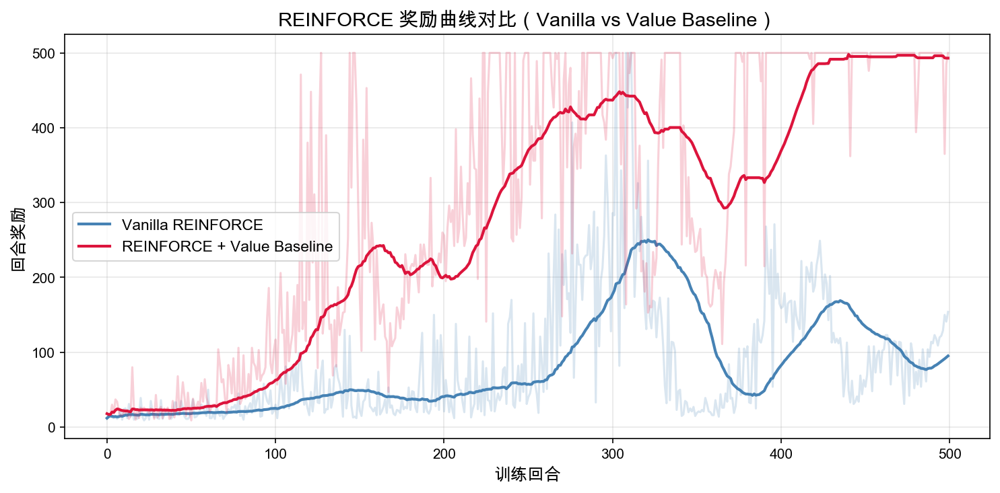

# 5.5 动手 与 带基线的策略梯度

> **本节目标**：在 `CartPole-v1` 上对比原始 REINFORCE 和 REINFORCE + Value Baseline，观察 $V(s)$ 如何让策略梯度训练更快、更稳。

> **本节代码**：[reinforce_with_baseline.py](https://github.com/walkinglabs/hands-on-modern-rl/blob/main/code/chapter08_policy_gradient/reinforce_with_baseline.py) · [render_cartpole_baseline.py](https://github.com/walkinglabs/hands-on-modern-rl/blob/main/code/chapter08_policy_gradient/render_cartpole_baseline.py) · [reinforce_cartpole.py](https://github.com/walkinglabs/hands-on-modern-rl/blob/main/code/chapter08_policy_gradient/reinforce_cartpole.py) · [requirements.txt](https://github.com/walkinglabs/hands-on-modern-rl/blob/main/code/chapter08_policy_gradient/requirements.txt)

前两节分别跑了 vanilla REINFORCE 和推导了基线降方差的数学原理。本节把两者放在一起对比，看看 $G_t - V(s_t)$ 相比 $G_t$ 的实际效果。

## 运行对比实验

```bash
pip install -r code/chapter08_policy_gradient/requirements.txt
```

```bash
python code/chapter08_policy_gradient/reinforce_with_baseline.py
```

这个脚本会训练两个策略：

| 实验                       | 更新信号       | 额外网络      | 直观含义                             |
| -------------------------- | -------------- | ------------- | ------------------------------------ |
| Vanilla REINFORCE          | $G_t$          | 无            | 只看这一回合之后实际拿了多少分       |
| REINFORCE + Value Baseline | $G_t - V(s_t)$ | Value Network | 看实际结果比当前状态的平均预期好多少 |

两个版本使用同一个 CartPole 环境和同一种策略网络。区别只在更新权重：原始版本用完整回报 $G_t$；Value Baseline 版本先训练一个价值网络估计 $V(s_t)$，再用优势 $G_t - V(s_t)$ 更新策略。

脚本结束后会生成两张图：

| 输出文件                                            | 说明                       |
| --------------------------------------------------- | -------------------------- |
| `output/reinforce_baseline_reward_comparison.png`   | 两种方法的回合奖励曲线     |
| `output/reinforce_baseline_variance_comparison.png` | 两种方法的梯度估计方差曲线 |

如果希望同时导出回放 GIF：

```bash
python code/chapter08_policy_gradient/render_cartpole_baseline.py \
  --episodes 500 \
  --seed 0
```

## 看奖励曲线



图中浅色线是单个 episode 的原始回报，深色线是滑动平均。

这次运行中，原始 REINFORCE 的最后 50 回合平均回报约为 `95.1`——它确实在学习，但过程比较慢，中途还有明显回落。加入价值基线后，最后 50 回合平均回报约为 `493.0`，已经非常接近 CartPole 的 `500` 步上限。

这个差异说明：价值基线不是一个装饰性的数学项。在同一个任务中，它能让策略更快进入"基本能立住杆子"的区域，并减少训练后期突然退步的概率。

## 看回放

曲线说明平均趋势，回放则说明策略到底在做什么。

**Vanilla REINFORCE：能坚持一段时间，但仍然容易越调越偏。**
这次渲染回报为 `166`。它已经不再是随机策略，但杆子偏离后修正不够稳定。


**REINFORCE + Value Baseline：更稳定地把杆子拉回中心附近。**
这次渲染回报为 `355`。动作修正明显更连贯，杆子偏离时更容易被拉回来。


## 看方差曲线

奖励曲线回答"策略表现是否变好"。方差曲线回答另一个问题：为什么价值基线会让训练更稳？


这张图画的是滑动窗口中的梯度估计方差。数值越大，说明不同 episode 给出的更新方向差异越大；数值越小，说明策略每次更新更一致。

这次运行中，原始 REINFORCE 的梯度估计方差约为 `100.41`，Value Baseline 版本约为 `38.27`。Value Baseline 把方差降到了原来的约 `38.1%`。这和奖励曲线中的现象对应起来：更新信号更稳，策略就更容易持续朝着"让杆子站住"的方向移动。

## 代码里到底改了什么

原始 REINFORCE 的核心更新：

```python
returns_t = torch.FloatTensor(returns)
log_probs = torch.log(action_probs + 1e-8)
loss = -(log_probs * returns_t).mean()
```

这里的 `returns_t` 就是 $G_t$。如果某一回合刚好撑了很久，这段轨迹里的所有动作都会被较大权重强化——包括很多"碰巧没有出事"的动作。

加入价值基线后，脚本多了一个价值网络：

```python
values = value_net(states_t)
value_loss = nn.MSELoss()(values, returns_t)
```

价值网络学习的是：从状态 $s_t$ 出发，通常能拿多少分。然后策略网络不再直接使用 $G_t$，而是使用优势：

```python
with torch.no_grad():
    values_pred = value_net(states_t)

advantages = returns_t - values_pred
policy_loss = -(log_probs * advantages).mean()
```

如果 `advantages` 为正，说明这一步之后比预期更好，对应动作应该更常出现；如果为负，说明这一步之后比预期更差，对应动作应该减少。

价值基线不依赖当前动作本身，因此不会改变策略梯度的期望方向。它改变的是估计的噪声大小——这就是"降方差"的含义。

## 回到画面中理解

小车已经把杆子扶到接近竖直的位置。如果它本来就能从这个状态继续坚持很久，那么多坚持几步并不说明刚才那个动作特别神奇——这只是一个好状态本来就应该有的结果。此时 $V(s_t)$ 会比较高，减掉它以后，优势不会被夸大。

反过来，如果杆子已经明显倾斜，小车却通过一个正确动作把局面救回来，实际回报可能明显超过价值网络的预期。这时 $G_t - V(s_t)$ 为正，策略会更明确地强化这个补救动作。

价值基线比"只看总分"更细的地方在于：同样是拿到 100 分，在危险状态下拿到 100 分，和在容易状态下拿到 100 分，含义并不一样。

## 常见误读

**误读一：价值基线会让奖励变大。**
价值基线不改环境奖励。CartPole 每一步仍然只给 `+1`。它改变的是训练时如何解释这些奖励。

**误读二：基线越大越好。**
如果基线估计很差，优势也会很吵。这里使用价值网络学习 $V(s)$，是因为状态不同，合理的平均回报也不同。一个固定常数基线只能处理很简单的无状态问题。

**误读三：有价值基线就是 Actor-Critic。**
本节仍然是 REINFORCE with Value Baseline。它要等一个完整 episode 结束，用 Monte Carlo 回报 $G_t$ 更新。下一章的 Actor-Critic 会进一步用 TD 目标替代完整回报，做到每一步都可以更新。

## 练习

1. 把 `num_episodes` 改成 `200`，观察两种方法谁更早学到可用策略。
2. 把学习率从 `1e-3` 改成 `5e-4` 或 `2e-3`，比较价值基线是否仍然更稳。
3. 在脚本中打印 `advantages.mean()` 和 `advantages.std()`，观察优势信号是否围绕 0 波动。
4. 把 Value Network 的隐藏层从 `128` 改成 `32`，观察基线估计变弱后训练曲线是否更抖。
