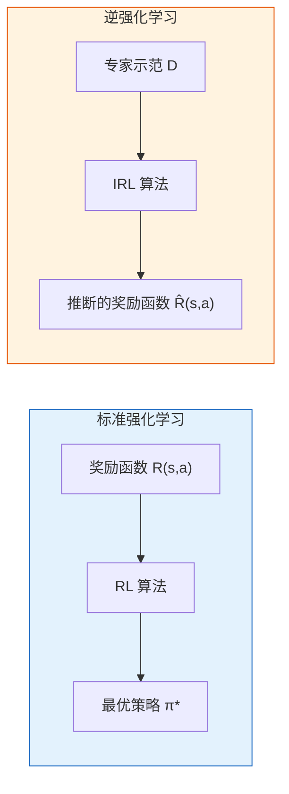
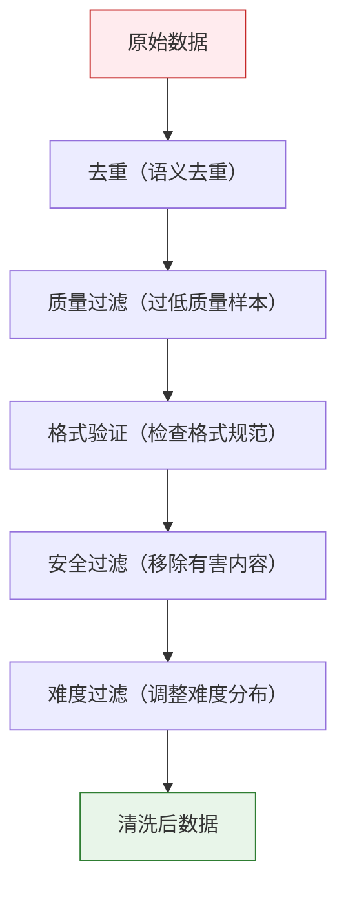
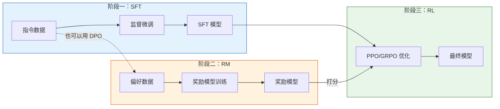

# 10.1 模仿学习与数据工程——RLHF 的理论基础和隐形支柱

> RLHF 里最容易被低估的一件事是：**算法是骨架，数据工程是肌肉**。  
> 本节只回答一个问题：**SFT 数据和偏好数据到底该怎么做成一条“能反复迭代”的流水线？**

第 6 章我们学过 PPO，第 8 章学过 DPO，第 8 章还学过 GRPO。这些算法都很强大，但它们有一个共同的前提：你已经有了一个"知道该怎么回答"的模型（SFT 模型），也有了"知道什么是好回答"的裁判（奖励模型或偏好数据）。那这两个东西从哪来？答案藏在两个经典概念里——行为克隆（BC）和逆强化学习（IRL）。

理解了 BC 和 IRL，RLHF 的三阶段流水线就不再是三个孤立的步骤，而是一个有着清晰理论脉络的完整工程体系。SFT 就是 BC，RM 训练就是 IRL 的简化版，最后的 RL 阶段则是用学到的奖励函数来优化策略。整条线串起来：先跟着老师学基础（BC → SFT），再从老师的偏好中反推评分标准（IRL → RM），最后根据评分标准自己练习提升（RL → PPO/GRPO）。

## 10.1.1 行为克隆：把专家示范变成监督学习

想象你在学做菜。最快的方式不是自己乱试（RL），而是跟着大厨一步一步做——他切洋葱，你也切洋葱；他开大火，你也开大火。你不需要知道"为什么先炒蒜再放番茄"，只需要模仿。这就是行为克隆的核心思想。

在 RL 的语言里，行为克隆就是把专家的 $(s_t, a_t)$ 状态-动作对当作监督学习的训练数据，训练一个策略网络 $\pi_\theta(a|s)$ 去拟合专家的行为。你不需要知道奖励函数长什么样，甚至不需要知道环境动力学——就像你不需要理解热力学就能跟着食谱做菜。[^bc]

```python
# ==========================================
# 行为克隆（BC）：最朴素的模仿学习
# ==========================================
import torch
import torch.nn as nn

class BCPolicy(nn.Module):
    """行为克隆策略：输入状态，输出动作概率"""
    def __init__(self, state_dim, action_dim):
        super().__init__()
        self.net = nn.Sequential(
            nn.Linear(state_dim, 128),
            nn.ReLU(),
            nn.Linear(128, 128),
            nn.ReLU(),
            nn.Linear(128, action_dim),
            nn.Softmax(dim=-1)
        )

    def forward(self, state):
        return self.net(state)

# BC 训练：就是普通的监督学习
def train_bc(policy, expert_states, expert_actions, epochs=100):
    optimizer = torch.optim.Adam(policy.parameters(), lr=1e-3)
    criterion = nn.CrossEntropyLoss()

    for epoch in range(epochs):
        # 输入专家看到的状态，预测专家选的动作
        pred = policy(expert_states)
        loss = criterion(pred, expert_actions)

        optimizer.zero_grad()
        loss.backward()
        optimizer.step()

        if (epoch + 1) % 20 == 0:
            print(f"Epoch {epoch+1}/{epochs} | Loss: {loss.item():.4f}")
```

这段代码和你在第 4 章写的分类网络没有任何本质区别——BC 就是最朴素的监督学习。但这恰恰说明了为什么 SFT 如此有效：大模型从互联网上学了几万亿 token 的"人类写作方式"，SFT 只是用几千条精心标注的指令-回答对，把这种通用写作能力引导到"按要求回答问题"的特定格式上。

### BC 的致命缺陷：分布漂移

BC 看起来简单好用，但它有一个根本性的问题。想象你学开车，教练教你"看到红灯就刹车"。如果你每一步都做得和教练一模一样，没问题。但只要你犯一个小错——比如刹车踩晚了一秒——你进入了一个教练从来没教过你的状态（离前车更近了）。在这个新状态下，你不知道该怎么办，因为你没有见过这种数据。你可能会再犯一个错，进入更偏的状态，然后犯更大的错……这就是**分布漂移（Distribution Shift）**——模型的错误会像滚雪球一样越积越大。

```
专家轨迹:  s₀ → s₁ → s₂ → s₃ → ... (每步都在训练分布内)

模型轨迹:  s₀ → s₁' → s₂' → s₃' → ... (从第一步偏差开始，越来越偏)
                ↑
            小错误导致进入未见过的状态
            → 没有训练数据 → 更大的错误 → 雪崩
```

在 LLM 的场景里，分布漂移同样存在。SFT 模型在训练集覆盖的话题上表现很好，但一旦用户问了一个训练集没覆盖的问题，模型就可能给出糟糕的回答，然后因为前文已经偏了，后面的回答会更糟。这就是为什么 SFT 之后的模型还不够好——它需要一个机制来"修复"累积误差，这个机制就是 RL。

在模仿学习的经典文献里，一个直接的修复思路是 DAgger：让策略在真实分布下滚动采样，把“模型自己跑出来的状态”也纳入数据集迭代标注，从而把分布漂移压住。[^dagger]

## 10.1.2 逆强化学习：从专家示范中反推奖励函数

BC 直接模仿专家的动作。但有时候我们不只是想知道"专家做了什么"，更想知道"专家为什么这么做"。这就像你看到一位棋手下了一步妙手，你不只是想记住这步棋（BC），更想理解他心中的评价标准——在他看来，什么样的局面是好的？

逆强化学习（IRL）把这个直觉形式化了。在标准 RL 中，奖励函数 $R(s,a)$ 是给定的，任务是找到最优策略。IRL 翻转了这个问题：给定一组专家示范 $\mathcal{D} = \{\tau_1, \tau_2, \ldots\}$，反推奖励函数 $R(s,a)$ 是什么，使得专家的策略恰好是某个 RL 算法的最优解。



IRL 的经典实现需要反复迭代：先用当前奖励函数训练一个策略，再看这个策略和专家差多远，调整奖励函数，再训练……这个循环非常昂贵。[^irl] 在 LLM 的场景里，InstructGPT 的工作把这个过程简化了——不从策略迭代中反推奖励，而是直接让标注员对多个回答排序，用排序数据一步训练出奖励模型。[^instructgpt] 这就是 RLHF 中 RM 训练的思想来源：IRL 的目标（从偏好中推断评分标准），但用更直接的方式实现。

### 从 BC-IRL 到 SFT-RM-RL 的完整逻辑链

把 BC 和 IRL 的理论映射到 RLHF 的实践中，你会发现每一个阶段都不是凭空发明的：

| 理论              | LLM 对应物         | 输入                          | 输出               | 解决的问题                 |
| ----------------- | ------------------ | ----------------------------- | ------------------ | -------------------------- |
| BC（行为克隆）    | SFT（监督微调）    | 指令-回答对                   | 能按要求回答的模型 | 从"会写文章"到"会回答问题" |
| IRL（逆强化学习） | RM（奖励模型训练） | 偏好排序对 (chosen, rejected) | 能打分的裁判模型   | 从"人类偏好"到"评分标准"   |
| RL（强化学习）    | PPO/GRPO 优化      | SFT 模型 + RM 打分            | 进一步优化的策略   | 从"模仿"到"超越老师"       |

这条逻辑链的关键洞察是：BC 解决了"怎么开始"，但留下了分布漂移的隐患；IRL 找到了"目标是什么"，但没有直接优化策略；RL 用 IRL 找到的目标来优化策略，同时通过试错来弥补 BC 的累积误差。三者缺一不可。

## 10.1.3 SFT 数据构造：教模型"怎么回答"

工业界后训练工程师日常工作中，**70% 以上的时间花在数据上，而不是算法上**。这句话不是夸张——一个训练脚本写好之后可以反复用，但数据需要不断迭代、清洗、补充。我们先看 SFT 数据怎么构造。

### Self-Instruct：让模型自己出题

Self-Instruct 最早系统化地提出了“用少量种子指令，引导模型自举生成更多指令数据”的流程。[^self_instruct]

Self-Instruct 的核心思想是给一个种子指令集，让模型自己生成新的指令和回答，再人工过滤质量低的数据。具体流程如下：

```python
# ==========================================
# Self-Instruct：自动生成指令数据
# ==========================================
seed_instructions = [
    {"instruction": "解释什么是机器学习", "response": "机器学习是..."},
    {"instruction": "用 Python 写一个快速排序", "response": "def quicksort(arr): ..."},
    # ... 几十条种子指令
]

# 用强模型（如 GPT-4）生成新指令
prompt = """
以下是几条已有的指令：
{seed_examples}

请生成一条全新的指令及其回答。要求：
1. 指令不能和已有的重复
2. 回答要准确、有帮助
3. 难度要有变化（简单/中等/困难）
"""

# 生成后过滤：去重、质量打分、人工审核
def filter_generated(data, similarity_threshold=0.85):
    """过滤掉与已有数据太相似的样本"""
    filtered = []
    for item in data:
        # 计算 embedding 相似度
        sim = max(cosine_similarity(item, existing) for existing in filtered)
        if sim < similarity_threshold:
            filtered.append(item)
    return filtered
```

### Evol-Instruct：从简单到复杂的进化

Evol-Instruct（也常以 WizardLM 的“进化指令”形式被讨论）把指令生成从“平铺直叙的扩充”升级成“从简单到复杂的可控变换”。[^wizardlm]

Evol-Instruct 在 Self-Instruct 的基础上增加了"进化"操作——从简单指令出发，通过"加深""加宽""具体化"等变换逐步生成更复杂的指令：

| 进化操作             | 含义                       | 示例                                                          |
| -------------------- | -------------------------- | ------------------------------------------------------------- |
| 加深（Deepen）       | 增加推理深度               | "写一个排序" → "分析快速排序的最坏情况和优化策略"             |
| 加宽（Widen）        | 扩大问题范围               | "解释 Python 列表" → "对比 Python 列表、元组、集合的适用场景" |
| 具体化（Concretize） | 增加约束条件               | "写一个搜索函数" → "在有序数组中用二分查找实现 O(log n) 搜索" |
| 简化（Simplify）     | 降低难度，用于补充简单数据 | 反向操作                                                      |

### 难度分级与数据配比

将数据按难度分成多个桶，不同训练阶段使用不同难度的数据。一个常见的策略是：

```
阶段 1（前 20% 步数）：90% 简单 + 10% 中等    → 打基础
阶段 2（20%-60% 步数）：30% 简单 + 50% 中等 + 20% 困难  → 提升能力
阶段 3（后 40% 步数）：10% 简单 + 40% 中等 + 50% 困难  → 攻坚难题
```

数据配比不只是难度的问题。不同任务类型（对话、代码、数学、创作、安全）的比例也至关重要。业界常见的做法是先做小规模消融实验（几百条数据的子集），确定大致配比后再全量训练。

### 工程落地：SFT 数据的“最小可用规范”

上面讲的是“数据从哪来”，但真实训练跑不起来，往往不是因为没数据，而是因为**格式不统一、mask 不正确、评估不可比**。一个能稳定迭代的 SFT 流水线，至少要把下面三件事做成硬约束。

#### 1) 统一数据结构：从文本到对话，再到 token

工业界更常见的 SFT 数据并不是单轮 `(instruction, response)`，而是多轮对话：

```json
{
  "messages": [
    { "role": "system", "content": "你是一个严谨的助理。" },
    { "role": "user", "content": "解释一下 PPO 的核心直觉。" },
    { "role": "assistant", "content": "PPO 的核心是..." }
  ],
  "meta": { "source": "human", "task": "explain", "lang": "zh" }
}
```

你需要在这一层就做完三件事：

- **对话模板固定**：system/user/assistant 的顺序、分隔符、停止符（stop tokens）不能在不同数据源里飘来飘去，否则模型会学到“格式噪声”。
- **元信息可追溯**：`source/task/lang/difficulty` 这种字段是后续做配比、回放 badcase 的关键。
- **严格校验**：训练前做 schema 校验，宁可丢样本也不要让脏格式混进来（一次 NaN 可能毁掉一整晚训练）。

#### 2) 正确的 loss mask：只训练“该由模型负责的 token”

对话数据最常见的坑是：把 user/system 的 token 也算进 loss 里。正确做法是**只对 assistant 的 token 计算交叉熵**（其余 token `labels=-100`）。这不是洁癖，这是在保护你训练出来的模型不去“背诵提示词”。[^sft_mask]

如果你在做工具调用或多模态输入，这条更重要：工具返回、图片占位符都不应该参与 loss，它们只是“观测”，不是“动作”。

#### 3) Packing 与长度策略：吞吐、质量、稳定性的三角形

在长上下文训练里，样本长度分布会强烈影响吞吐和稳定性。实践里常见两种策略：

- **不 packing**：每条对话单独成一个序列，空余部分 padding。优点是语义边界清晰；缺点是浪费算力。
- **packing**：把多条样本拼到一个长序列里（中间插入分隔符），显著提升吞吐。优点是高效；缺点是要非常小心 mask，避免跨样本“串味”。

经验上：先用“不 packing + 严格 mask”把流程跑通、指标稳定，再上 packing 做吞吐优化。否则你会在“吞吐很高但学歪了”的坑里排查很久。

## 10.1.4 偏好数据生成：教裁判"什么是好回答"

偏好数据是 DPO 和 RLHF 第二阶段（RM 训练）的核心燃料。每条数据是一个三元组 $(x, y_w, y_l)$：给同一个 prompt $x$，模型生成了两个回答，人类（或 AI）标注了 $y_w$（chosen）比 $y_l$（rejected）好。

### 偏好建模的最小数学：Bradley-Terry 与 pairwise loss

为什么一条偏好数据长这样：`chosen` vs `rejected`？因为它天然对应一个简单的概率模型：给定同一个 prompt，回答的“好坏”可以用一个标量评分函数 $r_\phi(x, y)$ 表示，胜出的概率用 logistic 表示（Bradley-Terry）。[^bt]

RM 训练里常见的 pairwise loss 就是：

$$
\mathcal{L}_{RM} = - \mathbb{E}_{(x, y_w, y_l)}\left[\log \sigma(r_\phi(x, y_w) - r_\phi(x, y_l))\right]
$$

这条式子背后的直觉非常工程：我们不要求 RM 给出“绝对分数”，只要求它对同 prompt 的回答能排对顺序。

### 偏好数据的四种来源

| 来源         | 成本             | 质量 | 规模             | 适用场景       |
| ------------ | ---------------- | ---- | ---------------- | -------------- |
| 人工标注     | 高（$0.5-5$/对） | 高   | 低（每天几千对） | 高质量种子数据 |
| AI 交叉打分  | 低               | 中   | 高               | 大规模偏好生成 |
| LLM-as-Judge | 低               | 中高 | 高               | 自动化质量评估 |
| 在线采集     | 极低             | 低   | 极高             | 用户反馈信号   |

**人工标注**是质量最高的方式。标注员从模型的多个输出中选择最好的。这个过程的难点在于标注的一致性——不同的标注员可能对同一个 prompt 有不同的偏好。解决方案通常是让 2-3 个标注员独立打分，取多数意见。

**AI 交叉打分**是一种成本更低的替代方案。具体做法是用多个模型（GPT-4、Claude、Gemini 等）对同一组回答独立打分，取排名差异构造偏好对。如果 GPT-4 认为回答 A 排第 1，Claude 认为它排第 3，这个排名差异本身就包含了丰富的偏好信息。

**LLM-as-Judge** 是用强模型（如 GPT-4）充当裁判，对回答评分并生成偏好对。这个方法的关键是提示词（prompt）的设计——你需要明确告诉 Judge 从哪些维度评估（准确性、有帮助性、安全性等）。

```python
# ==========================================
# LLM-as-Judge：自动生成偏好数据
# ==========================================
judge_prompt = """
你是一个专业的回答质量评估员。请从以下维度对两个回答进行评估：
1. 准确性：事实是否正确
2. 帮助性：是否真正解决了用户的问题
3. 安全性：是否包含有害内容
4. 清晰度：表达是否清楚

用户问题: {prompt}
回答 A: {response_a}
回答 B: {response_b}

请输出 JSON 格式：
{{"winner": "A" 或 "B", "reason": "选择理由"}}
"""

# 评估后构造偏好对
def construct_preference_pairs(prompt, responses, judge_outputs):
    """根据 Judge 的排名构造偏好对"""
    pairs = []
    for i in range(len(responses)):
        for j in range(i + 1, len(responses)):
            if judge_outputs[i]['score'] > judge_outputs[j]['score']:
                pairs.append((prompt, responses[i], responses[j]))  # (x, y_w, y_l)
            else:
                pairs.append((prompt, responses[j], responses[i]))
    return pairs
```

**在线采集**是从实际用户交互中收集隐式偏好信号——用户的点赞/踩、编辑后重新发送（edit-and-resend）、复制回答内容等行为都包含了偏好信息。这种方式成本极低、规模极大，但信号噪声也很高。

## 10.1.5 数据清洗：原始数据总是脏的

无论用什么方法生成的数据，清洗都是必不可少的环节。一个典型的清洗流水线包括：



**去重**通常用 embedding 相似度来做——如果两条数据的语义 embedding 余弦相似度超过阈值（如 0.85），就认为它们是重复的。**质量过滤**的规则包括：回答长度过短（少于 50 字）、内容高度重复（n-gram 重复率超过 60%）、格式不完整等。**安全过滤**需要专门的分类器来检测有害、涉密、版权内容。**难度过滤**则是确保数据难度分布合理——全部太简单模型学不到东西，全部太难模型学不动。

清洗里还有一个更“隐形”但非常致命的环节：**去污染（decontamination）**。如果你的评测集或 benchmark 泄露到了训练数据里，你会得到一个看起来很强但实际上不可泛化的模型。大规模训练里这不是小概率事件，而是必做项。[^decontam]

<details>
<summary>思考题：为什么 Self-Instruct 生成的数据不能直接用，必须经过过滤？</summary>

模型生成数据有一个"近亲繁殖"的风险——如果种子数据中某种类型的问题偏多，生成的数据也会偏向这种类型，导致最终模型的能力分布不均。更微妙的问题是，模型可能会生成"看似合理但事实错误"的回答——这些问题人工审核很难全部发现。这就是为什么工业界通常用 Self-Instruct 做初筛，再由人工标注员做最终质量把关。

另一个容易忽视的问题是**格式偏见**。如果种子数据中的回答都用了 Markdown 格式，模型会倾向于生成 Markdown 格式的回答，而忽略了纯文本或其他格式的需求。这种偏见会通过 RLHF 的后续阶段被放大。

</details>

## 10.1.6 从数据到流水线：RLHF 三阶段总览

有了 SFT 数据和偏好数据，我们就可以跑通完整的 RLHF 三阶段流水线：



**阶段一（SFT）**的输入是指令-回答对，输出是一个能按要求回答问题的模型。回顾第 6 章，SFT 的损失函数就是标准的语言模型损失：$\mathcal{L}_{SFT} = -\mathbb{E}_{(x,y)}[\log \pi_\theta(y|x)]$。这就是行为克隆在 LLM 中的直接实现。

**阶段二（RM）**的输入是偏好排序对 $(x, y_w, y_l)$，输出是一个能对回答打分的模型。这正是 IRL 思想的简化实现——不从策略迭代中反推奖励，而是直接从偏好数据中学习评分函数。

**阶段三（RL）**的输入是 SFT 模型和 RM，输出是优化后的最终模型。PPO 用 RM 的打分作为奖励信号来优化策略（回顾第 6 章），GRPO 用组内相对优势来替代 RM（回顾第 8 章）。这一步的目标是弥补 SFT 阶段的分布漂移问题，让模型在更广泛的场景下都能给出高质量回答。

三个阶段的串联不是机械的——每个阶段的输出质量直接影响下一个阶段的起点。SFT 数据质量差，模型连基本格式都学不好，RM 就无从评判；偏好数据质量差，RM 学到的评分标准就是错的，RL 就会把模型带偏。这就是为什么数据工程才是 RLHF 的真正核心。

数据工程的细节讲完了，下一步是深入 RLHF 的"心脏"——奖励函数。它决定了模型优化的方向，设计不好就会南辕北辙。让我们进入下一节——[奖励函数设计](./reward-function-design)。

## 参考文献

[^bc]: Pomerleau D A. [ALVINN: An Autonomous Land Vehicle in a Neural Network](https://papers.nips.cc/paper_files/paper/1988/hash/812b4ba287f5ee0bc9d43bbf5bbe87fb-Abstract.html), NeurIPS 1988.（早期行为克隆代表工作之一）

[^dagger]: Ross S, Gordon G, Bagnell D. [A Reduction of Imitation Learning and Structured Prediction to No-Regret Online Learning](https://proceedings.mlr.press/v15/ross11a.html), AISTATS 2011.（DAgger：用数据聚合缓解分布漂移）

[^irl]: Ng A Y, Russell S. [Algorithms for Inverse Reinforcement Learning](https://ai.stanford.edu/~ang/papers/icml00-irl.pdf), ICML 2000.（IRL 经典起点）

[^instructgpt]: Ouyang L, Wu J, Jiang X, et al. [Training language models to follow instructions with human feedback](https://arxiv.org/abs/2203.02155), 2022.（RLHF 三阶段范式：SFT → RM → RL）

[^self_instruct]: Wang Y, Kordi Y, Mishra S, et al. [Self-Instruct: Aligning Language Models with Self Generated Instructions](https://arxiv.org/abs/2212.10560), 2022.

[^wizardlm]: Xu C, Sun Q, Zheng K, et al. [WizardLM: Empowering Large Language Models to Follow Complex Instructions](https://arxiv.org/abs/2304.12244), 2023.

[^bt]: Bradley R A, Terry M E. [Rank Analysis of Incomplete Block Designs](https://www.jstor.org/stable/2334029), Biometrika 1952.（Bradley-Terry 偏好模型）

[^sft_mask]: Hugging Face TRL Documentation. [SFTTrainer](https://huggingface.co/docs/trl/sft_trainer).（SFT 里常见的只对 assistant token 计算 loss 的实现范式）

[^decontam]: OpenAI. [Language Models are Few-Shot Learners](https://arxiv.org/abs/2005.14165), 2020.（数据污染在大模型评测中的系统性风险；附录中讨论了去污染方法）
