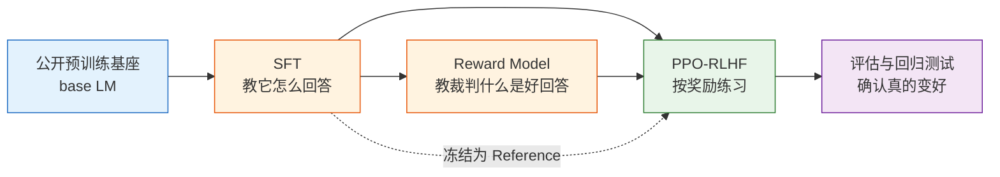

# 第 8 章：复刻 InstructGPT——从预训练基座到 RLHF 对齐助手

## 本章导读

**核心内容**

- 从一个公开 base model 出发，理解它为什么还不是稳定 assistant。
- 跑通经典 RLHF 的三阶段流水线：SFT、Reward Model、PPO。
- 建立评估闭环，识别 reward hacking、能力回退、长度膨胀和模板坍缩。
- 理解小参数 TRL 实验如何映射到 OpenRLHF、NeMo RL / NeMo Aligner 这类大参数训练框架。

**核心公式**

$$
\mathcal{L}_{SFT}
=-\mathbb{E}_{(x,y)\sim\mathcal{D}_{SFT}}
\left[\log \pi_\theta(y\mid x)\right]
\quad \text{（SFT：让模型模仿高质量 assistant 回答）}
$$

$$
\mathcal{L}_{RM}
=-\mathbb{E}_{(x,y_w,y_l)\sim\mathcal{D}_{pref}}
\left[\log\sigma(r_\phi(x,y_w)-r_\phi(x,y_l))\right]
\quad \text{（RM：从偏好对中学习奖励）}
$$

$$
R_{PPO}(x,y)
=r_\phi(x,y)-\beta D_{KL}(\pi_\theta(\cdot\mid x)\|\pi_{ref}(\cdot\mid x))
\quad \text{（PPO-RLHF：追求偏好奖励，同时别偏离 SFT 太远）}
$$

**为什么需要这些公式**

第 7 章讲 PPO 时，我们还在传统 RL 环境里讨论策略更新、优势估计和裁剪目标。本章把同一套语言搬到大语言模型里：prompt 是起点，token 是动作，完整回答是一条轨迹，Reward Model 是奖励函数，Reference model 是 KL 约束的锚点。SFT、RM、PPO 这三个公式分别回答“怎么开始像助手”“什么回答更好”“如何继续优化而不跑偏”。

上一章我们把 PPO 的核心机制讲清楚了：策略不能一步走太远，所以要用裁剪、优势估计和 KL 约束来稳定更新。现在我们把这套算法搬到大语言模型上，复刻 OpenAI InstructGPT 风格的经典 RLHF 流水线。

先澄清一个边界：**RLHF 不包括从零预训练**。预训练模型是 RLHF 的起点，不是 RLHF 本身。本章会从一个已经公开发布的 base model 开始，例如 `HuggingFaceTB/SmolLM2-360M`、`Qwen/Qwen2.5-0.5B` 或 `EleutherAI/pythia-410m`。它们已经学会了语言建模，但还没有被稳定地训练成助手。我们的任务是把它们一步步后训练成更有用、更符合偏好的模型。

本章的方法论参考 OpenAI 的 InstructGPT：先用监督微调（SFT）教模型按指令回答，再用偏好数据训练奖励模型（Reward Model, RM），最后用 PPO 按奖励模型给出的信号优化策略。小参数实验用 Hugging Face TRL 跑通，大参数扩展则参考 OpenRLHF、NVIDIA NeMo RL / NeMo Aligner 这类工程框架。

## 为什么不用从零预训练

从零预训练一个几百 M 参数模型当然可以做教学项目，但它不是经典 RLHF 的重点。真实的大厂流程通常不是“先造一个小 LLM 再对齐”，而是从一个已经训练好的 base model 或 checkpoint 出发，围绕数据、偏好、奖励和稳定性做后训练。

因此，本章会把“预训练”处理成一个输入 artifact：我们先加载 base model，观察它的原始行为，再进入 SFT、RM、PPO 三个阶段。如果你想理解从零预训练，可以把它看作 RLHF 之前的独立工程；如果你想理解现代后训练，本章才是主线。

## RL 语言的前后呼应

第 3 章里，我们用 MDP 五元组描述序列决策：

$$
\mathcal{M}=\langle \mathcal{S},\mathcal{A},P,R,\gamma\rangle
$$

在 LLM RLHF 中，这些对象换了一层外衣：

| MDP 对象          | CartPole                 | LLM RLHF                    |
| ----------------- | ------------------------ | --------------------------- |
| 状态 $s_t$        | 小车位置、速度、杆子角度 | prompt + 已生成 token       |
| 动作 $a_t$        | 左推 / 右推              | 下一个 token                |
| 策略 $\pi_\theta$ | 控制网络                 | 语言模型                    |
| 奖励 $R$          | 存活 +1                  | RM 分数、规则奖励、人类偏好 |
| episode           | 杆子倒下前的一局         | 从开始回答到 EOS 的一段生成 |

所以 RLHF 不是“把 RL 强行套到 LLM 上”，而是把 LLM 生成过程视为一个高维序列决策问题。区别在于：CartPole 的奖励来自环境规则，LLM 的奖励来自人类偏好或奖励模型；CartPole 每步都有反馈，LLM 往往整段回答结束后才有反馈。

这一章会反复用第 3 章的语言解释大模型对齐：SFT 是行为克隆，RM 是从偏好里学习奖励，PPO 是带 KL 约束的策略优化。

## 本章路线图

| 小节                                                            | 核心问题                                                | 产物                             |
| --------------------------------------------------------------- | ------------------------------------------------------- | -------------------------------- |
| [为什么 base model 还不是 assistant](./base-model-to-assistant) | pretrained checkpoint 能做什么、缺什么？                | base / SFT / RLHF 三阶段对照     |
| [标准 RLHF 流水线](./standard-rlhf-pipeline)                    | InstructGPT 风格 SFT → RM → PPO 的输入输出是什么？      | 标准流程图与 artifact 清单       |
| [SFT：教模型按指令回答](./imitation-learning-pipeline)          | SFT 数据和偏好数据怎么构造？                            | SFT 训练数据与 SFT 模型          |
| [Reward Model：教一个裁判](./reward-function-design)            | 如何把 chosen/rejected 偏好对变成可优化的标量奖励？     | Reward Model 与 RM 验证指标      |
| [PPO-RLHF：按奖励练习](./ppo-rlhf-loop)                         | Actor、Reference、Reward Model、Critic 如何协作？       | PPO-RLHF 四模型结构 + 大参数扩展 |
| [评估与奖励黑客](./evaluation)                                  | 如何证明模型变好且没有 reward hacking？数据飞轮怎么做？ | 评估闭环 + 受控实验 + 飞轮模板   |
| [动手：veRL PPO 训练 GSM8K](./verl-ppo-gsm8k)                   | 工业级 LLM RL 框架如何跑通 PPO？                        | veRL 外部索引 + 本仓库适配脚本   |
| [扩展实战：Reward Hacking 与数据飞轮](./extended-practice)      | 坏奖励如何被 hack？失败样本如何进入迭代闭环？           | 可复现 reward hacking 实验       |

## 8.6 为什么必须做评估

RLHF 最容易制造一种错觉：训练日志很好看，模型实际变差了。RM 分数上涨可能只是模型学会了讨好 RM；回答变长可能被误判为更有帮助；偏好数据上的胜率提高，也可能伴随数学、代码、事实性能力下降。

所以本章的评估不是可选项，而是 RLHF 流水线的一部分。8.6 会采用三层评估：

- **自动 benchmark**：用固定任务集检查通用能力和专项能力有没有掉点，例如指令遵循、简单推理、事实问答、格式遵循。
- **偏好评估**：让 base / SFT / RLHF 的回答做 pairwise battle，用人类或强模型 judge 判断哪个更好。
- **人工抽检**：小规模但高质量地看样本，特别关注 reward hacking、长度膨胀、空洞模板、安全退化和事实幻觉。

一个合格的 RLHF 实验，不能只报告 “reward 变高”。它至少要回答三个问题：模型是不是更符合人类偏好？原有能力有没有明显回退？高分回答是不是真的可用？

## 与第 9 章的边界

本章讲的是**经典 RLHF 标准流程**。第 9 章会从这套流程出发，解释现代 post-training 为什么要一步步简化它：

- DPO 试图省掉显式 Reward Model。
- GRPO 试图省掉 Critic。
- RLVR 把主观偏好换成可验证奖励。
- DAPO、RLAIF、蒸馏和数据飞轮则进一步改变训练信号的来源和扩展方式。

换句话说，08 是“标准答案”，09 是“现代演进”。先把标准 RLHF 跑通，再理解为什么大家要改造它，整个大模型强化学习的脉络才会顺。

准备好后，我们从第一步开始：先看为什么 pretrained base model 还不是 assistant——[为什么 base model 还不是 assistant](./base-model-to-assistant)。

## 学习目标

读完本章后，你应该能够：

- 用 RL 语言描述 LLM 生成中的状态、动作、策略、奖励和轨迹；
- 解释 SFT、Reward Model、PPO-RLHF 三个阶段分别解决什么问题；
- 手写 Bradley-Terry 奖励模型损失，并说明 margin、accuracy、reward 校准各自看什么；
- 读懂 PPO-RLHF 的训练日志，判断 reward 上涨是真进步还是 reward hacking；
- 说清 TRL 小实验、OpenRLHF 中等规模训练和 NeMo RL / NeMo Aligner 大规模训练之间的映射关系。
