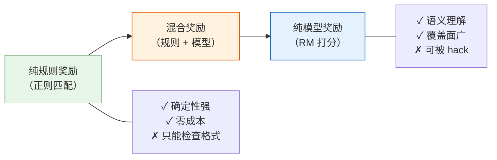

# 10.2 奖励函数设计——RL 系统的北极星

在第 6 章，我们写过一行关键代码：`reward = rm_score + kl_penalty`。当时我们把奖励模型当成一个黑盒——给它一段文本，它吐出一个分数。现在我们要拆开这个黑盒，看看里面的奖励函数到底是怎么设计的，为什么这么设计，以及设计不好会发生什么。

奖励函数是整个 RL 系统的"目标函数"——它定义了"什么是好"。策略网络不管你心里想的是什么，它只会朝奖励函数指的方向走。如果奖励函数说"字多就是好"，模型就会写长篇大论；如果奖励函数说"包含'我很乐意帮助您'就是好"，模型就会每句话都加上这句客套话。设计奖励函数就像给一个极度听话但毫无常识的助手下指令——你说什么它就做什么，包括你没想到的副作用。

## 10.2.1 奖励的谱系：从纯规则到纯模型

奖励函数不是非此即彼的，而是一个从"纯规则"到"纯模型"的连续谱系：



**纯规则奖励**适合有客观标准答案的任务——数学题的最终答案对不对、代码能不能运行、输出格式是否合规。这类奖励完全确定，不可能被"hack"，但它只能检查表面形式，无法评估语义质量。

**纯模型奖励**就是训练一个奖励模型（RM），给它 $(prompt, response)$，它输出一个标量分数。RM 能理解语义——它知道"有帮助但语气生硬"和"礼貌但毫无内容"哪个更好。但 RM 有一个根本性的风险：它本身是一个模型，而模型可以被对抗性地利用。这就是下一节要讨论的"奖励黑客"问题。

**混合奖励**是工业界最常用的方案——用 RM 覆盖语义层面，用规则覆盖 RM 捕捉不到的维度。典型的混合奖励函数长这样：

$$R_{total} = R_{RM} + \alpha \cdot R_{format} + \beta \cdot R_{length} + \gamma \cdot R_{correctness}$$

其中 $\alpha, \beta, \gamma$ 是需要调试的超参数。$R_{format}$ 检查格式规范度，$R_{length}$ 惩罚过长或过短的回答，$R_{correctness}$ 检查有客观答案的问题（数学、代码等）。

## 10.2.2 Bradley-Terry 模型：RM 训练的数学基础

奖励模型的核心任务是从人类偏好对中学习一个评分函数。给定 prompt $x$ 和两个回答 $y_w$（chosen）和 $y_l$（rejected），人类标注员认为 $y_w$ 比 $y_l$ 好。RM 需要学出一个函数 $r_\theta(x, y)$，使得 $r_\theta(x, y_w) > r_\theta(x, y_l)$。

Bradley-Terry 模型给出了一个概率框架来描述这个过程：

$$P(y_w \succ y_l \mid x) = \sigma\left(r_\theta(x, y_w) - r_\theta(x, y_l)\right)$$

其中 $\sigma$ 是 sigmoid 函数 $\sigma(z) = \frac{1}{1 + e^{-z}}$。这个公式的直觉很清楚：如果 RM 给 $y_w$ 的分数比 $y_l$ 高很多，那么 $y_w$ 被选中的概率就接近 1；如果两个分数差不多，概率就接近 0.5。

对应的训练损失函数是负对数似然：

$$\mathcal{L}_{RM} = -\mathbb{E}_{(x, y_w, y_l)} \left[ \log \sigma\left(r_\theta(x, y_w) - r_\theta(x, y_l)\right) \right]$$

让我们逐项认识这个公式：

| 符号                 | 角色          | 大白话                         |
| -------------------- | ------------- | ------------------------------ |
| $r_\theta(x, y)$     | 奖励函数      | 给 (问题, 回答) 打一个分数     |
| $y_w$                | chosen 回答   | 标注员认为更好的回答           |
| $y_l$                | rejected 回答 | 标注员认为较差的回答           |
| $\sigma(\cdot)$      | sigmoid       | 把分数差映射到 $(0, 1)$ 的概率 |
| $\log \sigma(\cdot)$ | 对数似然      | 优化目标——让 RM 更大概率选对   |

```python
# ==========================================
# 奖励模型训练：Bradley-Terry 损失
# ==========================================
import torch
import torch.nn as nn

class RewardModel(nn.Module):
    """奖励模型：输入 (prompt, response)，输出标量分数"""
    def __init__(self, base_model, hidden_dim=1024):
        super().__init__()
        # 基座模型（通常用 SFT 模型或较小的预训练模型）
        self.base = base_model
        # 在最后一层隐藏状态上加一个线性头，输出标量
        self.reward_head = nn.Linear(hidden_dim, 1)

    def forward(self, input_ids, attention_mask):
        # 取最后一个 token 的隐藏状态
        outputs = self.base(input_ids=input_ids, attention_mask=attention_mask)
        last_hidden = outputs.last_hidden_state[:, -1, :]  # (batch, hidden_dim)
        reward = self.reward_head(last_hidden)  # (batch, 1)
        return reward.squeeze(-1)


def bradley_terry_loss(rm, chosen_ids, chosen_mask, rejected_ids, rejected_mask):
    """Bradley-Terry 偏好损失"""
    r_chosen = rm(chosen_ids, chosen_mask)     # chosen 回答的分数
    r_rejected = rm(rejected_ids, rejected_mask)  # rejected 回答的分数

    # 核心：让 chosen 的分数比 rejected 高
    loss = -torch.log(torch.sigmoid(r_chosen - r_rejected)).mean()
    return loss
```

这段代码里有几个值得注意的工程细节。首先，RM 的基座模型通常选择与策略模型相同架构但较小规模的模型——比如 7B 策略用 3B 做 RM。这不是因为大 RM 不好，而是因为 RM 在 RL 训练阶段需要频繁推理（每一步都要打分），太大的 RM 会严重拖慢训练速度。其次，RM 通常在 SFT 模型基础上微调，而不是从 base 模型开始——SFT 模型已经理解了"回答"的格式，微调只需要学会"哪个回答更好"。

## 10.2.3 奖励粒度：Token、Step 还是 Sequence？

RM 给一个回答打一个分数，这个分数应该怎么分配？是给整个回答一个总分，还是给每个 token 单独打分，还是按推理步骤分段打分？这就是奖励粒度的问题。

| 粒度           | 方式                | 优势               | 劣势                       | 代表方法        |
| -------------- | ------------------- | ------------------ | -------------------------- | --------------- |
| Sequence-level | 整个回答一个分数    | 简单，稳定         | 无法区分好回答中哪些部分好 | PPO, GRPO       |
| Step-level     | 按推理步骤分段      | 折中精细度与可行性 | 需要步骤分割器             | PRM（过程监督） |
| Token-level    | 每个 token 独立分数 | 最精细             | 训练成本高，信号噪声大     | RLHF 早期尝试   |

实践中最常用的是 **sequence-level** 加上 **规则辅助**。PPO 和 GRPO 默认都是给整个回答一个总奖励分数，然后通过规则奖励来补充 token-level 的信号（比如格式奖励检查每个 token 是否符合特定格式）。

Step-level 奖励是一个值得关注的方向。OpenAI 在 2024 年发表的 PRM（Process Reward Model）论文表明，对数学推理的每一步打分比只对最终答案打分能显著提升模型性能。这很好理解——如果你的目标答案是错的，但中间某几步的推理是正确的，step-level 奖励可以强化这些正确的步骤，而 sequence-level 奖励会把整个推理链一起惩罚。

```python
# ==========================================
# 不同粒度的奖励计算
# ==========================================
def sequence_reward(rm, prompt, response):
    """Sequence-level：整个回答一个分数"""
    return rm.score(prompt, response)  # 一个标量

def step_reward(rm, prompt, reasoning_steps):
    """Step-level：每个推理步骤一个分数"""
    step_rewards = []
    for i, step in enumerate(reasoning_steps):
        # 对前 i+1 步的累积内容打分
        partial = "\n".join(reasoning_steps[:i+1])
        step_rewards.append(rm.score(prompt, partial))
    return step_rewards  # 一个列表

def combined_reward(rm, prompt, response, reasoning_steps):
    """混合：sequence-level RM + step-level 规则"""
    r_rm = sequence_reward(rm, prompt, response)
    r_format = 0.2 if validate_format(response) else 0.0  # 格式奖励
    r_correct = 1.0 if check_answer_correct(prompt, response) else 0.0  # 正确性奖励
    r_length = -0.01 * max(0, len(response) - 500)  # 长度惩罚

    return r_rm + r_format + r_correct + r_length
```

<details>
<summary>思考题：为什么 token-level 奖励在实际中很少使用？</summary>

Token-level 奖励要求对每一个 token 都给出一个独立的分数。理论上这最精细——它可以告诉模型"第 3 个 token 选得好，第 7 个 token 选得不好"。但实际中有两个根本性的困难：

第一，**标注成本**。人类标注员可以对整个回答做排序（"A 比 B 好"），但无法对每个 token 做精细标注（"这个 token 好还是不好"）。这意味着 token-level 奖励几乎必须通过模型来生成，而模型生成的 token-level 信号本身就有噪声。

第二，**信用分配问题**。一个回答好或不好，通常是多个 token 协同作用的结果。单独看每个 token 很难判断它的贡献——就像你不能通过单独品尝每种调料来判断一道菜好不好吃。Step-level 奖励是一种折中方案：它比 sequence-level 更精细，又避免了 token-level 的信用分配难题。

</details>

## 10.2.4 规则奖励 vs 模型奖励：什么时候用什么

选择规则奖励还是模型奖励，取决于你的任务类型和约束条件。

|              | 规则奖励                             | 模型奖励（RM）                 |
| ------------ | ------------------------------------ | ------------------------------ |
| **成本**     | 几乎为零                             | 训练 + 推理成本                |
| **可靠性**   | 确定性强，不可被 hack                | 可被对抗性利用                 |
| **语义理解** | 无，只能检查格式                     | 有，能理解内容质量             |
| **泛化能力** | 差，每换一个任务要写新规则           | 好，同一个 RM 可以评估多种回答 |
| **适用场景** | 数学/代码/格式检查等有客观标准的任务 | 对话/创意/安全等主观偏好任务   |
| **典型用法** | 作为混合奖励的"底线"                 | 作为混合奖励的"主体"           |

在 RLVR（Reinforcement Learning with Verifiable Rewards）场景中——回顾第 8 章的 GRPO 实验——规则奖励是主力。数学题的答案对不对可以用代码验证，代码能不能运行可以直接执行。但在开放域对话、创意写作、安全对齐等场景中，没有客观标准，模型奖励不可替代。

一个实用的经验法则是：**能用规则奖励的地方就用规则奖励，规则覆盖不到的地方用模型奖励补**。这样做的好处是规则奖励提供了一个"安全网"——即使 RM 被hack了，规则奖励仍然能确保基本的格式和正确性。

## 10.2.5 RM 训练的工程细节

训练一个靠谱的 RM，除了 Bradley-Terry 损失之外，还有很多工程细节需要注意。

**数据标注**方面，标注员通常被要求对同一个 prompt 的 4-9 个回答进行排序，而不是打绝对分。人类更擅长比较——"A 比 B 好"比"A 值 8 分"更容易达成一致。排序数据可以拆成多对偏好对来训练 RM。

**训练稳定性**方面，RM 训练有几个关键的超参数：

```python
# ==========================================
# RM 训练的关键配置
# ==========================================
rm_config = {
    # 基座模型：通常用 SFT 后的较小模型
    "base_model": "sft_model_3b",

    # 学习率：比 SFT 更保守
    "learning_rate": 5e-6,  # SFT 通常用 1e-5 到 2e-5

    # 学习率调度：线性 warmup + 余弦衰减
    "warmup_steps": 100,
    "lr_scheduler": "cosine",

    # 梯度裁剪：防止梯度爆炸
    "max_grad_norm": 1.0,

    # 批大小：偏好对的数量
    "batch_size": 128,  # 每个批次 128 对 (chosen, rejected)

    # 训练轮数：通常只需 1-2 个 epoch
    "epochs": 1,  # RM 容易过拟合，不要训太多轮
}
```

RM 特别容易过拟合——因为偏好数据通常只有几万到几十万对，而 RM 的参数量可能有几十亿。1 个 epoch 通常是最佳选择，超过 2 个 epoch 往往会导致验证集上的准确率开始下降。

**RM 的评估**也是一门学问。最直接的指标是"在 held-out 偏好对上的准确率"——RM 能在多大程度上复现人类标注的偏好。但这个指标有一个盲区：它衡量的是"排序对不对"，不是"打分准不准"。一个 RM 可能在所有排序对上都选对了，但给 chosen 的分数和 rejected 的分数差距很小——这意味着它的信号太弱，在 RL 阶段起不到足够的引导作用。因此，实践中还需要关注 RM 分数的区分度（margin）。

## 10.2.6 奖励函数设计的工程检查清单

把这一节的内容整合成一个实用的检查清单，方便你在设计自己的奖励函数时逐项对照：

| 检查项    | 问题                                                   | 通过标准                         |
| --------- | ------------------------------------------------------ | -------------------------------- |
| 奖励粒度  | 你选择的是什么粒度的奖励？                             | 有明确的理由说明为什么选这个粒度 |
| 混合奖励  | 是否同时使用规则奖励和模型奖励？                       | 至少包含一个规则奖励作为底线     |
| 长度惩罚  | 是否有防止模型写太长的机制？                           | 有明确的长度惩罚项               |
| 重复惩罚  | 是否有防止模型重复废话的机制？                         | 有 n-gram 重复率检测             |
| RM 区分度 | RM 的 chosen/rejected 分数差距是否足够大？             | 平均 margin > 1.0                |
| RM 过拟合 | RM 是否在验证集上表现良好？                            | 验证集准确率 > 65%               |
| 边界情况  | 奖励函数对极端输入（空回答、超长回答）的行为是否合理？ | 边界情况有明确处理               |

这个检查清单不能保证你的奖励函数完美无缺，但能帮你避开最常见的坑。记住：奖励函数是 RL 系统的北极星——它指的方向不对，模型跑得越快偏得越远。

奖励函数设计好了，下一步是让 RL 训练稳定地跑起来——这远比看起来困难。训练崩溃、奖励黑客、模型退化……这些都是工业界每天都在面对的问题。让我们进入下一节——[训练稳定性与奖励黑客](./training-stability-hacking)。
