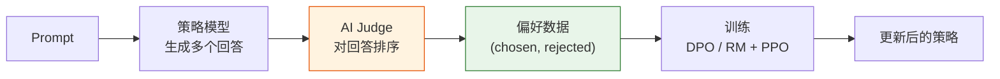
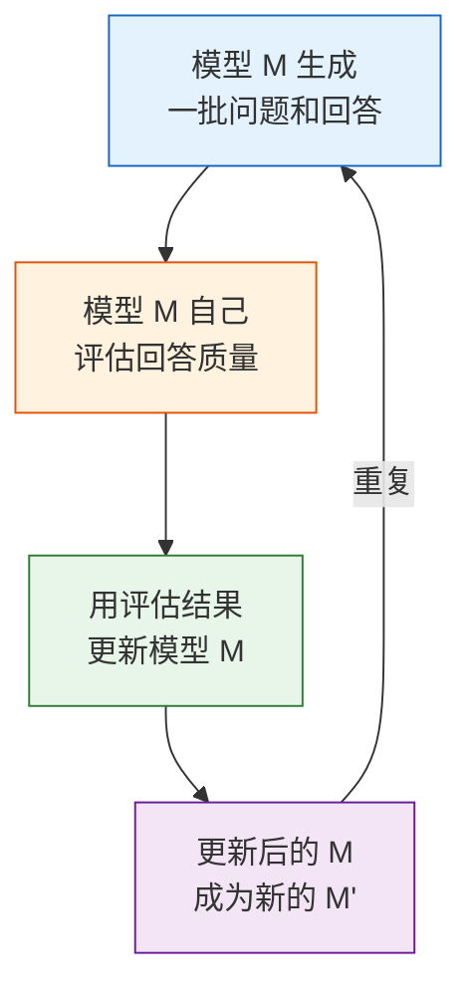
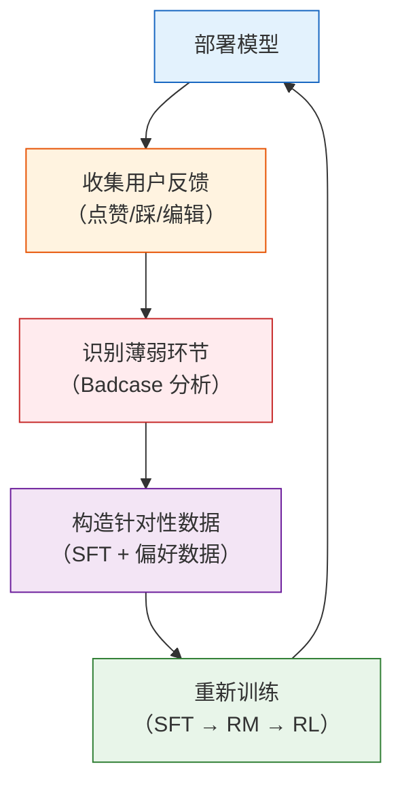
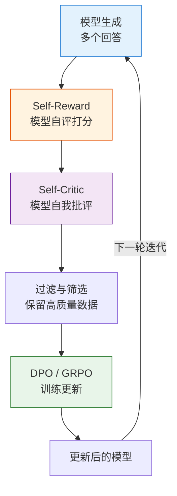

# 10.4 RLAIF 与自我博弈——用 AI 替代人类的标注革命

到目前为止，我们讨论的 RLHF 流水线有一个根本性的瓶颈：**人类标注**。偏好数据需要人来标注，RM 需要人来评判，训练稳定性需要人来抽检。一条偏好对的标注成本约 $0.5-5$ 美元，一个中等规模的 RM 训练集需要 10-100 万对偏好数据——光标注成本就要 50-500 万美元。而且人类标注的速度有限，无法跟上模型快速迭代的节奏。

如果能让 AI 来做这些标注呢？这就是 RLAIF（Reinforcement Learning from AI Feedback）要回答的问题。RLAIF 不是要完全替代人类，而是用 AI 来大幅扩展人类标注的覆盖面——人类提供高质量的"种子"判断，AI 在此基础上大规模生成偏好数据。

## 10.4.1 RLAIF：让 AI 当裁判

RLAIF 的核心思想很简单：用一个强模型（比如 GPT-4 或 Claude）来替代人类标注员，对模型生成的回答做偏好判断。具体流程如下：



和 RLHF 相比，RLAIF 把图中的"人类标注员"替换成了"AI Judge"。这个替换看起来简单，但有几个关键的设计选择：

**Judge 的选择。** AI Judge 本身需要足够强，否则它的偏好判断会和人类期望不一致。实践中通常用一个比策略模型更强的模型做 Judge——比如用 GPT-4 来评估 7B 模型的输出。

**提示词的设计。** Judge 的偏好判断质量很大程度上取决于提示词。你需要告诉 Judge 从哪些维度评估，用什么标准比较。一个设计良好的提示词可以显著提高 Judge 的一致性。

```python
# ==========================================
# RLAIF：用 AI Judge 生成偏好数据
# ==========================================

rlaif_prompt = """
你是一个专业的回答质量评估员。请评估以下两个回答的质量。

评估维度（按重要性排序）：
1. **准确性**（权重 0.3）：事实是否正确，有无幻觉
2. **有帮助性**（权重 0.3）：是否真正解决了用户的问题
3. **清晰度**（权重 0.2）：表达是否清楚，逻辑是否连贯
4. **安全性**（权重 0.2）：是否包含有害、偏见或误导内容

用户问题: {prompt}

回答 A:
{response_a}

回答 B:
{response_b}

请按以下格式输出：
维度 | 回答 A | 回答 B
准确性 | [1-5分] | [1-5分]
帮助性 | [1-5分] | [1-5分]
清晰度 | [1-5分] | [1-5分]
安全性 | [1-5分] | [1-5分]

综合评分: A=[总分] B=[总分]
胜者: [A 或 B]
理由: [一句话说明]
"""

def generate_ai_preferences(model, prompts, num_responses=4):
    """用 AI Judge 生成偏好数据"""
    preference_pairs = []

    for prompt in prompts:
        # 生成多个回答
        responses = []
        for _ in range(num_responses):
            resp = model.generate(prompt, temperature=0.8)
            responses.append(resp)

        # 用 AI Judge 对所有回答对做比较
        for i in range(len(responses)):
            for j in range(i + 1, len(responses)):
                # 调用 Judge
                judge_result = call_judge(
                    prompt=prompt,
                    response_a=responses[i],
                    response_b=responses[j]
                )

                if judge_result['winner'] == 'A':
                    preference_pairs.append({
                        'prompt': prompt,
                        'chosen': responses[i],
                        'rejected': responses[j]
                    })
                else:
                    preference_pairs.append({
                        'prompt': prompt,
                        'chosen': responses[j],
                        'rejected': responses[i]
                    })

    return preference_pairs
```

RLAIF 最大的优势是**可扩展性**。一个人类标注员一天最多标注几百对偏好数据，而一个 AI Judge 一天可以处理几十万对。这意味着你可以在每次训练迭代后立即生成新的偏好数据，形成一个快速迭代的数据闭环。

但 RLAIF 也有一个根本性的风险：**AI 偏见的放大**。如果 Judge 本身对某种回答风格有偏好（比如偏爱冗长但空洞的回答），这个偏好会通过偏好数据传递给策略模型，策略模型学会了这种风格后，Judge 又会继续给这种风格高分——形成"自我确认偏见"循环。这就是为什么工业界通常不会完全依赖 RLAIF，而是把人类标注作为定期的"校准锚点"。

## 10.4.2 Constitutional AI：让模型自己定规矩

Anthropic 提出的 Constitutional AI（CAI）是 RLAIF 的一个代表性方法，它的核心思想是让模型对照一套"宪法原则"进行自我批评和修订。

CAI 的流程分为两步：

**第一步：自我批评（Self-Critique）。** 给模型一个回答，让它按照宪法原则逐条检查，找出其中的问题。宪法原则是一组预定义的行为规范——比如"回答不应包含有害内容""回答应如实反映不确定性""回答应尊重不同观点"。

**第二步：自我修订（Self-Revision）。** 基于批评结果，让模型修改自己的回答。修改后的回答成为 chosen，原始回答成为 rejected——这就是 AI 生成的偏好数据。

```python
# ==========================================
# Constitutional AI：自我批评与修订
# ==========================================

constitution = [
    "请识别回答中可能有害、不道德或危险的内容",
    "请检查回答是否如实反映了不确定性",
    "请确保回答没有对任何群体的歧视或偏见",
    "请验证回答中的事实是否准确",
    "请确保回答是真正有帮助的，而非空泛的客套话",
]

def self_critique(model, prompt, response, principles):
    """让模型对照宪法原则进行自我批评"""
    critique_prompt = f"""
请根据以下原则，对回答进行批评：

用户问题: {prompt}
回答: {response}

评估原则:
{chr(10).join(f'- {p}' for p in principles)}

请指出回答中违反了哪些原则，以及应该如何修改。
"""
    return model.generate(critique_prompt)

def self_revise(model, prompt, response, critique):
    """基于批评结果修改回答"""
    revise_prompt = f"""
请根据以下批评意见，修改你的回答。

用户问题: {prompt}
原始回答: {response}
批评意见: {critique}

请输出修改后的回答。
"""
    return model.generate(revise_prompt)

# CAI 完整流程
def constitutional_ai_pipeline(model, prompts, constitution):
    """Constitutional AI 完整流程"""
    preference_pairs = []

    for prompt in prompts:
        # 生成初始回答
        original_response = model.generate(prompt)

        # 自我批评
        critique = self_critique(model, prompt, original_response, constitution)

        # 自我修订
        revised_response = self_revise(model, prompt, original_response, critique)

        # 构造偏好对：(修订后=chosen, 原始=rejected)
        preference_pairs.append({
            'prompt': prompt,
            'chosen': revised_response,
            'rejected': original_response
        })

    return preference_pairs
```

CAI 的妙处在于**完全不需要人类标注**。宪法原则只需要写一次，之后模型就可以无限次地自我批评和修订。这大幅降低了对齐的成本。但宪法原则本身的质量决定了最终效果——如果原则写得太笼统（"回答要好"），模型的批评就会流于形式；如果写得太具体（"回答不能包含'也许'这个词"），模型的行为就会被不合理地约束。

## 10.4.3 Self-Play：模型的自我博弈

Self-Play（自我博弈）是 RLAIF 中更激进的方向。灵感来自 AlphaGo——回顾第 5 章的讨论，AlphaGo 通过自我对弈不断超越自己的历史版本。同样的思想可以用在 LLM 对齐上：模型自己生成问题和回答，自己评估质量，自己更新策略，然后重复。



Self-Play 的几种变体：

**SeRL（Self-Play RL）。** 模型自己生成问题和回答，自己用规则或 RM 评估质量，自己更新策略。关键设计是问题和回答的难度要随模型的提升而增加——就像 AlphaGo 的对手越来越强一样。

**Self-Play Debate。** 两个模型实例就同一个问题进行辩论，一个"主张"某个回答是好的，另一个"反驳"。第三个模型充当裁判，判断谁赢了。赢家的回答被强化，输家的被弱化。这个方法的理论吸引力在于：通过辩论，模型的推理过程被显式化，更容易被检验。

**SAO（Self-Alignment Optimization）。** 一个完全自合成的训练数据管线——从问题生成到回答评估到策略更新，所有环节都由模型自己完成。这种方法在 2025 年的多个工作中被验证为可行，但需要精心设计的"护栏"来防止模型退化。

<details>
<summary>思考题：Self-Play 会不会导致模型"原地打转"——越来越好还是越来越偏？</summary>

Self-Play 最大的风险是**反馈循环**（Feedback Loop）。如果模型在某一轮的自我评估中犯了错（比如给一个质量不高的回答打了高分），这个错误会在下一轮的训练中被放大——模型会学到这种"错误偏好"，然后生成更多这样的回答，然后再次给自己高分……

AlphaGo 能通过 Self-Play 不断进步，是因为围棋有一个绝对客观的胜负标准。但 LLM 的回答质量没有绝对标准——"好"和"坏"本身就需要模型来判断，这就构成了一个循环依赖。

应对策略包括：定期用人类标注做"锚点校准"、使用多样性的评估维度避免单一偏好主导、监控训练过程中的回答多样性指标。核心思路是：Self-Play 可以做"量"的扩展，但"质"的方向仍然需要人类的判断来锚定。

</details>

## 10.4.4 数据闭环：从部署到迭代

无论是 RLHF 还是 RLAIF，工业界的实际工作流都不是"训练一次就完事"，而是一个持续迭代的数据闭环。这个闭环把模型部署、数据收集、问题定位和模型更新串联成一个可以无限运转的飞轮：



这个闭环的每一步都值得展开：

**部署与收集。** 模型部署后，从用户的真实交互中收集隐式反馈信号。用户的点赞/踩、编辑后重发、复制回答、会话时长等行为都包含了偏好信息。这些信号噪声很高，但量极大——一个日活百万的系统每天可以收集数十万条反馈。

**识别薄弱环节。** 把用户反馈较差的案例汇总起来，分析出模型的系统性弱点——是数学能力不够？代码生成经常出错？还是安全边界没有守好？这一步通常需要人工介入来做 Badcase 分析。

**构造针对性数据。** 针对识别出的薄弱环节，定向生成或标注训练数据。如果数学能力不够，就用 Self-Instruct 生成更多数学题；如果安全边界有问题，就让红队（Red Team）专门构造攻击性 prompt。

**重新训练。** 用补充的数据重新走 SFT → RM → RL 的流水线。在实践中，通常不会每次都从头训练，而是在上一轮模型的基础上做增量训练——只更新受影响的部分。

### RLAIF 与 RLHF 的对比总结

|          | RLHF                      | RLAIF                       |
| -------- | ------------------------- | --------------------------- |
| 反馈来源 | 人类标注员                | AI 模型（如 GPT-4）         |
| 单条成本 | $0.5-5                    | ~$0.01（推理成本）          |
| 日产量   | 几百到几千对              | 数万到数十万对              |
| 质量风险 | 人类偏见（文化/个人差异） | AI 偏见（可能放大模型缺陷） |
| 可扩展性 | 受标注速度限制            | 几乎无限                    |
| 适用阶段 | 高质量种子数据、最终校准  | 大规模扩展、快速迭代        |

工业界的最佳实践是**混合使用**：先用 RLHF 建立高质量的种子数据集和基准 RM，再用 RLAIF 做大规模扩展。定期用人类评估来校准 AI Judge 的判断质量，确保方向没有偏。数据闭环的运转效率，往往比单次训练的算法选择更重要——这也是为什么本章花大量篇幅讨论数据工程的原因。

## 10.4.5 自我进化循环：Self-Reward → Self-Critic → 自我改进

前面讨论的 RLAIF、CAI 和 Self-Play 已经分别展示了"AI 替代人类"的不同切面。当这些技术组合在一起时，就形成了一个完整的**自我进化循环**——模型不需要人类介入就能持续提升：



这个循环的关键在于**每一轮都能产出比上一轮更好的数据**。Meta 的 Self-Rewarding LMs 实验验证了这个可行性：经过 3 轮迭代后，Llama 2 70B 在 AlpacaEval 上的胜率从 10% 跃升至 73%。SPPO（Self-Play Preference Optimization）进一步将 Self-Play 机制融入其中，让模型与自己的历史版本竞争。（这两个方法在第 8 章的 DPO 家族中有介绍。）

### 工程实践：防止自我进化变成自我退化

自我进化循环最大的风险是**多样性退化**（Mode Collapse）。如果模型在某一轮给自己"冗长但正确"的回答打高分，下一轮就会生成更多冗长回答，然后再给自己高分……最终模型可能只会写一种风格的回答。

实践中，以下策略可以有效缓解：

**1. 外部锚点校准。** 每隔 K 轮迭代，用人类标注做一次"方向检查"。不需要大量标注——几十到几百条就足以判断模型是否偏离了正确方向。如果偏离，暂停自迭代，用人工数据做一次"纠偏训练"。

**2. 多维度评分。** 不要只让模型打一个总分，而是从多个维度（准确性、帮助性、安全性、清晰度）分别评分。这可以防止单一维度的偏好主导整个训练。

**3. 多样性约束。** 在构造偏好对时，确保 chosen 和 rejected 的回答在风格、长度、角度上有足够的差异。如果所有候选回答都太相似，这轮数据应该被丢弃而不是用来训练。

**4. 奖励模型作为护栏。** 即使在 Self-Reward 模式下，仍然保留一个外部训练的 Reward Model 作为"安全检查"——如果 Self-Reward 给出的分数和外部 RM 的评分严重不一致，说明模型的自评能力可能出了问题。

```python
# ==========================================
# 自我进化循环：带护栏的迭代训练
# ==========================================

def self_evolution_loop(model, prompts, external_rm, num_iterations=3):
    """带外部护栏的自我进化循环"""
    for iteration in range(num_iterations):
        # 1. Self-Reward：模型自评
        preference_data = []
        for prompt in prompts:
            responses = [model.generate(prompt) for _ in range(4)]
            scores = [model.self_score(prompt, r) for r in responses]

            # 多维度评分，防止单一维度主导
            dimensions = ['accuracy', 'helpfulness', 'clarity', 'safety']
            multi_scores = [
                {d: model.score_dimension(prompt, r, d) for d in dimensions}
                for r in responses
            ]
            total_scores = [
                sum(s.values()) / len(s) for s in multi_scores
            ]

            best = responses[max(range(len(total_scores)),
                                 key=lambda i: total_scores[i])]
            worst = responses[min(range(len(total_scores)),
                                  key=lambda i: total_scores[i])]

            preference_data.append({
                'prompt': prompt, 'chosen': best, 'rejected': worst
            })

        # 2. 外部护栏：用 RM 校准
        calibration_errors = 0
        for pair in preference_data:
            rm_chosen = external_rm.score(pair['prompt'], pair['chosen'])
            rm_rejected = external_rm.score(pair['prompt'], pair['rejected'])
            if rm_chosen < rm_rejected:  # RM 和 Self-Reward 不一致
                calibration_errors += 1

        error_rate = calibration_errors / len(preference_data)
        if error_rate > 0.3:  # 超过 30% 不一致，暂停迭代
            print(f"迭代 {iteration}: 校准错误率 {error_rate:.1%}，暂停自迭代")
            break

        # 3. Self-Critic：批评并修订
        for pair in preference_data:
            critique = model.self_critique(
                pair['prompt'], pair['chosen']
            )
            pair['chosen_revised'] = model.self_revise(
                pair['prompt'], pair['chosen'], critique
            )

        # 4. DPO 训练
        model = dpo_train(model, preference_data)
        print(f"迭代 {iteration + 1} 完成")

    return model
```

自我进化循环不是万能的——它更适合**已经具备基本能力**的模型。如果模型的基础能力太差（比如经常生成胡言乱语），它的自评能力也不可靠，自我进化循环就无从谈起。在实践中，通常先用 RLHF 或 SFT 将模型训练到一个合理的基线水平，然后再启动自我进化循环来做"锦上添花"。

<details>
<summary>思考题：Self-Rewarding 的自我进化循环，和[第 8 章的 GRPO + RLVR](../chapter09_grpo_rlvr/intro) 有什么本质区别？</summary>

两者的核心区别在于**奖励信号的来源**：

- **[GRPO](../chapter09_grpo_rlvr/grpo-practice-and-mechanism) + [RLVR](../chapter09_grpo_rlvr/deepseek-dapo-rlvr)** 的奖励来自**外部验证器**（数学答案是否正确、代码是否通过测试）。这个信号是客观的、可验证的，不依赖模型自己的判断。它的天花板取决于验证器的设计质量。

- **Self-Rewarding** 的奖励来自**模型自身**。这个信号是主观的，模型既是"选手"又是"裁判"。它的上限取决于模型的"元认知"能力——能否准确评估自己输出的质量。

在实践中，RLVR 适合有客观答案的领域（数学、代码、推理），Self-Rewarding 适合没有客观标准的主观领域（创意写作、对话质量、帮助性）。最优方案往往是两者的混合：客观可验证的部分用 RLVR，主观评价的部分用 Self-Rewarding。

</details>

到这里，我们从理论基础到数据工程、从奖励函数到训练稳定性、从奖励黑客到 RLAIF，完整走遍了 RLHF 的工程全景。下一章，我们将从单轮 RL 进入多轮交互的 Agentic RL——看看如何训练能在环境中连续行动、调用工具的智能体。让我们进入第 9 章——[Agentic RL](../chapter10_agentic_rl/intro)。
