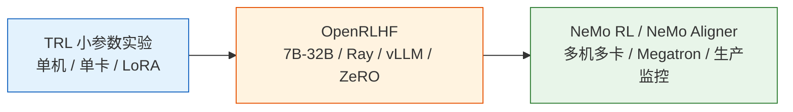
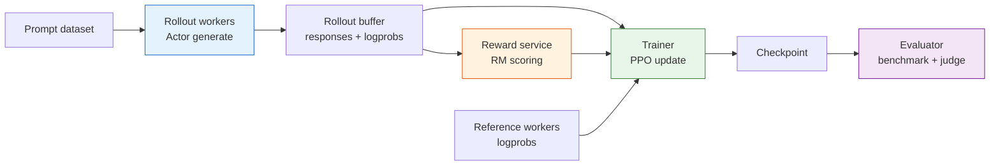

# 补充阅读：从小参数到大参数——同一条 RLHF 流水线怎么放大

## 本节导读

**核心内容**

- 理解小参数 TRL 实验和大参数 RLHF 工程之间的结构一致性。
- 掌握 RLHF 放大后新增的系统瓶颈：rollout、四模型显存、RM 吞吐、checkpoint、监控。
- 学会判断什么时候继续用 TRL，什么时候迁移到 OpenRLHF、NeMo RL / NeMo Aligner 等分布式框架。

**核心问题**

小模型里，RLHF 看起来像一个 Python loop：

```text
generate -> reward -> PPO update
```

大模型里，同一件事会变成一个分布式系统：

```text
rollout workers -> reward service -> replay / rollout buffer -> trainer workers -> evaluator
```

算法还是 SFT、RM、PPO；变重的是系统工程。

本章的小参数实验用 TRL 跑通，是为了让你在一张消费级显卡或较小云实例上看清楚 RLHF 的完整结构。但工业训练关心的是另一件事：当模型从 360M、0.5B 放大到 7B、32B、70B 甚至更大时，这条流水线还能不能跑起来。

答案是：**算法结构基本不变，系统工程完全变重**。



## 小参数版本（TRL）

小参数实验最重要的价值是可理解。你能直接看到：

- SFT 阶段如何把 base model 改造成 assistant。
- Reward Model 如何用 chosen/rejected 学会排序。
- PPO 阶段如何同时使用 Actor、Reference、Reward Model 和 Critic。
- KL、长度、reward、偏好胜率如何一起监控。

这时最合适的技术栈是 `transformers`、`datasets`、`peft`、`trl`、`accelerate`。模型可以选 `HuggingFaceTB/SmolLM2-360M`、`Qwen/Qwen2.5-0.5B`、`EleutherAI/pythia-410m` 这类参数量较小的 base model。

```text
base checkpoint
  -> SFTTrainer
  -> RewardTrainer
  -> PPOTrainer
  -> evaluation + human/LLM judge
```

这不是生产性能最优的路线，但非常适合学习经典 RLHF 的组成部件。

小参数阶段建议先把下面这些问题全部跑通：

| 问题                            | 通过标准                           |
| ------------------------------- | ---------------------------------- |
| SFT 是否真的改变 base 行为？    | 固定 prompt 对比明显更像 assistant |
| RM 是否能区分 chosen/rejected？ | held-out accuracy 和 margin 合理   |
| PPO 是否稳定？                  | reward 缓慢升，KL 和长度不失控     |
| 评估是否可复现？                | 同一 checkpoint 重跑结果接近       |
| badcase 是否能回放？            | 失败样本能进入下一轮数据           |

如果这些问题在 0.5B 上还没搞清楚，直接上 7B 只会让调试成本乘上十倍。

## 中等参数版本（OpenRLHF）

当模型到 7B 以上，瓶颈开始从“代码能不能写出来”变成“rollout 和训练吞吐能不能跟上”。PPO-RLHF 需要模型不断生成回答，再让 RM 打分，再回到训练，这个 generate-train loop 会让普通训练框架很吃力。

OpenRLHF 这类框架的价值在于把几个系统问题打包解决：

| 问题         | 小参数 TRL      | 大参数 OpenRLHF 思路              |
| ------------ | --------------- | --------------------------------- |
| Rollout 速度 | 直接 `generate` | 用 vLLM / Ray 做高吞吐生成        |
| 显存压力     | LoRA 或单卡     | ZeRO、张量并行、流水并行          |
| 多模型调度   | 同进程较简单    | Actor、RM、Critic、Ref 分角色部署 |
| 数据流       | Python loop     | 分布式队列和 rollout buffer       |
| 监控         | 本地日志        | 实验平台、checkpoint、异常恢复    |

算法上你仍然在做 SFT、RM、PPO；只是每一步都被拆成分布式系统。

一个中等规模 PPO-RLHF 系统通常包含：



注意 rollout 和训练的资源形态不同。Rollout 更像推理服务，关心吞吐、KV cache、连续 batching；PPO update 是训练负载，关心显存、梯度同步、optimizer state。把两者都塞进一个简单 loop，在小模型可行，在大模型就会浪费资源。

### Rollout 瓶颈

普通监督训练的样本已经在硬盘上；PPO-RLHF 的训练样本要现场生成。每条样本都要经历：

```text
Actor 生成回答
  -> Reference 算 log-prob
  -> Reward Model 打分
  -> Critic 算 value
  -> PPO 更新
```

其中 Actor 生成是自回归的，一个 token 一个 token 生成；RM 和 Reference 又要对完整序列做前向。模型越大，这个闭环越贵。

所以大参数框架通常会引入：

| 技术                   | 解决什么                         |
| ---------------------- | -------------------------------- |
| vLLM / 高吞吐推理      | 加速 rollout 生成                |
| Ray / 分布式调度       | 分配 Actor、RM、Critic、Ref 资源 |
| ZeRO / FSDP / Megatron | 降低训练显存压力                 |
| Rollout buffer         | 解耦生成和训练                   |
| 异步评估               | 不阻塞主训练                     |

## 大参数版本（NeMo）

70B 级别以后，训练框架不仅要跑得动，还要可恢复、可观测、可复现。NVIDIA NeMo RL / NeMo Aligner 这类框架更接近生产训练视角：多机多卡、Megatron/FSDP、分布式 checkpoint、混合精度、模型并行、数据并行和完整监控都必须一起考虑。

大参数 RLHF 最难的地方通常不是 PPO 公式，而是以下问题：

- **四模型常驻成本**：Actor、Reference、Reward Model、Critic 都要占显存或推理资源。
- **生成和训练切换**：rollout 是推理负载，PPO update 是训练负载，两者资源形态不同。
- **奖励模型吞吐**：RM 每个回答都要打分，可能成为瓶颈。
- **KL 和长度监控**：一旦策略偏移太快，损失可能还没坏，输出已经坏了。
- **checkpoint 与恢复**：长时间训练中断后，Actor、Critic、optimizer、scheduler、rollout 状态要一致恢复。
- **评估闭环**：每个 checkpoint 都要跑固定 benchmark、偏好评估和安全抽检。

### 四模型成本估算

经典 PPO-RLHF 至少涉及四个模型角色：

| 角色         | 是否需要梯度 | 资源特征                               |
| ------------ | ------------ | -------------------------------------- |
| Actor        | 需要         | 最重，训练和生成都要用                 |
| Critic       | 需要         | 可和 Actor 共享部分 backbone，也可独立 |
| Reference    | 不需要       | 冻结推理，但要算 log-prob              |
| Reward Model | 不需要       | 冻结推理，吞吐可能成为瓶颈             |

这意味着“训练一个 7B 模型”不等于显存里只放一个 7B。即使 Reference 和 RM 冻结，它们也要占推理资源。为了省资源，工业系统会做很多工程折中：

- Actor 和 Critic 共享底座，只加 value head。
- Reference 用同一底座的冻结副本，必要时 offload。
- RM 用较小模型或服务化部署。
- Rollout 阶段和 PPO update 阶段复用 GPU，但要处理切换开销。

这些技巧不改变算法，但决定训练能不能跑得经济。

## 小模型实验和大模型工程的映射

| 本章小实验         | 大参数训练对应物                                  |
| ------------------ | ------------------------------------------------- |
| `SFTTrainer`       | 分布式 SFT，通常配合 LoRA、FSDP、ZeRO 或 Megatron |
| `RewardTrainer`    | 分布式 RM 训练，单独验证 RM accuracy / margin     |
| `PPOTrainer`       | Actor-RM-Critic-Ref 分布式 PPO 系统               |
| 本地 JSON 偏好数据 | 标注平台、数据版本、质量审计、去重和去污染        |
| 简单 judge prompt  | 多 judge、多维 rubric、人类仲裁                   |
| 本地评估脚本       | 自动 benchmark、A/B test、红队、安全回归          |

这张表说明一件事：小模型实验不是玩具，它是大模型训练的缩影。只要你理解了每个 artifact 的角色，换成大参数框架时就不会迷路。

再从“指标”角度看一次映射：

| 小实验指标        | 大规模对应指标                         |
| ----------------- | -------------------------------------- |
| `reward_mean`     | 按任务域、语言、长度分桶的 reward 分布 |
| `kl_mean`         | 每层/每 token/每任务 KL 监控           |
| `response_length` | 长度分布、截断率、EOS 率               |
| `eval_win_rate`   | 多 judge、人类 A/B、线上实验           |
| 本地日志          | SwanLab/W&B/内部监控平台               |
| 手动 checkpoint   | 分布式 checkpoint + 自动恢复           |

## 框架选型

| 规模    | 推荐路线                                           |
| ------- | -------------------------------------------------- |
| 135M-1B | TRL，优先理解流程                                  |
| 1B-7B   | TRL + Accelerate / DeepSpeed，可以继续用 LoRA      |
| 7B-32B  | OpenRLHF，重点解决 rollout 与分布式训练            |
| 70B+    | NeMo RL / NeMo Aligner，重点解决多机多卡与生产监控 |

不要过早上重框架。如果你还没在小模型上跑通 SFT、RM、PPO 和评估，直接上 7B/70B 只会把算法问题和系统问题混在一起，调试会非常痛苦。

可以用下面这张表做决策：

| 你遇到的问题                     | 是否该换框架                            |
| -------------------------------- | --------------------------------------- |
| SFT loss 不降                    | 不是，先查数据、mask、学习率            |
| RM 偏爱长回答                    | 不是，先查偏好数据和 RM 评估            |
| PPO KL 失控                      | 不一定，先调 beta、学习率、reward scale |
| 单卡显存放不下 Actor + Critic    | 可能，考虑 LoRA、ZeRO、FSDP             |
| rollout 生成太慢，GPU 利用率很低 | 可能，考虑 vLLM / OpenRLHF              |
| 多机训练中断无法恢复             | 是，考虑生产级框架和 checkpoint 管理    |

框架解决的是规模问题，不会自动解决奖励设计和数据质量问题。

## 大参数训练检查清单

准备把小实验放大前，至少检查这些项：

| 检查项       | 问题                                                    |
| ------------ | ------------------------------------------------------- |
| 数据版本     | SFT、RM、PPO prompt、eval set 是否有版本号？            |
| 模型版本     | Actor、Reference、RM、Critic 初始化是否记录清楚？       |
| RM 校准      | reward mean/std 是否固定，是否按领域分解？              |
| KL 目标      | target KL 和自适应 beta 策略是否明确？                  |
| Rollout 参数 | temperature、top_p、max length 是否固定？               |
| 失败恢复     | checkpoint 是否包含 optimizer、scheduler、global step？ |
| 评估闸门     | 哪些指标不过就停止或回滚？                              |
| 人工抽检     | 高 reward、高 KL、长回答样本是否有人看？                |

这张表看起来很工程，但 RLHF 放大后的风险往往就藏在这些“无聊细节”里。

## 本节小结

经典 RLHF 的结构在小模型和大模型上是一致的：base model 先 SFT，再训练 RM，最后 PPO 优化策略，并用评估闭环防止 reward hacking 和能力回退。区别在于，大模型训练需要把这条简单流水线扩展成分布式系统。

到这里，第 8 章完成了经典 RLHF 的主线。下一章我们会问一个自然的问题：既然这套流程这么重，能不能省掉一些组件？这就是 DPO、GRPO、RLVR 等现代 post-training 方法的出发点——[后训练对齐](../chapter09_alignment/intro)。

如果你想在进入第 9 章前多做一个实践，可以继续看扩展实验：故意写一个坏奖励函数，观察 reward hacking 如何发生，再用数据和评估把它修回来——[扩展实战：Reward Hacking 与数据飞轮](./extended-practice)。

## 练习

1. 画出你自己的 RLHF 系统图，标出 Actor、Reference、RM、Critic 分别在哪些 GPU 或进程上。
2. 解释为什么 rollout 更像推理负载，而 PPO update 更像训练负载。
3. 写一份从 0.5B TRL 实验迁移到 7B OpenRLHF 的检查清单。
