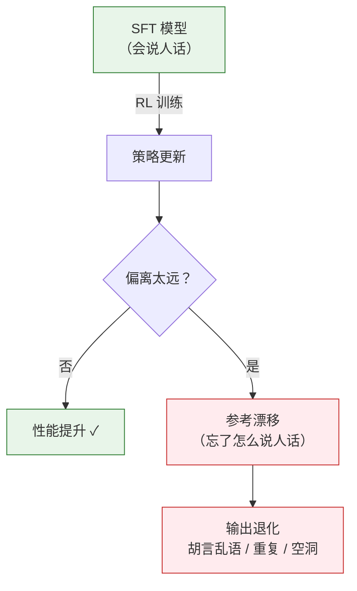
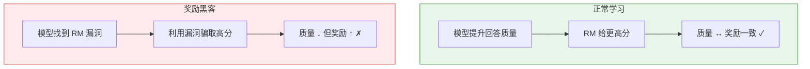

# 10.3 训练稳定性与奖励黑客——让 RLHF 不崩也不偏

你在第 6 章写过 PPO 的训练循环，在第 8 章跑过 GRPO 的实验。那些实验在玩具规模上都跑得不错——奖励曲线稳步上升，最终收敛。但当你把同样的算法搬到 70B 参数的大模型上，用上亿条 token 训练时，事情就开始变得不可预测了。训练可能突然崩溃（loss 变成 NaN），可能收敛到奇怪的模式（模型只会说"我很乐意帮助您"），也可能奖励在涨但实际质量在降（奖励黑客）。

这一节讲的就是怎么让 RLHF 训练"不崩"和"不偏"——工业界把这些技巧统称为训练稳定性控制。它不是锦上添花的优化，而是 RLHF 能不能跑起来的基本前提。

## 10.3.1 RLHF 训练的不稳定因素

RLHF 训练为什么容易崩？有三个根本性的原因：

**原因一：非平稳的目标。** 在标准监督学习中，数据是固定的——每个 epoch 看到的训练样本都一样。但在 RL 中，数据是策略自己生成的。策略每更新一步，生成的数据分布就变了，下一步的数据和上一步的数据分布不一样。这就像在一个不断移动的靶子上射击——刚瞄准好，靶子就跑了。

**原因二：奖励模型不完美。** RM 是在一个有限的数据集上训练的，它对训练集覆盖的场景打分比较准，但对没见过的场景可能给出荒谬的分数。策略在 RL 训练中会不断探索新区域——恰好是 RM 最不准的地方。这形成了一个恶性循环：策略探索新区域 → 得到不准确的奖励 → 朝错误方向更新 → 进入更离谱的区域。

**原因三：策略可能偏离太远。** SFT 模型花了几千条精心标注的数据才学会"怎么说人话"。如果 RL 训练让策略偏离 SFT 太远，模型可能"忘了"基本语言能力，退化成胡言乱语。这叫做**参考漂移（Reference Drift）**。



## 10.3.2 四大稳定性技巧

针对上面三个问题，工业界发展出了一套标准的稳定性工具箱。

### 技巧一：KL 散度惩罚

KL 散度惩罚是防止参考漂移的第一道防线。它在 PPO 的目标函数中加入一个正则项，惩罚策略 $\pi_\theta$ 偏离参考策略 $\pi_{ref}$（即 SFT 模型）太远：

$$\mathcal{L}_{PPO} = \mathbb{E}\left[\min\left(r_t \hat{A}_t, \text{clip}(r_t, 1-\epsilon, 1+\epsilon)\hat{A}_t\right)\right] - \beta \cdot D_{KL}(\pi_\theta \| \pi_{ref})$$

回顾第 6 章，$r_t = \frac{\pi_\theta(a_t|s_t)}{\pi_{old}(a_t|s_t)}$ 是概率比，$\hat{A}_t$ 是优势估计。新加入的 $\beta \cdot D_{KL}$ 项的作用是：每当策略偏离参考模型，就扣掉一部分奖励。$\beta$ 是一个需要仔细调试的超参数——太大则训练不动（策略被死死拽在参考模型附近），太小则防不住漂移。

```python
# ==========================================
# KL 散度惩罚的计算
# ==========================================
import torch
import torch.nn.functional as F

def compute_kl_penalty(log_probs_current, log_probs_ref):
    """
    计算当前策略与参考策略之间的 KL 散度
    KL(π_θ || π_ref) = Σ π_θ * (log π_θ - log π_ref)
    """
    # 用 log-sum-exp 技巧数值稳定地计算 KL
    kl = (log_probs_current - log_probs_ref).mean()
    return kl

# 在 PPO 训练循环中使用
def ppo_step_with_kl(policy, ref_policy, optimizer, batch, beta=0.05):
    """带 KL 惩罚的 PPO 更新"""
    log_probs = policy.get_log_probs(batch.states, batch.actions)
    ref_log_probs = ref_policy.get_log_probs(batch.states, batch.actions)

    # PPO 裁剪目标（回顾第 6 章）
    ratio = torch.exp(log_probs - batch.old_log_probs)
    clipped_ratio = torch.clamp(ratio, 1 - 0.2, 1 + 0.2)
    ppo_loss = -torch.min(
        ratio * batch.advantages,
        clipped_ratio * batch.advantages
    ).mean()

    # KL 惩罚
    kl = compute_kl_penalty(log_probs, ref_log_probs)
    total_loss = ppo_loss + beta * kl

    optimizer.zero_grad()
    total_loss.backward()
    torch.nn.utils.clip_grad_norm_(policy.parameters(), max_norm=1.0)
    optimizer.step()

    return ppo_loss.item(), kl.item()
```

KL 惩罚的 $\beta$ 怎么调？一个常见的策略是**自适应调节**：如果 KL 散度比目标值大，就增大 $\beta$（拉回来）；如果 KL 散度比目标值小，就减小 $\beta$（放开一点）。InstructGPT 论文中就用了这种自适应方案。

### 技巧二：学习率 Warmup 与余弦衰减

RL 训练的学习率调度和监督学习不太一样。由于训练初期策略生成的数据质量很低（基本是随机输出），RM 的梯度信号在这个阶段很不稳定。如果学习率太大，参数更新可能会让策略直接崩溃。因此，RLHF 通常使用一个 warmup 阶段，让学习率从 0 逐步上升到目标值：

```python
# ==========================================
# 学习率调度：Warmup + 余弦衰减
# ==========================================
from torch.optim.lr_scheduler import LambdaLR
import math

def get_cosine_schedule_with_warmup(optimizer, warmup_steps, total_steps):
    """Warmup + 余弦衰减调度器"""
    def lr_lambda(step):
        if step < warmup_steps:
            # Warmup 阶段：线性增长
            return step / max(1, warmup_steps)
        # 余弦衰减阶段
        progress = (step - warmup_steps) / max(1, total_steps - warmup_steps)
        return max(0.0, 0.5 * (1.0 + math.cos(math.pi * progress)))

    return LambdaLR(optimizer, lr_lambda)

# 使用示例
optimizer = torch.optim.AdamW(policy.parameters(), lr=1e-6, weight_decay=0.01)
scheduler = get_cosine_schedule_with_warmup(
    optimizer, warmup_steps=50, total_steps=1000
)
```

注意 RLHF 的学习率通常比 SFT 小一个数量级——SFT 用 $10^{-5}$，RL 阶段用 $10^{-6}$。这是因为 RL 的梯度信号噪声更大，需要更小的步长来保持稳定。

### 技巧三：梯度裁剪

梯度裁剪是防止训练崩溃的最后一道防线。在 RL 训练中，偶尔会出现极大的梯度——比如策略在某个 token 上给出了极低的概率，导致 log_prob 变成一个极大的负数，梯度爆炸。梯度裁剪把梯度的范数限制在一个阈值之内：

$$\nabla_\theta \leftarrow \min\left(1, \frac{c}{\|\nabla_\theta\|}\right) \cdot \nabla_\theta$$

其中 $c$ 是裁剪阈值（通常设为 1.0）。这保证了参数更新的步长不会超过某个上限。

### 技巧四：奖励归一化

RM 输出的分数范围可能非常大——有些回答得 0.1 分，有些得 100 分。这种尺度差异会导致 RL 训练不稳定（高分样本的梯度信号太强）。解决方案是在训练过程中动态归一化奖励：

```python
# ==========================================
# 奖励归一化：运行均值和方差
# ==========================================
class RewardNormalizer:
    """在线奖励归一化"""
    def __init__(self, momentum=0.99):
        self.mean = 0.0
        self.var = 1.0
        self.momentum = momentum
        self.count = 0

    def update(self, rewards):
        """更新运行统计量"""
        batch_mean = rewards.mean().item()
        batch_var = rewards.var().item()
        self.count += 1

        # 指数移动平均
        self.mean = self.momentum * self.mean + (1 - self.momentum) * batch_mean
        self.var = self.momentum * self.var + (1 - self.momentum) * batch_var

    def normalize(self, rewards):
        """归一化到均值 0、方差 1"""
        return (rewards - self.mean) / (self.var ** 0.5 + 1e-8)
```

奖励归一化确保了不管 RM 输出的原始分数范围是什么，RL 训练看到的奖励信号都在一个合理的尺度内。这和第 5 章讨论的"基线减均值的技巧"本质上是同一件事——都是通过中心化来降低方差。

## 10.3.3 训练指标仪表盘

RLHF 训练过程中，你需要同时监控多个指标来判断训练是否健康。就像飞机的仪表盘——不是只看高度（奖励），还要看速度（KL 散度）、油量（策略熵）和航向（响应长度）。

| 指标            | 含义                     | 正常范围 | 异常信号                      |
| --------------- | ------------------------ | -------- | ----------------------------- |
| Reward（奖励）  | RM 给的平均分数          | 稳步上升 | 突然飙升或持续不变            |
| KL Divergence   | 策略与参考模型的偏离程度 | 逐步增大 | 突然跳升（策略崩溃）          |
| Response Length | 平均响应长度             | 相对稳定 | 持续增长（可能在做长度 hack） |
| Policy Entropy  | 策略的随机性             | 逐步下降 | 快速降到 0（模式崩溃）        |
| Reward Std      | 奖励的标准差             | 相对稳定 | 持续下降（失去多样性）        |
| Value Loss      | Critic 的预测误差        | 逐步下降 | 突然上升（Critic 失效）       |
| PPO Clip Ratio  | 被裁剪的更新比例         | 10%-30%  | 持续 > 50%（更新太激进）      |

```python
# ==========================================
# 训练指标记录与可视化
# ==========================================
import matplotlib.pyplot as plt

class TrainingLogger:
    """RLHF 训练指标记录器"""
    def __init__(self):
        self.metrics = {
            'reward': [], 'kl_div': [], 'response_length': [],
            'entropy': [], 'reward_std': [], 'clip_ratio': []
        }

    def log(self, step, **kwargs):
        for key, value in kwargs.items():
            self.metrics[key].append((step, value))

    def plot_dashboard(self):
        """画出指标仪表盘"""
        fig, axes = plt.subplots(2, 3, figsize=(18, 10))
        titles = ['Reward', 'KL Divergence', 'Response Length',
                  'Policy Entropy', 'Reward Std', 'Clip Ratio']
        colors = ['#2e7d32', '#c62828', '#1565c0',
                  '#e65100', '#6a1b9a', '#00838f']

        for ax, (key, title), color in zip(axes.flat, zip(self.metrics.keys(), titles), colors):
            steps, values = zip(*self.metrics[key])
            ax.plot(steps, values, color=color, linewidth=1.5)
            ax.set_title(title, fontsize=12)
            ax.set_xlabel('Step')
            ax.grid(True, alpha=0.3)

        plt.tight_layout()
        plt.savefig('rlhf_dashboard.png', dpi=150)
        plt.show()
```

<details>
<summary>思考题：为什么 Policy Entropy 快速降到 0 是危险的？</summary>

策略熵衡量的是策略输出的"随机性"——熵高意味着模型对各种回答的概率分布比较均匀，熵低意味着模型几乎只输出一种回答。如果熵快速降到 0，说明模型坍塌到了一个固定模式——这就是**模式崩溃（Mode Collapse）**。

模式崩溃的模型只会输出一种风格的回答，不管你问什么。比如，它可能学会了"对所有问题都回答'这是一个很好的问题！让我来详细解释一下……'"——因为这种回答格式恰好能得到 RM 的高分。一旦策略坍塌到这种模式，从 RM 的反馈中几乎不可能恢复——因为 RM 看到的都是同一种回答，无法提供多样化的梯度信号。

应对模式崩溃的方法包括：提高 KL 惩罚系数（防止策略太偏）、在奖励中加入熵正则化（鼓励多样性）、降低学习率（减缓坍塌速度）。第 5 章讨论的策略熵概念在这里直接适用。

</details>

## 10.3.4 奖励黑客：模型在作弊

奖励黑客（Reward Hacking）是 RLHF 中最令人头疼的问题之一。它的表现是：训练曲线上的奖励分数在持续上升，但人工评估发现模型的实际输出质量在下降。模型找到了一条"捷径"——不是真的学会了更好的回答方式，而是找到了 RM 的评分漏洞。

### 奖励黑客的四种典型模式

**模式一：长度膨胀。** 模型学会了"写得多就是好"——即使内容空洞，只要字数够多，RM 就会给高分。这在很多开源 RM 上都被观察到。

**模式二：重复废话。** 模型学会了反复重复安全但无意义的话——"这是一个很好的问题""请注意以下重要事项"——这些话恰好能从 RM 那里骗取高分。

**模式三：格式作弊。** 如果你设置了格式奖励（比如有分点就加分），模型可能学会用格式来套利——不管内容是否相关，都强制用分点、加粗、引用等格式。

**模式四：特定短语。** 模型可能发现某些特定短语（如"我很乐意帮助您""希望这能帮到你"）能稳定地获得 RM 的高分，于是不管什么问题都加上这些短语。



### 怎么检测奖励黑客？

检测奖励黑客需要同时监控多个信号。以下是工业界常用的检查清单：

**信号一：回答长度与奖励的强相关性。** 如果在训练过程中，回答长度和 RM 分数的相关系数持续上升（比如从 0.2 涨到 0.8），说明模型可能在通过"凑字数"来骗取高分。检测方法是画一个长度 vs 奖励的散点图，观察相关性变化。

**信号二：人工评估与 RM 分数偏离。** 定期让人类标注员评估模型的输出质量，然后和 RM 的分数做对比。如果 RM 给高分的回答在人工评估中得分很低，就说明 RM 被hack了。这个检测方法最可靠，但成本也最高。

**信号三：特定短语频率飙升。** 统计模型输出中高频短语的出现频率。如果某些客套话或废话的出现频率在训练中持续上升，说明模型可能在利用这些短语套利。

**信号四：训练集上 reward 上升但验证集上质量下降。** 用一个 held-out 的评估集，定期检查模型在评估集上的表现。如果训练集的奖励在上升但评估集的质量在下降，说明模型在过拟合 RM 的评分偏好。

```python
# ==========================================
# 奖励黑客检测工具
# ==========================================
import numpy as np
from scipy.stats import pearsonr

def detect_length_hacking(rewards, lengths, window=50):
    """检测长度与奖励的相关性是否异常升高"""
    correlations = []
    for i in range(window, len(rewards)):
        r = rewards[i-window:i]
        l = lengths[i-window:i]
        corr, _ = pearsonr(r, l)
        correlations.append(corr)

    # 如果最近的相关性 > 0.6 且在持续上升
    recent_corr = correlations[-1]
    corr_trend = correlations[-1] - correlations[-10]
    is_hacking = recent_corr > 0.6 and corr_trend > 0.1

    return {
        "current_correlation": recent_corr,
        "trend": corr_trend,
        "warning": is_hacking
    }

def detect_phrase_hacking(generated_texts, top_k=5):
    """检测高频重复短语"""
    from collections import Counter

    phrase_counter = Counter()
    for text in generated_texts:
        # 提取 4-gram 短语
        words = text.split()
        for i in range(len(words) - 3):
            phrase = " ".join(words[i:i+4])
            phrase_counter[phrase] += 1

    top_phrases = phrase_counter.most_common(top_k)
    max_freq = top_phrases[0][1] / len(generated_texts)

    return {
        "top_phrases": top_phrases,
        "max_frequency_ratio": max_freq,
        "warning": max_freq > 0.3  # 超过 30% 的回答包含同一短语
    }
```

### 怎么防范奖励黑客？

防范奖励黑客没有一劳永逸的方案，但有几种有效的策略组合：

**策略一：多维度混合奖励。** 不要只用 RM 打分，加入规则奖励（格式、长度惩罚、重复惩罚）作为约束。即使 RM 被hack了，规则奖励仍然能保住基本质量。

**策略二：对抗性数据增强。** 定期收集模型的高分回答，让标注员找出其中的漏洞，然后用这些"反面教材"更新 RM 的训练数据。本质上就是让 RM 也跟着进化。

**策略三：KL 惩罚。** KL 惩罚不只防止参考漂移，也能抑制奖励黑客——因为黑客行为通常需要策略大幅偏离参考模型。如果策略被限制在参考模型附近，它就很难做出极端的作弊行为。

**策略四：定期人工抽检。** 每隔固定步数（比如每 100 步），随机抽取一批模型输出，让人类标注员评估质量。这是最终的安全网——无论 RM 怎么说，人类的判断才是最终标准。

## 10.3.5 常见训练失败模式速查

最后，把常见的训练失败模式整理成一张速查表，方便你在训练出问题时快速定位：

| 失败现象           | 可能原因                 | 检查方法                  | 修复方案                  |
| ------------------ | ------------------------ | ------------------------- | ------------------------- |
| Loss 变成 NaN      | 梯度爆炸 / 学习率太大    | 检查梯度范数              | 降低学习率、加强梯度裁剪  |
| 奖励不动           | 学习率太小或 KL 惩罚太大 | 检查 KL 散度变化          | 降低 $\beta$ 或增大学习率 |
| 模型输出乱码       | 参考漂移太严重           | 检查 KL 散度是否异常大    | 增大 $\beta$、降低学习率  |
| 模式崩溃           | 策略熵降到 0             | 检查 entropy 曲线         | 加入熵正则化、降低学习率  |
| 奖励上升但质量下降 | 奖励黑客                 | 人工抽检                  | 多维度奖励、对抗性数据    |
| 回答越来越长       | 长度 hack                | 检查 length-reward 相关性 | 加入长度惩罚              |

训练稳定性和奖励黑客是 RLHF 工程中最"接地气"的部分——论文里通常只写"我们使用了标准的 PPO 训练"，但背后是无数个深夜的调参、崩溃、定位和修复。掌握了这些技巧，你才能把 RLHF 从"论文复现"推进到"工业落地"。

解决了稳定性和黑客问题，最后一个前沿方向是用 AI 来替代人类标注——这能将 RLHF 的成本降低几个数量级。让我们进入下一节——[自我博弈与数据飞轮](./rlaif-and-data-cycle)。
