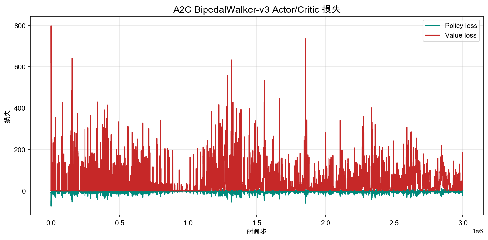

# 6.5 动手 与 BipedalWalker 双足行走

> **本节目标**：用 A2C 训练 `BipedalWalker-v3`，观察 Actor-Critic 处理高维连续控制的能力与局限——并理解为什么下一章需要 PPO。

> **本节代码**：[actor_critic_bipedalwalker.py](https://github.com/walkinglabs/hands-on-modern-rl/blob/main/code/chapter09_actor_critic/actor_critic_bipedalwalker.py) · [render_bipedalwalker.py](https://github.com/walkinglabs/hands-on-modern-rl/blob/main/code/chapter09_actor_critic/render_bipedalwalker.py) · [requirements.txt](https://github.com/walkinglabs/hands-on-modern-rl/blob/main/code/chapter09_actor_critic/requirements.txt)

上一节的 Pendulum 只有 1 维连续动作、3 维状态。BipedalWalker 把复杂度提升了一个量级：24 维状态（关节角度、角速度、地面接触传感器等），4 维连续动作（髋关节和膝关节各两个），目标是让一个双足机器人学会走路。

## 6.5.1 环境 与 BipedalWalker-v3

```
        O          ← 头部
       /|\
      / | \        ← 躯干
     /  |  \
    🔶   🔶       ← 髋关节
    |     |        ← 大腿
    🔷   🔷       ← 膝关节
    |     |        ← 小腿
   ___   ___       ← 脚
```

| 属性          | 值                                                  |
| ------------- | --------------------------------------------------- |
| 状态维度      | 24（躯干角度、角速度、关节状态、10 个激光雷达测距） |
| 动作维度      | 4（左髋、左膝、右髋、右膝的力矩，连续值 $[-1, 1]$） |
| 奖励          | 前进距离 + 存活惩罚 - 能量消耗                      |
| 终止          | 摔倒（头部触地）或到达终点                          |
| "Solved" 标准 | 平均奖励 > 300                                      |

BipedalWalker 的核心挑战是**协调**：4 个关节需要同时以正确的方式发力，任何关节的动作不协调都会导致摔倒。

从 Pendulum 到 BipedalWalker，最大的变化不只是维度从 3 变到 24、动作从 1 变到 4。真正变难的是：策略需要在 4 个关节之间找到**时序协调**——先迈左脚、重心转移、右脚跟上。这不是简单地"每个关节输出一个正确的力矩"，而是一个完整的步态周期。

|          | Pendulum   | BipedalWalker         |
| -------- | ---------- | --------------------- |
| 状态维度 | 3          | 24                    |
| 动作维度 | 1          | 4                     |
| 训练时间 | 几分钟     | 几十分钟              |
| 难点     | 单关节控制 | 多关节协调 + 动态平衡 |

## 6.5.2 运行训练

安装依赖：

```bash
pip install -r code/chapter09_actor_critic/requirements.txt
```

快速验证脚本能跑通：

```bash
python code/chapter09_actor_critic/actor_critic_bipedalwalker.py \
  --total-timesteps 100000
```

本节使用 Stable-Baselines3 的 A2C 实现，与上一节 Pendulum 实验相同的算法，但针对 BipedalWalker 的复杂度做了调整：16 个并行环境、`[128, 128]` 更大的网络。运行完整训练：

```bash
python code/chapter09_actor_critic/actor_critic_bipedalwalker.py \
  --total-timesteps 3000000
```

BipedalWalker 比 Pendulum 难得多。A2C 通常需要 300 万步才能开始形成有效步态，在普通 CPU 上大约需要 8-10 分钟。如果只是验证管线能跑通，可以先用 `--total-timesteps 100000` 快速测试。

A2C 在 BipedalWalker 上的超参数配置：

```python
model = A2C(
    policy="MlpPolicy",               # 多层感知机策略
    env=vec_env,                       # 16 个并行环境
    learning_rate=7e-4,                # 学习率
    n_steps=32,                        # 每次 rollout 步数
    gamma=0.99,                        # 折扣因子
    gae_lambda=0.95,                   # GAE λ
    ent_coef=0.0,                      # 熵系数
    vf_coef=0.5,                       # 价值函数损失系数
    max_grad_norm=0.5,                 # 梯度裁剪
    policy_kwargs=dict(net_arch=[128, 128]),  # 两层 128 神经元
)
```

与 Pendulum 的配置相比，主要变化是并行环境从 8 个增加到 16 个（BipedalWalker episode 更长，需要更多并行来保证吞吐），以及网络从默认的 `[64, 64]` 增大到 `[128, 128]`（24 维状态需要更强的表达能力）。

训练脚本会在 `output/` 目录下生成模型、检查点和训练曲线：

| 文件                                     | 含义                  |
| ---------------------------------------- | --------------------- |
| `actor_critic_bipedalwalker.zip`         | 训练好的 A2C 模型     |
| `actor_critic_bipedalwalker_500k.zip`    | 500k 步检查点         |
| `actor_critic_bipedalwalker_1000k.zip`   | 1M 步检查点           |
| `actor_critic_bipedalwalker_2000k.zip`   | 2M 步检查点           |
| `actor_critic_bipedalwalker_reward.png`  | 回合奖励曲线          |
| `actor_critic_bipedalwalker_entropy.png` | 策略熵损失曲线        |
| `actor_critic_bipedalwalker_loss.png`    | Actor/Critic 损失曲线 |

## 6.5.3 训练结果 与 先站稳，再挣扎着学走

一次 3M 时间步训练的结果如下。A2C 的训练曲线比 PPO 更 noisy、更不稳定——这正是 Actor-Critic 不加裁剪时的典型表现。

### 回合奖励


<div style="text-align: center; font-size: 0.9em; color: var(--vp-c-text-2); margin-top: -10px; margin-bottom: 20px;">
  <em>图 6.5-1：回合奖励曲线。浅蓝色为原始回报，深蓝色为 50 回合滑动平均。绿色虚线为 solved 标准线（300 分）。</em>
</div>

曲线走势可以分为三个阶段：

- **0-1M 步**：奖励从 -110 缓慢上升到 -40 附近。机器人从"一启动就倒"变成"能站稳但不会走"。和 PPO 类似，策略最先学到的是维持平衡。
- **1M-2M 步**：奖励剧烈波动。策略开始尝试迈步，但极不稳定——有些回合能拿到 200+ 分，有些仍然摔倒得 -120 分。滑动平均在 0-100 之间来回震荡。这是 A2C 最明显的特征：没有裁剪机制约束策略更新，每次更新都可能把策略推到一个完全不同的状态。
- **2M-3M 步**：策略逐步收敛到"大多数时候能走"的状态。滑动平均在 100-150 附近，但原始值波动极大（从 -80 到 +200）。

与上一章 Pendulum 的奖励曲线相比，BipedalWalker 的波动明显更剧烈。Pendulum 的滑动平均趋势相对平滑，而 BipedalWalker 的曲线像过山车——这正是"策略更新没有被约束"在高维连续控制中的后果。

### 策略熵


<div style="text-align: center; font-size: 0.9em; color: var(--vp-c-text-2); margin-top: -10px; margin-bottom: 20px;">
  <em>图 6.5-2：策略熵损失（负熵）。曲线从 -5.37 缓慢上升到 -4.38，对应实际熵从 5.37 下降到 4.38。</em>
</div>

策略熵从 5.37 下降到 4.38，下降幅度比 Pendulum 小得多。这说明在 BipedalWalker 上，A2C 的策略收敛速度更慢——4 维关节协调需要更多探索才能找到有效模式。

值得注意的是，策略熵曲线比 Pendulum 的更"锯齿状"。因为 A2C 每次更新都用新采集的数据（on-policy），数据质量波动会直接影响更新方向。如果某次 rollout 恰好收集到几局摔倒的数据，策略就会被推向更保守的方向；反之，如果收集到几局成功的步态，策略又会被推向更激进的方向。

### 损失曲线



<div style="text-align: center; font-size: 0.9em; color: var(--vp-c-text-2); margin-top: -10px; margin-bottom: 20px;">
  <em>图 6.5-3：Policy loss 和 Value loss。注意 Y 轴刻度——损失值的 spike 对应策略突变。</em>
</div>

损失曲线的一个关键特征是**周期性的剧烈 spike**。Value loss（红色）时不时飙升到 100-200，这意味着 Critic 的估计在某些时刻突然变得非常不准确。这通常发生在策略经历了一次大幅更新之后——新的策略产生了与旧策略完全不同的轨迹数据，Critic 还没来得及适应。

这些 spike 与奖励曲线上的剧烈波动高度对应：策略大幅更新 → Critic 失准 → 下一次 Actor 更新基于错误的 advantage 信号 → 策略又被打乱。这是 vanilla Actor-Critic 在复杂任务上的核心问题。

## 6.5.4 三阶段回放

为了直观感受 A2C 的学习过程，我们对比三个不同阶段的策略表现。三个模型使用完全相同的超参数，区别只在训练步数。

训练完成后，可以用渲染脚本生成回放 GIF：

```bash
python code/chapter09_actor_critic/render_bipedalwalker.py \
  --model output/actor_critic_bipedalwalker.zip \
  --output-dir output/bipedalwalker_a2c_episodes \
  --episodes 3 --seeds 0 1 2
```

### 早期（500k 步，回报 -52.9）

500k 步时策略已经学会了站稳不摔倒。机器人能跑满 1600 步而不倒，但几乎不会前进——肢体在原地维持平衡。与 PPO 的 100k 步相比，A2C 需要更多的步数才能达到同样的"站稳"阶段。


### 中期（2M 步，回报 263.8）

2M 步时策略正在学习行走，但非常不稳定。20 回合评估中，只有约 15% 的回合能走到 100 分以上，其余仍然摔倒。这里展示的是一个罕见的成功回合——策略碰巧在这局找到了协调的步态。注意，同样的模型在下一局可能就完全摔倒。


### 后期（3M 步，回报 274.2）

3M 步时策略已经形成了相对稳定的步态。大多数回合能拿到 271-276 分，但仍有约 10-15% 的回合会摔倒（-47 到 -59 分）。这是 A2C 的典型表现：**能学会行走，但无法做到 PPO 那样的高稳定性**。


三个阶段的评估对比（20 回合平均）：

| 训练步数 | 平均奖励 | 标准差 | 表现                                 |
| -------- | -------- | ------ | ------------------------------------ |
| 500k     | -50.0    | 5.7    | 能站稳但不会走，每回合都跑满 1600 步 |
| 2M       | -66.4    | 97.0   | 极不稳定：约 15% 回合能走，其余摔倒  |
| 3M       | 221.8    | 107.6  | 大多数回合 270+，但仍有 10-15% 摔倒  |

## 6.5.5 A2C vs PPO 与 同一个任务，不同的稳定性

本节和第 7 章 7.1 节使用了完全相同的环境（BipedalWalker-v3），但分别用 A2C 和 PPO 训练。对比两个实验的结果：

| 指标            | A2C（本节） | PPO（7.1 节） |
| --------------- | ----------- | ------------- |
| 训练步数        | 3M          | 2M            |
| 20 回合平均奖励 | 221.8       | 282.5         |
| 标准差          | 107.6       | 59.7          |
| 典型成功回合    | 271-276     | 293-299       |
| 摔倒率          | ~15%        | ~5%           |
| 训练曲线波动    | 剧烈震荡    | 相对平稳      |

两个算法的核心架构相同：都是 Actor-Critic，Actor 输出高斯分布，Critic 估计 $V(s)$。关键区别在于**策略更新的约束机制**：

- **A2C**：每次用当前策略采集数据，直接计算 advantage 进行梯度更新。更新步长由学习率控制，没有对更新幅度做额外约束。
- **PPO**：在 A2C 的基础上加入了裁剪（clipping）机制，确保每次更新后新策略不会偏离旧策略太远。同时还复用同一批数据进行多轮更新（epoch），提高数据效率。

这种差异在 Pendulum 上不太明显（任务太简单），但在 BipedalWalker 上暴露得很清楚：

1. **训练稳定性**：A2C 的奖励曲线剧烈波动，策略经常在"能走"和"摔倒"之间来回跳。PPO 的曲线则相对平稳上升。
2. **最终性能**：A2C 的最好回合只能到 276 分，PPO 能稳定在 295+。差距不在策略上限，而在**一致性**。
3. **数据效率**：A2C 用了 3M 步还没达到 PPO 2M 步的效果。PPO 复用数据的机制（多 epoch 更新）在复杂任务上优势明显。

## 6.5.6 常见失败与调参

BipedalWalker 比常见离散动作环境更容易训练失败。如果结果不理想，按以下顺序排查。

第一，确认训练步数是否足够。300 万步是 A2C 的起点，不是终点。如果曲线还在上升但斜率不够，可以继续训练。A2C 不支持直接从检查点继续训练，但可以用更大的 `--total-timesteps` 重新运行。

第二，确认并行环境数量。16 个并行环境是本节的配置。A2C 依赖大量并行来稳定梯度估计，如果只用 4 个环境，训练会非常不稳定。

第三，看策略是否过早收敛到"站着不动"。如果奖励长期停留在 -50 附近不上不下，说明策略学会了"不摔倒就不扣分"，但没有动力前进。可以尝试增大 `ent_coef` 到 0.01 鼓励探索。

第四，考虑增大网络容量。默认的 `[128, 128]` 对于 24 维状态可能不够。可以尝试 `[256, 256]`：

```python
model = A2C(
    policy="MlpPolicy",
    policy_kwargs=dict(net_arch=[256, 256]),
    ...
)
```

常用调参参考：

| 参数            | 本节设置     | 如果不合适会怎样                      |
| --------------- | ------------ | ------------------------------------- |
| `learning_rate` | `7e-4`       | 太大策略更新剧烈震荡，太小学得慢      |
| `n_steps`       | `32`         | 太短 advantage 噪声大，太长更新频率低 |
| `num_envs`      | `16`         | 太少梯度估计不稳定，太多单机开销增加  |
| `net_arch`      | `[128, 128]` | 太小无法表达复杂步态，太大训练变慢    |
| `gamma`         | `0.99`       | 太低只关注短期不摔，忽略长期行走效率  |

## 本节小结

本章从 REINFORCE 的高方差问题出发，引入了 Actor-Critic 架构：用 Critic 网络估计 $V(s)$ 提供低方差的优势信号，用 Actor 网络做决策。从 CartPole（离散）到 Pendulum（1 维连续）再到 BipedalWalker（4 维连续），我们看到 Actor-Critic 架构随任务复杂度增长而持续有效。

但 BipedalWalker 的实验也暴露了 vanilla Actor-Critic 的核心问题：**训练不稳定**。没有对策略更新幅度的约束，A2C 在复杂任务上的奖励曲线剧烈波动，最终性能和一致性都不如 PPO。

下一章，我们将解决 Actor-Critic 的这个问题——引出 PPO 算法：[第 7 章 PPO](../chapter10_ppo/intro)。
