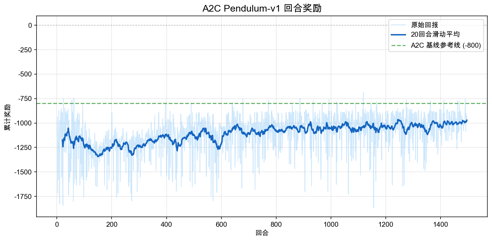

# 6.4 动手 与 Pendulum 摆杆平衡

> **本节目标**：用 A2C 训练 `Pendulum-v1`，理解连续动作 Actor-Critic 为什么要输出高斯分布，以及 Critic 如何帮助 Actor 在连续控制中稳定学习。

> **本节代码**：[actor_critic_pendulum.py](https://github.com/walkinglabs/hands-on-modern-rl/blob/main/code/chapter09_actor_critic/actor_critic_pendulum.py) · [render_pendulum.py](https://github.com/walkinglabs/hands-on-modern-rl/blob/main/code/chapter09_actor_critic/render_pendulum.py) · [requirements.txt](https://github.com/walkinglabs/hands-on-modern-rl/blob/main/code/chapter09_actor_critic/requirements.txt)

前面我们用 CartPole、LunarLander 这类任务理解了“从几个动作里选一个”的强化学习。这样的动作空间很适合 DQN，也很适合用 Softmax 策略来解释：向左、向右、点火、不点火，每个动作都有一个明确的概率。

现在问题变了。`Pendulum-v1` 不是让智能体在几个按钮中做选择，而是让它给摆杆施加一个连续力矩。这个力矩可以是 -2，也可以是 0.17，还可以是 1.843。动作不再是几个离散格子，而是一整段实数区间 $[-2, 2]$。这正是 Actor-Critic 在本章必须解决的新问题：**当动作有无穷多个候选值时，策略应该怎样表达“我想做什么动作”？**

## 6.4.1 任务直觉 与 不是选按钮，而是控制力矩

Pendulum 的场景很简单：一根杆子挂在转轴上，智能体每一步可以给它一个力矩，目标是把杆子摆到正上方，并尽量保持在那里。

环境给出的状态是 3 维：

| 状态分量     | 含义               |
| ------------ | ------------------ |
| $\cos\theta$ | 摆杆角度的余弦表示 |
| $\sin\theta$ | 摆杆角度的正弦表示 |
| $\dot\theta$ | 摆杆角速度         |

动作是 1 维连续值：

| 动作分量 | 含义                               |
| -------- | ---------------------------------- |
| $a$      | 施加到转轴上的力矩，范围 $[-2, 2]$ |

奖励函数可以近似理解为三项惩罚的总和：

$$
r = -(\theta^2 + 0.1\dot\theta^2 + 0.001a^2)
$$

这里 $\theta$ 表示摆杆偏离正上方的角度，$\dot\theta$ 表示角速度，$a$ 表示动作力矩。这个公式的意思很直接：杆子偏得越远，扣分越多；转得越快，扣分越多；用力越大，也会有一点点扣分。最好的情况是杆子竖直向上、速度接近 0、动作也不需要太大，此时单步奖励接近 0。

所以 Pendulum 的累计回报通常是负数。随机策略常常在 -1200 到 -900 附近；训练得比较好的策略可以继续向 -500、-300 甚至更接近 0 推进。看这类曲线时，不要问“为什么奖励不是正数”，而要看它是否从很低的负值逐渐上升到接近 0。

## 6.4.2 为什么 DQN 不适合这个任务

让我们先从已经熟悉的 DQN 想起。DQN 学的是 $Q(s,a)$，执行时用：

$$
a^* = \arg\max_a Q(s,a)
$$

这个公式在离散动作空间里很自然。CartPole 只有两个动作，我们算出 $Q(s,\text{left})$ 和 $Q(s,\text{right})$，取大的那个就可以。

但 Pendulum 的动作是 $[-2,2]$ 中的任意实数。要严格执行 $\arg\max_a Q(s,a)$，就意味着要在无穷多个力矩值上比较 $Q$ 值。这不是一个简单的“多算几个动作”的问题，而是动作表示本身已经变了。

一种朴素做法是把 $[-2,2]$ 离散化，例如切成 21 个格子：

$$
\{-2.0,-1.8,-1.6,\ldots,1.8,2.0\}
$$

这能让 DQN 勉强运行，但会带来两个问题。第一，控制精度被格子限制，智能体无法输出 0.37 这类更合适的力矩。第二，动作维度一旦增加，格子数会迅速爆炸。Pendulum 只有 1 维动作还可以勉强切格子，BipedalWalker 有 4 维连续动作，如果每维切 21 档，总动作数就是 $21^4=194481$。

因此，真正的问题不是“DQN 要不要多几个输出头”，而是：**连续控制需要一个能直接生成连续动作的策略。**

## 6.4.3 连续 Actor 与 输出一个高斯分布

离散策略输出的是每个动作的概率，例如：

$$
\pi(a|s) = [0.2, 0.8]
$$

连续策略不能这样列出所有动作的概率，因为动作有无穷多个。更自然的做法是让 Actor 输出一个概率分布的参数。对 Pendulum 来说，最常见的选择是高斯分布：

$$
a \sim \mathcal{N}(\mu_\theta(s), \sigma_\theta(s)^2)
$$

这里 $\mu_\theta(s)$ 是策略网络根据状态 $s$ 输出的均值，$\sigma_\theta(s)$ 是动作采样的标准差。用普通话说，这个式子表示：Actor 不直接说“动作一定是 0.7”，而是说“我倾向于在 0.7 附近用力，并保留一定随机探索”。

代码中的网络结构如下：

```python
class ActorCriticContinuous(nn.Module):
    def __init__(self, state_dim=3, action_dim=1, hidden_dim=128):
        super().__init__()
        self.shared = nn.Sequential(
            nn.Linear(state_dim, hidden_dim),
            nn.ReLU(),
            nn.Linear(hidden_dim, hidden_dim),
            nn.ReLU(),
        )
        self.mu_head = nn.Linear(hidden_dim, action_dim)
        self.log_std = nn.Parameter(torch.zeros(action_dim))
        self.value_head = nn.Linear(hidden_dim, 1)

    def forward(self, state):
        features = self.shared(state)
        mu = torch.tanh(self.mu_head(features)) * 2.0
        std = torch.exp(self.log_std).expand_as(mu)
        value = self.value_head(features)
        return mu, std, value
```

这里有三个关键点。

第一，`mu_head` 输出动作均值。因为 Pendulum 的合法动作范围是 $[-2,2]$，所以代码用 `tanh` 把输出压到 $[-1,1]$，再乘以 2。

第二，`log_std` 是可学习参数。我们不直接学习 $\sigma$，而是学习 $\log\sigma$，再通过 `exp` 得到正的标准差。这样可以避免标准差变成负数。

第三，`value_head` 是 Critic，输出 $V(s)$。同一个网络前半部分共享特征，后面分成 Actor 头和 Critic 头。这就是本章所说的 Actor-Critic：Actor 决定怎么行动，Critic 判断当前状态大概值多少钱。

## 6.4.4 Critic 如何给 Actor 一个学习信号

只有 Actor 还不够。我们还需要知道某个动作“比预期好还是比预期差”。Critic 的作用就是提供这个参照。

在每一步，Critic 估计当前状态价值 $V(s_t)$，同时用下一步奖励和下一状态价值构造 TD 目标：

$$
y_t = r_t + \gamma V(s_{t+1})
$$

然后用 TD 误差衡量实际结果和原先估计之间的差距：

$$
\delta_t = y_t - V(s_t)
$$

这里 $\delta_t$ 就是 Actor 更新时使用的 advantage 估计。如果 $\delta_t>0$，说明这个动作带来的结果比 Critic 预期更好，Actor 应该提高它的概率；如果 $\delta_t<0$，说明结果比预期更差，Actor 应该降低它的概率。

对应到代码，核心更新是：

```python
td_target = reward + gamma * not_done * next_value
advantage = td_target - value

actor_loss = -(log_prob * advantage.detach())
critic_loss = advantage.pow(2).mean()
loss = actor_loss + 0.5 * critic_loss - 0.001 * entropy
```

`actor_loss` 看起来有一个负号，这是因为优化器默认做梯度下降。我们想要的是：当 advantage 为正时，提高该动作的 `log_prob`；当 advantage 为负时，降低该动作的 `log_prob`。写成 loss 后，就变成最小化 `-(log_prob * advantage)`。

`critic_loss` 则让 Critic 的估计靠近 TD 目标。最后的 `entropy` 项鼓励策略保持一点探索，避免标准差过早缩小。

## 6.4.5 运行训练

安装依赖：

```bash
pip install -r code/chapter09_actor_critic/requirements.txt
```

快速验证脚本能跑通：

```bash
python code/chapter09_actor_critic/actor_critic_pendulum.py \
  --total-timesteps 20000
```

本节脚本使用 Stable-Baselines3 的 **A2C（Advantage Actor-Critic）** 实现。A2C 仍然是 Actor-Critic：Actor 学连续动作策略，Critic 学 $V(s)$，只是工程上使用并行环境和回报归一化，让这个教学实验更容易复现。运行完整训练：

```bash
python code/chapter09_actor_critic/actor_critic_pendulum.py \
  --total-timesteps 300000
```

训练脚本会在 `output/` 目录下生成模型、归一化统计和三张曲线：

| 文件                                     | 含义                  |
| ---------------------------------------- | --------------------- |
| `actor_critic_pendulum.zip`              | 训练好的 A2C 模型     |
| `actor_critic_pendulum_vecnormalize.pkl` | 观测和奖励归一化统计  |
| `actor_critic_pendulum_reward.png`       | 回合奖励曲线          |
| `actor_critic_pendulum_entropy.png`      | 策略熵损失曲线        |
| `actor_critic_pendulum_loss.png`         | Actor/Critic 损失曲线 |

如果要把图放进课程页面，可以复制到：

```bash
cp output/actor_critic_pendulum_*.png docs/chapter09_actor_critic/images/
```

训练完成后，可以渲染一个回放 GIF：

```bash
python code/chapter09_actor_critic/render_pendulum.py \
  --model output/actor_critic_pendulum.zip \
  --output output/pendulum_actor_critic.gif
```

## 6.4.6 实验结果 与 先学会摆上去，再学会稳住

一次 300k 时间步训练的结果如下。由于 A2C 仍然是 on-policy Actor-Critic，数据用完即丢，单次实验波动会比后面第 7 章的 PPO 更明显；我们重点看滑动平均的趋势，而不是某一个回合的高低。


<div style="text-align: center; font-size: 0.9em; color: var(--vp-c-text-2); margin-top: -10px; margin-bottom: 20px;">
  <em>图 6.4-1：A2C 训练后的 Pendulum 回放。该回合回报约为 -761，能摆到上方附近，但还不是接近最优的稳定控制。</em>
</div>



<div style="text-align: center; font-size: 0.9em; color: var(--vp-c-text-2); margin-top: -10px; margin-bottom: 20px;">
  <em>图 6.4-2：回合奖励曲线。浅蓝色为原始回报，深蓝色为 20 回合滑动平均，绿色虚线是 A2C 基线参考线 -800。</em>
</div>

这次运行的确定性策略评估约为 **-780 ± 39**（20 回合），最好一轮约 **-750**。它比完全随机或早期策略更稳定，但还不是接近最优的摆杆控制。这一点很重要：本节的目标不是把 Pendulum 刷到最好分数，而是用一个足够小的连续控制任务，把“高斯 Actor + 价值 Critic + advantage 更新”这条主线讲清楚。

这条曲线可以分成三个观察点。

- **训练早期**：奖励常在 -1200 附近。摆杆大多在下方附近乱晃，动作没有形成结构。
- **训练中期**：滑动平均缓慢上升。策略开始学到某些有效力矩模式，但还不能稳定地把杆子停在顶端。
- **训练后期**：奖励大约进入 -1000 到 -800 一带。策略已经明显优于最初状态，但仍然会在顶端附近控制不稳。

Pendulum 的学习不像 CartPole 那样很快出现满分，因为这里的动作既要有方向，又要有幅度。力矩太小，摆不上去；力矩太大，越过顶端后又会冲过去。连续控制的难点就在这里：策略不是选择“左/右”，而是在每一步选择一个合适的力度。

## 6.4.7 策略熵 与 探索怎样逐渐收窄

高斯策略的一个好处是，我们可以直接观察探索强度。标准差 $\sigma$ 越大，动作采样越分散；策略熵越高，说明动作分布越随机。


<div style="text-align: center; font-size: 0.9em; color: var(--vp-c-text-2); margin-top: -10px; margin-bottom: 20px;">
  <em>图 6.4-3：策略熵损失。SB3 记录的是 entropy_loss，也就是负熵；曲线向上接近 0，表示真实熵在下降。</em>
</div>

从学习过程看，策略一开始需要较大的随机性。因为它还不知道应该先向哪个方向借力，也不知道接近顶端时要怎样减速。随着 Critic 给出的 advantage 信号越来越可靠，Actor 会逐渐提高有效动作附近的概率，真实策略熵也会慢慢下降。

但熵不能降得太快。如果一开始就把动作分布压得很窄，策略可能会过早固定在一种无效动作上，例如只会轻微抖动，永远摆不上去。A2C、PPO 这类算法通常都会监控策略熵，原因就在这里。

本节配置里 `ent_coef=0.0`，不是说熵不重要，而是 Pendulum 的高斯策略本身已经有采样噪声。若换成更难的连续控制任务，适当加入熵正则通常会更稳。

## 6.4.8 损失曲线 与 Actor 和 Critic 各自在做什么

奖励曲线告诉我们“表现是否变好”，损失曲线则帮助我们理解训练是否稳定。


<div style="text-align: center; font-size: 0.9em; color: var(--vp-c-text-2); margin-top: -10px; margin-bottom: 20px;">
  <em>图 6.4-4：Actor/Critic 损失曲线。在线 Actor-Critic 的损失通常比监督学习更 noisy，重点看是否长期发散。</em>
</div>

Critic loss 来自 TD 误差平方：

$$
(\delta_t)^2 = (r_t + \gamma V(s_{t+1}) - V(s_t))^2
$$

如果 Critic loss 长期很大，说明价值估计不稳定，Actor 得到的 advantage 信号也会不可靠。Actor loss 则和 `log_prob * advantage` 有关，它的数值不一定单调下降；因为策略每一步都在改变，采样分布也在改变。

这也是为什么强化学习不能像普通分类任务那样只盯着 loss。更可靠的判断顺序是：先看回合奖励是否上升，再看 Critic loss 是否长期发散，最后看熵和标准差是否过早塌缩。

## 6.4.9 常见失败与调参

如果 Pendulum 没有学起来，可以按下面顺序排查。

第一，确认训练步数是否足够。`--total-timesteps 20000` 只能验证代码路径，不能代表算法效果。完整训练建议从 300k 步开始。

第二，确认是否启用了 `VecNormalize`。Pendulum 的原始奖励尺度较大，Critic 直接拟合原始回报会更难。本节脚本保存 `actor_critic_pendulum_vecnormalize.pkl`，评估和渲染时也要加载它。

第三，看 Critic loss 是否持续爆炸。如果 TD 误差长期很大，Actor 收到的 advantage 信号会非常 noisy。可以降低学习率，或者增加并行环境数量来改善采样稳定性。

第四，观察动作是否经常贴边。如果动作长期是 -2 或 2，说明策略学会了“猛推”，但没有学会在顶端附近减速。可以继续训练，或在后续章节使用 PPO 这类更稳定的策略优化方法。

常用调参参考：

| 参数            | 本节设置 | 如果不合适会怎样                      |
| --------------- | -------- | ------------------------------------- |
| `learning_rate` | `7e-4`   | 太大容易震荡，太小学得慢              |
| `n_steps`       | `32`     | 太短 advantage 噪声大，太长更新频率低 |
| `gamma`         | `0.99`   | 太低会只看短期摆动，不重视稳定在上方  |
| `num_envs`      | `8`      | 太少采样慢，太多单机开销增加          |
| `VecNormalize`  | 启用     | 不启用时 Critic 更难拟合原始回报尺度  |

## 6.4.10 本节小结

Pendulum 把我们从离散动作带到了连续动作。真正的变化不是环境更复杂，而是策略表示变了：Actor 不再输出几个动作的 Softmax 概率，而是输出高斯分布的均值和标准差，然后从分布中采样连续力矩。

Critic 在这个过程中提供基准。它用 $V(s)$ 估计当前状态的价值，再用 TD 误差告诉 Actor：刚才这个动作比预期更好，还是更差。这样，策略就能在连续动作空间中逐步把概率质量推向更有效的控制信号。

同时，本节实验也暴露了 vanilla Actor-Critic 的局限：它能解释连续控制的基本机制，但样本效率和稳定性并不理想。下一章的 PPO 会在同样的 Actor-Critic 框架上加入“限制每次策略更新幅度”的机制，这正是让复杂连续控制任务更稳定的关键。

下一节，我们把同样的思想放到更复杂的机器人任务中：[动手：BipedalWalker 双足行走](./bipedalwalker)。
