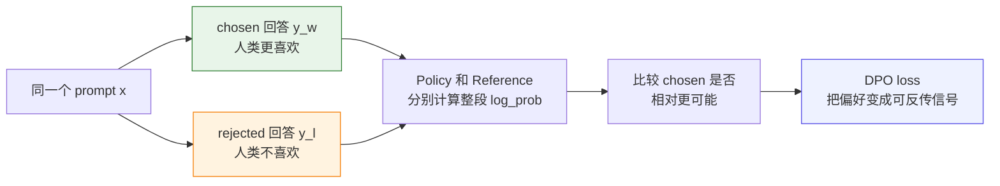
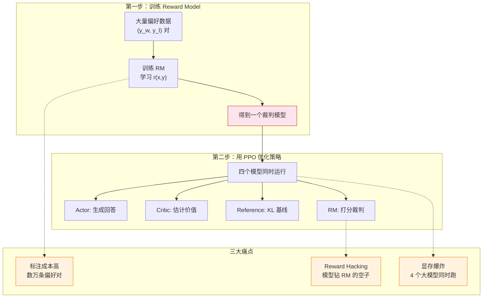
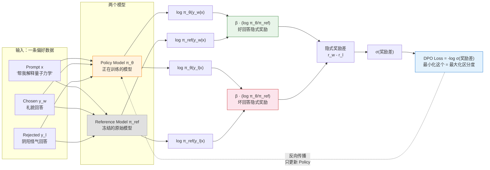
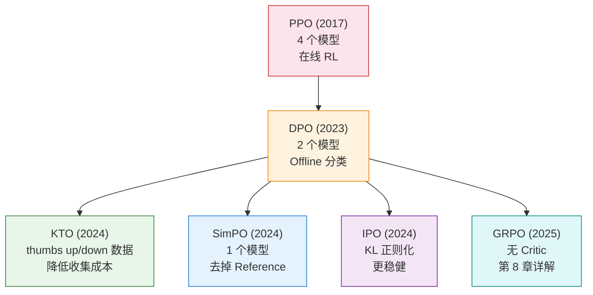

# 7.3 DPO 原理、数学与选型

前面你已经跑过 DPO 的训练代码，也观察了 loss、accuracy、reward margin 这些指标如何变化。现在我们放慢一步，回到 DPO 要解决的原始问题：**如果手里已经有人类偏好数据，能不能不再训练 Reward Model，也不再跑一整套 PPO，就直接训练语言模型？**

DPO 的训练样本是一道“同题二选一”的偏好题。给定同一个 prompt，数据里有两个回答：一个是人类更喜欢的 chosen，一个是人类不喜欢的 rejected。

例如 prompt 是：

> 请用两句话解释为什么天空看起来是蓝色的。

偏好数据可能长这样：

| 回答类型 | 内容                                                                                             |
| -------- | ------------------------------------------------------------------------------------------------ |
| chosen   | “阳光进入大气后，短波长的蓝光更容易被空气分子散射。我们从各个方向看到这些蓝光，所以天空呈蓝色。” |
| rejected | “因为天空本来就是蓝色的，云把其他颜色挡住了。”                                                   |

DPO 要训练模型做的事情是：以后遇到类似 prompt 时，**让 chosen 这一类回答相对更容易被模型写出来，让 rejected 这一类回答相对更不容易出现**。

因此，DPO 的核心问题可以写成：

> **能不能把“人类更喜欢哪个回答”直接变成一个可以反向传播的训练信号？**

DPO 的回答是可以。它把 RLHF 里的 KL 正则目标重新整理，把奖励差改写成 Policy 和 Reference 的概率比值，最后得到一个类似二分类的损失函数。

本节沿着一条偏好样本来讲：先看 $(x,y_w,y_l)$ 分别是什么，再解释语言模型如何给整段回答计算概率，接着从 RLHF 的 KL 正则目标推出 DPO loss，最后回到手写代码和 TRL 的 `DPOTrainer`。



需要先明确一点：**DPO 不是一个新的语言模型，也不只是一个 loss。DPO 是一种离线偏好优化方法：用已经标好的偏好对，直接训练语言模型策略。**

在 DPO 里，真正被训练的对象仍然是语言模型，也就是策略：

$$
\pi_\theta(y \mid x)
$$

这里 $x$ 是用户输入的 prompt，$y$ 是模型生成的回答，$\theta$ 是正在更新的模型参数。注意，DPO 并没有额外发明一个“DPO 模型”。它训练的还是这一个语言模型，只是训练信号不再来自“奖励模型给几分”，而来自“人类在两个回答中选了哪一个”。

它和 PPO 的第一层差异可以先这样理解：**PPO 是先让模型在线生成，再用奖励模型打分；DPO 是先拿到人类已经比较过的回答对，再把“哪个更好”变成一个可以直接反向传播的对比损失**。所以后文会频繁讲 DPO loss，但要注意：**loss 只是 DPO 落到代码里的训练信号，DPO 本身是一套离线偏好优化方法。**

## 先从一条偏好样本读起

DPO 的关键不在于凭空提出一个新公式，而在于：**它从 RLHF 的目标出发，但最后不按 PPO 那样在线采样更新，而是把“人类更喜欢哪个回答”改写成一个分类式训练信号**。

为了看清楚这个转化，先把语言模型放进强化学习框架里：

| 强化学习概念 | 在语言模型里是什么                                     |
| ------------ | ------------------------------------------------------ |
| 状态 $s_t$   | prompt 加上已经生成的前缀，也就是 $(x,y_{<t})$         |
| 动作 $a_t$   | 下一步要生成的 token，也就是 $y_t$                     |
| 策略 $\pi$   | 语言模型给下一个 token 或整段回答分配概率              |
| 轨迹 $\tau$  | 从 prompt 到完整回答的一整段生成过程                   |
| 奖励 $r$     | 人类偏好、奖励模型分数，或者某个规则给出的回答质量分数 |

所以，对一个 prompt $x$ 来说，模型生成完整回答 $y$ 就相当于走完一条轨迹。RLHF 想优化的是：**让回答拿到更高奖励，同时不要离原始模型太远**。这可以写成：

$$
\max_{\pi_\theta}
\mathbb{E}_{x\sim\mathcal{D},\,y\sim\pi_\theta}
\left[
r(x,y)
-
\beta
D_{\mathrm{KL}}
(\pi_\theta(\cdot\mid x)\|\pi_{\mathrm{ref}}(\cdot\mid x))
\right]
$$

PPO 是一种求解这个目标的在线方法。它会让当前模型先生成一批回答，用奖励模型打分，再用 Critic 估计基线，最后通过 ratio 和 clip 更新策略。PPO 论文的摘要里强调，它的目标设计允许 **“multiple epochs of minibatch updates”**，也就是同一批样本可以多轮小批量更新。

DPO 的切入点不一样。DPO 论文先指出 RLHF 往往复杂且不稳定，然后提出一种新的奖励参数化方式，把标准 RLHF 问题变成 **“simple classification loss”**，并减少 fine-tuning 时从模型采样的需要。换句话说，DPO 不是否认 PPO，而是说：**如果我们已经有偏好对 $(x,y_w,y_l)$，有些在线 RL 步骤可以被数学推导替代**。


这张图可以这样读：

- 左边是所有方法共同的起点：语言模型策略 $\pi_\theta$ 想拿高奖励，同时受 $\pi_{\mathrm{ref}}$ 约束。
- 中间是 PPO / RLHF 路径：在线生成回答，奖励模型打分，Critic 估计优势，再用 PPO-Clip 更新。
- 右边是 DPO 路径：使用离线偏好对，借助 KL 正则目标的闭式解，把“奖励差”改写成 Policy 和 Reference 的概率比值。

因此，后面的推导会先固定偏好三元组 $(x,y_w,y_l)$，再回到 RLHF 的 KL 正则目标，最后说明为什么一个看似复杂的 RL 问题可以落成 DPO 的分类损失。

> 论文脉络：PPO 来自 Schulman 等人的 [Proximal Policy Optimization Algorithms](https://arxiv.org/abs/1707.06347)。DPO 来自 Rafailov 等人的 [Direct Preference Optimization](https://arxiv.org/abs/2305.18290)。前者给出稳定在线策略更新，后者把 KL 约束的 RLHF 目标转成离线偏好优化。

下面是一份最小的手写 DPO 代码地图。后面的公式都会回到这份代码中的某几行：

<DpoCodeFocus focus="overview" />

这份代码可以分成八块：

| 标记    | 代码部分                                | 后文会解释什么                                 |
| ------- | --------------------------------------- | ---------------------------------------------- |
| **[A]** | 偏好数据                                | $x$、$y_w$、$y_l$ 分别是什么                   |
| **[B]** | `sequence_logprob`                      | 语言模型如何给一整个回答算 $\log \pi(y\mid x)$ |
| **[C]** | `dpo_forward` 前半段                    | 为什么要同时看 Policy 和 Reference             |
| **[D]** | `chosen_logratio` / `rejected_logratio` | 概率比值如何变成隐式奖励                       |
| **[E]** | `dpo_logits`                            | 好回答和坏回答的奖励差                         |
| **[F]** | `-F.logsigmoid(...)`                    | DPO loss 为什么是这个形状                      |
| **[G]** | `train_step`                            | 为什么只更新 Policy，不更新 Reference          |
| **[H]** | `train_dpo`                             | 偏好 batch 如何进入训练循环                    |

如果鼠标移到代码透镜上，或者点击标题栏，就能看到完整代码；默认视图只显示当前段落需要的行。

## 从 PPO/RLHF 改到 DPO：代码到底少了什么

在继续推导公式前，先看 DPO 和 PPO/RLHF 的代码差异。这个差异不只是“换了一个 loss 名字”，而是**训练代码的输入、模型组件和更新方式都变了**。

如果还沿用 PPO/RLHF 的思路，训练循环大概会像这样：

```python
# PPO / RLHF 的训练直觉：先在线生成，再打分，再用优势更新
responses = policy_old.generate(prompts)
logps_old = policy_logprob(policy_old, prompts, responses).detach()

rewards = reward_model(prompts, responses)
values = critic(prompts, responses)
advantages = rewards - values

logps_new = policy_logprob(policy, prompts, responses)
ratio = torch.exp(logps_new - logps_old)
policy_loss = -torch.min(
    ratio * advantages,
    torch.clamp(ratio, 1 - clip_eps, 1 + clip_eps) * advantages,
).mean()
```

这段代码里，核心工作是：**当前模型先生成回答**，然后 **Reward Model 给回答打分**，再让 **Critic 估计基线**，最后用 PPO 的 `ratio + clip` 更新策略。

如果改成 DPO，训练循环的形状会变成这样：

```python
# DPO 的训练直觉：不在线生成，直接学习偏好对
batch = {
    "prompt": prompt,
    "chosen": chosen_answer,
    "rejected": rejected_answer,
}

chosen_logps = sequence_logprob(policy, prompt, chosen_answer)
rejected_logps = sequence_logprob(policy, prompt, rejected_answer)

ref_chosen_logps = sequence_logprob(reference, prompt, chosen_answer)
ref_rejected_logps = sequence_logprob(reference, prompt, rejected_answer)

chosen_logratio = chosen_logps - ref_chosen_logps
rejected_logratio = rejected_logps - ref_rejected_logps
dpo_loss = -F.logsigmoid(beta * (chosen_logratio - rejected_logratio)).mean()
```

把两边放在一起看，差别会更明显：

```diff
- responses = policy_old.generate(prompts)
- rewards = reward_model(prompts, responses)
- values = critic(prompts, responses)
- advantages = rewards - values
- loss = ppo_clip_loss(logps_new, logps_old, advantages)

+ chosen_logratio = chosen_logps - ref_chosen_logps
+ rejected_logratio = rejected_logps - ref_rejected_logps
+ loss = -log_sigmoid(beta * (chosen_logratio - rejected_logratio))
```

所以，DPO 的“Direct”不是说它没有数学，而是说它**不再显式走“在线采样 → RM 打分 → Critic 估值 → PPO 更新”这条工程路线**。它直接把偏好对变成一个可反向传播的比较目标。

TRL 的真实源码也是这个结构。2026-05-01 查看 Hugging Face TRL main 分支时，可以在 [`DPOTrainer`](https://github.com/huggingface/trl/blob/main/trl/trainer/dpo_trainer.py) 里看到三件事：

1. 数据整理器 `DataCollatorForPreference` 期待样本里有 `prompt_ids`、`chosen_ids`、`rejected_ids`。它把 batch 的前半部分放 chosen，后半部分放 rejected。
2. Reference 概率可以提前算好并放进 `ref_chosen_logps`、`ref_rejected_logps`，也可以训练时由 reference model 现算。
3. 损失部分先算 `chosen_logratios` 和 `rejected_logratios`，再把二者做差，默认 sigmoid 版本就是对这个差值做 `-logsigmoid`。

对照 [`PPOTrainer`](https://github.com/huggingface/trl/blob/main/trl/experimental/ppo/ppo_trainer.py)，区别更直接：PPOTrainer 初始化时需要 `policy model`、`ref_model`、`reward_model`、`value_model`；训练过程中会在线 `generate`，计算 reward 和 value，再构造 advantage。DPOTrainer 则主要需要 **Policy、Reference 和偏好数据**。

## 读公式前：DPO 的数据和概率

DPO 的训练样本不是单独一个回答，而是一个**偏好三元组**：

$$
(x,\;y_w,\;y_l)
$$

这里每个字母的意思是：

- $x$：prompt，也就是用户输入的问题或上下文。
- $y_w$：winner / chosen，人类更喜欢的回答。
- $y_l$：loser / rejected，人类不喜欢的回答。

代码里对应的是：

<DpoCodeFocus focus="data" />

DPO 不直接问“这个回答绝对得多少分”，而是问：**在同一个 prompt 下，模型能不能让 chosen 比 rejected 更可能出现？** 这就是为什么 DPO 的公式里总是成对出现 $y_w$ 和 $y_l$。

语言模型给回答 $y$ 计算概率时，并不是一次生成整段文本，而是一个 token 一个 token 地生成。假设回答 $y$ 由 $T$ 个 token 组成：

$$
y=(y_1,y_2,\ldots,y_T)
$$

那么整段回答的条件概率可以写成：

$$
\pi_\theta(y\mid x)
=
\prod_{t=1}^{T}
\pi_\theta(y_t\mid x,y_{<t})
$$

这里：

- $\pi_\theta(y\mid x)$：参数为 $\theta$ 的模型，在 prompt $x$ 后生成整段回答 $y$ 的概率。
- $y_t$：回答中的第 $t$ 个 token。
- $y_{<t}$：第 $t$ 个 token 之前已经生成的所有 token。
- $\prod$：连乘符号，表示把每一步 token 的概率乘起来。

实际代码中，我们几乎不会直接乘概率，因为很多小于 1 的数连乘会非常接近 0，容易数值下溢。所以会取对数，把连乘变成求和：

$$
\log \pi_\theta(y\mid x)
=
\sum_{t=1}^{T}
\log \pi_\theta(y_t\mid x,y_{<t})
$$

这就是 `sequence_logprob` 做的事情：先对每个 token 取 log probability，再只把回答部分的 token log probability 加起来。

<DpoCodeFocus focus="logprob" />

## 7.3.1 DPO 推导三步走

### 起点：RLHF 的工程痛点

在推导 DPO 之前，先回顾 RLHF 的标准流程，看看它为什么这么痛苦：



RLHF 的原始优化目标是：

$$\max_{\pi_\theta} \; \mathbb{E}_{x \sim \mathcal{D}, y \sim \pi_\theta} \left[ r(x,y) - \beta \cdot D_{\text{KL}}(\pi_\theta \| \pi_{\text{ref}}) \right]$$

先把每个符号拆开：

- $\max_{\pi_\theta}$：我们要调整策略模型 $\pi_\theta$，让目标尽可能大。
- $x \sim \mathcal{D}$：prompt $x$ 来自训练数据集 $\mathcal{D}$。
- $y \sim \pi_\theta$：回答 $y$ 是当前策略模型 $\pi_\theta$ 采样出来的。
- $r(x,y)$：奖励模型给回答打的分。分数越高，表示回答越符合人类偏好。
- $D_{\text{KL}}(\pi_\theta \| \pi_{\text{ref}})$：新策略 $\pi_\theta$ 和参考策略 $\pi_{\text{ref}}$ 的距离。
- $\beta$：KL 惩罚的权重。$\beta$ 越大，模型越不敢偏离参考模型。

KL 散度在这里可以写成：

$$
D_{\text{KL}}(\pi_\theta \| \pi_{\text{ref}})
=
\mathbb{E}_{y\sim \pi_\theta}
\left[
\log
\frac{\pi_\theta(y\mid x)}
{\pi_{\text{ref}}(y\mid x)}
\right]
$$

这个式子读起来就是：**如果当前模型生成的回答，在当前模型下概率很高，但在参考模型下概率很低，那么它就偏离了参考模型**。为什么要惩罚这种偏离？因为只追求奖励分数会让模型钻奖励模型的空子，可能生成看起来高分但实际很奇怪的回答。KL 项像一根绳子，把模型拉在原始语言能力附近。

所以 RLHF 目标包含两部分：最大化 RM 给的奖励 $r(x,y)$，同时用 KL 散度惩罚策略偏离参考模型太远。要优化这个目标，你需要 RM 来提供 $r(x,y)$，需要 Critic 来估计优势函数，需要 Reference 来计算 KL 惩罚——这就是四模型并行的来源。

而 DPO 代码里真正保留下来的，是 **Policy + Reference + 偏好数据** 这条更短的路径：

<DpoCodeFocus focus="models" />

### 第一步：最优策略的闭式解

现在我们只看一个固定的 prompt $x$。为了让推导干净一点，先把 $\pi(y\mid x)$ 简写成 $q(y)$。这时要优化的问题可以写成：

$$
\max_q
\sum_y q(y) r(x,y)
-
\beta
\sum_y q(y)
\log
\frac{q(y)}
{\pi_{\text{ref}}(y\mid x)}
$$

同时 $q(y)$ 必须是一个概率分布，所以它还要满足：

$$
\sum_y q(y)=1
$$

这里的 $\sum_y$ 表示对所有可能回答求和。第一项 $\sum_y q(y)r(x,y)$ 是**平均奖励**；第二项是 KL 惩罚，表示新策略不要离参考策略太远。

为了在“概率和必须等于 1”的条件下求最大值，我们引入拉格朗日乘子 $\lambda$：

$$
\mathcal{L}(q,\lambda)
=
\sum_y q(y) r(x,y)
-
\beta
\sum_y q(y)
\log
\frac{q(y)}
{\pi_{\text{ref}}(y\mid x)}
+
\lambda
\left(
\sum_y q(y)-1
\right)
$$

对某一个回答 $y$ 的概率 $q(y)$ 求导，并令导数等于 0：

$$
\frac{\partial \mathcal{L}}{\partial q(y)}
=
r(x,y)
-
\beta
\left(
\log
\frac{q(y)}
{\pi_{\text{ref}}(y\mid x)}
+1
\right)
+
\lambda
=0
$$

把这个式子整理一下：

$$
\log
\frac{q(y)}
{\pi_{\text{ref}}(y\mid x)}
=
\frac{r(x,y)}{\beta}
+
\frac{\lambda}{\beta}
-1
$$

两边取指数，就得到：

$$
q(y)
=
C
\cdot
\pi_{\text{ref}}(y\mid x)
\cdot
\exp
\left(
\frac{r(x,y)}{\beta}
\right)
$$

这里 $C=\exp(\lambda/\beta-1)$，它不依赖具体回答 $y$，只是一个归一化常数。为了让所有回答的概率加起来等于 1，我们把它写成 $\frac{1}{Z(x)}$，得到闭式解：

$$\pi^*(y\mid x) = \frac{1}{Z(x)} \pi_{\text{ref}}(y\mid x) \cdot \exp\left(\frac{r(x,y)}{\beta}\right)$$

其中：

$$
Z(x)
=
\sum_y
\pi_{\text{ref}}(y\mid x)
\cdot
\exp
\left(
\frac{r(x,y)}{\beta}
\right)
$$

$Z(x)$ 的作用只有一个：**把所有回答的概率重新缩放到加起来等于 1**。它不是奖励，也不是模型参数，只是归一化因子。

这个解告诉我们一个关键事实：**最优策略 $\pi^*$ 可以完全由奖励函数 $r$ 和参考策略 $\pi_{\text{ref}}$ 表达**。奖励函数决定了最优策略长什么样。

### 第二步：反解奖励函数

既然最优策略由奖励函数决定，那我们能不能反过来——从最优策略中恢复出奖励函数？把上式两边取对数并整理：

$$\log \pi^*(y\mid x) = \log \pi_{\text{ref}}(y\mid x) + \frac{r(x,y)}{\beta} - \log Z(x)$$

$$r(x,y) = \beta \log \frac{\pi^*(y\mid x)}{\pi_{\text{ref}}(y\mid x)} + \beta \log Z(x)$$

这个式子非常重要。它说：如果一个回答 $y$ 在最优策略 $\pi^*$ 下比在参考策略 $\pi_{\text{ref}}$ 下更容易出现，那么它的隐式奖励就更高。

这里 $Z(x)$ 是一个只和 prompt $x$ 有关的常数。对同一个 prompt 的两个回答 $y_w$ 和 $y_l$ 来说，$\beta \log Z(x)$ 完全一样：

$$
\begin{aligned}
r(x,y_w)-r(x,y_l)
&=
\left[
\beta \log
\frac{\pi^*(y_w\mid x)}
{\pi_{\text{ref}}(y_w\mid x)}
+
\beta \log Z(x)
\right] \\
&\quad -
\left[
\beta \log
\frac{\pi^*(y_l\mid x)}
{\pi_{\text{ref}}(y_l\mid x)}
+
\beta \log Z(x)
\right] \\
&=
\beta \log
\frac{\pi^*(y_w\mid x)}
{\pi_{\text{ref}}(y_w\mid x)}
-
\beta \log
\frac{\pi^*(y_l\mid x)}
{\pi_{\text{ref}}(y_l\mid x)}
\end{aligned}
$$

可以看到，两个 $\beta \log Z(x)$ 相减后消失了。DPO 训练只关心 **chosen 比 rejected 好多少**，所以这个常数不需要显式计算。

实际训练时，我们不知道真正的最优策略 $\pi^*$，于是用正在训练的策略 $\pi_\theta$ 去靠近它。于是单个回答的隐式奖励写成：

$$r(x,y) = \beta \log \frac{\pi_\theta(y\mid x)}{\pi_{\text{ref}}(y\mid x)}$$

这就是 DPO 最核心的洞察：**奖励函数可以用策略概率的比值来表示**。不需要额外的 RM——策略模型自己就蕴含了奖励信号。

代码里对应的就是先分别算 Policy 和 Reference 的回答 log probability，再做相减：

<DpoCodeFocus focus="ratio" />

### 第三步：代入 Bradley-Terry 模型

回顾第 6 章的 Bradley-Terry 偏好模型：

$$P(y_w > y_l \mid x) = \sigma\left( r(x, y_w) - r(x, y_l) \right)$$

这里 $\sigma$ 是 sigmoid 函数：

$$
\sigma(z)
=
\frac{1}{1+\exp(-z)}
$$

它的作用是把任意实数 $z$ 压到 $0$ 到 $1$ 之间，所以可以解释成概率。这里的 $z=r(x,y_w)-r(x,y_l)$：如果 chosen 的奖励比 rejected 高，$z>0$，那么 $P(y_w>y_l\mid x)>0.5$；如果差距很大，这个概率会接近 1。

把第二步得到的"隐式奖励"代入：

$$P(y_w > y_l \mid x) = \sigma\left( \beta \log \frac{\pi_\theta(y_w\mid x)}{\pi_{\text{ref}}(y_w\mid x)} - \beta \log \frac{\pi_\theta(y_l\mid x)}{\pi_{\text{ref}}(y_l\mid x)} \right)$$

奖励函数 $r$ 完全消失了！我们得到了一个**只依赖策略概率**的偏好模型。

训练数据告诉我们：在样本 $(x,y_w,y_l)$ 里，$y_w$ 确实比 $y_l$ 更好。所以我们希望模型给这个事件分配尽可能高的概率。最大似然估计就是最大化：

$$
\log P(y_w > y_l \mid x)
$$

训练神经网络通常写成“最小化损失”，所以取负号：

$$
\mathcal{L}_{\text{DPO}}
=
-
\log P(y_w > y_l \mid x)
$$

把上面的偏好概率代入，就得到完整的 DPO 损失函数：

$$\mathcal{L}_{\text{DPO}} = -\mathbb{E}_{(x, y_w, y_l)} \left[ \log \sigma \left( \beta \log \frac{\pi_\theta(y_w\mid x)}{\pi_{\text{ref}}(y_w\mid x)} - \beta \log \frac{\pi_\theta(y_l\mid x)}{\pi_{\text{ref}}(y_l\mid x)} \right) \right]$$

这就是你在第 2 章代码里调的那个 `DPOTrainer` 背后的真正面目：

<DpoCodeFocus focus="loss" />

| 公式部分                                                               | 含义             | 直觉                                           |
| ---------------------------------------------------------------------- | ---------------- | ---------------------------------------------- |
| $\beta \log \frac{\pi_\theta(y_w\mid x)}{\pi_{\text{ref}}(y_w\mid x)}$ | 好回答的隐式奖励 | "Policy 相对 Reference 把好回答概率提高了多少" |
| $\beta \log \frac{\pi_\theta(y_l\mid x)}{\pi_{\text{ref}}(y_l\mid x)}$ | 坏回答的隐式奖励 | "Policy 相对 Reference 把坏回答概率提高了多少" |
| 两者相减                                                               | 好坏回答的奖励差 | "好回答比坏回答好了多少"                       |
| $\sigma(\cdot)$                                                        | 压缩到 [0, 1]    | "有多确定好回答确实更好"                       |
| $-\log \sigma(\cdot)$                                                  | 交叉熵损失       | "让这个确定性越大越好"                         |

代码对应关系也很直接：

- `chosen_logps` 是 $\log \pi_\theta(y_w\mid x)$。
- `rejected_logps` 是 $\log \pi_\theta(y_l\mid x)$。
- `ref_chosen_logps` 是 $\log \pi_{\text{ref}}(y_w\mid x)$。
- `ref_rejected_logps` 是 $\log \pi_{\text{ref}}(y_l\mid x)$。
- `chosen_logratio = chosen_logps - ref_chosen_logps`，对应 $\log \frac{\pi_\theta(y_w\mid x)}{\pi_{\text{ref}}(y_w\mid x)}$。
- `rejected_logratio = rejected_logps - ref_rejected_logps`，对应 $\log \frac{\pi_\theta(y_l\mid x)}{\pi_{\text{ref}}(y_l\mid x)}$。
- `dpo_logits = beta * (chosen_logratio - rejected_logratio)`，对应 sigmoid 里面的整段奖励差。
- `loss = -F.logsigmoid(dpo_logits).mean()`，对应 $\mathcal{L}_{\text{DPO}}$。

到这里，DPO 的落点就很清楚了：

1. 输入是偏好数据 $(x,y_w,y_l)$。
2. Policy 和 Reference 分别计算 chosen / rejected 的序列 log probability。
3. 两个 log probability 相减，得到相对于 Reference 的 log-ratio。
4. chosen 的 log-ratio 减去 rejected 的 log-ratio，得到隐式奖励差。
5. 对隐式奖励差做 `logsigmoid`，再取负号，得到可以反向传播的标量 loss。

也就是说，**DPO 不是“只有一个 loss”**。它是一种把离线偏好数据变成策略更新的方法；loss 是这个方法最终落到 PyTorch 里的接口。

### DPO 数据流全景



注意一个关键细节：**反向传播只更新 Policy Model，Reference Model 是冻结的**。所以 DPO 只需要维护两个模型（Policy + Reference），而且 Reference 不参与梯度计算，实际的显存开销比 PPO 小得多。

训练步骤里这一点非常直接：`loss.backward()` 之后只有 `policy_model` 的参数会被优化器更新。

<DpoCodeFocus focus="train" />

## 7.3.2 隐式奖励

从第二步的推导中，我们得到了一个非常重要的关系：

$$r(x,y) = \beta \log \frac{\pi_\theta(y|x)}{\pi_{\text{ref}}(y|x)}$$

这意味着 DPO 训练后的模型内部**实际蕴含了一个奖励模型**。你可以用它来给任意回答打分：

```python
# ==========================================
# 用 DPO 隐式奖励给回答打分
# ==========================================
import torch

def implicit_reward(policy_model, ref_model, tokenizer, prompt, response, beta=0.1):
    """
    计算 DPO 的隐式奖励：r(x,y) = β * log(π_θ(y|x) / π_ref(y|x))
    """
    # 拼接 prompt 和 response
    text = prompt + response
    inputs = tokenizer(text, return_tensors="pt")

    # 计算策略模型和参考模型的 log 概率
    with torch.no_grad():
        policy_outputs = policy_model(**inputs)
        ref_outputs = ref_model(**inputs)

        # 取每个 token 的 log 概率
        policy_log_probs = policy_outputs.logits.log_softmax(dim=-1)
        ref_log_probs = ref_outputs.logits.log_softmax(dim=-1)

    # 简化：用平均 log 概率作为序列级别的分数
    # 实际实现中会用 token-level 的 log prob 求和
    reward = beta * (policy_log_probs.mean() - ref_log_probs.mean())
    return reward.item()

# 示例：比较两个回答的隐式奖励
prompt = "帮我解释一下量子力学。"
good_response = "量子力学是研究微观粒子行为的物理学..."
bad_response = "哦量子力学啊，简单到你都不需要我解释..."

r_good = implicit_reward(model, ref_model, tokenizer, prompt, good_response)
r_bad = implicit_reward(model, ref_model, tokenizer, prompt, bad_response)

print(f"好回答的隐式奖励: {r_good:.4f}")
print(f"坏回答的隐式奖励: {r_bad:.4f}")
print(f"奖励差距: {r_good - r_bad:.4f}")
```

隐式奖励的意义在于：**DPO 不是没有奖励模型，而是把奖励模型"藏"在了策略模型内部**。你不需要额外训练和维护一个独立的 RM——策略模型自己就能给自己打分。这就是 DPO 名字中"Direct"（直接）的含义：**直接**从偏好数据中学习策略，**跳过**显式训练 RM 的中间步骤。

<details>
<summary>思考题：DPO 的隐式奖励 $r(x,y) = \beta \log(\pi_\theta / \pi_{\text{ref}})$ 和第 6 章 PPO 的 KL 惩罚有什么关系？</summary>

它们本质上是同一个东西的两面。PPO 的目标函数中有 $-\beta \cdot D_{\text{KL}}(\pi_\theta \| \pi_{\text{ref}})$ 这一项，防止策略偏离参考模型太远。而 DPO 的隐式奖励 $\beta \log(\pi_\theta / \pi_{\text{ref}})$ 就是 KL 散度中的对数项——它是 KL 散度的"逐点版本"。

PPO 在训练时显式地计算 KL 散度并惩罚偏离；DPO 通过数学推导把这个约束"内置"到了损失函数中——当你优化 DPO 的损失时，KL 约束自然被满足了。这是 DPO 推导的数学美感之一：不需要额外的惩罚项，约束已经隐含在公式结构中了。

</details>

## 7.3.3 DPO 的局限性与家族演进

DPO 很优雅，但它不是万能的：

1. **依赖数据质量**：DPO 是 offline 方法，只能从固定的偏好数据集中学习。如果数据集覆盖的场景不够多，模型在新场景下的表现可能不佳。
2. **无法探索**：PPO 可以在训练中不断尝试新的回答并从 RM 获得反馈，而 DPO 只能看到数据集中已有的回答。这意味着 DPO 的上限受数据质量限制。
3. **偏好冲突**：如果不同标注者对同一对回答给出了矛盾的意见，DPO 可能会困惑。

这些局限的核心张力可以用一个类比来概括——DPO 是"看录像学开车"（只能从已有数据中学习），而 PPO 是"边开车边学"（可以在线探索）。下面的表格把这个类比展开：

| 维度                 | DPO                        | PPO                               |
| -------------------- | -------------------------- | --------------------------------- |
| **核心思路**         | 把 RL 问题转化为分类问题   | 在线 RL + 裁剪稳定训练            |
| **需要 RM 吗**       | 不需要（隐式奖励）         | 需要（显式训练）                  |
| **需要 Critic 吗**   | 不需要                     | 需要（估计优势函数）              |
| **需要在线采样吗**   | 不需要（用固定数据集）     | 需要（实时生成数据）              |
| **同时运行的模型数** | 2 个（Policy + Reference） | 4 个（Actor + Critic + Ref + RM） |
| **显存需求**         | 低                         | 高（约 2-4 倍于 DPO）             |
| **训练复杂度**       | 低（标准监督学习）         | 高（多模型协调、超参敏感）        |
| **上限**             | 受数据质量限制             | 理论上更高（可在线探索）          |

DPO 在工程复杂度上完胜 PPO，但 PPO 在理论上限上更高。正是这个 trade-off 催生了一类 DPO-style 离线偏好优化方法——它们都在回答同一个问题：**哪个组件可以安全地去掉？**

## 7.3.4 DPO-style 离线偏好优化家族

推完 DPO loss，也看到 DPO 的局限之后，就可以继续看一组“沿着 DPO 思路继续简化”的方法：KTO、SimPO 和 IPO。

它们可以宽松地称为 **DPO-style 家族**，或者更准确地说，是**离线偏好优化家族**。它们不一定都严格使用 DPO 的同一个 loss，但共同点很清楚：都尽量绕过“训练 Reward Model + 在线 PPO 更新”这条复杂路线，直接从偏好或偏好类数据中训练策略模型。

这组方法的差异可以先按“去掉了什么”来理解：

- **KTO**：去掉成对比较数据，只要单个回答的好/坏反馈。
- **SimPO**：去掉 Reference Model，只用策略模型自己的平均 log 概率。
- **IPO**：保留偏好对和 Reference，但把 DPO 的 log-sigmoid 目标改成更稳健的平方误差目标。

### KTO：只需要点赞和踩

DPO 需要成对的偏好数据 $(y_w, y_l)$，但现实中收集成对比较数据的成本很高。KTO（Kahneman-Tversky Optimization）提出了一个更实用的方案：**只需要每个回答的"点赞"或"踩"（thumbs up / thumbs down），不需要成对比较**。

KTO 的名字来自行为经济学中的前景理论——人类对"损失"的敏感度高于对"收益"的敏感度。KTO 把这个思想融入了损失函数：对 negative 反馈的惩罚力度大于对 positive 反馈的奖励力度。

从数据收集的角度看，KTO 的优势更加明显。假设你是一个 AI 产品团队：收集 DPO 数据需要设计 prompt、让模型生成两个回答、请标注员比较——流程重、成本高；收集 KTO 数据只需要从生产日志中提取用户的"赞"和"踩"——几乎是免费的，因为用户已经在自然地产生这些信号了。

### SimPO：连 Reference Model 都不要了

DPO 需要一个冻结的 Reference Model $\pi_{\text{ref}}$ 作为基线。SimPO（Simple Preference Optimization）用回答自身的平均 log 概率替代了与参考模型的比较：

$$r_{\text{SimPO}}(x,y) = \beta \cdot \frac{1}{|y|} \sum_{t=1}^{|y|} \log \pi_\theta(y_t | x, y_{<t})$$

不再有 $\pi_{\text{ref}}$——隐式奖励直接用策略模型自身的平均 log 概率来衡量。省显存（少维护一个完整模型）、训练更快（不需要对 Reference Model 做前向传播）、实现更简单。但没有了 $\pi_{\text{ref}}$ 作为"安全绳"，模型可能过于激进地改变自己的行为——就像开车没有安全带，虽然省了东西，但出了事故后果更严重。SimPO 论文通过实验发现，数据质量足够好时这个风险可以接受，但数据质量差时 Reference Model 的约束仍然有价值。

### IPO：更稳健的优化

DPO 在数据量少或偏好信号很弱的时候可能过拟合。IPO（Identity Preference Optimization）用 KL 正则化替代 DPO 的 log-ratio 形式：

$$\mathcal{L}_{\text{IPO}} = \mathbb{E} \left[ \left( \log \frac{\pi_\theta(y_w|x)}{\pi_{\text{ref}}(y_w|x)} - \log \frac{\pi_\theta(y_l|x)}{\pi_{\text{ref}}(y_l|x)} - \frac{1}{2\beta} \right)^2 \right]$$

IPO 用均方误差替代了 log-sigmoid，天然有一个"目标值"（$1/2\beta$），模型只需要达到这个目标就行，不需要无限拉开差距。打个比方：DPO 要求"好作文的分数必须远高于坏作文"（差距越大越好），IPO 要求"好作文比坏作文高 $1/2\beta$ 就够了"（适可而止）。这种"适可而止"的特性在小数据场景下尤为重要——数据少时你不确定学到的偏好是否准确，过于激进的优化反而容易过拟合。经验上，当偏好数据少于 1000 条时，IPO 的稳定性明显优于 DPO；数据量超过 10000 条时，两者差距缩小。

### 一张表看懂家族差异

| 维度         | DPO                         | KTO                                   | SimPO                    | IPO                 |
| ------------ | --------------------------- | ------------------------------------- | ------------------------ | ------------------- |
| **数据格式** | 偏好对 $(y_w, y_l)$         | 单个标签 $(y, \text{thumbs up/down})$ | 偏好对 $(y_w, y_l)$      | 偏好对 $(y_w, y_l)$ |
| **数据收集** | 高（需要两个回答的比较）    | 低（只需一个回答的评价）              | 高（同 DPO）             | 高（同 DPO）        |
| **需要 Ref** | 需要                        | 需要                                  | **不需要**               | 需要                |
| **数学基础** | Bradley-Terry + log-sigmoid | 前景理论价值函数                      | 平均 log 概率            | 均方误差 + KL 正则  |
| **核心优势** | 经典稳定，生态最好          | 数据格式灵活，收集成本低              | 省显存（少一个完整模型） | 小数据下更稳定      |
| **适用场景** | 通用首选                    | 用户反馈、审核标注                    | 大模型单卡训练           | 数据少于 1000 条    |

## 7.3.5 选型指南

把所有方法放在一起，下面是一个实用的选型决策表：

| 场景                            | 推荐           | 理由                                     |
| ------------------------------- | -------------- | ---------------------------------------- |
| 有大量偏好对数据                | **DPO**        | 经典稳定，生态最好，社区支持最广         |
| 只有 thumbs up/down 反馈        | **KTO**        | 数据格式天然匹配，不需要成对比较         |
| 显存紧张（如 70B 模型单卡训练） | **SimPO**      | 不需要 Reference Model，省掉一个完整模型 |
| 数据量少（几百条以内）          | **IPO**        | 正则化防止过拟合，小数据下更稳定         |
| 追求理论上限                    | **PPO / GRPO** | 在线方法可以探索新策略，上限更高         |
| 快速验证对齐流程                | **DPO**        | 实现最简单，出结果最快                   |



每一次简化都在回答同一个问题：**哪个组件可以安全地去掉？**

- PPO → DPO：去掉了 Reward Model 和 Critic，只保留 Policy 和 Reference
- DPO → KTO：去掉了成对比较的数据要求，只需要单个标签
- DPO → SimPO：去掉了 Reference Model，只保留 Policy
- PPO → GRPO：去掉了 Critic，用组内比较替代

这些简化不是线性的。你不能说"SimPO 比 DPO 好"——它们是在不同的维度上做简化。选择哪种方法，取决于你最紧缺的资源：是显存、数据、算力、还是标注成本？

选择方法时还有一个容易被忽略的维度：**迭代速度**。DPO 的一个隐含优势是实验迭代非常快——改个超参数、换一批数据，重新训练一次只要几十分钟到几小时。PPO 的一次完整训练可能需要几天，而且超参数更敏感。在项目初期，快速迭代比追求单次训练的最优结果更重要：先用 DPO 快速验证数据质量和训练流程，确认可行后再考虑是否切换到 PPO/GRPO 追求更好的效果。

最后一条实践建议：**不要过度纠结于方法选择，先跑起来再说**。数据质量的影响远大于方法选择——一条高质量的偏好数据比 100 条平庸的数据更有价值。无论你选 DPO、KTO 还是 IPO，如果数据质量不过关，哪种方法都救不回来。

<details>
<summary>思考题：如果 DPO 训练后 Policy 和 Reference 变得一模一样（π_θ = π_ref），隐式奖励会变成什么？</summary>

隐式奖励会变成 $r(x,y) = \beta \log(1) = 0$，对所有回答都打零分。这说明模型没有从偏好数据中学到任何东西——它完全保持了原始模型的行为。这种情况可能发生在 $\beta$ 设置得太大（KL 惩罚太强，模型不敢偏离参考模型），或者学习率太低、训练步数不够时。在监控 DPO 训练时，如果发现 Chosen Reward 和 Rejected Reward 一直都在零附近，没有拉开差距，就说明模型没有在学。

</details>

<details>
<summary>思考题：如果你同时拥有偏好对数据和 👍/👎 数据，应该用 DPO 还是 KTO？</summary>

建议**都试一下**，然后比较效果。但有一个启发式原则：如果偏好对数据量远大于 👍/👎 数据（比如 10000 对 vs 2000 个标签），用 DPO——更丰富的数据会带来更好的训练效果；反过来，如果 👍/👎 数据量远大于偏好对（比如用户反馈有 50000 条，但偏好对只有 1000 对），用 KTO——更多的数据能弥补信号较弱的劣势。

还有一种进阶做法是**混合训练**：先用 DPO 学偏好对的精细比较，再用 KTO 利用大量的用户反馈做进一步优化。这种"两阶段"策略在一些实践中被证明比单独使用任何一种方法都好。

</details>

DPO 家族解决的是"怎么绕过 RM"的问题。但如果我们换一个角度——**不是绕过 RM，而是根本不需要 RM**呢？在数学推理和代码生成这些有客观答案的领域，我们可以直接用规则来验证回答是否正确。接下来让我们进入——[GRPO 训练与核心机制](./grpo-practice-and-mechanism)。
