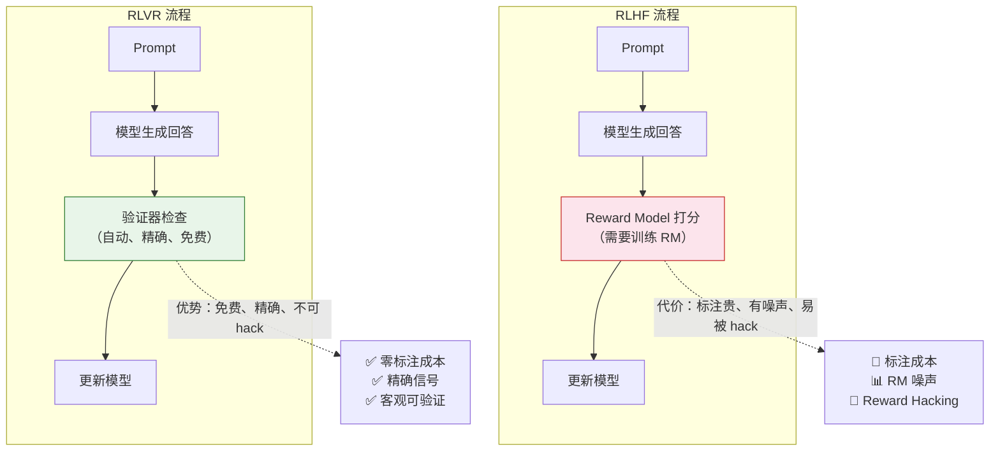

# 8.3 DeepSeek-R1-Zero、DAPO 与 RLVR——纯 RL 训练的新范式

上一节我们理解了 GRPO 的组内归一化机制——用组内均值和标准差替代 Critic，巧妙地省掉了一个完整的模型。这一节我们把视野拉大，看看 2025 年 RL 领域最令人兴奋的三个突破：DeepSeek-R1-Zero 证明了纯 RL 可以不需要 SFT，DAPO 进一步优化了 GRPO 的工程效率，RLVR 则在奖励端彻底抛弃了人工标注。

## DeepSeek-R1-Zero：打破"SFT 是必须的"铁律

在 DeepSeek-R1 之前，大模型对齐领域有一个几乎没人质疑的铁律：**Base 模型必须先做 SFT（学会说人话），然后才能做 RL**。原因很简单——如果你让一个未经 SFT 的基础模型直接做 RL，它的输出可能是语言混杂、格式混乱的"乱码"，RL 训练无从下手。

2025 年 1 月，DeepSeek 团队发表了一篇震动整个 AI 界的论文。他们发现：**在拥有明确客观规则奖励（如数学答案匹配、代码编译通过）的领域，完全不需要 SFT 进行冷启动**。直接让 Base 模型进行大规模 GRPO 训练是可行的。这个发现催生了 DeepSeek-R1-Zero——一个完全没有经过 SFT 的纯 RL 训练模型。

为什么这个发现如此重要？因为在 RLHF 的传统认知中，SFT 被认为是 RL 训练的前提条件。逻辑是这样的：Base 模型只会"续写文本"，不会"回答问题"。如果你直接对 Base 模型做 RL，它生成的输出可能根本不像一个合理的回答，RM 也无从打分。所以必须先用 SFT 教会它基本的对话格式，然后再做 RL 优化回答质量。

但 DeepSeek-R1-Zero 打破了这个认知。当奖励是规则验证的（答对就给分，答错就不给分），模型不需要先学会"怎么回答"——它只需要通过大量试错，找到能拿高分的输出模式。即使初始输出很混乱，只要偶尔有一次答对了拿到奖励，RL 就会强化那条路径。经过足够的训练步数，模型会自己"摸索"出清晰的推理格式。

### 涌现与"顿悟时刻"

R1-Zero 训练过程中最令人震惊的发现是**涌现行为（Emergence）**。模型在没有任何人类示范的情况下，自主发展出了以下能力：

- **长思维链（Chain-of-Thought）**：模型从最初的"直接给答案"逐渐演变成"先分析问题、列公式、一步步计算"，没有人教它这样做
- **自我反思**：当答案错误时，模型学会了回过头检查自己的推理过程，发现并纠正错误
- **策略切换**：面对不同类型的题目，模型会自动选择不同的解题策略

这些能力不是人工设计的，而是模型为了拿到更高的规则奖励自己"领悟"出来的。DeepSeek 团队称之为**"Aha Moment"（顿悟时刻）**——训练到某个阶段，模型突然"开窍"了，开始表现出之前从未展现过的推理能力。

更具体地说，DeepSeek 观察到以下涌现时间线：

- **训练早期**（0-100 步）：模型输出简短混乱，经常直接给一个错误的数字答案
- **训练中期**（100-500 步）：模型开始出现简单的计算步骤，但经常中途算错
- **顿悟时刻**（约 500-1000 步）：模型突然开始检查自己的计算，出现"等等，让我重新算一下"的行为
- **训练后期**（1000+ 步）：模型形成了稳定的"分析→计算→验证"三步推理模式

这种涌现行为引出了一个深层的科学问题：**模型的推理能力是从哪里来的？** 答案很可能是：预训练阶段已经赋予了模型推理的"原材料"（逻辑、数学、语言知识），RL 训练只是把这些原材料"组织"成可用的解题策略。这也解释了为什么 1-Shot RLVR 就能工作——模型本身就有推理能力，RL 只是"激活"了它。

### R1-Zero 的局限与工程妥协

虽然 R1-Zero 证明了纯 RL 的可行性，但它有一个明显的缺陷：**语言质量差**。因为没有经过 SFT，模型的回答经常语言混杂（中英混用）、格式混乱、可读性差。虽然推理能力很强，但回答看起来像"天才但不会表达的学渣"。

因此，最终发布的 DeepSeek-R1 采用了多阶段的工程妥协流程：

1. **冷启动**：少量高质量 SFT 数据（让模型学会基本的输出格式）
2. **大规模 GRPO**：强化推理能力（这是核心阶段）
3. **拒绝采样**：从 GRPO 训练后的模型中筛选高质量数据
4. **SFT 精调**：用筛选出的数据进一步优化格式和语言质量
5. **二次 RL**：结合 RM 和 GRPO 做最终的对齐训练

## DAPO：GRPO 的下一代演进

GRPO 已经证明了"不需要 Critic 也能做 RL"，但它仍有几个工程痛点。DAPO（Decoupled Clip and Dynamic Sampling Policy Optimization）针对性地解决了这些问题，被 NeurIPS 2025 接收为 poster。

### DAPO 的四大改进

| 改进                        | GRPO 的问题                             | DAPO 的解法                            | 效果              |
| --------------------------- | --------------------------------------- | -------------------------------------- | ----------------- |
| **Clip-Higher**             | 上下对称裁剪，低概率动作被过度抑制      | 解耦裁剪范围，给低概率动作更多上升空间 | 更好的探索        |
| **动态采样**                | 所有 prompt 都参与训练，浪费算力        | 过滤掉模型已经答对的 prompt            | 训练效率提升 2-3x |
| **Token 级损失**            | 序列级 reward 归一化，忽略 token 间差异 | Token 级策略梯度，更精细的信用分配     | 更好的长序列训练  |
| **Overlong Reward Shaping** | 过长回答被直接截断惩罚，梯度信号不连续  | 平滑的长度惩罚函数                     | 训练更稳定        |

**Clip-Higher** 的直觉是这样的：GRPO 对策略比率的上下界做对称裁剪（比如 $[0.8, 1.2]$），这对于已经比较确定的高概率动作来说合理。但对于那些当前概率很低（比如 0.01）但有潜力的动作，0.8 的下限意味着它最多被降到 0.008——几乎被彻底压制了。DAPO 解耦了上下界的裁剪范围，给低概率动作更多的上升空间。

**动态采样**解决的是"毕业问题"。我们在上一节观察到，训练后期很多题目的组内方差接近零（模型已经全会了），这些题目不会提供任何梯度信号。DAPO 直接过滤掉这些"毕业题"，只保留有梯度信号的 prompt。在 AIME 2024 数学竞赛上，DAPO 用 DeepSeek-R1 **一半的训练步数**就达到了 50 分。

**Token 级损失**则解决了 GRPO 的另一个盲区。标准的 GRPO 对整个序列做归一化：一个回答要么全被强化（答对了），要么全被抑制（答错了）。但实际上，一个答错的回答中，可能前 80% 的推理步骤是正确的，只是最后一步计算错误。Token 级损失让 GRPO 能够区分"哪些 token 是好的、哪些是坏的"，实现更精细的信用分配。这和第 6 章讨论的信用分配问题直接对应——在长序列中，我们需要知道每个 token 对最终结果的贡献度。

**Overlong Reward Shaping** 解决的是 GRPO 训练中常见的一个工程问题：回答长度失控。模型可能学会"写得越多越好"（因为更长的回答更容易包含正确推理），导致生成 2000+ token 的冗长回答。GRPO 的原始做法是设定最大长度，超过就截断并给惩罚。但截断是硬边界——回答 499 token 没事，501 token 就被惩罚——梯度信号不连续。DAPO 用一个平滑的长度惩罚函数替代硬截断，让模型自然地学会控制回答长度。

```python
# ==========================================
# DAPO 动态采样示意
# ==========================================
def dynamic_sampling(prompts, model, reward_fn, threshold=0.95):
    """
    过滤掉模型已经掌握的 prompt
    """
    useful_prompts = []

    for prompt in prompts:
        # 对每个 prompt 采样多次，计算正确率
        correct_count = 0
        num_samples = 8
        for _ in range(num_samples):
            response = model.generate(prompt)
            reward = reward_fn(prompt, response)
            if reward >= 1.0:  # 答案正确
                correct_count += 1

        accuracy = correct_count / num_samples
        # 只保留正确率低于阈值的 prompt（还没掌握的）
        if accuracy < threshold:
            useful_prompts.append(prompt)

    print(f"过滤前: {len(prompts)} 题")
    print(f"过滤后: {len(useful_prompts)} 题")
    print(f"过滤掉: {len(prompts) - len(useful_prompts)} 题（已掌握）")
    return useful_prompts
```

## RLVR：可验证奖励强化学习

RLVR（Reinforcement Learning with Verifiable Rewards）是 2025 年最重要的 RL 范式转变。它的核心思想出奇地简单：**在那些有客观答案的领域，不需要训练 RM，直接用规则验证就行**。



### RLHF vs RLVR 对比

| 方面             | RLHF                       | RLVR                         |
| ---------------- | -------------------------- | ---------------------------- |
| **数据成本**     | 极高（需要人工标注偏好对） | 极低（自动验证）             |
| **奖励质量**     | 有噪声（人类主观性）       | 精确（客观对错）             |
| **可扩展性**     | 受标注速度限制             | 几乎无限                     |
| **适用范围**     | 主观偏好（礼貌、安全）     | 客观任务（数学、代码、逻辑） |
| **训练稳定性**   | 受 RM 质量影响             | 非常稳定（奖励信号清晰）     |
| **被 Hack 风险** | 高（模型学会钻 RM 的空子） | 低（规则是硬性的）           |

### RLVR 的验证器设计

不同领域有不同的验证方式：

| 领域       | 验证方式   | 示例                        |
| ---------- | ---------- | --------------------------- |
| 数学       | 答案匹配   | `\boxed{42}` == 标准答案    |
| 代码       | 单元测试   | 代码执行 + test case 通过率 |
| 逻辑推理   | 形式化验证 | Lean/Coq 定理证明器         |
| 多语言翻译 | 自动评分   | BLEU/COMET 分数             |

验证器的设计是 RLVR 的关键。好的验证器需要满足三个条件：**确定性**（同样的输入永远得到同样的结果）、**正确性**（验证器的判断确实反映了回答的质量）、**高效性**（验证速度要快，不能成为训练瓶颈）。

其中"正确性"是最微妙的要求。以数学题的答案匹配为例：如果标准答案是 $\frac{22}{7}$，模型回答了 $3.1428...$，算不算正确？如果标准答案是 $(x+1)(x-2)$，模型回答了 $x^2 - x - 2$，算不算正确？这些边界情况需要验证器仔细处理。实践中，数学验证器通常会做数值比较（容差范围内算正确）和表达式化简（展开/因式分解后比较），以处理这些等价表示的情况。

### RLVR 的局限与争议

RLVR 不是万能的，它有几个重要的局限：

1. **只适用于有客观答案的领域**：数学、代码、逻辑推理这些领域有明确的对错标准。但"更礼貌""更有创意""更安全"这类主观偏好，RLVR 没有办法给出精确的奖励信号。在这些领域，仍然需要 RM 或偏好数据。

2. **验证器可能被 hack**：即使奖励是规则生成的，模型仍然可能找到"满足规则但不真正理解"的捷径。比如在数学题中，模型可能学会了一种"特殊技巧"能通过特定类型的验证，但换个问法就答不对了。

3. **"RLVR 真的提升推理能力吗？"**：这是 2025 年 NeurIPS 的一篇 oral 论文提出的尖锐问题。他们质疑 RLVR 可能只是在提高搜索效率（让模型在推理时更高效地找到正确答案），而非真正注入新的推理能力。这是一个开放的前沿争议。

### 1-Shot RLVR：惊人的发现

更令人惊讶的是，ICLR 2025 的研究表明 RLVR **只用 1 个训练样本**就能工作。研究者发现，即使训练集中只有一个数学题，RL 训练仍然能让模型在大量未见过的题目上表现更好。

这说明 RLVR 的有效性不依赖于数据量——模型在预训练阶段已经学到了推理能力，RLVR 的作用是"解锁"这些潜在能力，而不是从零教起。这就像一个学生已经理解了数学概念，但从来没被要求做过题——RL 训练就是"考试"的压力，迫使他把自己已有的知识组织成可用的解题策略。

这个发现对实践有重要指导意义。它意味着 RLVR 训练的"性价比"非常高——你不需要海量数据就能获得显著提升。关键不在于数据的数量，而在于训练过程的设置（奖励函数设计、组大小、训练步数等）。这也解释了为什么 DeepSeek-R1-Zero 能够成功——即使没有任何 SFT 数据，只要 RL 训练设置正确，模型就能自己"进化"出推理能力。

<details>
<summary>思考题：如果 RLVR 只需要 1 个样本就能工作，那为什么实际训练中仍然需要大量数据？</summary>

1 个样本能"启动"训练过程，但要让模型在多样化的场景下都表现好，仍然需要不同类型、不同难度的训练数据。原因包括：

- **泛化性**：只用 1 个样本训练，模型可能只在那道题的"邻域"内表现好。要覆盖广泛的题目类型，需要多样化的数据。
- **避免过拟合**：如果训练数据太少，模型可能只记住了那道题的特定解法，而不是学会了通用的推理策略。
- **统计稳定性**：1 个样本的成功有偶然性。大量数据的统计平均能确保训练方向是正确的。

1-Shot RLVR 的真正意义是理论上的——它证明了 RL 的价值不在于"注入新知识"，而在于"激活已有能力"。这改变了我们对 RL 在 LLM 训练中角色的理解。

</details>

GRPO 在策略端省掉了 Critic，RLVR 在奖励端省掉了 RM。这两者结合，把 RL 训练的复杂度压缩到了极致。但 RL 的故事并没有结束——更激动人心的方向是 RL Scaling 和 Test-time Scaling。让我们在下一节看看这些前沿方向——[RL Scaling 与未来展望](./rl-scaling-outlook)。
