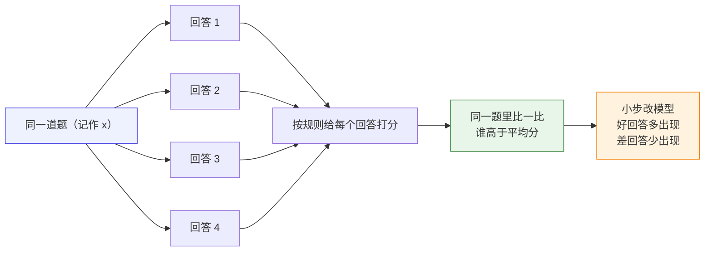
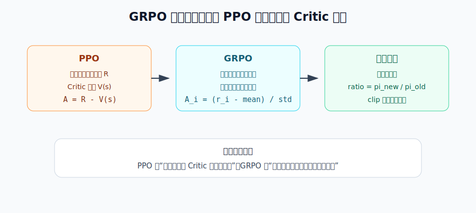
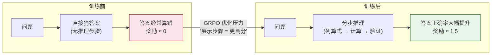
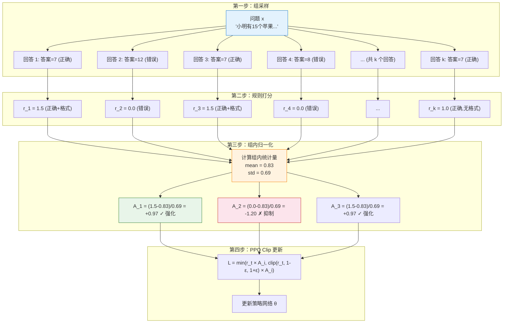

# 7.4 动手：GRPO 训练与核心机制

上一章我们深入了 DPO 的理论与实践，看到它可以直接从固定的偏好数据里学习：同一个 prompt 下，chosen 应该比 rejected 更可能出现。现在我们回到**在线训练**：模型不再只读别人已经标好的偏好对，而是在训练过程中自己生成回答、自己得到反馈、再用反馈更新自己。

GRPO 的入口是**同题多答**。给定同一道题，模型一次生成多个回答；奖励函数分别给这些回答打分；然后只在这一组回答内部比较谁更好。它表面上像“让模型多试几次”，真正解决的问题是：

> **没有 Critic 的时候，模型怎么判断某个回答是比预期好，还是比预期差？**

一个直观答案是：拿它和同一道题的其他回答比。GRPO 就是沿着这个思路，把同题多答变成可以训练的策略优化方法。

本节沿着一次完整的 GRPO 训练轨迹来讲：先看同题多答怎样产生组内比较，再解释 Critic 和基线，接着写出优势、概率比值和裁剪目标，最后回到手写代码和 TRL 的 `GRPOTrainer`。



这张图先表达一个最基本的训练信号：**同一道题多答几次，每个回答都有分数；高于同组平均分的回答以后更容易出现，低于同组平均分的回答以后更少出现**。

用一个带数字的小例子走一遍。假设题目是：

> 小明有 3 个苹果，又买了 2 个，现在一共有几个？

模型对同一道题一次写出 4 个回答，规则打分如下：

| 回答 | 模型写了什么                | 分数 |
| ---- | --------------------------- | ---- |
| 1    | “3 + 2 = 5，所以答案是 5。” | 1.5  |
| 2    | “答案是 5。”                | 1.0  |
| 3    | “应该是 6。”                | 0.0  |
| 4    | “不确定，可能是 4。”        | 0.0  |

这 4 个分数的平均分是：

$$
\frac{1.5+1.0+0.0+0.0}{4}=0.625
$$

于是模型会这样理解这组回答：

| 回答 | 和平均分比较       | 之后怎么学                     |
| ---- | ------------------ | ------------------------------ |
| 1    | $1.5-0.625=+0.875$ | 明显比平均好，**以后多生成它** |
| 2    | $1.0-0.625=+0.375$ | 也比平均好，稍微多生成它       |
| 3    | $0.0-0.625=-0.625$ | 比平均差，**以后少生成它**     |
| 4    | $0.0-0.625=-0.625$ | 比平均差，以后少生成它         |

这里的“比平均分高多少、低多少”，后面会被正式叫做**优势**。在这个例子里，优势就是“这份回答在同题四个回答里表现得比平均好还是差”。

接下来先定义 Critic，再看为什么“和同题其他回答比一比”可以替代 Critic。

在 PPO 这类 Actor-Critic 方法里，**Actor** 是负责生成回答的策略模型，**Critic** 则像一个“价值评估器”：它不直接生成回答，而是估计“当前已经写到这里，后面大概能拿到多少总奖励”。用公式写就是价值函数：

$$
V_\phi(s_t)
$$

其中 $s_t$ 是当前状态。对语言模型来说，可以粗略理解为“prompt 加上已经生成的前几个 token”；$\phi$ 是 Critic 自己的参数。Critic 的作用是给策略更新提供一个基线：如果某个回答的真实奖励比 Critic 预估的更高，就说明这个回答比预期好，应该提高概率；如果比预期低，就应该降低概率。

问题在于，LLM 场景里的 Critic 往往很贵也很难训。它通常也是一个大模型，需要额外显存；而且它要从一段还没写完的文本预测最终奖励，监督信号又常常只在回答末尾出现，所以训练噪声很大。GRPO 想做的事情就是：**不再单独训练这个 Critic，而是用同一个 prompt 下多个回答的平均分，临时充当“基线”**。这就是后面“组内归一化能替代 Critic”的核心来源。

## 同题多答：把平均分当临时基线

GRPO 的训练从**同题多答**开始。给定同一个 prompt，模型一次生成多个回答；奖励函数分别给这些回答打分；然后把这一组回答的平均分当作临时基线。高于平均分的回答会被鼓励，低于平均分的回答会被抑制。

为了把这个过程写成强化学习问题，先对应几个基本术语：

| 强化学习概念 | 在数学推理模型里是什么                                  |
| ------------ | ------------------------------------------------------- |
| 状态 $s_t$   | 题目 prompt 加上已经写出的推理步骤，也就是 $(x,y_{<t})$ |
| 动作 $a_t$   | 下一步生成的 token，也就是 $y_t$                        |
| 轨迹 $\tau$  | 一整段推理过程和最终答案                                |
| 奖励 $R$     | 答案是否正确、格式是否符合要求                          |
| 策略 $\pi$   | 当前正在训练的语言模型                                  |

如果照 PPO 的路线走，模型会生成回答，奖励函数给最终答案打分，Critic 再估计一个基线 $V_\phi(s_t)$，优势大致写成：

$$
A_t
\approx
R
-
V_\phi(s_t)
$$

这句话的意思是：**不要只看奖励高不高，要看它有没有比 Critic 的预期更好**。这在传统强化学习里很自然，但在 LLM 数学推理里就很重：Critic 也是大模型，还要从未完成的推理文本预测最终得分。

GRPO 的想法是保留 PPO 最有用的部分，也就是 **ratio + clip**，但把 Critic 基线换成“同一道题的一组回答的平均分”。DeepSeekMath 论文提出 GRPO 时，明确说它 **“foregoes the critic model”**，并用组内分数来估计基线。



因此，GRPO 与 PPO 的关系可以概括为：

- PPO 问：这个回答比 Critic 预估的平均水平好吗？
- GRPO 问：这个回答比同一道题的其他回答好吗？
- PPO 和 GRPO 都还会用概率比值和裁剪，避免一次更新过大。

> 论文脉络：GRPO 来自 DeepSeekMath 论文 [DeepSeekMath: Pushing the Limits of Mathematical Reasoning in Open Language Models](https://arxiv.org/abs/2402.03300)。它不是完全抛弃 PPO，而是在 PPO 框架里去掉 Critic，用组内相对奖励构造优势。

还需要澄清一个常见误会：**GRPO 不是一个新的模型，也不只是“组内归一化”这个公式。GRPO 是一种在线训练策略模型的方法。**

在 GRPO 里，被训练的对象仍然是语言模型策略：

$$
\pi_\theta(y \mid x)
$$

这里 $x$ 是题目或 prompt，$y$ 是模型生成的回答。GRPO 的训练方式是：对同一个 prompt 一次生成多个回答，把这些回答放在同一组里打分，并比较：**这个回答在同组里是否高于平均水平？**

如果某个回答比同组平均水平好，它的优势 $A_i$ 就是正的，训练会提高它的概率；如果比同组平均水平差，优势就是负的，训练会降低它的概率。最后更新策略时，GRPO 仍然会使用 PPO-style 的 `ratio + clip`，避免新策略离旧策略太远。

所以 GRPO 可以先理解成：

> **GRPO = 在线组采样 + 规则/奖励打分 + 组内相对优势 + PPO-style 裁剪更新。**

把开头的苹果题翻译成这句话：同一道题一次生成 4 个回答，这是**在线组采样**；用答案正确性和格式给分，这是**规则/奖励打分**；用 $1.5-0.625$、$1.0-0.625$ 这样的差值判断好坏，这是**组内相对优势**；最后让好回答概率上升、差回答概率下降，但每次只小步调整，这就是 **PPO-style 裁剪更新**。

这就是“组内相对优势”的直觉：**同一道题里，谁比平均好，就多学谁；谁比平均差，就少生成谁**。

下面是一份最小手写 GRPO 代码地图。它不是 `trl` 的工程源码，而是把 GRPO 的数学结构摊开给你看：每个公式后面都能回到这份代码里的某几行。

<GrpoCodeFocus focus="overview" />

这份代码可以分成八块：

| 标记    | 代码部分                          | 后文会解释什么                                |
| ------- | --------------------------------- | --------------------------------------------- |
| **[A]** | `sample_groups`                   | 为什么每个 prompt 要生成多个回答              |
| **[B]** | `rule_reward` / `score_responses` | 奖励从哪里来，为什么数学题不需要 RM           |
| **[C]** | `group_advantages`                | 组内均值如何替代 Critic 基线                  |
| **[D]** | `sequence_logprob`                | 如何给一整段回答算 $\log \pi_\theta(y\mid x)$ |
| **[E]** | `grpo_loss` 前半段                | `ratio`、`clip` 和 PPO-style 策略更新         |
| **[F]** | `approx_kl`                       | 为什么还要限制 Policy 偏离 Reference          |
| **[G]** | `train_step`                      | 采样、打分、优势、loss、反向传播如何接起来    |
| **[H]** | `train_grpo`                      | 为什么 GRPO 是在线训练，每轮都生成新回答      |

## 从 PPO 改到 GRPO：到底替换了哪几行

如果不改成 GRPO，而是继续按 PPO / RLHF 的方式训练，代码直觉通常是这样：

```python
# PPO / RLHF：在线生成，然后让 Critic 估计基线
responses = policy_old.generate(prompts)
logps_old = sequence_logprob(policy_old, prompts, responses).detach()

rewards = reward_model(prompts, responses)
values = critic(prompts, responses)
advantages = rewards - values

logps_new = sequence_logprob(policy, prompts, responses)
ratio = torch.exp(logps_new - logps_old)
ppo_loss = -torch.min(
    ratio * advantages,
    torch.clamp(ratio, 1 - clip_eps, 1 + clip_eps) * advantages,
).mean()
```

这里的 `critic` 就是前面说的价值模型。它的工作不是生成答案，而是估计一个基线：**这个 prompt 和当前回答前缀，大概应该拿多少分**。然后 PPO 用 `rewards - values` 得到优势，判断某个回答是“比预期好”还是“比预期差”。

GRPO 的改法很集中：**保留在线生成、概率比值和裁剪，但不再训练 Critic；优势改成从同一个 prompt 的一组回答里算出来**。

```python
# GRPO：同一个 prompt 生成 G 个回答，然后做组内比较
responses = generate_many(policy_old, prompts, num_generations=G)
logps_old = sequence_logprob(policy_old, prompts, responses).detach()

rewards = reward_fn(prompts, responses)
rewards_by_group = rewards.view(batch_size, G)

group_mean = rewards_by_group.mean(dim=1, keepdim=True)
group_std = rewards_by_group.std(dim=1, keepdim=True)
advantages = ((rewards_by_group - group_mean) / (group_std + 1e-4)).view(-1)

logps_new = sequence_logprob(policy, prompts, responses)
ratio = torch.exp(logps_new - logps_old)
grpo_loss = -torch.min(
    ratio * advantages,
    torch.clamp(ratio, 1 - clip_eps, 1 + clip_eps) * advantages,
).mean()
```

把真正变化的几行单独拎出来，就是：

```diff
  responses = policy_old.generate(prompts)
  rewards = reward_model_or_rule(prompts, responses)
- values = critic(prompts, responses)
- advantages = rewards - values

+ rewards_by_group = rewards.view(batch_size, G)
+ group_mean = rewards_by_group.mean(dim=1, keepdim=True)
+ group_std = rewards_by_group.std(dim=1, keepdim=True)
+ advantages = ((rewards_by_group - group_mean) / (group_std + 1e-4)).view(-1)

  loss = ppo_style_clipped_loss(logps_new, logps_old, advantages)
```

所以 GRPO 不是“把 PPO 全删掉”，也不是“只剩一个组内归一化公式”。更准确地说，**GRPO 把 PPO 里的 Critic 基线换成了组内平均基线**：原来问“这个回答比 Critic 预期好吗”，现在问“这个回答比同题其他回答好吗”。

TRL 的真实源码也正是这个结构。2026-05-01 查看 Hugging Face TRL main 分支时，可以在 [`GRPOTrainer`](https://github.com/huggingface/trl/blob/main/trl/trainer/grpo_trainer.py) 里看到这些对应关系：

1. `GRPOTrainer` 的初始化参数里有 `reward_funcs`，它可以是奖励模型，也可以是普通 Python 函数。也就是说，数学题这类任务可以直接用规则函数打分，不一定要先训练 RM。
2. `self.num_generations = args.num_generations` 对应公式里的 $G$，也就是**每个 prompt 生成几个回答**。
3. 源码会把 rewards reshape 成 `(-1, num_generations)`，计算 `mean_grouped_rewards` 和组内 `std_rewards`，再得到 `advantages = rewards - mean_grouped_rewards`，必要时除以标准差。
4. 损失部分仍然计算 `coef_1 = exp(log_ratio)`，再用 `torch.clamp` 得到 `coef_2`，最后对 `coef_1 * advantages` 和 `coef_2 * advantages` 取 `min`。这就是 PPO-style 裁剪目标。

对照 [`PPOTrainer`](https://github.com/huggingface/trl/blob/main/trl/experimental/ppo/ppo_trainer.py)，差别就更清楚：PPOTrainer 需要 `reward_model` 和 `value_model`，并用 `value_model` 产生优势估计；GRPOTrainer 不需要单独的 `value_model`，它把**同题多答的组内相对分数**直接变成优势。

## 读公式前：GRPO 的一组样本长什么样

GRPO 的训练样本不是“一个 prompt 配一个回答”，而是**一个 prompt 配一组回答**。假设一个 batch 里有多个题目，用 $j$ 表示第几个题目，用 $i$ 表示这个题目下第几个回答：

$$
x_j
\quad\longrightarrow\quad
\{y_{j,1},y_{j,2},\ldots,y_{j,G}\}
$$

这里每个字母的意思是：

- $x_j$：第 $j$ 个 prompt，也就是一道题或一个问题。
- $G$：group size，每个 prompt 生成几个回答。代码里的 `num_generations=8` 就是 $G=8$。
- $y_{j,i}$：第 $j$ 个 prompt 下生成的第 $i$ 个回答。
- $\pi_{\text{old}}$：生成这批回答时使用的旧策略。它负责采样数据。
- $\pi_\theta$：正在被更新的新策略。它负责学习，让好回答更可能出现。

采样过程可以写成：

$$
y_{j,i}
\sim
\pi_{\text{old}}(\cdot \mid x_j),
\qquad
i=1,\ldots,G
$$

符号 $\sim$ 表示“从某个分布中采样”。$\pi_{\text{old}}(\cdot \mid x_j)$ 里的点号 $\cdot$ 表示“所有可能回答的位置”，意思是：给定 prompt $x_j$，旧策略会给所有可能回答分配概率，然后我们从这个分布里抽出 $G$ 个回答。

代码里对应的是 **[A] 组采样**：

<GrpoCodeFocus focus="sampling" />

每个回答生成后，都要得到一个奖励：

$$
r_{j,i}
=
R(x_j,y_{j,i})
$$

这里 $R$ 是奖励函数，$r_{j,i}$ 是一个标量。数学题里，$R$ 可以很简单：答案对就加分，格式规范也加分。GRPO 的关键不是“奖励函数一定很复杂”，而是：**同一道题下的多个回答会放在一起比较**。

## 7.4.1 GRPO 训练实验

### 实验设置：GSM8K + 规则奖励

GSM8K 是一个包含 8500 道小学数学应用题的数据集，每道题都有明确的数值答案。这恰好是一个有"客观正确答案"的场景——不需要 RM，直接用规则判断答案是否正确：

- 答案正确：$+1.0$ 分
- 格式规范（有清晰的推理步骤）：$+0.5$ 分
- 答案错误：$0$ 分

```python
# 1. 规则奖励函数（不需要 RM！）
import re

def rule_based_reward(prompt: str, response: str, ground_truth: str) -> float:
    reward = 0.0
    # 格式分：检查 \boxed{...}
    if re.search(r'\\boxed\{[^}]+\}', response):
        reward += 0.5
    # 答案分：提取最终答案并比较
    answer_match = re.search(r'\\boxed\{([^}]+)\}', response)
    if answer_match:
        model_answer = answer_match.group(1).strip()
        try:
            if abs(float(model_answer) - float(ground_truth)) < 0.01:
                reward += 1.0
        except ValueError:
            if model_answer == ground_truth:
                reward += 1.0
    return reward

# 测试
prompt = "Janet 的鸡蛋盒子每天能装 16 个鸡蛋。她每天早上吃 3 个，下午用 4 个烤松饼。她每周能卖多少个鸡蛋？"
good = "首先计算每天剩余的鸡蛋数：16 - 3 - 4 = 9 个\n每周有 7 天，所以每周能卖：9 × 7 = 63 个\n\\boxed{63}"
bad = "我觉得大概能卖 50 个左右吧。\\boxed{50}"
print(rule_based_reward(prompt, good, '63'))  # 1.5
print(rule_based_reward(prompt, bad, '63'))   # 0.5
```

注意这里的关键区别：**不需要训练任何 RM，规则就是裁判**。数学题有标准答案，直接比较就行。这种"可验证奖励"正是 RLVR 的核心思想（8.3 节会深入讨论）。

在手写代码地图中，奖励函数对应的是 **[B]**。它只接收回答和标准答案，返回一个标量奖励：

<GrpoCodeFocus focus="reward" />

### 运行 GRPO 训练

我们使用 `trl` 库提供的 GRPO 实现。和 PPO 相比，GRPO 不需要 Critic 模型：

```python
# 2. GRPO 训练代码（简化示意）
from trl import GRPOTrainer, GRPOConfig
from transformers import AutoModelForCausalLM, AutoTokenizer
from datasets import load_dataset

model = AutoModelForCausalLM.from_pretrained("Qwen/Qwen2.5-1.5B-Instruct")
tokenizer = AutoTokenizer.from_pretrained("Qwen/Qwen2.5-1.5B-Instruct")

config = GRPOConfig(
    output_dir="./grpo_gsm8k",
    num_generations=8,        # 每个问题生成 k=8 个回答（组大小）
    per_device_train_batch_size=4,
    learning_rate=5e-6,
    num_train_epochs=1,
    # 不需要 Critic！这是 GRPO 的核心创新
)

gsm8k = load_dataset("openai/gsm8k", "main")
trainer = GRPOTrainer(
    model=model,
    args=config,
    train_dataset=gsm8k["train"],
    reward_funcs=[rule_based_reward],  # 直接传入规则奖励函数
    tokenizer=tokenizer,
)

trainer.train()  # 开始训练——不需要 Critic，不需要 RM
trainer.save_model("./grpo_gsm8k/final_model")
```

如果把 `GRPOTrainer` 内部最关键的训练步骤摊开，就是“先组采样，再打分，再算优势，再更新策略”：

<GrpoCodeFocus focus="train" />

### 训练前后：推理步骤的变化

GRPO 训练最令人兴奋的观察是模型推理方式的变化：

**训练前**（直接猜答案）：

```
题目：小明有 15 个苹果，给了小红 3 个，又给了小刚 5 个，还剩多少个？
回答：我觉得还剩 7 个。\boxed{7}
```

**训练后**（展示推理过程）：

```
题目：小明有 15 个苹果，给了小红 3 个，又给了小刚 5 个，还剩多少个？
回答：
让我一步一步算：
- 小明一开始有 15 个苹果
- 给了小红 3 个：15 - 3 = 12
- 又给了小刚 5 个：12 - 5 = 7
- 所以还剩 7 个
\boxed{7}
```

模型从"直接猜答案"变成了"先列算式再计算"——这不是我们教它的，而是模型在 GRPO 训练过程中自己"领悟"出来的。因为展示推理步骤能提高答案正确率（拿到更高的规则奖励），所以 GRPO 的优化压力自然地选择了这条路径。



## 7.4.2 组内归一化：为什么能替代 Critic

上面我们看到了"省掉 Critic"的实际效果——显存减少 30-40%，推理步骤从"猜答案"变成"列算式"。但一个核心问题还没有回答：**组内归一化为什么能替代 Critic 的工作？**

### PPO Critic 的三大问题

在回答"为什么能替代"之前，先说清楚"为什么要替代"。PPO 的 Critic 在 LLM 训练中面临三个严重问题：

**1. 吃显存**：Critic 与 Actor 同等规模，PPO 需要同时装下 Actor + Critic + Reference + RM 四个模型。

**2. 训练不稳定**：价值函数 $V(s)$ 需要从"部分生成的文本"预测"最终得分"，但 LLM 序列很长（500+ tokens），监督信号只在末尾才有，方差极大。

**3. 工程复杂**：四个模型各有一套优化器、学习率、梯度裁剪配置，调参难度指数级增长。

回顾第 5 章，Critic 的核心作用是**提供基线来降低方差**。如果不需要单独训练网络就能得到基线，Critic 就可以退休了。

### GRPO 的核心思路

GRPO 的想法出奇地简单。对于同一个问题 $x_j$，先采样 $G$ 个回答，再得到 $G$ 个奖励：

$$
\{r_{j,1},r_{j,2},\ldots,r_{j,G}\}
$$

然后计算这组奖励的均值：

$$
\bar r_j
=
\frac{1}{G}
\sum_{i=1}^{G}
r_{j,i}
$$

这里：

- $\bar r_j$：第 $j$ 个 prompt 这一组回答的平均奖励。
- $\frac{1}{G}\sum_{i=1}^G$：把 $G$ 个回答的奖励加起来，再除以 $G$。
- $r_{j,i}$：第 $j$ 个 prompt 下第 $i$ 个回答的奖励。

再计算这组奖励的标准差：

$$
s_j
=
\sqrt{
\frac{1}{G}
\sum_{i=1}^{G}
(r_{j,i}-\bar r_j)^2
}
$$

这里：

- $s_j$：第 $j$ 组奖励的标准差，表示这一组回答分数差异有多大。
- $(r_{j,i}-\bar r_j)^2$：第 $i$ 个回答离平均水平有多远，平方是为了不让正负抵消。
- $\sqrt{\cdot}$：开方，把尺度变回奖励原来的尺度附近。

最后得到第 $i$ 个回答的组内优势：

$$
\hat A_{j,i}
=
\frac{
r_{j,i}-\bar r_j
}{
s_j+\epsilon
}
$$

这就是 GRPO 的核心公式。它读起来很朴素：

- $r_{j,i}-\bar r_j$：这个回答比同题平均水平高多少。
- 除以 $s_j+\epsilon$：把不同题目的奖励尺度拉到相近范围。
- $\epsilon$：一个很小的数，防止标准差为 0 时除以 0。
- $\hat A_{j,i}>0$：这个回答比同组平均好，应该提高概率。
- $\hat A_{j,i}<0$：这个回答比同组平均差，应该降低概率。
- $\hat A_{j,i}\approx 0$：这个回答和平均水平差不多，不需要太强更新。

如果同一组回答奖励全都一样，$s_j$ 会接近 0，代码会把优势设成 0。这表示这道题暂时没有可学习的差异：大家都对，或者大家都错，模型不知道该更偏向哪一个回答。

这个公式做的事情和 Critic 很像——**减去均值就是“比平均好了多少”**。只不过 Critic 用一个单独的神经网络来预测基线 $V(s)$，而 GRPO 直接用同一组回答的实际得分均值 $\bar r_j$ 当基线。

代码里对应的是 **[C] 组内优势**：

<GrpoCodeFocus focus="advantages" />

代码对应关系是：

- `grouped_rewards = rewards.view(-1, group_size)`：把一维奖励列表重新排成“每行一个 prompt、每行 $G$ 个回答”的形状。
- `group_mean = grouped_rewards.mean(dim=1, keepdim=True)`：计算每个 prompt 的 $\bar r_j$。
- `group_std = grouped_rewards.std(dim=1, keepdim=True)`：计算每个 prompt 的 $s_j$。
- `advantages = (grouped_rewards - group_mean) / (group_std + eps)`：实现 $\hat A_{j,i}$。
- `torch.where(group_std < eps, 0, advantages)`：如果一组回答没有差异，就不给这组样本训练信号。



组内归一化有效的原因有三个：

**难度归一化**：不同题目的难度不同。简单题所有回答都正确（奖励均值很高），难题大部分回答都错误（奖励均值很低）。如果用绝对奖励，简单题的回答会获得更高的梯度信号，模型会把大部分精力花在简单题上。组内归一化消除了这种偏差——它只关注"这道题内部谁更好"，不受题目绝对难度的影响。

**相对比较更稳定**：人类偏好本质上也是比较式的（"A 比 B 好"），不是绝对的（"A 得 87 分"）。GRPO 的组内比较和人类的判断方式天然一致。

**方差更低**：同一组内的回答共享相同的 prompt，唯一的差异是模型生成的随机性。这种"控制变量"式的比较比跨样本的绝对评分更稳定。

一句话总结：**GRPO = PPO 的裁剪机制 + 用组内排名替代 Critic**。

“PPO 的裁剪机制”在代码里仍然是 `ratio`、`clamp` 和 `min`，只不过这里的 `advantages` 来自组内比较。

先定义新旧策略的概率比值：

$$
\rho_{j,i}(\theta)
=
\frac{
\pi_\theta(y_{j,i}\mid x_j)
}{
\pi_{\text{old}}(y_{j,i}\mid x_j)
}
$$

这里：

- $\pi_{\text{old}}(y_{j,i}\mid x_j)$：采样这条回答时，旧策略给它的概率。
- $\pi_\theta(y_{j,i}\mid x_j)$：当前正在更新的新策略给它的概率。
- $\rho_{j,i}(\theta)$：新策略相对旧策略，把这条回答的概率放大或缩小了多少倍。

实际代码里不会直接除两个很小的概率，而是先算 log probability，再相减取指数：

$$
\rho_{j,i}(\theta)
=
\exp
\left(
\log \pi_\theta(y_{j,i}\mid x_j)
-
\log \pi_{\text{old}}(y_{j,i}\mid x_j)
\right)
$$

如果 $\rho=1$，说明新旧策略对这条回答的概率一样；如果 $\rho=1.2$，说明新策略把它的概率提高了 20%；如果 $\rho=0.8$，说明新策略把它的概率压低了 20%。

有了比值和组内优势，GRPO 的裁剪目标可以写成：

$$
\mathcal{J}_{\text{GRPO}}^{\text{clip}}(\theta)
=
\mathbb{E}_{j,i}
\left[
\min
\left(
\rho_{j,i}(\theta)\hat A_{j,i},
\operatorname{clip}
(\rho_{j,i}(\theta),1-\epsilon_{\text{clip}},1+\epsilon_{\text{clip}})
\hat A_{j,i}
\right)
\right]
$$

每个符号的意思是：

- $\mathbb{E}_{j,i}$：对 batch 里的所有 prompt 和所有组内回答取平均。
- $\hat A_{j,i}$：刚才算出的组内优势。
- $\epsilon_{\text{clip}}$：裁剪范围，常见值是 0.2。
- $\operatorname{clip}(\rho,1-\epsilon_{\text{clip}},1+\epsilon_{\text{clip}})$：把概率比值限制在一个区间内。例如 $\epsilon_{\text{clip}}=0.2$ 时，$\rho$ 会被限制在 $[0.8,1.2]$。
- $\min(\cdot,\cdot)$：选择更保守的那个目标，避免一次更新太大。

为什么要裁剪？因为这批回答是 $\pi_{\text{old}}$ 生成的。如果训练几步后 $\pi_\theta$ 已经离 $\pi_{\text{old}}$ 很远，那么这批数据就不再能可靠代表新策略的行为。裁剪的作用就是：**允许模型学习，但不允许它因为同一批数据一下子改得太猛**。

<GrpoCodeFocus focus="clip" />

在代码里，`new_logprobs` 是 $\log \pi_\theta(y_{j,i}\mid x_j)$，`old_logprobs` 是 $\log \pi_{\text{old}}(y_{j,i}\mid x_j)$。所以：

- `ratio = torch.exp(new_logprobs - old_logprobs)`：实现 $\rho_{j,i}(\theta)$。
- `surr1 = ratio * advantages`：不裁剪时的策略目标。
- `clipped_ratio = torch.clamp(ratio, 1.0 - clip_eps, 1.0 + clip_eps)`：把 $\rho$ 限制在 $[1-\epsilon_{\text{clip}},1+\epsilon_{\text{clip}}]$。
- `surr2 = clipped_ratio * advantages`：裁剪后的策略目标。
- `policy_loss = -torch.min(surr1, surr2).mean()`：取保守目标，并加负号变成要最小化的 loss。

注意上面的 $\mathcal{J}_{\text{GRPO}}^{\text{clip}}$ 是“想最大化”的目标；代码里的优化器默认最小化 loss，所以会写成：

$$
\text{policy\_loss}
=
-
\mathcal{J}_{\text{GRPO}}^{\text{clip}}(\theta)
$$

这就是为什么代码中有一个负号。

同时，GRPO 通常还会保留一个 KL 惩罚，让 Policy 不要离 Reference 太远。手写代码里使用的是一个常见的近似 KL：

$$
\widehat D_{\text{KL}}
=
\exp(\Delta)
-
\Delta
-
1,
\qquad
\Delta
=
\log \pi_{\text{ref}}(y\mid x)
-
\log \pi_\theta(y\mid x)
$$

这个近似有一个好性质：当 Policy 和 Reference 给出的 log probability 一样时，$\Delta=0$，于是

$$
\exp(0)-0-1=0
$$

也就是说，两个模型越接近，KL 惩罚越小；偏离越大，惩罚越大。

最后总损失可以写成：

$$
\mathcal{L}_{\text{GRPO}}
=
-
\mathcal{J}_{\text{GRPO}}^{\text{clip}}(\theta)
+
\beta_{\text{KL}}
\widehat D_{\text{KL}}
$$

这里 $\beta_{\text{KL}}$ 是 KL 惩罚的权重，对应代码里的 `kl_coef`。它越大，模型越保守；它越小，模型越愿意离开 Reference 去探索高奖励回答。

<GrpoCodeFocus focus="kl" />

这里的代码对应关系是：

- `log_ratio_ref = ref_logprobs - new_logprobs`：实现 $\Delta$。
- `approx_kl = (torch.exp(log_ratio_ref) - log_ratio_ref - 1.0).mean()`：实现 $\widehat D_{\text{KL}}$。
- `loss = policy_loss + kl_coef * approx_kl`：实现总损失 $\mathcal{L}_{\text{GRPO}}$。

把所有步骤连起来，GRPO 的一次训练就是：

1. 对每个 prompt 采样 $G$ 个回答。
2. 用规则或奖励函数给每个回答打分。
3. 在同一个 prompt 的组内计算 $\bar r_j$、$s_j$ 和 $\hat A_{j,i}$。
4. 用新旧策略 log probability 算 $\rho_{j,i}(\theta)$。
5. 用 PPO-style clip 控制更新幅度。
6. 加上 Reference KL 惩罚。
7. 反向传播，只更新 Policy。

## 7.4.3 实验对比与参数调优

### 显存占用对比

| 模型大小 | PPO 显存（4 模型） | GRPO 显存（2 模型） | 节省比例 |
| -------- | ------------------ | ------------------- | -------- |
| 1.5B     | ~24 GB             | ~14 GB              | ~42%     |
| 7B       | ~80 GB             | ~48 GB              | ~40%     |
| 14B      | ~160 GB            | ~96 GB              | ~40%     |
| 70B      | ~640 GB            | ~384 GB             | ~40%     |

GRPO 省掉了 Critic（和 Actor 同等规模）和 RM 两个模型，通常能减少 30-40% 的显存占用。在实际工程中，这意味着原本需要 8 张 A100 的训练任务，现在 5 张就够了。

### 组内方差的演化

GRPO 的核心创新是用组内归一化替代 Critic。在训练初期，同一个问题的 8 个回答质量差异很大（方差高）。随着训练推进，组内回答质量趋于一致（方差降低），大部分回答都能答对。

```
训练初期（Episode 10）：
  问题 "15 - 3 - 5 = ?" 的 8 个回答：[3, 7, 12, 7, 15, 7, 8, 10]
  组内方差：高（答案五花八门）
  归一化优势：[−1.2, +0.1, +0.8, +0.1, +1.5, +0.1, −0.3, +0.6]

训练中期（Episode 100）：
  同一问题的 8 个回答：[7, 7, 7, 8, 7, 7, 7, 7]
  组内方差：低（大部分答对了）
  归一化优势：[0, 0, 0, −0.5, 0, 0, 0, 0]

训练后期（Episode 300）：
  同一问题的 8 个回答：[7, 7, 7, 7, 7, 7, 7, 7]
  组内方差：接近零（全部答对）
  归一化优势：全部接近零 → 无梯度信号
```

当组内方差降为零时，优势全部为零，没有梯度信号了——模型在这个问题上"毕业"了。这正是我们想要的行为：训练信号自然地转移到还没掌握的题目上。

### k 值的选择

k（组大小）是 GRPO 最关键的超参数，它直接影响组内归一化的质量：

| k 值 | 采样成本                | 归一化质量               | 适用场景     |
| ---- | ----------------------- | ------------------------ | ------------ |
| 2    | 低（每个问题只采 2 次） | 差（均值和标准差不稳定） | 快速验证     |
| 4    | 中等                    | 一般                     | 资源有限时   |
| 8    | 较高                    | 良好                     | **默认推荐** |
| 16   | 高                      | 很好（统计量更稳定）     | 追求上限     |
| 64   | 很高                    | 极好                     | 大规模训练   |

```python
# GRPO 组内归一化的简单实现
import numpy as np

def grpo_group_normalize(rewards: list[float]) -> list[float]:
    rewards = np.array(rewards, dtype=float)
    mean, std = rewards.mean(), rewards.std()
    if std < 1e-8:
        return np.zeros_like(rewards)
    return (rewards - mean) / std

# 示例：8 个回答的奖励
rewards = [1.5, 0.0, 1.5, 0.0, 1.0, 1.5, 0.5, 1.5]
advantages = grpo_group_normalize(rewards)
# 归一化优势: [ 0.82 -1.23  0.82 -1.23  0.12  0.82 -0.53  0.82]
# 均值: 0.875, 标准差: 0.637
```

<details>
<summary>思考题：GRPO 的组内归一化在什么情况下会失效？</summary>

1. **k 太小**：$k=2$ 时均值和标准差极不稳定，统计量不可靠。
2. **奖励分布偏斜**：大部分回答得零分时，少数高分回答主导梯度信号。
3. **所有回答质量相同**：方差为零，优势全部为零，无梯度信号——即训练后期"毕业"现象。
4. **奖励信号不连续**：只有 0/1 两个值时，归一化后的优势分布是离散的，梯度信号不够精细。

GRPO 通过 DAPO 的"动态采样"改进来缓解这些问题——过滤掉模型已经答对的题目，只保留有梯度信号的样本。

</details>

### GRPO 与 PPO 全面对比

| 组件           | PPO                               | GRPO                               |
| -------------- | --------------------------------- | ---------------------------------- |
| 基线（Critic） | 独立的 $V(s)$ 网络                | 组内均值 $\bar{r}$                 |
| 优势计算       | $A = R - V(s)$ 或 GAE             | $A_i = (r_i - \bar{r}) / \sigma_r$ |
| 模型数量       | 4 个（Actor + Critic + Ref + RM） | 2 个（Actor + Ref）                |
| 裁剪机制       | PPO Clip                          | 同样的 PPO Clip                    |
| 采样方式       | 在线交互                          | 组采样（每个 prompt 采 k 个）      |
| 显存           | 高                                | 低 30-40%                          |
| 基线质量       | 依赖 Critic 训练质量              | 依赖组大小 $k$                     |
| 基线更新速度   | 需要重新训练 Critic               | 自动随 batch 更新                  |

值得注意的是，GRPO 继承了 PPO 的裁剪机制，但没有继承 GAE。原因是 GRPO 的奖励通常只在序列末尾给出一个信号（答对/答错），而不是每个 token 都有奖励。在这种情况下，GAE 的多步 TD 退化为单步，和直接用最终奖励减去均值没有本质区别。

GRPO 通过组内归一化优雅地解决了 Critic 的问题。但这只是第一步——在奖励端，还有更大的革新正在发生。DeepSeek-R1-Zero 证明了不需要 SFT 也能做纯 RL 训练，RLVR 用可验证奖励取代了人工标注。让我们看看这些前沿进展——[DeepSeek-R1-Zero、DAPO 与 RLVR](./deepseek-dapo-rlvr)。
