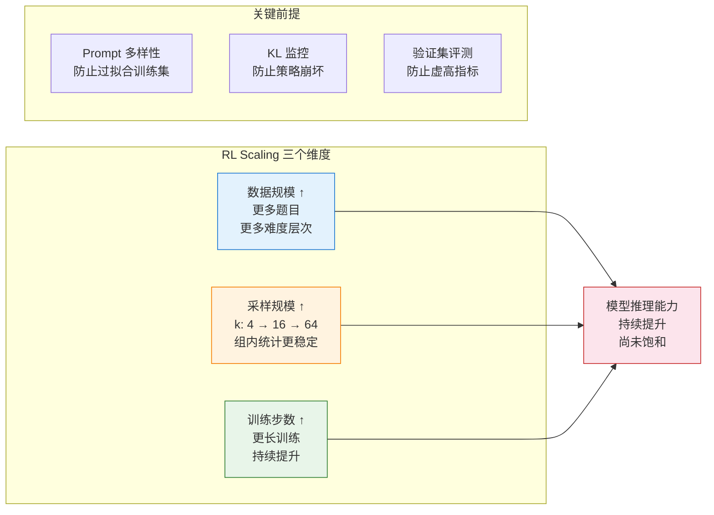
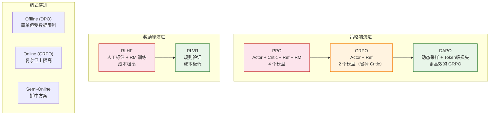

# 8.4 RL Scaling 与未来展望——RL 训练的天花板在哪？

前面三节我们追踪了 RL 训练从 PPO 到 GRPO 再到 DAPO/RLVR 的演进路线。策略端省掉了 Critic，奖励端省掉了 RM，训练成本一步步降低。但一个更根本的问题还没有回答：**RL 训练的收益有没有天花板？投入更多算力还能继续提升吗？**

2025 年最令人兴奋的发现之一就是：**RL 训练的收益尚未饱和**。继续加大 RL 训练规模，模型的推理能力还在持续提升。这一节我们从三个维度讨论 RL 的未来：训练范式的选择（Online vs Offline）、RL Scaling 的三个方向、以及 Test-time Scaling 与过程奖励模型。

## 三种训练范式对比

在学完 DPO（Offline）和 GRPO/DAPO（Online）之后，一个自然的实践问题是：**该选哪种范式？**

|                | Offline (DPO)        | Online (PPO/GRPO)        | Semi-Online           |
| -------------- | -------------------- | ------------------------ | --------------------- |
| **数据来源**   | 固定的离线偏好数据集 | 当前模型实时生成         | 离线数据 + 周期性更新 |
| **探索能力**   | 无（被数据集限制）   | 有（模型自己探索新策略） | 部分                  |
| **理论上限**   | 受数据质量限制       | 理论上更高               | 折中                  |
| **工程复杂度** | 低（标准监督学习）   | 高（在线采样循环）       | 中等                  |
| **显存需求**   | 低                   | 高                       | 中等                  |
| **代表方法**   | DPO, KTO, SimPO, IPO | PPO, GRPO, DAPO          | Iterative DPO, RLOO   |
| **类比**       | 看录像学开车         | 边开车边学               | 看录像 + 偶尔上路练   |

### 实践建议

一个经过大量实践验证的工作流是这样的：

1. **第一步：DPO 快速验证**。先用 DPO 验证数据质量和模型基线。DPO 最简单、最快，如果 DPO 都训不好，说明数据有问题，上 PPO/GRPO 也救不回来。
2. **第二步：GRPO 提升上限**。在 DPO 验证通过后，切换到 GRPO 做在线优化。GRPO 的在线探索能力可以突破 DPO 的数据限制。
3. **第三步：DAPO 精细调优**。如果算力充足，用 DAPO 的动态采样和 Token 级损失进一步提升效率。

```python
# ==========================================
# 三种范式的典型训练代码对比（伪代码）
# ==========================================

# ---- Offline (DPO) ----
# 特点：最简单，只需要偏好数据集
# dpo_trainer = DPOTrainer(model, ref_model, dataset=preference_pairs)
# dpo_trainer.train()

# ---- Online (GRPO) ----
# 特点：在线采样，不需要 Critic
# grpo_trainer = GRPOTrainer(model, reward_fn=rule_based_reward, k=8)
# grpo_trainer.train()

# ---- Semi-Online (Iterative DPO) ----
# 特点：周期性地用当前模型生成新数据，再用 DPO 训练
# for iteration in range(num_iterations):
#     new_data = model.generate_and_label(prompts)  # 生成 + 标注
#     dpo_trainer.train_on(new_data)                 # DPO 训练
#     model = dpo_trainer.get_updated_model()        # 更新模型

print("训练范式选择决策树：")
print("  数据质量不确定？ → DPO 先验证")
print("  DPO 验证通过？ → GRPO 提升上限")
print("  算力有限？ → Iterative DPO（半在线）")
print("  追求极致？ → DAPO（动态采样 + Token级损失）")
```

## RLMT：把"思考"从数学搬到通用聊天

前面讨论的三种范式（DPO/GRPO/DAPO）和本章的 RLVR 都聚焦在一个问题：**如何让模型在数学和代码上推理更强**。但一个自然的追问是——这种"先思考再回答"的能力，能不能也用到通用聊天、创意写作等开放场景？

2025 年的一篇论文 "Language Models that Think, Chat Better" 给出了肯定的答案，提出了 **RLMT（Reinforcement Learning with Model-rewarded Thinking）**。

### 现有方法的两难

| 方法 | 思考链 | 奖励来源             | 适用领域     | 短板                 |
| ---- | ------ | -------------------- | ------------ | -------------------- |
| RLHF | 无     | 人类偏好奖励模型     | 通用聊天     | 不思考，深度不够     |
| RLVR | 有     | 规则/标准答案        | 数学/代码    | 无法泛化到开放聊天   |
| RLMT | **有** | **人类偏好奖励模型** | **通用聊天** | 奖励模型质量至关重要 |

RLHF 让模型直接输出答案，缺乏深度推理；RLVR 强制模型写长思维链，但奖励信号（答案对错）只适用于有标准答案的场景。RLMT 的核心洞察是：**保留 RLVR 的"先思考再回答"结构，但用 RLHF 的偏好奖励模型来打分**——这样思考链就能服务于通用聊天。

### RLMT 的训练方式

RLMT 有两条路线，类似 DeepSeek-R1 的 SFT 路线和 Zero 路线：

**路线一：SFT 预热 + RLMT**

1. 先用 Gemini/GPT-4 生成"思考过程 + 最终回答"数据做监督微调，教模型"思考链长什么样"
2. 再用 GRPO 在线强化学习优化，奖励信号来自偏好奖励模型

**路线二：RLMT-Zero（直接从基座模型练）**

不经过任何 SFT，直接对基座模型做 RLMT 训练。结果令人惊讶：

- 只用 **7K 真实对话 prompts**
- Llama-3.1-8B 基座 + RLMT-Zero
- 效果**超过**用 2500 万样本多阶段训练的 Llama-3.1-8B-Instruct

这说明"先思考再回答"的能力不需要 SFT 教——RL 训练本身就能涌现出来，和 DeepSeek-R1 的发现一脉相承。

### 效果：会思考的小模型 > 不会思考的大模型

在 Llama-3.1-8B 和 Qwen-2.5-7B 上全面验证：

- **聊天基准**（AlpacaEval2 / WildBench / ArenaHardV2）平均提升 3–7 分
- **创意写作、常识、指令跟随**稳定涨 1–3 分
- Llama-3.1-8B-Instruct + RLMT 在聊天和创意写作上**超过 GPT-4o**，接近 Claude 3.7 Sonnet
- 明显优于 10 倍大的 Llama-3.1-70B、Qwen2.5-72B

这个结果再次验证了一个关键发现：**RL 训练带来的"思考能力"可以弥补模型规模的差距**。

### 模型学到了什么样的"思考"

论文分析了 RLMT 训练前后模型的思维模式变化：

| 阶段      | 思维特征                            | 类比                     |
| --------- | ----------------------------------- | ------------------------ |
| SFT 阶段  | 线性列清单、分点、死板规划          | 按模板填表的办事员       |
| RLMT 之后 | 梳理约束→归纳分组→权衡视角→迭代修改 | 有经验的顾问在白板前推演 |

同时，模型会自动增长思考链和回答长度——不是人为设定的，而是 RL 优化过程中自然涌现的：更长的思考 → 更好的回答 → 更高的奖励。

### RLMT 的实践要点

```python
# ==========================================
# RLMT vs RLVR 的关键区别（伪代码）
# ==========================================

# ---- RLVR（本章已学）----
# 奖励 = 答案是否正确（规则验证）
# def rlvr_reward(response, question):
#     answer = extract_answer(response)
#     return 1.0 if answer == ground_truth else 0.0

# ---- RLMT（本节新内容）----
# 奖励 = 偏好奖励模型打分（通用聊天质量）
# def rlmt_reward(response, question):
#     # response 包含 <think思考过程</think + 最终回答
#     return preference_reward_model(question, response)

# 关键差异：
# 1. RLMT 的 response 结构 = <think思考</think + 回答
# 2. 奖励信号来自偏好 RM，而非规则验证
# 3. 训练 prompts 必须贴近真实用户聊天，数学题太多反而变差

print("RLMT 实践要点：")
print("  奖励模型质量至关重要——弱 RM 会毁掉效果")
print("  训练 prompts 必须贴近真实用户聊天场景")
print("  GRPO 明显优于 PPO、DPO，最适合思考式训练")
print("  基座模型可直接用 RLMT 对齐，颠覆传统三阶段训练")
```

### RLMT 与前面章节的联系

RLMT 站在第 8 章 RLVR 和第 7 章 RLHF 的交叉点上：

| 概念来源                | 在 RLMT 中的角色             |
| ----------------------- | ---------------------------- |
| RLVR 的长思考链（Ch8）  | 保留"先思考再回答"的输出结构 |
| RLHF 的偏好奖励（Ch7）  | 用偏好 RM 替代规则验证       |
| GRPO 的组内比较（Ch8）  | RLMT 最有效的在线训练方法    |
| DeepSeek-R1-Zero（Ch8） | RLMT-Zero 的直接灵感来源     |

RLMT 的意义在于：**它证明了"思考"不只是数学推理的专利，通用聊天同样受益于深度思考**。这打开了 RL 训练的一个新方向——不是让模型只在数学上思考，而是让它在所有场景下都"先想清楚再开口"。

<details>
<summary>思考题：为什么 RLVR 的思考链无法直接迁移到通用聊天，而 RLMT 可以？</summary>

核心差异在于**奖励信号的匹配**。RLVR 的思考链是在"答案对错"这个奖励信号下训练出来的——模型学会了"思考如何得到正确答案"。但通用聊天没有标准答案，"对错"奖励信号不存在，所以这套思考策略失效。

RLMT 的关键是把奖励信号换成偏好奖励模型。偏好 RM 能判断"这个回答好不好"（有用、无害、诚实），而不仅仅是"答案对不对"。在这个奖励信号下训练出来的思考链，自然就适用于通用场景——模型学会了"思考如何写出更好的回答"，而不是"思考如何算对答案"。

这也解释了为什么奖励模型质量至关重要：如果偏好 RM 本身判断力差，那在它指导下训练出来的思考链也会走偏。

</details>

## RL Scaling：用更多算力换更强推理

2025 年最令人兴奋的发现之一：**RL 训练的收益尚未饱和**。DeepSeek-R1 的实验表明，在数学推理上，RL 训练的 scaling 曲线比 SFT 更陡峭。继续增加训练步数，模型的 pass@1 持续提升，尚未观察到明确饱和。

### RL Scaling 的三个维度

| 维度         | 含义                               | 实践方法                  | 关键发现                       |
| ------------ | ---------------------------------- | ------------------------- | ------------------------------ |
| **数据规模** | 更多不同难度的训练 prompt          | 自动生成 + 筛选高质量题目 | 多样性比数量更重要             |
| **采样规模** | 每个 prompt 采样更多回答（k 增大） | k 从 4 增加到 16 甚至 64  | 组内比较更稳定，但边际收益递减 |
| **训练步数** | 更长时间的 RL 训练                 | 监控 KL 散度和评测指标    | Pass@1 持续提升，尚未饱和      |



关键前提是：需要足够多样化的 prompt 数据。如果训练数据的类型太单一，模型会过拟合到训练集上——训练集上的分数很高，但换一批题就不行了。DeepSeek-R1 的解决方案是用自动化方法生成和筛选训练题目，确保覆盖不同难度和不同类型。

### Agentic RL 的 Scaling Law

上面三个维度关注的是标准 RL 的 scaling。当 RL 进入 Agentic 场景（第 9 章会详细讨论），scaling 有了新的表现形式。ZeroTIR 方法让模型在**没有监督示例**的情况下自发学会生成和执行代码来辅助推理，并发现了一个可预测的关系：训练步数与代码执行频率、最终准确率之间存在**幂律关系**。这意味着你可以在训练早期就预测最终表现——如果训练了 100 步后代码执行频率还在上升，说明模型还在持续学习；如果频率趋于平稳，说明学习接近饱和。这个发现给了实践者一个**免费的训练进度指示器**：只需监控代码执行频率，就能判断"该不该继续训"。ZeroTIR 被 NeurIPS 2025 收录，我们在第 9 章的 Code Agent 部分会更详细地讨论它。

## Test-time Scaling：推理时也消耗更多算力

与 RL Scaling（训练时投入更多算力）互补的另一条路线：**推理时也让模型"多想一想"**。

标准推理是"Prompt → 模型直接输出答案"。Test-time Scaling 的思路是"Prompt → 生成多个候选 → 验证/投票/搜索 → 选最佳"。

| 方法                       | 原理                             | 额外成本         | 适用场景                |
| -------------------------- | -------------------------------- | ---------------- | ----------------------- |
| **Best-of-N 采样**         | 生成 N 个回答，选 reward 最高的  | 线性增长 N 倍    | 简单直接，通用          |
| **多数投票**               | 生成 N 个回答，选出现最多的答案  | 线性增长 N 倍    | 数学/代码（有确定答案） |
| **MCTS / Tree of Thought** | 在推理空间做树搜索，回溯错误分支 | 指数级（需剪枝） | 复杂推理任务            |
| **Verifier-guided**        | 用验证器在推理过程中动态剪枝     | 中等             | 代码/数学               |

### RL 与 Test-time Scaling 的关系

一个开放的前沿争议是：**RLVR 是否只是提升了 test-time 的搜索效率，而非注入了真正的推理能力？**

- 支持方认为：RL 训练后的模型在相同采样预算下表现更好，说明 RL 确实改变了模型的内部策略，而不仅仅是搜索效率。
- 质疑方认为：未经过 RL 训练的基础模型，如果给予足够多的采样次数（N 趋于无穷），理论上也能达到类似效果——RL 只是让模型"更高效地搜索"。
- 现实是：实践中 RL 训练带来的效率提升是巨大的——让模型在少量采样时就能输出高质量回答。即使 RL 的本质是"提升搜索效率"，这种效率提升在工程上也是极其有价值的。

## PRM vs ORM：过程监督与结果监督

在推理场景中，信用分配问题有一个具体的体现：**是只看最终结果（答案对不对），还是评估每一步推理（中间步骤对不对）？** 这就是 PRM（Process Reward Model）和 ORM（Outcome Reward Model）的区分。

### ORM（Outcome Reward Model）

ORM 只看最终结果：答案对了就给正奖励，错了就给零。它的优点是标注简单——只需要知道最终答案是否正确。缺点是信号稀疏——7 步推理中只有最后一步有反馈，中间步骤的对错无从得知。

### PRM（Process Reward Model）

PRM 对每一步推理都评估：第一步对不对？第二步对不对？...每一步都有反馈。优点是学习信号密集，能精确指导每一步的改进方向。缺点是标注成本极高——需要人类专家逐步判断每步推理是否正确。

### PRM 的实际效果

| 方法     | GSM8K 准确率 | MATH 准确率 | 标注成本 |
| -------- | ------------ | ----------- | -------- |
| 仅 ORM   | ~82%         | ~40%        | 低       |
| 仅 PRM   | ~85%         | ~45%        | 极高     |
| ORM + RL | ~88%         | ~50%        | 低       |
| PRM + RL | ~90%         | ~55%        | 极高     |

PRM 的提升是实打实的（在 MATH 上比 ORM 高 5 个百分点），但成本也是实打实的。OpenAI 的 PRM800K 数据集需要数学专家对每一步推理进行标注，这种成本不是每个团队都能承受的。

### 自动化 PRM 的探索

由于人工逐步标注太贵，研究者开始探索自动化的过程监督：

```python
# ==========================================
# 自动 PRM：用蒙特卡洛采样估计每步正确概率
# ==========================================
def auto_prm(model, prompt, reasoning_steps, num_samples=32):
    """
    用蒙特卡洛采样估计每个推理步骤的正确概率

    思路：从第 i 步开始，重新采样后续推理 N 次
    看最终答案正确的比例 → 就是第 i 步的"质量分数"
    """
    step_scores = []

    for i in range(len(reasoning_steps)):
        # 保留前 i 步，重新生成后续步骤
        correct_count = 0
        for _ in range(num_samples):
            # 从第 i 步开始重新采样
            new_completion = model.generate(
                prompt + reasoning_steps[:i+1],
                temperature=0.7  # 高温采样，增加多样性
            )
            # 检查最终答案是否正确
            if check_answer_correct(new_completion):
                correct_count += 1

        # 第 i 步的质量分数 = 从这里开始能答对的概率
        step_scores.append(correct_count / num_samples)

    return step_scores

# 示例输出
# reasoning_steps = ["设 x = 小明的苹果数", "x = 15 - 3 - 5", "x = 7"]
# step_scores = [0.85, 0.90, 1.00]
# 第一步就有 85% 的概率最终答对，说明这是一个好的开头
```

自动化 PRM 的核心思路是：**不需要人类标注每一步，用蒙特卡洛采样自动估计每步的"正确概率"**。从第 $i$ 步开始重新采样 $N$ 次后续推理，看最终答案正确的比例——这就是第 $i$ 步的"质量分数"。这种方法的成本是计算量（每步需要 $N$ 次采样），但不依赖人工标注，可扩展性更好。

## 本节总结

第 8 章我们走完了一条完整的 RL 训练演进路线：



三个核心维度可以独立选择、灵活组合：

- **策略端**：PPO → GRPO → DAPO（逐步简化）
- **奖励端**：RLHF → RLVR（逐步自动化）
- **范式选择**：Offline → Online → Semi-Online（根据场景权衡）

RL 训练的未来有两个清晰的方向：**RL Scaling**（训练时投入更多算力）和 **Test-time Scaling**（推理时投入更多算力）。两者互补，共同推动模型推理能力的提升。而 PRM 与自动化过程监督的发展，有望在未来提供更精细的训练信号，进一步加速 RL 训练的效率。

<details>
<summary>思考题：RL Scaling 和 Test-time Scaling 应该优先投入哪个方向？</summary>

这取决于你的应用场景和资源约束：

- **如果推理成本是瓶颈**（比如面向百万用户的在线服务），优先投入 RL Scaling——训练一个更强的模型，让它在单次推理时就能给出高质量回答，不需要多次采样。训练成本虽然高，但一次性投入；推理成本是持续性的，省下来的钱远超训练投入。

- **如果回答质量是瓶颈**（比如数学竞赛、代码比赛，不在乎推理时间），优先投入 Test-time Scaling——用 Best-of-N 或 MCTS 让模型"多想一想"，在推理时消耗更多算力换取更好的结果。

- **如果两者都不是瓶颈**（比如内部研究、小规模部署），两者都投入少量即可。RL Scaling 的"数据多样化"是最稳妥的投资方向——更多样的训练数据几乎总是有益的。

值得注意的是，这两个方向不是互斥的。最先进的系统（如 DeepSeek-R1）同时使用了 RL Scaling（大规模 GRPO 训练）和 Test-time Scaling（推理时的 Best-of-N 采样），两者叠加的效果远超单独使用。

</details>

到这里，RL Scaling 的三个方向已经讲完。但还有一个重要的后训练路线没有讨论——**知识蒸馏**：用 Teacher 模型的 log-prob 当训练信号，在 1/10 的算力下达到和 RL 相当的效果。让我们进入下一节——[知识蒸馏与在线策略蒸馏](./on-policy-distillation)。
