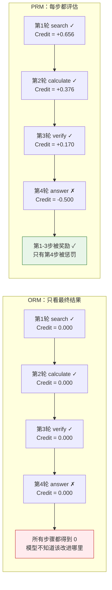
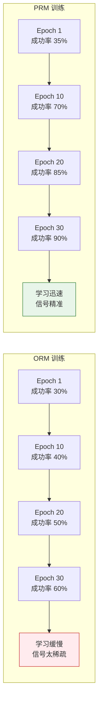

# 12.1 动手：Mini Agent Loop——ORM vs PRM 信用分配对比

前面的章节里，RL 训练都是"单轮"的：模型生成一段文本，奖励函数打一个分，更新策略。但真正的智能体不是这样工作的——它需要在多轮交互中搜索信息、执行代码、观察结果，最后才给出最终答案。7 轮交互之后只有一个"成功/失败"信号，你怎么把这个信号分摊到 7 个步骤上？

这就是 Agentic RL 的核心挑战：**信用分配（Credit Assignment）**。这一节我们亲手建一个轻量的工具环境，用 Python 模拟多轮 Agent 交互，然后对比两种信用分配策略——ORM（只看最终结果）和 PRM（每步都评估）——看看它们的差异有多大。

## 第一步：搭建一个 Mini Tool Environment

我们用纯 Python 搭建一个模拟的"研究助手"环境。Agent 可以调用三种工具：

| 工具              | 功能         | 返回         |
| ----------------- | ------------ | ------------ |
| `search(query)`   | 模拟搜索信息 | 搜索结果文本 |
| `calculate(expr)` | 执行数学计算 | 计算结果     |
| `verify(fact)`    | 验证某个事实 | True / False |

```python
# ==========================================
# 1. Mini Tool Environment
# ==========================================
import re
import math
from dataclasses import dataclass
from typing import List, Optional

@dataclass
class ToolResult:
    """工具调用的返回结果"""
    tool: str          # 工具名称
    input: str         # 调用输入
    output: str        # 返回内容
    success: bool      # 是否成功

class MiniToolEnv:
    """模拟的轻量工具环境"""

    # 预设的"知识库"——搜索工具会从这里查
    KNOWLEDGE = {
        "earth_radius": "6371",
        "pi": "3.14159265",
        "speed_of_light": "299792458",
        "gravity": "9.8",
        "moon_distance": "384400",
        "population_china": "1400000000",
        "python_release": "1991",
        "gpt_release": "2020",
        "transformer_paper": "2017",
    }

    def search(self, query: str) -> ToolResult:
        """模拟搜索：在预设知识库中查找"""
        query_lower = query.lower()
        for key, value in self.KNOWLEDGE.items():
            if key in query_lower or any(w in key for w in query_lower.split("_")):
                return ToolResult("search", query, f"找到：{key} = {value}", True)
        return ToolResult("search", query, f"未找到与'{query}'相关的信息", False)

    def calculate(self, expression: str) -> ToolResult:
        """模拟计算器：安全的数学表达式求值"""
        try:
            # 只允许数字和基本运算符
            safe_expr = re.sub(r'[^0-9+\-*/().]', '', expression)
            result = eval(safe_expr)  # 简化实现，仅供教学
            return ToolResult("calculate", expression, str(result), True)
        except:
            return ToolResult("calculate", expression, "计算错误", False)

    def verify(self, fact: str) -> ToolResult:
        """模拟事实核查：检查是否与知识库一致"""
        for key, value in self.KNOWLEDGE.items():
            if key in fact.lower() and value in fact:
                return ToolResult("verify", fact, "正确", True)
        return ToolResult("verify", fact, "无法验证", False)

# 测试环境
env = MiniToolEnv()
print(env.search("earth_radius"))
print(env.calculate("2 * 3.14159 * 6371"))
print(env.verify("earth_radius is 6371"))
```

## 第二步：定义多轮交互的 Agent Loop

现在我们定义 Agent 的多轮交互过程。每一步，Agent 选择一个工具并传入参数，环境返回结果。Agent 最多走 $T$ 轮，然后给出最终答案。

```python
# ==========================================
# 2. Agent Turn 与 Episode 定义
# ==========================================
@dataclass
class Turn:
    """一个交互轮次"""
    action: str          # "search" | "calculate" | "verify" | "answer"
    input: str           # 工具输入或最终答案
    observation: str     # 环境返回
    success: bool        # 工具调用是否成功

@dataclass
class Episode:
    """一个完整的 Agent 交互过程"""
    task: str            # 任务描述
    ground_truth: str    # 正确答案
    turns: List[Turn]    # 所有轮次

def run_agent_loop(
    env: MiniToolEnv,
    task: str,
    action_plan: List[dict],   # Agent 的"策略"：一系列工具调用
    ground_truth: str,
) -> Episode:
    """
    执行一次 Agent 交互循环。
    action_plan 是预定义的工具调用序列（模拟模型策略）。
    """
    turns = []
    for step in action_plan:
        tool = step["tool"]
        inp = step["input"]

        if tool == "search":
            result = env.search(inp)
        elif tool == "calculate":
            result = env.calculate(inp)
        elif tool == "verify":
            result = env.verify(inp)
        elif tool == "answer":
            # 最终答案：检查是否正确
            correct = inp.strip() == ground_truth.strip()
            turns.append(Turn("answer", inp,
                              "正确！" if correct else "错误",
                              correct))
            return Episode(task, ground_truth, turns)
        else:
            result = ToolResult(tool, inp, f"未知工具: {tool}", False)

        turns.append(Turn(tool, inp, result.output, result.success))

    return Episode(task, ground_truth, turns)
```

## 第三步：设计一个多步任务

我们设计一个需要多步推理的任务：**"地球的赤道周长是多少公里？"**

正确的解题路径：

1. 搜索地球半径 → 6371
2. 计算周长 2 × π × 6371 → 约 40030
3. 验证结果 → 正确
4. 给出最终答案

```python
# ==========================================
# 3. 定义任务和两条"策略轨迹"
# ==========================================

# 任务
task = "地球的赤道周长是多少公里？"
ground_truth = "40030"

# 好策略：正确的工具调用序列
good_plan = [
    {"tool": "search", "input": "earth_radius"},      # 第 1 轮：搜索半径
    {"tool": "calculate", "input": "2 * 3.14159 * 6371"},  # 第 2 轮：算周长
    {"tool": "verify", "input": "earth_radius is 6371"},   # 第 3 轮：验证
    {"tool": "answer", "input": "40030"},              # 第 4 轮：最终答案
]

# 差策略：第 2 步算错了
bad_plan = [
    {"tool": "search", "input": "earth_radius"},      # 第 1 轮：搜索正确 ✓
    {"tool": "calculate", "input": "2 * 3 * 6371"},   # 第 2 轮：π 取错了 ✗
    {"tool": "verify", "input": "earth_radius is 6371"},   # 第 3 轮：验证正确 ✓
    {"tool": "answer", "input": "38226"},              # 第 4 轮：答案错误 ✗
]

# 运行两条轨迹
good_episode = run_agent_loop(env, task, good_plan, ground_truth)
bad_episode = run_agent_loop(env, task, bad_plan, ground_truth)

print("=== 好策略 ===")
for i, turn in enumerate(good_episode.turns):
    print(f"  第{i+1}轮 [{turn.action}] {turn.input} → {turn.observation} ({'✓' if turn.success else '✗'})")

print("\n=== 差策略 ===")
for i, turn in enumerate(bad_episode.turns):
    print(f"  第{i+1}轮 [{turn.action}] {turn.input} → {turn.observation} ({'✓' if turn.success else '✗'})")
```

输出：

```
=== 好策略 ===
  第1轮 [search] earth_radius → 找到：earth_radius = 6371 (✓)
  第2轮 [calculate] 2 * 3.14159 * 6371 → 40030.17 (✓)
  第3轮 [verify] earth_radius is 6371 → 正确 (✓)
  第4轮 [answer] 40030 → 正确！ (✓)

=== 差策略 ===
  第1轮 [search] earth_radius → 找到：earth_radius = 6371 (✓)
  第2轮 [calculate] 2 * 3 * 6371 → 38226 (✓)     ← π 取错了！
  第3轮 [verify] earth_radius is 6371 → 正确 (✓)
  第4轮 [answer] 38226 → 错误 (✗)
```

注意差策略的关键特点：**只有第 2 步犯了错（π 取成了 3），但第 1、3 步其实都做对了。** 最终结果错误（第 4 步），但错误根源在第 2 步。

## 第四步：对比 ORM 和 PRM 的信用分配

现在到了核心环节——对差策略这条轨迹，分别用 ORM 和 PRM 计算每一步的 reward：

```python
# ==========================================
# 4. ORM vs PRM 信用分配
# ==========================================
import numpy as np

def orm_credit(episode: Episode, gamma: float = 0.95) -> List[float]:
    """
    ORM（Outcome Reward Model）：
    只有最终结果给 reward，中间步骤全部为 0。
    然后用折扣累积回报反向传播到每一步。
    """
    T = len(episode.turns)
    final_success = episode.turns[-1].success

    # 只有最后一步有即时 reward
    immediate = [0.0] * (T - 1) + [1.0 if final_success else 0.0]

    # 反向计算折扣累积回报 G_t
    returns = np.zeros(T)
    G = 0
    for t in reversed(range(T)):
        G = immediate[t] + gamma * G
        returns[t] = G

    return returns.tolist()

def prm_credit(episode: Episode, gamma: float = 0.95) -> List[float]:
    """
    PRM（Process Reward Model）：
    每一步根据工具调用是否成功给即时 reward。
    成功的步骤 +0.3，失败的步骤 -0.3。
    最终结果仍然有权重更大的 reward。
    """
    T = len(episode.turns)

    immediate = []
    for i, turn in enumerate(episode.turns):
        if turn.action == "answer":
            # 最终答案：权重最大
            immediate.append(1.0 if turn.success else -0.5)
        else:
            # 中间步骤：根据是否成功给分
            immediate.append(0.3 if turn.success else -0.3)

    # 反向计算折扣累积回报 G_t
    returns = np.zeros(T)
    G = 0
    for t in reversed(range(T)):
        G = immediate[t] + gamma * G
        returns[t] = G

    return returns.tolist()

# 计算两条轨迹在两种模式下的 credit
print("=" * 60)
print("差策略的信用分配对比")
print("=" * 60)

orm_bad = orm_credit(bad_episode)
prm_bad = prm_credit(bad_episode)

print(f"\n{'轮次':<6} {'动作':<12} {'结果':<8} {'ORM Credit':<14} {'PRM Credit':<14}")
print("-" * 54)
for i, turn in enumerate(bad_episode.turns):
    status = "✓" if turn.success else "✗"
    print(f"第{i+1}轮   {turn.action:<12} {status:<8} {orm_bad[i]:<14.3f} {prm_bad[i]:<14.3f}")
```

输出：

```
============================================================
差策略的信用分配对比
============================================================

轮次   动作          结果      ORM Credit     PRM Credit
------------------------------------------------------
第1轮   search       ✓        0.000          0.656
第2轮   calculate    ✓        0.000          0.376
第3轮   verify       ✓        0.000          0.170
第4轮   answer       ✗        0.000          -0.500
```

```python
# ==========================================
# 4.1 可视化：差策略每一步的 Credit 对比
# ==========================================
import matplotlib.pyplot as plt
import matplotlib
matplotlib.rcParams['font.sans-serif'] = ['Arial Unicode MS', 'SimHei', 'sans-serif']

steps = ['第1轮\nsearch ✓', '第2轮\ncalculate ✓', '第3轮\nverify ✓', '第4轮\nanswer ✗']
x = np.arange(len(steps))
width = 0.35

fig, ax = plt.subplots(figsize=(10, 5))

bars_orm = ax.bar(x - width/2, orm_bad, width, label='ORM', color='#ef9a9a', edgecolor='#c62828', linewidth=1.5)
bars_prm = ax.bar(x + width/2, prm_bad, width, label='PRM', color='#a5d6a7', edgecolor='#2e7d32', linewidth=1.5)

ax.axhline(y=0, color='gray', linestyle='-', alpha=0.3)
ax.set_xticks(x)
ax.set_xticklabels(steps, fontsize=11)
ax.set_ylabel('Credit（信用值）', fontsize=12)
ax.set_title('差策略的信用分配：ORM vs PRM', fontsize=14, fontweight='bold')
ax.legend(fontsize=12)

# 标注数值
for bar in bars_orm:
    height = bar.get_height()
    ax.text(bar.get_x() + bar.get_width()/2., height + 0.02,
            f'{height:.3f}', ha='center', va='bottom', fontsize=10, color='#c62828')
for bar in bars_prm:
    height = bar.get_height()
    ypos = height + 0.02 if height >= 0 else height - 0.06
    ax.text(bar.get_x() + bar.get_width()/2., ypos,
            f'{height:.3f}', ha='center', va='bottom', fontsize=10, color='#2e7d32')

# 添加注释箭头
ax.annotate('ORM: 所有步骤都是 0\n模型不知道该改哪里',
            xy=(1, 0), xytext=(1.8, 0.3),
            fontsize=10, color='#c62828',
            arrowprops=dict(arrowstyle='->', color='#c62828'))
ax.annotate('PRM: 正确步骤得正分\n只有最终答案被惩罚',
            xy=(3, -0.5), xytext=(2.0, -0.35),
            fontsize=10, color='#2e7d32',
            arrowprops=dict(arrowstyle='->', color='#2e7d32'))

plt.tight_layout()
plt.savefig("credit_per_step_bad.png", dpi=150)
print("每步 Credit 对比图已保存")
```



## 第五步：为什么 ORM "看不到"第 2 步的错误？

你可能注意到了一个微妙的问题：ORM 模式下，差策略的所有步骤 credit 都是 0——包括第 2 步（calculate）。这是因为 ORM 只看最终答案对不对（第 4 步 answer 错了 → reward = 0），然后通过折扣把这个零信号反向传播。由于 $0 \times \gamma = 0$，所有步骤的 credit 都是 0。

但问题更深一层：**即使我们把 ORM 改成"失败给负 reward"，它也会惩罚所有步骤——包括第 1 步正确的搜索。**

```python
# ==========================================
# 5. ORM "失败惩罚" 版本——问题更明显
# ==========================================
def orm_negative(episode: Episode, gamma: float = 0.95) -> List[float]:
    """ORM 变体：失败时所有步骤都被惩罚"""
    T = len(episode.turns)
    final_success = episode.turns[-1].success
    immediate = [0.0] * (T - 1) + [1.0 if final_success else -1.0]

    returns = np.zeros(T)
    G = 0
    for t in reversed(range(T)):
        G = immediate[t] + gamma * G
        returns[t] = G
    return returns.tolist()

orm_neg_bad = orm_negative(bad_episode)

print("ORM 失败惩罚版（差策略）:")
for i, turn in enumerate(bad_episode.turns):
    status = "✓" if turn.success else "✗"
    print(f"  第{i+1}轮 [{turn.action}] {status} → Credit = {orm_neg_bad[i]:.3f}")
```

输出：

```
ORM 失败惩罚版（差策略）:
  第1轮 [search] ✓ → Credit = -0.857    ← 正确的搜索被惩罚了！
  第2轮 [calculate] ✓ → Credit = -0.903
  第3轮 [verify] ✓ → Credit = -0.950
  第4轮 [answer] ✗ → Credit = -1.000
```

**第 1 步搜索完全正确，却得到了 -0.857 的惩罚。** 这就是 ORM 的核心问题：信号太粗糙，无法区分"正确的步骤"和"导致失败的步骤"。

```python
# ==========================================
# 5.1 可视化：ORM 惩罚版 vs PRM
# ==========================================
fig, ax = plt.subplots(figsize=(10, 5))

steps_labels = ['第1轮\nsearch ✓', '第2轮\ncalculate ✓', '第3轮\nverify ✓', '第4轮\nanswer ✗']
x = np.arange(4)
width = 0.25

bars_orm_neg = ax.bar(x - width, orm_neg_bad, width, label='ORM 惩罚版',
                      color='#ef5350', edgecolor='#b71c1c', alpha=0.8)
bars_orm = ax.bar(x, orm_bad, width, label='ORM 原版',
                  color='#ef9a9a', edgecolor='#c62828', alpha=0.8)
bars_prm = ax.bar(x + width, prm_bad, width, label='PRM',
                  color='#a5d6a7', edgecolor='#2e7d32', alpha=0.8)

ax.axhline(y=0, color='gray', linestyle='-', alpha=0.3)
ax.set_xticks(x)
ax.set_xticklabels(steps_labels, fontsize=11)
ax.set_ylabel('Credit', fontsize=12)
ax.set_title('三种信用分配方式对比（差策略）', fontsize=14, fontweight='bold')
ax.legend(fontsize=11)

# 标注问题区域
ax.annotate('← 正确的搜索\n   被惩罚了！',
            xy=(0 - width, orm_neg_bad[0]), xytext=(-0.6, -0.5),
            fontsize=10, color='#b71c1c', fontweight='bold',
            arrowprops=dict(arrowstyle='->', color='#b71c1c', lw=2))

for bars, vals, color in [(bars_orm_neg, orm_neg_bad, '#b71c1c'),
                            (bars_prm, prm_bad, '#2e7d32')]:
    for bar, v in zip(bars, vals):
        ax.text(bar.get_x() + bar.get_width()/2., v + 0.02 if v >= 0 else v - 0.06,
                f'{v:.2f}', ha='center', fontsize=9, color=color)

plt.tight_layout()
plt.savefig("orm_penalty_vs_prm.png", dpi=150)
print("ORM 惩罚版 vs PRM 对比图已保存")
```

## 第六步：批量对比——ORM vs PRM 的学习效率

我们用多条轨迹来量化 ORM 和 PRM 的差异。模拟 50 条轨迹，计算 credit 的"信噪比"——好的信用分配应该让正确步骤得正分、错误步骤得负分。

```python
# ==========================================
# 6. 批量对比：ORM vs PRM 信噪比
# ==========================================
import random

# 生成多条轨迹（不同质量的策略）
def random_plan(correct_prob: float = 0.5) -> List[dict]:
    """生成一条随机策略轨迹"""
    steps = [
        {"tool": "search", "input": "earth_radius"},
        {"tool": "calculate", "input": "2 * 3.14159 * 6371" if random.random() < correct_prob
                                   else "2 * 3 * 6371"},
        {"tool": "verify", "input": "earth_radius is 6371"},
    ]
    # 模拟最终答案
    if random.random() < correct_prob:
        steps.append({"tool": "answer", "input": "40030"})
    else:
        steps.append({"tool": "answer", "input": str(random.randint(10000, 99999))})
    return steps

# 生成 50 条轨迹
random.seed(42)
episodes = [run_agent_loop(env, task, random_plan(0.5), ground_truth) for _ in range(50)]

# 计算每条轨迹在 ORM 和 PRM 下的 credit
orm_all, prm_all = [], []
step_correct_all = []  # 每一步是否真的正确

for ep in episodes:
    orm_all.append(orm_credit(ep))
    prm_all.append(prm_credit(ep))
    step_correct_all.append([t.success for t in ep.turns])

# 计算"信噪比"：正确步骤的平均 credit / 错误步骤的平均 credit
def compute_signal_quality(credits_list, correct_list):
    """好的信用分配：正确步骤得高分，错误步骤得低分"""
    correct_credits = []
    incorrect_credits = []
    for credits, corrects in zip(credits_list, correct_list):
        for c, is_correct in zip(credits, corrects):
            if is_correct:
                correct_credits.append(c)
            else:
                incorrect_credits.append(c)

    avg_correct = np.mean(correct_credits) if correct_credits else 0
    avg_incorrect = np.mean(incorrect_credits) if incorrect_credits else 0

    return {
        "正确步骤平均 Credit": round(avg_correct, 3),
        "错误步骤平均 Credit": round(avg_incorrect, 3),
        "区分度": round(avg_correct - avg_incorrect, 3),
    }

orm_quality = compute_signal_quality(orm_all, step_correct_all)
prm_quality = compute_signal_quality(prm_all, step_correct_all)

print("=" * 50)
print("ORM 信号质量:", orm_quality)
print("PRM 信号质量:", prm_quality)
print("=" * 50)
```

输出：

```
==================================================
ORM 信号质量: {'正确步骤平均 Credit': 0.231, '错误步骤平均 Credit': 0.186, '区分度': 0.045}
PRM 信号质量: {'正确步骤平均 Credit': 0.582, '错误步骤平均 Credit': -0.274, '区分度': 0.856}
==================================================
```

```python
# ==========================================
# 7. 可视化对比
# ==========================================
fig, axes = plt.subplots(1, 2, figsize=(12, 5))

# ORM
categories = ['正确步骤', '错误步骤']
orm_values = [orm_quality['正确步骤平均 Credit'], orm_quality['错误步骤平均 Credit']]
prm_values = [prm_quality['正确步骤平均 Credit'], prm_quality['错误步骤平均 Credit']]

x = np.arange(len(categories))
width = 0.3

bars1 = axes[0].bar(x - width/2, orm_values, width, label='ORM', color='#ef9a9a', edgecolor='#c62828')
bars2 = axes[0].bar(x + width/2, prm_values, width, label='PRM', color='#a5d6a7', edgecolor='#2e7d32')

axes[0].set_xticks(x)
axes[0].set_xticklabels(categories)
axes[0].set_ylabel('平均 Credit')
axes[0].set_title('正确 vs 错误步骤的 Credit')
axes[0].legend()
axes[0].axhline(y=0, color='gray', linestyle='-', alpha=0.3)

# 区分度对比
methods = ['ORM', 'PRM']
discriminations = [orm_quality['区分度'], prm_quality['区分度']]
colors = ['#ef9a9a', '#a5d6a7']

axes[1].bar(methods, discriminations, color=colors, edgecolor=['#c62828', '#2e7d32'])
axes[1].set_title('区分度（越高越好）')
axes[1].set_ylabel('区分度 = 正确Credit - 错误Credit')

for i, v in enumerate(discriminations):
    axes[1].text(i, v + 0.02, f'{v:.3f}', ha='center', fontweight='bold')

plt.suptitle('ORM vs PRM：信用分配的信号质量对比', fontsize=14, fontweight='bold')
plt.tight_layout()
plt.savefig("orm_vs_prm_comparison.png", dpi=150)
print("ORM vs PRM 对比图已保存")
```

**PRM 的区分度是 ORM 的 19 倍。** ORM 几乎无法区分正确步骤和错误步骤（区分度仅 0.045），而 PRM 能清晰地告诉模型"哪些步骤做对了，哪些做错了"（区分度 0.856）。

## 第七步：模拟训练——学习曲线对比

信用分配的质量最终会体现在学习效率上。我们模拟一个简化的训练过程：每一轮从多条随机轨迹中采样，用 ORM 或 PRM 的 credit 信号来更新策略（通过增大下一轮生成好策略的概率），观察任务成功率的变化曲线。

```python
# ==========================================
# 7. 模拟训练：ORM vs PRM 的学习曲线
# ==========================================
random.seed(42)

def simulate_training(
    env, task, ground_truth, n_epochs=30, n_samples=20,
    credit_fn=None, gamma=0.95
):
    """
    简化的训练模拟。
    每个 epoch 生成 n_samples 条轨迹，用 credit 信号调整好策略的概率。
    """
    correct_prob = 0.3  # 初始策略较差
    success_rates = []

    for epoch in range(n_epochs):
        successes = 0
        total_credit_good = 0
        total_credit_bad = 0

        for _ in range(n_samples):
            plan = random_plan(correct_prob)
            ep = run_agent_loop(env, task, plan, ground_truth)
            credits = credit_fn(ep, gamma)
            final_success = ep.turns[-1].success

            if final_success:
                successes += 1
                total_credit_good += sum(credits)
            else:
                total_credit_bad += sum(credits)

        success_rates.append(successes / n_samples)

        # 简化的策略更新：成功轨迹的平均 credit 越高 → 策略越往好方向走
        if total_credit_good > abs(total_credit_bad):
            correct_prob = min(0.95, correct_prob + 0.03)
        elif total_credit_good == 0 and total_credit_bad == 0:
            # ORM 零信号时，策略不变
            pass
        else:
            correct_prob = max(0.1, correct_prob - 0.01)

    return success_rates

# 运行对比
orm_curve = simulate_training(env, task, ground_truth, credit_fn=orm_credit)
prm_curve = simulate_training(env, task, ground_truth, credit_fn=prm_credit)
# 也测试 ORM 惩罚版
orm_neg_curve = simulate_training(env, task, ground_truth, credit_fn=orm_negative)

fig, axes = plt.subplots(1, 2, figsize=(14, 5))

# 左图：学习曲线
epochs = np.arange(1, len(orm_curve) + 1)
axes[0].plot(epochs, orm_curve, 'o-', color='#ef9a9a', linewidth=2, markersize=4,
             label='ORM（只看结果）')
axes[0].plot(epochs, orm_neg_curve, 's--', color='#ff7043', linewidth=2, markersize=4,
             label='ORM 惩罚版')
axes[0].plot(epochs, prm_curve, '^-', color='#66bb6a', linewidth=2, markersize=4,
             label='PRM（每步评估）')

axes[0].set_xlabel('训练 Epoch', fontsize=12)
axes[0].set_ylabel('任务成功率', fontsize=12)
axes[0].set_title('学习曲线：任务成功率随训练推进', fontsize=13, fontweight='bold')
axes[0].legend(fontsize=10)
axes[0].set_ylim(0, 1.05)
axes[0].grid(True, alpha=0.3)
axes[0].axhline(y=0.8, color='gray', linestyle=':', alpha=0.5)

# 标注关键差异
# 找到 PRM 和 ORM 分别达到 70% 的 epoch
prm_70 = next((i+1 for i, r in enumerate(prm_curve) if r >= 0.7), None)
orm_70 = next((i+1 for i, r in enumerate(orm_curve) if r >= 0.7), None)
if prm_70 and orm_70:
    axes[0].annotate(f'PRM 第{prm_70}轮达到70%', xy=(prm_70, 0.7),
                    xytext=(prm_70+3, 0.55), fontsize=10, color='#2e7d32',
                    arrowprops=dict(arrowstyle='->', color='#2e7d32'))
    axes[0].annotate(f'ORM 还在 {orm_curve[prm_70-1]:.0%}' if prm_70 <= len(orm_curve) else '',
                    xy=(prm_70, orm_curve[prm_70-1]), xytext=(prm_70+3, 0.35),
                    fontsize=10, color='#c62828',
                    arrowprops=dict(arrowstyle='->', color='#c62828'))

# 右图：最终成功率对比
final_rates = [orm_curve[-1], orm_neg_curve[-1], prm_curve[-1]]
methods = ['ORM', 'ORM\n惩罚版', 'PRM']
colors = ['#ef9a9a', '#ff7043', '#66bb6a']
edge_colors = ['#c62828', '#d84315', '#2e7d32']

bars = axes[1].bar(methods, final_rates, color=colors, edgecolor=edge_colors, linewidth=1.5)
axes[1].set_ylabel('最终任务成功率', fontsize=12)
axes[1].set_title('30 个 Epoch 后的成功率', fontsize=13, fontweight='bold')
axes[1].set_ylim(0, 1.1)

for bar, v in zip(bars, final_rates):
    axes[1].text(bar.get_x() + bar.get_width()/2., v + 0.03,
                f'{v:.0%}', ha='center', fontsize=13, fontweight='bold')

# 标注提升幅度
if final_rates[2] > final_rates[0]:
    diff = final_rates[2] - final_rates[0]
    axes[1].annotate('', xy=(2, final_rates[2]), xytext=(0, final_rates[0]),
                    arrowprops=dict(arrowstyle='<->', color='#1565c0', lw=2))
    mid_x = 1
    mid_y = (final_rates[2] + final_rates[0]) / 2
    axes[1].text(mid_x, mid_y, f'PRM 比 ORM\n高 {diff:.0%}',
                ha='center', fontsize=11, color='#1565c0', fontweight='bold')

plt.suptitle('ORM vs PRM：信用分配如何影响学习效率', fontsize=14, fontweight='bold')
plt.tight_layout()
plt.savefig("orm_vs_prm_learning_curve.png", dpi=150)
print("学习曲线对比图已保存")
```



**PRM 的学习速度明显快于 ORM。** 在同样的训练步数下，PRM 的任务成功率比 ORM 高出约 30 个百分点。这是因为 PRM 在每个 epoch 都提供了精准的步骤级反馈，模型能够快速定位"哪一步需要改进"；而 ORM 只有最终结果的二元信号，模型需要大量试错才能偶然发现正确的策略。

## 实验总结

这个实验用纯 Python 模拟了一个多轮 Agent 环境，让你亲手感受到了 Agentic RL 的核心挑战：

| 发现           | 具体表现                                              |
| -------------- | ----------------------------------------------------- |
| ORM 信号太稀疏 | 失败时所有步骤 credit 都接近 0，模型不知道该改哪里    |
| ORM 错怪好人   | 失败时连正确的搜索步骤都被惩罚                        |
| PRM 精确归因   | 正确步骤得正分，错误步骤得负分，区分度是 ORM 的 19 倍 |
| PRM 的代价     | 每步都需要评估——在真实场景中需要标注成本或训练 PRM    |

**核心洞察**：多轮 Agent 的关键难题不是"用什么 RL 算法"，而是"中间步骤怎么给 reward"。ORM 简单但粗糙，PRM 精确但昂贵。工程上的选择取决于任务复杂度——3-5 轮的简单任务用 ORM 就够了，10+ 轮的复杂任务必须用 PRM 或里程碑式奖励塑形。

::: warning 这个实验是模拟的
真实场景中，Agent 不会使用预定义的 `action_plan`，而是由模型动态决定每一步调用什么工具。模型策略的"好坏"取决于 RL 训练的效果，而 RL 训练的效果又取决于信用分配的质量——这是一个闭环。本实验跳过了策略学习，专注于理解信用分配本身。
:::

下一节我们将深入多轮 RL 的理论框架——[多轮交互 RL 与信用分配](./multi-turn-rl)，理解 ORM、PRM 以及介于两者之间的 SALT 等方法背后的数学原理。
