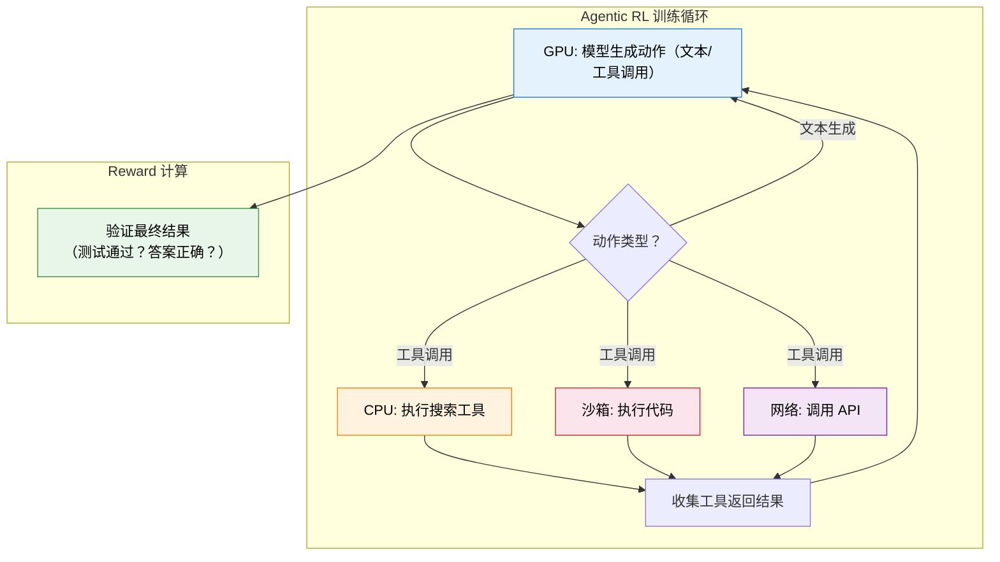
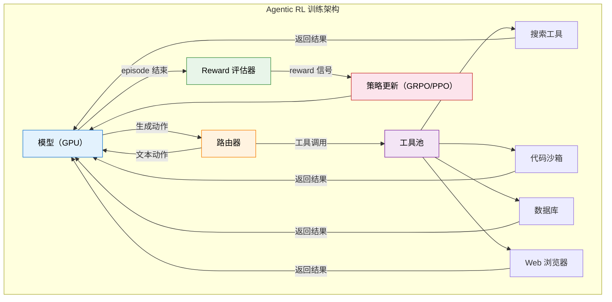

# 12.4 Agentic RL 工程实战与总结

前三节我们讲了多轮 RL 的信用分配、轨迹合成方法和工具调用的策略学习。现在我们要面对一个更"接地气"的问题：怎么把这些想法变成一个真正能跑起来的训练系统？Agentic RL 的工程复杂度远超标准 LLM RL——你不仅要管理 GPU 上的模型训练，还要管理 CPU 上的工具执行、网络上的环境交互、安全沙箱里的代码运行。这一节我们来拆解这些工程挑战，并总结整章的核心收获。

## 环境瓶颈：为什么 Agentic RL 跑不快

在标准的 LLM RL 训练中（如第 5 章的 PPO 或第 8 章的 GRPO），训练循环是纯 GPU 的：模型在 GPU 上生成回答，Reward Model 在 GPU 上打分，梯度在 GPU 上计算。整个过程中最慢的环节通常是 GPU 计算。

但 Agentic RL 的训练循环完全不同。模型每生成一个"工具调用"动作，就需要暂停等待工具执行的结果。这个执行过程发生在 GPU 之外：



这带来了三个核心瓶颈：

**安全性**。代码执行必须在沙箱中进行——模型可能生成"删除系统文件"或"读取环境变量"的恶意代码。Docker 容器是最常用的沙箱方案，但容器的创建和销毁有毫秒级的开销，在训练循环中累积起来就成了显著的瓶颈。

**可复现性**。RL 训练要求相同的输入产生相同的输出。但工具调用的结果可能是不确定的——搜索引擎对同一个 query 在不同时间可能返回不同结果，API 的响应时间可能波动。这导致同一条训练轨迹无法精确复现，增加了调试难度。

**延迟**。工具调用的响应时间从毫秒（本地代码执行）到秒级（网络 API 调用）不等。在标准 RL 训练中，GPU 的计算是连续的；但在 Agentic RL 中，GPU 经常在"等待"工具执行的结果，导致 GPU 利用率低下。

```python
import asyncio
import docker

class ToolSandbox:
    """安全的工具执行沙箱：用 Docker 容器隔离代码执行"""

    def __init__(self, image="python:3.11-slim", timeout=30):
        self.client = docker.from_client()
        self.image = image
        self.timeout = timeout

    async def execute(self, code: str) -> dict:
        """在沙箱中异步执行代码，返回结果和状态"""
        try:
            container = self.client.containers.run(
                self.image,
                command=f"python -c '{code}'",
                detach=True,
                mem_limit="512m",      # 内存限制
                cpu_period=100000,
                cpu_quota=50000,        # CPU 限制（50%）
                network_mode="none",    # 禁止网络访问
                remove=True,
            )
            result = container.wait(timeout=self.timeout)
            output = container.logs().decode("utf-8")
            return {"success": result["StatusCode"] == 0, "output": output}
        except Exception as e:
            return {"success": False, "output": str(e)}
```

## 基础设施对比：标准 LLM RL vs Agentic RL

理解了瓶颈之后，让我们对比一下两种 RL 训练基础设施的核心区别：

| 组件         | 标准 LLM RL              | Agentic RL                                    |
| ------------ | ------------------------ | --------------------------------------------- |
| Rollout 引擎 | GPU 生成文本             | GPU 生成文本 + **CPU 执行工具**（异构计算）   |
| 环境交互     | 无（纯文本生成）         | **需要工具沙箱、Web 环境、代码执行器**        |
| Reward 来源  | Reward Model 打分（GPU） | **环境执行结果**（代码通过/失败，可异步）     |
| Episode 长度 | 固定（生成 max_tokens）  | **可变**（不同任务需要不同轮数）              |
| 并行策略     | GPU 批量生成             | **异步并发**（多条轨迹同时等工具返回）        |
| 容错         | 生成失败重试             | **工具执行可能超时/崩溃**，需要 fallback 机制 |
| 可复现性     | 高（确定性生成）         | **低**（工具执行结果可能不确定）              |

这个对比揭示了一个关键洞察：**Agentic RL 的训练基础设施本质上是一个分布式系统**——它需要同时管理 GPU 计算、CPU 执行、网络通信、状态同步。这比标准 LLM RL 的"纯 GPU"训练复杂了一个数量级。

从形式化的角度来看，标准 LLM RL 的训练吞吐量主要受限于 GPU 计算时间：

$$\text{Throughput}_{\text{standard}} \propto \frac{1}{T_{\text{GPU}}}$$

而 Agentic RL 的训练吞吐量受限于 GPU 计算和工具执行的**最大值**：

$$\text{Throughput}_{\text{agentic}} \propto \frac{1}{\max(T_{\text{GPU}}, T_{\text{tool}})}$$

当工具执行时间远大于 GPU 计算时间时（$T_{\text{tool}} \gg T_{\text{GPU}}$），GPU 大部分时间在空等——这就是为什么异步并发（下面会讨论）是 Agentic RL 工程优化的关键。

## 代表性框架

### AWorld-RL：完整的 Agentic RL 环境

AWorld-RL 提供了一个完整的 Agentic RL 训练环境，包括多种工具（搜索、代码执行、数据库查询）、标准化的环境接口、以及配套的 RL 训练算法。它的设计理念是"把 Agentic RL 变得像 Gymnasium 一样易用"——你只需要定义任务和 reward，框架负责处理工具执行、沙箱管理、轨迹收集等工程细节。

### Agent-R1：端到端 Agentic RL 框架

Agent-R1（中科大出品）是 Agentic RL 领域的标杆开源项目。它对传统 MDP 进行了扩展，使其能更好地描述 LLM 智能体面临的复杂、动态环境。框架由 BaseTool（工具抽象）、BaseToolEnv（状态管理）和 ToolGenerationManager（多轮对话管理）等模块构成，高度解耦，易于扩展。它明确区分了过程奖励（Process Reward）和结果奖励（Outcome Reward），为解决长程任务中的稀疏奖励问题提供了有效手段。

### AReaL：全异步 RL 训练

AReaL（清华 & 蚂蚁出品）的核心创新是**全异步训练**——将 Actor rollout、工具执行和 Learner 更新彻底解耦，不同组件以不同速率并行运行。实验显示，全异步策略将训练速度提升了最高 2.77 倍，同时原生支持多轮 Agentic RL 训练。对于需要频繁与工具环境交互的 Agentic 场景，异步架构能显著提升 GPU 利用率。

### NeMo Gym：NVIDIA 的科学 Agent 训练平台

NeMo Gym 是 NVIDIA 推出的 Agentic RL 训练基础设施，专注于科学 Agent 的训练。它提供了化学分子模拟、药物发现等科学计算环境，支持高效的并行工具执行和分布式训练。

### Agentic RL Training Recipes

Agentic RL Training Recipes 是社区维护的开源训练方案集合，覆盖了从简单的工具调用 RL 到复杂的多轮 Agent RL 的多种训练方案。每个方案都包含完整的代码、配置和训练曲线。



## 异步并发：让 GPU 不再空等

前面提到 Agentic RL 最大的工程瓶颈是 GPU 等待工具执行。一个关键的工程优化是**异步并发**——同时启动多条轨迹的工具调用，让 GPU 在等待一组工具返回的同时处理另一组轨迹。

```python
import asyncio

async def rollout_single_trajectory(model, task, sandbox, max_turns=10):
    """单条轨迹的异步 rollout"""
    state = task.initial_state()
    turns = []

    for t in range(max_turns):
        # GPU: 模型生成动作
        action = await model.generate_async(state)
        turns.append(action)

        if action.is_final_answer():
            break

        # CPU/网络: 异步执行工具
        observation = await sandbox.execute_async(action)
        state = state.update(observation)

    return turns, task.evaluate(turns)

async def parallel_rollouts(model, tasks, sandbox, num_workers=16):
    """并行启动多条轨迹的 rollout，充分利用 GPU 和工具执行器"""
    coroutines = [
        rollout_single_trajectory(model, task, sandbox)
        for task in tasks
    ]
    # asyncio.gather 实现并发：一条轨迹在等工具返回时，其他轨迹可以使用 GPU
    results = await asyncio.gather(*coroutines)
    return results
```

这个设计的核心思想是：**GPU 生成和工具执行是两种不同类型的计算，它们可以流水线化**。当轨迹 A 的工具在 CPU 上执行时，GPU 可以同时为轨迹 B 生成动作。这就像餐厅的流水线——厨师（GPU）不需要等上一桌的菜上完才开始做下一桌的菜。

实际工程中，这种异步并发通常能把 GPU 利用率从 20-30% 提升到 70-80%，训练吞吐量提升 2-3 倍。但实现起来比听起来复杂得多——你需要处理超时、重试、状态同步等分布式系统的经典问题。

## 跨章节联系：Agentic RL 与前面章节的概念映射

Agentic RL 不是凭空出现的——它和前面章节学过的几乎所有概念都有联系。下面的表格帮你梳理这些联系：

| 概念          | 前面章节                         | Agentic RL 中的对应                     |
| ------------- | -------------------------------- | --------------------------------------- |
| 动作空间      | 只有"生成 token"（第 5-8 章）    | 扩展为"生成文本 + 调用工具"（异构动作） |
| Reward 来源   | RM 打分 / 偏好比较（第 6、8 章） | 环境执行结果（可验证，第 8 章 RLVR）    |
| 信用分配      | Token 级别（第 5 章 PPO）        | Turn 级别（跨多轮，ORM vs PRM）         |
| GRPO 组内比较 | 多条回答对比（第 8 章）          | 多条轨迹对比（同样适用）                |
| 经验回放      | DQN 的 Replay Buffer（第 4 章）  | 工具调用轨迹的回放（需要环境可复现）    |
| 策略梯度定理  | REINFORCE（第 4 章）             | 多轮策略梯度（Turn-Level Discounting）  |
| Actor-Critic  | PPO（第 5 章）                   | Agentic PPO（Critic 评估轮次价值）      |
| RLVR          | 可验证奖励（第 8 章）            | 工具执行结果的天然可验证性              |

值得注意的是，经验回放在 Agentic RL 中的使用比在标准 DQN 中更加微妙。DQN 的经验回放可以直接复用旧数据，因为环境是确定的（CartPole 的物理规律不变）。但 Agentic RL 中，工具的执行结果可能随时间变化（搜索引擎的结果会更新），所以旧轨迹可能不再有效。这意味着 Agentic RL 的经验回放需要**过期机制**——超过一定时间或者环境状态发生变化的旧轨迹应该被丢弃。

训练完之后，怎么知道你的 Agent 到底好不好？评测与 Benchmark 是 Agentic RL 中一个足够大的话题——从工具调用排行榜到端到端任务基准，从评测 Pipeline 搭建到评测驱动训练改进的闭环——我们把它独立成了一节：**[Agentic 评测体系与 Benchmark 全景](./evaluation-benchmarks)**。

## Agent 奖励设计与评估体系

前面的讨论假设你已经有了 reward 函数。但在实际项目中，**设计一个好的奖励函数往往是 Agentic RL 最难的环节**。这一节我们来拆解：如何从零开始设计 Agent 的多维奖励，以及如何把"人类直觉"转化为"可计算的 reward"。

### Agent 奖励的三大维度

一个好的 Agent 奖励函数通常需要覆盖三个正交维度：

**任务完成度（Task Completion）。** Agent 最终是否完成了用户的目标？这是最基本的维度。对于可验证任务（代码执行、SQL 查询），这是 binary signal；对于开放式任务（写报告、搜索研究），这需要更细致的评估。

**过程质量（Process Quality）。** Agent 的执行过程是否合理？即使最终结果正确，如果 Agent 用了 50 步去完成一个 5 步就能解决的任务，或者中间犯了多次不必要的错误，它的过程质量就不高。过程质量包括：工具使用效率、搜索策略合理性、错误恢复能力、信息综合质量。

**执行效率（Efficiency）。** Agent 以多少资源完成了任务？包括交互轮数、工具调用次数、token 消耗量。效率维度的重要性随部署场景变化——对延迟敏感的场景（如客服）效率很重要，对质量敏感的场景（如研究报告）效率可以适当放宽。

```python
def comprehensive_agent_reward(trajectory, final_result, task):
    """Agent 三维奖励框架"""
    # 维度 1: 任务完成度
    completion = task.evaluate_result(final_result)  # 0.0 ~ 1.0

    # 维度 2: 过程质量
    tool_calls = [t for t in trajectory if t.action_type == "tool_call"]
    effective_calls = [t for t in tool_calls if is_effective(t)]
    process_quality = (
        0.4 * (len(effective_calls) / max(len(tool_calls), 1))  # 工具有效率
        + 0.3 * reasoning_coherence_score(trajectory)            # 推理连贯性
        + 0.3 * error_recovery_score(trajectory)                 # 错误恢复能力
    )

    # 维度 3: 执行效率
    efficiency = compute_efficiency(
        num_turns=len(trajectory),
        num_tool_calls=len(tool_calls),
        total_tokens=sum(t.token_count for t in trajectory),
        baseline=task.expected_complexity  # 基准：任务预期复杂度
    )

    # 加权组合（权重可根据任务类型调整）
    return (
        0.50 * completion +
        0.30 * process_quality +
        0.20 * efficiency
    )
```

### 从 Rubrics 到 Reward Model：方法论

人类专家评估 Agent 输出时，通常会用一套评分标准（Rubrics）。把这些 Rubrics 转化为可计算的 reward，需要经过三步：

**Step 1：定义评分维度。** 与领域专家一起确定"好 Agent 输出"的关键维度。例如，对搜索 Agent：答案准确性、引用质量、搜索策略、信息覆盖度。

**Step 2：收集偏好数据。** 让人类标注员（或用 LLM-as-Judge）对成对的 Agent 输出进行偏好比较。"A 和 B 哪个更好？为什么？" 这一步的核心挑战是**标注一致性**——不同标注员可能对"过程质量"有不同标准。解决方法是先在小样本上对齐标注标准，再大规模标注。

**Step 3：训练 Reward Model。** 用偏好数据训练 RM——这和第 8 章 DPO 的 Bradley-Terry 模型一致。关键区别在于：Agent RM 可能需要多个维度的独立评分（而不是单一分数），以便在 RL 训练中做细粒度的 credit assignment。

### 演化评分标准：RLER

Allen AI 的 DR Tulu 提出了 **RLER[^rler_eng]**（Reinforcement Learning with Evolving Rubrics）——一个让评分标准随训练动态演化的框架。核心洞察是：

- **训练初期**：模型能力弱，用宽松的标准鼓励探索。只要答案大致方向对了就给 reward。
- **训练中期**：模型开始靠谱了，收紧标准。现在要求答案基本正确、引用至少部分可验证。
- **训练后期**：模型已经很强了，用严格的标准精修。要求答案精确正确、所有引用可验证、过程高效。

RLER 的实现方式是：维护一个评分标准版本库，每隔 $N$ 步训练就根据模型的当前表现调整评分标准的严格程度。这和课程学习（12.2 节）有相似的思想——但 RLER 是"评分标准在演化"，而不是"任务难度在增加"。

### 工具感知的奖励设计：ToolRL

**ToolRL[^toolrl_eng]**（NeurIPS 2025）专门研究了工具调用场景下的奖励设计。它发现了一个反直觉的结论：**在工具调用 RL 中，一个"粗糙但正确"的 reward 函数，往往比一个"精细但带偏差"的 reward 函数效果更好。**

原因在于：精细的 reward 设计通常包含很多人为假设（比如"3 步以内完成是好的"），这些假设可能对某些任务不成立。而简单的"任务是否完成 + 基本格式检查"虽然信号粗糙，但至少不会误导模型。

ToolRL 的实践建议：

1. **从最简单的 reward 开始**：只看任务是否完成
2. **观察模型的失败模式**：是格式错误？工具选择错误？还是效率太低？
3. **针对失败模式添加具体惩罚**：模型过度调用工具 → 加效率惩罚；模型输出格式错误 → 加格式奖励
4. **逐步迭代**：不要一次性设计复杂的 reward，而是观察训练曲线逐步调整

### LLM-as-Judge：自动化的奖励评估

在无法定义精确 reward 函数的场景中（如报告质量、对话自然度），可以用 LLM 作为"自动评审"：

```python
def llm_judge_reward(agent_output, task_description, judge_model):
    """用 LLM 做 Judge 的奖励函数"""
    prompt = f"""请评估以下 Agent 输出的质量。

任务: {task_description}

Agent 输出:
{agent_output}

请从以下维度打分（0-10）：
1. 任务完成度: 是否充分回答了用户的问题？
2. 准确性: 信息是否准确、有无幻觉？
3. 结构清晰度: 回答是否逻辑清晰、层次分明？
4. 引用可靠性: 引用来源是否真实可信？

输出 JSON 格式: {{"completion": X, "accuracy": X, "structure": X, "citation": X}}"""

    scores = judge_model.generate(prompt)
    return weighted_average(scores, weights=[0.4, 0.3, 0.15, 0.15])
```

LLM-as-Judge 的优势是灵活、低成本；劣势是**可能存在系统性偏差**（比如偏好更长或更"礼貌"的回答）。实践中，通常用 LLM-as-Judge 做**初步筛选**，再用人类标注做**质量校准**。

### 实践路线图

根据项目阶段选择合适的奖励设计策略：

| 项目阶段 | 推荐策略                        | 原因                     |
| -------- | ------------------------------- | ------------------------ |
| 早期验证 | 简单 binary reward（成功/失败） | 快速验证训练流程是否通畅 |
| 中期优化 | 多维 Rubrics + 手工 reward      | 针对具体失败模式优化     |
| 后期精修 | RLER 演化标准 + LLM-as-Judge    | 复杂任务的细粒度优化     |

核心原则：**reward 设计遵循"先简后繁、观察驱动"的迭代原则**。不要在训练开始前就设计复杂的 reward——先跑起来，观察模型的失败模式，再有针对性地添加奖励维度。

## 本章总结

让我们回顾第 9 章的核心收获：

**1. Agentic RL = 多轮 RL + 工具调用。** 从"生成文本"扩展到"在环境中行动"，这是从对话模型到自主智能体的关键跨越。

**2. 信用分配是核心难题。** 7 轮交互失败了，该怪谁？ORM 只看结果（简单但信号稀疏），PRM 每步都评（密集但标注昂贵）。在实践中，两者的组合（如 MLMT-RL 的多粒度奖励）效果最好。

**3. RLVR 是 Agentic RL 的天然选择。** 工具执行结果是客观可验证的——代码是否通过测试、SQL 查询结果是否正确——不需要训练额外的 Reward Model。

**4. 环境是工程瓶颈。** 安全沙箱、可复现性、低延迟——这些工程问题直接决定了 Agentic RL 能否从论文走向生产。

<details>
<summary>思考题：如果你要训练一个"能独立完成软件项目"的 Code Agent，你会怎么设计 RL 训练方案？</summary>

这是一个开放性问题，没有标准答案，但有几个关键考量：

**Reward 设计**：不能只看"最终代码是否通过测试"。一个好的 Code Agent 还需要：代码可读性（是否写了注释？命名是否清晰？）、架构合理性（是否合理地拆分了模块？）、鲁棒性（是否处理了边界情况？）。这些可以用多维度 reward 来建模。

**信用分配**：一个软件项目可能需要几十轮交互。纯 ORM 在这里会非常困难——信号太稀疏。PRM 或某种"里程碑式 reward"（比如"完成了数据库设计"是一个中间里程碑）可能更合适。

**课程学习**：不能一开始就让它做完整项目。从单函数 → 单文件 → 多文件 → 完整项目，逐步增加任务难度。

**安全约束**：代码执行沙箱是必须的，但还需要防止模型学会"走捷径"——比如通过硬编码测试用例来通过测试（而不是真正解决问题）。

</details>

到这里，我们已经覆盖了 Agentic RL 的核心理论和工程实践。下一节，我们来看看工业界各家的 Agentic RL 实战经验——[工业界实战：各家的 Agentic RL 都怎么做的？](./industrial-practice)，拆解 LinkedIn、Bespoke Labs、Moonshot、Alibaba 通义、Salesforce、Amazon 六家公司的训练方案、踩坑记录和关键取舍。

## 参考资料

- Cheng M, Ouyang J, Yu S, et al. "[Agent-R1: Training Powerful LLM Agents with End-to-End Reinforcement Learning](https://arxiv.org/abs/2511.14460)." arXiv:2511.14460, 2025. —— Agentic RL 标杆框架，扩展 MDP 建模并区分过程奖励和结果奖励。[GitHub](https://github.com/AgentR1/Agent-R1)
- AReaL Team. "[AReaL: Async RL for Language Reasoning](https://arxiv.org/abs/2505.24298)." arXiv:2505.24298, 2025. —— 清华 & 蚂蚁出品的异步 RL 框架，全异步训练提升速度 2.77 倍。[GitHub](https://github.com/inclusionAI/AReaL)
- NVIDIA. "[NeMo Gym](https://github.com/NVIDIA-NeMo/Gym)." —— NVIDIA 的科学 Agent 训练平台。
- Patil S, et al. "[The Berkeley Function Calling Leaderboard](https://gorilla.cs.berkeley.edu/leaderboard.html)." ICML 2025. —— BFCL 排行榜，评估 LLM 函数调用能力。
- Jimenez C E, et al. "[SWE-bench: Can Language Models Resolve Real-World GitHub Issues?](https://arxiv.org/abs/2310.06770)." ICLR 2024. —— 代码智能体评估基准。
- Zhou S, et al. "[WebArena: A Realistic Web Environment for Building Autonomous Agents](https://arxiv.org/abs/2307.13854)." ICLR 2024. —— Web Agent 评估环境。
- Mialon G, Fourrier C, Wolf T, et al. "[GAIA: A Benchmark for General AI Assistants](https://arxiv.org/abs/2311.12983)." ICLR 2024. —— 通用 AI 助手评测。
- Chen C, et al. "[ACEBench: Who Wins the Match Point in Tool Usage?](https://arxiv.org/abs/2501.12851)." EMNLP 2025 Findings. —— 综合工具使用评测。
- Yao S, Shinn N, Razavi P, Narasimhan K. "[τ-bench: A Benchmark for Tool-Agent-User Interaction in Real-World Domains](https://arxiv.org/abs/2406.12045)." arXiv:2406.12045, 2024. —— 对话式智能体评测。
- Li M, et al. "[API-Bank: A Comprehensive Benchmark for Tool-Augmented LLMs](https://arxiv.org/abs/2304.08244)." EMNLP 2023. —— 工具增强 LLM 评测。
- Qin Y, et al. "[ToolLLM: Facilitating Large Language Models to Master 16000+ Real-world APIs](https://arxiv.org/abs/2307.16789)." ICLR 2024. —— ToolBench 工具学习平台。
- Li J, et al. "[The Tool Decathlon](https://arxiv.org/abs/2510.25726)." ICLR 2026. —— Toolathlon，多工具长时间工作流评测。
- Zhu J, Sang H, et al. "[Unlocking Agentic RL Training for GPT-OSS: A Practical Retrospective](https://huggingface.co/blog/LinkedIn/gpt-oss-agentic-rl)." Hugging Face Blog, 2026. —— LinkedIn 团队在 GPT-OSS MoE 模型上的 Agentic RL 调试实践，包含 attention sink backward 实现。
- Zhuang R, Vu T, et al. "[Improving Multi-Turn Tool Use with Reinforcement Learning](https://www.bespokelabs.ai/blog/improving-multi-turn-tool-use-with-reinforcement-learning)." Bespoke Labs Blog, 2025. —— GRPO 训练多轮工具调用的详细踩坑记录和稳定性 recipe。
- Moonshot AI. "[Kimi-Researcher: End-to-End RL Training for Emerging Agentic Capabilities](https://moonshotai.github.io/Kimi-Researcher/)." 2025. —— 端到端 REINFORCE 训练自主研究智能体，包含 partial rollout 和 context management 机制。
- Tongyi DeepResearch Team. "[Tongyi DeepResearch: From Chatbot to Autonomous Agent](https://tongyi-agent.github.io/blog/introducing-tongyi-deep-research/)." 2025. —— 三阶段 Agentic CPT → SFT → RL 管线，30B MoE 模型的 Deep Research Agent。[GitHub](https://github.com/Alibaba-NLP/DeepResearch)
- Salesforce AI Research. "[Building Efficient RL Training for the Agentic Era](https://www.salesforce.com/blog/efficient-rl-training-agentic-era/)." 2026. —— SFR-RL 的流水线同步架构和 MoE Expert Parallelism 优化。
- Subramanian S, Xu P, Wang Y. "[Customizing Multiturn AI Agents with Reinforcement Learning](https://www.amazon.science/blog/customizing-multiturn-ai-agents-with-reinforcement-learning)." Amazon Science Blog, 2026. —— 小数据（72 题）RL 定制 Agent 的实践，证明数据质量 > 数量。

[^rler_eng]: Shao R, Asai A, et al. "[DR Tulu: Reinforcement Learning with Evolving Rubrics for Deep Research](https://arxiv.org/abs/2511.19399)." arXiv, 2025. 演化评分标准的 RL 训练，评分标准随训练进程动态调整。

[^toolrl_eng]: Qian C, et al. "[ToolRL: Reward is All Tool Learning Needs](https://openreview.net/forum?id=eOLdGbXT6t)." NeurIPS 2025. 工具调用场景下的奖励设计研究，发现简单正确的 reward 优于精细但带偏差的 reward。
