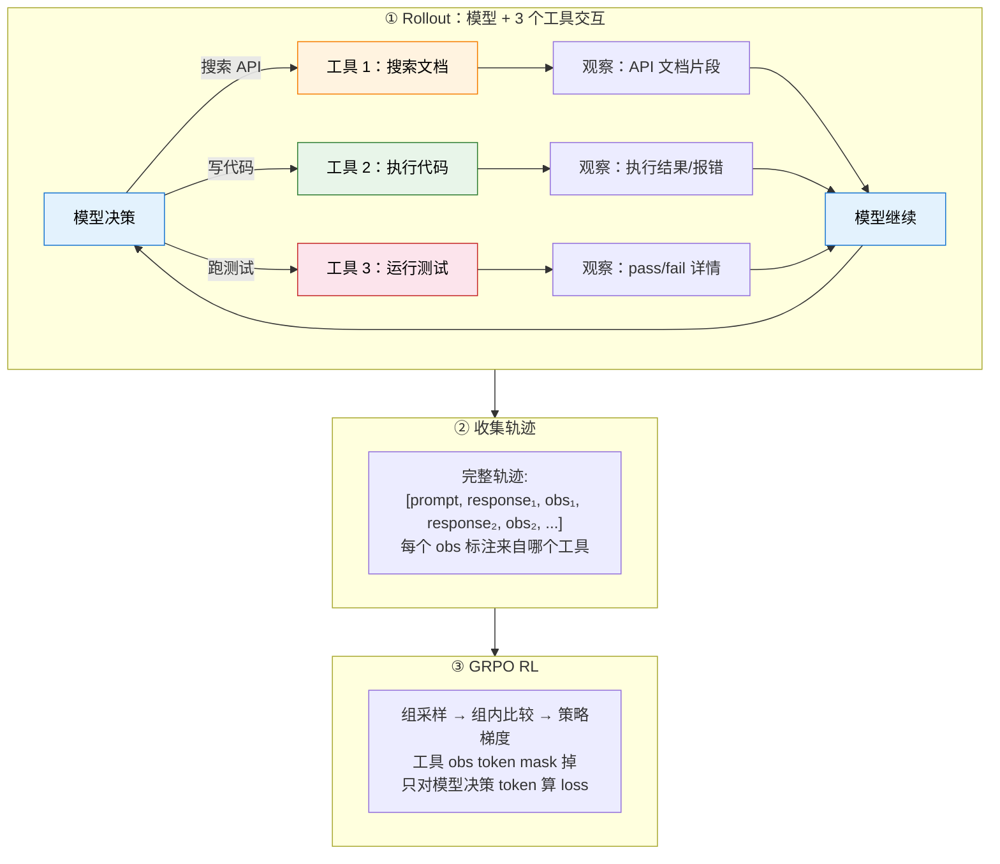

# 12.4 动手：多工具 Agentic RL——搜索文档、写代码、跑测试，模型自己学会什么时候用什么工具

前面的实验用模拟数据对比了 ORM 和 PRM。但那些轨迹是假的。这一节我们做一件更硬核的事：**给模型 3 个工具（搜索文档、执行代码、跑测试），让模型自己学会什么时候搜索、什么时候写代码、什么时候跑测试。用 GRPO 训练后，模型在代码生成 benchmark 上获得真实提升。**

这不是 "写代码→看报错→修" 的单工具循环。这是**真正的 agentic RL**——模型要在多个工具之间做决策，学会工具选择策略。

整个实验在一台 24GB 显存的 GPU（如 RTX 4090 / A5000）上即可完成。我们使用 **Qwen2.5-Coder-3B-Instruct** 作为基座模型。

> 实验设计参考 MURPHY（multi-turn GRPO for self-correcting code generation）、CodeGym（ICLR 2026，多工具 RL 环境）、VerlTool（统一多工具 RL 框架）。训练数据使用 KodCode（合成代码题），评测使用 BigCodeBench-Hard。



## 为什么这是真正的 Agentic RL？

单工具（MURPHY、你之前的实验）：模型只会调一个代码执行器。本质是 "multi-turn RLVR"。

多工具（我们的实验）：模型要在**搜索文档、执行代码、跑测试**之间做选择。这才叫 agentic——核心能力是**工具选择策略**。

| 能力                       | 单工具 | 多工具（本实验） |
| -------------------------- | ------ | ---------------- |
| 写代码                     | 有     | 有               |
| 看报错修代码               | 有     | 有               |
| 搜索不熟悉的 API 文档      | **无** | **有**           |
| 跑测试套件看哪些挂了       | **无** | **有**           |
| 学会**什么时候用什么工具** | 不需要 | **核心学习目标** |

## 第零步：环境准备

```bash
pip install torch transformers accelerate datasets
pip install matplotlib numpy peft
```

```python
# ==========================================
# 0. 全局配置
# ==========================================
import torch, numpy as np, random, re, os, subprocess, tempfile, warnings
warnings.filterwarnings("ignore")

SEED = 42
MODEL_NAME = "Qwen/Qwen2.5-Coder-3B-Instruct"
MAX_NEW_TOKENS = 1024
GROUP_SIZE = 4
MAX_EPOCHS = 3
LR = 5e-6
KL_COEFF = 0.05
MAX_TURNS = 5

device = "cuda" if torch.cuda.is_available() else "cpu"
random.seed(SEED); np.random.seed(SEED); torch.manual_seed(SEED)
print(f"Device: {device}")
```

## 第一步：加载模型 + 构建工具环境 + 加载数据

### 1.1 加载模型

```python
from transformers import AutoModelForCausalLM, AutoTokenizer

tokenizer = AutoTokenizer.from_pretrained(MODEL_NAME)
if tokenizer.pad_token is None:
    tokenizer.pad_token = tokenizer.eos_token

model = AutoModelForCausalLM.from_pretrained(
    MODEL_NAME,
    torch_dtype=torch.bfloat16 if torch.cuda.is_bf16_supported() else torch.float16,
    device_map="auto",
)
model.eval()
for p in model.parameters():
    p.requires_grad = False
print(f"Model: {MODEL_NAME} ({sum(p.numel() for p in model.parameters())/1e9:.2f}B)")
```

### 1.2 工具 1：API 文档搜索引擎

模型不知道怎么用一个库的时候，可以搜索文档。我们预先构建一个 Python 标准库 + 常用第三方库的文档索引。

```python
# ==========================================
# 1.2 工具 1：文档搜索引擎
#     模型调用 <search>query</search> 获得相关 API 文档
# ==========================================

# 预构建文档库（精选常用模块的核心 API）
DOC_STORE = {
    "collections": {
        "Counter": "Counter(iterable) -> dict subclass. Count hashable objects. Methods: most_common(n), elements(), update(iterable), subtract(iterable). Example: c = Counter('abcabc'); c.most_common(2) -> [('a', 2), ('b', 2)]",
        "defaultdict": "defaultdict(default_factory) -> dict subclass. Missing keys get default_factory(). Example: d = defaultdict(list); d['k'].append(1)",
        "OrderedDict": "OrderedDict() -> dict subclass that remembers insertion order. Methods: move_to_end(key), popitem(last=True)",
        "deque": "deque(iterable, maxlen=None) -> double-ended queue. Methods: append(x), appendleft(x), pop(), popleft(), rotate(n)",
        "namedtuple": "namedtuple(typename, field_names) -> tuple subclass with named fields. Example: Point = namedtuple('Point', ['x', 'y']); p = Point(1, 2)",
        "ChainMap": "ChainMap(*maps) -> group multiple dicts. Lookups search each dict in order",
    },
    "itertools": {
        "combinations": "combinations(iterable, r) -> iterator of r-length subsequences. Example: list(combinations('ABC', 2)) -> [('A','B'), ('A','C'), ('B','C')]",
        "permutations": "permutations(iterable, r=None) -> iterator of r-length permutations",
        "product": "product(*iterables, repeat=1) -> cartesian product. Example: list(product('AB', '12')) -> [('A','1'),('A','2'),('B','1'),('B','2')]",
        "groupby": "groupby(iterable, key=None) -> consecutive groups. MUST sort first! Example: for k, g in groupby(sorted(data, key=fn), key=fn)",
        "chain": "chain(*iterables) -> chain multiple iterables. chain.from_iterable(iterable) flattens one level",
        "accumulate": "accumulate(iterable, func=operator.add) -> running totals. Example: list(accumulate([1,2,3])) -> [1, 3, 6]",
        "islice": "islice(iterable, start, stop[, step]) -> iterator slicing without creating list",
    },
    "functools": {
        "lru_cache": "@lru_cache(maxsize=128) -> memoization decorator. Example: @lru_cache(maxsize=None)\\ndef fib(n): return n if n < 2 else fib(n-1) + fib(n-2)",
        "reduce": "reduce(function, iterable[, initializer]) -> reduce iterable to single value. Example: reduce(lambda x,y: x+y, [1,2,3]) -> 6",
        "partial": "partial(func, *args, **kwargs) -> fix some arguments. Example: double = partial(operator.mul, 2); double(3) -> 6",
        "cmp_to_key": "cmp_to_key(mycmp) -> convert cmp function to key function for sorted()",
    },
    "re": {
        "findall": "re.findall(pattern, string, flags=0) -> list of all matches. Example: re.findall(r'\\d+', 'a1b22c') -> ['1', '22']",
        "search": "re.search(pattern, string) -> Match object or None. .group() for match, .start()/.end() for position",
        "match": "re.match(pattern, string) -> Match only at beginning of string",
        "sub": "re.sub(pattern, repl, string, count=0) -> substitute. Example: re.sub(r'\\d+', 'N', 'a1b22') -> 'aNbN'",
        "split": "re.split(pattern, string, maxsplit=0) -> split by pattern. Example: re.split(r'[,;]', 'a,b;c') -> ['a', 'b', 'c']",
    },
    "json": {
        "loads": "json.loads(s) -> parse JSON string to Python object. Example: json.loads('{\"a\": 1}') -> {'a': 1}",
        "dumps": "json.dumps(obj, indent=None) -> serialize to JSON string. Example: json.dumps({'a': 1}) -> '{\"a\": 1}'",
        "load": "json.load(fp) -> parse JSON from file object",
        "dump": "json.dump(obj, fp) -> write JSON to file",
    },
    "math": {
        "gcd": "math.gcd(*integers) -> greatest common divisor. Example: math.gcd(12, 8) -> 4",
        "lcm": "math.lcm(*integers) -> least common multiple. Example: math.lcm(4, 6) -> 12",
        "comb": "math.comb(n, k) -> binomial coefficient C(n,k). Example: math.comb(10, 3) -> 120",
        "perm": "math.perm(n, k=None) -> permutations P(n,k)",
        "isqrt": "math.isqrt(n) -> integer square root. Example: math.isqrt(10) -> 3",
        "log": "math.log(x, base=e) -> logarithm. math.log2(x), math.log10(x) also available",
        "ceil": "math.ceil(x) -> smallest integer >= x. math.floor(x) -> largest integer <= x",
    },
    "string": {
        "ascii_lowercase": "string.ascii_lowercase -> 'abcdefghijklmnopqrstuvwxyz'",
        "ascii_uppercase": "string.ascii_uppercase -> 'ABCDEFGHIJKLMNOPQRSTUVWXYZ'",
        "digits": "string.digits -> '0123456789'",
        "ascii_letters": "string.ascii_letters -> ascii_lowercase + ascii_uppercase",
        "Template": "string.Template('$name is $age') -> safe string substitution. .substitute(dict) or .safe_substitute(dict)",
    },
    "heapq": {
        "heappush": "heapq.heappush(heap, item) -> push item onto heap. heap is a plain list",
        "heappop": "heapq.heappop(heap) -> pop smallest item. heapq.heappushpop(heap, item) more efficient",
        "nlargest": "heapq.nlargest(n, iterable, key=None) -> n largest elements. heapq.nsmallest(n, ...) also available",
        "heapify": "heapq.heapify(list) -> transform list into heap in-place in O(n)",
    },
    "bisect": {
        "bisect_left": "bisect.bisect_left(a, x) -> insertion point for x in sorted list a (leftmost). bisect_right for rightmost",
        "insort": "bisect.insort(a, x) -> insert x into sorted list a maintaining order",
    },
    "datetime": {
        "datetime": "datetime.datetime(year, month, day, hour=0, minute=0, second=0). Methods: .strftime(format), .date(), .weekday()",
        "timedelta": "datetime.timedelta(days=0, seconds=0, microseconds=0). Supports +, -, * with datetime",
        "strptime": "datetime.datetime.strptime(date_string, format) -> parse string. Format: %Y, %m, %d, %H, %M, %S",
    },
    "typing": {
        "List": "List[int] -> list of integers. List[str] -> list of strings",
        "Dict": "Dict[str, int] -> dict with string keys and int values",
        "Optional": "Optional[int] -> int or None. Equivalent to Union[int, None]",
        "Tuple": "Tuple[int, str] -> tuple of (int, str). Tuple[int, ...] -> variable length",
    },
    "pathlib": {
        "Path": "Path('dir/file.txt') -> path object. Methods: .read_text(), .write_text(), .exists(), .is_file(), .mkdir(), .glob(pattern)",
    },
    "numpy": {
        "array": "np.array([1,2,3]) -> ndarray. np.zeros(shape), np.ones(shape), np.arange(start,stop,step), np.linspace(start,stop,num)",
        "reshape": "arr.reshape(shape) -> reshape array. -1 infers dimension. arr.flatten() -> 1D copy",
        "argsort": "np.argsort(arr) -> indices that would sort. arr[np.argsort(arr)] == sorted arr",
        "unique": "np.unique(arr, return_counts=False) -> sorted unique values. return_counts=True adds counts",
        "where": "np.where(condition, x, y) -> element-wise conditional. np.where(condition) -> indices where True",
        "dot": "np.dot(a, b) -> matrix multiplication. a @ b is equivalent",
        "sum": "np.sum(arr, axis=None) -> sum. axis=0 sum columns, axis=1 sum rows",
    },
    "pandas": {
        "DataFrame": "pd.DataFrame(data) -> create DataFrame from dict/list. pd.read_csv(path) -> read CSV",
        "groupby": "df.groupby('col') -> GroupBy object. .agg(func), .mean(), .sum(), .count()",
        "merge": "pd.merge(df1, df2, on='key', how='inner') -> join. how: 'left', 'right', 'outer'",
        "value_counts": "series.value_counts() -> frequency of unique values, sorted descending",
        "apply": "df['col'].apply(func) -> apply function to each element. df.apply(func, axis=1) per row",
    },
}


def tool_search(query: str, top_k: int = 3) -> str:
    """
    工具 1：文档搜索。模型调用 <search>query</search> 时触发。
    返回与 query 最相关的 API 文档片段。
    """
    query_lower = query.lower()
    results = []
    for module, apis in DOC_STORE.items():
        for api_name, doc in apis.items():
            # 简单关键词匹配
            score = 0
            for word in query_lower.split():
                if word in api_name.lower():
                    score += 3
                if word in doc.lower():
                    score += 1
                if word in module.lower():
                    score += 2
            if score > 0:
                results.append((score, f"[{module}.{api_name}]\n{doc}"))

    results.sort(key=lambda x: -x[0])
    if not results:
        return "No documentation found. Try different keywords."

    return "\n\n".join(doc for _, doc in results[:top_k])
```

### 1.3 工具 2：代码执行器 + 工具 3：测试运行器

```python
# ==========================================
# 1.3 工具 2 & 3：代码执行器和测试运行器
# ==========================================

def tool_execute(code: str, timeout: float = 10.0) -> dict:
    """工具 2：执行 Python 代码，返回 stdout/stderr"""
    with tempfile.TemporaryDirectory() as tmpdir:
        path = os.path.join(tmpdir, "exec.py")
        with open(path, "w") as f:
            f.write(code)
        try:
            r = subprocess.run(["python", path], capture_output=True, text=True,
                               timeout=timeout, cwd=tmpdir)
            return {
                "success": r.returncode == 0,
                "output": r.stdout.strip()[:500],
                "error": r.stderr.strip()[:300] if r.returncode != 0 else None,
            }
        except subprocess.TimeoutExpired:
            return {"success": False, "output": "", "error": "TIMEOUT"}


def tool_test(code: str, test_code: str, timeout: float = 10.0) -> dict:
    """工具 3：运行代码 + 测试，返回详细的 pass/fail 信息"""
    full_code = code + "\n\n" + test_code
    with tempfile.TemporaryDirectory() as tmpdir:
        path = os.path.join(tmpdir, "test.py")
        with open(path, "w") as f:
            f.write(full_code)
        try:
            r = subprocess.run(["python", path], capture_output=True, text=True,
                               timeout=timeout, cwd=tmpdir)
            if r.returncode == 0:
                return {"passed": True, "detail": "All tests passed", "output": r.stdout.strip()[:200]}
            else:
                # 解析失败信息
                err = r.stderr.strip()
                return {"passed": False, "detail": err[-300:] if err else "unknown error",
                        "output": r.stdout.strip()[:200]}
        except subprocess.TimeoutExpired:
            return {"passed": False, "detail": "TIMEOUT", "output": ""}
```

### 1.4 加载训练和评测数据

```python
from datasets import load_dataset

# 训练数据：KodCode（合成代码题，与评测集不重叠）
# 参考 MURPHY：用 1000 条 KodCode 就能训出效果
kodcode = load_dataset("KodCode/KodCode-V1", split="train")
# 筛选 easy/medium 难度，取 1000 条
kodcode_easy = kodcode.filter(lambda x: x["gpt_difficulty"] in ["easy", "medium"])
train_data = list(kodcode_easy.shuffle(seed=SEED).select(range(1000)))
print(f"Training data: {len(train_data)} KodCode problems (easy/medium)")

# 评测数据：BigCodeBench-Hard（148 题，需要调用多样库）
# BigCodeBench 比 HumanEval 难得多，且需要查 API 文档才能做好
eval_data = load_dataset("bigcode/bigcodebench-hard", split="v0.1.4")
print(f"Evaluation data: {len(eval_data)} BigCodeBench-Hard problems")
```

## 第二步：Agent Prompt 和工具调用解析

````python
# ==========================================
# 2. Agent System Prompt：告诉模型有 3 个工具可用
# ==========================================

AGENT_PROMPT = """You are a Python expert. You have 3 tools available:

1. **Search documentation**: Use when you need to look up an unfamiliar API.
   Format: <search>your query</search>
   Example: <search>Counter most_common</search>

2. **Execute code**: Run Python code to test ideas or compute results.
   Format:
   ```python
   # your code
   print(result)
   ```

3. **Run tests**: Submit your final solution to be tested.
   Format:
   ```submit
   def your_solution(...):
       ...
   ```

Strategy: Search docs BEFORE writing code if you're unsure about an API.
Test your code with tool 2 before submitting with tool 3.
You can use tools in any order and multiple times."""

SEARCH_PATTERN = re.compile(r'<search>(.*?)</search>', re.DOTALL)
CODE_PATTERN = re.compile(r'```(?:python|py)?\n(.*?)\n```', re.DOTALL)
SUBMIT_PATTERN = re.compile(r'```submit\n(.*?)\n```', re.DOTALL)
PAD_ID = tokenizer.pad_token_id
````

```python
def parse_tool_calls(text: str) -> list:
    """解析模型输出中的工具调用"""
    calls = []
    # 按位置排序：先出现的先处理
    for m in SEARCH_PATTERN.finditer(text):
        calls.append(("search", m.group(1).strip(), m.start()))
    for m in CODE_PATTERN.finditer(text):
        calls.append(("execute", m.group(1).strip(), m.start()))
    for m in SUBMIT_PATTERN.finditer(text):
        calls.append(("submit", m.group(1).strip(), m.start()))
    calls.sort(key=lambda x: x[2])
    return calls
```

## 第三步：多工具 Agent Rollout

```python
# ==========================================
# 3. 多工具 Agent Rollout（核心）
#    模型在 3 个工具之间自主决策
# ==========================================

def run_multi_tool_rollout(task_prompt: str, task_test: str, entry_point: str,
                           temperature=0.7, max_turns=MAX_TURNS, verbose=False):
    """
    多工具 Agent Rollout。

    关键设计（对齐 Search-R1/VerlTool/CodeGym）：
    1. 模型自主选择调用哪个工具（搜索/执行/测试）
    2. token 级增量拼接
    3. 工具 observation 的 token 全部 mask（不算 loss）
    4. 只有模型的决策 token 参与 loss
    """
    init_messages = [
        {"role": "system", "content": AGENT_PROMPT},
        {"role": "user", "content": task_prompt},
    ]
    prompt_text = tokenizer.apply_chat_template(init_messages, tokenize=False, add_generation_prompt=True)
    prompt_ids = tokenizer.encode(prompt_text, add_special_tokens=False)

    real_ids = list(prompt_ids)
    masked_ids = list(prompt_ids)  # prompt 部分两份相同

    submitted_code = None
    test_passed = False
    is_valid = True
    tool_usage = {"search": 0, "execute": 0, "submit": 0, "none": 0}

    for turn_idx in range(max_turns):
        input_t = torch.tensor([real_ids], dtype=torch.long).to(device)
        attn_t = torch.ones_like(input_t)

        with torch.no_grad():
            out = model.generate(
                input_ids=input_t, attention_mask=attn_t,
                max_new_tokens=MAX_NEW_TOKENS,
                temperature=temperature, do_sample=temperature > 0,
                top_p=0.95, pad_token_id=PAD_ID
            )

        gen_ids = out[0][input_t.shape[1]:].tolist()
        response_text = tokenizer.decode(gen_ids, skip_special_tokens=True)

        # 追加模型生成 token（real 和 masked 相同）
        real_ids.extend(gen_ids)
        masked_ids.extend(gen_ids)

        # --- 解析工具调用 ---
        calls = parse_tool_calls(response_text)

        if not calls:
            tool_usage["none"] += 1
            continue

        # 只处理最后一个工具调用（最常见的模式）
        tool_type, tool_input, _ = calls[-1]
        tool_usage[tool_type] += 1

        # --- 执行工具，构造 observation ---
        if tool_type == "search":
            doc_result = tool_search(tool_input)
            obs_text = f"\n<doc_result>\n{doc_result[:500]}\n</doc_result>\n"
            if verbose:
                print(f"  Turn {turn_idx+1} [SEARCH]: {tool_input[:40]}")

        elif tool_type == "execute":
            exec_result = tool_execute(tool_input)
            if exec_result["success"]:
                obs_text = f"\n<exec_result>\n{exec_result['output'][:300]}\n</exec_result>\n"
            else:
                err = exec_result.get("error", "unknown") or "unknown"
                obs_text = f"\n<exec_result>\nERROR: {err[:200]}\n</exec_result>\n"
            if verbose:
                status = "OK" if exec_result["success"] else "ERR"
                print(f"  Turn {turn_idx+1} [EXEC]: {status}")

        elif tool_type == "submit":
            submitted_code = tool_input
            # 运行测试
            test_result = tool_test(tool_input, task_test, entry_point)
            test_passed = test_result["passed"]
            detail = test_result["detail"][:300]
            obs_text = f"\n<test_result>\n{'PASS' if test_passed else 'FAIL'}: {detail}\n</test_result>\n"
            if not test_passed:
                obs_text += "Fix your code and submit again.\n"
            if verbose:
                print(f"  Turn {turn_idx+1} [SUBMIT]: {'PASS' if test_passed else 'FAIL'}")

        obs_ids = tokenizer.encode(obs_text, add_special_tokens=False)
        # observation token：real 保留，masked 替换为 PAD
        real_ids.extend(obs_ids)
        masked_ids.extend([PAD_ID] * len(obs_ids))

        # 如果提交通过，结束
        if tool_type == "submit" and test_passed:
            break

    # 最终验证
    if submitted_code:
        final_test = tool_test(submitted_code, task_test, entry_point)
        test_passed = final_test["passed"]
    else:
        test_passed = False

    # 构建 info_mask
    ids_tensor = torch.tensor([real_ids], dtype=torch.long)
    masked_tensor = torch.tensor([masked_ids], dtype=torch.long)
    info_mask = (masked_tensor != PAD_ID).long()
    labels = ids_tensor.clone()
    labels[info_mask == 0] = -100

    return {
        "input_ids": ids_tensor,
        "attention_mask": torch.ones_like(ids_tensor),
        "labels": labels,
        "info_mask": info_mask,
        "submitted_code": submitted_code,
        "passed": test_passed,
        "is_valid": is_valid,
        "turns": turn_idx + 1,
        "tool_usage": tool_usage,
    }
```

### 3.1 验证 Rollout

```python
# 快速验证多工具 rollout
print("Sanity check — Multi-Tool Agent Rollout:")
print("-" * 60)
for i in [0, 5, 10]:
    item = eval_data[i]
    result = run_multi_tool_rollout(
        item["instruct_prompt"], item["test"], item["entry_point"],
        temperature=0.3, verbose=True
    )
    n_assist = result["info_mask"].sum().item()
    n_tool = (result["info_mask"] == 0).sum().item()
    print(f"  {item['task_id']}: {'PASS' if result['passed'] else 'FAIL'} "
          f"(turns: {result['turns']}, LLM: {n_assist}, tool: {n_tool}, "
          f"tools used: {result['tool_usage']})")
print("-" * 60)
```

## 第四步：基线评测——单轮无工具 vs 单工具 vs 多工具

先看不同工具配置下的 baseline，量化多工具的价值。

```python
# ==========================================
# 4. 基线评测：三档对比
# ==========================================
EVAL_N = 50  # 先评测 50 题

def eval_no_tools(model_to_eval, data, n):
    """单轮生成，不用任何工具"""
    model_to_eval.eval()
    results = []
    for i, item in enumerate(list(data)[:n]):
        messages = [{"role": "user", "content": item["instruct_prompt"]}]
        text = tokenizer.apply_chat_template(messages, tokenize=False, add_generation_prompt=True)
        inputs = tokenizer(text, return_tensors="pt").to(device)
        with torch.no_grad():
            out = model_to_eval.generate(**inputs, max_new_tokens=MAX_NEW_TOKENS,
                                         temperature=0.0, pad_token_id=PAD_ID)
        code = tokenizer.decode(out[0][inputs["input_ids"].shape[1]:], skip_special_tokens=True)
        test_result = tool_test(code, item["test"], item["entry_point"])
        results.append(test_result["passed"])
        if (i+1) % 25 == 0:
            print(f"  [No-Tools] {i+1}/{n}: {sum(results)/len(results):.1%}")
    return sum(results) / len(results)

def eval_code_only(model_to_eval, data, n):
    """只有代码执行器（单工具，类似 MURPHY）"""
    model_to_eval.eval()
    results = []
    for i, item in enumerate(list(data)[:n]):
        result = run_multi_tool_rollout(
            item["instruct_prompt"], item["test"], item["entry_point"],
            temperature=0.0, max_turns=3
        )
        results.append(result["passed"])
        if (i+1) % 25 == 0:
            print(f"  [Code-Only] {i+1}/{n}: {sum(results)/len(results):.1%}")
    return sum(results) / len(results)

def eval_multi_tool(model_to_eval, data, n, label="Multi-Tool"):
    """3 个工具全开"""
    model_to_eval.eval()
    results = []
    for i, item in enumerate(list(data)[:n]):
        result = run_multi_tool_rollout(
            item["instruct_prompt"], item["test"], item["entry_point"],
            temperature=0.0, max_turns=5
        )
        results.append(result["passed"])
        if (i+1) % 25 == 0:
            print(f"  [{label}] {i+1}/{n}: {sum(results)/len(results):.1%}")
    return sum(results) / len(results)

print("BASELINE EVALUATION (before training)")
print("=" * 60)
baseline_notools = eval_no_tools(model, eval_data, EVAL_N)
baseline_codeonly = eval_code_only(model, eval_data, EVAL_N)
baseline_multitool = eval_multi_tool(model, eval_data, EVAL_N, "Baseline-MultiTool")
print(f"\n  No tools:     {baseline_notools:.1%}")
print(f"  Code only:    {baseline_codeonly:.1%}")
print(f"  Multi-tool:   {baseline_multitool:.1%}")
print("=" * 60)
```

## 第五步：批量 Rollout + GRPO RL 训练

```python
# ==========================================
# 5. GRPO RL 训练：模型学会多工具策略
# ==========================================
from peft import LoraConfig, get_peft_model, TaskType
from torch.optim import AdamW

# 准备训练模型 + reference model
model_rl = AutoModelForCausalLM.from_pretrained(
    MODEL_NAME,
    torch_dtype=torch.bfloat16 if torch.cuda.is_bf16_supported() else torch.float16,
    device_map="auto",
)
model_rl.enable_input_require_grads()
model_rl = get_peft_model(model_rl, LoraConfig(
    task_type=TaskType.CAUSAL_LM, r=16, lora_alpha=32,
    lora_dropout=0.05, target_modules=["q_proj", "v_proj"],
))

ref_model = AutoModelForCausalLM.from_pretrained(
    MODEL_NAME,
    torch_dtype=torch.bfloat16 if torch.cuda.is_bf16_supported() else torch.float16,
    device_map="auto",
)
ref_model.eval()
for p in ref_model.parameters():
    p.requires_grad = False

optimizer_rl = AdamW(filter(lambda p: p.requires_grad, model_rl.parameters()), lr=LR)

training_log = {"epoch": [], "pass_rate": [], "mean_reward": [], "loss": [],
                "search_rate": [], "submit_rate": []}

# 只取训练集的一个子集做 demo
TRAIN_SUBSET = list(range(0, 500, 5))  # 100 题
train_subset = [train_data[i] for i in TRAIN_SUBSET]

print("=" * 60)
print("GRPO RL Training — Multi-Tool Agent")
print("=" * 60)

for epoch in range(MAX_EPOCHS):
    model_rl.train()
    epoch_rewards, epoch_losses = [], []
    epoch_passed = 0
    epoch_tool_stats = {"search": 0, "execute": 0, "submit": 0, "none": 0}
    random.shuffle(train_subset)

    for task_idx, item in enumerate(train_subset):
        # KodCode 的 test 字段包含测试代码
        task_test = item.get("test", "")
        task_prompt = item["question"]
        # 构造一个简单的 entry_point（KodCode 格式适配）
        entry_point = "solution"

        # ---- Phase 1: On-Policy Rollout ----
        trajectories = []
        for g in range(GROUP_SIZE):
            result = run_multi_tool_rollout(
                task_prompt, task_test, entry_point,
                temperature=0.7, max_turns=MAX_TURNS
            )
            # Reward 设计：
            # 1. Outcome reward：测试是否通过
            reward = 1.0 if result["passed"] else 0.0
            # 2. 工具使用 shaping：用了搜索但还答错的，给小正奖励（鼓励探索）
            if not result["passed"] and result["tool_usage"]["search"] > 0:
                reward = 0.05 * min(result["tool_usage"]["search"], 3)
            # 3. 没提交代码的，小负奖励
            if not result["submitted_code"]:
                reward = -0.1
            result["reward"] = reward
            trajectories.append(result)

        # ---- Phase 2: GRPO Advantage ----
        rewards = np.array([t["reward"] for t in trajectories])
        mean_r, std_r = rewards.mean(), rewards.std() + 1e-8
        advantages = (rewards - mean_r) / std_r

        # ---- Phase 3: 策略梯度更新 ----
        for traj, advantage in zip(trajectories, advantages):
            input_ids = traj["input_ids"].to(device)
            attention_mask = traj["attention_mask"].to(device)
            labels = traj["labels"].to(device)
            info_mask = traj["info_mask"].to(device)

            if (info_mask == 1).sum() == 0:
                continue

            outputs = model_rl(input_ids=input_ids, attention_mask=attention_mask, labels=labels)
            policy_lp = -outputs.loss

            with torch.no_grad():
                ref_out = ref_model(input_ids=input_ids, attention_mask=attention_mask, labels=labels)
                ref_lp = -ref_out.loss

            kl = policy_lp - ref_lp
            loss = -advantage * policy_lp + KL_COEFF * kl

            optimizer_rl.zero_grad()
            loss.backward()
            torch.nn.utils.clip_grad_norm_(model_rl.parameters(), 1.0)
            optimizer_rl.step()
            epoch_losses.append(loss.item())

        epoch_rewards.extend(rewards.tolist())
        epoch_passed += sum(1 for t in trajectories if t["passed"])
        for t in trajectories:
            for k in epoch_tool_stats:
                epoch_tool_stats[k] += t["tool_usage"].get(k, 0)

        if (task_idx + 1) % 25 == 0:
            pr = epoch_passed / ((task_idx+1) * GROUP_SIZE)
            total_tools = sum(epoch_tool_stats.values())
            sr = epoch_tool_stats["search"] / max(total_tools, 1)
            print(f"  Epoch {epoch+1} | Task {task_idx+1}/{len(train_subset)} | "
                  f"Pass: {pr:.1%} | Search rate: {sr:.1%}")

    # Epoch summary
    pr = epoch_passed / (len(train_subset) * GROUP_SIZE)
    total_tools = sum(epoch_tool_stats.values())
    training_log["epoch"].append(epoch+1)
    training_log["pass_rate"].append(pr)
    training_log["mean_reward"].append(np.mean(epoch_rewards))
    training_log["loss"].append(np.mean(epoch_losses) if epoch_losses else 0)
    training_log["search_rate"].append(epoch_tool_stats["search"] / max(total_tools, 1))
    training_log["submit_rate"].append(epoch_tool_stats["submit"] / max(total_tools, 1))
    print(f"  Epoch {epoch+1} Summary: Pass={pr:.1%}, Reward={np.mean(epoch_rewards):.3f}, "
          f"Loss={training_log['loss'][-1]:.4f}, SearchRate={training_log['search_rate'][-1]:.1%}")

model_rl.eval()
```

## 第六步：训练后评测——多工具策略真的学会了吗？

```python
# ==========================================
# 6. 训练后评测
# ==========================================

print("=" * 60)
print("POST-TRAINING Evaluation on BigCodeBench-Hard")
print("=" * 60)

rl_notools = eval_no_tools(model_rl, eval_data, EVAL_N)
rl_multitool = eval_multi_tool(model_rl, eval_data, EVAL_N, "RL-MultiTool")

print("\n" + "=" * 60)
print("FINAL COMPARISON")
print("=" * 60)
print(f"  {'Method':<25} {'Pass@1':>8}")
print(f"  {'-'*33}")
print(f"  {'Baseline (no tools)':<25} {baseline_notools:>7.1%}")
print(f"  {'Baseline (code only)':<25} {baseline_codeonly:>7.1%}")
print(f"  {'Baseline (multi-tool)':<25} {baseline_multitool:>7.1%}")
print(f"  {'RL (no tools)':<25} {rl_notools:>7.1%}")
print(f"  {'RL (multi-tool)':<25} {rl_multitool:>7.1%}")
print(f"  {'-'*33}")
print(f"  {'Multi-tool gain':<25} {rl_multitool - baseline_notools:>+7.1%}")
print(f"  {'RL tool-learning gain':<25} {rl_multitool - baseline_multitool:>+7.1%}")
print("=" * 60)
```

### 可视化

```python
import matplotlib.pyplot as plt
import matplotlib
matplotlib.rcParams['font.sans-serif'] = ['Arial Unicode MS', 'SimHei', 'sans-serif']
matplotlib.rcParams['axes.unicode_minus'] = False

fig, axes = plt.subplots(1, 3, figsize=(18, 5))

# --- 左图：Pass@1 对比 ---
ax = axes[0]
methods = ['No Tools\n(Baseline)', 'Code Only\n(Baseline)', 'Multi-Tool\n(Baseline)', 'Multi-Tool\n(After RL)']
pass_rates = [baseline_notools, baseline_codeonly, baseline_multitool, rl_multitool]
colors = ['#bdbdbd', '#90a4ae', '#42a5f5', '#66bb6a']

bars = ax.bar(methods, pass_rates, color=colors, edgecolor='#333', linewidth=1.5)
ax.set_ylabel('pass@1')
ax.set_title(f'BigCodeBench-Hard (n={EVAL_N})', fontweight='bold')
ax.set_ylim(0, max(max(pass_rates) * 1.5, 0.2))

for bar, v in zip(bars, pass_rates):
    ax.text(bar.get_x() + bar.get_width()/2., v + 0.01,
            f'{v:.1%}', ha='center', fontsize=12, fontweight='bold')

best = np.argmax(pass_rates)
if pass_rates[best] > pass_rates[0]:
    ax.annotate(f'+{(pass_rates[best]-pass_rates[0])*100:.1f}pp',
                xy=(best, pass_rates[best]), xytext=(best, pass_rates[best]+0.06),
                fontsize=13, fontweight='bold', color='#2e7d32',
                arrowprops=dict(arrowstyle='->', color='#2e7d32', lw=2))

# --- 中图：训练过程 ---
ax = axes[1]
epochs = training_log["epoch"]
ax.plot(epochs, [p*100 for p in training_log["pass_rate"]], 'o-', color='#388e3c', lw=2, label='Pass Rate (%)')
ax.plot(epochs, training_log["mean_reward"], 's--', color='#1976d2', lw=2, label='Mean Reward')
ax.set_xlabel('Epoch')
ax.set_title('GRPO RL Training', fontweight='bold')
ax.legend()
ax.grid(True, alpha=0.3)

# --- 右图：工具使用率变化 ---
ax = axes[2]
ax.plot(epochs, [s*100 for s in training_log["search_rate"]], 'o-', color='#f57c00', lw=2, label='Search Rate (%)')
ax.plot(epochs, [s*100 for s in training_log["submit_rate"]], 's-', color='#c62828', lw=2, label='Submit Rate (%)')
ax.set_xlabel('Epoch')
ax.set_title('Tool Selection Strategy', fontweight='bold')
ax.legend()
ax.grid(True, alpha=0.3)

plt.suptitle('Multi-Tool Agentic RL: Qwen2.5-Coder-3B on BigCodeBench-Hard', fontsize=14, fontweight='bold')
plt.tight_layout()
plt.savefig("multi_tool_agentic_rl.png", dpi=150)
print("Saved: multi_tool_agentic_rl.png")
```

## 参考：多工具 Agentic RL 的开源项目

| 项目                    | 工具                   | 评测 Benchmark                     | 特点                           |
| ----------------------- | ---------------------- | ---------------------------------- | ------------------------------ |
| **MURPHY**              | 代码执行 + 测试        | HumanEval, MBPP, BigCodeBench-Hard | Multi-turn GRPO，1.7B 模型 +8% |
| **CodeGym** (ICLR'26)   | 合成多工具环境         | OOD 泛化评测                       | 自动生成 RL 环境               |
| **VerlTool**            | 代码/搜索/SQL/视觉/SWE | AIME, NQ, Spider, SWE-Verified     | 统一多域框架                   |
| **Search-R1**           | 搜索引擎               | NQ, HotpotQA, TriviaQA             | 搜索 token mask                |
| **SimpleTIR** (ICLR'26) | 代码沙箱               | AIME 2024                          | Void turn 过滤                 |
| **RLEF** (Meta)         | 代码执行 + 测试        | CodeContests                       | 8B 模型竞赛编程 SOTA           |

## 实验总结

**我们做了什么**：

1. 给模型 **3 个工具**（搜索文档、执行代码、跑测试）
2. 模型必须**自主决定**什么时候搜索、什么时候写代码、什么时候提交测试
3. 用 GRPO RL 训练模型学习**工具选择策略**
4. 在 BigCodeBench-Hard 上评测真实提升

**关键设计决策**：

- **3 个工具**（vs 单工具）：模型学会的是工具选择策略，不只是代码修正
- **文档搜索工具**：BigCodeBench-Hard 涉及多样 Python 库，模型需要先查文档再编码
- **Token mask**：所有工具返回的 observation token 不参与 loss（`labels = -100`）
- **Reward shaping**：通过测试 = 1.0，用了搜索但失败 = 0.05\*n（鼓励探索），没提交 = -0.1
- **训练数据**：KodCode 合成题（与 BigCodeBench 不重叠），1000 条就够（MURPHY 证明）
- **评测分离**：训练用 KodCode，评测用 BigCodeBench-Hard

**预期结果**：

- RL 训练后，模型的搜索工具使用率应该上升（学会 "先查后写"）
- 多工具 pass@1 应该显著高于单工具和 no-tool baseline
- 右图 "Tool Selection Strategy" 应该展示模型确实学会了何时搜索

下一节我们聚焦 Agentic RL 的工程挑战——[怎么把这些想法变成一个真正能跑的训练系统](./agentic-engineering)。
