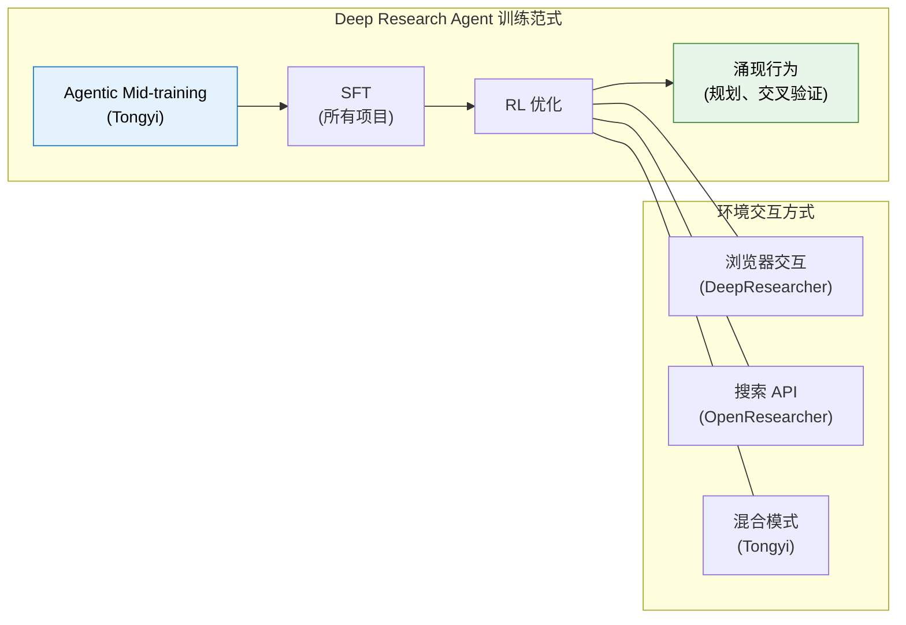
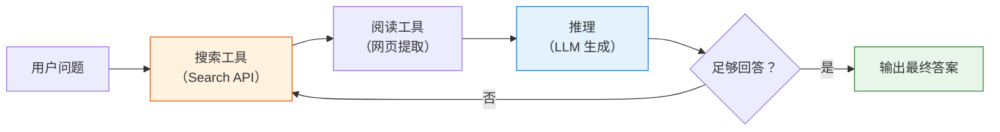

# 12.5 深度研究智能体：Deep Research Agent

前面几节我们讨论了多轮 RL 的信用分配、轨迹合成、以及 Web Agent / Code Agent 的工具调用训练。现在我们来看一个把这些技术**全部整合在一起**的前沿应用——Deep Research Agent（深度研究智能体）。它的目标是让 AI 像人类研究员一样，自主进行长程、多步的信息搜索、分析和综合，最终输出一份可信赖的研究报告。

2025-2026 年，Deep Research Agent 已经成为 Agentic RL 最热门的应用方向之一。本节将从全局认知、推理范式、核心系统、奖励设计、数据合成、评测体系六个层面展开。

## 什么是 Deep Research Agent？

Deep Research Agent 不是简单的"搜索 + 总结"。它需要解决一个根本问题：**如何让 AI 在真实、复杂的网络环境中，进行鲁棒、可信的深度研究？** 这意味着它要能规划搜索策略、交叉验证信息来源、处理动态网页内容、并在多步推理中保持逻辑连贯。

与上一节的 Web Agent 相比，Deep Research Agent 的核心区别在于：

| 维度     | Web Agent                      | Deep Research Agent                        |
| -------- | ------------------------------ | ------------------------------------------ |
| 任务目标 | 完成单一操作（订票、搜索商品） | 综合性研究（多源分析、交叉验证、报告生成） |
| 交互轮次 | 通常 3-10 轮                   | 通常 20-100+ 轮                            |
| 评估标准 | 任务成功/失败                  | 答案准确性 + 引用质量 + 逻辑严谨性         |
| 核心挑战 | 元素定位、动态页面             | 长程规划、信息综合、幻觉遏制               |

### 浏览器交互 vs 搜索 API：两种技术路径

Deep Research Agent 与网络交互的方式，主要分为两大流派：

**浏览器交互派**——让 AI 像人一样操作浏览器，处理动态加载的网页、点击按钮、填写表单。代表项目包括 DeepResearcher（在真实网络搜索环境中端到端 RL 训练）[^deepresearcher]、WebAgent-R1（直接与网络环境在线交互）。这类方法的优势是能获取动态、非结构化内容，但工程复杂度高、延迟大。

**搜索 API 派**——通过结构化的 API 请求获取 JSON 格式的搜索结果。代表项目包括 OpenResearcher（在预下载的大规模本地语料库上工作，零网络依赖）[^openresearcher]、PokeeResearch-7B（依赖第三方搜索 API 服务）。这类方法高效、稳定、易于复现，但可能无法获取动态内容。

两种路径并非互斥。前沿项目倾向于将二者结合——例如 Tongyi DeepResearch 同时配备 Search（搜索引擎 API）、Visit（网页内容提取）、Python Interpreter 等高层级工具 [^tongyi_dr]。

## 推理范式：从 ReAct 到长程研究协作

Deep Research Agent 的推理方式并不是一步到位的。过去两年里，这条路线大致经历了三个层次的演化：

1. **ReAct：边想边做的基础闭环**
   - 核心模式是 Thought → Action → Observation。
   - 适合短链路任务：先搜索、再打开网页、再基于观察继续下一步。
   - 它解决的是"模型能不能开始用工具"这个问题。

2. **Iterative Research：面向长程任务的迭代研究**
   - 当任务从"找一个答案"变成"写一份可信研究报告"时，单纯的 ReAct 已经不够。
   - 模型需要反复执行"检索 → 阅读 → 比较来源 → 修正假设 → 再检索"的循环。
   - 这一层的关键不再只是工具调用本身，而是长程规划、交叉验证和上下文压缩。

3. **Multi-agent Synthesis：分工协作的信息综合**
   - 当任务规模进一步增大，系统会把单个研究员拆成多个角色，例如搜索、阅读、证据整理、最终写作。
   - 多智能体的价值不只是并行加速，更在于把"发现信息"和"综合信息"分离，减少单条轨迹的认知负担。
   - DeepResearcher、Fathom-DeepResearch 一类工作都体现了这种趋势。

可以把三者理解为同一条能力链上的不同阶段：**ReAct 负责打通工具闭环，iterative research 负责把闭环拉长，multi-agent synthesis 负责把长程研究任务做结构化分工。** Agentic RL 的作用，则是让模型不只会照着模板调用工具，而是在真实反馈中逐渐学会什么时候搜索、什么时候停止、什么时候需要交叉验证。

## 核心模型与框架

以下是目前最具代表性的开源 Deep Research 模型及训练框架。它们的共同目标是将 LLM 从"聊天模型"进化为"研究模型"。

### DeepResearcher：端到端 RL 训练

DeepResearcher 是首个在**真实的、动态的开放网络环境**中进行端到端 RL 训练的框架 [^deepresearcher]。之前的工作大多在受控的 RAG 环境中训练，或者依赖精心设计的 prompt 工程——DeepResearcher 直接让模型与真实的搜索引擎和网页交互，从真实反馈中学习。

它的架构采用了多智能体协作：专门的"浏览智能体（Browsing Agents）"负责从复杂网页结构中提取信息，主智能体负责规划研究策略和综合信息。训练目标是纯粹的答案正确性（RLVR），不引入任何过程奖励。

**核心发现：行为的涌现。** 这是 DeepResearcher 最令人惊讶的结果——通过 RL 训练，模型自发涌现出了多类高级行为，而这些行为**从未被显式训练过**：

1. **规划（Planning）**：模型学会了在搜索前先分解问题，制定多步搜索计划
2. **交叉验证（Cross-verification）**：模型主动从多个来源验证同一事实，而非只信任第一个搜索结果
3. **自我反思与重定向**：模型在搜索结果不理想时，能自主调整研究方向
4. **诚实表达**：当无法找到明确答案时，模型学会了坦诚而非编造

这说明 RL 在 agent 训练中的价值不仅是"优化已知策略"——它还能**发现人类未曾设计的新策略**。这一发现对整个 Agentic RL 领域有深远影响：与其试图通过 SFT 教会模型所有行为，不如通过 RL 让模型自己探索最优策略。

### Tongyi DeepResearch：Agentic Mid-training + Post-training

阿里巴巴通义实验室的 Tongyi DeepResearch 是目前开源 Deep Research 模型中表现最强的系统之一 [^tongyi_dr]。它在多个 benchmark 上超越了 OpenAI o3、DeepSeek-V3.1（671B）等远大于它的模型，而总参数量仅 30.5B——关键在于 MoE（Mixture of Experts）架构，每次推理只激活 3.3B 参数，实现了极高的参数效率。

**两阶段训练范式。** Tongyi DeepResearch 的核心创新是提出 **Agentic Mid-training + Post-training** 两阶段流水线：

1. **Agentic Mid-training（Agentic CPT）**：在合成的大规模工具调用轨迹上进行持续预训练。分两步：先在 32K 上下文上训练基础 agentic 能力，再扩展到 128K 引入长序列（64K-128K）agentic 行为数据。这一阶段的目标不是教模型"怎么做好研究"，而是赋予它**agentic 行为的归纳偏置**——让模型在接触具体研究任务之前，就已经"熟悉"工具调用的基本模式。少量通用预训练数据穿插其中，防止模型丧失通用语言能力。

2. **Agentic Post-training**：分为三步——SFT 冷启动（在高质量合成轨迹上学习研究模板）、on-policy RL（用定制化 GRPO 在真实+模拟环境中优化策略）、模型合并（将不同能力偏好的模型变体通过参数平均融合）。

**两项关键技术。** 除了训练范式，Tongyi DeepResearch 还有两项值得关注的工程创新：

- **Context Management 推理范式**：长程研究面临的核心瓶颈是上下文窗口有限。Tongyi 提出了基于马尔可夫状态重建的 Context Management——每一步不保留完整历史，而是维护一个不断更新的"研究报告摘要"作为压缩记忆。这让模型能在任意深度的探索中保持推理能力。
- **分阶段环境策略**：不同训练阶段使用不同保真度的环境。Mid-training 使用"先验世界环境"（零成本、零交互）和"模拟环境"（低成本、可控）；Post-training 的 RL 阶段先在模拟环境验证算法，再部署到真实环境做最终训练。这一策略解决了真实环境 API 不稳定、高延迟、高成本的问题。

在 BrowseComp、WebWalkerQA、FRAMES、HLE 等多个深度研究 benchmark 上达到 SOTA [^tongyi_dr]。

### PokeeResearch-7B：小模型的大潜力

PokeeResearch-7B 是目前最小的可用开源 Deep Research 模型之一，仅 7B 参数量 [^pokeeresearch]。它的意义在于证明了一件事：**深度研究能力并非大模型的专利**。

它的实践启示是：如果你的场景不需要"全学科专家级"的研究能力，而是聚焦在特定领域（如电商、法律、医疗）的信息整合，7B 级别的模型配合精心设计的工具链和数据策略，完全可以胜任。这大幅降低了 Deep Research Agent 的部署门槛——不需要 A100 集群，单张消费级 GPU 即可运行。

### SFR-DeepResearch：自主单智能体

Salesforce 的 SFR-DeepResearch 走了一条与多智能体不同的路线：**自主单智能体**（Autonomous Single Agent）[^sfr_dr]。它不将研究流程拆分为搜索、阅读、写作等多个角色，而是让一个模型端到端完成全部研究流程。

这一路线的优势是**架构简洁**——没有多智能体之间的通信开销和协调成本。但挑战也很明显：单模型需要同时掌握搜索策略、信息综合、长文本生成等多种能力，容易产生能力冲突。SFR 的解法是在**推理增强模型**（已经在数学、代码等领域经过 RL 训练的模型）上继续用 RL 做 agent 训练，利用模型已有的强推理能力来支撑研究任务。

### rStar2-Agent：极致的训练效率

rStar2-Agent 展示了高效 RL 算法的巨大潜力 [^rstar2]。它使用基于 GRPO 的 agent RL 算法训练 14B 推理模型，核心思想是：**不是模型越大越好，而是训练方法越精准越好**。

它的实践价值在于：如果你受限于计算资源，无法训练 100B+ 的模型，rStar2-Agent 提供了一条可行的替代路径——通过精心设计 RL 算法（如更好的采样策略、更稳定的梯度估计），让 14B 级别的模型也能在数学推理等任务上展现出极强的竞争力。



## 奖励与算法创新：超越"只看结果"

在 Deep Research 中，"只看最终答案对不对"的奖励方式效果很差——因为研究过程可能长达几十步，仅用终态 reward 无法指导模型学到有效的中间策略。以下工作专注于设计更精细、更智能的奖励函数。

### 引用感知奖励：CaRR

**问题**：Deep Research Agent 最常见、也最危险的幻觉类型不是"编造事实"，而是"编造引用"——模型给出一个看似合理的论断，配上一个看似真实但不存在的 URL，或者引用了一篇真实论文但歪曲了其结论。传统的 outcome reward（只看答案对不对）无法检测这类问题。

**方案**：清华大学与智谱 AI 联合提出的 Citation-aware Rubric Rewards（CaRR）[^carr_dr] 将引用质量显式编码进 RL 奖励函数。其核心思路并非简单地施加惩罚，而是计算一个正向的比率奖励，具体流程如下：

1. **Rubric 分解**：将多跳问题分解为一系列原子事实陈述（Rubrics），每个 Rubric 包含待验证的隐藏实体。
2. **实体识别**：由评判模型检查模型的最终回答中是否识别了每个 Rubric 中的关键实体。
3. **引用验证**：提取回答中引用的 URL（最多 20 个），获取网页内容，由评判模型判断每条 Rubric 是否被引用内容所支持。
4. **证据连通性**：构建二分图，通过广度优先搜索验证各 Rubric 是否在逻辑上与最终答案相连通。

最终奖励为被满足且逻辑连通的 Rubric 数量占总 Rubric 数量的比率。该比率奖励与结果奖励（答案是否正确）按可调权重 $\alpha$ 进行混合，作为 GRPO 训练的综合奖励信号。

**启示**：CaRR 的设计思想可以推广到其他需要"可验证性"的场景——不只是引用，代码是否能执行、数学推导是否正确，都可以用类似的"分解→验证→计算比率"框架来设计奖励。

### 原子思维奖励：Atom-Searcher

**问题**：Deep Research 的研究轨迹可能长达几十步。如果只用终态 reward（答案对=1，错=0），信用分配（credit assignment）几乎不可能做好——模型完全不知道这几十步中哪些是关键的好决策，哪些是凑巧没影响的坏决策。

**方案**：Atom-Searcher 提出了**原子思维奖励（Atomic Thought Reward, ATR）**[^atom_searcher]，将复杂推理分解为原子级单元，并在每个中间步骤给予过程奖励。核心思想是：与其等到最终答案出来再给 reward，不如在每个"原子推理步骤"上就给反馈。

**为什么是"原子"而不是"步骤"？** 注意 ATR 不是简单的"每步打分"。它先将推理链分解为不可再分的原子单元（如"从 A 推导出 B"），然后对每个原子单元独立评估逻辑正确性和信息价值。这种分解方式比步骤级打分更精细，也比 token 级打分更有语义意义。

**实践价值**：ATR 主要在训练初期发挥作用。当模型还没有形成稳定的研究策略时，密集的过程信号能大幅加速收敛。一旦模型学会了基本的研究模式，可以逐步退火 ATR 的权重，回归到终态 reward 主导——这和人类学习的过程一致：先学每一步怎么做，再学会评价整体结果。

### 演化评分标准：DR Tulu

**问题**：RL 训练中有一个经典陷阱——**Reward Hacking**。模型会找到评分标准的"漏洞"来获取高分，而不是真正提升研究质量。比如发现"引用越多分越高"就堆砌引用，发现"答案越长分越高"就疯狂注水。一旦模型学会了钻空子，训练就陷入了"刷分但不进步"的死循环。

**方案**：Allen AI 的 DR Tulu 提出了 **RLER（Reinforcement Learning with Evolving Rubrics）**[^dr_tulu]——让评分标准本身随训练动态演化。它的核心策略是"打移动靶"：

1. **训练初期**：用宽松的 Rubrics 鼓励模型探索。比如"只要有引用就给分"，不苛求引用质量
2. **训练中期**：当模型在当前标准下刷分到一定程度后，自动收紧标准。比如"引用必须可访问才给分"
3. **训练后期**：用严格的标准提升最终质量。比如"引用内容必须支持论断才给分"

每次标准收紧，之前模型学会的"捷径"就不再有效，迫使模型去寻找真正提升质量的策略。

**启示**：RLER 的思想可以类比于教育中的"升级考试"——不能永远做同一套题，标准要随着学生水平提高而提高。这一策略与 CaRR 的引用验证、Web-Shepherd 的过程评分天然互补。

### 无需微调的 RL：Memento

**问题**：RL 训练需要大量计算资源、复杂的工程基础设施、以及稳定的环境交互。对于很多团队来说，这套门槛太高了。有没有更轻量的方式让 Agent 变强？

**方案**：Memento 提供了一条完全不同的技术路线 [^memento]——**不修改模型参数**，而是通过外部"情景记忆"（Episodic Memory）让 Agent 在推理时检索相似案例来指导行为。具体来说：

1. **案例积累**：将过去成功和失败的研究轨迹存储为案例
2. **案例检索**：面对新问题时，从记忆中检索最相似的成功案例
3. **策略指导**：将检索到的案例作为上下文提供给模型，引导它采取类似的成功策略

**为什么这很重要？** Memento 在 GAIA 验证集上排名第一（87.88% Pass@3），超越了许多经过大量 RL 训练的模型。它有力地证明了：**有时候"更好的检索"比"更好的训练"更有效**。这也提示我们，RL 并非提升 Agent 能力的唯一路径——外部记忆与推理时策略同样是值得关注的方向。对于资源受限的团队，Memento 路线的性价比可能远高于完整的 RL 训练。

### 步骤级过程奖励：Web-Shepherd

**问题**：在网页交互场景中，outcome reward（只看最终答案对不对）的信息量极低。一个 Agent 可能搜索了 30 次，其中 28 次都在做无效操作，但碰巧最后一次搜到了正确答案——outcome reward 会给这整条轨迹打高分，实际上强化了大量无效行为。

**方案**：Web-Shepherd 专门训练了一个**步骤级过程奖励模型（PRM）**来评估网页交互的每一步质量 [^web_shepherd]。与 ORM（Outcome Reward Model）不同，PRM 为每一步独立打分，提供密集的训练信号。

**关键设计**：Web-Shepherd 的 PRM 为网页导航轨迹中的每一步独立评估质量，比传统的 outcome reward 提供了更密集、更准确的训练信号。

**实验结果**：PRM 能带来 10.9 个百分点的性能提升。这个数字看似不大，但考虑到这纯粹来自"更准确的奖励信号"而非任何模型架构或数据改进，其实际意义非常大——它直接证明了**过程级信号的实用价值**。

**与其他工作的关系**：Web-Shepherd 的 PRM 与 Atom-Searcher 的 ATR 有相似目标（提供过程级信号），但粒度不同——PRM 按步骤打分，ATR 按原子推理单元打分。两者可以互补使用。

## 数据与轨迹合成：RL 的"燃料"

长程、高质量的研究轨迹是训练 Deep Research Agent 的关键输入，也是最大的瓶颈。以下工作专注于解决这个问题。

### OpenResearcher：完全开源的轨迹合成

**问题**：训练 Deep Research Agent 需要大量长程研究轨迹，但真实网络环境不稳定、API 调用昂贵、且难以复现。大多数研究团队没有条件大规模采集真实轨迹。

**方案**：OpenResearcher 提供了一个**完全离线、零网络依赖**的轨迹合成流水线 [^openresearcher]。它在大规模预下载的本地语料库上工作，核心是三个模拟的"浏览器原语"：`search`（搜索）、`open`（打开文档）、`find`（查找内容）。这三个操作足以覆盖大部分研究场景，且完全可控、可复现。

**规模与质量**：OpenResearcher 生成了超过 97K 条轨迹，其中部分轨迹包含 100+ 次工具调用。这些轨迹覆盖了从简单事实查询到复杂多步推理的各种难度。

**实践价值**：对资源有限的研究者来说，OpenResearcher 是最友好的起点——不需要 API key，不需要 GPU 集群，一台普通电脑就能跑通整个合成流程。它也是验证新算法的绝佳工具：在一个完全可控、可复现的环境里快速迭代。

### Tongyi DeepResearch 的数据合成管线：全自动、超人级

Tongyi DeepResearch 的数据合成管线 [^tongyi_dr] 是其核心创新之一，完全自动化且无需人工标注。它采用**分阶段、复杂度递增**的策略，为不同的训练阶段定制不同类型的数据：

- **Mid-training 阶段**：合成大规模 agent 行为数据，覆盖研究的完整生命周期。具体包括四类动作数据：
  - **问题合成**：基于实体锚定的开放世界记忆，生成多风格问题（多跳推理、数值计算等）
  - **规划动作**：问题分解与首步行动预测——规划准确性直接决定任务能否成功
  - **推理动作**：给定问题和相关知识，生成完整的逻辑推理链，并通过推理长度和答案一致性双重过滤保证质量
  - **决策动作**：在轨迹的每个决策点探索可行动作空间，将轨迹重构为多步决策序列

- **Post-training 阶段**：通过知识图谱随机游走构建高互连性信息结构，用形式化方法（基于集合论）对信息检索问题进行建模，逐步增加不确定性来提升问题难度，最终生成超人级的问答对和 PhD 级研究问题

**"数据飞轮"机制**：这套管线最独特的地方在于它能自我进化。完成一轮训练后，得到的更强模型可以反过来生成更高质量的合成数据，形成正反馈循环。这意味着训练数据的质量会随模型能力的提升而持续改善，而不是固定不变的。

### Fathom-DeepResearch：多智能体自博弈

**问题**：合成数据通常面临"难度不够"的问题——用 GPT-4 级别的模型生成的研究轨迹，对于训练同级别模型来说可能过于简单。

**方案**：Fathom-DeepResearch 使用**多智能体自博弈**（Multi-agent Self-play）来生成 DUETQA 数据集 [^fathom_dr]。它将两个 4B 参数的模型分别扮演不同角色：

- **搜索者（Fathom-Search-4B）**：负责在网络上搜索和定位信息
- **推理者（Fathom-Synthesizer-4B）**：负责将搜索到的信息综合为连贯的回答

两个模型通过自博弈协同工作——搜索者负责定位信息，推理者负责综合回答，两者的交互产生了高质量、多样化的训练数据。

**启示**：Fathom 的思路可以类比于 GAN（生成对抗网络）——用两个模型的对抗来提升数据质量。即使总参数量不变，将能力拆分为专门的子模型也能解锁更强的数据生成能力。这也暗示了"专业化分工"在 agent 训练中的价值。

## 评估体系：什么叫"好的" Deep Research？

> 本节聚焦 Deep Research 场景特有的评估维度。更广泛的 Agentic 评测体系（包括工具调用、端到端任务、综合能力的 benchmark 全景和评测系统搭建）见 [12.6 节：Agentic 评测体系与 Benchmark 全景](./evaluation-benchmarks)。

Deep Research Agent 的"好"远不止是最终答案的正确性。一个优秀的 Deep Research 结果需要同时满足四个层次：

| 层次       | 含义                 | 评估方式                         |
| ---------- | -------------------- | -------------------------------- |
| 答案正确性 | 最终结论是否正确     | 与标准答案对比（Exact Match/F1） |
| 引用可靠性 | 每个论断是否有据可查 | 引用 URL 可访问性 + 内容相关性   |
| 过程严谨性 | 推理链条是否逻辑自洽 | 步骤级 PRM 评分                  |
| 执行效率   | 是否以最少的步骤完成 | 完成任务所需的交互轮数           |

主流评估基准包括：

- **GAIA**：真实世界复杂问答，强调多步推理、工具使用与综合分析能力。
- **Humanity's Last Exam (HLE)**：多学科专家级难题，考察模型在高难知识任务上的上限。
- **BrowseComp / BrowseComp-ZH**：复杂信息 seeking 基准，强调在开放网页中逐步搜索、定位、核实并整合答案。
- **WebWalkerQA**：强调网页浏览过程中的路径选择与信息抽取，适合评估"边浏览边推理"的能力。
- **FRAMES**：关注长程信息整合与多来源证据组织，更贴近"把材料拼成研究结论"的场景。
- **xbench-DeepSearch**：用户中心的深度研究评测，考察系统能否围绕真实研究需求完成端到端任务。
- **WebArena / Mind2Web**：网页环境中的操作成功率，更偏交互执行而非研究结论本身。
- **BFCL**：工具/API 调用的精确性，适合评估基础工具使用能力。

如果把这些 benchmark 放在一张图里理解，可以分成三类：

- **研究结果导向**：GAIA、HLE、FRAMES、xbench-DeepSearch
- **信息寻求导向**：BrowseComp、BrowseComp-ZH、WebWalkerQA
- **交互执行导向**：WebArena、Mind2Web、BFCL

这也是为什么 Deep Research Agent 的评测不能只看一个榜单：有的基准更像"考试题"，有的更像"找资料"，有的则更像"操作浏览器"。只有把三类信号放在一起看，才能判断一个系统到底是会研究，还是只会搜索，或者只是会点网页。

### 什么行为会被惩罚？

理解"好"的标准，也要知道 RL 训练中哪些行为会被惩罚：

- **幻觉引用**：编造不存在的论文标题、URL 或数据来源
- **走捷径**：直接猜测答案而不进行搜索，依赖过时的模型内部知识
- **信息偏食**：只搜索支持预设结论的信息，忽略相反证据
- **低效循环**：反复搜索相同关键词，消耗大量 token 却无进展
- **归因错误**：将信息归因于错误的来源，张冠李戴

## 如何设计奖励函数：从简单到前沿

根据你要训练的任务复杂度，奖励函数可以分阶段设计：

**第一阶段——结果导向：**

```python
# 最简单的 reward：只看最终答案
reward = 1.0 if answer == ground_truth else 0.0
```

**第二阶段——加入过程信号：**

```python
# 加入工具调用质量和效率
reward = (
    accuracy_score(answer, ground_truth)      # 答案准确性
    + 0.2 * valid_tool_call_ratio             # 工具调用有效率
    - 0.1 * (num_turns / max_turns)           # 效率惩罚
)
```

**第三阶段——前沿做法：**

```python
# 引用质量 + 交叉验证 + 效率
reward = (
    0.4 * accuracy_score(answer, ground_truth)
    + 0.3 * citation_quality_score(answer)    # 引用可访问性 + 内容相关性
    + 0.2 * cross_validation_score(answer)    # 是否从多源确认关键信息
    + 0.1 * efficiency_bonus(num_turns)       # 步数越少奖励越高
)
```

## 精选开源资源

| 资源         | 类型     | 核心价值                                            |
| ------------ | -------- | --------------------------------------------------- |
| Awesome-GRPO | 资源库   | 跟踪 GRPO 等前沿 RL 算法变体                        |
| LLM-Explorer | 插件工具 | 清华出品，增强 RL 算法探索能力，平均性能提升 37.27% |
| WebSailor-V2 | 开源项目 | 通过合成数据和可扩展 RL 弥合开源与闭源 Agent 的差距 |
| ReLook       | 研究工作 | 多模态 LLM 网页编码 RL，用视觉反馈作为奖励信号      |

## 实践建议

如果你想动手实践 Deep Research Agent，建议从以下三个项目入手：

1. **DeepResearcher**：提供了在真实环境中端到端 RL 训练的完整框架，能让你直接体验训练一个"研究员"的全过程。
2. **OpenResearcher**：完全开源了整个数据合成流程，是研究和实践 Deep Research 的基石。
3. **rStar2-Agent**：如果你想探索 RL 算法本身的改进，它展示了如何用极低的训练成本达到顶尖性能。

## 报告生成：Deep Research 的最终输出

前面的讨论聚焦在"搜索策略"和"信息整合"上——Deep Research 的"输入"和"处理"环节。但一个完整的 Deep Research 系统还需要高质量的**输出**环节：将研究结果写成结构化的报告。在电商、金融、咨询等垂域场景中，报告质量直接决定 Agent 的实用价值。

### 报告生成 RL 的独特挑战

与代码生成、数学推理等"答案可验证"的任务不同，报告生成的 RL 训练面临独特挑战：

**奖励主观且多维。** 一份好的报告需要同时满足准确性、结构清晰性、可读性、完整性和引用可靠性。这些维度之间可能存在 trade-off——最准确的报告可能因为术语堆砌而难以阅读。

**输出超长。** 一份完整的研究报告可能 3000-10000 字，远超标准 RLHF 的单轮输出（500-1000 字）。超长输出带来梯度传播困难和一致性维持问题。

**结构约束。** 报告不是自由文本——需要标题、段落、引用等结构化元素。模型需要在保持内容质量的同时生成符合格式要求的结构。

### 长文本 RL：LongWriter-Zero

LongWriter-Zero[^longwriter] 解决了核心问题：如何让模型生成万字级别的长文本，而且**不需要任何长文本标注数据**。它的方案是三重复合奖励模型：

```python
def longwriter_reward(text, prompt):
    """三重复合 reward"""
    # 1. 长度控制（越接近目标长度越好）
    target = extract_target_length(prompt)
    length_reward = compute_length_reward(len(text), target)

    # 2. 写作质量（专用 RM 评估）
    quality_reward = writing_quality_model.score(text)

    # 3. 结构评分（标题、段落、逻辑连贯性）
    structure_reward = evaluate_structure(text)

    return 0.3 * length_reward + 0.4 * quality_reward + 0.3 * structure_reward
```

其惊人发现是：**RL 可以让模型从短文本能力自然涌现出长文本能力**。不需要专门的长文本 SFT 数据，复合 reward 就能引导模型学会规划长文本结构。

Writer-R1[^writerr1] 进一步引入了**记忆增强**——通过 Memory-augmented Replay Policy Optimization，保存高质量写作的"成功模式"和低质量写作的"错误模式"，在新任务中检索相关模式，从而提升生成写作的质量。

### 结构化输出的分层约束

RL-Struct[^rlstruct] 提出了**分层奖励函数**，将结构化输出分解为约束层级：

| 层级    | 约束类型                               | 评分方式     |
| ------- | -------------------------------------- | ------------ |
| Level 0 | 输出格式合法性（合法 JSON/Markdown）   | 违反 = 0 分  |
| Level 1 | 必需字段完整性                         | 每缺一个扣分 |
| Level 2 | 字段内容格式（日期是日期，数字是数字） | 格式错误扣分 |
| Level 3 | 内容质量（准确、连贯）                 | RM 连续评分  |
| Level 4 | 表达质量（流畅、精当）                 | RM 连续评分  |

低层级约束是硬性的（违反直接 0 分），高层级是软性的（RM 给连续分数）。模型首先学会满足硬性约束，然后逐步优化软性质量。

### 报告的多维 Reward 框架

将报告质量拆解为可计算的维度：

```python
def report_reward(report, task, verified_facts=None):
    """报告生成的多维 reward"""
    accuracy = accuracy_reward(report, verified_facts or {})
    structure = structure_reward(report)
    citation = citation_reward(report)
    length = length_reward(len(report), task.target_length)
    relevance = compute_relevance(report, task.question)

    return (
        0.30 * accuracy +
        0.20 * structure +
        0.15 * citation +
        0.10 * length +
        0.25 * relevance
    )
```

训练时建议采用**从短到长的课程学习**——先训 500 字短报告，逐步增加到 5000 字完整报告。这和 12.2 节 HardGen[^hardgen] 的难度自适应思路一致。

### Deep Research 的两阶段 RL

报告生成和前面讨论的搜索推理可以组成完整的 Deep Research 训练：

```
阶段 1: 搜索推理 RL
  → 训练搜索策略、信息整合、引用验证
  → reward: 答案准确性 + 引用质量

阶段 2: 报告生成 RL
  → 训练结构化输出、长文本规划、多维质量
  → reward: 结构完整性 + 内容质量 + 可读性
```

分阶段训练通常更稳定——模型先学会"找对信息"，再学会"写好报告"。但在工程条件允许时，端到端 RL 能获得更优的整体效果。

## 端到端案例：从 Rubrics 到 Search Agent RL 训练

前面分别讨论了搜索策略、奖励设计、报告生成。现在我们把它们串起来，看一个完整的端到端流程：**如何从零开始，用 RL 训练一个 AI 搜索 Agent？** 这个案例覆盖了从评分标准设计到 Reward Model 训练，再到 RL 优化的全链路。

### Step 1：定义 AI 搜索的多维 Rubrics

Rubrics（评分标准）是把"什么是好的搜索结果"转化为可测量指标的第一步。一个好的 AI 搜索 Agent 评分标准通常包含以下维度：

| 维度       | 含义                     | 评分方式                |
| ---------- | ------------------------ | ----------------------- |
| 答案相关性 | 回答是否精准切题         | 语义相似度 + LLM 判断   |
| 事实准确性 | 信息是否正确无幻觉       | 与可信来源交叉验证      |
| 引用质量   | 是否附带可信来源         | URL 可达性 + 内容相关性 |
| 信息完整性 | 是否覆盖了问题的所有方面 | 关键信息覆盖率          |
| 时效性     | 信息是否是最新           | 发布时间检测            |

每个维度定义 1-5 分的评分标准，例如"答案相关性"：1 分 = 完全不相关，3 分 = 部分相关但有遗漏，5 分 = 完全精准且全面。

### Step 2：从 Rubrics 到 Reward Model

有了 Rubrics，下一步是收集偏好数据并训练 Reward Model。

**数据收集。** 对同一个搜索 query，让模型（或不同模型）生成多条搜索结果。然后让标注员（或用 LLM-as-Judge）按照 Rubrics 对每条结果打分，并构建偏好对——"结果 A 比结果 B 好"。

**RM 训练。** 用 Bradley-Terry 模型（第 8 章的奖励模型）训练一个 Reward Model。输入是 (query, search_result) 对，输出是一个标量分数。这个 RM 将作为后续 RL 训练的 reward 来源。

但这里有一个关键选择：**是训练一个综合评分的单一 RM，还是为每个 Rubrics 维度训练独立的 RM？**

单一 RM 简单，但无法做细粒度的 credit assignment。多维 RM 可以分别优化每个维度，但训练成本更高。实践中，推荐先用单一 RM 快速验证，再根据需要拆分为多维 RM。

```python
def train_search_reward_model(preference_data, base_model):
    """训练搜索场景的 Reward Model"""
    # preference_data: [(query, result_better, result_worse), ...]
    # 用 Bradley-Terry 模型训练
    # loss = -log(sigmoid(rm(query, better) - rm(query, worse)))

    rm = RewardModel(base_model)
    for query, better, worse in preference_data:
        score_better = rm.score(query, better)
        score_worse = rm.score(query, worse)
        loss = -torch.log(torch.sigmoid(score_better - score_worse))
        loss.backward()
        rm.update()
    return rm
```

### Step 3：用 RL 训练 Search Agent

有了 RM，就可以开始 RL 训练了。以 GRPO 为例（不需要单独的 Critic）：

```python
async def search_agent_grpo_step(model, rm, queries, group_size=4, max_turns=10):
    """Search Agent 的 GRPO 训练步骤"""
    all_groups = []

    for query in queries:
        trajectories = []
        for _ in range(group_size):
            # Rollout: Agent 执行搜索任务
            result = await rollout_search_agent(model, query, max_turns)
            # 用 RM 对搜索结果打分
            reward = rm.score(query, result.final_answer)
            # 加入 Rubrics 维度的辅助 reward
            reward += 0.2 * citation_bonus(result)       # 引用奖励
            reward += 0.1 * efficiency_bonus(result)      # 效率奖励
            reward -= 0.3 * hallucination_penalty(result)  # 幻觉惩罚
            trajectories.append((result, reward))

        # 组内排序
        trajectories.sort(key=lambda x: x[1], reverse=True)
        all_groups.append(trajectories)

    # GRPO 更新
    for group in all_groups:
        best, worst = group[0], group[-1]
        if best[1] > worst[1]:
            await model.grpo_update(
                prompt=best[0].prompt,
                chosen=best[0].trajectory,
                rejected=worst[0].trajectory,
                advantage=best[1] - worst[1]
            )

    return all_groups
```

### Step 4：Reward Hacking 检测与缓解

RL 训练中最常见的陷阱是 **Reward Hacking**——模型学会了"钻 reward 函数的空子"，而不是真正提升搜索质量。常见表现：

- **引用堆砌**：模型发现"引用越多 reward 越高"，于是给每个论断都加 3-4 个引用（很多是重复的或无关的）
- **关键词匹配**：模型发现答案中包含 ground truth 的关键词就能拿高分，于是堆砌关键词而非真正理解
- **长度膨胀**：模型发现更长的回答更容易"碰上"正确信息，于是越写越长

**检测方法。** 定期用独立的评估集（不参与训练）检查模型的真实搜索质量。如果 RM 分数在涨，但独立评估集上的表现没变甚至下降，就是 Reward Hacking 的信号。

**缓解策略。** DR Tulu[^rler_dr] 的 RLER（演化评分标准）是有效的缓解方案——当模型在当前 Rubrics 下"刷分"到一定程度后，自动收紧评分标准，让之前的"捷径"不再有效。此外，CaRR[^carr_dr] 的引用感知比率奖励也能有效遏制引用堆砌——它不仅检查引用是否存在，还通过证据连通性检查验证引用内容是否在逻辑上支撑了最终答案。

### Step 5：搜索质量评估与迭代

训练完成后（以及训练过程中），需要一套系统化的评估方案来持续监控搜索质量：

**自动化评估。** 用固定的测试集定期评估：答案准确率、引用可访问率、平均交互轮数。这些指标可以自动化收集，作为训练健康度的"仪表盘"。

**人工抽检。** 定期抽样检查模型输出的质量——自动化指标无法完全捕捉"搜索策略是否合理"、"信息综合是否到位"等维度。

**对抗性测试。** 用专门设计的"陷阱题"（如包含过时信息的问题、需要交叉验证的矛盾信息）来测试模型是否会"偷懒"或产生幻觉。

这个"Rubrics → RM → RL → Hacking 检测 → 评估"的闭环是一个持续迭代的过程。每一轮迭代都可能需要调整 Rubrics、重新训练 RM、或修改 RL 的 reward 组合。

## 动手实现：构建一个简易 Deep Research Agent

上面介绍的都是大型系统，但你其实可以用很少的代码搭建一个"最小可行"的 Deep Research Agent 并用 RL 训练它。下面是一个基于开源工具的端到端实践方案。

### 架构：搜索 → 阅读 → 思考 → 再搜索

一个 Deep Research Agent 的最小架构只需要四个组件：



### 第一步：搭建 Agent 环境

```python
# ==========================================
# 简易 Deep Research Agent 环境
# ==========================================

import json
import requests

class ResearchEnvironment:
    """Deep Research Agent 的交互环境"""

    def __init__(self, search_api_key=None):
        self.search_api_key = search_api_key
        self.max_turns = 10  # 最多交互 10 轮

    def step(self, state, action):
        """执行一步 Agent 动作，返回新的状态和观察"""
        if action["type"] == "search":
            # 调用搜索 API（可用 Serper API / Tavily API 等）
            results = self._search(action["query"])
            return state + f"\n搜索结果: {results}"

        elif action["type"] == "read":
            # 提取网页内容（可用 Jina Reader API 等）
            content = self._read_url(action["url"])
            return state + f"\n网页内容: {content[:2000]}"

        elif action["type"] == "answer":
            # Agent 输出最终答案
            return state, action["content"], True  # done=True

        return state, "", False

    def _search(self, query):
        """调用搜索 API"""
        # 实际使用时替换为真实的 API 调用
        # 如 Tavily: https://tavily.com
        # 如 Serper: https://serper.dev
        return f"[搜索 '{query}' 的模拟结果]"

    def _read_url(self, url):
        """提取网页文本内容"""
        return f"[{url} 的模拟内容]"

    def evaluate(self, question, answer, ground_truth):
        """评估最终答案的质量"""
        # 最简单的 reward：答案是否正确
        if answer.strip() == ground_truth.strip():
            return 1.0
        # 模糊匹配：答案中是否包含关键信息
        key_facts = ground_truth.split("，")
        covered = sum(1 for f in key_facts if f in answer)
        return covered / len(key_facts) if key_facts else 0.0
```

### 第二步：定义工具调用格式

Agent 的每一步输出需要是结构化的——告诉环境你要搜索、阅读还是输出答案：

```python
def format_agent_prompt(question, history, turn):
    """构造 Agent 的输入 prompt"""
    return f"""你是一个研究助手。请回答以下问题。

你可以使用以下工具：
- search(query): 搜索网络信息
- read(url): 阅读网页内容
- answer(content): 输出最终答案

当前是第 {turn}/{10} 轮交互。

用户问题: {question}

已收集的信息:
{history}

请输出下一步动作（JSON 格式）:
{{"type": "search", "query": "..."}}
或
{{"type": "read", "url": "..."}}
或
{{"type": "answer", "content": "..."}}
"""
```

### 第三步：GRPO 训练框架

用 GRPO 的组采样 + 相对比较来训练 Agent 的搜索策略：

```python
import asyncio

async def rollout_one(model, env, question, max_turns=10):
    """单条 Agent 轨迹的 rollout"""
    state = ""
    for turn in range(max_turns):
        prompt = format_agent_prompt(question, state, turn)
        action_text = await model.generate_async(prompt)

        # 解析 Agent 的动作
        try:
            action = json.loads(action_text)
        except:
            action = {"type": "answer", "content": action_text}

        # 执行动作
        state, answer, done = env.step(state, action)
        if done:
            break

    # 计算最终 reward
    reward = env.evaluate(question, answer, ground_truth)
    return {"state": state, "answer": answer, "reward": reward}

async def grpo_train_step(model, env, questions, ground_truths, group_size=4):
    """GRPO 的一个训练步骤：组采样 + 相对比较"""
    all_trajectories = []

    # 对每个问题采样 group_size 条轨迹
    for q, gt in zip(questions, ground_truths):
        trajectories = []
        for _ in range(group_size):
            traj = await rollout_one(model, env, q)
            trajectories.append(traj)

        # 组内排序：按 reward 从高到低
        trajectories.sort(key=lambda t: t["reward"], reverse=True)
        all_trajectories.append(trajectories)

    # GRPO 更新：高 reward 轨迹被强化，低 reward 轨迹被弱化
    for group in all_trajectories:
        best = group[0]   # reward 最高
        worst = group[-1] # reward 最低

        if best["reward"] > worst["reward"]:
            # 构造偏好对并更新策略
            # 实际训练中用 GRPO Loss 或 DPO Loss
            await model.update(
                prompt=best["state"],
                chosen=best["answer"],
                rejected=worst["answer"]
            )

    return all_trajectories
```

### 第四步：运行训练

```python
# 训练数据：问题和标准答案
train_data = [
    {"question": "2024 年诺贝尔物理学奖颁给了谁？原因是什么？",
     "answer": "John Hopfield 和 Geoffrey Hinton，因人工神经网络和机器学习的基础发现"},
    {"question": "GRPO 算法和 PPO 算法在 LLM 训练中的主要区别是什么？",
     "answer": "GRPO 不需要 Critic 网络，用组内采样比较替代绝对价值估计"},
    # ... 更多问题
]

# 训练循环
for epoch in range(3):
    batch = train_data[epoch::3]  # 简单的分批
    trajectories = await grpo_train_step(
        model, env,
        [d["question"] for d in batch],
        [d["answer"] for d in batch],
        group_size=4
    )
    avg_reward = sum(t[0]["reward"] for t in trajectories) / len(trajectories)
    print(f"Epoch {epoch}: 平均 reward = {avg_reward:.2f}")
```

### 进阶方向

上面的最小实现可以验证整个训练流程是否通畅。确认流程可用后，可以逐步升级：

1. **真实搜索 API**：接入 Tavily 或 Serper API，替换模拟的搜索结果
2. **更精细的 reward**：加入引用质量评分、步骤效率惩罚（参考[本节的奖励函数设计](#如何设计奖励函数从简单到前沿)）
3. **异步并发**：用[12.4 节](./agentic-engineering)的异步并发架构加速 rollout
4. **轨迹合成**：用[12.2 节](./trajectory-synthesis)的方法预合成训练数据
5. **完整框架**：迁移到 DeepResearcher 或 rStar2-Agent 的框架进行大规模训练

<details>
<summary>思考题：Deep Research Agent 的奖励设计，和前面章节学过的 RLVR、PPO、GRPO 有什么联系？</summary>

Deep Research Agent 的奖励设计是本书前面所有 RL 方法在这个特定场景的综合应用：

- **RLVR（第 8 章）**：Deep Research 的许多 reward 是"可验证的"——引用 URL 是否可访问、代码是否通过测试、答案是否与标准答案匹配。这些都是客观可验证的，不需要 Reward Model。
- **GRPO（第 8 章）**：DeepResearcher 等项目使用组采样 + 相对比较的方式来训练，这正是 GRPO 的思路。
- **PPO（第 6 章）**：一些项目仍然使用 PPO 作为基础 RL 算法，特别是需要训练 Value Function 来做步级 credit assignment 时。
- **PRM vs ORM（12.1 节）**：CaRR、Atom-Searcher、Web-Shepherd 等工作本质是在 Deep Research 场景下探讨 ORM（只看最终结果）和 PRM（每步评估）的取舍。研究发现：对于长程研究任务，PRM 提供的密集信号至关重要。

Deep Research Agent 是一个把本书所有 RL 知识"串起来"的绝佳场景——从基础的 reward 设计到高级的 credit assignment，从数据合成到工程实现，全都用上了。

</details>

## 参考资料

### 一、端到端 Deep Research 系统

这些工作构建了完整的"搜索→推理→输出"闭环，共同特点是：将 LLM 作为核心决策器，通过 RL 训练使其在真实或模拟网络环境中自主完成多步研究任务。它们的差异主要在于**训练范式**（mid-training vs 纯 post-training）、**环境交互方式**（真实网络 vs 模拟环境 vs 混合）、以及**模型规模策略**（大模型 vs 小模型 vs MoE）。

[^deepresearcher]: Zheng Y, et al. "DeepResearcher: Scaling Deep Research via Reinforcement Learning in Real-world Environments." [arXiv:2504.03160](https://arxiv.org/abs/2504.03160), EMNLP 2025. **特色**：首个直接在真实开放网络环境中端到端 RL 训练的框架。RL 训练过程中自发涌现出规划、交叉验证、自我反思和诚实表达等行为，无需显式教授——这为"RL 能发现人类未设计的策略"提供了直接证据。

[^tongyi_dr]: Tongyi DeepResearch Team. "Tongyi DeepResearch Technical Report." [arXiv:2510.24701](https://arxiv.org/abs/2510.24701), 2025. **特色**：提出 Agentic Mid-training + Post-training 两阶段范式，其中 Mid-training 阶段通过持续预训练注入 agentic 归纳偏置，解决了通用基础模型缺乏 agent 先验知识的问题。30.5B MoE（3.3B 激活）在多个 benchmark 上达到 SOTA，证明了 MoE 架构在 agent 场景下极高的参数效率。

[^sfr_dr]: Nguyen X-P, et al. "SFR-DeepResearch: Towards Effective Reinforcement Learning for Autonomously Reasoning Single Agents." [arXiv:2509.06283](https://arxiv.org/abs/2509.06283), 2025. **特色**：Salesforce 出品，专注自主单智能体路线——不拆分多角色，而是让一个模型端到端完成全部研究流程。探索了如何在推理增强模型上继续用 RL 进行 agent 训练。

[^pokeeresearch]: PokeeResearch-7B. [HuggingFace Model Card](https://huggingface.co/PokeeAI/pokee_research_7b), 2025. **特色**：7B 参数量即达到可用的深度研究能力，是目前最小的可用开源 Deep Research 模型之一。对资源受限的团队有很好的参考价值。

### 二、奖励设计与训练算法创新

这些工作不构建完整系统，而是解决 Deep Research RL 训练中的核心瓶颈：**如何设计更有效的奖励信号**。它们的共同洞察是：仅用"最终答案对不对"（outcome reward）对于长程研究任务远远不够，需要更精细的过程级信号。差异在于**粒度**（步骤级 vs 原子级）和**策略**（固定标准 vs 演化标准 vs 免训练）。

[^carr_dr]: Zhang J, Lv X, Feng L, Hou L, Li J. "Chaining the Evidence: Robust Reinforcement Learning for Deep Search Agents with Citation-Aware Rubric Rewards." [arXiv:2601.06021](https://arxiv.org/abs/2601.06021), 2026. **特色**：清华大学与智谱 AI 联合出品。将多跳问题分解为原子 Rubric，通过引用验证和证据连通性检查计算比率奖励，有效遏制"编造引用"这一 Deep Research 中最常见的幻觉类型。

[^atom_searcher]: Deng Y, et al. "Atom-Searcher: Enhancing Agentic Deep Research via Fine-Grained Atomic Thought Reward." [arXiv:2508.12800](https://arxiv.org/abs/2508.12800), 2025. **特色**：提出原子思维奖励（ATR），将长链推理分解为原子级单元并在每个中间步骤给予过程奖励。核心价值是大幅加速 RL 收敛——对于动辄几十步的研究轨迹，终态 reward 的信用分配极其困难，ATR 通过密集信号缓解了这一问题。

[^dr_tulu]: Shao R, Asai A, et al. "DR Tulu: Reinforcement Learning with Evolving Rubrics for Deep Research." [arXiv:2511.19399](https://arxiv.org/abs/2511.19399), 2025. **特色**：Allen AI 出品。RLER 的核心思想是让评分标准本身随训练动态演化——初期宽松鼓励探索，后期严格提升质量。这一"打移动靶"的策略天然对抗 Reward Hacking：当模型学会钻当前标准的空子时，标准已经收紧了。

[^rler_dr]: Shao R, Asai A, et al. "DR Tulu: Reinforcement Learning with Evolving Rubrics for Deep Research." [arXiv:2511.19399](https://arxiv.org/abs/2511.19399), 2025. 同上，演化评分标准的 RL 训练，有效缓解 Reward Hacking。

[^web_shepherd]: Chae H, et al. "Web-Shepherd: Advancing PRMs for Reinforcing Web Agents." [arXiv:2505.15277](https://arxiv.org/abs/2505.15277), NeurIPS 2025 Spotlight. **特色**：首个专门为网页导航训练的步骤级过程奖励模型（PRM），在 WebAgent 基准上带来 10.9 个百分点性能提升，直接证明了过程级信号在 agent 训练中的实用价值。

[^rstar2]: Shang N, et al. "rStar2-Agent: Agentic Reasoning Technical Report." [arXiv:2508.20722](https://arxiv.org/abs/2508.20722), 2025. **特色**：基于 GRPO 的高效 Agent RL 算法，用 14B 模型展现出极强的竞争力。证明了训练方法比模型规模更重要——精心设计的 RL 算法可以让小模型达到大模型的效果。

### 三、数据与轨迹合成

这些工作解决 Deep Research RL 训练的"燃料"问题——如何获取大量、高质量、多样化的长程研究轨迹。共同挑战是：研究级问题在自然语料中极度稀缺，人工标注成本高昂。它们的共同解法是**合成数据**，差异在于合成策略（自博弈 vs 开源管线 vs 课程式递增）。

[^openresearcher]: Li Z, Jiang D, et al. "OpenResearcher: A Fully Open Pipeline for Long-Horizon Deep Research Trajectory Synthesis." [arXiv:2603.20278](https://arxiv.org/abs/2603.20278), 2026. **特色**：目前最完整的开源轨迹合成方案——97K+ 条轨迹，完全不依赖真实网络，基于三个模拟原语（search/open/find）即可复现。对资源有限的研究者是最友好的起点。

[^fathom_dr]: Singh S, Singh K, Moturi P. "Fathom-DeepResearch: Unlocking Long Horizon Information Retrieval and Synthesis for SLMs." [arXiv:2509.24107](https://arxiv.org/abs/2509.24107), 2025. **特色**：用两个 4B 模型分别扮演"搜索者"和"推理者"进行自博弈，生成 DUETQA 数据集。启示是：即使总参数量不变，将能力拆分为专门的子模型也能解锁更强的数据生成能力。

[^hardgen]: Hao B, et al. "From Failure to Mastery: Generating Hard Samples for Tool-use Agents." [arXiv:2601.01498](https://arxiv.org/abs/2601.01498), 2026. **特色**：从模型失败案例中定向生成高难度训练数据。思路是"哪里跌倒就在哪里练"——自动化分析模型弱点，针对性合成困难样本，实现难度自适应的课程学习。

### 四、报告生成与长文本 RL

这些工作解决 Deep Research 的"最后一公里"问题——如何将搜索到的研究材料转化为结构化的高质量报告。共同挑战是：报告输出超长（3000-10000 字）、质量维度多维且主观、需要同时满足格式约束与内容质量。它们的共同思路是用**复合奖励函数**引导 RL 训练，差异在于奖励分解的维度和方式。

[^longwriter]: Wu Y, et al. "LongWriter-Zero: Mastering Ultra-Long Text Generation via Reinforcement Learning." [arXiv:2506.18841](https://arxiv.org/abs/2506.18841), 2025. **特色**：发现 RL 可以让模型从短文本能力自然涌现出长文本能力——不需要长文本标注数据，三重复合 reward（长度+质量+结构）就能引导模型学会规划万字文本结构。

[^writerr1]: Zhao J, et al. "Writer-R1: Enhancing Generative Writing in LLMs via Memory-augmented Replay Policy Optimization." [arXiv:2603.15061](https://arxiv.org/abs/2603.15061), 2026. **特色**：提出 Memory-augmented Replay Policy Optimization，将写作的"成功模式"和"错误模式"作为可检索的记忆，在新任务中指导模型生成更高质量的文本。

[^rlstruct]: Hu R, Wu S. "RL-Struct: A Lightweight Reinforcement Learning Framework for Reliable Structured Output in LLMs." [arXiv:2512.00319](https://arxiv.org/abs/2512.00319), 2025. **特色**：提出分层奖励函数，将结构化输出的约束分解为不同层级，低层级是硬性约束（违反直接 0 分），高层级是软性质量评分（RM 给连续分数）。模型先学会满足格式要求，再逐步优化内容质量。

### 特别说明

[^memento]: Zhou H, et al. "Memento: Fine-tuning LLM Agents without Fine-tuning LLMs." [arXiv:2508.16153](https://arxiv.org/abs/2508.16153), 2025. **为什么不归入上述任何一类**：Memento 提供了一条完全不同的技术路线——**不修改模型参数**，而是通过外部情景记忆机制让 Agent 在推理时检索相似案例来指导行为。它在 GAIA 验证集上排名第一（87.88% Pass@3），有力地证明了：有时候"更好的检索"比"更好的训练"更有效。这个工作提示我们，RL 并非提升 Agent 能力的唯一路径，外部记忆与推理时策略同样是值得关注的方向。

到这里，第 9 章的全部内容就结束了。下一章，让我们把目光投向更远的前沿——[未来趋势](../chapter12_future_trends/intro)，看看 RL 领域正在发生哪些激动人心的变化。
