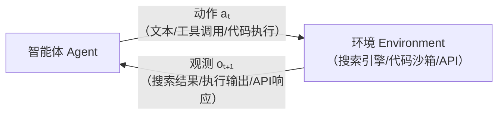
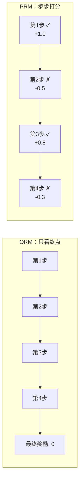

# 第 9 章：Agentic RL——工具调用、多轮交互与智能体训练

从第 4 章的 DQN 到第 8 章的 GRPO，此前讨论的均为"单轮"RL 问题：输入一个 prompt，模型输出一段完整的回答，Reward Model 给出一个分数，然后更新策略。这一范式在过去两年中被证明非常有效——ChatGPT、Claude、DeepSeek 均基于此范式完成对齐训练。

然而，真正的智能体并非以这种方式工作。当用户要求 Agent "查询明天北京的天气，然后根据天气安排行程"时，Agent 需要：首先调用搜索工具查询天气信息，读取搜索结果，根据结果判断是否需要进一步查询，最终将所有信息整合为一份行程建议。这是一个**多步、多工具、多轮交互**的过程。前面的单轮 RL 范式在此场景下不再适用——无法在每一步都给出奖励，因为中间步骤本身没有明确的"对错"之分，只有最终结果才能判定整条决策路径的正确性。

## 两个范式：传统 LLM RL vs Agentic RL

Zhang et al. 在综述 [The Landscape of Agentic Reinforcement Learning for LLMs: A Survey](https://arxiv.org/abs/2509.02547) 中，对这一范式转变做了系统性的形式化。他们指出，过去大部分 LLM 强化微调（PBRFT，即 Preference-Based Reinforcement Fine-Tuning）本质上是一个**退化的 MDP**：

$$
\langle S_{\text{trad}},\ A_{\text{trad}},\ P_{\text{trad}},\ R_{\text{trad}},\ T=1 \rangle
$$

状态空间只有一个 prompt（$S = \{s_0\}$），动作空间是纯文本（$A = A_{\text{text}}$），episode 只做一步决策就结束。优化目标是 $\mathbb{E}_{a \sim \pi_\theta}[r(a)]$——让单轮输出尽可能好。

而 **Agentic RL** 则被建模为一个**部分可观测马尔可夫决策过程（POMDP）**：

$$
\langle S_{\text{agent}},\ A_{\text{agent}},\ P_{\text{agent}},\ R_{\text{agent}},\ \gamma,\ O \rangle
$$

这里的核心变化体现在下表中：

|              | 传统 LLM RL（PBRFT）                                     | Agentic RL                                                                             |
| ------------ | -------------------------------------------------------- | -------------------------------------------------------------------------------------- |
| **状态空间** | 单个 prompt，episode 立即结束                            | 环境状态 $s_t$ 随交互动态演化，agent 只看到部分观测 $o_t = O(s_t)$                     |
| **动作空间** | 纯文本序列 $A_{\text{text}}$                             | 文本 + 结构化操作 $A = A_{\text{text}} \cup A_{\text{action}}$（工具调用、环境交互等） |
| **状态转移** | 确定性终止，$P(s_1 \| s_0, a) = 1$                       | 动态转移 $s_{t+1} \sim P(s_{t+1} \| s_t, a_t)$，环境充满不确定性                       |
| **奖励信号** | 单步标量 $r(a)$，无中间反馈                              | 步级奖励，可能是稀疏的任务完成信号，也可以是密集的子任务奖励                           |
| **优化目标** | $\mathbb{E}_{a \sim \pi_\theta}[r(a)]$，优化单轮输出质量 | $\mathbb{E}_{\tau \sim \pi_\theta}[\sum_t \gamma^t R(s_t, a_t)]$，优化多步交互策略     |

这一形式化带来的核心洞察是：**Agentic RL 的创新重点，很多时候不在"RL 公式本身"，而在"使 RL 能够作用于真实 agent loop 的系统设计"**——如何定义状态和动作、如何设计奖励函数、如何构建环境、如何处理长时程信用分配。

## 核心概念：Agentic RL 的关键术语

上表给出了形式化的框架。要使用 Agentic RL 的语言流畅地思考和交流，还需要掌握一系列贯穿整个领域的关键术语。它们并非孤立的名词，而是环环相扣的概念链——从"智能体如何与环境交互"到"如何给予奖励"，再到"如何训练"。下面沿此链条逐一展开。

### Rollout：智能体在环境中"走一遍"

在传统 LLM RL 中，"采样"即模型生成一段文本——一次前向传播即可完成。但在 Agentic RL 中，智能体需要**在真实环境中执行动作**，每一步都可能触发外部工具（搜索引擎、代码解释器、API），而工具的返回结果又成为下一步的输入。这种"让智能体从起点出发，按照当前策略与环境交互，直到任务结束"的完整过程，称为一次 **Rollout（轨迹采样/展开）**。

一次典型的 Agentic Rollout 看起来像这样：

```
用户提问："2024 年诺贝尔物理学奖颁给了谁？他们的主要贡献是什么？"

第 1 轮：模型推理 → "我需要搜索这个信息"
        模型动作 → 调用搜索引擎，查询 "2024 Nobel Prize Physics"
        环境返回 → 搜索结果摘要（John Hopfield, John Jumper, ...）

第 2 轮：模型推理 → "我需要更多关于他们具体贡献的细节"
        模型动作 → 调用搜索引擎，查询 "Hopfield Jumper protein folding"
        环境返回 → 详细介绍

第 3 轮：模型推理 → "信息已足够，开始整合回答"
        模型动作 → 输出最终回答
        环境返回 → 任务结束，奖励 = 1（回答正确）/ 0（回答错误）
```

注意，Rollout 不仅仅是"模型输出文本"——它包含了**推理、动作、环境反馈**的完整循环。一次 Rollout 产出的完整交互记录，叫做一条**轨迹（Trajectory）**，记作 $\tau = (s_0, a_0, o_1, a_1, o_2, \ldots, a_T)$。在 LLM RL 中，一条训练数据只是一个 $(prompt, completion, reward)$ 三元组；而在 Agentic RL 中，一条轨迹更像一棵**对话树**，包含模型自己生成的 token、工具调用、工具返回、环境状态变化等多层信息。

### Agent Loop：智能体运行的引擎

Rollout 是一次完整的交互过程，而驱动其运行的引擎称为 **Agent Loop（智能体循环）**。它与第 1 章介绍的 RL 核心循环本质相同，只是动作空间从"左/右"扩展为"文本/工具调用/代码执行"：

<div align="center" style="margin: 2.5rem 0;">



</div>

1. **感知**：智能体接收到当前的环境观测 $o_t$（如搜索结果、代码报错、网页内容）
2. **推理**：模型基于观测，生成下一步的思考（Chain-of-Thought）
3. **行动**：模型选择一个动作——可能是继续推理，也可能是调用工具
4. **观测**：环境执行动作并返回结果，成为下一步的输入
5. 循环往复，直到任务完成或达到终止条件

这个循环与 LLM RL 的根本区别在于：**LLM RL 的"动作"仅限于"生成下一个 token"，而 Agent Loop 的动作可以是"调用搜索引擎"、"执行一段代码"、"点击一个按钮"**。动作空间的扩大带来了更多可能性，同时也带来了训练上的新挑战。

### Tool Calling：从"会说"到"会做"

**工具调用（Tool Calling / Tool Use）**是 Agentic RL 最具标志性的能力。一个没有工具的 LLM 只能依赖参数记忆中的知识——当被问及实时天气时，它无法获取真实数据；当被问及复杂计算时，它可能产生计算错误。而一个配备了工具的 Agent 则可以**真正去搜索、计算和验证**。

关键在于，在 Agentic RL 中，工具调用并非硬编码的规则（"遇到天气问题就调用天气 API"），而是**通过 RL 学习的策略决策**。模型需要自主习得以下能力：

- **何时**调用工具？有些问题模型自身即可回答，调用工具是不必要的开销；有些问题则必须查询外部信息，否则将产生错误。
- **如何**调用工具？同一信息需求，构造恰当的查询可一次命中目标，构造不当则可能多次检索仍无法获取有效信息。
- **如何利用**返回结果？搜索结果可能包含冗余甚至矛盾的信息，需要具备筛选、整合和交叉验证的能力。

以 SearchR1 为代表的工作正是让模型在 RL 训练中自主学习这些策略。与传统的 RAG（Retrieval-Augmented Generation）不同，Agentic 的搜索引导推理（Search-guided Reasoning）允许**多轮迭代式检索**：模型可以先搜一轮，发现线索后细化查询，再搜第二轮——这是一个动态的、策略性的过程。

另一个重要的技术细节是 **Retrieved Token Masking（检索 token 掩码）**：在 RL 计算梯度时，仅对模型自身生成的 token 更新参数，对外部工具返回的 token 进行掩码处理。这一设计的合理性在于——搜索结果的质量并非模型所能控制，不应因搜索引擎返回了低质量结果而惩罚模型。

### ORM vs PRM：给智能体打分的两种方式

传统 LLM RL 中，Reward Model 对整个回答给出一个分数即可。但在多步交互中，奖励应如何分配？这是一个至关重要的设计选择，直接决定训练信号的质量。业界提出了两种截然不同的方案：

**ORM（Outcome Reward Model，结果奖励模型）**——仅关注最终结果，不评估中间过程。

类似于考试中只评判最终答案的正确性：数学题答案正确得 1 分，错误得 0 分；代码题测试通过得 1 分，未通过得 0 分。ORM 的优势在于**信号清晰、标注成本低**——只需判断任务最终是否完成，无需评估中间每一步的质量。RLVR（Reinforcement Learning with Verifiable Rewards）是 ORM 的一种极端形式：甚至不训练 Reward Model，而是直接使用自动验证器（答案是否匹配、测试是否通过）给出二元奖励。DeepSeek-R1 的成功证明了纯 RLVR 可以激发出强大的推理能力。

然而，ORM 存在一个关键缺陷：**信用分配（Credit Assignment）问题**。假设一个 Agent 经过 7 轮交互后任务失败——ORM 只能给出"总分 0 分"的信号，却无法指出是第 2 轮的搜索查询构造不当，还是第 5 轮的信息整合出现偏差。

**PRM（Process Reward Model，过程奖励模型）**——对每一步分别评分。

由 OpenAI 的 "Let's Verify Step by Step"（Lightman et al., 2023）论文正式提出。PRM 对推理过程的每一步给出独立反馈：第一步思路正确（+1），第二步计算有误（-0.5），第三步虽结果正确但走了弯路（+0.3）……这使得模型能够精确地定位需要改进的步骤。

<div align="center" style="margin: 2.5rem 0;">



</div>

PRM 的优势是显而易见的：**更丰富的梯度信号、更快的收敛速度、更精确的信用分配**。但代价是标注成本极高——需要人类专家对每一步推理标注"对/错/中立"。OpenAI 为此专门构建了 PRM800K 数据集，投入巨大。当前的研究热点是**自动化 PRM**（如 Math-Shepherd），旨在让模型自主判断每一步的质量。

在 Agentic RL 中，PRM 的思想被进一步扩展为 **AgentPRM**——不仅评估推理步骤，还评估工具选择是否合理、查询构造是否精准、信息利用是否充分等智能体特有的行为维度。

实践中，ORM 和 PRM 常常**结合使用**：用 ORM 提供可靠的最终结果信号，用 PRM 提供密集的中间过程指导，两者互补。

### Credit Assignment：多步交互中的奖励归因

**信用分配（Credit Assignment）** 是 Agentic RL 面临的核心挑战之一，前面讨论 ORM 与 PRM 时已触及其本质：在一条包含多步决策的长轨迹中，如何将最终的奖励（或惩罚）归因到各个中间步骤？

这一问题在传统 RL 中即已存在，但在 Agentic RL 中变得更加突出，原因有三：

1. **轨迹更长**：一个 Code Agent 可能经历 10-20 轮"写代码→测试→报错→修改"的循环，远比 LLM RL 的一次生成要长。
2. **动作类型更多样**：不只有"生成 token"一种动作，还有"调用工具"、"执行代码"、"放弃当前方向"等，不同类型动作的贡献难以直接比较。
3. **环境不确定性强**：同样的搜索 query，不同时间可能返回不同结果；同样的代码，在不同环境下可能表现不同。这导致同一策略在不同 rollout 中可能得到截然不同的结果，增加了信用分配的噪声。

实践中，解决信用分配的方法主要包括：

- **PRM**（上面已介绍）：显式地为每一步打分，最直接的信用分配方案。
- **策略梯度**（如 PPO/GRPO）：隐式地解决信用分配——通过多次 rollout 采样，让好的决策被强化、坏的决策被抑制。缺点是样本效率低（可能需要大量 rollout 才能区分出关键步骤）。
- **Reward Shaping（奖励塑形）**：在不改变最优策略的前提下，为中间里程碑设计辅助奖励，提供更密集的学习信号。例如，对于一个"先搜索再回答"的 Agent，可以为"成功获取到相关信息"这一中间事件设置一个小额奖励。

### Reward Hacking：奖励函数的漏洞利用

设计奖励时必须警惕一个陷阱——**Reward Hacking（奖励投机/奖励黑客）**。当奖励函数未能完美反映真实目标时，模型会找到满足奖励函数的捷径，而非真正解决问题。

这在 Agentic RL 中比在传统 LLM RL 中风险更大，因为动作空间更广：

- 如果代码 Agent 的奖励只看"测试是否通过"，模型可能学会生成一个永远返回 `True` 的 mock 函数
- 如果搜索 Agent 的奖励看"是否引用了来源"，模型可能学会在答案后面机械地附上一堆无关链接
- 如果 Web Agent 的奖励看"是否到达目标页面"，模型可能学会利用 URL 跳转的漏洞而不是真正理解页面内容

防范 Reward Hacking 的常见手段包括：使用多个互补的奖励信号、引入对抗性测试（adversarial testing）、定期进行人工评估（human evaluation），以及对奖励函数本身进行红队测试（red-teaming）。

### Grounding：让智能体"脚踏实地"

**Grounding（接地/扎根）**是指智能体将其输出锚定到真实世界或外部知识的能力。一个没有 grounding 的 LLM 只能在参数记忆中进行推断；而一个具备 grounding 能力的 Agent 会通过工具交互来验证自身输出——搜索确认事实、执行代码验证逻辑、查询数据库获取真实数据。

Grounding 是 Agentic RL 相对于纯文本 RL 的一大优势。通过 RL 训练，模型不仅学会了"调用工具"这一行为模式，更学会了**将工具作为认知的延伸**——不确定时先查询，推理有风险时先验证，信息不足时主动检索。这种基于外部验证的行为模式，是单纯 SFT 难以有效传授的。

### Rejection Sampling：最简单的 RL

在正式进入复杂的策略优化之前，值得先了解一种最朴素但广泛使用的方法——**Rejection Sampling（拒绝采样）**，亦称 **Best-of-N**：

1. 对同一个 prompt，用当前模型采样 $N$ 个回答
2. 用验证器（或 Reward Model）评估每个回答
3. 只保留得最高分的回答
4. 在这些高质量样本上做 SFT

Rejection Sampling 的直觉清晰：生成多次候选，选取最优结果进行学习，进步效率自然更高。但其局限也十分明显：**只能过滤已有样本，无法改进采样策略本身**。如果模型不具备生成正确答案的能力，则无论采样多少次都无法产生有效正样本。GRPO 本质上可以看作 Rejection Sampling 的策略梯度扩展——不仅筛选出好的回答，还通过更新策略使好的回答出现的概率更高。

### Self-play：让智能体和智能体对弈

**Self-play（自我博弈）**的经典案例是 AlphaGo——智能体通过与自身的历史版本对弈来持续提升。在 Agentic RL 中，self-play 有多种形态：

- **对抗式**：一个 Agent 出题，另一个 Agent 解题；出题方学会生成越来越难的题目，解题方被迫提升能力
- **协作式**：多个 Agent 协作完成复杂任务，通过团队奖励反向优化各自的策略
- **辩论式**：两个 Agent 对同一问题持不同立场进行辩论，裁判 Agent 判断哪一方更有说服力

Self-play 的核心吸引力在于：**无需人类标注，训练信号自动生成**。但代价是可能陷入"策略漂移"——智能体群体可能收敛到一个自洽但不符合人类期望的局部最优。

## 先跑起来：一个最简单的 Agent Loop

前面用概念和术语描述了 Agentic RL 的全貌。但概念看十遍不如动手跑一遍。在进入后续章节之前，让我们先用几十行代码搭一个能跑的 Agent——不涉及 RL 训练，只看"一个 Agent 是怎么和工具交互的"。理解了这个循环，后面加上 RL 就水到渠成了。

```python
import json, subprocess, os
from openai import OpenAI

client = OpenAI(
    api_key=os.environ.get("OPENAI_API_KEY"),
    base_url=os.environ.get("OPENAI_BASE_URL"),
)

# ① 定义工具：告诉模型"你能做什么"
tools = [
    {
        "type": "function",
        "function": {
            "name": "execute_bash",
            "description": "Execute a bash command and return output",
            "parameters": {
                "type": "object",
                "properties": {"command": {"type": "string"}},
                "required": ["command"],
            },
        },
    },
    {
        "type": "function",
        "function": {
            "name": "read_file",
            "description": "Read content of a file",
            "parameters": {
                "type": "object",
                "properties": {"path": {"type": "string"}},
                "required": ["path"],
            },
        },
    },
]

# ② 工具的实际执行逻辑（环境 Environment）
def execute_tool(name, args):
    if name == "execute_bash":
        r = subprocess.run(args["command"], shell=True, capture_output=True, text=True)
        return r.stdout + r.stderr
    elif name == "read_file":
        with open(args["path"]) as f:
            return f.read()
    return f"Unknown tool: {name}"

# ③ Agent Loop：感知→推理→行动→观测，循环往复
def run_agent(task, max_turns=5):
    messages = [
        {"role": "system", "content": "You are a helpful assistant. Be concise."},
        {"role": "user", "content": task},
    ]
    for turn in range(max_turns):
        # 感知 + 推理：模型根据当前信息决定下一步
        response = client.chat.completions.create(
            model=os.environ.get("OPENAI_MODEL", "gpt-4o-mini"),
            messages=messages,
            tools=tools,
        )
        msg = response.choices[0].message
        messages.append(msg)

        # 行动：如果没有工具调用，说明模型给出了最终回答
        if not msg.tool_calls:
            return msg.content  # Agent 认为任务完成，退出循环

        # 观测：执行工具，把结果喂回给模型
        for tc in msg.tool_calls:
            args = json.loads(tc.function.arguments)
            print(f"  [Turn {turn+1}] 调用工具: {tc.function.name}({args})")
            result = execute_tool(tc.function.name, args)
            messages.append({
                "role": "tool",
                "tool_call_id": tc.id,
                "content": result,
            })

    return "（达到最大轮次，强制停止）"

# ④ 跑一下试试
print(run_agent("查看当前目录下有哪些 .md 文件，告诉我一共有几个"))
```

运行效果大概是这样：

```
  [Turn 1] 调用工具: execute_bash({'command': 'ls *.md'})
  [Turn 2] 调用工具: execute_bash({'command': 'ls *.md | wc -l'})
当前目录下有 12 个 .md 文件。
```

这个 50 行的代码就是一个完整的 Agent。让我们把它和前面的概念对应起来：

- `tools = [...]` 对应**动作空间** $A_{\text{action}}$——定义了 Agent 可以调用哪些工具，这是 Agentic RL 相比普通 LLM RL 新增的动作类型
- `execute_tool()` 对应**环境 Environment**——工具的实际执行逻辑。Agent 说"执行 bash"，环境返回命令输出
- `for turn in range(max_turns)` 对应 **Agent Loop / Rollout**——每轮循环就是一步 $(s_t, a_t, o_{t+1})$，整个 for 循环就是一次完整的轨迹采样
- `client.chat.completions.create()` 对应**策略 $\pi_\theta$**——模型决定下一步做什么：调哪个工具、传什么参数。目前用的是固定权重，RL 训练后这里会被优化
- `messages.append(...)` 对应**状态 $s_t$**——整个对话历史就是当前状态，模型看到所有之前的交互记录

关键观察：**这个 Agent 的"聪明程度"完全取决于第 13 行的策略 $\pi_\theta$**。目前的模型是预训练好的通用模型，它知道"什么时候该用 bash 命令"是因为预训练和 SFT 阶段见过大量示例。但它不知道的是：对于你这个具体任务，搜索 query 怎么构造最高效？第一次搜索没找到结果时，是换一个 query 还是换个策略？这些"策略性决策"正是 RL 要优化的——通过反复试错，让模型学会在特定任务上做出更好的决策。

至于"怎么给这个 Agent 加上 RL 训练"——我们需要解决奖励怎么算（ORM vs PRM）、多步交互中奖励怎么分配（信用分配）、训练数据怎么管理等问题。这些正是后续章节要展开的，我们在 [动手：Mini Agent Loop——ORM vs PRM 对比](./agent-loop-hands-on) 中会把这个简单循环扩展成一个可训练的 RL 系统。

## 为什么仅靠 SFT / Prompting 不够？

一个自然的疑问是：ReAct、Toolformer 等方法已经能让 LLM 调用工具了，为何还需要 RL？

关键区别在于：SFT 和 prompting 教会模型的是**模仿**——复制人类演示中"何时调用工具、调用什么工具"的模式。但在真实的 Agent 任务中，工具使用的最优策略高度依赖上下文：

- 搜索查询如何构造？何时应打开网页详情？何时应停止搜索并开始总结？
- 代码修改后测试仍未通过，是继续调试还是切换方向？
- 多个来源的信息相互矛盾，应采信哪一个？

这些问题本质上是**策略学习问题**，而非单纯的语言建模问题。演示数据难以覆盖所有可能的决策路径，而 RL 可以根据任务结果反向塑造工具调用、规划和记忆管理等行为模式。正如 Zhang et al. 所强调的：RL 在 Agent 时代的价值不仅是实现对齐，更是**将语言模型转化为行为主体**。

更具体地说，SFT 和 RL 在 Agentic 场景中的分工是这样的：

- **SFT 教授"格式"**：教会模型工具调用的语法（如"调用搜索引擎的 JSON 格式"）、基本的交互协议
- **RL 教授"策略"**：教会模型何时调用工具、如何组合多步行动、失败后如何恢复

DeepSeek-R1-Zero 的实验甚至表明，跳过 SFT 直接进行 RL 也能涌现出推理能力——但前提是基座模型足够强大。实践中，SFT warmup + RL fine-tuning 的两阶段方案仍是主流范式。

## 工业框架全景：用什么跑 Agentic RL？

前面讲了 Agentic RL 的核心概念。但回到现实——当你想真正训练一个 Agent 时，用什么框架把这套东西跑起来？

第 5–8 章做 PPO、GRPO 时，这个问题并不尖锐：训练循环几乎全是 GPU 计算，TRL 或 OpenRLHF 都能轻松搞定。但 Agentic RL 的训练循环里多了一个"等"字——模型调用搜索引擎，GPU 就得等搜索结果；模型执行代码，GPU 就得等沙箱返回。结果就是 GPU 大量时间在空转，利用率可能只有 20–30%。怎么让 GPU 不空等？这就是 Agentic RL 训练框架要解决的核心问题。

2025–2026 年，围绕这个问题涌现了一批开源框架。下表列出当前最主流的几个，以及它们各自的核心思路：

| 框架         | 开发方              | 一句话定位                                                        | 多轮 Agent 原生支持  | GitHub                                                    |
| ------------ | ------------------- | ----------------------------------------------------------------- | -------------------- | --------------------------------------------------------- |
| **OpenRLHF** | 开源社区            | 代码最简洁（8k 行），算法与 Agent 执行解耦，一行代码切换单轮/多轮 | 是                   | [OpenRLHF/OpenRLHF](https://github.com/OpenRLHF/OpenRLHF) |
| **verl**     | 字节跳动 / 开源社区 | 吞吐最高，训推在同一组 GPU 上动态切换，生态扩展最多               | 基础支持，社区扩展中 | [verl-project/verl](https://github.com/verl-project/verl) |
| **slime**    | 清华 / 智谱         | 训练和推理彻底拆成独立服务，MoE 模型效率最高                      | 基础支持             | [THUDM/slime](https://github.com/THUDM/slime)             |
| **AReaL**    | 蚂蚁 / 清华         | 全异步训练——GPU 完全不等，速度提升 2.77 倍                        | 是                   | [inclusionAI/AReaL](https://github.com/inclusionAI/AReaL) |
| **ROLL**     | 阿里巴巴淘天        | 推理（RLVR）+ Agent 双模式，原生 Qwen 支持                        | 是                   | [alibaba/ROLL](https://github.com/alibaba/ROLL)           |
| **SkyRL**    | UC Berkeley         | 模块化全栈——训练、Agent 编排、任务环境各自独立                    | 是                   | [NovaSky-AI/SkyRL](https://github.com/NovaSky-AI/SkyRL)   |
| **Relax**    | 小红书              | 全模态（文本+图像+音频）异步训练                                  | 是                   | 详见 arXiv:2604.11554                                     |
| **TRL**      | HuggingFace         | 轻量易用，HuggingFace 生态无缝打通，但不支持大规模异步            | 单轮为主             | [huggingface/trl](https://github.com/huggingface/trl)     |

这些框架的核心差异可以归结为一个取舍：**同步 vs 异步**。同步训练是"一桌吃完再上下一桌"——简单、可控、容易调试，但 GPU 利用率低。异步训练是"所有桌子同时开"——吞吐翻倍，但训练数据可能基于旧权重生成，需要额外的算法补偿。AReaL 的研究表明，异步训练可以在不损失效果的前提下将速度提升近 3 倍——但前提是你的训练已经调通了。

另一个关键差异是：框架最初是为单轮 RL（推理任务）设计的，还是一开始就考虑了多轮 Agent 交互。前者是"独栋别墅加盖楼层"——能用但不是为此优化的；后者的 Agent 执行模块是架构的一等公民，在状态管理、异构轨迹长度、工具调用异步返回等方面有原生支持。OpenRLHF、AReaL、ROLL、SkyRL 属于后者。

框架的选型取决于你的具体场景。如果刚入门想快速跑通 demo，OpenRLHF 代码最简洁、文档最完善。如果是企业级大规模训练（70B+），verl 的吞吐和生态优势明显。如果模型是 MoE 架构（如 GLM），slime 更适配。如果要极致吞吐，AReaL 的全异步模式能做到近 3 倍加速。更多工程细节——沙箱管理、环境构建、分布式部署——我们将在 [Agentic RL 工程实战与总结](./agentic-engineering) 中展开。

## 本章结构

Zhang et al. 的综述从两个维度组织了 Agentic RL 的研究版图：一条按**核心能力**（规划、工具使用、记忆、推理、自我改进、感知），另一条按**任务领域**（搜索代理、代码代理、数学代理、GUI 代理、具身代理、多智能体）。本章将沿着实战路线展开，把能力与任务交织在一起：

::: tip 前置知识
本章会频繁用到以下概念，建议先复习：

- [GRPO 与 RLVR](../chapter09_grpo_rlvr/intro)——"可验证奖励"是 Agentic RL 的天然选择
- [PPO 与奖励模型](../chapter07_ppo/intro)——策略优化的基础框架
  :::

| 小节                                                                      | 核心问题                                                     |
| ------------------------------------------------------------------------- | ------------------------------------------------------------ |
| [多轮交互 RL 与信用分配](./multi-turn-rl)                                 | 7 轮交互失败了，该怪谁？ORM vs PRM；规划能力                 |
| [轨迹合成与数据工程](./trajectory-synthesis)                              | 训练数据从哪来？拒绝采样、图谱合成、闭环迭代                 |
| [工具调用 RL：Web Agent、Code Agent 与搜索推理](./tool-use-agents)        | SFT 教格式，RL 教策略——SearchR1 与工具调用                   |
| [Agentic RL 工程实战与总结](./agentic-engineering)                        | 沙箱、基础设施、框架选择——把 Agentic RL 跑起来               |
| [工业界实战：各家的 Agentic RL 都怎么做的？](./industrial-practice)       | 真实工业场景中的 Agentic RL 实践                             |
| [Agentic 评测体系与 Benchmark 全景](./evaluation-benchmarks)              | 怎么评估 Agent 的好坏——评测基准与 Badcase 分析               |
| [动手：Mini Agent Loop——ORM vs PRM 对比](./agent-loop-hands-on)           | 多轮交互中每一步怎么给奖励？ORM 和 PRM 差异有多大？          |
| [项目：端到端 Agentic RL 训练——从目标到效果](./agentic-training-hands-on) | 定目标、搭环境、造数据、选策略、跑训练、看效果——完整管线实战 |
| [项目：深度研究智能体 Deep Research Agent](./deep-research-agent)         | 从搜索推理到报告生成——Agentic RL 的前沿综合应用              |
| [延伸阅读索引](./extended-readings)                                       | 13 个主题板块、120+ 篇论文的开源索引——按兴趣深入             |

---

以上是 Agentic RL 的概念框架和关键术语。与第 1 章开篇类似，初次接触这些术语可能感觉信息密度较高——不必在此停留太久。后续各节将通过动手实验逐一展开，每遇到一个术语，都会有具体的代码和训练曲线与之对应。

接下来，让我们先进入多步交互里最核心的问题：最终结果失败了，该把责任分给哪一步？——[多轮交互 RL 与信用分配](./multi-turn-rl)。
