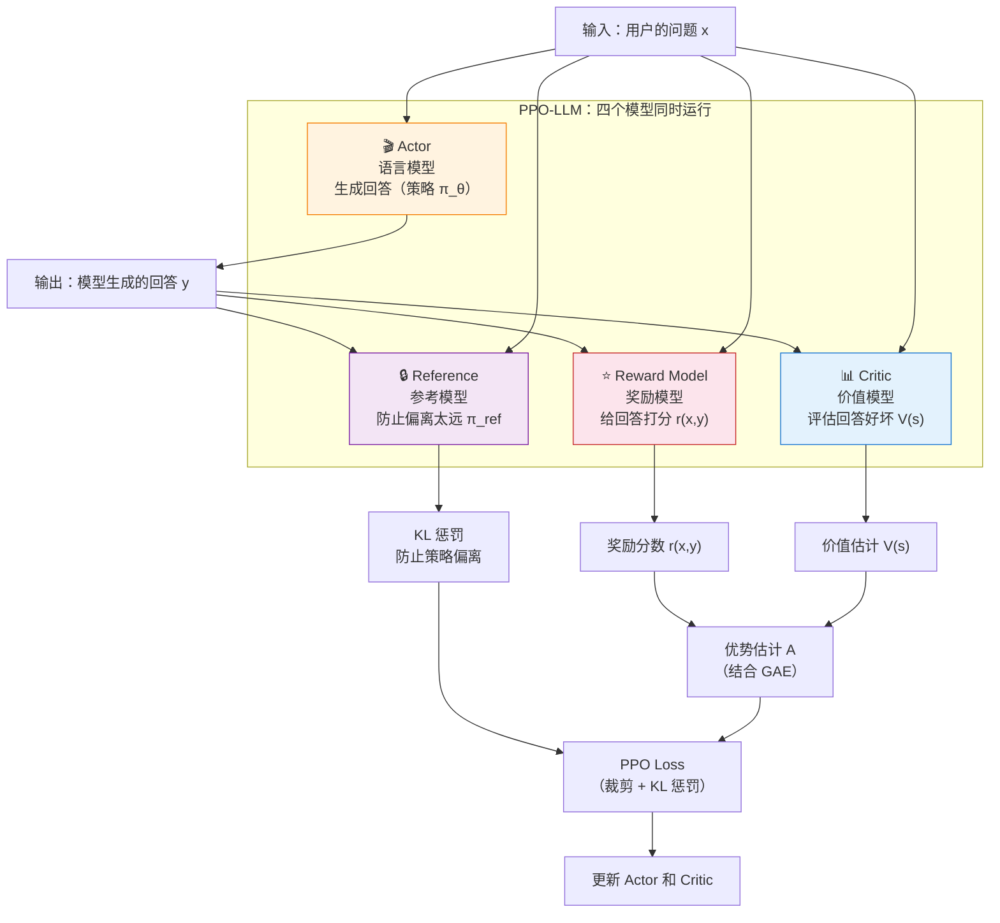

# 8.3 GAE 奖励模型

## 本节导读

**核心内容**

- 优势估计的两端：TD 用一步信息（低方差、有偏差），MC 用整段轨迹（无偏、高方差）
- GAE：用一个参数 $\lambda$ 在 TD 和 MC 之间做指数加权插值
- Reward Model：用 Bradley-Terry 模型把人类成对偏好转成标量奖励
- LLM 场景的两个新挑战：稀疏奖励（500 步生成只有 1 个评分）和四模型同台运行

上一节我们拆解了 PPO 的裁剪机制——用"裁剪"替代"KL 散度"约束策略更新（回顾：[策略更新的约束机制](./trust-region-clipping)）。但 PPO 的目标函数里 $r_t(\theta) \cdot A_t$ 还有另一半没展开：**优势 $A_t$ 怎么算？** 这就是 GAE 要解决的问题。而到了 LLM 对齐场景，环境不再自动吐奖励——**奖励从哪里来**？这就是 Reward Model 的事。

为了把这两件事讲具体，本节用一条贯穿主线：一个 5 步的 episode，只有最后一步拿到奖励 $1$，其余都是 $0$。把它当成 LLM 生成 5 个 token、只在最后一个 token 拿到评分的微缩版本：

| 步 $t$ | 即时奖励 $r_t$ | Critic 估计 $V(s_t)$ | 是否结束 |
| ------ | -------------- | -------------------- | -------- |
| 0      | 0              | 0.1                  | 否       |
| 1      | 0              | 0.2                  | 否       |
| 2      | 0              | 0.3                  | 否       |
| 3      | 0              | 0.5                  | 否       |
| 4      | 1              | 0.8                  | 是       |

接下来三节都用这张表当输入：先看 TD 和 MC 怎么各自估优势，再看 GAE 怎么把两者插值起来，最后回到 LLM 场景，看稀疏奖励为什么让这件事变难。

::: tip 本节前置知识

- [优势函数 $A(s,a) = Q - V$](../chapter09_actor_critic/advantage-function)——GAE 要估计的对象
- [TD Error $\delta = r + \gamma V(s') - V(s)$](../chapter09_actor_critic/critic-training)——GAE 的基本构建块
- [DP/MC/TD 三种方法](../chapter03_mdp/dp-mc-td)——GAE 是 TD 和 MC 的插值
- [奖励函数设计](../chapter03_mdp/reward-design)——RM 的设计思路与第 3 章的奖励塑形一脉相承
  :::

## TD 与 MC

优势函数的定义是（回顾：[第 6.1 节](../chapter09_actor_critic/advantage-function)）：

$$A(s_t, a_t) = Q(s_t, a_t) - V(s_t)$$

意思是"在这个状态下选这个动作，比按策略的平均水平好了多少"。问题在于 $Q(s_t, a_t)$ 未知——没法精确知道"做完这个动作之后未来能拿多少分"，只能估计。

第 3 章已经讨论过两种估计方式（回顾：[DP/MC/TD 对比](../chapter03_mdp/dp-mc-td)）。这里把它们的差距在 5 步 episode 上算出来。

### TD 估计 与 一步信号

TD 估计（回顾：[TD 方法](../chapter09_actor_critic/critic-training)）只用一步奖励加下一状态的 Critic 估计：

$$A_t^{\text{TD}} = r_t + \gamma V(s_{t+1}) - V(s_t) = \delta_t$$

取 $\gamma = 1$，把上面的表格逐行代入：

| $t$ | $r_t + V(s_{t+1}) - V(s_t)$ | $\delta_t$ |
| --- | --------------------------- | ---------- |
| 0   | $0 + 0.2 - 0.1$             | $0.1$      |
| 1   | $0 + 0.3 - 0.2$             | $0.1$      |
| 2   | $0 + 0.5 - 0.3$             | $0.2$      |
| 3   | $0 + 0.8 - 0.5$             | $0.3$      |
| 4   | $1 + 0 - 0.8$               | $0.2$      |

最后一步 $V(s_5) = 0$（episode 结束）。TD 估计的优势就是这一列 $\delta_t$。它的方差低——只涉及一步的随机性；但偏差高——若 Critic 的 $V$ 不准，误差会经 $\gamma V(s_{t+1})$ 直接传进 $\delta_t$。

**偏差的来源可以精确拆出来**。设 Critic 估计为 $V(s_t) = V^*(s_t) + b_t$，其中 $V^*$ 是真值、$b_t$ 是 Critic 在该状态下的误差。代入 TD：

$$\delta_t = r_t + \gamma V(s_{t+1}) - V(s_t) = \underbrace{r_t + \gamma V^*(s_{t+1}) - V^*(s_t)}_{\text{真实 TD}} + \underbrace{\gamma b_{t+1} - b_t}_{\text{Critic 偏差项}}$$

$\gamma = 1$ 且 Critic 误差近似常数（$b_t \approx b$）时偏差项为零——常数偏差在相邻状态间相互抵消。但 $\gamma < 1$ 或 Critic 在不同状态上误差差异较大时，$\gamma b_{t+1} - b_t \neq 0$，系统性污染每一步的优势估计。**Critic 越不准、状态间误差差异越大，TD 偏差越严重**。

### MC 估计 与 完整轨迹回报

MC 估计（回顾：[MC 方法](../chapter03_mdp/dp-mc-td)）要等整段 episode 跑完，用从 $t$ 开始的完整回报减去 $V(s_t)$：

$$A_t^{\text{MC}} = G_t - V(s_t), \qquad G_t = \sum_{k=0}^{\infty} \gamma^k r_{t+k}$$

先倒着累加 $G_t$（$\gamma = 1$）：

| $t$ | 后续奖励            | $G_t$ |
| --- | ------------------- | ----- |
| 4   | $r_4 = 1$           | $1.0$ |
| 3   | $r_3 + G_4 = 0 + 1$ | $1.0$ |
| 2   | $r_2 + G_3 = 0 + 1$ | $1.0$ |
| 1   | $r_1 + G_2 = 0 + 1$ | $1.0$ |
| 0   | $r_0 + G_1 = 0 + 1$ | $1.0$ |

再减去 $V(s_t)$：

| $t$ | $G_t$ | $V(s_t)$ | $A_t^{\text{MC}} = G_t - V(s_t)$ |
| --- | ----- | -------- | -------------------------------- |
| 0   | $1.0$ | $0.1$    | $0.9$                            |
| 1   | $1.0$ | $0.2$    | $0.8$                            |
| 2   | $1.0$ | $0.3$    | $0.7$                            |
| 3   | $1.0$ | $0.5$    | $0.5$                            |
| 4   | $1.0$ | $0.8$    | $0.2$                            |

MC 估计不依赖 Critic，只要采样足够多，期望上无偏。但 $G_t$ 包含从 $t$ 到终点的全部随机性，方差大；而且必须等 episode 结束才能算——LLM 场景里 episode 可能上千步。

**方差大到什么程度可以用数字感受**。假设同一 $s_0$ 出发，环境有 50% 概率进入"好结局"（终点 $r_4 = +1$）、50% 进入"坏结局"（终点 $r_4 = -1$），其余步奖励恒为 0。$V(s_0) = 0.1$ 时：

| Episode | $G_0$        | $A_0^{\text{MC}} = G_0 - V(s_0)$ |
| ------- | ------------ | -------------------------------- |
| 好结局  | $+1$         | $+0.9$                           |
| 坏结局  | $-1$         | $-1.1$                           |

两次采样给出 $+0.9$ 和 $-1.1$ 两个相差 2.0 的优势估计，方差极大。TD 则不然——$\delta_0 = V(s_1) - V(s_0)$，只要 Critic 学到了 $V(s_1)$ 的期望值，$\delta_0$ 几乎不随 episode 变化。**TD 用 Critic 的平滑性换取了方差控制，代价是把偏差源头从采样噪声转移到了 Critic 准确性**。

把两种估计放一起看，差距很清楚：

| $t$ | $A_t^{\text{TD}}$ | $A_t^{\text{MC}}$ |
| --- | ----------------- | ----------------- |
| 0   | $0.1$             | $0.9$             |
| 1   | $0.1$             | $0.8$             |
| 2   | $0.2$             | $0.7$             |
| 3   | $0.3$             | $0.5$             |
| 4   | $0.2$             | $0.2$             |

同一个 5 步 episode，TD 给早期步骤的优势只有 0.1，MC 给到了 0.9——**早期步骤的"功劳"在 TD 视角里被压扁了**，因为 Critic 还没把未来那一步的奖励反向传播回来。MC 直接把终点奖励算回到每一步，但代价是方差大、要等整段结束。

## 偏差与方差的折中

2016 年，还是 Schulman，提出 GAE（Generalized Advantage Estimation）——用一个参数 $\lambda$ 在 TD 和 MC 之间做指数加权插值：

$$\hat{A}_t^{\text{GAE}(\gamma, \lambda)} = \sum_{k=0}^{\infty} (\gamma \lambda)^k \delta_{t+k}$$

其中 $\delta_t = r_t + \gamma V(s_{t+1}) - V(s_t)$ 是 TD Error。三种极端取值：

- $\lambda = 0$：$\hat{A}_t = \delta_t$，退化为单步 TD
- $\lambda = 1$：$\hat{A}_t = \sum_{k=0}^{\infty} \gamma^k \delta_{t+k} = G_t - V(s_t)$，退化为 MC
- $0 < \lambda < 1$：远处的 $\delta_{t+k}$ 按 $(\gamma\lambda)^k$ 指数衰减

### 公式为什么是这个形式

公式看起来突兀——为什么是指数加权 $(\gamma\lambda)^k$，而不是均匀权重或线性衰减？这要从插值的真正难点说起。

朴素的方案是把 TD 和 MC 简单线性组合 $\hat{A}_t = \alpha \cdot \delta_t + (1-\alpha) \cdot (G_t - V(s_t))$。但前文已展开 $G_t - V(s_t) = \sum_{k=0}^{\infty} \gamma^k \delta_{t+k}$——**MC 不是和 TD 并列的另一信号，而是 TD 的无限累加**。把"局部信号"和"全局累加"简单加权，等于既减去 $\delta_t$ 又加回 $\delta_t$，物理意义混乱。

正确的做法是在 $\delta$ 序列的权重上做文章。把优势写成 $\hat{A}_t = \sum_{k=0}^{\infty} w_k \delta_{t+k}$，TD 对应 $w_0 = 1,\; w_{k>0} = 0$，MC 对应 $w_k = \gamma^k$。两者之间的插值，就是让权重 $w_k$ 从 $\gamma^k$ 出发，按某种衰减因子 $\lambda^k$ 压缩远处项：

$$w_k = (\gamma\lambda)^k$$

- $\lambda = 0$：除 $w_0 = 1$ 外全部归零，回到 TD
- $\lambda = 1$：$w_k = \gamma^k$，回到 MC
- $0 < \lambda < 1$：远处 $\delta$ 的贡献以 $\lambda^k$ 速度衰减，比 MC 的 $\gamma^k$ 更快淡出

指数衰减是数学上最自然的插值形式——可递推、无后效性，下一节会看到这直接带来 $O(N)$ 的递推算法。GAE 的"巧妙"之处不在公式本身，而在选择把插值作用于 $\delta$ 的累加权重而非最终值。

### 从 $O(N^2)$ 求和到 $O(N)$

按定义直接算 $\hat{A}_t$ 需要对每个 $t$ 求一次无限级数，总复杂度 $O(N^2)$。把 $\hat{A}_t$ 展开看结构：

$$\hat{A}_t = \delta_t + (\gamma\lambda)\delta_{t+1} + (\gamma\lambda)^2 \delta_{t+2} + (\gamma\lambda)^3 \delta_{t+3} + \cdots$$

把第二项起的公共因子 $\gamma\lambda$ 提出：

$$\hat{A}_t = \delta_t + \gamma\lambda \cdot \underbrace{\left[\delta_{t+1} + (\gamma\lambda)\delta_{t+2} + (\gamma\lambda)^2 \delta_{t+3} + \cdots\right]}_{\hat{A}_{t+1}}$$

方括号里的级数正是 $\hat{A}_{t+1}$（把 $\hat{A}_t$ 的 $\delta_t$ 换成 $\delta_{t+1}$ 整体右移一步）。于是：

$$\hat{A}_t = \delta_t + \gamma\lambda \cdot \hat{A}_{t+1}$$

这就是递推式。它把每个 $\hat{A}_t$ 表示为"本步 $\delta_t$ + 一步缩放后的后续优势"，从后往前扫一遍就能算出全部，总复杂度降到 $O(N)$。**指数权重的好处正是在这里兑现**——只有 $(\gamma\lambda)^k$ 这种无记忆形式才能写出如此干净的递推。

### 用递推式算

实际计算从后往前递推（因为 $\hat{A}_t$ 依赖 $\hat{A}_{t+1}$）：

$$\hat{A}_t = \delta_t + \gamma\lambda \cdot \hat{A}_{t+1}$$

把 5 步 episode 代进去，$\gamma = 1$：

| $t$ | $\delta_t$ | $\gamma\lambda \cdot \hat{A}_{t+1}$ | $\hat{A}_t$ |
| --- | ---------- | ----------------------------------- | ----------- |
| 4   | $0.2$      | $0$（终点）                         |             |
| 3   | $0.3$      | $\lambda \cdot 0.2$                 |             |
| 2   | $0.2$      | $\lambda \cdot \hat{A}_3$           |             |
| 1   | $0.1$      | $\lambda \cdot \hat{A}_2$           |             |
| 0   | $0.1$      | $\lambda \cdot \hat{A}_1$           |             |

具体数值依赖 $\lambda$，下面取四个代表性值各算一遍（$\gamma=1$）：

| $t$ | $\delta_t$ | $\lambda=0$ | $\lambda=0.5$ | $\lambda=0.95$ | $\lambda=1$ |
| --- | ---------- | ----------- | ------------- | -------------- | ----------- |
| 4   | $0.2$      | $0.20$      | $0.20$        | $0.20$         | $0.20$      |
| 3   | $0.3$      | $0.30$      | $0.40$        | $0.49$         | $0.50$      |
| 2   | $0.2$      | $0.20$      | $0.40$        | $0.67$         | $0.70$      |
| 1   | $0.1$      | $0.10$      | $0.30$        | $0.73$         | $0.80$      |
| 0   | $0.1$      | $0.10$      | $0.25$        | $0.80$         | $0.90$      |

这张表把整节的线索收在一起：

- $\lambda=0$ 那一列就是 TD 估计（前面对照表的左列）
- $\lambda=1$ 那一列就是 MC 估计（前面对照表的右列）
- $\lambda=0.95$ 在两者之间，越靠近终点越接近 MC，越靠前越被指数衰减压低

要看出"指数加权"具体长什么样，把 $\lambda=0.95$ 这一列的每个值按公式展开（$\gamma=1$）：

| $t$ | $\hat{A}_t$ 的加权展开                                  | 值     |
| --- | ------------------------------------------------------- | ------ |
| 4   | $\delta_4$                                              | $0.20$ |
| 3   | $\delta_3 + 0.95\,\delta_4$                             | $0.49$ |
| 2   | $\delta_2 + 0.95\,\delta_3 + 0.90\,\delta_4$            | $0.67$ |
| 1   | $\delta_1 + 0.95\,\delta_2 + 0.90\,\delta_3 + 0.86\,\delta_4$ | $0.73$ |
| 0   | $\delta_0 + 0.95\,\delta_1 + 0.90\,\delta_2 + 0.86\,\delta_3 + 0.81\,\delta_4$ | $0.80$ |

权重从 $1$ 沿 $0.95 \to 0.90 \to 0.86 \to 0.81$ 几何衰减，每多回传一步打 0.95 折。终点奖励 $\delta_4 = 0.2$ 经过 4 步衰减后仍有 $0.81 \times 0.2 \approx 0.16$ 的贡献传到 $\hat{A}_0$——这就是"信度回传"在数字上的样子。

随着 $\lambda$ 增大，早期步骤的优势从 $0.1$ 一路爬到 $0.9$——**信度从最后一步逐步回传到每一步**，但代价是方差同步上升（远处 $\delta$ 的随机性被加进来）。PPO 工程上的默认值通常是 $\lambda = 0.95$，偏向 MC 一侧，用一点偏差换方差的显著下降。

| $\lambda$ 值 | 等价于 | 偏差 | 方差     | 适用场景                  |
| ------------ | ------ | ---- | -------- | ------------------------- |
| 0.0          | 纯 TD  | 高   | 低       | 数据稀疏、Critic 不准     |
| 0.9          | 偏 TD  | 中等 | 中等偏低 | 通用场景                  |
| 0.95         | 均衡   | 较低 | 中等     | **PPO 默认值**            |
| 0.99         | 偏 MC  | 低   | 较高     | Critic 准确、需要精细评估 |
| 1.0          | 纯 MC  | 无   | 高       | 短 episode、数据充足      |

```python
# ==========================================
# 手动实现 GAE 计算
# ==========================================
import numpy as np

def compute_gae(rewards, values, dones, gamma=0.99, lam=0.95):
    """
    计算 GAE（广义优势估计）

    参数:
        rewards: 每一步的即时奖励列表
        values: Critic 对每个状态的估计值 V(s)
        dones: 每一步是否结束
        gamma: 折扣因子
        lam: GAE 的 λ 参数

    返回:
        advantages: 每一步的优势估计
        returns: 每一步的目标回报（用于训练 Critic）
    """
    advantages = []
    gae = 0  # 累积的 GAE 值

    # 从后往前计算（因为 Â_t 依赖后续的 δ）
    for t in reversed(range(len(rewards))):
        if t == len(rewards) - 1:
            next_value = 0  # 最后一步的下一个状态价值为 0
        else:
            next_value = values[t + 1]

        # TD Error: δ_t = r_t + γ * V(s_{t+1}) - V(s_t)
        delta = rewards[t] + gamma * next_value * (1 - dones[t]) - values[t]

        # GAE 累积：Â_t = δ_t + γλ * δ_{t+1} + (γλ)² * δ_{t+2} + ...
        gae = delta + gamma * lam * (1 - dones[t]) * gae
        advantages.insert(0, gae)

    # 目标回报 = 优势 + 价值估计
    advantages = np.array(advantages)
    returns = advantages + np.array(values[:len(rewards)])

    return advantages, returns

# 一个 5 步的 episode
rewards = [0.0, 0.0, 0.0, 0.0, 1.0]  # 只有最后一步有奖励
values  = [0.1, 0.2, 0.3, 0.5, 0.8]  # Critic 的估计值
dones   = [0,   0,   0,   0,   1  ]  # 只有最后一步结束

advantages, returns = compute_gae(rewards, values, dones)
print("优势估计:", advantages)
print("目标回报:", returns)
```

运行结果（$\gamma = 0.99$、$\lambda = 0.95$，与正文 $\gamma = 1$ 表格略有差异）：

```
优势估计: [0.6203 0.4951 0.4159 0.3222 0.2   ]
目标回报: [0.7203 0.6951 0.7159 0.8222 1.0   ]
```

注意 $t = 0$ 处的优势 $0.62$ 比 $t = 4$ 处的 $0.20$ 还大——终点奖励 $r_4 = 1$ 通过 GAE 的指数衰减一路回传到起点，而 $t = 4$ 只看到自己那一步的 $\delta_4 = 1 - 0.8 = 0.2$。这正是 GAE 与纯 TD 的关键区别：**让序列前段的 token 也拿到非零优势信号**。如果换成 $\lambda = 0$，整列优势退化为 $[0.1, 0.1, 0.2, 0.3, 0.2]$（前文 TD 列），起点几乎没信号。`returns` 列则把优势加回 $V(s_t)$，用作 Critic 的回归目标——它要把"未来回报"重建出来，确保下一步 $\delta$ 的基准 $V(s_t)$ 更准。

## 奖励模型

游戏环境（CartPole、LunarLander）里，奖励由环境规则直接给出——着陆得分、坠毁扣分。LLM 对齐场景没有这样的规则来源："请帮我写一首诗"对应的回答值多少分，没有客观答案。这一节的 Reward Model（RM）就是要把人类判断转成标量奖励。

### 主观对齐与客观推理

LLM 对齐有两条强化路径：

- **主观对齐**（礼貌、安全、有帮助）：没有客观对错标准，必须通过人类偏好训练 RM
- **客观推理**（数学、代码）：有明确规则校验，可以直接用规则奖励（[第 7 章 RLVR](../chapter18_grpo/rlvr) 会详细讲）

本章聚焦主观对齐场景——这也是 PPO 在 LLM 对齐中最经典的应用。

### Bradley-Terry 模型

人类很难给一个回答打绝对分数（"这个回答我给 87 分"），但很容易做比较（"回答 A 比回答 B 好"）。**Bradley-Terry 模型**把成对比较转化为绝对分数：

$$P(y_w > y_l \mid x) = \sigma(r(x, y_w) - r(x, y_l))$$

其中 $r(x, y)$ 是 RM 给"问题 $x$ 的回答 $y$"打的分数，$\sigma$ 是 Sigmoid 函数。两个回答的分数差越大，高分者被选中的概率越接近 1。

### 训练 RM 的流程

```python
# ==========================================
# RM 训练示意（简化版）
# ==========================================
# 每个样本包含 prompt + 好回答 + 坏回答
# training_data = [
#     {"prompt": "xxx", "chosen": "好回答", "rejected": "坏回答"},
#     ...
# ]

# RM 的损失函数（Bradley-Terry 偏好损失）
def reward_model_loss(rm, prompt, chosen, rejected):
    """
    rm: 奖励模型，输入 (prompt, response)，输出一个标量分数
    """
    r_chosen = rm(prompt, chosen)     # 好回答的分数
    r_rejected = rm(prompt, rejected) # 坏回答的分数

    # 我们希望 r_chosen > r_rejected
    # 用 Bradley-Terry 模型：最大化 P(chosen > rejected)
    loss = -torch.log(torch.sigmoid(r_chosen - r_rejected))
    return loss.mean()
```

### RM 的三大痛点

训练一个好的 RM 是整个 RLHF 流程中最沉重的负担：

1. **标注成本极高**：需要成千上万的偏好对，每对都需要人工比较两个回答的质量。OpenAI 训练 InstructGPT 时雇佣了约 40 名标注员，标注了数万条偏好数据。

2. **奖励作弊（Reward Hacking）**：RM 学到的不一定是"什么是好的回答"，而可能是"什么是看起来好的回答"。模型可能学会拉长回答（RM 偏爱长回答）、堆砌专业术语（看起来更有道理）、或者用格式掩盖内容的空洞。结果是奖励分数一路上升，人类评估员却觉得回答质量在下降。

3. **分布漂移**：RM 是在旧策略生成的数据上训练的。策略经过 RL 训练后，生成的回答分布已经改变——RM 对这些"新回答"的评分可能不再可靠，相当于裁判的训练集和实战场景脱节。

## 稀疏奖励与信用分配

LLM 生成一个回答可能需要输出 500 个 token——RL 视角下相当于 500 步的连续决策序列。RM 只在**最后一个 token** 处给出一个评分。这是最极端的稀疏奖励：500 步决策、1 个奖励信号。

前面那个 5 步 episode 就是这种结构的微缩版：奖励只在 $t=4$ 出现，前面 4 步的奖励都是 0。**这 4 步里，到底是哪一步对最终拿到 1 分有贡献？** 这就是**信用分配（Credit Assignment）** 问题。

回头看 GAE 那张四列对比表。$\lambda=0$（纯 TD）时，前 4 步的优势只有 $\delta_t$ 这么多——和终点奖励几乎没关联；$\lambda=0.95$ 时，$t=0$ 处的优势爬到 $0.80$——终点奖励被回传到了序列起点。**GAE 就是 PPO 的信用分配工具**：通过调节 $\lambda$，决定"把最后那个奖励往回分多少给前面的 token"。

形式上，PPO 的 token 级策略梯度写成

$$\nabla_\theta L \propto A_t \cdot \nabla_\theta \log \pi_\theta(a_t \mid s_t)$$

每个 token 的对数概率乘以它对应的优势 $A_t$——优势大的 token 被强化、优势小的被弱化。再叠加 KL 散度惩罚（防止策略偏离参考模型太远），PPO 在 token 粒度上完成了一次相对稳定的信用分配。

## PPO 在 LLM 对齐中的完整图景

当 PPO 用于 LLM 对齐时，需要**四个模型同时运行**——这在工程上极其壮观，也极其吃资源：



每个模型的角色：

| 模型         | 角色                             | 大小            | 显存占用 |
| ------------ | -------------------------------- | --------------- | -------- |
| Actor        | 正在训练的语言模型，生成回答     | 7B-70B          | 最大     |
| Critic       | 价值网络，评估回答好坏           | 与 Actor 同等   | 大       |
| Reference    | 冻结的原始模型，提供 KL 惩罚基线 | 与 Actor 同等   | 大       |
| Reward Model | 给回答打分的裁判模型             | 通常比 Actor 小 | 中等     |

四个模型同时塞进显存，这就是 RLHF 的工程难度。对于 7B 模型，至少需要 4 张 A100（80GB）；对于 70B 模型，可能需要 16-32 张 A100。而且这还没算上前面的 SFT 和 RM 训练阶段。

PPO 在游戏环境和 LLM 对齐中的核心机制完全一致——裁剪、GAE、重要性采样。但 LLM 场景引入了三个额外的挑战：

1. **需要训练一个 RM**——游戏环境自带奖励函数，LLM 没有
2. **稀疏奖励**——500 步生成只有 1 个奖励信号
3. **资源消耗巨大**——四个大模型同时运行

其中，RM 是最大的工程瓶颈。它需要大量人工标注，容易被 hack，而且会随着策略更新而过时。一个自然的疑问是：**能不能不用 RM？**

<details>
<summary>思考题：如果 RM 被训练得"太好"（在训练集上完美区分好回答和坏回答），反而可能导致什么问题？</summary>

RM 在训练集上表现完美可能意味着**过拟合**。过拟合的 RM 会记住训练集中每条数据的特征（比如"回答里包含'很高兴为您服务'就是好的"），而不是学到真正的偏好模式。

这会导致两个问题：

1. **奖励作弊（Reward Hacking）**：模型很快就会发现 RM 的"偏好模式"（比如"说长话就能得高分"），然后专门迎合这些模式，而不是真正提升回答质量。你会看到 Reward 分数一路上升，但人类评估员觉得回答质量在下降。

2. **泛化能力差**：当策略更新后生成的新回答不在训练分布内，过拟合的 RM 可能给出完全错误的评分——对从未见过的回答类型，它的判断可能和随机猜差不多。

这就是为什么 RM 的训练需要非常小心地控制容量和正则化——宁可 RM 稍微"钝"一点，也不要让它"太聪明"。

</details>

<details>
<summary>思考题：Critic 完全随机（输出毫无意义）时，GAE 在 $\lambda=0$ 和 $\lambda=1$ 下分别退化为什么？哪种更可用？</summary>

$\lambda=0$ 时 $\hat{A}_t = \delta_t = r_t + \gamma V(s_{t+1}) - V(s_t)$。Critic 随机意味着 $V$ 是噪声，$\delta_t$ 也是噪声——**优势估计完全无意义**。

$\lambda=1$ 时 $\hat{A}_t = G_t - V(s_t)$。$V(s_t)$ 是噪声，但 $G_t$ 是真实回报——GAE 退化为**带噪声 baseline 的 MC**，主体信号还在，相当于把 $V(s_t)$ 当成一个无关紧要的常数偏移。

结论：$\lambda=1$ 时 GAE 对 Critic 失效更鲁棒。这也是工程上倾向用较大 $\lambda$（如 0.95）的一个原因：**它对 Critic 质量的依赖更弱——Critic 没学好时自动退化到 MC**。反过来，$\lambda=0$ 把全部赌注押在 Critic 上，Critic 一坏全坏。

代价是 $\lambda=1$ 时方差也最大。$\lambda$ 的选择本质上是在"Critic 准不准"和"采样噪声大不大"之间找平衡点——这就是 0.95 成为默认值的根本理由。

</details>

**RM 是 PPO 在 LLM 对齐中最沉重的负担——训练它需要大量标注，维护它需要大量显存，信任它需要冒 reward hacking 的风险。能不能跳过这一步？** 下一章我们就会看到，DPO 给出了一个漂亮的答案——[第 7 章：DPO——绕过奖励模型的魔法](../chapter17_dpo/intro)。
